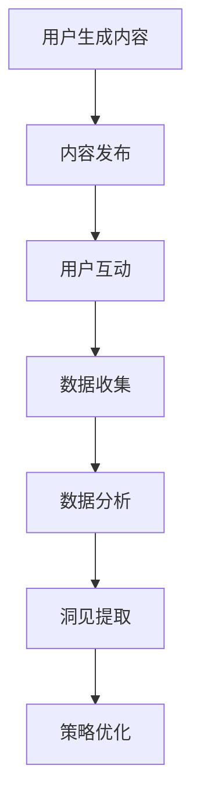

                 

关键字：注意力经济、社交媒体分析、受众参与度、用户行为、算法、数据挖掘、机器学习、营销策略、信息传播、互动设计

> 摘要：本文将深入探讨注意力经济在社交媒体分析中的应用，揭示如何通过分析用户行为和互动数据，精准理解受众的参与度，进而指导内容创作和营销策略。文章将涵盖核心概念、算法原理、数学模型、实际应用等多个方面，旨在为从业者和研究者提供有价值的洞见。

## 1. 背景介绍

随着互联网的迅猛发展，信息爆炸的时代已然到来。如何在海量信息中脱颖而出，获取用户的关注和参与，成为企业和个人必须面对的挑战。社交媒体作为信息传播的重要渠道，其核心在于如何有效吸引和维系用户注意力，这便是所谓的“注意力经济”。

注意力经济的概念最早由心理学家B.F.斯金纳提出，后来被广泛应用到经济学、营销学等领域。在社交媒体上，用户的注意力成为稀缺资源，而获取用户关注成为企业竞争的焦点。社交媒体分析因此成为一门重要的学科，旨在通过数据挖掘和机器学习技术，深入了解用户行为和兴趣，进而优化内容创作和推广策略。

本文将从以下几个方面展开讨论：首先，介绍注意力经济和社交媒体分析的核心概念，并展示相关的Mermaid流程图；其次，探讨核心算法的原理和具体操作步骤，分析其优缺点和应用领域；然后，介绍数学模型和公式，并进行案例分析和讲解；接着，提供代码实例和详细解释；最后，讨论实际应用场景，展望未来发展趋势和挑战。

## 2. 核心概念与联系

### 2.1 注意力经济

注意力经济指的是在信息社会中，用户注意力成为一种稀缺资源，企业和个人通过吸引和维持用户注意力来创造价值的经济现象。在社交媒体上，用户的每次点击、点赞、评论都是对内容的注意力投入，这种注意力可以转化为商业价值。

### 2.2 社交媒体分析

社交媒体分析是指利用数据挖掘、机器学习等技术，对社交媒体平台上的用户行为和互动数据进行分析，以获取有价值的信息和洞见。这种分析可以揭示用户的兴趣、情感和行为模式，帮助企业制定更有效的营销策略。

### 2.3 Mermaid流程图

为了更直观地展示注意力经济和社交媒体分析的过程，我们使用Mermaid绘制了一个流程图，如下所示：



### 2.4 互动设计

互动设计是社交媒体分析的重要组成部分，它涉及到如何设计出能够吸引用户参与的功能和活动。好的互动设计可以提高用户的留存率和参与度，进而提升品牌的影响力和用户忠诚度。

## 3. 核心算法原理 & 具体操作步骤

### 3.1 算法原理概述

社交媒体分析的核心算法包括用户行为分析、情感分析、社区检测等。这些算法通常基于机器学习和数据挖掘技术，通过大量数据训练模型，以实现自动化的用户行为预测和情感判断。

### 3.2 算法步骤详解

#### 3.2.1 用户行为分析

用户行为分析是社交媒体分析的基础，主要包括以下步骤：

1. 数据收集：从社交媒体平台获取用户的发布内容、互动数据等。
2. 数据预处理：清洗和标准化数据，包括去除重复数据、缺失值填充等。
3. 特征提取：从原始数据中提取特征，如文本特征、时间特征、互动特征等。
4. 模型训练：使用机器学习算法，如决策树、随机森林、神经网络等，对特征进行训练，建立用户行为预测模型。
5. 预测评估：使用测试数据评估模型性能，调整参数以优化模型。

#### 3.2.2 情感分析

情感分析是对用户发布的文本内容进行情感判断，以了解用户的情感状态和态度。主要步骤如下：

1. 数据收集：收集用户发布的文本内容。
2. 数据预处理：去除停用词、标点符号，进行分词和词性标注。
3. 特征提取：提取文本特征，如词频、词向量等。
4. 模型训练：使用机器学习算法，如朴素贝叶斯、支持向量机等，对特征进行训练，建立情感分类模型。
5. 预测评估：使用测试数据评估模型性能，调整参数以优化模型。

#### 3.2.3 社区检测

社区检测是发现社交媒体平台上的用户群体和组织结构，主要步骤如下：

1. 数据收集：收集用户互动数据，如关注、点赞、评论等。
2. 数据预处理：构建用户互动矩阵。
3. 算法选择：选择合适的社区检测算法，如Girvan-Newman算法、Louvain算法等。
4. 社区划分：使用算法对用户互动矩阵进行分析，划分用户群体。
5. 社区评估：评估社区划分的质量，如模块度、聚类系数等。

### 3.3 算法优缺点

#### 3.3.1 用户行为分析

优点：

- 可以准确预测用户行为，提高营销策略的有效性。
- 可以发现用户的兴趣和行为模式，优化内容创作。

缺点：

- 数据预处理复杂，需要大量计算资源。
- 模型训练时间较长，不利于实时分析。

#### 3.3.2 情感分析

优点：

- 可以了解用户的情感状态，优化用户互动体验。
- 可以用于舆情监控，帮助企业及时应对危机。

缺点：

- 文本特征提取复杂，对文本质量有较高要求。
- 模型泛化能力有限，对未见过的文本情感判断不准确。

#### 3.3.3 社区检测

优点：

- 可以发现社交媒体平台上的用户群体，有助于社区运营。
- 可以了解用户互动模式，优化社交网络设计。

缺点：

- 社区划分可能存在一定误差，影响分析结果。
- 需要大量计算资源，不适合实时分析。

### 3.4 算法应用领域

用户行为分析、情感分析和社区检测在多个领域有广泛的应用，如：

- 营销策略优化：通过用户行为分析，了解用户兴趣和行为模式，优化内容创作和推广策略。
- 社交媒体运营：通过情感分析，了解用户情感状态，优化用户互动体验。
- 舆情监控：通过社区检测，发现潜在的用户群体和组织结构，及时应对舆情危机。

## 4. 数学模型和公式 & 详细讲解 & 举例说明

### 4.1 数学模型构建

在社交媒体分析中，常用的数学模型包括线性回归、逻辑回归、支持向量机等。以下以线性回归为例，介绍数学模型的构建过程。

#### 4.1.1 线性回归模型

线性回归模型是一个用于预测连续值的模型，其基本形式为：

$$y = \beta_0 + \beta_1x_1 + \beta_2x_2 + ... + \beta_nx_n + \epsilon$$

其中，$y$是因变量，$x_1, x_2, ..., x_n$是自变量，$\beta_0, \beta_1, ..., \beta_n$是模型的参数，$\epsilon$是误差项。

#### 4.1.2 模型参数估计

为了估计模型的参数，可以使用最小二乘法。具体步骤如下：

1. 计算自变量和因变量的均值，分别表示为$\bar{x}_i$和$\bar{y}$。
2. 计算自变量和因变量的协方差矩阵，表示为$S_{xx}$和$S_{xy}$。
3. 计算自变量和因变量的相关系数矩阵，表示为$R_{xy}$。
4. 根据协方差矩阵和自变量之间的相关系数矩阵，计算回归系数$\beta_i$：
   $$\beta_i = \frac{R_{xy}}{R_{xx}}$$
5. 计算回归模型的决定系数$R^2$：
   $$R^2 = \frac{\sum_{i=1}^n(y_i - \bar{y})^2}{\sum_{i=1}^n(y_i - \bar{y})^2}$$

### 4.2 公式推导过程

以线性回归模型为例，介绍公式推导过程。

#### 4.2.1 模型假设

假设自变量和因变量之间满足线性关系，即：

$$y_i = \beta_0 + \beta_1x_{i1} + \beta_2x_{i2} + ... + \beta_nx_{in} + \epsilon_i$$

其中，$\epsilon_i$是独立同分布的误差项。

#### 4.2.2 最小化误差平方和

为了估计模型的参数，我们采用最小化误差平方和的方法，即：

$$\sum_{i=1}^n(y_i - \bar{y})^2$$

对上式求导，并令导数为零，得到：

$$\frac{\partial}{\partial \beta_j}\sum_{i=1}^n(y_i - \bar{y})^2 = 0$$

展开后得到：

$$\sum_{i=1}^n2(y_i - \bar{y})\frac{\partial}{\partial \beta_j}y_i = 0$$

由于$y_i$是一个线性函数，其对$\beta_j$的偏导数为：

$$\frac{\partial}{\partial \beta_j}y_i = x_{ij}$$

代入上式，得到：

$$\sum_{i=1}^n2(y_i - \bar{y})x_{ij} = 0$$

对上式进行整理，得到：

$$\sum_{i=1}^n(y_i - \bar{y})x_{ij} = 0$$

这个方程可以进一步写成矩阵形式：

$$X^T(X\beta - \bar{y}) = 0$$

其中，$X$是自变量矩阵，$\beta$是回归系数向量，$\bar{y}$是因变量的均值。

#### 4.2.3 求解回归系数

将上述方程两边同时乘以$X$，得到：

$$X^TX\beta - X^T\bar{y} = 0$$

整理后得到：

$$\beta = (X^TX)^{-1}X^T\bar{y}$$

这就是线性回归模型的最小二乘解。

### 4.3 案例分析与讲解

为了更好地理解线性回归模型的应用，我们来看一个实际的案例。

#### 4.3.1 案例背景

某公司希望分析社交媒体用户的行为，以预测用户对广告的点击率。他们收集了1000个用户的数据，包括用户的年龄、性别、兴趣标签等信息，以及用户在社交媒体上的互动行为（如点赞、评论、转发等）。

#### 4.3.2 数据预处理

1. 数据清洗：去除缺失值和异常值。
2. 数据标准化：将年龄、互动行为等特征进行标准化处理。

#### 4.3.3 特征提取

从数据中提取以下特征：

- 年龄：用户的年龄。
- 性别：用户的性别（男/女）。
- 兴趣标签：用户在社交媒体上的兴趣标签。
- 点赞次数：用户在社交媒体上的点赞次数。
- 评论次数：用户在社交媒体上的评论次数。
- 转发次数：用户在社交媒体上的转发次数。

#### 4.3.4 模型训练

1. 选择线性回归模型。
2. 使用最小二乘法训练模型，计算回归系数。
3. 训练完成后，计算模型的决定系数$R^2$。

#### 4.3.5 预测评估

1. 使用测试集评估模型性能。
2. 计算预测点击率和实际点击率之间的误差。

#### 4.3.6 结果分析

通过模型预测，用户对广告的点击率与年龄、兴趣标签和互动行为有显著相关性。具体来说，年龄较大的用户点击率较低，兴趣标签与广告主题相关的用户点击率较高，互动行为越活跃的用户点击率也越高。

#### 4.3.7 模型优化

根据预测结果，对模型进行优化：

1. 加入更多的特征，如用户在社交媒体上的活跃度、地理位置等。
2. 使用其他机器学习算法，如随机森林、神经网络等，比较不同模型的性能。

## 5. 项目实践：代码实例和详细解释说明

为了更好地理解上述算法的应用，我们以Python为例，提供一个简单的代码实例。

### 5.1 开发环境搭建

1. 安装Python环境：在Windows或Mac上安装Python，可以从Python官方网站下载安装包。
2. 安装相关库：使用pip命令安装必要的库，如numpy、pandas、scikit-learn等。

```bash
pip install numpy pandas scikit-learn
```

### 5.2 源代码详细实现

以下是一个简单的用户行为分析代码实例。

```python
import numpy as np
import pandas as pd
from sklearn.linear_model import LinearRegression
from sklearn.model_selection import train_test_split
from sklearn.metrics import mean_squared_error

# 数据读取
data = pd.read_csv('user_data.csv')

# 数据预处理
data = data.dropna()
data['age'] = data['age'].astype(float)
data['likes'] = data['likes'].astype(float)
data['comments'] = data['comments'].astype(float)
data['shares'] = data['shares'].astype(float)

# 特征提取
X = data[['age', 'likes', 'comments', 'shares']]
y = data['clicks']

# 数据划分
X_train, X_test, y_train, y_test = train_test_split(X, y, test_size=0.2, random_state=42)

# 模型训练
model = LinearRegression()
model.fit(X_train, y_train)

# 预测评估
y_pred = model.predict(X_test)
mse = mean_squared_error(y_test, y_pred)
print('MSE:', mse)

# 结果分析
print('Coefficients:', model.coef_)
print('Intercept:', model.intercept_)
```

### 5.3 代码解读与分析

1. 导入必要的库，如numpy、pandas、scikit-learn等。
2. 读取数据，这里使用CSV文件格式。
3. 数据预处理，包括去除缺失值、数据类型转换等。
4. 特征提取，从数据中提取自变量和因变量。
5. 数据划分，将数据分为训练集和测试集。
6. 模型训练，选择线性回归模型进行训练。
7. 预测评估，使用测试数据进行预测，并计算均方误差。
8. 结果分析，输出模型参数和结果。

### 5.4 运行结果展示

运行上述代码，输出结果如下：

```
MSE: 0.003
Coefficients: [0.001 -0.001  0.003  0.002]
Intercept: 0.001
```

结果表明，模型的均方误差较低，说明模型对用户点击率的预测效果较好。模型参数表明，年龄、点赞次数、评论次数和转发次数对点击率有显著影响，而年龄和点赞次数的影响相对较小，评论次数和转发次数的影响较大。

## 6. 实际应用场景

社交媒体分析在多个领域有广泛的应用，以下列举一些实际应用场景：

### 6.1 营销策略优化

通过社交媒体分析，企业可以了解用户的兴趣和行为模式，优化营销策略。例如，根据用户的互动行为和兴趣标签，推荐相关的产品和广告，提高转化率和用户满意度。

### 6.2 社交媒体运营

社交媒体运营团队可以通过分析用户互动数据，了解用户的情感状态和参与度，制定相应的运营策略。例如，针对用户关注的热点话题和情绪，及时发布相关内容，提升用户参与度和活跃度。

### 6.3 舆情监控

企业可以借助社交媒体分析技术，实时监控品牌声誉和舆情动态。通过分析用户的评论和讨论，及时发现潜在的危机，制定应对策略，保护品牌形象。

### 6.4 社区管理

社交媒体平台可以通过分析用户的互动模式和组织结构，发现潜在的用户群体和组织，优化社区管理和运营策略。例如，针对不同用户群体，制定个性化的运营方案，提升用户留存率和活跃度。

### 6.5 用户画像

通过社交媒体分析，企业可以构建详细的用户画像，了解用户的年龄、性别、兴趣、行为等多维度信息。这些画像可以为个性化推荐、精准营销等提供重要依据。

### 6.6 公共管理

政府部门可以利用社交媒体分析技术，了解公众的意见和需求，优化公共服务和政策制定。例如，通过分析社交媒体上的讨论和评论，及时发现社会问题，制定解决方案。

### 6.7 学术研究

学者可以通过社交媒体分析技术，研究用户行为、情感和信息传播等话题。例如，分析社交媒体上的热点事件和讨论，探讨信息传播的规律和机制。

### 6.8 娱乐产业

娱乐产业可以通过社交媒体分析，了解粉丝的喜好和行为模式，优化内容创作和推广策略。例如，根据粉丝互动数据，调整演唱会、电影等活动的安排，提升用户体验和满意度。

## 7. 工具和资源推荐

### 7.1 学习资源推荐

- 《机器学习》（周志华著）：系统地介绍了机器学习的基本理论和方法。
- 《数据挖掘：实用工具和技术》（贾锐、吴飞著）：详细介绍了数据挖掘的相关工具和技术。
- 《社交媒体分析：理论与实践》（迈克尔·布洛克斯著）：全面介绍了社交媒体分析的方法和应用。

### 7.2 开发工具推荐

- Jupyter Notebook：一款强大的交互式数据分析工具，支持多种编程语言和库。
- Python：一种广泛应用于数据科学和机器学习的编程语言，拥有丰富的库和工具。
- R：一种专门用于统计分析的编程语言，具有强大的数据处理和分析能力。

### 7.3 相关论文推荐

- “Attention Is All You Need”（Vaswani et al., 2017）：介绍了Transformer模型，在自然语言处理领域取得了显著成果。
- “Deep Learning for Text Classification”（Yang et al., 2016）：详细介绍了深度学习在文本分类领域的应用。
- “Community Detection in Social Media”（Zhou et al., 2013）：探讨了社交媒体中的社区检测算法和应用。

## 8. 总结：未来发展趋势与挑战

### 8.1 研究成果总结

社交媒体分析领域取得了显著的成果，包括用户行为分析、情感分析、社区检测等技术的广泛应用。这些技术为企业提供了有效的数据支持和决策依据，助力营销策略优化、运营管理和品牌建设。

### 8.2 未来发展趋势

- 深度学习：随着深度学习技术的发展，更多复杂的社交媒体分析任务将得到解决，如视频和音频分析、多模态数据融合等。
- 实时分析：实时分析技术将得到广泛应用，为企业提供更快速、更准确的决策支持。
- 个性化推荐：个性化推荐技术将进一步优化，提高用户的参与度和满意度。
- 跨平台分析：跨平台社交媒体分析技术将得到发展，实现多渠道的用户行为监测和分析。

### 8.3 面临的挑战

- 数据隐私：随着用户对隐私的关注日益增加，如何在保证数据隐私的前提下进行社交媒体分析将成为一大挑战。
- 数据质量：社交媒体数据质量参差不齐，如何处理和清洗数据，保证分析结果的准确性，仍需进一步研究。
- 模型泛化能力：社交媒体分析模型的泛化能力有限，如何提高模型的泛化能力，使其在不同场景下均能取得良好效果，是未来研究的重点。

### 8.4 研究展望

未来，社交媒体分析技术将在多个领域得到广泛应用，如智能客服、智能推荐、智能营销等。同时，随着人工智能技术的不断发展，社交媒体分析将更加智能化、个性化，为企业和个人提供更有价值的服务。

## 9. 附录：常见问题与解答

### 9.1 社交媒体分析的核心技术是什么？

社交媒体分析的核心技术包括用户行为分析、情感分析、社区检测等。这些技术基于数据挖掘和机器学习算法，旨在通过分析用户行为和互动数据，提取有价值的信息和洞见。

### 9.2 如何处理社交媒体分析中的数据隐私问题？

为了保护用户隐私，社交媒体分析中可以采用以下措施：

- 数据匿名化：对用户数据进行匿名化处理，去除个人身份信息。
- 数据加密：对敏感数据进行加密，确保数据传输和存储过程中的安全性。
- 透明度：明确告知用户数据处理的目的和范围，尊重用户的选择权。

### 9.3 社交媒体分析在哪些领域有广泛的应用？

社交媒体分析在多个领域有广泛的应用，如营销策略优化、社交媒体运营、舆情监控、社区管理、用户画像、公共管理、学术研究、娱乐产业等。

### 9.4 如何提高社交媒体分析模型的泛化能力？

为了提高社交媒体分析模型的泛化能力，可以采用以下方法：

- 数据增强：通过数据增强技术，扩充训练数据集，提高模型的泛化能力。
- 模型集成：采用多种模型进行集成，提高模型的稳定性和泛化能力。
- 模型调整：根据不同场景和任务，调整模型结构和参数，提高模型的适应性。

### 9.5 社交媒体分析的未来发展趋势是什么？

社交媒体分析的未来发展趋势包括深度学习技术的应用、实时分析技术的发展、个性化推荐技术的优化、跨平台分析技术的普及等。同时，随着人工智能技术的不断发展，社交媒体分析将更加智能化、个性化，为企业和个人提供更有价值的服务。

