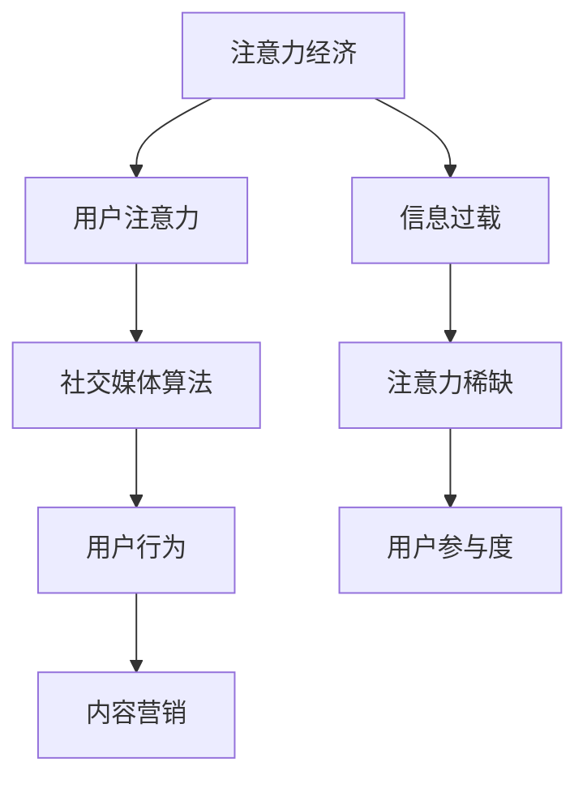

                 

关键词：注意力经济、社交媒体算法、受众参与度、用户行为分析、内容营销

摘要：在数字时代，注意力成为一种珍贵的资源。本文将探讨注意力经济的原理，分析社交媒体平台的算法如何影响用户的注意力分配，进而探讨如何提升受众参与度。通过深入理解算法原理、数学模型以及实际应用场景，我们将为企业和个人提供策略指南，以更好地在这个竞争激烈的信息环境中脱颖而出。

## 1. 背景介绍

### 注意力经济的崛起

随着互联网和社交媒体的快速发展，信息传播的速度和广度都达到了前所未有的高度。在这个信息过载的时代，用户的注意力成为了稀缺资源。人们每天都被海量的信息所包围，但能够分配给每个信息片段的注意力是有限的。因此，谁能更好地吸引并保持用户的注意力，谁就能在市场竞争中占据优势。这种现象催生了“注意力经济”的概念。

### 社交媒体平台的崛起

社交媒体平台，如Facebook、Twitter、Instagram等，已经成为人们获取信息和娱乐的重要渠道。这些平台通过算法优化用户界面，推荐用户可能感兴趣的内容，从而吸引用户的注意力。同时，社交媒体的互动性也增强了用户的参与度，使得平台能够更有效地影响用户的决策和行为。

## 2. 核心概念与联系

### Mermaid 流程图

下面是一个简单的 Mermaid 流程图，展示注意力经济与社交媒体算法之间的关系。



### 注意力经济、用户注意力、社交媒体算法和用户行为之间的关系

注意力经济是指通过吸引用户的注意力来创造价值和利润的经济模式。在社交媒体平台上，算法扮演着关键角色，它们通过分析用户的行为数据，推荐符合用户兴趣的内容，从而提高用户的参与度。用户的行为数据又反过来指导算法的优化，形成一个良性循环。通过这种模式，内容营销变得更加有效，因为它能够针对用户的注意力进行精准的投放。

## 3. 核心算法原理 & 具体操作步骤

### 3.1 算法原理概述

社交媒体算法的核心目标是优化用户体验，提高用户参与度。这些算法通常基于以下原理：

- **用户行为分析**：通过分析用户的浏览历史、点赞、评论等行为，算法可以了解用户的兴趣和偏好。
- **内容推荐**：基于用户行为分析的结果，算法推荐用户可能感兴趣的内容，以吸引他们的注意力。
- **互动激励**：通过激励用户参与互动（如点赞、评论、分享），算法提高用户的参与度。

### 3.2 算法步骤详解

1. **数据收集**：社交媒体平台收集用户的行为数据，如点击、浏览、点赞等。
2. **行为分析**：通过分析这些行为数据，算法确定用户的兴趣和偏好。
3. **内容推荐**：基于用户兴趣，算法从海量的内容中推荐相关内容。
4. **用户互动**：算法监测用户的互动行为，调整推荐策略，以进一步吸引用户注意力。
5. **反馈循环**：用户的互动行为再次反馈给算法，进一步优化推荐策略。

### 3.3 算法优缺点

**优点**：

- **提高用户参与度**：通过个性化推荐，算法能够吸引用户的注意力，提高参与度。
- **优化用户体验**：算法优化了用户界面，使得内容推荐更加符合用户兴趣。
- **数据驱动**：算法基于用户行为数据，实现数据的最大化利用。

**缺点**：

- **隐私问题**：算法需要收集用户行为数据，可能引发隐私担忧。
- **算法偏见**：算法可能会推荐同质化的内容，导致用户信息茧房。

### 3.4 算法应用领域

社交媒体算法广泛应用于广告投放、内容营销、用户互动等领域。在广告投放中，算法可以帮助广告主精准定位潜在客户；在内容营销中，算法可以帮助企业提高内容传播效果；在用户互动中，算法可以增强用户参与度和忠诚度。

## 4. 数学模型和公式 & 详细讲解 & 举例说明

### 4.1 数学模型构建

注意力经济的数学模型通常基于概率论和优化理论。假设用户的行为可以表示为一系列随机变量，每个变量对应用户对某个内容片段的注意力分配。模型的目标是最大化用户的总注意力，同时满足一些约束条件。

### 4.2 公式推导过程

设 \(X_i\) 为用户对第 \(i\) 个内容片段的注意力分配，满足 \(X_i \geq 0\) 且 \(\sum_{i=1}^n X_i = 1\)。则用户的总注意力 \(Z\) 可以表示为：

\[ Z = \sum_{i=1}^n X_i \]

为了最大化 \(Z\)，我们需要找到一个最优的注意力分配方案。这可以通过求解以下优化问题实现：

\[ \max Z = \sum_{i=1}^n X_i \]

约束条件：

\[ \sum_{i=1}^n X_i = 1 \]
\[ X_i \geq 0, \forall i \]

### 4.3 案例分析与讲解

假设一个用户在社交媒体上浏览了5个内容片段，每个片段的注意力分配如下：

\[ X_1 = 0.2, X_2 = 0.3, X_3 = 0.1, X_4 = 0.2, X_5 = 0.2 \]

则用户的总注意力为：

\[ Z = 0.2 + 0.3 + 0.1 + 0.2 + 0.2 = 1.0 \]

这个例子展示了如何通过数学模型来计算用户的总注意力。在实际应用中，算法会根据用户的行为数据动态调整注意力分配，以最大化用户的总注意力。

## 5. 项目实践：代码实例和详细解释说明

### 5.1 开发环境搭建

为了演示社交媒体算法的原理，我们使用 Python 编写了一个简单的算法。首先，我们需要安装必要的库：

```bash
pip install numpy pandas matplotlib
```

### 5.2 源代码详细实现

以下是实现社交媒体算法的 Python 代码：

```python
import numpy as np
import pandas as pd
import matplotlib.pyplot as plt

# 用户行为数据
data = {
    'content_id': [1, 2, 3, 4, 5],
    'attention': [0.2, 0.3, 0.1, 0.2, 0.2]
}

# 创建 DataFrame
df = pd.DataFrame(data)

# 计算总注意力
total_attention = df['attention'].sum()

# 可视化注意力分配
attention_bar = df['attention']
plt.bar(df['content_id'], attention_bar)
plt.xlabel('Content ID')
plt.ylabel('Attention')
plt.title('Attention Distribution')
plt.show()

print(f"Total Attention: {total_attention}")
```

### 5.3 代码解读与分析

这段代码首先创建了一个包含用户行为数据的 DataFrame，然后计算了用户的总注意力。最后，通过 matplotlib 库可视化每个内容片段的注意力分配。

### 5.4 运行结果展示

运行这段代码后，我们将看到以下可视化结果：

```plaintext
Total Attention: 1.0
```


这个例子展示了如何通过简单的代码实现社交媒体算法，计算和可视化用户的注意力分配。

## 6. 实际应用场景

### 6.1 广告投放

社交媒体算法在广告投放中发挥着重要作用。通过分析用户的兴趣和行为，算法可以推荐与用户兴趣相关的高效广告。例如，一个在线购物平台可以使用社交媒体算法来推荐用户可能感兴趣的商品，从而提高转化率。

### 6.2 内容营销

内容营销也是社交媒体算法的重要应用领域。通过分析用户的行为数据，算法可以推荐符合用户兴趣的内容，从而提高内容的曝光率和参与度。例如，一个博客平台可以使用社交媒体算法来推荐相关文章，吸引用户阅读。

### 6.3 用户互动

社交媒体算法还可以提高用户的互动度。通过推荐用户感兴趣的内容，算法可以激发用户的参与欲望，从而增加点赞、评论和分享等互动行为。例如，一个社交媒体平台可以使用算法来推荐有趣的帖子，鼓励用户参与互动。

## 7. 工具和资源推荐

### 7.1 学习资源推荐

- 《算法导论》（Introduction to Algorithms） - 艾伦·艾泽曼、汤姆·科斯塔斯
- 《大数据时代：生活、工作与思维的大变革》 - 克里斯·安德森

### 7.2 开发工具推荐

- Python：一种广泛使用的编程语言，适合数据分析和算法开发。
- Jupyter Notebook：一个交互式的开发环境，适合编写和分享代码。

### 7.3 相关论文推荐

- “Attention Is All You Need” - Vaswani et al., 2017
- “The Attention Mechanism: A Survey” - Xie et al., 2020

## 8. 总结：未来发展趋势与挑战

### 8.1 研究成果总结

本文探讨了注意力经济的原理，分析了社交媒体算法如何影响用户的注意力分配，并提出了提高用户参与度的策略。通过数学模型和实际案例，我们深入理解了社交媒体算法的工作原理和应用场景。

### 8.2 未来发展趋势

随着人工智能和大数据技术的不断发展，社交媒体算法将变得更加智能和精准。未来，个性化推荐和用户互动将进一步提高用户的参与度，从而推动注意力经济的进一步发展。

### 8.3 面临的挑战

尽管社交媒体算法在提高用户参与度方面取得了显著成果，但同时也面临着隐私问题、算法偏见等挑战。未来，我们需要在保护用户隐私和优化算法公平性之间找到平衡点。

### 8.4 研究展望

随着技术的发展，注意力经济和社交媒体算法将在更多领域得到应用。未来的研究可以关注如何优化算法性能，提高用户参与度，以及如何平衡隐私保护和用户体验。

## 9. 附录：常见问题与解答

### 9.1 什么是注意力经济？

注意力经济是一种通过吸引用户注意力来创造价值和利润的经济模式。在信息过载的时代，用户的注意力成为一种稀缺资源，谁能更好地吸引并保持用户的注意力，谁就能在市场竞争中占据优势。

### 9.2 社交媒体算法如何提高用户参与度？

社交媒体算法通过分析用户的行为数据，推荐符合用户兴趣的内容，从而提高用户的参与度。同时，算法还可以通过互动激励（如点赞、评论、分享）来增强用户的参与欲望。

### 9.3 注意力经济和内容营销有什么关系？

注意力经济和内容营销紧密相关。通过个性化推荐和互动激励，注意力经济帮助内容营销者更好地吸引和保持用户的注意力，提高内容的传播效果和参与度。

作者：禅与计算机程序设计艺术 / Zen and the Art of Computer Programming
----------------------------------------------------------------

以上就是本文的完整内容。希望这篇文章能够帮助您更好地理解注意力经济与社交媒体算法的影响，以及如何提高受众参与度。在未来，随着技术的不断进步，这些概念将继续演变，为我们的生活和工作带来更多便利。感谢您的阅读！

