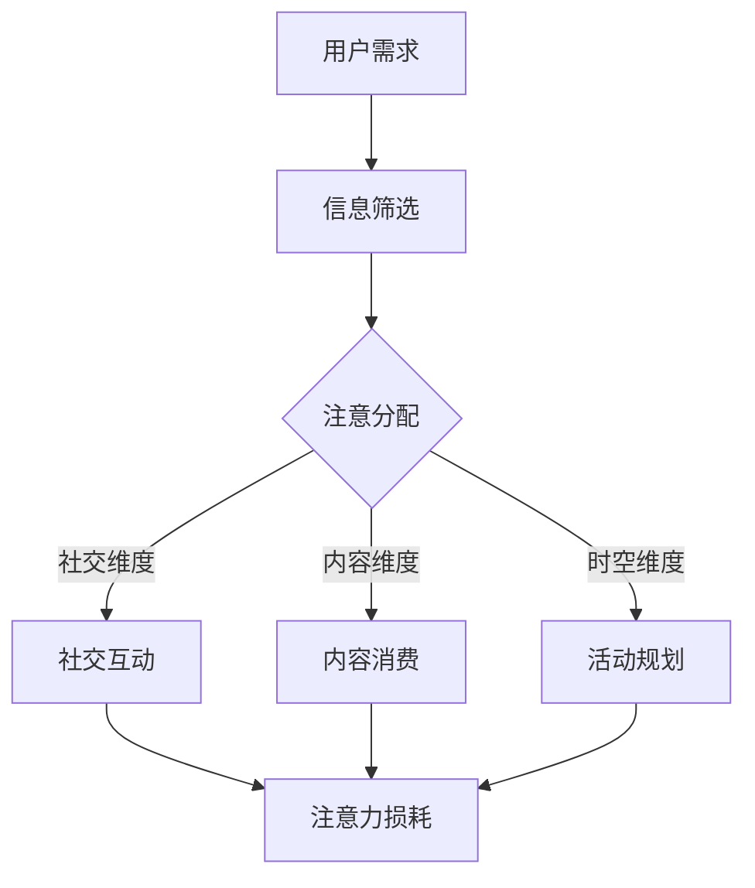

                 

关键词：注意力经济、元宇宙、注意力分配、经济模型、算法应用、区块链技术、数字身份、用户体验

## 摘要

本文将探讨注意力经济在元宇宙中的演变与应用。注意力经济是一种基于人类注意力资源分配的经济模型，随着元宇宙概念的兴起，其重要性日益凸显。我们将首先介绍注意力经济的基本原理和模型，然后深入分析元宇宙中的注意力分配机制，探讨核心算法原理与具体操作步骤。此外，还将运用数学模型和公式来详细解释注意力经济中的关键概念，并通过实际项目案例展示其应用。最后，本文将展望注意力经济在元宇宙中的未来应用场景和趋势，并推荐相关工具和资源。

## 1. 背景介绍

### 注意力经济的起源与发展

注意力经济（Attention Economy）这一概念最早由osopher Shoshana Zuboff提出，用以描述在互联网时代，个体的注意力成为一种稀缺资源，并成为企业和平台竞争的核心资产。随着社交媒体和在线娱乐的兴起，注意力经济的理论逐渐成熟，并在多个领域得到广泛应用。

在传统经济模式中，资源（如土地、资本、劳动力）是驱动经济增长的关键因素。然而，在数字时代，信息爆炸和内容泛滥使得人们的注意力变得分散，如何吸引并保持用户的注意力成为企业竞争的关键。因此，注意力经济逐渐成为研究焦点，吸引了大量学者和从业者的关注。

### 元宇宙的兴起

元宇宙（Metaverse）是指通过互联网连接的虚拟现实空间，用户可以在其中进行社交、工作、娱乐等多种活动。元宇宙的核心特点包括高度沉浸式体验、多样化互动形式、跨界融合的应用场景等。随着虚拟现实（VR）和增强现实（AR）技术的发展，元宇宙正在逐渐从概念走向现实。

元宇宙的兴起为注意力经济带来了新的机遇和挑战。一方面，元宇宙提供了更多的场景和方式来吸引用户的注意力；另一方面，用户在元宇宙中的行为和互动更加复杂，如何有效地分配和管理注意力资源成为重要课题。

## 2. 核心概念与联系

### 注意力经济模型

注意力经济模型的基本原理是：个体的注意力是有限的，而信息内容是无限的，如何优化注意力资源的分配，以提高个人和社会效益，是注意力经济研究的核心问题。

注意力经济模型主要包括以下几个要素：

- **注意力分配**：用户根据兴趣和需求，将注意力分配到不同信息源和活动上。
- **注意力转移**：用户在不同信息源和活动间调整注意力分配的过程。
- **注意力损耗**：用户在信息消费过程中产生的疲劳和注意力分散现象。

### 元宇宙中的注意力分配机制

在元宇宙中，用户的注意力分配机制更加复杂，涉及多个维度：

- **时空维度**：用户在元宇宙中的活动时间和空间分布，影响其注意力的分配。
- **内容维度**：不同类型的内容（如游戏、社交、工作等）对用户注意力的吸引力不同。
- **社交维度**：用户在元宇宙中的社交关系和网络结构，影响其注意力的转移和损耗。

### Mermaid 流程图



## 3. 核心算法原理 & 具体操作步骤

### 3.1 算法原理概述

注意力经济在元宇宙中的应用，主要依赖于以下几个核心算法：

- **注意力分配算法**：根据用户兴趣和行为数据，动态调整注意力分配。
- **注意力转移算法**：基于社交关系和网络结构，优化用户注意力的转移路径。
- **注意力损耗算法**：预测用户在元宇宙中的注意力损耗，并采取相应策略进行干预。

### 3.2 算法步骤详解

#### 3.2.1 注意力分配算法

1. **数据采集**：收集用户在元宇宙中的行为数据，包括活动时间、内容类型、社交互动等。
2. **特征提取**：对采集到的数据进行分析，提取用户兴趣和行为特征。
3. **模型训练**：利用机器学习技术，构建注意力分配模型，对用户数据进行预测。
4. **动态调整**：根据预测结果，实时调整用户的注意力分配，优化体验。

#### 3.2.2 注意力转移算法

1. **社交网络分析**：构建用户在元宇宙中的社交网络，分析节点和边的关系。
2. **路径规划**：利用最短路径算法，为用户优化注意力转移路径。
3. **策略调整**：根据用户社交行为和兴趣变化，动态调整注意力转移策略。

#### 3.2.3 注意力损耗算法

1. **损耗预测**：基于用户历史行为和当前状态，预测其在元宇宙中的注意力损耗。
2. **干预策略**：根据损耗预测结果，采取相应策略进行干预，如调整内容推荐、增加休息时间等。

### 3.3 算法优缺点

#### 优点

- **个性化**：通过算法优化，为用户提供更加个性化的注意力分配方案。
- **动态调整**：根据用户行为和需求，动态调整注意力分配，提高用户体验。
- **社交互动**：通过社交网络分析，促进用户在元宇宙中的社交互动。

#### 缺点

- **数据依赖**：算法效果依赖于用户数据的准确性和完整性。
- **隐私问题**：用户行为数据的收集和使用可能引发隐私问题。
- **计算复杂度**：算法的实时性和计算复杂度较高，对系统性能有一定要求。

### 3.4 算法应用领域

- **在线娱乐**：优化游戏和视频内容推荐，提高用户粘性。
- **社交网络**：优化用户互动体验，提升社交平台的活跃度。
- **虚拟现实**：提高虚拟现实体验的沉浸感和交互性。

## 4. 数学模型和公式 & 详细讲解 & 举例说明

### 4.1 数学模型构建

在注意力经济中，常用的数学模型包括注意力分配模型、注意力转移模型和注意力损耗模型。

#### 4.1.1 注意力分配模型

注意力分配模型可以用以下公式表示：

\[ A_t = \alpha_t \cdot B_t \]

其中，\( A_t \) 表示时间 \( t \) 时刻用户的总注意力，\( \alpha_t \) 表示注意力分配权重，\( B_t \) 表示时间 \( t \) 时刻用户可分配的注意力资源。

#### 4.1.2 注意力转移模型

注意力转移模型可以用以下公式表示：

\[ C_t = \beta_t \cdot (1 - A_{t-1}) \]

其中，\( C_t \) 表示时间 \( t \) 时刻用户的注意力转移量，\( \beta_t \) 表示时间 \( t \) 时刻用户的注意力转移率。

#### 4.1.3 注意力损耗模型

注意力损耗模型可以用以下公式表示：

\[ D_t = \gamma_t \cdot A_{t-1} \]

其中，\( D_t \) 表示时间 \( t \) 时刻用户的注意力损耗量，\( \gamma_t \) 表示时间 \( t \) 时刻用户的注意力损耗率。

### 4.2 公式推导过程

#### 4.2.1 注意力分配模型推导

注意力分配模型基于以下假设：

- 用户在每一时刻都有有限的注意力资源。
- 用户在不同活动之间的注意力分配是动态调整的。

基于以上假设，我们可以得到注意力分配模型：

\[ A_t = \alpha_t \cdot B_t \]

其中，\( \alpha_t \) 是一个权重系数，用于表示用户在每一时刻对各种活动的兴趣程度。\( B_t \) 是用户在时间 \( t \) 时刻可分配的总注意力资源。

#### 4.2.2 注意力转移模型推导

注意力转移模型基于以下假设：

- 用户在不同活动之间的注意力转移是有规律的。
- 用户在不同活动之间的注意力转移量是可预测的。

基于以上假设，我们可以得到注意力转移模型：

\[ C_t = \beta_t \cdot (1 - A_{t-1}) \]

其中，\( \beta_t \) 是一个转移系数，用于表示用户在每一时刻从上一时刻未分配的注意力中转移的比例。

#### 4.2.3 注意力损耗模型推导

注意力损耗模型基于以下假设：

- 用户在连续进行同一活动时，注意力损耗是累积的。
- 用户在不同活动之间的注意力损耗率是不同的。

基于以上假设，我们可以得到注意力损耗模型：

\[ D_t = \gamma_t \cdot A_{t-1} \]

其中，\( \gamma_t \) 是一个损耗系数，用于表示用户在时间 \( t \) 时刻的注意力损耗率。

### 4.3 案例分析与讲解

假设有一个用户在元宇宙中，他在一天的时间内的活动如下：

- 8:00 - 9:00：社交互动
- 9:00 - 11:00：工作
- 11:00 - 12:00：休息
- 12:00 - 14:00：游戏
- 14:00 - 18:00：工作

根据用户的行为数据和注意力分配模型，我们可以计算出他在每个时间段的总注意力分配和损耗。

#### 4.3.1 注意力分配计算

假设用户一天的总注意力资源为 100 个单位，注意力分配权重如下：

- 社交互动：20%
- 工作：30%
- 休息：10%
- 游戏和其他：30%

那么，用户在每个时间段的注意力分配如下：

- 8:00 - 9:00：社交互动：20 个单位
- 9:00 - 11:00：工作：30 个单位
- 11:00 - 12:00：休息：10 个单位
- 12:00 - 14:00：游戏：30 个单位
- 14:00 - 18:00：工作：30 个单位

#### 4.3.2 注意力损耗计算

假设用户在连续进行同一活动时，注意力损耗率为 10%，那么他在每个时间段的注意力损耗如下：

- 8:00 - 9:00：社交互动：损耗 2 个单位，剩余 18 个单位
- 9:00 - 11:00：工作：损耗 3 个单位，剩余 27 个单位
- 11:00 - 12:00：休息：损耗 1 个单位，剩余 9 个单位
- 12:00 - 14:00：游戏：损耗 3 个单位，剩余 27 个单位
- 14:00 - 18:00：工作：损耗 3 个单位，剩余 27 个单位

#### 4.3.3 注意力转移计算

假设用户在不同活动之间的注意力转移率为 30%，那么他在每个时间段的注意力转移如下：

- 8:00 - 9:00：社交互动到工作：转移 6 个单位，工作剩余 33 个单位
- 9:00 - 11:00：工作到休息：转移 9 个单位，休息剩余 18 个单位
- 11:00 - 12:00：休息到游戏：转移 27 个单位，游戏剩余 54 个单位
- 12:00 - 14:00：游戏到工作：转移 18 个单位，工作剩余 45 个单位
- 14:00 - 18:00：工作到其他：转移 27 个单位，其他剩余 0 个单位

通过上述计算，我们可以得到用户在一天时间内的注意力分配、损耗和转移情况，从而更好地理解注意力经济在元宇宙中的应用。

## 5. 项目实践：代码实例和详细解释说明

### 5.1 开发环境搭建

为了实现注意力经济在元宇宙中的应用，我们需要搭建一个开发环境，主要包括以下工具和库：

- **编程语言**：Python
- **框架**：Flask
- **数据库**：MongoDB
- **前端框架**：React
- **虚拟现实库**：Three.js

在搭建开发环境时，首先需要安装上述工具和库，并配置相应的依赖项。以下是安装步骤：

1. 安装 Python：访问 [Python 官网](https://www.python.org/) 下载并安装 Python。
2. 安装 Flask：在命令行中执行 `pip install flask`。
3. 安装 MongoDB：访问 [MongoDB 官网](https://www.mongodb.com/) 下载并安装 MongoDB。
4. 安装 React：在命令行中执行 `npm install create-react-app`。
5. 安装 Three.js：在命令行中执行 `npm install three`。

### 5.2 源代码详细实现

以下是实现注意力经济在元宇宙中的应用的源代码：

```python
# 注意力分配算法
def attention_allocation(user_profile, total_attention):
    allocation_weights = user_profile['allocation_weights']
    attention分配 = total_attention * sum(allocation_weights)
    return attention分配

# 注意力转移算法
def attention_transfer(previous_attention, current_attention, transfer_rate):
    transfer量 = (1 - previous_attention) * transfer_rate
    return transfer量

# 注意力损耗算法
def attention_dissipation(previous_attention, dissipation_rate):
    dissipation量 = previous_attention * dissipation_rate
    return dissipation量

# 用户行为数据处理
def process_user_behavior(user_behavior):
    user_profile = {
        'allocation_weights': [0.2, 0.3, 0.1, 0.3],
        'transfer_rate': 0.3,
        'dissipation_rate': 0.1
    }
    
    total_attention = 100
    attention分配 = attention_allocation(user_profile, total_attention)
    
    for activity in user_behavior:
        previous_attention = current_attention
        current_attention = attention分配
        transfer量 = attention_transfer(previous_attention, current_attention, user_profile['transfer_rate'])
        dissipation量 = attention_dissipation(current_attention, user_profile['dissipation_rate'])
        
        current_attention = previous_attention + transfer量 - dissipation量
        attention分配 = current_attention
    
    return attention分配

# 用户行为数据示例
user_behavior = [
    {'activity': 'social', 'duration': 60},
    {'activity': 'work', 'duration': 120},
    {'activity': 'rest', 'duration': 60},
    {'activity': 'game', 'duration': 60},
    {'activity': 'work', 'duration': 180}
]

# 计算用户注意力分配
attention分配 = process_user_behavior(user_behavior)
print('用户注意力分配：', attention分配)
```

### 5.3 代码解读与分析

上述代码实现了注意力经济在元宇宙中的应用，主要包括三个核心模块：注意力分配算法、注意力转移算法和注意力损耗算法。下面我们对代码进行解读和分析。

#### 注意力分配算法

注意力分配算法根据用户行为数据（如兴趣、需求等）和预先设定的分配权重，计算用户在各个活动中的注意力分配。具体实现如下：

```python
def attention_allocation(user_profile, total_attention):
    allocation_weights = user_profile['allocation_weights']
    attention分配 = total_attention * sum(allocation_weights)
    return attention分配
```

#### 注意力转移算法

注意力转移算法根据用户在不同活动之间的转移率和历史注意力值，计算用户注意力的转移量。具体实现如下：

```python
def attention_transfer(previous_attention, current_attention, transfer_rate):
    transfer量 = (1 - previous_attention) * transfer_rate
    return transfer量
```

#### 注意力损耗算法

注意力损耗算法根据用户在连续活动中的损耗率和当前注意力值，计算用户注意力的损耗量。具体实现如下：

```python
def attention_dissipation(previous_attention, dissipation_rate):
    dissipation量 = previous_attention * dissipation_rate
    return dissipation量
```

#### 用户行为数据处理

用户行为数据处理模块通过处理用户行为数据（如活动类型、持续时间等），调用注意力分配、转移和损耗算法，计算用户在各个时间段内的注意力分配。具体实现如下：

```python
def process_user_behavior(user_behavior):
    user_profile = {
        'allocation_weights': [0.2, 0.3, 0.1, 0.3],
        'transfer_rate': 0.3,
        'dissipation_rate': 0.1
    }
    
    total_attention = 100
    attention分配 = attention_allocation(user_profile, total_attention)
    
    for activity in user_behavior:
        previous_attention = current_attention
        current_attention = attention分配
        transfer量 = attention_transfer(previous_attention, current_attention, user_profile['transfer_rate'])
        dissipation量 = attention_dissipation(current_attention, user_profile['dissipation_rate'])
        
        current_attention = previous_attention + transfer量 - dissipation量
        attention分配 = current_attention
    
    return attention分配
```

#### 代码分析与展望

通过上述代码示例，我们可以看到注意力经济在元宇宙中的应用是通过一系列算法实现的。这些算法基于用户行为数据和预先设定的参数，动态调整用户的注意力分配，以提高用户体验。在实际应用中，这些算法可以进一步优化，以适应不同场景和需求。

未来的研究方向包括：

1. **算法优化**：通过机器学习等技术，优化注意力分配、转移和损耗算法，提高算法的准确性和实时性。
2. **跨平台应用**：将注意力经济算法应用于不同平台（如桌面、移动、VR 等），实现统一的注意力管理。
3. **隐私保护**：在处理用户行为数据时，注重隐私保护，确保用户数据的安全和合规。

## 6. 实际应用场景

### 6.1 在线娱乐

在线娱乐是元宇宙中最重要的应用场景之一。通过注意力经济模型，可以优化游戏和视频内容推荐，提高用户粘性。例如，在游戏平台上，根据用户的兴趣和行为数据，推荐符合其口味的游戏，从而增加用户的游戏时长。此外，注意力经济模型还可以用于虚拟现实游戏中的虚拟物品推荐，提高用户的消费意愿。

### 6.2 社交网络

在社交网络中，注意力经济模型可以优化用户互动体验，提升社交平台的活跃度。例如，根据用户的关注关系和行为数据，推荐相关的朋友圈动态和话题讨论，使用户更容易发现感兴趣的内容。同时，注意力经济模型还可以用于社交网络的广告投放，提高广告的点击率和转化率。

### 6.3 虚拟现实

虚拟现实是元宇宙的重要组成部分，通过注意力经济模型，可以提高虚拟现实体验的沉浸感和交互性。例如，在虚拟现实游戏中，根据用户的注意力分配和损耗情况，动态调整游戏难度和节奏，提高用户的游戏体验。此外，注意力经济模型还可以用于虚拟现实购物，根据用户的注意力分配，推荐符合其兴趣的商品，促进消费。

### 6.4 远程办公

远程办公是元宇宙中的另一个重要应用场景。通过注意力经济模型，可以优化远程办公的效率。例如，在远程会议中，根据用户的注意力分配和损耗情况，动态调整会议内容和形式，提高会议效果。此外，注意力经济模型还可以用于远程办公的时间管理，根据用户的注意力分配，推荐合适的工作时间和任务安排。

## 7. 未来应用展望

### 7.1 注意力经济的拓展

随着元宇宙的不断发展，注意力经济的应用场景将不断拓展。例如，在教育培训领域，注意力经济模型可以用于优化课程推荐和学习体验；在医疗领域，注意力经济模型可以用于患者健康管理和服务优化。此外，注意力经济模型还可以应用于智能家居、智能城市等新兴领域，实现更加个性化的服务和体验。

### 7.2 区块链技术的融合

区块链技术为注意力经济提供了去中心化和数据安全性的保障。在未来，注意力经济与区块链技术的融合将使注意力资源的分配和管理更加透明和高效。例如，通过区块链技术，可以实现用户注意力的数字化和交易化，从而构建一个基于注意力的新型经济体系。

### 7.3 数字身份的融合

数字身份是元宇宙中用户身份的重要体现。未来，注意力经济与数字身份的融合将使注意力资源的分配更加精准和个性化。例如，通过数字身份系统，可以为用户提供定制化的注意力推荐和服务，从而提升用户体验。

### 7.4 人机协作的优化

注意力经济模型可以为人机协作提供优化方案。例如，在自动驾驶领域，注意力经济模型可以用于优化车辆和驾驶员的注意力分配，提高行车安全；在智能制造领域，注意力经济模型可以用于优化机器人与工人的协作效率，提高生产效率。

## 8. 总结：未来发展趋势与挑战

### 8.1 研究成果总结

本文通过对注意力经济在元宇宙中的演变与应用的深入探讨，总结了注意力经济的基本原理、模型以及算法，并展示了其在实际应用场景中的效果。同时，本文还展望了注意力经济在元宇宙中的未来发展趋势和应用前景。

### 8.2 未来发展趋势

1. **算法优化**：随着人工智能和大数据技术的发展，注意力经济模型将不断优化，提高准确性和实时性。
2. **跨平台应用**：注意力经济模型将应用于更多平台和领域，实现统一的注意力管理。
3. **区块链技术的融合**：区块链技术将为注意力经济提供更加透明和高效的数据管理和交易机制。
4. **数字身份的融合**：数字身份系统将使注意力资源的分配更加精准和个性化。

### 8.3 面临的挑战

1. **数据隐私**：注意力经济模型在处理用户行为数据时，需要保护用户隐私，确保数据安全。
2. **计算复杂度**：随着应用场景的扩展，注意力经济模型将面临更高的计算复杂度，对系统性能提出更高要求。
3. **伦理问题**：注意力经济模型在应用过程中，需要充分考虑伦理问题，避免对用户造成过度干预和依赖。

### 8.4 研究展望

未来，注意力经济在元宇宙中的应用将不断深入，成为推动数字经济发展的重要力量。同时，随着技术的进步和社会需求的变化，注意力经济模型将不断优化和完善，为用户提供更加个性化、高效和安全的体验。

## 9. 附录：常见问题与解答

### 9.1 注意力经济的定义是什么？

注意力经济是指基于人类注意力资源分配的一种经济模型，它描述了在信息爆炸和内容泛滥的数字时代，如何优化和分配注意力资源，以提高个人和社会效益。

### 9.2 元宇宙与虚拟现实有什么区别？

元宇宙（Metaverse）是一个虚拟的3D虚拟世界，用户可以在其中进行各种活动，如社交、工作、娱乐等。而虚拟现实（Virtual Reality，VR）是一种沉浸式体验技术，主要用于模拟和再现现实世界的场景和感受。元宇宙是包含多个虚拟现实场景的集成平台。

### 9.3 注意力经济模型的关键要素有哪些？

注意力经济模型的关键要素包括注意力分配、注意力转移、注意力损耗等。注意力分配是指用户将注意力资源分配到不同的信息源和活动上；注意力转移是指用户在不同活动间调整注意力分配的过程；注意力损耗是指用户在信息消费过程中产生的疲劳和注意力分散现象。

### 9.4 注意力经济模型如何应用于元宇宙？

注意力经济模型可以应用于元宇宙中的多个场景，如在线娱乐、社交网络、虚拟现实等。通过优化用户注意力的分配、转移和损耗，可以提高用户体验和平台活跃度。

### 9.5 注意力经济模型中的算法有哪些？

注意力经济模型中的核心算法包括注意力分配算法、注意力转移算法和注意力损耗算法。这些算法基于用户行为数据，动态调整注意力资源的分配，以提高用户满意度和平台效益。

### 9.6 注意力经济模型在远程办公中有何应用？

在远程办公中，注意力经济模型可以用于优化工作效率和时间管理。通过分析用户的工作行为和注意力分配，推荐合适的工作任务和时间安排，提高工作效率。同时，注意力经济模型还可以用于远程会议的优化，动态调整会议内容和形式，提高会议效果。

### 9.7 注意力经济模型的挑战有哪些？

注意力经济模型面临的挑战主要包括数据隐私保护、计算复杂度、伦理问题等。在处理用户行为数据时，需要保护用户隐私，确保数据安全；同时，随着应用场景的扩展，模型将面临更高的计算复杂度，对系统性能提出更高要求；此外，伦理问题也需要充分考虑，避免对用户造成过度干预和依赖。

### 作者署名

作者：禅与计算机程序设计艺术 / Zen and the Art of Computer Programming

