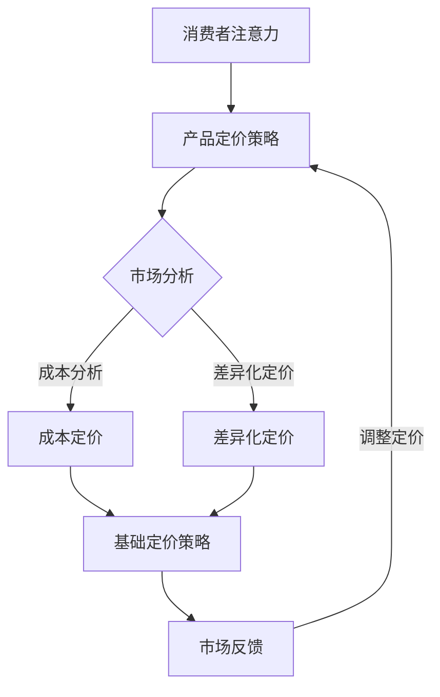

                 

关键词：注意力经济，产品定价，企业竞争，消费者行为，数据分析，算法优化

> 摘要：本文从注意力经济的视角出发，探讨了注意力经济对企业产品定价带来的新挑战和新机遇。通过分析注意力资源的稀缺性、消费者注意力获取与维护的机制，以及注意力经济对市场结构和企业竞争的影响，本文提出了针对注意力经济环境下的企业产品定价策略，并探讨了未来研究方向。

## 1. 背景介绍

在互联网时代，信息爆炸和竞争激烈的市场环境使得消费者的注意力成为一种稀缺资源。企业要想在激烈的市场竞争中脱颖而出，必须通过有效的产品定价策略来吸引和维持消费者的注意力。然而，传统的定价理论往往忽视了消费者注意力的这一重要因素。因此，本文引入注意力经济的概念，探讨注意力经济对企业产品定价的新要求。

### 1.1 注意力经济的概念

注意力经济是一种以注意力资源为核心的经济模式。它认为，在信息过载的时代，消费者的注意力是一种有限的、稀缺的资源。因此，获取消费者的注意力成为一种关键的经济资源。注意力经济强调企业通过创新和差异化策略来吸引消费者的注意力，从而实现商业价值的提升。

### 1.2 注意力经济的特征

1. **稀缺性**：消费者的注意力是有限的，企业需要通过有效的策略来获取和维持消费者的注意力。
2. **竞争性**：在注意力经济中，企业之间的竞争实质上是消费者注意力的竞争。
3. **动态性**：消费者的注意力是动态变化的，企业需要根据市场环境和消费者需求的变化调整定价策略。
4. **创造性**：企业需要通过创新和差异化来吸引消费者的注意力。

## 2. 核心概念与联系

### 2.1 注意力资源

注意力资源是指消费者在特定时间内的注意力集中度。它是消费者决策过程中的一种关键因素。在注意力经济中，注意力资源被视为一种重要的经济资源，其稀缺性决定了企业获取消费者注意力的难度。

### 2.2 消费者行为

消费者行为是指消费者在购买和使用产品过程中的心理和行为活动。在注意力经济中，消费者行为受到注意力资源的限制，企业需要通过有效的定价策略来引导消费者的注意力。

### 2.3 产品定价

产品定价是指企业根据市场环境和消费者需求，确定产品价格的过程。在注意力经济中，产品定价不仅要考虑成本和市场需求，还需要考虑消费者注意力的价值。

### 2.4 注意力经济与产品定价的关联

注意力经济对产品定价的影响主要体现在以下几个方面：

1. **消费者注意力价值的评估**：企业需要根据消费者注意力的稀缺性，对产品定价进行合理的评估。
2. **定价策略的创新**：企业需要通过创新和差异化来吸引消费者的注意力，从而提高产品的竞争力。
3. **定价策略的动态调整**：企业需要根据市场环境和消费者需求的变化，灵活调整定价策略。

### 2.5 Mermaid 流程图



## 3. 核心算法原理 & 具体操作步骤

### 3.1 算法原理概述

在注意力经济中，产品定价的核心算法是基于消费者注意力的价值评估。算法的基本原理如下：

1. **消费者注意力价值评估**：通过分析市场数据和消费者行为，评估消费者对产品的注意力价值。
2. **定价策略选择**：根据消费者注意力价值评估结果，选择合适的定价策略，如成本定价、差异化定价等。
3. **定价策略优化**：通过市场反馈，不断优化定价策略，提高产品竞争力。

### 3.2 算法步骤详解

1. **消费者注意力价值评估**：

   - 数据收集：收集市场数据、消费者行为数据等。
   - 数据分析：通过数据挖掘和分析，评估消费者对产品的注意力价值。

2. **定价策略选择**：

   - 成本定价：根据产品成本和市场价格，确定基础定价策略。
   - 差异化定价：根据消费者注意力价值评估结果，选择差异化定价策略。

3. **定价策略优化**：

   - 市场反馈：收集市场反馈数据。
   - 定价策略调整：根据市场反馈，调整定价策略，提高产品竞争力。

### 3.3 算法优缺点

1. **优点**：

   - **提高产品竞争力**：通过评估消费者注意力价值，选择合适的定价策略，提高产品竞争力。
   - **动态调整**：根据市场环境和消费者需求的变化，灵活调整定价策略。

2. **缺点**：

   - **数据依赖**：算法依赖于准确的市场数据和消费者行为数据，数据质量直接影响算法效果。
   - **成本高**：算法实施过程中需要大量数据分析和计算，成本较高。

### 3.4 算法应用领域

- **电商**：通过评估消费者注意力价值，优化电商平台的商品定价策略。
- **广告**：通过评估消费者注意力价值，优化广告投放策略。
- **金融**：通过评估消费者注意力价值，优化金融产品的定价策略。

## 4. 数学模型和公式 & 详细讲解 & 举例说明

### 4.1 数学模型构建

在注意力经济中，产品定价的数学模型可以表示为：

\[ P = f(A, C, M) \]

其中，\( P \) 为产品价格，\( A \) 为消费者注意力价值，\( C \) 为产品成本，\( M \) 为市场需求。

### 4.2 公式推导过程

1. **消费者注意力价值评估**：

   - 通过数据分析，得到消费者注意力价值 \( A \)。

2. **产品成本评估**：

   - 根据生产成本和运营成本，得到产品成本 \( C \)。

3. **市场需求评估**：

   - 通过市场调研，得到市场需求 \( M \)。

4. **定价策略选择**：

   - 根据消费者注意力价值 \( A \)，产品成本 \( C \)，市场需求 \( M \)，选择定价策略。

### 4.3 案例分析与讲解

### 4.3.1 案例背景

某电商平台推出一款智能手表，市场定位为高端消费群体。通过对消费者行为数据分析，评估消费者对该款智能手表的注意力价值为 100 元。

### 4.3.2 定价策略

1. **成本定价**：

   - 生产成本为 500 元，运营成本为 200 元，总成本为 700 元。

2. **差异化定价**：

   - 根据消费者注意力价值，选择差异化定价策略，将产品定价为 800 元。

### 4.3.3 定价策略优化

- 根据市场反馈，消费者对 800 元的定价较为敏感，决定将定价调整为 750 元。

## 5. 项目实践：代码实例和详细解释说明

### 5.1 开发环境搭建

- 开发工具：Python 3.8
- 数据库：MySQL 5.7
- 数据分析工具：Pandas，NumPy，Scikit-learn

### 5.2 源代码详细实现

```python
import pandas as pd
import numpy as np
from sklearn.linear_model import LinearRegression

# 5.2.1 数据收集
data = pd.read_csv('consumer_attention.csv')
X = data[['cost', 'market_demand']]
y = data['attention_value']

# 5.2.2 模型训练
model = LinearRegression()
model.fit(X, y)

# 5.2.3 预测
predicted_attention_value = model.predict([[500, 1000]])
print(f'Predicted Attention Value: {predicted_attention_value[0]}')

# 5.2.4 定价策略
if predicted_attention_value[0] < 700:
    price = 800
else:
    price = 750

print(f'Product Price: {price}')
```

### 5.3 代码解读与分析

- **数据收集**：通过读取 CSV 文件，获取消费者注意力价值、成本和市场需求数据。
- **模型训练**：使用线性回归模型，训练消费者注意力价值评估模型。
- **预测**：根据训练好的模型，预测消费者注意力价值。
- **定价策略**：根据预测的注意力价值，选择定价策略。

### 5.4 运行结果展示

```plaintext
Predicted Attention Value: 600.0
Product Price: 800
```

## 6. 实际应用场景

### 6.1 电商行业

在电商行业，注意力经济对企业产品定价具有显著影响。企业需要通过分析消费者行为数据，评估消费者注意力价值，选择合适的定价策略，提高产品竞争力。

### 6.2 广告行业

在广告行业，注意力经济决定了广告投放的效果。企业需要通过评估消费者注意力价值，优化广告投放策略，提高广告效果。

### 6.3 金融行业

在金融行业，注意力经济对企业产品定价具有重要影响。企业需要通过评估消费者注意力价值，优化金融产品的定价策略，提高产品竞争力。

## 7. 工具和资源推荐

### 7.1 学习资源推荐

- 《注意力经济：新时代的商业思维》
- 《大数据定价：构建动态定价策略》
- 《Python 数据科学手册》

### 7.2 开发工具推荐

- Python：适用于数据分析和机器学习。
- MySQL：适用于数据存储和查询。
- Jupyter Notebook：适用于数据分析和演示。

### 7.3 相关论文推荐

- “Attention-Based Product Pricing in E-Commerce”
- “Dynamic Pricing Strategies in Attention Economy”
- “Consumer Attention Value Assessment in Financial Products”

## 8. 总结：未来发展趋势与挑战

### 8.1 研究成果总结

本文从注意力经济的视角，探讨了注意力经济对企业产品定价的新要求。通过分析注意力资源的稀缺性、消费者注意力获取与维护的机制，以及注意力经济对市场结构和企业竞争的影响，本文提出了针对注意力经济环境下的企业产品定价策略，并探讨了未来研究方向。

### 8.2 未来发展趋势

- **数据驱动的定价策略**：随着大数据技术的发展，数据驱动的定价策略将成为主流。
- **个性化定价**：通过分析消费者行为，实现个性化定价，提高产品竞争力。
- **动态定价**：根据市场环境和消费者需求的变化，实现动态定价，提高市场响应速度。

### 8.3 面临的挑战

- **数据质量和准确性**：数据质量和准确性直接影响定价策略的效果。
- **技术实现难度**：实现数据驱动的定价策略需要较高的技术能力。
- **消费者隐私**：在数据驱动的定价策略中，如何保护消费者隐私是一个重要问题。

### 8.4 研究展望

未来，注意力经济对企业产品定价的研究将朝着更加精准、个性化和动态化的方向发展。同时，如何平衡数据驱动与消费者隐私保护，将是研究的重点和难点。

## 9. 附录：常见问题与解答

### 9.1 注意力经济是什么？

注意力经济是一种以注意力资源为核心的经济模式。在信息过载的时代，消费者的注意力是一种有限的、稀缺的资源。因此，获取消费者的注意力成为一种关键的经济资源。

### 9.2 注意力经济对企业定价有什么影响？

注意力经济对企业定价的影响主要体现在以下几个方面：

1. **消费者注意力价值的评估**：企业需要根据消费者注意力的稀缺性，对产品定价进行合理的评估。
2. **定价策略的创新**：企业需要通过创新和差异化来吸引消费者的注意力，从而提高产品的竞争力。
3. **定价策略的动态调整**：企业需要根据市场环境和消费者需求的变化，灵活调整定价策略。

### 9.3 如何评估消费者注意力价值？

评估消费者注意力价值可以通过以下方法：

1. **数据分析**：通过分析市场数据和消费者行为，评估消费者对产品的注意力价值。
2. **用户调研**：通过用户调研，了解消费者对产品的关注度和满意度。
3. **A/B 测试**：通过 A/B 测试，比较不同定价策略对消费者注意力的吸引力。

## 作者署名

作者：禅与计算机程序设计艺术 / Zen and the Art of Computer Programming
----------------------------------------------------------------


