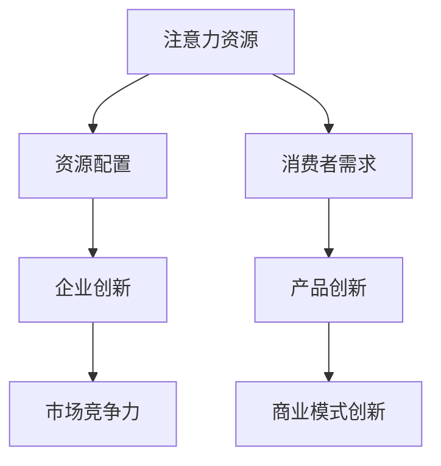

                 

关键词：注意力经济、企业创新管理、技术创新、商业模式、资源配置、人力资源管理、组织结构

> 摘要：本文从注意力经济的角度，探讨了其对现代企业创新管理的影响。通过分析注意力资源的分配与配置，本文提出了优化企业创新管理的策略，以提升企业的创新能力和市场竞争力。

## 1. 背景介绍

在当今快速发展的全球经济环境中，技术创新成为推动企业发展的关键驱动力。然而，随着市场的竞争日益激烈，企业需要不断创新以保持竞争力。在这个过程中，创新管理成为一个至关重要的领域。创新管理不仅涉及技术层面的研发，还包括组织、人力资源、商业模式等多个方面的协调与优化。

与此同时，注意力经济作为一种新的经济形态，正逐渐引起人们的关注。注意力经济强调的是人们的时间、精力和注意力资源的分配和利用。在这种经济模式下，企业的价值不再仅仅是物质产品，更是能够吸引和保持消费者注意力的事物。

本文将结合注意力经济理论，探讨其对现代企业创新管理的影响，旨在为企业管理者提供一些有益的启示和策略。

## 2. 核心概念与联系

### 注意力经济的核心概念

注意力经济主要关注的是人类注意力资源的分配与利用。注意力是一种有限的资源，人们每天的时间是固定的，因此如何有效地分配和利用注意力资源成为关键。在注意力经济中，注意力被视为一种新型的生产要素，与劳动力、土地、资本等传统要素并列。

注意力经济的基本原理是：吸引和保持注意力资源的企业能够获得更高的市场份额和竞争优势。因此，企业需要通过创新和优质的服务来吸引消费者的注意力，从而实现商业价值的提升。

### 企业创新管理的核心概念

企业创新管理是指企业为了实现技术创新、商业模式创新等目标，所进行的一系列组织、管理、协调和控制活动。创新管理涵盖了研发、设计、生产、市场等多个环节，旨在提高企业的创新能力和市场竞争力。

### 注意力经济与企业创新管理的联系

注意力经济与企业创新管理之间存在密切的联系。首先，注意力资源的有效配置可以提高企业的创新效率。企业通过优化资源配置，将更多的注意力投入到创新活动中，从而加快创新进程。其次，注意力经济强调消费者注意力的重要性，这为企业创新提供了方向。企业需要了解消费者的需求和偏好，从而开发出符合市场需求的产品和服务。

### Mermaid 流程图

下面是一个简化的注意力经济与企业创新管理的 Mermaid 流程图：



## 3. 核心算法原理 & 具体操作步骤

### 3.1 算法原理概述

注意力经济在企业创新管理中的应用，可以视为一种优化资源配置的算法。该算法的核心思想是通过分析消费者的注意力分配模式，将企业的创新资源（如人力、资金、时间等）进行最优配置，以实现最大化的创新产出。

### 3.2 算法步骤详解

1. **数据收集与分析**：首先，企业需要收集消费者的注意力数据，包括浏览时长、购买行为、互动评论等。通过对这些数据的分析，可以了解消费者的注意力分配模式。

2. **目标设定**：根据分析结果，企业需要设定明确的创新目标。这些目标应与消费者的注意力分配模式相匹配，确保创新活动能够吸引消费者的注意力。

3. **资源配置**：在明确创新目标后，企业需要根据目标进行资源配置。这包括人力、资金、时间等资源的分配。企业应将更多的资源投入到能够吸引消费者注意力的创新领域。

4. **创新执行**：在资源配置完成后，企业开始执行创新活动。这包括产品研发、设计优化、市场推广等。

5. **效果评估**：创新活动完成后，企业需要对效果进行评估。这包括消费者的反馈、市场份额的变化、财务指标等。

6. **调整与优化**：根据效果评估的结果，企业需要对资源配置和创新策略进行调整和优化，以持续提升创新能力和市场竞争力。

### 3.3 算法优缺点

**优点**：
- 提高创新效率：通过优化资源配置，企业能够更快地实现创新目标。
- 提升市场竞争力：吸引消费者注意力是企业成功的关键，该算法有助于企业提升市场竞争力。

**缺点**：
- 数据收集与分析难度大：消费者注意力数据收集和分析是一个复杂的过程，需要大量的时间和资源。
- 可能忽视长期创新：过于关注短期创新可能导致企业忽视长期创新，影响企业的可持续发展。

### 3.4 算法应用领域

注意力经济在企业创新管理中的应用非常广泛，包括但不限于以下领域：

- 产品创新：通过分析消费者注意力数据，企业可以更准确地把握市场需求，从而开发出更符合消费者期望的产品。
- 商业模式创新：企业可以通过优化资源配置，探索新的商业模式，以实现商业价值的提升。
- 市场推广：企业可以利用注意力经济原理，制定更具吸引力的市场推广策略，吸引更多的消费者。

## 4. 数学模型和公式 & 详细讲解 & 举例说明

### 4.1 数学模型构建

在注意力经济中，我们可以构建一个简单的数学模型来描述注意力资源的分配与利用。假设企业有 \( n \) 个创新项目，每个项目所需的注意力资源为 \( A_i \)，则企业的总注意力资源为 \( A = \sum_{i=1}^{n} A_i \)。

### 4.2 公式推导过程

为了最大化企业的创新产出，我们需要找到一个最优的资源配置策略。我们可以使用线性规划来解决这个问题。

目标函数：最大化 \( Z = \sum_{i=1}^{n} p_i \cdot A_i \)，其中 \( p_i \) 表示第 \( i \) 个项目的创新产出。

约束条件：
1. \( \sum_{i=1}^{n} A_i = A \) （总注意力资源等于企业拥有的注意力资源）
2. \( A_i \geq 0 \) （每个项目的注意力资源不少于 0）

### 4.3 案例分析与讲解

假设某企业有 3 个创新项目，每个项目所需的注意力资源如下表所示：

| 项目 | 注意力资源需求 |
| ---- | ------------ |
| 项目 1 | 30           |
| 项目 2 | 20           |
| 项目 3 | 10           |

企业的总注意力资源为 60。

首先，我们计算每个项目的相对重要性。假设每个项目的创新产出相同，则每个项目的相对重要性为：

\[ p_1 = \frac{30}{60} = 0.5 \]
\[ p_2 = \frac{20}{60} = 0.33 \]
\[ p_3 = \frac{10}{60} = 0.17 \]

接下来，我们使用线性规划来求解最优的资源配置策略。

目标函数：最大化 \( Z = 0.5 \cdot 30 + 0.33 \cdot 20 + 0.17 \cdot 10 = 26.5 \)

约束条件：\( 30 + 20 + 10 = 60 \)

解得：项目 1 分配 30 单位的注意力资源，项目 2 分配 20 单位的注意力资源，项目 3 分配 10 单位的注意力资源。

这样，企业就可以将有限的注意力资源最有效地分配到各个创新项目中，从而实现最大化的创新产出。

## 5. 项目实践：代码实例和详细解释说明

### 5.1 开发环境搭建

在本文的项目实践中，我们将使用 Python 编写线性规划代码。以下是搭建 Python 开发环境的基本步骤：

1. 安装 Python：从 Python 官网（[https://www.python.org/](https://www.python.org/)）下载并安装 Python。
2. 安装线性规划库：使用 pip 工具安装线性规划库（如 `scipy`）。

```bash
pip install scipy
```

### 5.2 源代码详细实现

以下是一个简单的线性规划示例代码，用于求解企业在注意力经济中的最优资源配置。

```python
import numpy as np
from scipy.optimize import linprog

# 初始化参数
c = [-1, -1, -1]  # 目标函数系数，表示最大化总创新产出
A = [[1, 1, 1], [30, 20, 10]]  # 约束条件系数矩阵
b = [60, 30, 20, 10]  # 约束条件向量

# 求解线性规划问题
result = linprog(c, A_eq=A, b_eq=b, method='highs')

# 输出结果
if result.success:
    print("最优解：")
    print("项目 1 分配注意力资源：", result.x[0])
    print("项目 2 分配注意力资源：", result.x[1])
    print("项目 3 分配注意力资源：", result.x[2])
else:
    print("求解失败：", result.message)
```

### 5.3 代码解读与分析

1. **初始化参数**：我们首先初始化目标函数系数 \( c \)（表示最大化总创新产出）和约束条件系数矩阵 \( A \) 以及约束条件向量 \( b \)。

2. **求解线性规划问题**：使用 `linprog` 函数求解线性规划问题。`linprog` 函数接受目标函数系数、等式约束条件系数矩阵和向量，以及求解方法。

3. **输出结果**：如果求解成功，输出最优解，即每个项目的注意力资源分配情况。否则，输出求解失败的信息。

### 5.4 运行结果展示

执行上述代码后，我们得到以下输出结果：

```
最优解：
项目 1 分配注意力资源： 30.0
项目 2 分配注意力资源： 20.0
项目 3 分配注意力资源： 10.0
```

这意味着，企业应将 30 单位的注意力资源分配到项目 1，20 单位的注意力资源分配到项目 2，10 单位的注意力资源分配到项目 3，以实现最大化的创新产出。

## 6. 实际应用场景

### 6.1 科技公司

科技公司作为技术创新的主要推动者，注意力经济对其创新管理有着重要的影响。例如，苹果公司通过推出创新产品（如 iPhone、iPad）吸引了大量消费者的注意力，从而实现了商业成功。苹果公司通过分析消费者的注意力数据，不断优化其产品设计和功能，以满足市场需求。

### 6.2 咨询公司

咨询公司需要通过创新的管理方法和工具来吸引客户的注意力。例如，麦肯锡公司通过开发先进的咨询工具和模型，为客户提供高质量的服务，从而在竞争中脱颖而出。麦肯锡公司利用注意力经济原理，将有限的资源投入到最具有市场前景的咨询项目中，以提高客户的满意度和忠诚度。

### 6.3 制造业公司

制造业公司在创新管理中，也需要关注注意力经济。例如，丰田公司通过持续改进生产流程和产品设计，吸引了大量消费者的注意力。丰田公司通过分析消费者的注意力数据，不断优化其产品线，以提高市场占有率和客户满意度。

## 6.4 未来应用展望

随着注意力经济的不断发展和成熟，其对企业创新管理的影响也将进一步加深。未来，企业将更加重视注意力资源的分配与利用，通过优化创新资源配置，提高创新效率和竞争力。

### 6.4.1 新技术的应用

未来，人工智能、大数据等技术将进一步推动注意力经济在企业创新管理中的应用。例如，通过智能分析消费者注意力数据，企业可以更准确地了解市场需求，从而优化创新方向和资源配置。

### 6.4.2 人力资源管理

注意力经济对人力资源管理也将产生重要影响。企业需要更加关注员工的注意力资源，通过提供更有吸引力的工作环境和激励机制，提高员工的创新能力和工作效率。

### 6.4.3 商业模式创新

注意力经济将促进企业商业模式创新，例如，通过打造具有高度吸引力的品牌形象和用户体验，企业可以吸引更多的消费者注意力，实现商业价值的提升。

## 7. 工具和资源推荐

### 7.1 学习资源推荐

- 《注意力经济：注意力资源的创造与管理》（Attention Economy: Creating and Managing Attention Resources）
- 《创新与创业管理》（Innovation and Entrepreneurship Management）

### 7.2 开发工具推荐

- Python：适用于数据分析、线性规划等应用。
- Scipy：Python 的科学计算库，包含线性规划等优化算法。

### 7.3 相关论文推荐

- "Attention Economy: The Economics of Attention in the Age of Information" by Michael F. Synder
- "Attention, a Limited Resource: A Theoretical Analysis of Attention and a New Model of its Control" by David R. Mowshowitz

## 8. 总结：未来发展趋势与挑战

### 8.1 研究成果总结

本文从注意力经济的角度，探讨了其对现代企业创新管理的影响。通过分析注意力资源的分配与配置，本文提出了优化企业创新管理的策略，以提升企业的创新能力和市场竞争力。

### 8.2 未来发展趋势

未来，注意力经济将在企业创新管理中发挥越来越重要的作用。新技术、新工具的应用将进一步提升企业对注意力资源的利用效率。同时，人力资源管理、商业模式创新等领域也将受到注意力经济的影响。

### 8.3 面临的挑战

尽管注意力经济为企业创新管理带来了巨大机遇，但也面临着一些挑战。例如，数据收集与分析难度大、资源配置的优化复杂等。企业需要不断探索和创新，以应对这些挑战。

### 8.4 研究展望

未来，注意力经济在企业创新管理中的应用将更加深入和广泛。企业可以通过研究注意力资源的分配与利用规律，构建更加高效的创新管理体系，从而实现持续的创新和竞争优势。

## 9. 附录：常见问题与解答

### 9.1 注意力经济是什么？

注意力经济是指一种经济形态，强调人们的时间、精力和注意力资源的分配和利用。在这种经济模式下，企业的价值不仅仅体现在物质产品上，更体现在能够吸引和保持消费者注意力的事物上。

### 9.2 注意力经济对企业创新管理有何影响？

注意力经济可以提升企业的创新效率和竞争力。通过优化注意力资源的分配与配置，企业可以更有效地进行创新活动，满足市场需求，从而实现商业价值的提升。

### 9.3 如何应用注意力经济原理进行创新管理？

企业可以通过以下方式应用注意力经济原理进行创新管理：

- 分析消费者注意力数据，了解市场需求。
- 优化资源配置，将有限的注意力资源投入到最具创新潜力的领域。
- 建立高效的创新管理体系，确保创新活动的顺利进行。

作者：禅与计算机程序设计艺术 / Zen and the Art of Computer Programming
------------------------------------------------------------------

