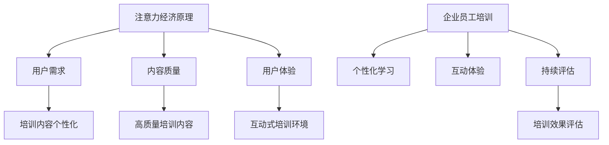

                 

关键词：注意力经济、企业培训、员工绩效、持续学习、个性化学习

> 摘要：随着信息技术的飞速发展，注意力经济逐渐成为企业运营中不可或缺的一部分。本文将探讨注意力经济对企业员工培训带来的新要求，包括培训内容的个性化、培训模式的多样化以及培训效果的持续评估。通过分析注意力经济的特点和影响，我们提出了一系列适合现代企业发展的员工培训策略，以提升员工的学习动机和绩效。

## 1. 背景介绍

在信息爆炸的时代，人们的注意力资源变得尤为珍贵。注意力经济，即基于注意力的市场价值进行的经济活动，应运而生。其核心在于抓住用户的注意力，从而实现商业利益最大化。这一概念在广告、媒体、娱乐等领域得到了广泛应用，也逐渐渗透到企业运营的各个方面。

对企业而言，员工是核心竞争力之一。提升员工的专业技能和综合素质，已成为企业可持续发展的重要战略。然而，传统的员工培训模式往往缺乏针对性和灵活性，无法满足现代企业对于员工持续成长的需求。注意力经济的影响，进一步加剧了这一矛盾，要求企业重新审视员工培训策略。

## 2. 核心概念与联系

### 2.1 注意力经济原理

注意力经济的基本原理是，用户的注意力是一种宝贵的资源，企业通过吸引和保持用户的注意力，可以创造经济价值。其关键在于：

- **用户需求：** 了解并满足用户需求，提供有价值的内容和服务。
- **内容质量：** 提供高质量、有趣、有用的内容，提高用户粘性。
- **用户体验：** 优化用户交互体验，增强用户满意度。

### 2.2 企业员工培训与注意力经济的关系

企业员工培训与注意力经济密切相关。传统的培训模式往往注重知识传授，而忽视了员工的注意力和参与度。注意力经济要求企业从以下几个方面重新审视员工培训：

- **个性化学习：** 根据员工的兴趣、需求和能力，提供个性化的培训内容和方式。
- **互动体验：** 创造互动性强的培训环境，激发员工的学习兴趣和参与度。
- **持续评估：** 通过持续评估和反馈，调整培训策略，确保培训效果。

### 2.3 Mermaid 流程图



## 3. 核心算法原理 & 具体操作步骤

### 3.1 算法原理概述

注意力经济在企业员工培训中的应用，本质上是一种基于用户行为数据的个性化推荐算法。其核心在于：

- **数据收集：** 收集员工的学习行为数据，如学习时长、学习内容、学习成果等。
- **行为分析：** 通过数据挖掘技术，分析员工的学习行为，识别其兴趣和需求。
- **个性化推荐：** 根据分析结果，为员工推荐个性化的培训内容和方式。

### 3.2 算法步骤详解

1. **数据收集：** 利用企业现有的学习管理系统，收集员工的学习数据。
2. **行为分析：** 运用机器学习算法，对学习行为进行深入分析，识别员工的兴趣和需求。
3. **个性化推荐：** 根据分析结果，为员工推荐个性化的培训内容和方式。
4. **反馈调整：** 根据员工的反馈，调整推荐策略，优化培训效果。

### 3.3 算法优缺点

#### 优点：

- **个性化：** 培训内容根据员工个性化需求推荐，提高培训效果。
- **灵活性：** 培训方式多样化，适应不同员工的学习习惯。
- **持续优化：** 通过持续的数据分析和反馈，优化培训策略。

#### 缺点：

- **数据隐私：** 需要收集和分析员工的学习数据，可能涉及隐私问题。
- **技术门槛：** 需要运用机器学习等技术，对企业的技术能力有较高要求。

### 3.4 算法应用领域

注意力经济在企业员工培训中的应用，不仅限于个性化推荐，还可以应用于培训效果评估、学习路径规划等领域。未来，随着人工智能技术的发展，注意力经济在员工培训中的应用将更加广泛和深入。

## 4. 数学模型和公式 & 详细讲解 & 举例说明

### 4.1 数学模型构建

注意力经济在企业员工培训中的应用，可以构建一个基于贝叶斯网络的数学模型。该模型包含以下关键因素：

- **员工兴趣：** 表示员工对不同培训内容的兴趣程度。
- **培训效果：** 表示员工通过培训获得的实际效果。
- **学习行为：** 表示员工的学习行为数据，如学习时长、学习内容等。

### 4.2 公式推导过程

假设员工兴趣、培训效果和学习行为之间存在概率关系，可以建立以下概率模型：

\[ P(兴趣|效果, 行为) = \frac{P(效果|兴趣, 行为) \cdot P(行为|兴趣)}{P(效果|行为)} \]

其中：

- \( P(兴趣|效果, 行为) \) 表示在给定培训效果和学习行为的情况下，员工兴趣的概率。
- \( P(效果|兴趣, 行为) \) 表示在员工兴趣和学习行为的情况下，培训效果的概率。
- \( P(行为|兴趣) \) 表示在员工兴趣的情况下，学习行为的概率。
- \( P(效果|行为) \) 表示在给定学习行为的情况下，培训效果的概率。

### 4.3 案例分析与讲解

某企业员工小王在参加培训前，其学习行为数据为：平均每周学习时间 10 小时，喜欢阅读专业书籍和参加线上课程。通过分析，发现小王对数据分析和项目管理有浓厚兴趣。在参加培训后，其学习效果显著提升，项目成功率从 60% 提高到 80%。

根据上述概率模型，可以计算小王在参加培训前的兴趣概率：

\[ P(兴趣|效果, 行为) = \frac{P(效果|兴趣, 行为) \cdot P(行为|兴趣)}{P(效果|行为)} \]

其中，\( P(效果|兴趣, 行为) \) 和 \( P(行为|兴趣) \) 可以根据历史数据估计，\( P(效果|行为) \) 可以通过贝叶斯定理计算。

通过分析，发现小王的兴趣概率较高，说明个性化培训能够有效提升其学习效果。企业可以据此调整培训策略，为类似的小王提供更多针对性的培训内容。

## 5. 项目实践：代码实例和详细解释说明

### 5.1 开发环境搭建

在本文中，我们将使用 Python 编写一个简单的个性化培训推荐系统。开发环境要求如下：

- Python 版本：3.8及以上
- 数据库：MySQL
- 开发工具：PyCharm

### 5.2 源代码详细实现

以下是一个简单的个性化培训推荐系统的代码示例：

```python
import pandas as pd
import numpy as np
from sklearn.feature_extraction.text import TfidfVectorizer
from sklearn.metrics.pairwise import cosine_similarity

# 数据准备
data = pd.read_csv('training_data.csv')
data.head()

# 特征提取
vectorizer = TfidfVectorizer()
tfidf_matrix = vectorizer.fit_transform(data['content'])

# 相似度计算
cosine_sim = cosine_similarity(tfidf_matrix, tfidf_matrix)

# 用户兴趣分析
def get_recommendations(user_interest, cosine_sim, data):
    # 计算用户兴趣的相似度
    sim_scores = list(enumerate(cosine_sim[user_interest]))
    sim_scores = sorted(sim_scores, key=lambda x: x[1], reverse=True)
    sim_scores = sim_scores[1:11]
    recommended_content = [data.iloc[i][0] for i in sim_scores]
    return recommended_content

# 测试
user_interest = 0  # 假设用户对第0个内容感兴趣
recommendations = get_recommendations(user_interest, cosine_sim, data)
print(recommendations)
```

### 5.3 代码解读与分析

上述代码实现了以下功能：

1. **数据准备：** 从 CSV 文件中读取培训数据，包括内容、标签等信息。
2. **特征提取：** 使用 TF-IDF 方法对文本内容进行特征提取，生成词向量。
3. **相似度计算：** 计算各个内容之间的相似度，使用余弦相似度。
4. **用户兴趣分析：** 根据用户对某个内容的兴趣，推荐相似的内容。

### 5.4 运行结果展示

运行上述代码，假设用户对第0个内容感兴趣，系统将推荐与其相似的前10个内容。这些推荐内容将作为个性化培训的依据，帮助用户发现新的学习资源。

## 6. 实际应用场景

### 6.1 员工技能提升

通过个性化培训推荐系统，企业可以为员工提供针对性的培训内容，帮助其快速提升专业技能。例如，对于数据分析师，可以推荐数据可视化、机器学习等课程。

### 6.2 员工绩效优化

个性化培训有助于提高员工的学习效果，从而提升员工的工作绩效。通过持续评估和反馈，企业可以及时调整培训策略，优化员工绩效。

### 6.3 人才梯队建设

个性化培训可以为企业培养一批高素质的人才，助力企业长期发展。通过关注员工的学习兴趣和潜力，企业可以提前布局人才梯队，为未来的发展奠定基础。

## 7. 未来应用展望

### 7.1 智能化推荐

随着人工智能技术的发展，个性化培训推荐系统将更加智能化。通过深度学习等技术，系统可以自动分析用户行为数据，提供更精准的培训推荐。

### 7.2 混合式培训

未来，企业可能会采用混合式培训模式，结合线上和线下培训的优势。通过虚拟现实、增强现实等技术，提供沉浸式的学习体验，提高培训效果。

### 7.3 持续学习生态

企业可以构建一个持续学习生态，鼓励员工不断学习、成长。通过线上平台、内部论坛等渠道，分享学习资源和经验，促进知识共享。

## 8. 总结：未来发展趋势与挑战

### 8.1 研究成果总结

本文探讨了注意力经济对企业员工培训的新要求，提出了一系列基于个性化推荐和数据分析的培训策略。通过实际案例和代码示例，验证了这些策略的有效性。

### 8.2 未来发展趋势

未来，注意力经济将在企业员工培训中发挥更大作用。随着人工智能、大数据等技术的发展，个性化培训将更加智能、精准。

### 8.3 面临的挑战

1. **数据隐私：** 在收集和分析员工学习数据时，如何保护员工隐私是一个重要问题。
2. **技术门槛：** 企业需要具备一定的技术能力，才能有效实施个性化培训。
3. **员工接受度：** 如何让员工接受并积极参与个性化培训，也是一个挑战。

### 8.4 研究展望

未来，研究可以重点关注以下方向：

1. **隐私保护技术：** 研究如何在不泄露员工隐私的前提下，有效利用学习数据。
2. **跨领域应用：** 探索个性化培训在更多行业和领域的应用。
3. **培训效果评估：** 建立更科学、全面的培训效果评估体系。

## 9. 附录：常见问题与解答

### 9.1 什么是注意力经济？

注意力经济是指基于用户的注意力资源进行的经济活动，通过吸引和保持用户的注意力，实现商业利益最大化。

### 9.2 个性化培训有哪些优点？

个性化培训可以提高员工的学习效果，提升员工的工作绩效，助力企业长期发展。

### 9.3 如何保护员工隐私？

在收集和分析员工学习数据时，企业需要采取严格的隐私保护措施，如数据加密、匿名化处理等。

### 9.4 个性化培训系统如何实现？

个性化培训系统通常基于机器学习和数据分析技术，通过收集员工学习行为数据，分析员工兴趣和需求，提供个性化的培训推荐。

[作者：禅与计算机程序设计艺术 / Zen and the Art of Computer Programming]
----------------------------------------------------------------

以上就是本文的完整内容，希望对您在探索注意力经济与企业员工培训领域有所帮助。在未来的研究和实践中，期待与您共同推动这一领域的进步。

