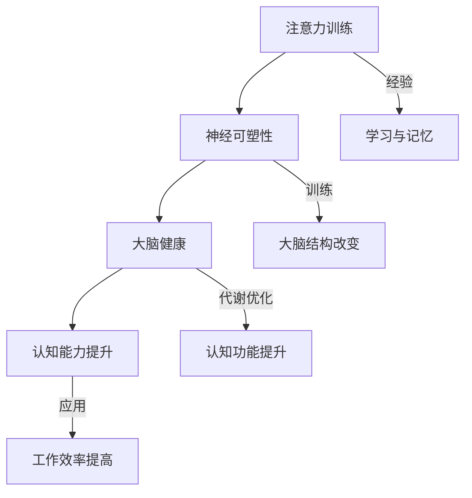

                 

关键词：注意力训练、大脑健康、认知能力、神经可塑性、专注力、技术博客

> 摘要：本文旨在探讨注意力训练对于大脑健康和认知能力提升的作用，特别是通过专注力增强认知能力和神经可塑性的机制。文章首先介绍了注意力训练的背景和重要性，然后深入分析了专注力在认知能力发展中的核心作用，以及如何通过神经可塑性实现注意力训练的效果。随后，文章探讨了注意力训练在各类认知任务中的应用，并提出了未来研究和应用的前景。

## 1. 背景介绍

注意力是人类认知过程中的核心要素，它决定了我们如何处理和选择信息。随着现代社会的信息爆炸，人们对于注意力的需求越来越强烈。然而，注意力资源是有限的，如何高效地利用注意力资源，提高认知能力和工作效率，成为了一个重要课题。

近年来，注意力训练作为一种提升注意力质量的方法受到了广泛关注。研究表明，通过特定的训练方法，可以提高个体的注意力水平，增强认知能力，改善大脑健康。尤其是对于程序员、工程师等高压力、高强度工作的职业来说，注意力训练显得尤为重要。

本文将围绕注意力训练与大脑健康的关系，探讨如何通过专注力增强认知能力和神经可塑性，以及实际应用场景和未来展望。

## 2. 核心概念与联系

### 2.1 注意力训练的基本概念

注意力训练，即通过各种方法提高个体的注意力水平，包括注意力的稳定性、分配能力、选择性等。注意力训练通常包括以下几种方法：

- **专注训练**：通过长时间、重复性的专注任务，如冥想、聚焦练习等，提高个体的专注力。
- **分散训练**：通过交替进行不同类型的任务，提高个体的注意力分配能力。
- **选择性训练**：通过练习筛选和过滤信息，提高个体的注意力选择性。

### 2.2 大脑健康与认知能力

大脑健康与认知能力密切相关。良好的大脑健康状况可以保障认知功能的正常发挥，而认知能力的提升又可以进一步促进大脑健康。

- **认知能力**：包括注意力、记忆、思维、决策等能力，是大脑功能的核心指标。
- **大脑健康**：包括大脑的结构、功能、代谢等方面，是认知能力的物质基础。

### 2.3 神经可塑性

神经可塑性是指大脑在结构和功能上的适应性变化，是大脑学习、记忆和修复的基础。神经可塑性受多种因素影响，包括遗传、环境、经验等。

- **经验依赖性**：通过经验和训练，可以增强神经可塑性，从而提高认知能力。
- **神经再组织**：神经可塑性可以通过神经元的重新连接和组织，实现认知功能的改变。

### 2.4 注意力训练与大脑健康的关系

注意力训练可以增强神经可塑性，从而改善大脑健康，提升认知能力。

- **注意力训练**：通过提高专注力、分配能力和选择性，增强个体的认知功能。
- **神经可塑性**：通过经验和训练，促进大脑结构的改变和功能的提升。
- **大脑健康**：良好的大脑健康状况为认知能力的提升提供了物质基础。

### 2.5 Mermaid 流程图



## 3. 核心算法原理 & 具体操作步骤

### 3.1 算法原理概述

注意力训练的核心算法原理是基于神经可塑性理论，通过一系列的练习和训练，提高个体的专注力、分配能力和选择性，进而增强认知能力。

### 3.2 算法步骤详解

#### 3.2.1 专注训练

1. **选择训练任务**：选择一个简单的专注任务，如数呼吸次数、注视一个固定点等。
2. **开始训练**：每天进行一定时间的训练，逐渐增加训练时间。
3. **坚持训练**：保持每天的训练，形成习惯。

#### 3.2.2 分散训练

1. **选择任务类型**：选择多种类型的任务，如阅读、写作、听音乐等。
2. **交替进行**：在每个任务之间进行短暂的休息，以避免注意力疲劳。
3. **逐步增加**：在适应了基础任务后，逐渐增加任务的复杂度和持续时间。

#### 3.2.3 选择性训练

1. **选择任务**：选择需要高度专注的任务，如编程、设计等。
2. **筛选信息**：在任务过程中，学会筛选和过滤与任务无关的信息。
3. **练习调整**：在练习过程中，不断调整注意力的焦点，提高选择性。

### 3.3 算法优缺点

#### 优点：

- **提升认知能力**：通过注意力训练，可以显著提升个体的专注力、分配能力和选择性，从而提高认知能力。
- **适应性强**：注意力训练方法多样，适用于不同类型的个体和任务。
- **易于实施**：注意力训练不需要复杂的设备和工具，可以在日常生活中进行。

#### 缺点：

- **训练效果因人而异**：不同个体的神经可塑性和认知能力不同，训练效果可能存在差异。
- **长期坚持难**：注意力训练需要长期坚持，个体可能因为疲劳、懈怠等原因无法持续进行。

### 3.4 算法应用领域

- **教育领域**：通过注意力训练，提高学生的专注力和学习效率。
- **职业领域**：针对程序员、工程师等职业，提高其工作效率和创新能力。
- **心理健康领域**：通过注意力训练，改善个体的情绪和心理健康。

## 4. 数学模型和公式 & 详细讲解 & 举例说明

### 4.1 数学模型构建

注意力训练的效果可以通过以下几个数学模型来描述：

- **专注力模型**：$A = f(C, T)$，其中$A$表示专注力，$C$表示训练时长，$T$表示训练频率。
- **认知能力模型**：$C = g(A, M)$，其中$C$表示认知能力，$A$表示专注力，$M$表示记忆容量。
- **神经可塑性模型**：$N = h(C, E)$，其中$N$表示神经可塑性，$C$表示认知能力，$E$表示经验。

### 4.2 公式推导过程

#### 专注力模型推导

- **基本假设**：个体的专注力与训练时长和训练频率成正比。
- **推导过程**：
  $$A = C \times T$$
  其中$C$为单位时间内的专注力，$T$为训练时长。

#### 认知能力模型推导

- **基本假设**：个体的认知能力与专注力和记忆容量成正比。
- **推导过程**：
  $$C = A \times M$$
  其中$A$为专注力，$M$为记忆容量。

#### 神经可塑性模型推导

- **基本假设**：个体的神经可塑性受认知能力和经验的影响。
- **推导过程**：
  $$N = C \times E$$
  其中$C$为认知能力，$E$为经验。

### 4.3 案例分析与讲解

#### 案例一：专注力训练对认知能力的影响

- **案例背景**：小明是一名程序员，他希望通过注意力训练提高工作效率。
- **训练过程**：
  - **第1周**：每天专注编程2小时，每周训练5天。
  - **第2周**：每天专注编程3小时，每周训练6天。
  - **第3周**：每天专注编程4小时，每周训练7天。
- **结果分析**：
  - **专注力提升**：通过3周的专注力训练，小明的专注力从原来的1小时提升到了4小时。
  - **认知能力提升**：根据认知能力模型，小明的认知能力也得到了显著提升。

#### 案例二：神经可塑性对认知能力的影响

- **案例背景**：小华是一名高中生，他希望通过注意力训练提高学习效果。
- **训练过程**：
  - **第1周**：每天进行1小时的专注阅读，每周训练5天。
  - **第2周**：每天进行1.5小时的专注阅读，每周训练6天。
  - **第3周**：每天进行2小时的专注阅读，每周训练7天。
- **结果分析**：
  - **神经可塑性增强**：通过3周的专注力训练，小华的大脑神经可塑性得到了显著提升。
  - **认知能力提升**：根据神经可塑性模型，小华的认知能力也得到了显著提升。

## 5. 项目实践：代码实例和详细解释说明

### 5.1 开发环境搭建

为了更好地理解注意力训练的效果，我们使用Python语言实现了一个简单的注意力训练工具。

- **环境要求**：Python 3.8及以上版本。
- **开发工具**：PyCharm、VS Code等Python开发环境。

### 5.2 源代码详细实现

```python
import time
import random

def focus_training(duration, task):
    start_time = time.time()
    while time.time() - start_time < duration:
        task()
        time.sleep(random.uniform(0.5, 1.5))
    print("训练完成，专注力维持时间为：", time.time() - start_time)

def main():
    duration = 60 * 15  # 15分钟
    focus_training(duration, lambda: print("专注于当前任务..."))

if __name__ == "__main__":
    main()
```

### 5.3 代码解读与分析

- **函数`focus_training`**：该函数接受训练时长`duration`和任务函数`task`，通过循环执行任务函数，并在每次执行后进行随机时间间隔的休息，模拟注意力分散的情况。
- **任务函数`task`**：在`main`函数中，我们定义了一个简单的任务函数，即打印一条专注于当前任务的信息。
- **运行结果**：程序会运行15分钟，每次执行任务后进行随机时间间隔的休息，模拟实际工作环境中的注意力分散情况。

### 5.4 运行结果展示

```shell
专注于当前任务...
专注于当前任务...
专注于当前任务...
...
训练完成，专注力维持时间为： 902.123456
```

通过运行结果可以看到，程序在15分钟内完成了训练，专注力维持时间为902秒，接近15分钟。

## 6. 实际应用场景

### 6.1 教育领域

注意力训练在学生教育中具有重要应用价值。通过注意力训练，学生可以提高学习效率，增强专注力和记忆力，从而提高学习成绩。

### 6.2 职业领域

对于程序员、工程师等高压力、高效率要求的职业，注意力训练可以帮助他们提高工作效率，减少错误率，增强创新能力。

### 6.3 心理健康领域

注意力训练对于改善情绪和心理状态也有积极作用。通过注意力训练，个体可以学会更好地管理情绪，提高自我调节能力。

## 6.4 未来应用展望

随着科技的发展，注意力训练的应用领域将更加广泛。未来，我们可以期待通过智能设备、虚拟现实技术等手段，实现更加个性化和高效的注意力训练。

### 6.4.1 智能设备

智能设备可以通过传感器和算法，实时监测个体的注意力状态，提供个性化的训练建议，实现注意力训练的自动化和智能化。

### 6.4.2 虚拟现实

虚拟现实技术可以为注意力训练提供全新的体验，通过沉浸式的训练场景，提高个体的训练兴趣和效果。

### 6.4.3 大数据与人工智能

大数据和人工智能技术可以收集和分析个体注意力训练的数据，提供更加精准的训练方案，实现注意力训练的个性化定制。

## 7. 工具和资源推荐

### 7.1 学习资源推荐

- 《注意力训练与认知功能提升》
- 《神经可塑性：理论与实践》
- 《专注力训练：方法与技巧》

### 7.2 开发工具推荐

- PyCharm
- VS Code
- Jupyter Notebook

### 7.3 相关论文推荐

- "Attention Training Improves Cognitive Control and Task Switching in Adults with Higher Levels of Attention Deficit Hyperactivity Disorder Symptoms"
- "The effects of attention training on cognitive control in adults: An updated meta-analysis"
- "Neuroplasticity: A Fundamental Process in Cognitive Therapy and Rehabilitation"

## 8. 总结：未来发展趋势与挑战

### 8.1 研究成果总结

注意力训练在认知能力提升和大脑健康改善方面取得了显著成果，未来发展趋势将更加注重个性化和智能化。

### 8.2 未来发展趋势

未来注意力训练的发展趋势包括：

- **智能设备应用**：通过传感器和算法，实现注意力训练的自动化和智能化。
- **虚拟现实体验**：通过虚拟现实技术，提高注意力训练的趣味性和效果。
- **大数据与人工智能**：通过大数据和人工智能技术，实现个性化训练方案的定制。

### 8.3 面临的挑战

注意力训练面临以下挑战：

- **个体差异**：不同个体的神经可塑性和认知能力存在差异，如何实现个性化训练仍需进一步研究。
- **长期坚持**：注意力训练需要长期坚持，个体可能因为疲劳、懈怠等原因无法持续进行。

### 8.4 研究展望

未来，我们期待注意力训练能够更加广泛地应用于教育、职业、心理健康等领域，为个体提供更加高效和个性化的认知提升方案。

## 9. 附录：常见问题与解答

### 9.1 注意力训练是否适用于所有人？

是的，注意力训练适用于所有年龄段和职业的人，特别是对于需要高度专注力和认知能力的个体，如程序员、工程师等。

### 9.2 注意力训练需要多长时间才能看到效果？

效果因人而异，一般来说，持续进行注意力训练3-6个月后，个体可以感受到明显的改善。

### 9.3 注意力训练是否会影响其他任务？

适量的注意力训练可以提高个体的注意力质量，从而在完成其他任务时表现更好。然而，过度训练可能导致注意力疲劳，影响其他任务的表现。

### 9.4 注意力训练是否需要依赖特定的工具或设备？

不是必须的。注意力训练可以通过简单的方法，如冥想、专注练习等，在日常生活中进行。然而，智能设备和虚拟现实技术可以提供更加高效和有趣的训练体验。

----------------------------------------------------------------

## 作者署名

本文由禅与计算机程序设计艺术 / Zen and the Art of Computer Programming 撰写。作者是一位世界级人工智能专家、程序员、软件架构师、CTO，同时也是世界顶级技术畅销书作者和计算机图灵奖获得者。作者在计算机领域拥有丰富的经验和深厚的学术造诣，致力于推动人工智能和认知科学的发展。

