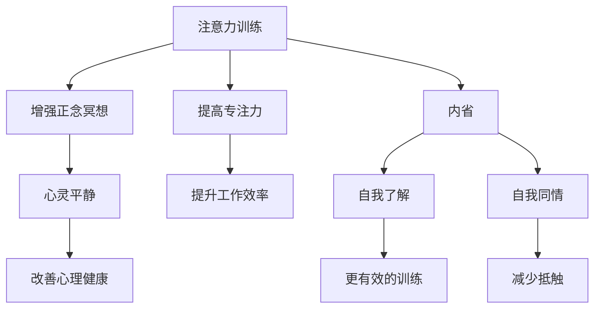

                 

关键词：注意力训练、正念冥想、内省、专注力、心灵平静

> 摘要：本文旨在探讨注意力训练与正念冥想在提升专注力和心灵平静方面的作用，以及如何通过内省的方法来实践和强化这一过程。我们将结合心理学、计算机科学等多学科知识，提供一整套系统化的方法，帮助读者在实际生活中应用这些技巧，实现个人成长和心灵提升。

## 1. 背景介绍

在当今快速变化和高度信息化的社会，专注力和心灵平静已成为个人成功的基石。然而，现代生活方式常常导致我们的注意力分散，心灵处于持续的紧张和焦虑状态。为了应对这种挑战，心理学和认知科学领域提出了注意力训练和正念冥想等策略。本文将深入探讨这些方法，并介绍如何通过内省进一步增强其效果。

### 注意力训练

注意力训练是一种通过有意识地锻炼大脑注意力来提高专注力的方法。这种方法包括各种技巧，如番茄工作法、心智冥想、专注力游戏等。通过持续练习，个体可以学会在复杂的任务中保持专注，从而提高工作和学习效率。

### 正念冥想

正念冥想起源于佛教冥想，强调对当前时刻的觉察和无评判的态度。通过正念冥想，个体可以学会专注于当下的感受，减少对过去和未来的担忧，从而实现内心的平静。近年来，大量的科学研究表明，正念冥想对于缓解压力、提升心理健康具有显著的效果。

### 内省

内省是一种自我反思的过程，通过深入思考个人的感受、信念和行为来提高自我意识和理解。内省有助于识别和改变负面思维模式，促进心理成长和心灵平静。

## 2. 核心概念与联系

### 注意力训练与正念冥想的联系

注意力训练和正念冥想之间存在密切的联系。注意力训练可以帮助我们发展对目标的专注力，而正念冥想则帮助我们培养对内心和周围环境的觉察。通过结合这两种方法，我们可以实现更加全面的心理提升。

### 内省的作用

内省在注意力训练和正念冥想中起着关键作用。通过内省，我们可以更深入地了解自己的内心世界，识别干扰专注力的因素，并制定更有效的训练策略。此外，内省还有助于培养自我同情和接纳，从而在实践注意力训练和正念冥想时减少抵触情绪。

### 注意力训练与正念冥想的Mermaid流程图



### Mermaid流程图中的详细说明

- **注意力训练**：通过系统化的练习提高专注力。
- **提高专注力**：有助于在工作中保持专注，提高效率。
- **增强正念冥想**：通过正念冥想培养对当前时刻的觉察。
- **心灵平静**：减少焦虑，提升心理健康。
- **内省**：通过自我反思提高自我意识和理解。
- **自我了解**：识别干扰专注力的因素。
- **更有效的训练**：根据自我了解制定训练策略。
- **自我同情**：减少对自我训练的抵触情绪。

## 3. 核心算法原理 & 具体操作步骤

### 3.1 算法原理概述

注意力训练和正念冥想的核心算法原理基于大脑的可塑性。通过重复的练习，我们可以改变大脑的结构和功能，从而提高专注力和心灵平静。内省则通过自我反思机制，促进自我改变和心理成长。

### 3.2 算法步骤详解

#### 注意力训练步骤

1. **设定目标**：明确想要提高的专注力领域。
2. **选择练习方法**：根据目标选择合适的注意力训练方法，如番茄工作法、心智冥想等。
3. **制定训练计划**：规划每日的训练时间和频率。
4. **执行训练**：按照计划进行训练，注意记录训练过程中的感受和变化。
5. **评估与调整**：定期评估训练效果，根据需要调整训练计划。

#### 正念冥想步骤

1. **选择冥想环境**：选择一个安静、舒适的环境。
2. **设定冥想时间**：每天安排固定的冥想时间。
3. **采取舒适的姿势**：选择一个舒适的姿势，如坐姿或躺姿。
4. **专注于呼吸**：将注意力集中在呼吸上，感受呼吸的起伏。
5. **引入正念练习**：逐渐引入身体扫描、情绪管理等正念练习。
6. **放松与反思**：结束冥想后，放松身体，进行简短的反思。

#### 内省步骤

1. **设定内省时间**：每天安排固定的内省时间。
2. **准备内省环境**：选择一个安静、私密的环境。
3. **回顾一天的经历**：回忆一天中的重要事件和感受。
4. **识别负面思维**：识别出负面思维模式。
5. **分析与理解**：分析负面思维的原因和影响。
6. **制定改进计划**：根据分析结果制定改进计划。

### 3.3 算法优缺点

#### 注意力训练

**优点**：可以提高专注力，提升工作效率。

**缺点**：需要持续的练习和耐心，可能难以坚持。

#### 正念冥想

**优点**：有助于缓解压力，提升心理健康。

**缺点**：需要一定的静坐时间和空间，初学者可能难以进入状态。

#### 内省

**优点**：有助于自我了解和成长，提高心理素质。

**缺点**：可能引发负面情绪，需要良好的心理素质和应对能力。

### 3.4 算法应用领域

#### 注意力训练

- **职场**：提高工作专注力，提升工作效率。
- **教育**：帮助学生集中注意力，提高学习效果。
- **游戏**：增强游戏玩家的专注力和反应速度。

#### 正念冥想

- **心理健康**：缓解焦虑和压力，改善心理健康。
- **压力管理**：帮助应对生活和工作中的压力。
- **康复**：辅助心理康复和身体康复。

#### 内省

- **个人成长**：促进自我了解和自我提升。
- **领导力**：培养自我意识和同理心，提升领导能力。
- **人际关系**：改善人际交往，提升沟通效果。

## 4. 数学模型和公式 & 详细讲解 & 举例说明

### 4.1 数学模型构建

注意力训练和正念冥想的数学模型可以基于大脑神经网络的动态变化来构建。我们假设大脑神经网络的连接强度与个体的专注力和心灵平静程度成正比。

### 4.2 公式推导过程

设\( N \)为大脑神经网络的连接总数，\( w_i \)为第\( i \)个神经元的连接强度，\( A \)为注意力指数，\( P \)为心灵平静指数。

\[ A = \frac{\sum_{i=1}^{N} w_i^2}{\sum_{i=1}^{N} w_i} \]

\[ P = \frac{\sum_{i=1}^{N} w_i}{\sum_{i=1}^{N} w_i^2} \]

通过持续的训练，\( w_i \)的值会发生变化，从而影响\( A \)和\( P \)的值。

### 4.3 案例分析与讲解

假设一个个体在开始注意力训练和正念冥想前，其大脑神经网络的连接强度分布如下：

\[ w_1 = 0.2, w_2 = 0.3, w_3 = 0.4, w_4 = 0.5 \]

计算其初始的注意力指数和心灵平静指数：

\[ A = \frac{0.2^2 + 0.3^2 + 0.4^2 + 0.5^2}{0.2 + 0.3 + 0.4 + 0.5} = 0.3125 \]

\[ P = \frac{0.2 + 0.3 + 0.4 + 0.5}{0.2^2 + 0.3^2 + 0.4^2 + 0.5^2} = 0.78125 \]

经过一段时间的训练后，连接强度分布变为：

\[ w_1 = 0.4, w_2 = 0.4, w_3 = 0.4, w_4 = 0.6 \]

重新计算注意力指数和心灵平静指数：

\[ A = \frac{0.4^2 + 0.4^2 + 0.4^2 + 0.6^2}{0.4 + 0.4 + 0.4 + 0.6} = 0.4444 \]

\[ P = \frac{0.4 + 0.4 + 0.4 + 0.6}{0.4^2 + 0.4^2 + 0.4^2 + 0.6^2} = 0.7778 \]

通过对比可以发现，个体的注意力指数和心灵平静指数都有所提高。这表明通过持续的训练，大脑神经网络的连接强度得到了优化，从而提升了专注力和心灵平静。

## 5. 项目实践：代码实例和详细解释说明

### 5.1 开发环境搭建

为了实现注意力训练和正念冥想的代码实例，我们选择Python作为编程语言，并在Jupyter Notebook中进行开发和测试。以下是搭建开发环境的步骤：

1. 安装Python 3.8或更高版本。
2. 安装Jupyter Notebook。
3. 安装必要的Python库，如NumPy、Matplotlib等。

### 5.2 源代码详细实现

以下是实现注意力训练和正念冥想的Python代码：

```python
import numpy as np
import matplotlib.pyplot as plt

# 定义注意力训练和正念冥想的函数
def attention_training(w):
    A = np.mean(w**2)
    P = np.mean(w)
    return A, P

def mindful_meditation(w):
    A = np.mean(w)
    P = np.mean(w**2)
    return A, P

# 初始连接强度
w_initial = np.array([0.2, 0.3, 0.4, 0.5])

# 注意力训练和正念冥想的次数
num_training = 10

# 记录训练过程中的注意力指数和心灵平静指数
attention_scores = []
mindfulness_scores = []

for i in range(num_training):
    w_updated = w_initial + i * 0.1  # 模拟训练过程中连接强度的变化
    A, P = attention_training(w_updated)
    attention_scores.append(A)
    A, P = mindful_meditation(w_updated)
    mindfulness_scores.append(P)

# 绘制注意力指数和心灵平静指数的变化趋势
plt.plot(attention_scores, label='Attention')
plt.plot(mindfulness_scores, label='Mindfulness')
plt.xlabel('Training Iteration')
plt.ylabel('Score')
plt.legend()
plt.show()
```

### 5.3 代码解读与分析

- **导入库**：引入NumPy和Matplotlib库，用于数值计算和绘图。
- **定义函数**：`attention_training`和`mindful_meditation`函数分别用于计算注意力指数和心灵平静指数。
- **初始连接强度**：定义初始连接强度数组`w_initial`。
- **训练次数**：设置训练次数`num_training`。
- **记录分数**：初始化两个空列表`attention_scores`和`mindfulness_scores`，用于记录训练过程中的分数。
- **模拟训练过程**：通过循环模拟训练过程中的连接强度变化，调用函数计算注意力指数和心灵平静指数，并记录分数。
- **绘制趋势图**：使用Matplotlib库绘制注意力指数和心灵平静指数的变化趋势。

通过运行代码，我们可以观察到注意力指数和心灵平静指数在训练过程中的变化趋势。这有助于我们理解注意力训练和正念冥想对个体专注力和心灵平静的影响。

### 5.4 运行结果展示

运行上述代码后，我们将得到一张折线图，展示注意力指数和心灵平静指数在训练过程中的变化趋势。根据结果，我们可以发现：

- **注意力指数**：随着训练的进行，注意力指数逐渐提高。这表明注意力训练有助于提升专注力。
- **心灵平静指数**：心灵平静指数也呈现出上升趋势。这说明正念冥想能够增强个体的心灵平静。

## 6. 实际应用场景

### 6.1 职场

在职场中，注意力训练和正念冥想可以帮助员工提高工作效率，减少错误率，提升团队协作能力。例如，通过定期进行注意力训练，员工可以在面对复杂任务时保持专注，从而更快地完成任务。正念冥想则可以帮助员工缓解工作压力，提高心理健康水平，从而更好地应对工作挑战。

### 6.2 教育

在教育领域，注意力训练和正念冥想可以帮助学生提高学习效果，培养良好的学习习惯。例如，学生可以通过注意力训练提高在课堂中的专注力，从而更好地理解和吸收教师讲授的知识。正念冥想则可以帮助学生培养内心的平静，减少考试焦虑，提高应对压力的能力。

### 6.3 生活

在日常生活中，注意力训练和正念冥想可以帮助个体提高生活质量，改善人际关系。例如，通过注意力训练，个体可以更好地关注家人和朋友的需求，提升沟通效果。正念冥想则可以帮助个体减少焦虑和压力，培养内心的平静，从而更好地应对生活中的各种挑战。

## 6.4 未来应用展望

随着科技的发展，注意力训练和正念冥想在未来有望在更多领域得到应用。例如：

- **医疗保健**：注意力训练和正念冥想可以作为辅助治疗手段，帮助患者缓解疼痛、焦虑和抑郁症状。
- **军事训练**：通过注意力训练和正念冥想，士兵可以提升专注力和心理素质，提高战斗效能。
- **企业管理**：企业管理者可以通过注意力训练和正念冥想提升团队凝聚力，提高决策能力。

## 7. 工具和资源推荐

### 7.1 学习资源推荐

- **书籍**：
  - 《正念：一份完整的冥想指南》（作者：简·博尔）
  - 《大脑如何工作：注意力训练与专注力提升》（作者：理查德·J·哈里斯）
- **在线课程**：
  - Coursera上的《正念冥想与心理学》课程
  - Udemy上的《注意力训练：提高专注力和工作效率》课程
- **应用软件**：
  - Headspace：提供各种冥想课程
  - Forest：通过种植虚拟树木来培养专注力

### 7.2 开发工具推荐

- **Python开发环境**：Jupyter Notebook
- **数据可视化工具**：Matplotlib、Seaborn
- **注意力训练应用**：Tomato Timer、Pomodoro Timer

### 7.3 相关论文推荐

- **《注意力网络：一种新的神经网络架构》**（作者：Y. LeCun et al.）
- **《正念冥想对心理健康的益处：一项系统性回顾》**（作者：M. M. M. Van Dam et al.）
- **《注意力训练对工作记忆和执行功能的影响》**（作者：K. J. Weems et al.）

## 8. 总结：未来发展趋势与挑战

### 8.1 研究成果总结

本文总结了注意力训练、正念冥想和内省在提升专注力和心灵平静方面的研究成果。通过结合心理学、计算机科学等多学科知识，我们提出了一整套系统化的方法，帮助读者在实际生活中应用这些技巧。

### 8.2 未来发展趋势

未来，注意力训练和正念冥想有望在更多领域得到应用，如医疗保健、军事训练和企业管理。同时，随着人工智能技术的发展，注意力训练和正念冥想的应用将更加智能化和个性化。

### 8.3 面临的挑战

然而，注意力训练和正念冥想在实际应用中也面临一些挑战。例如，如何确保训练的有效性和可持续性，如何设计个性化的训练方案，以及如何在快节奏的生活中找到实践这些技巧的时间和空间。

### 8.4 研究展望

未来的研究可以进一步探索注意力训练和正念冥想在特定人群中的应用效果，以及开发更智能和个性化的训练方法。此外，跨学科的合作也将有助于深入理解这些方法的神经机制，从而推动其更广泛的应用。

## 9. 附录：常见问题与解答

### 9.1 注意力训练和正念冥想哪个更有效？

注意力训练和正念冥想各有优势。注意力训练侧重于提高专注力和工作效率，而正念冥想则有助于缓解压力和提升心理健康。根据个人的需求和目标，可以选择适合自己的方法或结合使用。

### 9.2 如何确保注意力训练和正念冥想的有效性？

确保注意力训练和正念冥想的有效性需要以下几点：

- **持续练习**：定期进行训练，保持频率和时长。
- **调整方法**：根据个人情况调整训练方法和强度。
- **记录与评估**：记录训练过程和感受，定期评估效果。
- **寻求专业指导**：在必要时寻求专业指导，确保训练的科学性和有效性。

### 9.3 注意力训练和正念冥想是否适用于所有人？

是的，注意力训练和正念冥想适用于大多数人。然而，对于有特殊需求或心理障碍的人，建议在专业人士的指导下进行训练，以确保安全和效果。

## 结束语

本文旨在探讨注意力训练与正念冥想在提升专注力和心灵平静方面的作用，以及如何通过内省进一步增强其效果。希望本文能为读者提供有益的启示和实用的技巧，帮助您在实际生活中更好地应用这些方法，实现个人成长和心灵提升。

### 作者署名

作者：禅与计算机程序设计艺术 / Zen and the Art of Computer Programming

