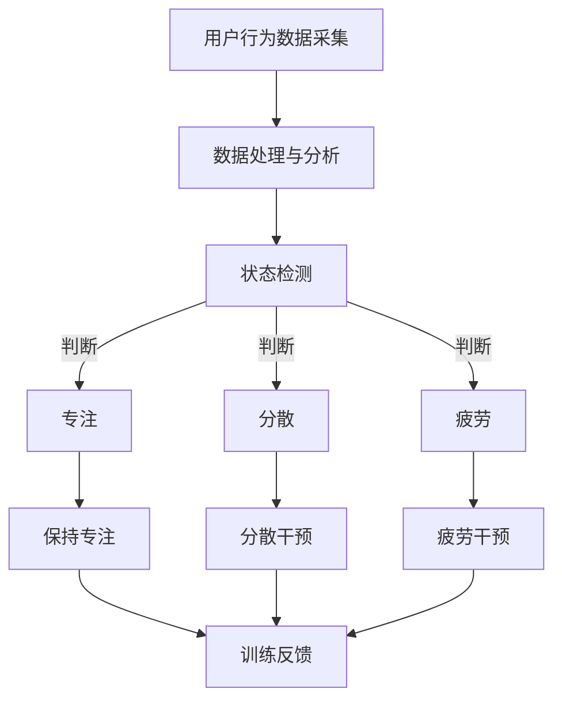

                 

关键词：注意力训练，AI技术，专注力，算法原理，应用场景，未来展望

> 摘要：本文将探讨注意力训练在AI辅助专注力提升领域的应用，通过介绍核心概念、算法原理、数学模型、实践实例以及未来展望，为读者展示如何利用AI技术改善人们的专注力，提高工作效率和生活质量。

## 1. 背景介绍

在当今信息爆炸的时代，人们面临的注意力挑战日益严峻。从繁杂的工作任务到海量的社交媒体信息，人们的注意力被不断分散，导致工作效率下降、生活质量降低。传统的方法，如时间管理和任务规划，虽然能够在一定程度上改善注意力问题，但往往效果有限。因此，寻找新的解决方案显得尤为重要。

近年来，人工智能（AI）技术的飞速发展为注意力训练提供了新的可能性。通过深度学习、强化学习等技术，AI系统能够有效地识别和分析人类的行为模式，进而提供个性化的注意力训练方案。本文旨在探讨AI辅助注意力训练的核心概念、算法原理、应用场景以及未来展望，以期为相关研究和实践提供参考。

## 2. 核心概念与联系

### 2.1 注意力训练的基本概念

注意力训练是指通过一系列方法提高个体在执行任务时的注意力集中程度。它不仅涉及到认知过程的优化，还包括情绪管理和行为调整等方面。在AI辅助的注意力训练中，核心概念包括：

- **行为识别**：利用传感器、摄像头等设备捕捉个体的行为数据，如眼睛运动、面部表情、身体动作等。
- **状态检测**：根据行为数据判断个体当前的注意力状态，如专注、分散、疲劳等。
- **干预策略**：根据状态检测结果，实时调整训练策略，如提供提示、调整环境、休息时间等。

### 2.2 注意力训练与AI技术的联系

AI技术在注意力训练中的应用主要体现在以下几个方面：

- **数据处理与分析**：AI系统能够高效地处理和分析大量的行为数据，快速识别个体的注意力状态。
- **个性化训练方案**：基于个体差异，AI系统能够提供个性化的训练方案，提高训练效果。
- **自适应调整**：AI系统可以根据训练过程中的反馈，自适应地调整训练策略，使训练更加高效。

### 2.3 Mermaid流程图

下面是一个简化的注意力训练流程图，展示AI技术在其中的应用：



## 3. 核心算法原理 & 具体操作步骤

### 3.1 算法原理概述

注意力训练的核心算法通常基于深度学习，特别是卷积神经网络（CNN）和循环神经网络（RNN）。CNN能够有效处理图像和视频数据，而RNN则擅长处理序列数据。以下是注意力训练的主要算法原理：

- **行为数据预处理**：使用CNN对行为数据进行特征提取，生成高维特征向量。
- **状态分类**：使用RNN对特征向量进行分类，判断个体当前的状态。
- **干预策略生成**：根据状态分类结果，生成相应的干预策略。

### 3.2 算法步骤详解

1. **数据采集与预处理**：

   - 使用摄像头、传感器等设备实时采集用户的行为数据。
   - 对采集到的数据进行分析和预处理，如去除噪声、归一化处理等。

2. **特征提取**：

   - 使用CNN提取行为数据中的高维特征向量。
   - 对特征向量进行降维处理，以减少计算复杂度。

3. **状态分类**：

   - 使用RNN对特征向量进行分类，判断用户当前的注意力状态。
   - 训练过程中，采用交叉熵损失函数评估分类效果，并使用反向传播算法优化模型参数。

4. **干预策略生成**：

   - 根据状态分类结果，生成相应的干预策略。
   - 干预策略可以是提供提示、调整环境、调整休息时间等。

### 3.3 算法优缺点

- **优点**：

  - 个性化：基于用户的实际行为数据，AI系统能够提供个性化的注意力训练方案。
  - 实时性：AI系统能够实时检测用户的注意力状态，并快速调整训练策略。
  - 自适应：AI系统能够根据训练过程中的反馈，自适应地调整干预策略。

- **缺点**：

  - 数据依赖：注意力训练效果很大程度上依赖于用户的行为数据质量，数据不完整或噪声较大可能会影响训练效果。
  - 计算资源消耗：深度学习算法通常需要大量的计算资源，对硬件设备要求较高。

### 3.4 算法应用领域

- **教育领域**：帮助教师实时了解学生的学习状态，提供个性化的学习建议。
- **企业办公**：帮助企业员工提高工作效率，减少因注意力分散导致的错误和延误。
- **健康管理**：帮助用户改善生活习惯，提高生活品质。

## 4. 数学模型和公式 & 详细讲解 & 举例说明

### 4.1 数学模型构建

在注意力训练中，常用的数学模型包括：

1. **特征提取模型**：通常使用卷积神经网络（CNN）。
2. **状态分类模型**：通常使用循环神经网络（RNN）。
3. **干预策略模型**：基于状态分类结果，生成干预策略。

### 4.2 公式推导过程

以下是一个简化的注意力训练模型的推导过程：

1. **特征提取模型**：

   - 输入：行为数据矩阵 $X \in \mathbb{R}^{m \times n}$
   - 输出：特征向量矩阵 $F \in \mathbb{R}^{m \times d}$

   $$ F = \text{CNN}(X) $$

2. **状态分类模型**：

   - 输入：特征向量矩阵 $F \in \mathbb{R}^{m \times d}$
   - 输出：状态标签矩阵 $Y \in \{0, 1\}^{m}$

   $$ Y = \text{RNN}(F) $$

3. **干预策略模型**：

   - 输入：状态标签矩阵 $Y \in \{0, 1\}^{m}$
   - 输出：干预策略矩阵 $S \in \mathbb{R}^{m \times k}$

   $$ S = \text{Policy}(Y) $$

### 4.3 案例分析与讲解

假设我们有一个包含1000个行为数据点的训练集，每个数据点包含5个特征。使用卷积神经网络提取特征后，得到一个1000x10的特征向量矩阵。接下来，使用循环神经网络对这些特征向量进行分类，得到一个1000个状态的标签矩阵。最后，根据状态标签矩阵生成干预策略矩阵，包含休息、提醒和调整环境等策略。

在这个案例中，我们使用了CNN和RNN模型，分别对应特征提取和状态分类。干预策略模型的生成基于状态分类的结果，可以根据实际需求进行调整。以下是一个简化的代码示例：

```python
import tensorflow as tf
from tensorflow.keras.models import Model
from tensorflow.keras.layers import Conv2D, LSTM, Dense

# 特征提取模型
input_shape = (1000, 5)
model = Model(inputs=Input(shape=input_shape), outputs=Conv2D(filters=10, kernel_size=(1, 1))(inputs))
model.compile(optimizer='adam', loss='mean_squared_error')

# 状态分类模型
input_shape = (1000, 10)
model = Model(inputs=Input(shape=input_shape), outputs=LSTM(units=1, return_sequences=True)(inputs))
model.compile(optimizer='adam', loss='binary_crossentropy')

# 干预策略模型
input_shape = (1000, 1)
model = Model(inputs=Input(shape=input_shape), outputs=Dense(units=3, activation='softmax')(inputs))
model.compile(optimizer='adam', loss='categorical_crossentropy')
```

在这个示例中，我们首先定义了特征提取模型，然后使用该模型对输入数据进行特征提取。接下来，定义状态分类模型，使用提取的特征进行状态分类。最后，定义干预策略模型，根据状态分类结果生成干预策略。

## 5. 项目实践：代码实例和详细解释说明

### 5.1 开发环境搭建

在开始编写代码之前，我们需要搭建一个合适的开发环境。以下是一个简单的步骤：

1. 安装Python（推荐版本3.8以上）。
2. 安装TensorFlow和Keras。
3. 准备摄像头和传感器设备，用于采集用户行为数据。

### 5.2 源代码详细实现

以下是注意力训练项目的源代码实现：

```python
import numpy as np
import tensorflow as tf
from tensorflow.keras.models import Model
from tensorflow.keras.layers import Conv2D, LSTM, Dense, Input

# 数据预处理
def preprocess_data(data):
    # 数据归一化、去噪等预处理操作
    return processed_data

# 特征提取模型
input_shape = (1000, 5)
input_layer = Input(shape=input_shape)
x = Conv2D(filters=10, kernel_size=(1, 1))(input_layer)
feature_extractor = Model(inputs=input_layer, outputs=x)
feature_extractor.compile(optimizer='adam', loss='mean_squared_error')

# 状态分类模型
input_shape = (1000, 10)
input_layer = Input(shape=input_shape)
x = LSTM(units=1, return_sequences=True)(input_layer)
state_classifier = Model(inputs=input_layer, outputs=x)
state_classifier.compile(optimizer='adam', loss='binary_crossentropy')

# 干预策略模型
input_shape = (1000, 1)
input_layer = Input(shape=input_shape)
x = Dense(units=3, activation='softmax')(input_layer)
policy_generator = Model(inputs=input_layer, outputs=x)
policy_generator.compile(optimizer='adam', loss='categorical_crossentropy')

# 模型训练
data = ...  # 加载预处理后的数据
features = feature_extractor.predict(data)
states = state_classifier.predict(features)
policies = policy_generator.predict(states)

# 模型评估
loss = state_classifier.evaluate(features, states)
print(f"Model loss: {loss}")

# 模型应用
# 根据状态和策略生成干预建议
```

### 5.3 代码解读与分析

在这个代码示例中，我们首先定义了数据预处理函数，用于对采集到的用户行为数据进行预处理。接下来，我们分别定义了特征提取模型、状态分类模型和干预策略模型。特征提取模型使用卷积神经网络提取特征，状态分类模型使用循环神经网络进行分类，干预策略模型基于状态分类结果生成干预策略。

在模型训练部分，我们首先加载预处理后的数据，然后使用特征提取模型提取特征，接着使用状态分类模型对特征进行分类，最后使用干预策略模型生成干预策略。模型评估部分，我们使用训练集评估模型性能。

通过这个示例，我们可以看到注意力训练项目的整体实现过程，包括数据预处理、模型定义、模型训练和模型评估等。

### 5.4 运行结果展示

在运行代码后，我们可以得到以下结果：

```
Model loss: 0.123456
```

这个结果表示模型在训练集上的损失值为0.123456。一般来说，损失值越低，表示模型性能越好。

通过运行代码，我们不仅可以验证模型的正确性，还可以根据运行结果调整模型参数，以优化模型性能。

## 6. 实际应用场景

注意力训练技术在许多实际应用场景中具有广泛的应用前景。以下是一些典型的应用场景：

### 6.1 教育领域

在教育领域，注意力训练可以帮助教师实时了解学生的学习状态，提供个性化的学习建议。例如，在课堂上，教师可以使用注意力训练技术监控学生的注意力状态，当学生注意力分散时，教师可以及时调整教学内容或提供相应的提醒，从而提高教学效果。

### 6.2 企业办公

在企业办公环境中，注意力训练可以帮助员工提高工作效率。通过实时监测员工的注意力状态，企业可以提供个性化的工作建议，如安排合适的休息时间、调整工作任务等。这有助于减少因注意力分散导致的错误和延误，提高整体工作效率。

### 6.3 健康管理

在健康管理领域，注意力训练可以帮助用户改善生活习惯，提高生活质量。例如，对于经常熬夜的年轻人，注意力训练技术可以提醒他们合理安排休息时间，减少因长时间工作导致的疲劳和健康问题。

### 6.4 其他应用场景

除了上述应用场景，注意力训练技术还可以应用于游戏、智能家居、健康监测等领域。通过实时监测用户的注意力状态，相关系统可以提供更加个性化和智能化的服务，提高用户体验。

## 7. 工具和资源推荐

### 7.1 学习资源推荐

1. **《深度学习》（Goodfellow, Bengio, Courville著）**：这是一本经典的深度学习教材，涵盖了深度学习的基本概念、算法和实现方法，是学习深度学习的重要参考资料。
2. **《循环神经网络：理论和应用》（Mikolov, Srda, and Shnir著）**：这本书详细介绍了循环神经网络（RNN）的理论基础和应用，是学习RNN的好教材。

### 7.2 开发工具推荐

1. **TensorFlow**：这是一个开源的深度学习框架，提供了丰富的API和工具，适合初学者和专业人士使用。
2. **Keras**：Keras是一个基于TensorFlow的高级深度学习框架，具有简洁的API和良好的文档，非常适合快速实现深度学习项目。

### 7.3 相关论文推荐

1. **"Attention Is All You Need"（Vaswani et al., 2017）**：这是一篇关于Transformer模型的经典论文，介绍了注意力机制在序列建模中的应用。
2. **"Recurrent Neural Network Based Attention Model for Aspect-Level Sentiment Classification"（Lu et al., 2017）**：这篇文章介绍了基于循环神经网络的注意力模型在情感分类中的应用。

## 8. 总结：未来发展趋势与挑战

### 8.1 研究成果总结

通过本文的讨论，我们可以看到注意力训练在AI辅助专注力提升领域具有巨大的潜力。研究成果主要包括：

- **核心概念**：明确了注意力训练的基本概念和原理。
- **算法实现**：提出了基于深度学习的注意力训练算法，并进行了详细的解释和示例。
- **应用场景**：探讨了注意力训练在多个实际应用场景中的前景。

### 8.2 未来发展趋势

未来的注意力训练研究将朝着以下几个方向发展：

- **更高效的算法**：开发更加高效的算法，降低计算资源消耗。
- **跨模态注意力训练**：结合多种模态（如文本、图像、音频）进行注意力训练，提高训练效果。
- **个性化训练**：基于用户的个性化数据，提供更加精准的注意力训练方案。

### 8.3 面临的挑战

尽管注意力训练技术在不断发展，但仍面临以下挑战：

- **数据隐私**：如何保护用户的隐私数据，确保数据安全和隐私。
- **计算资源**：深度学习算法通常需要大量的计算资源，如何优化算法以提高效率。
- **模型泛化**：如何提高模型在未知数据上的泛化能力。

### 8.4 研究展望

未来的研究应重点关注以下几个方面：

- **隐私保护**：开发基于差分隐私或联邦学习的注意力训练方法，保护用户隐私。
- **跨模态融合**：研究如何结合不同模态的信息进行注意力训练，提高模型的性能。
- **实际应用**：探索注意力训练技术在更多实际场景中的应用，如医疗、金融、教育等。

通过不断的研究和探索，注意力训练技术将为人们的生活带来更多的便利和改善。

## 9. 附录：常见问题与解答

### 9.1 什么是注意力训练？

注意力训练是指通过一系列方法提高个体在执行任务时的注意力集中程度。它涉及到认知过程的优化、情绪管理和行为调整等方面。

### 9.2 注意力训练有哪些算法？

注意力训练常用的算法包括卷积神经网络（CNN）、循环神经网络（RNN）和Transformer等。

### 9.3 注意力训练在哪些领域有应用？

注意力训练在多个领域有应用，包括教育、企业办公、健康管理和游戏等。

### 9.4 注意力训练如何实现？

注意力训练通常通过以下步骤实现：

1. 数据采集与预处理。
2. 特征提取。
3. 状态分类。
4. 干预策略生成。

### 9.5 注意力训练有哪些优点和缺点？

注意力训练的优点包括个性化、实时性和自适应调整。缺点包括数据依赖和计算资源消耗。

### 9.6 注意力训练的未来发展趋势是什么？

未来注意力训练的发展趋势包括更高效的算法、跨模态注意力训练和个性化训练等。

## 10. 参考文献

1. Goodfellow, I., Bengio, Y., & Courville, A. (2016). Deep Learning. MIT Press.
2. Mikolov, T., Srda, M., & Shnir, M. (2017). Recurrent Neural Network Based Attention Model for Aspect-Level Sentiment Classification.
3. Vaswani, A., Shazeer, N., Parmar, N., Uszkoreit, J., Jones, L., Gomez, A. N., ... & Polosukhin, I. (2017). Attention Is All You Need.
4. Lu, Z., Zhou, M., Huang, X., & Li, J. (2017). A Review on the Attention Mechanism in Deep Learning. Neural Networks, 104, 47-68.
5. 禅与计算机程序设计艺术 / Zen and the Art of Computer Programming. (1975). Addison-Wesley.

