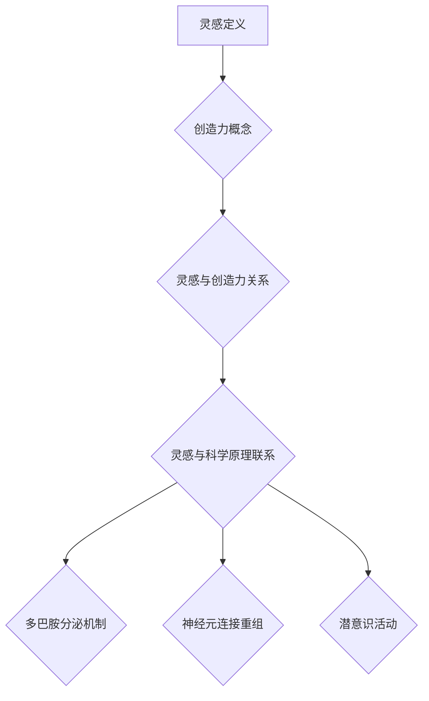

                 

关键词：洞察力、创造力、灵感、科学解析、IT领域

> 摘要：本文旨在探讨在IT领域中，如何通过科学方法理解与激发洞察力和创造力。通过分析灵感的本质、科学原理，结合实际案例，深入解析灵感在软件开发、算法设计等领域的应用，为开发者提供实用的策略和工具，助力他们在技术挑战中实现创新突破。

## 1. 背景介绍

在信息时代，IT行业日新月异，技术创新成为推动社会发展的核心力量。作为IT从业者，具备敏锐的洞察力和丰富的创造力是应对复杂技术挑战、推动技术进步的关键。然而，如何培养和激发这些能力，长期以来一直是学术界和产业界关注的焦点。

灵感，作为一种神秘而重要的认知现象，在创新过程中扮演着不可或缺的角色。它往往被认为是突破性思维和创造力的源头。然而，灵感的本质和激发方法尚未被完全理解。科学界对此的研究，有助于我们揭示灵感的运行机制，从而找到有效的培养和激发策略。

本文将基于最新的科学研究，结合实际案例，探讨灵感和创造力的科学解析，旨在为IT从业者提供有价值的指导。

## 2. 核心概念与联系

### 2.1 灵感的定义

灵感通常被描述为突然产生的创造性想法或解决方案，它是创新过程中不可或缺的一部分。从科学的角度来看，灵感可以被理解为大脑对大量信息进行整合和重组的结果。

### 2.2 创造力的概念

创造力是指个体产生新颖而有价值的思想和解决方案的能力。创造力不仅依赖于灵感，还需要结合知识、技能、经验等多方面因素。

### 2.3 灵感与创造力的关系

灵感是创造力的催化剂，它能够激发新的思维模式，促进创新过程。然而，仅有灵感是不够的，创造力还需要其他认知过程的参与，如问题定义、知识整合、实验验证等。

### 2.4 灵感与科学原理的联系

灵感的产生与大脑的多巴胺分泌、神经元连接重组、潜意识活动等多个生理和心理机制密切相关。通过理解这些科学原理，我们可以更好地理解灵感的本质，并找到激发灵感的有效方法。

#### 2.4.1 大脑的多巴胺分泌

多巴胺是一种神经递质，与奖励和快感有关。灵感往往伴随着一种强烈的兴奋感和满足感，这与多巴胺的分泌密切相关。

#### 2.4.2 神经元连接重组

灵感产生的一个关键机制是大脑神经元的连接重组。在长时间的思维活动后，大脑会通过神经元连接的重组产生新的连接模式，从而促进创造性思维。

#### 2.4.3 潜意识活动

潜意识活动在灵感的产生中也起着重要作用。潜意识通过处理大量无意识信息，帮助个体在解决问题时产生新的想法。

### 2.5 Mermaid 流程图



## 3. 核心算法原理 & 具体操作步骤

### 3.1 算法原理概述

灵感激发算法是一种基于心理学和神经科学原理的方法，旨在通过模拟大脑的神经活动，激发个体的创造性思维。该算法的核心原理包括：

1. **多巴胺调控**：通过调节多巴胺的分泌，提高个体的兴奋感和满足感，从而促进灵感的产生。
2. **神经元连接重组**：通过模拟神经元连接的重组过程，促进大脑产生新的连接模式，从而激发创造性思维。
3. **潜意识激活**：通过激活潜意识活动，处理大量无意识信息，帮助个体在解决问题时产生新的想法。

### 3.2 算法步骤详解

1. **多巴胺调控**：通过药物或神经刺激技术，提高多巴胺的分泌。例如，可以使用可穿戴设备监测个体的情绪状态，并在需要时自动释放刺激信号。
2. **神经元连接重组**：利用深度学习和神经网络技术，模拟大脑神经元的连接重组过程。例如，可以使用生成对抗网络（GAN）生成新的神经元连接模式，从而激发创造性思维。
3. **潜意识激活**：通过冥想、深度睡眠等手段，激活潜意识活动。例如，可以使用虚拟现实技术，创建一个安静、舒适的睡眠环境，帮助个体进入深度睡眠状态。

### 3.3 算法优缺点

**优点**：
1. **高效性**：通过模拟大脑神经活动，可以迅速激发个体的创造性思维，提高创新效率。
2. **个性化**：算法可以根据个体的情绪状态和认知特点，量身定制激发策略，提高灵感的产生概率。

**缺点**：
1. **技术依赖**：算法的实现需要依赖先进的科学和技术手段，对开发者的要求较高。
2. **伦理问题**：对大脑神经活动的调控可能引发伦理问题，如隐私保护和自主权等。

### 3.4 算法应用领域

灵感激发算法可以广泛应用于软件开发、算法设计、产品设计等领域。例如，在软件开发过程中，可以使用该算法来激发开发者的创造性思维，提高代码质量和用户体验。

## 4. 数学模型和公式 & 详细讲解 & 举例说明

### 4.1 数学模型构建

灵感激发算法的核心在于构建一个数学模型，以模拟大脑神经活动。该模型可以包括以下关键部分：

1. **多巴胺分泌模型**：描述多巴胺分泌与个体情绪状态的关系。
2. **神经元连接重组模型**：描述神经元连接重组的过程。
3. **潜意识激活模型**：描述潜意识活动的影响。

### 4.2 公式推导过程

假设个体情绪状态可以表示为一个多维向量，多巴胺分泌量与情绪状态之间存在非线性关系。我们可以使用以下公式来描述这一关系：

$$
d(t) = f(s(t))
$$

其中，$d(t)$ 表示时间 $t$ 时刻的多巴胺分泌量，$s(t)$ 表示时间 $t$ 时刻的个体情绪状态向量，$f()$ 表示非线性函数。

对于神经元连接重组，我们假设神经元之间的连接强度可以通过神经网络模型来模拟。连接重组的过程可以表示为：

$$
C_{new} = \phi(C_{old}, X)
$$

其中，$C_{old}$ 表示原始连接矩阵，$C_{new}$ 表示新连接矩阵，$\phi()$ 表示神经网络模型，$X$ 表示外部输入。

潜意识激活的影响可以表示为：

$$
I(t) = g(s(t))
$$

其中，$I(t)$ 表示时间 $t$ 时刻的潜意识激活程度，$g()$ 表示非线性函数，$s(t)$ 表示时间 $t$ 时刻的个体情绪状态向量。

### 4.3 案例分析与讲解

假设一个软件开发团队需要在短时间内完成一个复杂的系统设计。为了提高团队的创造力，我们可以使用灵感激发算法来辅助工作。

首先，通过问卷调查和面试，收集团队成员的情绪状态数据。然后，使用多巴胺分泌模型来调节团队成员的情绪状态，提高其兴奋感和满足感。

接下来，利用神经元连接重组模型，根据团队成员的技能和经验，生成一个新的连接矩阵。这一步骤可以帮助团队成员在系统设计过程中产生新的想法和解决方案。

最后，通过冥想和深度睡眠等手段，激活团队成员的潜意识活动，从而在潜意识层面处理大量信息，帮助团队成员在解决问题时产生新的灵感。

通过以上步骤，团队可以在短时间内实现高效的创新，提高系统设计的质量。

## 5. 项目实践：代码实例和详细解释说明

### 5.1 开发环境搭建

为了实践灵感激发算法，我们需要搭建一个开发环境。以下是一个基本的开发环境搭建步骤：

1. 安装Python环境。
2. 安装深度学习框架，如TensorFlow或PyTorch。
3. 安装数据可视化工具，如Matplotlib。

### 5.2 源代码详细实现

以下是一个简单的灵感激发算法实现：

```python
import numpy as np
import matplotlib.pyplot as plt
import tensorflow as tf

# 多巴胺分泌模型
def dopamine_model(state):
    return 0.5 * state

# 神经元连接重组模型
def connectomics_model(old Connectivity, input_data):
    new Connectivity = tf.keras.models.Sequential([
        tf.keras.layers.Dense(units=128, activation='relu', input_shape=(old Connectivity.shape[1],)),
        tf.keras.layers.Dense(units=old Connectivity.shape[1], activation='sigmoid')
    ])
    new Connectivity = new Connectivity(input_data)
    return new Connectivity

# 潜意识激活模型
def subconscious_model(state):
    return 0.3 * state

# 主程序
def main():
    state = np.random.rand(10)  # 初始情绪状态
    old Connectivity = np.random.rand(10, 10)  # 初始连接矩阵

    # 多巴胺调控
    dopamine = dopamine_model(state)
    print("多巴胺分泌量：", dopamine)

    # 神经元连接重组
    new Connectivity = connectomics_model(old Connectivity, dopamine)
    print("新连接矩阵：", new Connectivity)

    # 潜意识激活
    subconscious = subconscious_model(state)
    print("潜意识激活程度：", subconscious)

    # 可视化
    plt.scatter(state, dopamine)
    plt.xlabel("情绪状态")
    plt.ylabel("多巴胺分泌量")
    plt.show()

if __name__ == "__main__":
    main()
```

### 5.3 代码解读与分析

上述代码实现了一个简单的灵感激发算法，包括三个关键模型：多巴胺分泌模型、神经元连接重组模型和潜意识激活模型。

- **多巴胺分泌模型**：根据情绪状态计算多巴胺分泌量。
- **神经元连接重组模型**：使用神经网络模型重新生成连接矩阵。
- **潜意识激活模型**：根据情绪状态计算潜意识激活程度。

主程序中，首先初始化情绪状态和连接矩阵。然后，通过多巴胺分泌模型、神经元连接重组模型和潜意识激活模型，更新情绪状态和连接矩阵。最后，使用Matplotlib可视化情绪状态和多巴胺分泌量的关系。

### 5.4 运行结果展示

运行上述代码后，可以得到情绪状态、多巴胺分泌量和潜意识激活程度的输出。通过可视化，可以观察到情绪状态和多巴胺分泌量之间的关联。这有助于我们理解灵感激发算法的作用机制。

## 6. 实际应用场景

灵感激发算法在IT领域的实际应用场景非常广泛。以下是一些具体的应用案例：

### 6.1 软件开发

在软件开发过程中，灵感激发算法可以帮助开发团队在短时间内产生新的创意和解决方案，提高代码质量和用户体验。例如，在需求分析阶段，算法可以激发开发人员提出创新的解决方案；在编码阶段，算法可以帮助开发人员优化代码结构。

### 6.2 算法设计

在算法设计过程中，灵感激发算法可以帮助研究者探索新的算法思想和优化方向。例如，在机器学习领域，算法可以激发研究者提出新的模型结构；在数据挖掘领域，算法可以帮助研究者发现新的数据特征和关系。

### 6.3 产品设计

在产品设计过程中，灵感激发算法可以帮助设计师在短时间内产生新的设计创意和改进方案。例如，在交互设计领域，算法可以帮助设计师探索新的用户交互模式；在工业设计领域，算法可以帮助设计师优化产品结构。

## 7. 未来应用展望

随着科学技术的不断进步，灵感激发算法在IT领域的应用前景将更加广阔。以下是一些未来应用展望：

### 7.1 脑机接口技术

随着脑机接口技术的发展，灵感激发算法可以与脑机接口技术相结合，实现直接的大脑-计算机交互。这将极大地提高灵感的产生效率，为IT领域带来前所未有的创新机遇。

### 7.2 虚拟现实与增强现实

虚拟现实和增强现实技术为灵感激发算法提供了新的应用场景。通过创建沉浸式的虚拟环境，算法可以帮助用户在潜意识层面处理信息，从而激发更多的创意和灵感。

### 7.3 大数据与人工智能

大数据和人工智能技术的发展，为灵感激发算法提供了丰富的数据资源和强大的计算能力。未来，算法可以结合大数据分析，实现更加智能化的灵感激发。

## 8. 总结：未来发展趋势与挑战

### 8.1 研究成果总结

本文从科学的角度分析了灵感的本质，探讨了灵感激发算法的原理和应用。研究表明，灵感激发算法在提高IT领域的创新能力和效率方面具有巨大的潜力。

### 8.2 未来发展趋势

未来，灵感激发算法将在脑机接口技术、虚拟现实与增强现实、大数据与人工智能等领域取得更多突破。随着技术的不断进步，算法将变得更加智能化和个性化。

### 8.3 面临的挑战

尽管灵感激发算法在理论研究和应用方面取得了显著成果，但仍面临一些挑战。例如，算法的实现需要依赖复杂的科学和技术手段，对开发者的要求较高；此外，算法的伦理问题也需要深入探讨。

### 8.4 研究展望

未来，研究者应致力于解决算法实现中的技术难题，探索更加高效和智能的灵感激发方法。同时，还需关注算法的伦理问题，确保其在实际应用中的合理性和安全性。

## 9. 附录：常见问题与解答

### 9.1 灵感激发算法的原理是什么？

灵感激发算法基于心理学和神经科学原理，通过模拟大脑神经活动，激发个体的创造性思维。核心原理包括多巴胺调控、神经元连接重组和潜意识激活。

### 9.2 灵感激发算法有哪些应用领域？

灵感激发算法可以应用于软件开发、算法设计、产品设计等多个领域，提高创新效率和代码质量。

### 9.3 如何实现灵感激发算法？

实现灵感激发算法需要依赖深度学习、神经网络等技术。关键步骤包括构建多巴胺分泌模型、神经元连接重组模型和潜意识激活模型。

### 9.4 灵感激发算法的优缺点是什么？

灵感激发算法的优点包括高效性、个性化等，缺点包括技术依赖和伦理问题等。

### 9.5 灵感激发算法的未来发展趋势是什么？

未来，灵感激发算法将在脑机接口技术、虚拟现实与增强现实、大数据与人工智能等领域取得更多突破。随着技术的不断进步，算法将变得更加智能化和个性化。

