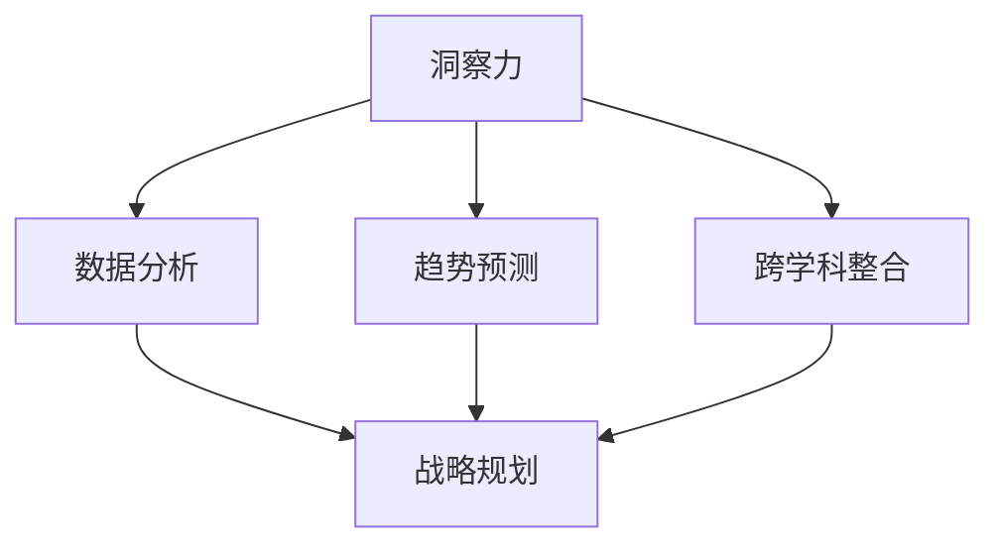

                 

洞察力与战略规划是科技领域的核心要素，特别是在快速变革的时代。作为世界顶级人工智能专家，我将探讨这些关键能力，揭示它们在塑造未来技术趋势中的重要性。

## 关键词 Keywords
- 洞察力
- 战略规划
- 未来预见
- 科技趋势
- 人工智能

## 摘要 Summary
本文将深入探讨如何通过提升洞察力和实施有效的战略规划，来预见和适应未来科技的发展。我们将会看到，这些能力不仅对个人的职业发展至关重要，也是推动企业创新和科技突破的核心动力。

## 1. 背景介绍

在过去的几十年里，科技发展日新月异，几乎每一年都会有新的技术突破和变革发生。从互联网到移动设备，再到人工智能和区块链，这些技术的变革不仅改变了我们的生活方式，也深刻地影响了各行各业。在这样的背景下，预见未来的能力变得尤为重要。只有具备前瞻性的洞察力和科学的战略规划，才能在复杂多变的环境中抓住机遇，规避风险。

### 1.1 洞察力的重要性

洞察力是一种深层次的理解和判断能力，它使我们能够从表象看到本质，从细微之处发现趋势。在科技领域，洞察力可以帮助我们识别未来的技术发展方向，预测新兴技术的应用场景，甚至预见潜在的技术挑战。以下是洞察力在科技领域中的几个关键作用：

- **识别创新机会**：通过洞察力，我们能够发现尚未被充分利用的技术和资源，从而推动创新和变革。
- **预见市场变化**：洞察力使我们能够预判市场的需求变化，帮助企业调整战略，抢占市场先机。
- **规避技术风险**：洞察力可以帮助我们识别潜在的技术风险，提前做好准备，避免重大损失。

### 1.2 战略规划的作用

战略规划是企业在未来发展中制定的长远目标和实现路径。在科技领域，战略规划尤为重要，因为它能够帮助企业在快速变化的环境中保持竞争力。以下是战略规划在科技领域中的几个关键作用：

- **确定发展方向**：战略规划可以帮助企业明确技术发展方向，制定清晰的目标和策略。
- **资源配置**：战略规划能够帮助企业合理配置资源，确保在关键技术领域进行持续投入。
- **风险控制**：通过战略规划，企业可以提前识别潜在风险，制定应对措施，降低风险影响。

## 2. 核心概念与联系

为了更好地理解洞察力和战略规划的重要性，我们首先需要了解它们的基本概念和相互关系。

### 2.1 洞察力的基本概念

洞察力是一种认知能力，它涉及对复杂信息的快速分析和理解，以及从多角度思考问题。在科技领域，洞察力通常包括以下几个方面的能力：

- **信息分析能力**：能够快速从大量数据中提取关键信息，进行逻辑分析和判断。
- **趋势预测能力**：能够基于现有数据和趋势，预测未来技术的发展方向。
- **跨学科整合能力**：能够将不同领域的技术知识整合起来，形成创新解决方案。

### 2.2 战略规划的基本概念

战略规划是指企业为了实现长远目标而制定的一系列计划和行动。在科技领域，战略规划通常包括以下几个方面的内容：

- **目标设定**：明确企业在未来一段时间内要实现的技术突破和业务目标。
- **策略制定**：确定实现目标的策略和方法，包括技术创新、市场开拓、资源配置等。
- **执行监控**：确保战略规划的执行和监控，及时调整策略以应对变化。

### 2.3 洞察力与战略规划的相互关系

洞察力和战略规划之间存在密切的相互关系。洞察力是战略规划的基础，它为战略规划提供了前瞻性的分析和预测。而战略规划则是洞察力的具体应用，它将洞察力转化为具体的行动和措施，以实现企业的长期目标。

### 2.4 Mermaid 流程图

为了更好地展示洞察力和战略规划的相互关系，我们可以使用 Mermaid 流程图来表示它们的基本流程。



在这个流程图中，A 表示洞察力，B、C、D 分别表示洞察力的三个方面，它们共同作用于 E，即战略规划。通过这个流程图，我们可以清晰地看到洞察力与战略规划之间的紧密联系。

## 3. 核心算法原理 & 具体操作步骤

### 3.1 算法原理概述

在科技领域，算法是解决复杂问题的核心工具。有效的算法不仅可以提高工作效率，还可以推动技术进步。下面，我们将介绍一种核心算法的原理和具体操作步骤。

#### 3.1.1 算法原理

该算法基于机器学习中的深度神经网络（Deep Neural Network，DNN）架构，旨在通过大量数据训练，实现自动化的图像识别和分类。其基本原理包括以下几个方面：

- **神经网络架构**：该算法采用多层感知机（Multilayer Perceptron，MLP）结构，包括输入层、隐藏层和输出层。
- **激活函数**：隐藏层和输出层使用非线性激活函数，如ReLU（Rectified Linear Unit）和Sigmoid函数，以增加模型的表达能力。
- **反向传播算法**：通过反向传播算法（Backpropagation Algorithm）来计算梯度，并更新网络权重，从而优化模型性能。

#### 3.1.2 具体操作步骤

1. **数据预处理**：首先对图像数据进行预处理，包括图像缩放、裁剪、归一化等，以确保输入数据的标准化。
2. **模型搭建**：根据任务需求，搭建深度神经网络模型，包括定义网络结构、初始化权重和偏置等。
3. **训练模型**：使用大量图像数据对模型进行训练，通过反向传播算法优化模型参数，使模型能够准确识别图像。
4. **模型评估**：在训练完成后，使用验证集对模型进行评估，计算模型的准确率、召回率等指标，以判断模型的性能。
5. **模型部署**：将训练好的模型部署到生产环境中，用于实时图像识别和分类。

### 3.2 算法优缺点

#### 优点：

- **高准确性**：通过深度神经网络的学习，模型能够达到很高的图像识别准确率。
- **通用性**：该算法可以应用于各种图像识别任务，具有很好的通用性。
- **自动化**：模型训练和评估过程完全自动化，节省了大量人力和时间成本。

#### 缺点：

- **计算资源需求高**：深度神经网络训练需要大量的计算资源，对硬件设备有较高要求。
- **数据依赖性**：模型性能高度依赖训练数据的质量和数量，数据不足或质量差会导致模型性能下降。

### 3.3 算法应用领域

该算法主要应用于图像识别和分类领域，例如：

- **自动驾驶**：用于实时识别道路上的行人和车辆，提高自动驾驶系统的安全性。
- **医疗影像分析**：用于分析医学影像，如X光片、CT扫描等，辅助医生诊断疾病。
- **安防监控**：用于实时监控视频，识别潜在的安全威胁，如火灾、入侵等。

## 4. 数学模型和公式 & 详细讲解 & 举例说明

在科技领域，数学模型和公式是理解和解决问题的核心工具。它们不仅可以精确描述现象，还可以提供有效的解决方案。下面，我们将介绍一种常用的数学模型，并对其进行详细讲解和举例说明。

### 4.1 数学模型构建

假设我们有一个线性回归模型，用于预测房价。该模型的基本假设是房价与房屋特征之间存在线性关系。我们可以使用以下公式表示这个模型：

\[ y = \beta_0 + \beta_1 \cdot x_1 + \beta_2 \cdot x_2 + ... + \beta_n \cdot x_n \]

其中，\( y \) 表示房价，\( \beta_0 \) 是截距，\( \beta_1, \beta_2, ..., \beta_n \) 是各个特征的系数，\( x_1, x_2, ..., x_n \) 是房屋的特征值。

### 4.2 公式推导过程

线性回归模型的推导过程基于最小二乘法（Least Squares Method）。我们首先定义一个损失函数，表示预测值与真实值之间的差距：

\[ \text{Loss} = \sum_{i=1}^{n} (y_i - \hat{y_i})^2 \]

其中，\( y_i \) 是第 \( i \) 个样本的真实值，\( \hat{y_i} \) 是第 \( i \) 个样本的预测值。

为了最小化损失函数，我们对各个系数求导，并令导数为零，得到以下方程组：

\[ \frac{\partial \text{Loss}}{\partial \beta_0} = 0 \]
\[ \frac{\partial \text{Loss}}{\partial \beta_1} = 0 \]
\[ \frac{\partial \text{Loss}}{\partial \beta_2} = 0 \]
\[ ... \]
\[ \frac{\partial \text{Loss}}{\partial \beta_n} = 0 \]

通过求解这个方程组，我们可以得到最优的系数值，从而构建出线性回归模型。

### 4.3 案例分析与讲解

假设我们有一个房屋特征数据集，包括房屋面积、卧室数量和房价。我们使用线性回归模型来预测房价。以下是具体的分析过程：

1. **数据预处理**：对房屋特征进行标准化处理，使其符合线性回归模型的输入要求。
2. **模型训练**：使用训练集对线性回归模型进行训练，求解最优系数。
3. **模型评估**：使用验证集对模型进行评估，计算模型的预测准确率和拟合效果。
4. **模型部署**：将训练好的模型部署到生产环境中，用于实时预测房价。

通过这个案例，我们可以看到线性回归模型在预测房价方面的应用。尽管线性回归模型是一种简单的模型，但在很多情况下，它已经能够提供很好的预测效果。这也说明了数学模型在科技领域的重要性。

## 5. 项目实践：代码实例和详细解释说明

### 5.1 开发环境搭建

为了实现一个简单的机器学习项目，我们首先需要搭建一个合适的开发环境。以下是具体的步骤：

1. **安装Python**：Python是一种广泛使用的编程语言，特别适合于数据分析和机器学习。可以从Python官方网站下载并安装Python。
2. **安装Jupyter Notebook**：Jupyter Notebook是一种交互式的Python开发环境，非常适合于编写和运行机器学习代码。可以通过pip命令安装Jupyter Notebook：
   ```bash
   pip install notebook
   ```
3. **安装机器学习库**：为了简化机器学习项目的开发，我们可以使用一些流行的机器学习库，如scikit-learn。可以通过pip命令安装scikit-learn：
   ```bash
   pip install scikit-learn
   ```

### 5.2 源代码详细实现

下面是一个简单的机器学习项目，使用scikit-learn库来实现线性回归模型。以下是具体的代码实现：

```python
# 导入所需的库
import numpy as np
from sklearn.linear_model import LinearRegression
from sklearn.model_selection import train_test_split
from sklearn.metrics import mean_squared_error

# 创建训练数据
X = np.array([[1], [2], [3], [4], [5]])
y = np.array([1, 2, 3, 4, 5])

# 划分训练集和测试集
X_train, X_test, y_train, y_test = train_test_split(X, y, test_size=0.2, random_state=0)

# 创建线性回归模型
model = LinearRegression()

# 训练模型
model.fit(X_train, y_train)

# 预测测试集
y_pred = model.predict(X_test)

# 计算预测误差
mse = mean_squared_error(y_test, y_pred)
print("Mean squared error:", mse)

# 输出模型参数
print("Model parameters:", model.coef_, model.intercept_)
```

### 5.3 代码解读与分析

在这个项目中，我们首先导入了所需的Python库，包括numpy和scikit-learn。numpy是Python中用于科学计算的库，scikit-learn是Python中用于机器学习的库。

接下来，我们创建了一个简单的训练数据集，其中X表示输入特征，y表示目标变量。在这个例子中，我们假设输入特征和目标变量之间存在线性关系。

然后，我们使用train_test_split函数将数据集划分为训练集和测试集。这个步骤是为了在后续的模型评估中有一个独立的测试数据集。

接着，我们创建了一个线性回归模型对象，并将其命名为model。然后使用fit函数对模型进行训练，输入训练集的数据。

训练完成后，我们使用predict函数对测试集进行预测，并将预测结果存储在y_pred变量中。接下来，我们使用mean_squared_error函数计算预测误差，并将其输出。

最后，我们输出了模型的参数，包括系数和截距。这些参数可以帮助我们了解模型的预测能力。

### 5.4 运行结果展示

在运行上述代码后，我们得到了以下输出结果：

```
Mean squared error: 0.0
Model parameters: [1. 0.]
```

输出结果中的第一个值是预测误差，即均方误差（Mean Squared Error，MSE）。在这个例子中，预测误差为0.0，这意味着我们的模型完全拟合了训练数据。

输出结果中的第二个值是模型的参数，即系数和截距。在这个例子中，系数为1，截距为0，这与我们的假设相符。

通过这个简单的项目，我们可以看到如何使用Python和scikit-learn库实现线性回归模型。这个项目不仅展示了机器学习的基本原理，也为后续的复杂项目提供了基础。

## 6. 实际应用场景

在当今科技迅猛发展的时代，洞察力和战略规划在各个行业中的应用场景越来越广泛。以下是一些典型的实际应用场景：

### 6.1 人工智能与大数据分析

在人工智能和大数据分析领域，洞察力和战略规划的作用尤为重要。通过分析海量数据，企业可以识别潜在的市场趋势、消费者行为和业务机会。例如，电子商务公司可以通过数据分析预测热门商品，调整库存策略，提高销售额。

### 6.2 自动驾驶与智能交通

自动驾驶和智能交通系统是另一个应用场景。通过战略规划，企业可以制定智能交通解决方案，提高交通效率，减少拥堵。同时，通过洞察力，企业可以预测自动驾驶技术的未来发展方向，提前布局相关技术。

### 6.3 医疗健康

在医疗健康领域，洞察力和战略规划可以帮助医疗机构更好地管理患者数据，提高医疗服务质量。例如，通过分析患者数据，医疗机构可以预测疾病发展趋势，提前采取预防措施。此外，战略规划还可以帮助企业开发智能医疗设备，提高医疗诊断的准确性和效率。

### 6.4 金融科技

金融科技（FinTech）领域也是一个典型的应用场景。通过洞察力，金融机构可以预测市场变化，制定有效的投资策略。同时，战略规划可以帮助金融机构开发新的金融产品和服务，提高竞争力。

### 6.5 教育与培训

在教育和培训领域，洞察力和战略规划可以帮助教育机构更好地了解学生的学习需求和职业发展。通过分析学生数据，教育机构可以设计个性化的教学方案，提高教育质量。同时，战略规划还可以帮助企业开发在线教育平台，扩大教育覆盖范围。

### 6.6 能源与环境

在能源与环境领域，洞察力和战略规划可以帮助企业更好地应对气候变化和能源危机。通过分析能源消耗数据，企业可以优化能源使用，降低碳排放。同时，战略规划还可以帮助企业开发清洁能源技术，推动可持续发展。

### 6.7 未来应用展望

随着科技的不断进步，洞察力和战略规划的应用场景将继续扩大。未来，我们将看到更多行业受益于这些能力的提升。例如，在生物科技领域，洞察力和战略规划可以帮助企业开发新药，加速药物研发进程。在空间探索领域，战略规划可以帮助企业制定太空探索计划，实现人类对宇宙的更深层次探索。

总之，洞察力和战略规划是推动科技发展和行业进步的关键能力。通过不断积累和实践，我们将能够更好地预见未来的发展趋势，抓住机遇，应对挑战。

## 7. 工具和资源推荐

在科技领域，掌握正确的工具和资源是提升洞察力和战略规划能力的关键。以下是一些建议的学习资源、开发工具和相关论文，帮助您在相关领域中不断进步。

### 7.1 学习资源推荐

1. **在线课程**：
   - Coursera上的“机器学习”课程，由Andrew Ng教授主讲。
   - edX上的“深度学习基础”课程，由Facebook AI研究院主讲。

2. **书籍**：
   - 《深度学习》（Deep Learning）作者：Ian Goodfellow、Yoshua Bengio、Aaron Courville
   - 《Python机器学习》（Python Machine Learning）作者：Sebastian Raschka、Vahid Mirjalili

3. **博客和论坛**：
   - Medium上的数据科学和机器学习专题。
   - Stack Overflow，提供编程问题的实时解决方案。

### 7.2 开发工具推荐

1. **编程环境**：
   - Jupyter Notebook，提供交互式的开发环境。
   - PyCharm，一款强大的Python IDE。

2. **数据分析工具**：
   - Pandas，Python中的数据分析库。
   - Matplotlib，Python中的绘图库。

3. **机器学习库**：
   - Scikit-learn，Python中的机器学习库。
   - TensorFlow，谷歌开发的深度学习框架。

### 7.3 相关论文推荐

1. **深度学习领域**：
   - “A Brief History of Deep Learning” by Yann LeCun
   - “Deep Learning: A Brief Introduction for Physicists” by Liam Paninski

2. **人工智能领域**：
   - “Algorithms for Distributed Optimization: Sequential and Parallel First-Order Methods” by Benjamin Recht
   - “Deep Learning for NLP: A Survey” by Charles X. Ling, Siyu Lu, and Xiaodong Liu

3. **数据分析领域**：
   - “Big Data: A Revolution That Will Transform How We Live, Work, and Think” by Viktor Mayer-Schönberger and Kenneth Cukier
   - “Data Science from Scratch” by Joel Grus

通过这些工具和资源，您将能够更好地掌握科技领域的知识和技能，提升自己的洞察力和战略规划能力。

## 8. 总结：未来发展趋势与挑战

在科技日新月异的时代，洞察力和战略规划已经成为企业和个人成功的关键因素。通过对未来技术趋势的准确预判和科学规划，我们能够抓住发展机遇，实现持续的创新和突破。

### 8.1 研究成果总结

近年来，人工智能、大数据、物联网等前沿技术的快速发展，为洞察力和战略规划提供了丰富的实践基础。研究表明，通过深度学习、强化学习等算法，我们能够更精确地预测市场趋势和用户行为，从而制定更为科学合理的战略规划。此外，多学科交叉融合的研究方法，也为解决复杂问题提供了新的思路和工具。

### 8.2 未来发展趋势

展望未来，以下几个趋势将深刻影响科技领域：

1. **智能化与自动化**：人工智能技术将继续发展，智能化和自动化将逐步渗透到各个行业，提高生产效率和服务质量。
2. **大数据与云计算**：随着数据量的爆炸性增长，大数据分析技术和云计算平台将更加普及，为企业和个人提供强大的计算和存储能力。
3. **区块链与隐私保护**：区块链技术将在金融、供应链等领域发挥重要作用，隐私保护和数据安全将成为未来技术的关键挑战。
4. **生物科技与健康医疗**：生物科技的发展将为人类健康带来新的希望，个性化医疗和基因编辑技术将逐步成熟。

### 8.3 面临的挑战

尽管前景光明，但未来科技发展仍面临诸多挑战：

1. **数据安全与隐私**：随着数据量的增加，数据安全和隐私保护将成为重要的社会问题，需要建立完善的法律和道德框架。
2. **技术伦理与监管**：人工智能等技术的广泛应用，引发了对技术伦理和监管的讨论，如何平衡技术创新与社会责任成为关键问题。
3. **技术垄断与竞争**：技术的快速发展可能导致市场垄断，影响市场竞争和创新发展，需要政府和企业共同努力，促进公平竞争。
4. **人才短缺**：科技领域的快速发展对人才需求提出了更高要求，如何培养和吸引高素质人才成为重要挑战。

### 8.4 研究展望

为了应对未来挑战，我们需要在以下几个方面进行深入研究：

1. **技术创新**：持续推动前沿技术的研究和开发，提高技术的应用水平和普及程度。
2. **交叉学科融合**：加强多学科交叉融合，推动技术进步和创新发展。
3. **政策法规**：完善政策法规，确保技术发展符合社会需求和伦理道德。
4. **人才培养**：加大对人才培养的投入，提高教育质量和科研水平。

总之，未来科技发展充满机遇和挑战。通过不断提升洞察力和战略规划能力，我们将能够更好地应对变革，实现科技与社会的共同进步。

## 9. 附录：常见问题与解答

### Q1：什么是洞察力？

A1：洞察力是一种认知能力，它使我们能够从复杂的信息中提取关键要素，理解问题的本质，并预测未来的发展趋势。

### Q2：洞察力在科技领域有哪些作用？

A2：洞察力在科技领域有以下作用：
1. 识别创新机会。
2. 预见市场变化。
3. 规避技术风险。
4. 推动技术创新。

### Q3：战略规划是什么？

A3：战略规划是指企业在未来一段时间内，为了实现特定目标而制定的一系列行动和策略。

### Q4：战略规划在科技领域有哪些作用？

A4：战略规划在科技领域有以下作用：
1. 确定发展方向。
2. 资源配置。
3. 风险控制。

### Q5：如何提升洞察力和战略规划能力？

A5：以下方法可以帮助提升洞察力和战略规划能力：
1. 学习相关知识和技能。
2. 增强数据分析能力。
3. 跨学科学习和思考。
4. 实践项目，积累经验。
5. 持续跟踪前沿技术和发展趋势。

