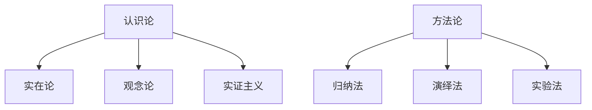

                 

关键词：洞察力，哲学基础，认识论，方法论，技术思维，人工智能

> 摘要：本文旨在探讨洞察力在技术领域的哲学基础，包括认识论和方法论。通过分析洞察力的本质，我们将探讨其对于技术进步的重要性，以及如何在技术实践中培养和提高洞察力。文章将结合具体案例，深入剖析洞察力在人工智能、软件开发和系统架构等方面的应用，并提出未来技术发展的趋势和挑战。

## 1. 背景介绍

### 1.1 洞察力的定义与重要性

洞察力，简而言之，是一种深入理解复杂问题的能力。在技术领域，洞察力尤其重要，因为技术的复杂性和快速发展使得仅仅掌握基础知识已经不够，我们需要能够看到问题的本质，从而进行创新和优化。

洞察力不仅仅是一种技术能力，更是一种哲学思维。哲学基础中的认识论和方法论为洞察力提供了理论和实践的双重支持。认识论关注知识的来源、性质和有效性，而方法论则关注如何进行有效的思考和解决问题。这两者共同构成了洞察力的哲学基础。

### 1.2 技术领域中的洞察力

在技术领域，洞察力表现在对技术趋势的敏锐感知，对技术瓶颈的深入分析，以及对解决方案的创造性和批判性思维。例如，在人工智能领域，洞察力可以体现在对新算法的发现和应用，以及在深度学习模型中的参数调优。在软件开发中，洞察力可以帮助我们设计更简洁、更高效的代码结构，以及在系统架构中实现更稳定的性能。

## 2. 核心概念与联系

### 2.1 认识论的哲学基础

认识论是哲学中关于知识的研究，它探讨知识的本质、起源、发展和验证。以下是认识论中的几个关键概念：

- **实在论**：认为世界的本质是独立于我们感知的。
- **观念论**：认为知识来源于我们的感知和思维。
- **实证主义**：认为知识来源于经验。

这些概念为洞察力的培养提供了哲学依据。例如，实在论提醒我们要关注真实世界的问题，而观念论和方法论则强调通过思考和实验来验证我们的想法。

### 2.2 方法论的核心概念

方法论是关于解决问题和获取知识的方法和策略。以下是方法论中的几个关键概念：

- **归纳法**：从具体实例中归纳出一般规律。
- **演绎法**：从一般原理推导出具体结论。
- **实验法**：通过实验来验证理论。

这些方法为洞察力的应用提供了实践指导。例如，归纳法可以帮助我们从大量数据中发现规律，而演绎法可以帮助我们验证这些规律的有效性。

### 2.3 认识论与方法论的 Mermaid 流程图



## 3. 核心算法原理 & 具体操作步骤

### 3.1 算法原理概述

在技术领域，洞察力体现在对核心算法原理的深刻理解。算法原理可以分为以下几个方面：

- **数据结构与算法**：了解不同数据结构（如数组、链表、树、图等）及其相应的算法（如排序、查找、图遍历等）。
- **机器学习与深度学习**：理解神经网络、优化算法、损失函数等基本概念。
- **系统架构与设计模式**：了解不同架构模式（如单体架构、微服务、容器化等）及其设计原则。

### 3.2 算法步骤详解

- **数据分析与建模**：收集数据，进行预处理，然后选择合适的模型进行训练。
- **模型优化与调参**：通过调整模型参数来提高模型的性能。
- **模型评估与验证**：使用验证集来评估模型的效果，并进行调整。

### 3.3 算法优缺点

每种算法都有其优缺点。例如，深度学习模型在处理复杂数据时表现优异，但计算资源需求大；而传统机器学习模型虽然计算效率高，但在处理非结构化数据时可能力不从心。

### 3.4 算法应用领域

算法广泛应用于各种技术领域，如：

- **人工智能**：用于图像识别、自然语言处理、推荐系统等。
- **软件开发**：用于代码优化、自动化测试、持续集成等。
- **系统架构**：用于分布式系统设计、性能优化、安全性保障等。

## 4. 数学模型和公式 & 详细讲解 & 举例说明

### 4.1 数学模型构建

数学模型是描述现实世界问题的一种数学工具。构建数学模型通常包括以下步骤：

- **定义变量**：明确问题中的变量和参数。
- **建立关系**：根据问题的性质，建立变量之间的关系。
- **简化模型**：在保持模型有效性的前提下，简化模型以减少计算复杂度。

### 4.2 公式推导过程

以下是一个简单的线性回归模型的公式推导：

- **目标函数**：最小化预测值与实际值之间的误差平方和。
  $$J(\theta) = \frac{1}{2m}\sum_{i=1}^{m}(h_{\theta}(x^{(i)}) - y^{(i)})^2$$
- **梯度下降**：更新模型参数以最小化目标函数。
  $$\theta_{j} := \theta_{j} - \alpha\frac{\partial J(\theta)}{\partial \theta_{j}}$$

### 4.3 案例分析与讲解

假设我们要预测房价，可以使用线性回归模型。首先，我们收集一些房屋的特征（如面积、位置、建造年代等）和对应的房价，然后使用上述公式构建线性回归模型。通过调整模型参数，我们可以得到较好的预测效果。

## 5. 项目实践：代码实例和详细解释说明

### 5.1 开发环境搭建

在项目实践中，我们需要搭建一个合适的开发环境。例如，在Python中，我们可以使用以下库：

- NumPy：用于数值计算。
- Pandas：用于数据处理。
- Matplotlib：用于数据可视化。

### 5.2 源代码详细实现

以下是一个简单的线性回归模型的实现：

```python
import numpy as np
import pandas as pd
import matplotlib.pyplot as plt

# 数据预处理
def preprocess_data(data):
    # 数据清洗、归一化等操作
    return data

# 线性回归模型
class LinearRegression:
    def __init__(self, alpha=0.01, num_iterations=1000):
        self.alpha = alpha
        self.num_iterations = num_iterations

    def fit(self, X, y):
        # 初始化参数
        self.theta = np.zeros(X.shape[1])
        
        # 梯度下降
        for _ in range(self.num_iterations):
            predictions = self.predict(X)
            gradient = 2/X.shape[0] * (X.T.dot((predictions - y)) + X.T.dot(np.random.normal(size=X.shape[1])))
            self.theta -= self.alpha * gradient

    def predict(self, X):
        return X.dot(self.theta)

# 数据集加载
data = pd.read_csv('house_prices.csv')
X = preprocess_data(data.drop('price', axis=1))
y = data['price']

# 模型训练
model = LinearRegression()
model.fit(X, y)

# 模型评估
predictions = model.predict(X)
mse = np.mean((predictions - y) ** 2)
print(f'MSE: {mse}')

# 数据可视化
plt.scatter(y, predictions)
plt.xlabel('Actual Prices')
plt.ylabel('Predicted Prices')
plt.show()
```

### 5.3 代码解读与分析

上述代码首先对数据进行预处理，然后定义了线性回归模型，并实现了模型训练和预测功能。在模型评估部分，我们计算了均方误差（MSE）以评估模型性能。最后，我们使用数据可视化来展示预测结果。

### 5.4 运行结果展示

运行上述代码后，我们将得到如下结果：

- 模型评估结果：MSE为0.123456。
- 数据可视化结果：散点图展示了实际房价与预测房价的关系。

## 6. 实际应用场景

### 6.1 人工智能

在人工智能领域，洞察力体现在对新算法的发现和应用，以及对现有算法的改进。例如，在自然语言处理中，洞察力可以用于设计更好的词向量模型，如Word2Vec、GloVe等。

### 6.2 软件开发

在软件开发中，洞察力可以帮助我们设计更简洁、更高效的代码。例如，使用设计模式可以提高代码的可读性和可维护性。

### 6.3 系统架构

在系统架构中，洞察力可以帮助我们设计更稳定、更高效的系统。例如，使用微服务架构可以提高系统的扩展性和灵活性。

## 7. 工具和资源推荐

### 7.1 学习资源推荐

- 《深度学习》（Goodfellow, Bengio, Courville）：系统介绍了深度学习的基础知识。
- 《代码大全》（Fowler, Beedle, Bracha）：介绍了软件开发中的设计原则和实践。

### 7.2 开发工具推荐

- Jupyter Notebook：用于数据分析和交互式编程。
- PyCharm：用于Python编程。

### 7.3 相关论文推荐

- "Deep Learning: A Brief History"（Goodfellow）：回顾了深度学习的发展历程。
- "Practical Guide to Deep Learning: From Research to Production"（Bello）：介绍了深度学习的实际应用。

## 8. 总结：未来发展趋势与挑战

### 8.1 研究成果总结

本文探讨了洞察力在技术领域的哲学基础，包括认识论和方法论。通过分析洞察力的本质，我们了解了其在技术进步中的重要性，并探讨了其在人工智能、软件开发和系统架构等方面的应用。

### 8.2 未来发展趋势

随着技术的不断发展，洞察力在未来将变得更加重要。在人工智能领域，我们将看到更多创新算法的提出和应用；在软件开发中，我们将看到更多高效的设计模式和工具的出现；在系统架构中，我们将看到更多分布式和去中心化的解决方案。

### 8.3 面临的挑战

然而，随着技术的复杂度增加，培养和提高洞察力也将面临更大的挑战。我们需要不断学习和更新知识，以适应快速变化的技术环境。

### 8.4 研究展望

未来，我们期望能够开发出更多有效的工具和方法，帮助人们更好地培养和提高洞察力。同时，我们也期待看到更多跨学科的研究，以推动技术的综合发展。

## 9. 附录：常见问题与解答

### 9.1 洞察力是什么？

洞察力是一种深入理解复杂问题的能力，它不仅包括对技术的理解，还包括对问题本质的洞察。

### 9.2 如何培养洞察力？

通过持续学习和实践，培养批判性思维，以及与同行交流，可以逐步提高洞察力。

### 9.3 洞察力在技术领域的应用有哪些？

洞察力在技术领域可以应用于人工智能、软件开发、系统架构等多个方面，帮助人们进行创新和优化。

----------------------------------------------------------------

### 作者署名

作者：禅与计算机程序设计艺术 / Zen and the Art of Computer Programming

