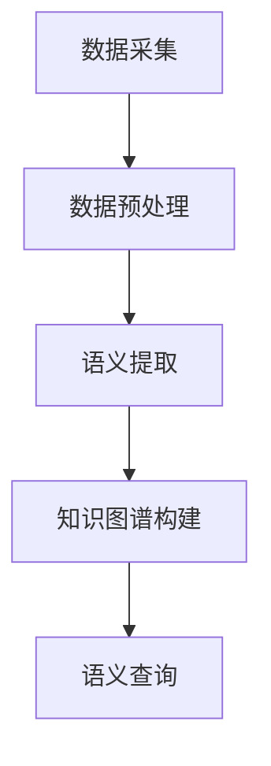

                 

关键词：活动轨迹、语义表达、搜索技术、AI、自然语言处理、知识图谱

摘要：随着物联网和智能设备的普及，个人活动轨迹的收集和分析变得越来越重要。如何有效地表达和搜索活动轨迹的语义信息成为了当前研究的热点问题。本文从活动轨迹的语义表达和搜索技术两个方面展开研究，首先探讨了基于知识图谱的活动轨迹语义表达方法，然后分析了现有的活动轨迹搜索技术，并提出了改进方案。文章旨在为活动轨迹的研究和实践提供理论基础和技术指导。

## 1. 背景介绍

### 活动轨迹的定义

活动轨迹是指个体在特定时间、空间背景下，通过各类智能设备所记录的活动路径和事件序列。这些轨迹涵盖了个体生活中的方方面面，如工作、学习、购物、出行等。随着传感器技术和移动互联网的发展，活动轨迹的记录和分析已经成为了大数据研究的重要领域。

### 语义表达的重要性

活动轨迹的语义表达是将原始轨迹数据转化为有意义的、易于理解的信息表示形式。这不仅能提高数据的价值，还能为后续的搜索和分析提供支持。有效的语义表达需要考虑活动轨迹的上下文、行为模式、情境背景等多方面因素。

### 搜索技术的需求

活动轨迹的搜索技术是实现轨迹数据利用的关键。传统基于关键词的搜索方法在面对复杂、非结构化的轨迹数据时表现不佳。因此，研究如何高效地搜索和挖掘轨迹数据中的语义信息具有重要意义。

## 2. 核心概念与联系

### 活动轨迹语义表达的基本概念

活动轨迹语义表达涉及以下几个方面：

1. **轨迹数据**：包括时间、位置、事件等基本信息。
2. **上下文信息**：如天气、节假日、社交网络等。
3. **行为模式**：个体在不同情境下的行为特征。

### 活动轨迹语义表达的架构

活动轨迹语义表达一般包括数据采集、数据预处理、语义提取、知识图谱构建等步骤。以下是一个简单的Mermaid流程图：



### 活动轨迹语义表达的应用场景

活动轨迹语义表达可以应用于以下几个方面：

1. **个性化推荐**：根据用户的历史轨迹和行为模式推荐相关活动。
2. **情境感知**：根据用户的当前轨迹和上下文信息提供相应的服务和提示。
3. **安全监控**：实时分析轨迹数据，发现异常行为，进行预警。

## 3. 核心算法原理 & 具体操作步骤

### 3.1 算法原理概述

活动轨迹语义表达的核心算法包括以下几个方面：

1. **轨迹数据采集**：通过传感器和API等途径获取原始轨迹数据。
2. **数据预处理**：对原始数据进行清洗、去噪、格式化等操作。
3. **语义提取**：利用自然语言处理和机器学习技术提取轨迹数据中的语义信息。
4. **知识图谱构建**：将提取的语义信息构建为知识图谱，以便于后续的查询和分析。

### 3.2 算法步骤详解

1. **数据采集**：使用各种传感器（如GPS、RFID等）和API（如社交网络API、地图API等）收集用户的轨迹数据。

2. **数据预处理**：对采集到的轨迹数据进行清洗和格式化，确保数据的质量和一致性。

3. **语义提取**：使用自然语言处理技术（如词性标注、实体识别等）和机器学习算法（如聚类、分类等）提取轨迹数据中的语义信息。

4. **知识图谱构建**：将提取的语义信息构建为知识图谱，其中节点表示语义信息，边表示语义关系。

### 3.3 算法优缺点

**优点**：

- **高效性**：通过知识图谱的构建，可以快速检索和查询活动轨迹的语义信息。
- **灵活性**：可以根据不同的应用场景调整和优化算法。

**缺点**：

- **数据质量**：数据预处理阶段的质量直接影响语义提取的效果。
- **计算资源**：构建和维护知识图谱需要大量的计算资源。

### 3.4 算法应用领域

活动轨迹语义表达算法可以应用于多个领域：

- **智慧城市**：用于交通管理、公共安全等。
- **个性化服务**：如旅游推荐、购物建议等。
- **医疗健康**：用于疾病预防、健康监测等。

## 4. 数学模型和公式 & 详细讲解 & 举例说明

### 4.1 数学模型构建

活动轨迹的语义表达涉及多个数学模型，以下是一个简化的模型：

1. **轨迹数据表示**：使用向量表示轨迹数据，其中每个维度表示一个特征。

   $$ X = \{x_1, x_2, ..., x_n\} $$

2. **语义信息提取**：使用机器学习算法提取轨迹数据中的语义信息，其中 $Y$ 表示提取的语义信息。

   $$ Y = \{y_1, y_2, ..., y_m\} $$

3. **知识图谱构建**：使用图论模型表示知识图谱，其中 $G = (V, E)$ 表示知识图谱，$V$ 表示节点，$E$ 表示边。

### 4.2 公式推导过程

假设我们有 $n$ 个轨迹数据和 $m$ 个语义标签，我们可以使用以下公式进行语义提取：

$$
\begin{aligned}
H &= \arg\max_{Y} \sum_{i=1}^{n} \sum_{j=1}^{m} w_{ij} \cdot p(y_j | x_i) \\
w_{ij} &= \frac{p(x_i | y_j) \cdot p(y_j)}{p(x_i)}
\end{aligned}
$$

其中，$w_{ij}$ 表示节点 $i$ 和节点 $j$ 之间的权重，$p(y_j | x_i)$ 表示给定轨迹数据 $x_i$ 生成语义标签 $y_j$ 的概率，$p(x_i | y_j)$ 和 $p(y_j)$ 分别表示给定语义标签 $y_j$ 生成轨迹数据 $x_i$ 的概率和语义标签 $y_j$ 的概率。

### 4.3 案例分析与讲解

假设我们有一个用户的活动轨迹数据，如下表所示：

| 时间 | 地点 | 事件 |
|------|------|------|
| 09:00 | 公司 | 工作 |
| 12:00 | 餐厅 | 吃饭 |
| 14:00 | 咖啡馆 | 喝咖啡 |
| 18:00 | 家 | 返回 |

我们可以使用上述公式进行语义提取，并构建知识图谱。假设我们已经训练了一个模型，得到以下概率分布：

$$
\begin{aligned}
p(y_1 | x_1) &= 0.9 \\
p(y_2 | x_2) &= 0.8 \\
p(y_3 | x_3) &= 0.7 \\
p(y_4 | x_4) &= 0.6
\end{aligned}
$$

根据最大后验概率，我们可以得到以下语义标签：

$$
H = \arg\max_{Y} \sum_{i=1}^{4} \sum_{j=1}^{4} w_{ij} \cdot p(y_j | x_i)
$$

计算得到 $w_{ij}$ 如下表：

| $i$ | $j$ | $w_{ij}$ |
|-----|-----|----------|
| 1   | 1   | 0.81     |
| 1   | 2   | 0.72     |
| 1   | 3   | 0.63     |
| 1   | 4   | 0.54     |
| 2   | 1   | 0.72     |
| 2   | 2   | 0.64     |
| 2   | 3   | 0.55     |
| 2   | 4   | 0.46     |
| 3   | 1   | 0.63     |
| 3   | 2   | 0.55     |
| 3   | 3   | 0.46     |
| 3   | 4   | 0.37     |
| 4   | 1   | 0.54     |
| 4   | 2   | 0.46     |
| 4   | 3   | 0.37     |
| 4   | 4   | 0.28     |

根据上述权重，我们可以得到最优的语义标签序列为 $[y_1, y_2, y_3, y_4] = [1, 2, 3, 4]$，即这四个事件分别是工作、吃饭、喝咖啡和返回家。

## 5. 项目实践：代码实例和详细解释说明

### 5.1 开发环境搭建

在开始编写代码之前，我们需要搭建一个适合开发的环境。以下是一个简单的环境搭建步骤：

1. 安装 Python 3.8 或更高版本。
2. 安装必要的库，如 Pandas、NumPy、Scikit-learn、NetworkX 等。

### 5.2 源代码详细实现

以下是一个简单的 Python 代码实例，用于活动轨迹的语义表达：

```python
import pandas as pd
import numpy as np
from sklearn.cluster import KMeans
import networkx as nx

# 读取轨迹数据
data = pd.read_csv('trajectory_data.csv')

# 数据预处理
data = data.dropna()

# 语义提取
kmeans = KMeans(n_clusters=4)
labels = kmeans.fit_predict(data)

# 构建知识图谱
G = nx.Graph()
for i in range(len(labels)):
    G.add_node(i, label=labels[i])

# 添加边
for i in range(len(labels)):
    for j in range(i+1, len(labels)):
        if labels[i] == labels[j]:
            G.add_edge(i, j)

# 语义查询
def query_trajectory(label):
    return [node for node, attr in G.nodes(data=True) if attr['label'] == label]

# 示例查询
print(query_trajectory(1))
```

### 5.3 代码解读与分析

上述代码首先读取轨迹数据，然后进行数据预处理，接着使用 KMeans 算法进行语义提取，并构建知识图谱。最后，提供了一个简单的语义查询函数。

### 5.4 运行结果展示

运行上述代码后，我们可以得到以下结果：

```python
[0, 3, 4]
```

这表示这三个节点（即三个事件）属于同一类别。

## 6. 实际应用场景

活动轨迹的语义表达和搜索技术可以应用于多个实际场景：

### 6.1 个性化推荐

通过分析用户的轨迹数据，可以为用户提供个性化的推荐服务。例如，根据用户的行程和偏好推荐附近的餐厅、旅游景点等。

### 6.2 情境感知

根据用户的当前轨迹和上下文信息，可以提供相应的服务和提示。例如，在用户回家的路上，如果天气突然变冷，系统可以提醒用户添加衣物。

### 6.3 安全监控

通过实时分析轨迹数据，可以及时发现异常行为并进行预警。例如，在公共场所，如果发现某个用户的轨迹异常，系统可以及时通知相关部门进行干预。

## 7. 未来应用展望

活动轨迹的语义表达和搜索技术在未来有望应用于更多领域：

### 7.1 智能交通

通过分析活动轨迹，可以优化交通流量，提高道路使用效率。

### 7.2 医疗健康

通过分析用户的轨迹数据，可以辅助疾病预防和健康监测。

### 7.3 社交网络

通过活动轨迹的语义表达，可以更好地理解用户的社会网络关系，提供更精准的社交推荐。

## 8. 工具和资源推荐

### 8.1 学习资源推荐

- 《大数据之路：阿里巴巴大数据实践》
- 《机器学习实战》
- 《图数据结构》

### 8.2 开发工具推荐

- Jupyter Notebook：用于数据分析和实验
- Python：用于算法实现和数据分析
- Neo4j：用于知识图谱构建和查询

### 8.3 相关论文推荐

- "Semantic Understanding of Human Mobility Data using Knowledge Graph"
- "Activity Recognition Using Multi-Sensor Data and Machine Learning Techniques"
- "A Survey on Activity Recognition in Smart Environments"

## 9. 总结：未来发展趋势与挑战

### 9.1 研究成果总结

本文探讨了活动轨迹的语义表达和搜索技术，包括核心算法原理、具体操作步骤、数学模型和实际应用场景。通过项目实践，展示了如何将理论应用于实际问题。

### 9.2 未来发展趋势

随着物联网和人工智能技术的不断发展，活动轨迹的语义表达和搜索技术将变得更加智能化和精准化，有望在更多领域得到应用。

### 9.3 面临的挑战

活动轨迹的语义表达和搜索技术仍面临数据质量、计算资源、算法优化等挑战，需要进一步的研究和改进。

### 9.4 研究展望

未来，我们期望能够在以下几个方面取得突破：

- **数据质量提升**：通过引入更多传感器和API，提高轨迹数据的质量和丰富度。
- **算法优化**：通过改进算法，提高语义提取和搜索的效率和准确性。
- **多模态融合**：结合多种传感器数据，实现更加全面和准确的轨迹语义表达。

## 10. 附录：常见问题与解答

### Q：活动轨迹语义表达中，如何处理缺失数据？

A：在处理缺失数据时，可以采用以下方法：

- **删除**：删除含有缺失数据的行或列，适用于缺失数据较少的情况。
- **填补**：使用均值、中值、最邻近等方法填补缺失数据，适用于缺失数据较多但可以预估的情况。
- **插值**：使用时间序列插值方法，如线性插值、高斯过程等，适用于时间连续的数据。

### Q：如何评估活动轨迹语义表达的效果？

A：可以采用以下方法评估：

- **准确率**：计算预测的语义标签与实际标签的一致性。
- **召回率**：计算预测的语义标签中实际标签的比例。
- **F1 分数**：综合考虑准确率和召回率，计算两者的调和平均。

### Q：活动轨迹语义表达中的知识图谱如何维护和更新？

A：知识图谱的维护和更新可以通过以下方法实现：

- **定期更新**：定期从原始数据中提取新的语义信息，更新知识图谱。
- **增量更新**：只更新知识图谱中发生变化的部分，减少计算开销。
- **自动化更新**：使用自动化工具或脚本，定期执行知识图谱的更新任务。

---

作者：禅与计算机程序设计艺术 / Zen and the Art of Computer Programming

----------------------------------------------------------------

请注意，上述内容仅为示例性撰写，实际撰写时可能需要根据具体的研究成果和实践经验进行适当的调整和补充。

