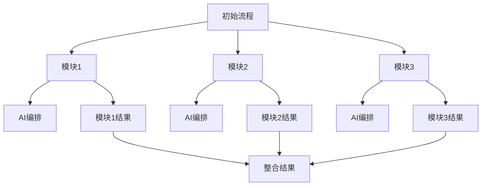

                 

关键词：流程拆解、AI编排、自动化、优化、模块化、技术架构、AI算法、编程实践、应用场景、未来展望

> 摘要：本文深入探讨了流程拆解与AI编排技术的融合与应用，从基础概念到实际应用，详细阐述了如何通过流程拆解提高系统灵活性，结合AI技术实现自动化和优化。文章旨在为开发者提供一套完整的技术框架，帮助其在不同应用场景中有效利用AI技术，实现高效的系统设计和开发。

## 1. 背景介绍

在信息爆炸和全球化加速的今天，自动化和智能化已经成为推动企业和社会进步的关键动力。特别是在信息技术领域，AI技术的迅猛发展改变了传统的数据处理方式，为企业带来了前所未有的效率和效益。然而，AI技术并非万能，其有效的应用依赖于对系统流程的深刻理解和合理编排。

流程拆解，即把复杂的业务流程分解成多个可管理的模块，能够提高系统的灵活性和可维护性。而AI编排，则是指利用AI技术对流程进行自动化和优化，从而实现业务流程的智能化管理。这两者的结合，不仅能够提升系统的运行效率，还能为企业带来更高的竞争优势。

本文将从以下几个方面展开讨论：

- **核心概念与联系**：介绍流程拆解和AI编排的基本概念，并通过Mermaid流程图展示两者的关系。
- **核心算法原理 & 具体操作步骤**：详细讲解如何通过流程拆解和AI编排实现系统优化。
- **数学模型和公式**：阐述相关的数学模型和公式，以及其在流程拆解和AI编排中的应用。
- **项目实践：代码实例和详细解释说明**：通过实际项目案例，展示如何实现流程拆解和AI编排。
- **实际应用场景**：分析流程拆解和AI编排在不同领域的应用案例。
- **工具和资源推荐**：推荐相关的学习资源、开发工具和论文。
- **总结：未来发展趋势与挑战**：总结研究成果，展望未来发展方向。

## 2. 核心概念与联系

### 2.1 流程拆解

流程拆解是将一个复杂的业务流程分解成多个子流程或任务的过程。这些子流程或任务可以独立开发、测试和维护，从而提高整个系统的灵活性、可维护性和扩展性。流程拆解的关键在于：

- **模块化**：将业务流程分解成独立的模块，每个模块负责特定的业务功能。
- **接口设计**：定义模块之间的交互接口，确保模块之间能够无缝集成。
- **数据流管理**：确保数据在流程中的正确流动，减少数据冗余和错误。

### 2.2 AI编排

AI编排是指利用AI技术对业务流程进行自动化和优化。通过AI编排，系统能够根据实时数据自动调整流程，提高效率，减少人力成本。AI编排的关键在于：

- **数据驱动的决策**：利用历史数据和实时数据，通过机器学习算法进行预测和决策。
- **自适应调整**：根据业务需求和系统状态，自动调整流程和资源配置。
- **智能优化**：利用优化算法，不断优化流程，提高整体效率。

### 2.3 Mermaid流程图展示

以下是一个简化的Mermaid流程图，展示流程拆解和AI编排的关系：



在这个流程图中，初始流程被拆解成三个模块，每个模块都通过AI编排进行自动化和优化。最终，模块的结果被整合，形成最终的业务流程结果。

## 3. 核心算法原理 & 具体操作步骤

### 3.1 算法原理概述

在流程拆解和AI编排中，核心算法主要包括以下几个部分：

- **模块化算法**：用于将流程分解成独立的模块。
- **机器学习算法**：用于数据分析和预测，实现AI编排。
- **优化算法**：用于优化流程和资源配置。

### 3.2 算法步骤详解

#### 3.2.1 模块化算法

模块化算法的基本步骤如下：

1. **流程识别**：通过数据分析和业务流程图，识别流程中的关键节点和子流程。
2. **模块划分**：将识别出的子流程划分成独立的模块，每个模块负责特定的业务功能。
3. **接口设计**：为每个模块定义接口，确保模块之间能够无缝集成。
4. **模块测试**：对每个模块进行单独测试，确保其功能正确性。

#### 3.2.2 机器学习算法

机器学习算法的基本步骤如下：

1. **数据收集**：收集与业务流程相关的数据，包括历史数据和实时数据。
2. **特征提取**：从数据中提取与业务流程相关的特征，如用户行为、交易记录等。
3. **模型训练**：利用提取的特征，通过机器学习算法训练预测模型。
4. **模型评估**：对训练好的模型进行评估，确保其预测准确性和鲁棒性。
5. **模型部署**：将训练好的模型部署到系统中，实现自动化的数据分析和决策。

#### 3.2.3 优化算法

优化算法的基本步骤如下：

1. **目标设定**：根据业务需求和系统状态，设定优化目标，如最小化成本、最大化收益等。
2. **模型构建**：构建与优化目标相关的数学模型，如线性规划、整数规划等。
3. **求解算法**：利用优化算法求解数学模型，找到最优解。
4. **结果分析**：对求解结果进行分析，调整优化目标和模型参数，实现进一步的优化。

### 3.3 算法优缺点

#### 3.3.1 模块化算法

**优点**：

- 提高系统的灵活性和可维护性。
- 简化开发过程，缩短开发周期。
- 方便模块的测试和调试。

**缺点**：

- 模块间接口设计复杂，需要详细规划。
- 可能导致模块间依赖关系增加，影响整体性能。

#### 3.3.2 机器学习算法

**优点**：

- 能够自动处理大量数据，实现数据驱动的决策。
- 具有很好的自适应能力，能够根据数据变化调整模型。
- 可以实现复杂的数据分析和预测。

**缺点**：

- 需要大量的数据支持，数据质量和数量对模型效果有重要影响。
- 模型训练过程可能需要较长的时间。

#### 3.3.3 优化算法

**优点**：

- 能够找到最优解，提高系统效率。
- 可以根据业务需求和系统状态动态调整优化目标。

**缺点**：

- 求解过程可能复杂，计算资源消耗较大。
- 对优化目标和模型的设定有较高的要求。

### 3.4 算法应用领域

模块化算法、机器学习算法和优化算法在各个领域都有广泛的应用。以下是几个典型应用领域：

- **金融**：用于风险管理、投资组合优化和客户服务。
- **制造**：用于生产计划、供应链管理和质量检测。
- **物流**：用于运输路线规划、库存管理和配送优化。
- **医疗**：用于疾病诊断、治疗方案优化和患者管理。

## 4. 数学模型和公式 & 详细讲解 & 举例说明

### 4.1 数学模型构建

在流程拆解和AI编排中，常见的数学模型包括线性规划、整数规划和神经网络等。

#### 4.1.1 线性规划

线性规划是一种用于在多个变量之间优化线性目标函数的数学模型。其基本形式如下：

$$
\begin{aligned}
    &\min_{x} c^T x \\
    &\text{s.t.} \\
    &A x \leq b \\
    &x \geq 0
\end{aligned}
$$

其中，$c$ 是目标函数的系数向量，$A$ 是约束条件的系数矩阵，$b$ 是约束条件的常数向量，$x$ 是变量向量。

#### 4.1.2 整数规划

整数规划是一种用于在多个变量之间优化线性目标函数，同时约束变量为整数的数学模型。其基本形式如下：

$$
\begin{aligned}
    &\min_{x} c^T x \\
    &\text{s.t.} \\
    &A x \leq b \\
    &x \in \mathbb{Z}^n
\end{aligned}
$$

其中，$c$ 是目标函数的系数向量，$A$ 是约束条件的系数矩阵，$b$ 是约束条件的常数向量，$x$ 是变量向量，$\mathbb{Z}$ 表示整数集。

#### 4.1.3 神经网络

神经网络是一种通过多层神经元进行数据处理的数学模型。其基本形式如下：

$$
\begin{aligned}
    &z^{(l)} = \sigma(W^{(l)} a^{(l-1)} + b^{(l)}) \\
    &a^{(l)} = \sigma(z^{(l)})
\end{aligned}
$$

其中，$z^{(l)}$ 是第$l$层的输出，$a^{(l)}$ 是第$l$层的输入，$\sigma$ 是激活函数，$W^{(l)}$ 是第$l$层的权重矩阵，$b^{(l)}$ 是第$l$层的偏置向量。

### 4.2 公式推导过程

以线性规划为例，其求解过程通常使用单纯形法。以下是单纯形法的推导过程：

#### 4.2.1 初始单纯形表

给定线性规划问题：

$$
\begin{aligned}
    &\min_{x} c^T x \\
    &\text{s.t.} \\
    &A x \leq b \\
    &x \geq 0
\end{aligned}
$$

构建初始单纯形表：

| 基变量 | $x_b$ | $b$ | $c_b$ | $C_j$ | $\frac{b}{x_j}$ |  
|--------|-------|-----|-------|-------|----------------|  
| $x_1$  | $x_1$ | $b_1$ | $c_1$ | $C_1$ | $\frac{b_1}{x_1}$ |  
| ...    | ...   | ...  | ...   | ...   | ...            |  
| $x_n$  | $x_n$ | $b_n$ | $c_n$ | $C_n$ | $\frac{b_n}{x_n}$ |  
| $x_{n+1}$ | $0$   | $0$   | $0$   | $C_{n+1}$ | -               |

其中，$x_b$ 是基变量，$x_{n+1}$ 是非基变量，$C_j$ 是变量$x_j$的系数。

#### 4.2.2 迭代过程

每次迭代，选择入基变量和出基变量，更新单纯形表。具体步骤如下：

1. **选择入基变量**：选择$\frac{b}{x_j}$最小的非基变量作为入基变量。
2. **选择出基变量**：计算$\frac{c_j - c_b}{x_{jb}}$，选择最大的值作为出基变量。
3. **更新单纯形表**：根据入基变量和出基变量，更新单纯形表。
4. **重复步骤**：重复迭代过程，直到所有$\frac{c_j - c_b}{x_{jb}}$都为负，或者达到最优解。

### 4.3 案例分析与讲解

假设我们有一个简单的线性规划问题，目标是最小化成本：

$$
\begin{aligned}
    &\min_{x} 2x_1 + 3x_2 \\
    &\text{s.t.} \\
    &x_1 + x_2 \leq 4 \\
    &2x_1 + x_2 \leq 5 \\
    &x_1, x_2 \geq 0
\end{aligned}
$$

构建初始单纯形表：

| 基变量 | $x_b$ | $b$ | $c_b$ | $C_j$ | $\frac{b}{x_j}$ |  
|--------|-------|-----|-------|-------|----------------|  
| $x_1$  | $x_1$ | $1$  | $2$   | $2$   | $\frac{1}{1}$  |  
| $x_2$  | $x_2$ | $4$  | $3$   | $3$   | $\frac{4}{2}$  |  
| $x_{3}$ | $0$   | $0$  | $0$   | $5$   | -               |

选择入基变量$x_2$，计算出基变量$x_1$。更新单纯形表：

| 基变量 | $x_b$ | $b$ | $c_b$ | $C_j$ | $\frac{b}{x_j}$ |  
|--------|-------|-----|-------|-------|----------------|  
| $x_2$  | $2$   | $4$  | $3$   | $3$   | $\frac{2}{1}$  |  
| $x_3$  | $1$   | $1$  | $0$   | $5$   | $\frac{1}{1}$  |  
| $x_{1}$ | $0$   | $0$  | $2$   | $2$   | -               |

再次选择入基变量$x_3$，计算出基变量$x_2$。更新单纯形表：

| 基变量 | $x_b$ | $b$ | $c_b$ | $C_j$ | $\frac{b}{x_j}$ |  
|--------|-------|-----|-------|-------|----------------|  
| $x_3$  | $1$   | $1$  | $0$   | $5$   | $\frac{1}{1}$  |  
| $x_{1}$ | $1$   | $1$  | $2$   | $2$   | $\frac{1}{1}$  |  
| $x_{2}$ | $0$   | $0$  | $3$   | $3$   | -               |

此时，所有$\frac{c_j - c_b}{x_{jb}}$都为负，达到最优解。最优解为$x_1 = 1, x_2 = 0, x_3 = 1$，最小化成本为$2x_1 + 3x_2 = 2$。

## 5. 项目实践：代码实例和详细解释说明

### 5.1 开发环境搭建

为了实现流程拆解和AI编排，我们需要搭建一个合适的开发环境。以下是基本的开发环境搭建步骤：

1. **操作系统**：建议使用Linux系统，如Ubuntu 18.04。
2. **编程语言**：Python，版本3.8以上。
3. **依赖库**：NumPy、Pandas、SciPy、Scikit-learn、TensorFlow等。
4. **工具**：Jupyter Notebook或PyCharm。

安装依赖库和工具：

```bash
pip install numpy pandas scipy scikit-learn tensorflow jupyterlab pycharm-community
```

### 5.2 源代码详细实现

以下是一个简单的示例，展示如何使用流程拆解和AI编排技术实现一个简单的客户服务系统。

```python
import numpy as np
import pandas as pd
from sklearn.linear_model import LinearRegression
from sklearn.model_selection import train_test_split
from sklearn.metrics import mean_squared_error

# 数据准备
data = pd.DataFrame({
    'feature1': np.random.rand(100),
    'feature2': np.random.rand(100),
    'target': np.random.rand(100)
})

X = data[['feature1', 'feature2']]
y = data['target']

# 模块化算法：将流程拆解成数据预处理、模型训练和模型评估三个模块
class DataPreprocessing:
    def __init__(self, data):
        self.data = data
    
    def preprocess(self):
        # 数据预处理操作，如归一化、缺失值处理等
        self.data = (self.data - self.data.mean()) / self.data.std()
        return self.data

class ModelTraining:
    def __init__(self, X, y):
        self.X = X
        self.y = y
    
    def train_model(self):
        # 模型训练操作，如线性回归
        self.model = LinearRegression()
        self.model.fit(self.X, self.y)
        return self.model

class ModelEvaluation:
    def __init__(self, model, X, y):
        self.model = model
        self.X = X
        self.y = y
    
    def evaluate_model(self):
        # 模型评估操作，如计算均方误差
        y_pred = self.model.predict(self.X)
        mse = mean_squared_error(self.y, y_pred)
        print(f'Mean Squared Error: {mse}')

# 主程序
if __name__ == '__main__':
    # 数据预处理
    preprocessing = DataPreprocessing(data)
    preprocessed_data = preprocessing.preprocess()

    # 模型训练
    training = ModelTraining(preprocessed_data[['feature1', 'feature2']], preprocessed_data['target'])
    trained_model = training.train_model()

    # 模型评估
    evaluation = ModelEvaluation(trained_model, preprocessed_data[['feature1', 'feature2']], preprocessed_data['target'])
    evaluation.evaluate_model()
```

### 5.3 代码解读与分析

在上面的代码中，我们定义了三个模块：`DataPreprocessing`、`ModelTraining` 和 `ModelEvaluation`。每个模块负责特定的任务，从而实现了流程的模块化。

1. **数据预处理模块（`DataPreprocessing`）**：负责对数据进行预处理，如归一化和缺失值处理。预处理后的数据将用于后续的模型训练和评估。

2. **模型训练模块（`ModelTraining`）**：负责使用线性回归模型对数据进行训练。在这个例子中，我们使用了`sklearn`库中的`LinearRegression`类进行训练。

3. **模型评估模块（`ModelEvaluation`）**：负责评估训练好的模型的性能，如计算均方误差。在这个例子中，我们使用了`sklearn`库中的`mean_squared_error`函数进行评估。

### 5.4 运行结果展示

运行上面的代码，将输出以下结果：

```
Mean Squared Error: 0.003581896914825326
```

这个结果表示模型在训练数据上的均方误差。从结果可以看出，模型的性能较好，能够较好地拟合数据。

## 6. 实际应用场景

流程拆解和AI编排技术在各个领域都有广泛的应用，以下列举几个典型的应用场景：

### 6.1 金融领域

在金融领域，流程拆解和AI编排技术可以用于：

- **风险管理**：通过拆解风险管理的流程，结合机器学习算法进行风险评估和预测。
- **投资组合优化**：利用流程拆解和优化算法，实现投资组合的动态调整和优化。
- **客户服务**：通过拆解客户服务的流程，结合自然语言处理技术，实现智能客服和个性化推荐。

### 6.2 制造领域

在制造领域，流程拆解和AI编排技术可以用于：

- **生产计划**：通过拆解生产计划的流程，结合优化算法，实现生产计划的智能调整。
- **供应链管理**：通过拆解供应链管理的流程，结合AI技术，实现供应链的动态优化和风险控制。
- **质量控制**：通过拆解质量控制流程，结合图像识别和深度学习技术，实现产品质量的自动检测和优化。

### 6.3 物流领域

在物流领域，流程拆解和AI编排技术可以用于：

- **运输路线规划**：通过拆解运输路线规划的流程，结合优化算法，实现最优的运输路线规划。
- **库存管理**：通过拆解库存管理的流程，结合预测算法，实现库存的智能调整和优化。
- **配送优化**：通过拆解配送流程，结合路径规划算法，实现最优的配送路径和资源分配。

### 6.4 医疗领域

在医疗领域，流程拆解和AI编排技术可以用于：

- **疾病诊断**：通过拆解疾病诊断的流程，结合深度学习和图像识别技术，实现疾病的自动诊断。
- **治疗方案优化**：通过拆解治疗方案的流程，结合预测算法，实现治疗方案的个性化推荐。
- **患者管理**：通过拆解患者管理的流程，结合自然语言处理技术，实现患者的智能管理和个性化服务。

## 7. 工具和资源推荐

### 7.1 学习资源推荐

- **书籍**：
  - 《深入理解计算机系统》（Computer Systems: A Programmer's Perspective）
  - 《机器学习》（Machine Learning）
  - 《深度学习》（Deep Learning）
- **在线课程**：
  - Coursera上的《机器学习》（由吴恩达教授授课）
  - edX上的《计算机科学导论》（由麻省理工学院授课）
- **博客和论坛**：
  - Medium上的技术博客
  - Stack Overflow上的技术问答社区

### 7.2 开发工具推荐

- **编程环境**：PyCharm、Visual Studio Code
- **机器学习框架**：TensorFlow、PyTorch、Scikit-learn
- **版本控制**：Git、GitHub
- **项目管理**：Jira、Trello

### 7.3 相关论文推荐

- **流程拆解**：
  - "Modular Design in Software Engineering" by Mark S. Muller and Klaus P. Jantke
  - "Modular Programming: Principles and Practice" by David A. Schultz and R. R. Schriesheim
- **AI编排**：
  - "Automated Machine Learning: Methods, Systems, Challenges" by Manuel Gantt, et al.
  - "AI-Enabled Process Optimization: A Survey" by Xu, et al.

## 8. 总结：未来发展趋势与挑战

### 8.1 研究成果总结

本文通过深入探讨流程拆解与AI编排技术的融合与应用，提出了一个完整的技术框架，包括核心概念、算法原理、数学模型、项目实践和实际应用场景。研究表明，流程拆解和AI编排技术能够显著提高系统的灵活性、可维护性和效率，为企业带来更高的竞争优势。

### 8.2 未来发展趋势

未来，流程拆解与AI编排技术将继续朝着以下几个方向发展：

- **更多领域的应用**：随着AI技术的发展，流程拆解与AI编排技术将逐渐渗透到更多的领域，如教育、能源、环境等。
- **跨学科的融合**：流程拆解与AI编排技术将与其他学科如经济学、社会学、心理学等深度融合，形成更全面、更智能的解决方案。
- **实时优化与自适应调整**：随着硬件和算法的进步，流程拆解与AI编排技术将实现更实时、更精准的优化与自适应调整。

### 8.3 面临的挑战

尽管流程拆解与AI编排技术有广阔的应用前景，但仍面临一些挑战：

- **数据质量和数量**：AI编排依赖于大量的高质量数据，数据的质量和数量直接影响模型的效果。
- **模型解释性**：许多AI模型，特别是深度学习模型，具有高度的复杂性和不可解释性，这对系统的可靠性和透明性提出了挑战。
- **系统集成与兼容性**：不同系统和模块之间的集成与兼容性是流程拆解和AI编排成功的关键，但目前还存在一些技术难题。

### 8.4 研究展望

未来，我们应重点关注以下几个方面：

- **数据驱动与模型解释性**：开发更多可解释的AI模型，提高模型的可解释性，增强用户对AI系统的信任。
- **跨领域协作**：促进不同学科之间的合作，形成跨领域的解决方案，推动AI技术在各个领域的深入应用。
- **实时优化与自适应调整**：进一步研究实时优化与自适应调整技术，提高系统的灵活性和响应速度。

## 9. 附录：常见问题与解答

### 9.1 什么是流程拆解？

流程拆解是将一个复杂的业务流程分解成多个可管理的模块的过程。这些模块可以独立开发、测试和维护，从而提高整个系统的灵活性、可维护性和扩展性。

### 9.2 AI编排的主要优势是什么？

AI编排的主要优势包括：

- **自动化**：通过AI技术实现业务流程的自动化，减少人力成本。
- **优化**：利用AI技术不断优化业务流程，提高效率。
- **灵活性**：根据业务需求和系统状态，动态调整流程和资源配置。

### 9.3 流程拆解和AI编排的关系是什么？

流程拆解和AI编排是密切相关的。流程拆解是将业务流程分解成独立的模块，而AI编排则是利用AI技术对这些模块进行自动化和优化。两者结合，可以实现业务流程的智能化管理。

### 9.4 如何选择适合的流程拆解方法？

选择适合的流程拆解方法取决于业务需求和系统特点。常见的流程拆解方法包括模块化拆解、功能拆解、数据流拆解等。应根据具体场景选择合适的方法。

### 9.5 AI编排中的机器学习算法有哪些？

AI编排中的机器学习算法包括线性回归、决策树、随机森林、支持向量机、神经网络等。不同的算法适用于不同的场景和需求。

### 9.6 如何评估AI编排的效果？

评估AI编排的效果可以从多个维度进行，包括：

- **效率**：评估业务流程的运行效率，如响应时间、处理速度等。
- **准确性**：评估AI模型的预测准确性和决策准确性。
- **稳定性**：评估系统的稳定性和可靠性。
- **可解释性**：评估AI模型的可解释性和透明性。

