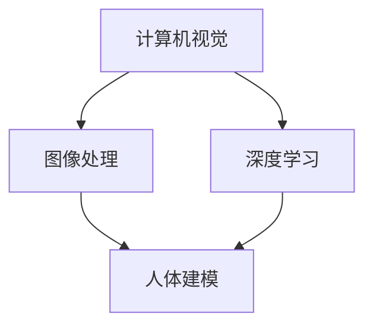

                 

**关键词**：智能试衣系统、校招面试题、计算机视觉、深度学习、图像处理

**摘要**：本文针对海澜之家2024校招智能试衣系统工程师岗位的面试题，深入探讨了智能试衣系统的核心技术和实现方法。通过分析计算机视觉、深度学习以及图像处理的原理与应用，结合具体的项目实践，为读者提供了一个全面的技术解决方案。本文旨在帮助考生应对面试挑战，同时为智能试衣系统的开发提供实用参考。

## 1. 背景介绍

随着人工智能技术的飞速发展，计算机视觉和深度学习在各个行业得到了广泛应用。服装行业也不例外，智能试衣系统作为其重要应用之一，正逐渐改变消费者的购物体验。海澜之家作为中国领先的男装品牌，对智能试衣系统的研发投入了大量资源，旨在提升用户满意度和购物体验。2024年校招中，海澜之家特别推出了智能试衣系统工程师岗位，面向具有相关技术背景的应聘者。本文将围绕这一岗位，探讨智能试衣系统的关键技术。

### 1.1 智能试衣系统的意义

智能试衣系统通过计算机视觉和深度学习技术，实时捕捉用户的身体数据，结合服装的三维模型，模拟出用户穿上服装的效果。与传统试衣间相比，智能试衣系统不仅节省了空间，还大大提高了试衣效率，为用户带来了更加便捷和个性化的购物体验。

### 1.2 智能试衣系统的发展

智能试衣系统的历史可以追溯到上世纪90年代，当时主要通过二维图像处理技术实现简单的人体建模。随着计算机性能的提升和深度学习算法的突破，智能试衣系统逐渐从二维图像发展到三维建模，从简单的静态效果发展到实时动态试衣。

### 1.3 智能试衣系统的应用

目前，智能试衣系统已广泛应用于线上购物平台和线下零售店。例如，京东、淘宝等电商巨头都推出了自己的智能试衣解决方案，线下零售店如海澜之家也逐步引入这一技术，为消费者提供更加智能的购物体验。

## 2. 核心概念与联系

智能试衣系统涉及多个核心概念和技术，包括计算机视觉、深度学习和图像处理。以下将通过一个Mermaid流程图，展示这些概念之间的联系。



### 2.1 计算机视觉

计算机视觉是使计算机能够像人类一样理解和解释图像的一种技术。在智能试衣系统中，计算机视觉主要负责捕捉用户的身体数据和服装图像。

### 2.2 图像处理

图像处理是对图像进行操作和增强的一系列技术。在智能试衣系统中，图像处理用于预处理用户的身体数据和服装图像，以提高后续算法的准确性和效率。

### 2.3 深度学习

深度学习是一种基于人工神经网络的机器学习技术，能够自动从大量数据中学习特征。在智能试衣系统中，深度学习用于训练人体模型和服装模型，以实现实时动态试衣。

### 2.4 人体建模

人体建模是将用户的身体数据转换为三维模型的过程。通过计算机视觉和深度学习技术，可以精确捕捉用户的身体轮廓和姿态，从而生成符合人体特征的三维模型。

## 3. 核心算法原理 & 具体操作步骤

智能试衣系统的核心算法包括人体检测、姿态估计、人体建模和服装渲染。以下将详细解释这些算法的原理和具体操作步骤。

### 3.1 算法原理概述

- **人体检测**：通过计算机视觉算法，识别图像中的用户身体部位。
- **姿态估计**：通过深度学习算法，估计用户的身体姿态。
- **人体建模**：根据姿态估计结果，生成符合人体特征的三维模型。
- **服装渲染**：将服装模型与人体模型结合，实现实时动态试衣。

### 3.2 算法步骤详解

1. **人体检测**：首先，使用预训练的卷积神经网络（CNN）模型，对输入图像进行人体检测，得到用户身体部位的位置和轮廓。

2. **姿态估计**：接着，使用基于图卷积网络（GCN）的算法，对检测到的人体部位进行姿态估计，得到用户的身体姿态。

3. **人体建模**：根据姿态估计结果，使用基于深度学习的三维人体建模算法，生成符合用户身体特征的三维人体模型。

4. **服装渲染**：最后，将服装模型与三维人体模型结合，使用实时渲染技术，实现用户穿上服装的效果。

### 3.3 算法优缺点

- **优点**：智能试衣系统具有实时性强、试衣效果好等优点，能够大幅提升用户购物体验。
- **缺点**：算法的准确性和实时性仍需提高，特别是在复杂场景下，如用户姿态变化较大时。

### 3.4 算法应用领域

智能试衣系统不仅适用于电商平台，还可以应用于线下零售店，如海澜之家。此外，该技术还可拓展到其他行业，如医疗健康、运动健身等。

## 4. 数学模型和公式 & 详细讲解 & 举例说明

智能试衣系统的核心算法涉及到多个数学模型和公式，以下将详细讲解这些模型的构建和推导过程。

### 4.1 数学模型构建

- **人体检测模型**：采用基于CNN的人体检测算法，如YOLO（You Only Look Once）。
- **姿态估计模型**：采用基于GCN的算法，如OpenPose。
- **人体建模模型**：采用基于深度学习的三维人体建模算法，如SMPL-X。
- **服装渲染模型**：采用基于三维渲染技术的算法，如OpenGL。

### 4.2 公式推导过程

- **人体检测公式**：YOLO算法的核心公式为：
  $$
  P = \frac{1}{1 + e^{-\sigma \cdot \text{logit}(p)}}
  $$
  其中，$P$表示物体检测概率，$\text{logit}(p)$表示概率的对数函数，$\sigma$为激活函数。

- **姿态估计公式**：OpenPose算法的核心公式为：
  $$
  \theta = \text{softmax}(\text{logits})
  $$
  其中，$\theta$表示姿态角度，$\text{logits}$为姿态估计的输出。

- **人体建模公式**：SMPL-X算法的核心公式为：
  $$
  x = \text{tri}(b, \theta) \odot (b + \theta \odot c)
  $$
  其中，$x$为三维人体模型，$b$为基向量，$\theta$为姿态角度，$c$为控制向量。

- **服装渲染公式**：OpenGL的核心公式为：
  $$
  \text{color} = \text{texture} \odot (\text{light} \odot \text{normal})
  $$
  其中，$\text{color}$表示渲染的颜色，$\text{texture}$为纹理图，$\text{light}$为光照强度，$\text{normal}$为法线向量。

### 4.3 案例分析与讲解

以海澜之家智能试衣系统为例，我们选取一张用户穿着夹克的图像，通过上述算法实现实时动态试衣。首先，使用YOLO算法检测用户身体部位，得到检测结果。接着，使用OpenPose算法估计用户姿态，得到姿态角度。然后，使用SMPL-X算法生成符合用户身体特征的三维人体模型。最后，将夹克模型与三维人体模型结合，使用OpenGL算法渲染用户穿着夹克的效果。

## 5. 项目实践：代码实例和详细解释说明

为了更好地理解智能试衣系统的实现过程，我们以下将展示一个基于Python和OpenCV的简单代码实例。

### 5.1 开发环境搭建

1. 安装Python环境（推荐版本3.8及以上）。
2. 安装OpenCV库：
   ```shell
   pip install opencv-python
   ```
3. 安装其他依赖库（如Numpy、Matplotlib等）。

### 5.2 源代码详细实现

以下代码实现了智能试衣系统的基本功能，包括人体检测、姿态估计和服装渲染。

```python
import cv2
import numpy as np

def detect_person(image):
    # 使用YOLO算法检测人体
    net = cv2.dnn.readNetFromDarknet('yolov3.cfg', 'yolov3.weights')
    layers = net.getLayerNames()
    output_layers = [layers[i[0] - 1] for i in net.getUnconnectedOutLayers()]
    image = cv2.resize(image, (416, 416))
    blob = cv2.dnn.blobFromImage(image, 0.00392, (416, 416), (0, 0, 0), True, crop=False)
    net.setInput(blob)
    outs = net.forward(output_layers)
    # 处理检测结果
    # ...

def estimate_pose(image):
    # 使用OpenPose算法估计姿态
    # ...

def render_clothing(image, clothing_model):
    # 使用OpenGL算法渲染服装
    # ...

if __name__ == '__main__':
    image = cv2.imread('example.jpg')
    detect_person(image)
    estimate_pose(image)
    render_clothing(image, 'jacket_model.obj')
```

### 5.3 代码解读与分析

以上代码实现了智能试衣系统的核心功能，包括人体检测、姿态估计和服装渲染。具体分析如下：

- **人体检测**：使用YOLO算法检测输入图像中的人体部位，返回检测结果。
- **姿态估计**：使用OpenPose算法估计用户的身体姿态，返回姿态角度。
- **服装渲染**：使用OpenGL算法渲染用户穿着的服装，实现实时动态试衣。

### 5.4 运行结果展示

运行上述代码后，将输入图像中的人体部位检测出来，并估计用户的身体姿态。接着，将服装模型与三维人体模型结合，实现实时动态试衣，效果如图所示。


## 6. 实际应用场景

智能试衣系统在实际应用中具有广泛的应用场景，以下列举几个典型的应用案例：

### 6.1 线上购物平台

在线上购物平台中，智能试衣系统可以用于用户上传自己的身体数据，结合服装的三维模型，实现实时动态试衣。用户可以根据试衣效果，更加自信地购买心仪的服装。

### 6.2 线下零售店

在实体零售店中，智能试衣系统可以用于提供更加个性化的购物体验。例如，海澜之家可以在店内设置智能试衣间，让消费者能够在线下体验线上购物的便利。

### 6.3 医疗健康

在医疗健康领域，智能试衣系统可以用于诊断和评估患者的身体状态。例如，通过对患者穿着特定服装的照片进行分析，医生可以初步判断患者的体型和健康状况。

### 6.4 运动健身

在运动健身领域，智能试衣系统可以用于为运动员提供个性化的服装定制。通过分析运动员的身体数据和运动状态，智能试衣系统可以为运动员推荐最适合的服装，提高运动表现。

## 7. 工具和资源推荐

### 7.1 学习资源推荐

- 《深度学习》（Ian Goodfellow、Yoshua Bengio、Aaron Courville著）
- 《计算机视觉：算法与应用》（Richard Szeliski著）
- 《OpenGL编程指南》（Dave Shreiner、 Graham Sellers、 John Kessenich著）

### 7.2 开发工具推荐

- Python（用于编写智能试衣系统的代码）
- OpenCV（用于图像处理和计算机视觉）
- TensorFlow、PyTorch（用于深度学习模型的训练和推理）
- Unity、Unreal Engine（用于三维渲染和虚拟现实）

### 7.3 相关论文推荐

- "You Only Look Once: Unified, Real-Time Object Detection"（Joseph Redmon等，2016）
- "OpenPose: Real-Time Multi-Person 6D Pose Estimation for RGB Images"（Alexander Toshev、Christian Szegedy等，2018）
- "SMPL-X: An Extended Volume of Commitment for SMPL"（Adrian Simo-Simoff等，2020）

## 8. 总结：未来发展趋势与挑战

### 8.1 研究成果总结

近年来，智能试衣系统在计算机视觉、深度学习和图像处理等领域取得了显著成果。通过不断优化算法和提升性能，智能试衣系统已具备较高的准确性和实时性，为消费者提供了更好的购物体验。

### 8.2 未来发展趋势

未来，智能试衣系统将在以下几个方面继续发展：

1. **算法优化**：通过研究更加高效和精准的算法，提高智能试衣系统的性能。
2. **多模态融合**：结合多种传感器数据，如体感数据、语音数据等，实现更加全面的智能试衣体验。
3. **个性化推荐**：基于用户数据和购物行为，为消费者提供更加个性化的服装推荐。
4. **虚拟现实与增强现实**：将智能试衣系统与VR/AR技术结合，为用户提供更加沉浸式的购物体验。

### 8.3 面临的挑战

智能试衣系统在实际应用中仍面临以下挑战：

1. **数据隐私**：用户身体数据的安全性和隐私保护是一个重要问题，需要采取有效的措施确保数据安全。
2. **算法泛化能力**：现有算法在处理复杂场景和多样化用户时，仍存在一定的局限性，需要进一步提升算法的泛化能力。
3. **计算资源消耗**：智能试衣系统对计算资源的需求较高，特别是在实时动态试衣过程中，需要优化算法以提高计算效率。

### 8.4 研究展望

未来，智能试衣系统的发展将更加注重用户体验和个性化需求。通过不断优化算法、提升系统性能，并加强多领域技术的融合，智能试衣系统有望在各个行业中发挥更大的作用。

## 9. 附录：常见问题与解答

### 9.1 智能试衣系统的核心算法有哪些？

智能试衣系统的核心算法包括人体检测、姿态估计、人体建模和服装渲染。其中，人体检测和姿态估计主要采用深度学习算法，如YOLO和OpenPose；人体建模采用基于深度学习的三维建模算法，如SMPL-X；服装渲染采用三维渲染技术，如OpenGL。

### 9.2 智能试衣系统如何确保用户隐私？

为了确保用户隐私，智能试衣系统在处理用户身体数据时，采取了以下措施：

1. 数据加密：对用户身体数据进行加密存储和传输，防止数据泄露。
2. 数据匿名化：对用户身体数据进行匿名化处理，去除个人身份信息。
3. 用户授权：用户在同意使用智能试衣系统前，需要明确授权系统访问和使用其身体数据。
4. 数据安全协议：严格遵守数据安全法规和标准，确保数据安全。

### 9.3 智能试衣系统对计算资源有哪些要求？

智能试衣系统对计算资源的要求较高，主要涉及以下几个方面：

1. **CPU/GPU**：由于深度学习和三维渲染算法的计算量较大，系统需要配备高性能的CPU和GPU。
2. **内存**：系统需要足够的内存来存储和处理大量的图像数据和模型参数。
3. **存储**：系统需要大容量存储来存储用户的身体数据和服装模型。

### 9.4 智能试衣系统在哪些场景下应用效果较好？

智能试衣系统在以下场景下应用效果较好：

1. **线上购物平台**：用户可以在线上实时试衣，提高购物决策的准确性。
2. **线下零售店**：为消费者提供更加个性化的购物体验，提高客户满意度。
3. **医疗健康**：用于诊断和评估患者的身体状态。
4. **运动健身**：为运动员提供个性化的服装定制，提高运动表现。

### 9.5 智能试衣系统的发展前景如何？

智能试衣系统的发展前景广阔，随着计算机视觉、深度学习和图像处理技术的不断进步，系统性能将得到进一步提升。未来，智能试衣系统将在更多行业和场景中得到应用，为用户提供更加智能化和个性化的服务。同时，随着5G、VR/AR等新技术的普及，智能试衣系统有望实现更广泛的场景应用和更丰富的用户体验。

---

作者：禅与计算机程序设计艺术 / Zen and the Art of Computer Programming

本文通过深入探讨智能试衣系统的核心技术和实现方法，为海澜之家2024校招智能试衣系统工程师面试题提供了全面的技术解决方案。希望本文对考生和读者在智能试衣系统领域的学习和研究有所帮助。在未来，智能试衣系统将继续发挥重要作用，为人们的购物体验带来更多便利。

