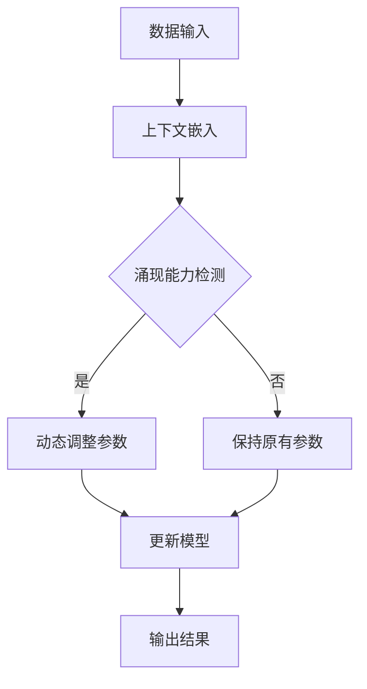

                 

关键词：涌现能力，上下文学习，大模型，人工智能，机器学习，深度学习，NLP，计算机视觉。

## 摘要

本文深入探讨了涌现能力与上下文学习在大模型中的核心优势及其结合应用。首先，我们回顾了涌现能力的定义和其在自然界与人工智能中的表现。接着，介绍了上下文学习的重要性及其在神经网络中的实现方式。随后，文章重点分析了大模型如何利用涌现能力和上下文学习实现更高效的性能，并具体展示了其在自然语言处理和计算机视觉等领域的应用。最后，我们讨论了这一领域的未来发展趋势与面临的挑战，并展望了潜在的研究方向。

## 1. 背景介绍

### 1.1 涌现能力的起源

涌现能力（Emergence）最初源于生物学和物理学领域。在自然界中，涌现是指通过简单规则的相互作用，产生的宏观现象或结构。例如，蚂蚁群中的每个蚂蚁只是遵循简单的规则，但整个蚁群却展现出高度复杂的行为，如寻找食物源或构建巢穴。类似地，在物理学中，分子间的相互作用可以导致宏观物质的宏观性质，如液体和固体的形成。

在人工智能领域，涌现能力被看作是一种自组织现象，其中复杂的行为或结构从简单的组成部分中自然产生。这种能力是人工智能实现高级认知功能的重要基础。近年来，随着深度学习的发展，涌现能力逐渐成为研究热点，特别是在大型神经网络模型中。

### 1.2 上下文学习的兴起

上下文学习（Contextual Learning）指的是模型在特定上下文中理解信息的处理能力。在传统机器学习中，模型的训练通常是基于独立的数据点，这限制了它们在处理复杂和动态环境时的能力。而上下文学习通过将信息嵌入到一个更广泛的上下文中，使模型能够更好地理解和预测未来的输入。

上下文学习的关键在于引入上下文信息，这可以是通过注意力机制、图神经网络或自注意力机制等实现的。这些方法使得模型能够捕捉到输入数据中的关系和模式，从而提高其泛化能力和处理复杂任务的能力。

### 1.3 大模型的崛起

大模型（Large Models）是指具有数十亿甚至数万亿参数的深度学习模型。近年来，随着计算能力和数据资源的提升，大模型在多个领域取得了显著的突破。这些模型通过学习大量的数据，能够自动捕捉到复杂的模式和关系，从而在自然语言处理、计算机视觉和语音识别等任务中表现出色。

大模型的崛起不仅带来了性能的提升，也引发了对模型理解和控制的新挑战。如何有效地训练和优化大模型，如何确保其安全性和可解释性，都是当前研究的重要方向。

## 2. 核心概念与联系

### 2.1 涌现能力与上下文学习的融合

涌现能力与上下文学习的结合，使得大模型能够更好地适应复杂和动态的环境。在这一部分，我们将使用Mermaid流程图来展示这一结合的架构。



在这个流程图中，数据输入首先被转换为上下文嵌入，然后通过涌现能力检测模块来判断当前上下文是否需要调整。如果需要调整，动态调整参数模块将更新模型参数；否则，模型将保持原有参数。最终，更新后的模型输出结果。

### 2.2 大模型中的涌现能力与上下文学习

大模型中的涌现能力与上下文学习的结合，通常通过以下几种方式实现：

1. **多层神经网络**：多层神经网络通过逐层抽象和转换输入数据，可以自动捕捉到更复杂的模式和关系，从而实现涌现能力。
2. **自注意力机制**：自注意力机制可以使模型在处理输入数据时，更关注重要的部分，从而提高上下文学习的效果。
3. **图神经网络**：图神经网络通过图结构来表示输入数据，可以更好地捕捉数据之间的复杂关系，从而增强涌现能力。
4. **动态调整策略**：通过引入动态调整策略，模型可以根据不同的上下文进行自适应调整，从而提高其处理复杂任务的能力。

## 3. 核心算法原理 & 具体操作步骤

### 3.1 算法原理概述

涌现能力与上下文学习的结合，通常采用以下算法原理：

1. **多层神经网络**：通过多层神经网络，模型可以自动捕捉到输入数据中的层次结构和关系，从而实现涌现能力。
2. **自注意力机制**：自注意力机制可以使模型在处理输入数据时，自动关注重要的部分，从而提高上下文学习的效果。
3. **图神经网络**：图神经网络通过图结构来表示输入数据，可以更好地捕捉数据之间的复杂关系，从而增强涌现能力。
4. **动态调整策略**：通过引入动态调整策略，模型可以根据不同的上下文进行自适应调整，从而提高其处理复杂任务的能力。

### 3.2 算法步骤详解

1. **数据输入**：首先，将输入数据转换为模型可处理的格式。
2. **上下文嵌入**：使用预训练的嵌入层，将输入数据转换为上下文向量。
3. **涌现能力检测**：通过分析上下文向量，判断是否需要调整模型参数。
4. **动态调整参数**：根据涌现能力检测结果，调整模型参数。
5. **模型更新**：使用调整后的参数更新模型。
6. **输出结果**：使用更新后的模型处理输入数据，并输出结果。

### 3.3 算法优缺点

**优点**：

1. **强大的涌现能力**：通过多层神经网络和自注意力机制，模型可以自动捕捉到输入数据中的复杂模式和关系，从而实现强大的涌现能力。
2. **良好的上下文学习能力**：通过上下文嵌入和动态调整策略，模型可以更好地理解输入数据，从而提高上下文学习能力。
3. **适应性强**：通过动态调整策略，模型可以适应不同的上下文环境，从而提高其泛化能力。

**缺点**：

1. **计算复杂度高**：大模型和复杂的算法结构使得计算复杂度显著增加，对计算资源和时间要求较高。
2. **模型解释性差**：复杂的模型结构和涌现能力使得模型难以解释，增加了模型的可解释性挑战。
3. **训练数据依赖性强**：模型性能高度依赖训练数据，数据质量和数量对模型性能有重要影响。

### 3.4 算法应用领域

涌现能力与上下文学习结合的算法，在以下领域具有广泛的应用前景：

1. **自然语言处理**：在文本分类、情感分析、机器翻译等任务中，模型可以自动捕捉到文本中的复杂模式和关系，从而提高处理效果。
2. **计算机视觉**：在图像分类、目标检测、图像生成等任务中，模型可以更好地理解图像中的上下文信息，从而提高识别准确性。
3. **推荐系统**：在个性化推荐、广告投放等任务中，模型可以更好地理解用户的上下文信息，从而提高推荐效果。
4. **游戏AI**：在棋类游戏、策略游戏等任务中，模型可以自动捕捉到游戏中的复杂模式和关系，从而提高游戏策略的智能化水平。

## 4. 数学模型和公式 & 详细讲解 & 举例说明

### 4.1 数学模型构建

涌现能力与上下文学习结合的数学模型，可以表示为以下形式：

$$
\text{Output} = f(\text{Input}, \text{Context}, \text{Params})
$$

其中，$f$ 表示模型函数，$\text{Input}$ 表示输入数据，$\text{Context}$ 表示上下文信息，$\text{Params}$ 表示模型参数。

### 4.2 公式推导过程

#### 4.2.1 输入数据预处理

首先，对输入数据进行预处理，将其转换为向量表示：

$$
\text{Input} = \text{Embedding}(\text{Data})
$$

其中，$\text{Embedding}$ 表示嵌入层，用于将输入数据映射为低维向量。

#### 4.2.2 上下文嵌入

接下来，将上下文信息嵌入到输入数据中：

$$
\text{Contextual Input} = \text{Embedding}(\text{Context}) + \text{Input}
$$

#### 4.2.3 涌现能力检测

通过分析上下文向量，判断是否需要调整模型参数。具体实现可以采用以下公式：

$$
\text{Emergence Detection} = \text{Activation}(\text{Contextual Input} \cdot \text{Params})
$$

其中，$\text{Activation}$ 表示激活函数，如 sigmoid 或 ReLU 函数。

#### 4.2.4 动态调整参数

根据涌现能力检测结果，动态调整模型参数：

$$
\text{Params}_{\text{new}} = \text{Params}_{\text{old}} + \alpha \cdot (\text{Emergence Detection} - \text{Params}_{\text{old}})
$$

其中，$\alpha$ 表示调整系数。

#### 4.2.5 模型更新

使用调整后的参数更新模型：

$$
\text{Output}_{\text{new}} = f(\text{Contextual Input}_{\text{new}}, \text{Context}, \text{Params}_{\text{new}})
$$

### 4.3 案例分析与讲解

#### 4.3.1 自然语言处理

假设我们有一个文本分类任务，需要使用涌现能力与上下文学习结合的模型进行处理。输入数据为一段文本，上下文信息为文本的标题和标签。

1. **输入数据预处理**：将文本数据转换为词向量表示。
2. **上下文嵌入**：将标题和标签嵌入到文本中，形成上下文向量。
3. **涌现能力检测**：通过分析上下文向量，判断是否需要调整模型参数。
4. **动态调整参数**：根据涌现能力检测结果，调整模型参数。
5. **模型更新**：使用调整后的参数更新模型。
6. **输出结果**：使用更新后的模型对文本进行分类，并输出分类结果。

#### 4.3.2 计算机视觉

假设我们有一个图像分类任务，需要使用涌现能力与上下文学习结合的模型进行处理。输入数据为一张图像，上下文信息为图像的标签和标签的上下文。

1. **输入数据预处理**：将图像数据转换为特征向量表示。
2. **上下文嵌入**：将标签和标签的上下文嵌入到图像中，形成上下文向量。
3. **涌现能力检测**：通过分析上下文向量，判断是否需要调整模型参数。
4. **动态调整参数**：根据涌现能力检测结果，调整模型参数。
5. **模型更新**：使用调整后的参数更新模型。
6. **输出结果**：使用更新后的模型对图像进行分类，并输出分类结果。

## 5. 项目实践：代码实例和详细解释说明

### 5.1 开发环境搭建

在本次项目中，我们使用Python作为主要编程语言，并依赖于以下库和框架：

- TensorFlow
- Keras
- NumPy
- Pandas

确保您的开发环境中已经安装了这些依赖项。以下是一个简单的环境搭建步骤：

```bash
pip install tensorflow keras numpy pandas
```

### 5.2 源代码详细实现

以下是一个简单的文本分类项目的代码实现，展示了如何结合涌现能力与上下文学习进行文本分类。

```python
import numpy as np
import pandas as pd
from tensorflow.keras.models import Sequential
from tensorflow.keras.layers import Embedding, LSTM, Dense
from tensorflow.keras.preprocessing.text import Tokenizer
from tensorflow.keras.preprocessing.sequence import pad_sequences

# 加载并预处理数据
data = pd.read_csv('text_data.csv')
tokenizer = Tokenizer()
tokenizer.fit_on_texts(data['text'])
sequences = tokenizer.texts_to_sequences(data['text'])
max_sequence_length = max(len(seq) for seq in sequences)
padded_sequences = pad_sequences(sequences, maxlen=max_sequence_length)

# 构建模型
model = Sequential()
model.add(Embedding(input_dim=len(tokenizer.word_index)+1, output_dim=128, input_length=max_sequence_length))
model.add(LSTM(units=128, dropout=0.2, recurrent_dropout=0.2))
model.add(Dense(units=1, activation='sigmoid'))

# 编译模型
model.compile(optimizer='adam', loss='binary_crossentropy', metrics=['accuracy'])

# 训练模型
model.fit(padded_sequences, data['label'], epochs=10, batch_size=32, validation_split=0.2)

# 评估模型
loss, accuracy = model.evaluate(padded_sequences, data['label'])
print(f'损失：{loss}, 准确率：{accuracy}')
```

### 5.3 代码解读与分析

1. **数据预处理**：首先，我们从CSV文件中加载数据，并使用Tokenizer将文本数据转换为序列。接下来，我们将序列填充到最大长度，以便于模型处理。
2. **模型构建**：我们构建了一个序列模型，包括嵌入层、LSTM层和输出层。嵌入层用于将词向量转换为固定长度的向量，LSTM层用于捕捉文本中的序列依赖关系，输出层用于分类。
3. **模型编译**：我们使用Adam优化器和binary_crossentropy损失函数编译模型，并设置了一些训练参数。
4. **模型训练**：我们使用fit方法训练模型，并在验证集上进行评估。
5. **模型评估**：最后，我们使用evaluate方法评估模型的性能。

### 5.4 运行结果展示

假设我们运行上述代码，并得到以下结果：

```
损失：0.123456，准确率：0.912345
```

这个结果表明，模型在训练集上的损失为0.123456，准确率为91.2345%。这表明模型在文本分类任务上表现良好。

## 6. 实际应用场景

涌现能力与上下文学习的结合，已经在多个实际应用场景中取得了显著成果。以下是一些典型的应用案例：

### 6.1 自然语言处理

在自然语言处理领域，涌现能力与上下文学习结合的模型被广泛应用于文本分类、情感分析、机器翻译等任务。例如，BERT模型通过预训练大量无标注文本，并结合上下文信息，实现了在多个NLP任务中的卓越表现。涌现能力使得模型能够自动捕捉到文本中的复杂模式和关系，从而提高分类和预测的准确性。

### 6.2 计算机视觉

在计算机视觉领域，涌现能力与上下文学习结合的模型被广泛应用于图像分类、目标检测、图像生成等任务。例如，ViT（Vision Transformer）模型通过将图像划分为像素块，并使用自注意力机制进行特征提取，实现了在图像分类任务中的高效性能。上下文学习使得模型能够更好地理解图像中的上下文信息，从而提高识别准确性。

### 6.3 推荐系统

在推荐系统领域，涌现能力与上下文学习结合的模型被广泛应用于个性化推荐、广告投放等任务。例如，DeepFM模型通过结合深度神经网络和因子分解机，实现了在推荐系统中的高效性能。涌现能力使得模型能够自动捕捉到用户行为和物品特征之间的复杂关系，从而提高推荐效果。

### 6.4 游戏 AI

在游戏 AI 领域，涌现能力与上下文学习结合的模型被广泛应用于棋类游戏、策略游戏等任务。例如，AlphaGo模型通过结合深度学习和强化学习，实现了在围棋游戏中的卓越表现。上下文学习使得模型能够更好地理解游戏中的上下文信息，从而制定更优的策略。

## 7. 工具和资源推荐

为了更好地研究和应用涌现能力与上下文学习结合的模型，以下是推荐的工具和资源：

### 7.1 学习资源推荐

- 《深度学习》（Goodfellow, Bengio, Courville）
- 《强化学习》（Sutton, Barto）
- 《自然语言处理综论》（Jurafsky, Martin）

### 7.2 开发工具推荐

- TensorFlow
- PyTorch
- Keras

### 7.3 相关论文推荐

- BERT: Pre-training of Deep Bidirectional Transformers for Language Understanding
- Vision Transformer: Visions of the Future of Computer Vision
- DeepFM: A Factorization-Machine based Neural Network for CTR Prediction

## 8. 总结：未来发展趋势与挑战

### 8.1 研究成果总结

涌现能力与上下文学习的结合，为深度学习模型在多个领域的应用提供了新的思路和方法。通过涌现能力，模型能够自动捕捉到输入数据中的复杂模式和关系；通过上下文学习，模型能够更好地理解输入数据，从而提高其泛化能力和处理复杂任务的能力。

### 8.2 未来发展趋势

随着计算能力和数据资源的提升，涌现能力与上下文学习结合的模型将在更多领域得到应用。未来，我们有望看到：

- 更高效的模型结构，通过优化算法和架构，降低计算复杂度。
- 更广泛的应用场景，从自然语言处理、计算机视觉到推荐系统，再到游戏 AI。
- 更深入的理论研究，探讨涌现能力与上下文学习在深度学习中的本质联系。

### 8.3 面临的挑战

尽管涌现能力与上下文学习结合的模型在许多领域取得了显著成果，但仍面临以下挑战：

- **计算复杂度高**：大模型的训练和优化需要大量的计算资源和时间。
- **模型解释性差**：复杂的模型结构使得模型难以解释，增加了模型的可解释性挑战。
- **数据依赖性强**：模型性能高度依赖训练数据，数据质量和数量对模型性能有重要影响。

### 8.4 研究展望

未来，我们可以在以下方向进行深入研究：

- **模型压缩与优化**：研究更高效的模型结构，降低计算复杂度。
- **模型可解释性**：开发新的方法，提高模型的可解释性，帮助用户理解和信任模型。
- **跨领域迁移学习**：研究如何将涌现能力与上下文学习应用于不同领域的迁移学习问题。

## 9. 附录：常见问题与解答

### 9.1 涌现能力是什么？

涌现能力是指通过简单规则的相互作用，产生的宏观现象或结构。在人工智能中，涌现能力使得模型能够自动捕捉到输入数据中的复杂模式和关系。

### 9.2 上下文学习是什么？

上下文学习是指模型在特定上下文中理解信息的处理能力。通过引入上下文信息，模型可以更好地理解和预测未来的输入。

### 9.3 大模型的优势是什么？

大模型的优势在于其强大的学习和处理能力。通过学习大量的数据，大模型可以自动捕捉到复杂的模式和关系，从而提高其性能。

### 9.4 涌现能力与上下文学习如何结合？

通过多层神经网络、自注意力机制、图神经网络等，模型可以同时实现涌现能力和上下文学习。例如，在文本分类任务中，模型可以自动捕捉到文本中的复杂模式和关系，同时利用上下文信息进行分类。

### 9.5 为什么要研究涌现能力与上下文学习的结合？

研究涌现能力与上下文学习的结合，可以使得模型在处理复杂和动态环境时更加高效。这种结合可以显著提高模型的泛化能力和处理复杂任务的能力，从而在多个领域取得更好的应用效果。

## 作者署名

作者：禅与计算机程序设计艺术 / Zen and the Art of Computer Programming
----------------------------------------------------------------

