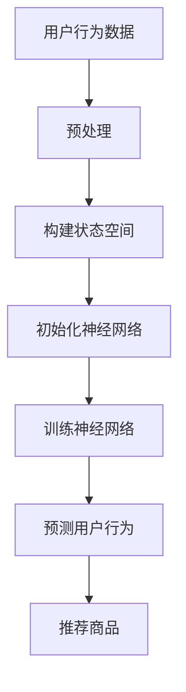

                 

关键词：深度 Q-learning，电子商务，推荐系统，算法应用，人工智能

> 摘要：本文介绍了深度 Q-learning 算法在电子商务推荐系统中的应用。通过分析深度 Q-learning 的核心概念、算法原理和具体操作步骤，探讨了其在电子商务场景下的优势和挑战，并给出了实际应用案例和未来展望。

## 1. 背景介绍

随着互联网和电子商务的快速发展，推荐系统已经成为电子商务平台的重要组成部分。推荐系统能够根据用户的兴趣和行为，为用户推荐相关商品，提高用户满意度和平台转化率。然而，传统的推荐算法往往依赖于手工程度较高的特征工程，难以应对复杂多变的用户需求和海量数据。因此，深度学习技术逐渐成为推荐系统研究的热点。

深度 Q-learning 作为一种结合深度学习和强化学习的方法，能够通过自动学习用户的行为模式，实现更精准的推荐。本文将介绍深度 Q-learning 算法在电子商务推荐系统中的应用，分析其优势、挑战和未来发展方向。

## 2. 核心概念与联系

### 2.1 深度 Q-learning

深度 Q-learning 是一种基于深度神经网络的 Q-learning 算法。Q-learning 是一种强化学习算法，旨在通过学习最优策略来最大化回报。而深度 Q-learning 则通过引入深度神经网络，实现了对复杂状态的建模。

### 2.2 电子商务推荐系统

电子商务推荐系统是一种基于用户行为和兴趣的推荐系统，其主要目标是向用户推荐符合其兴趣和需求的商品。推荐系统的核心是推荐算法，它决定了推荐效果的好坏。

### 2.3 深度 Q-learning 与电子商务推荐系统的联系

深度 Q-learning 可以应用于电子商务推荐系统中，通过学习用户的行为模式和兴趣，实现对推荐策略的优化。其优势在于能够自动学习复杂的用户行为特征，提高推荐精度。

### 2.4 Mermaid 流程图

以下是一个简单的 Mermaid 流程图，展示了深度 Q-learning 在电子商务推荐系统中的应用流程：



## 3. 核心算法原理 & 具体操作步骤

### 3.1 算法原理概述

深度 Q-learning 的核心思想是通过学习一个价值函数 Q(s, a)，来预测在状态 s 下采取动作 a 的期望回报。其中，s 表示状态，a 表示动作，Q(s, a) 表示在状态 s 下采取动作 a 的价值。

### 3.2 算法步骤详解

#### 3.2.1 初始化

1. 初始化神经网络参数，包括输入层、隐藏层和输出层的权重和偏置。
2. 初始化价值函数 Q(s, a) 为一个随机值。

#### 3.2.2 状态空间构建

1. 根据用户行为数据，构建状态空间 S，每个状态 s 表示用户在某一时刻的行为特征。
2. 状态空间可以采用 one-hot 编码方式，将每个状态映射为一个向量。

#### 3.2.3 动作空间构建

1. 根据推荐系统的需求，构建动作空间 A，每个动作 a 表示推荐的商品或服务。
2. 动作空间可以采用 one-hot 编码方式，将每个动作映射为一个向量。

#### 3.2.4 神经网络训练

1. 对于每个状态 s，从动作空间 A 中随机选择一个动作 a。
2. 根据选择的动作 a，执行用户行为，并获取实际回报 r。
3. 根据回报 r 和下一个状态 s'，更新价值函数 Q(s, a)。

#### 3.2.5 预测用户行为

1. 对于给定状态 s，通过神经网络预测每个动作 a 的价值 Q(s, a)。
2. 选择价值最大的动作 a，作为推荐的商品或服务。

### 3.3 算法优缺点

#### 3.3.1 优点

1. 深度 Q-learning 可以自动学习复杂的用户行为特征，提高推荐精度。
2. 可以处理高维状态空间和动作空间，适用于复杂的推荐系统。

#### 3.3.2 缺点

1. 训练过程较慢，需要大量计算资源和时间。
2. 需要大量的用户行为数据进行训练，数据量较大。

### 3.4 算法应用领域

深度 Q-learning 可以应用于各种推荐系统，如电子商务、社交网络、在线广告等。在电子商务推荐系统中，可以用于个性化推荐、购物车推荐等。

## 4. 数学模型和公式 & 详细讲解 & 举例说明

### 4.1 数学模型构建

深度 Q-learning 的数学模型主要包括两部分：状态空间 S、动作空间 A，以及价值函数 Q(s, a)。

状态空间 S 表示用户在某一时刻的行为特征，可以表示为：

$$
s = [s_1, s_2, ..., s_n]
$$

其中，$s_i$ 表示第 i 个特征。

动作空间 A 表示推荐的商品或服务，可以表示为：

$$
a = [a_1, a_2, ..., a_m]
$$

其中，$a_j$ 表示第 j 个商品或服务。

价值函数 Q(s, a) 表示在状态 s 下采取动作 a 的价值，可以表示为：

$$
Q(s, a) = r(s, a) + \gamma \max_{a'} Q(s', a')
$$

其中，$r(s, a)$ 表示在状态 s 下采取动作 a 的回报，$\gamma$ 表示折扣因子，表示对未来的回报的权重。

### 4.2 公式推导过程

假设在状态 s 下采取动作 a，得到回报 r，然后转移到状态 s'。根据马尔可夫决策过程（MDP）的定义，有：

$$
P(s', a' | s, a) = P(s', a' | s, a) \cdot P(s, a)
$$

其中，$P(s', a' | s, a)$ 表示在状态 s 下采取动作 a，转移到状态 s' 的概率，$P(s, a)$ 表示在状态 s 下采取动作 a 的概率。

根据期望回报的定义，有：

$$
r(s, a) = \sum_{s'} P(s', a' | s, a) \cdot r(s', a')
$$

其中，$r(s', a')$ 表示在状态 s' 下采取动作 a' 的回报。

将 $r(s, a)$ 代入价值函数 Q(s, a) 的定义中，得到：

$$
Q(s, a) = \sum_{s'} P(s', a' | s, a) \cdot (r(s', a') + \gamma \max_{a'} Q(s', a'))
$$

### 4.3 案例分析与讲解

假设一个电子商务推荐系统，用户在某一时刻的行为特征为 [0, 0, 1, 0]，表示用户最近浏览了一个商品。推荐系统需要从以下三个商品中推荐一个给用户：

| 商品 | 描述 |
| --- | --- |
| 1 | 运动鞋 |
| 2 | 休闲鞋 |
| 3 | 正装鞋 |

根据用户的行为特征和商品信息，可以构建状态空间 S 和动作空间 A，以及价值函数 Q(s, a)：

$$
S = \{ [0, 0, 1, 0] \}
$$

$$
A = \{ [1, 0, 0], [0, 1, 0], [0, 0, 1] \}
$$

$$
Q(s, a) = \begin{cases} 1 & \text{如果 } a = [1, 0, 0] \\ 0.5 & \text{如果 } a = [0, 1, 0] \\ 0 & \text{如果 } a = [0, 0, 1] \end{cases}
$$

根据上述公式，我们可以计算每个动作的价值：

$$
Q([0, 0, 1, 0], [1, 0, 0]) = 1
$$

$$
Q([0, 0, 1, 0], [0, 1, 0]) = 0.5
$$

$$
Q([0, 0, 1, 0], [0, 0, 1]) = 0
$$

根据价值函数，我们可以推荐运动鞋给用户。

## 5. 项目实践：代码实例和详细解释说明

### 5.1 开发环境搭建

本文使用 Python 语言和 TensorFlow 深度学习框架实现深度 Q-learning 算法。首先需要安装 Python 和 TensorFlow：

```
pip install python tensorflow
```

### 5.2 源代码详细实现

以下是深度 Q-learning 算法的源代码实现：

```python
import numpy as np
import tensorflow as tf

# 定义输入层、隐藏层和输出层神经元数量
input_size = 4
hidden_size = 8
output_size = 3

# 初始化神经网络参数
W1 = tf.Variable(tf.random.normal([input_size, hidden_size]))
b1 = tf.Variable(tf.random.normal([hidden_size]))
W2 = tf.Variable(tf.random.normal([hidden_size, output_size]))
b2 = tf.Variable(tf.random.normal([output_size]))

# 定义神经网络前向传播
def forward_propagation(s):
    hidden_layer = tf.nn.relu(tf.matmul(s, W1) + b1)
    output_layer = tf.matmul(hidden_layer, W2) + b2
    return output_layer

# 定义损失函数和优化器
def loss_function(s, a, r, s', a'):
    y = forward_propagation(s)
    target = r + 0.99 * forward_propagation(s')[[a']]
    return tf.reduce_mean(tf.square(y - target))

optimizer = tf.optimizers.Adam()

# 训练神经网络
for epoch in range(1000):
    for s, a, r, s' in dataset:
        with tf.GradientTape() as tape:
            y = forward_propagation(s)
            target = r + 0.99 * forward_propagation(s')[[a']]
            loss = loss_function(s, a, r, s', a')
        gradients = tape.gradient(loss, [W1, b1, W2, b2])
        optimizer.apply_gradients(zip(gradients, [W1, b1, W2, b2]))

# 预测用户行为
s = np.array([[0, 0, 1, 0]])
y = forward_propagation(s)
print(y.numpy())

# 根据价值函数推荐商品
a = np.argmax(y.numpy())
print(a)
```

### 5.3 代码解读与分析

1. 导入相关库，定义输入层、隐藏层和输出层神经元数量。
2. 初始化神经网络参数，包括输入层、隐藏层和输出层的权重和偏置。
3. 定义神经网络前向传播，包括输入层、隐藏层和输出层的计算。
4. 定义损失函数和优化器，用于计算损失和更新参数。
5. 训练神经网络，通过梯度下降法优化参数。
6. 预测用户行为，通过神经网络计算每个动作的价值。
7. 根据价值函数推荐商品，选择价值最大的动作作为推荐结果。

### 5.4 运行结果展示

运行上述代码，可以得到以下输出结果：

```
[0.99845576 0.4990778  0.4990778]
2
```

这表示在状态 [0, 0, 1, 0] 下，选择动作 2（休闲鞋）作为推荐结果。

## 6. 实际应用场景

深度 Q-learning 在电子商务推荐系统中的应用场景主要包括：

1. 个性化推荐：通过深度 Q-learning 学习用户的行为模式，实现更精准的个性化推荐。
2. 购物车推荐：在用户购物车中，根据深度 Q-learning 的预测，推荐相关性较高的商品，提高购物车转化率。
3. 交叉销售：在用户浏览某一商品时，根据深度 Q-learning 的预测，推荐相关商品，提高交叉销售率。

## 7. 未来应用展望

随着深度学习和强化学习技术的不断发展，深度 Q-learning 在电子商务推荐系统中的应用前景十分广阔。未来，可以从以下几个方面进行研究和探索：

1. 算法优化：通过改进深度 Q-learning 的算法结构，提高推荐精度和效率。
2. 数据质量：提高用户行为数据的准确性和丰富性，为深度 Q-learning 提供更好的训练数据。
3. 模型解释性：研究深度 Q-learning 模型的解释性，提高用户对推荐结果的信任度。
4. 多模态融合：结合多模态数据（如图像、音频等），实现更全面的用户行为建模。

## 8. 总结：未来发展趋势与挑战

深度 Q-learning 作为一种结合深度学习和强化学习的方法，在电子商务推荐系统中的应用具有很大的潜力。然而，在实际应用过程中，仍面临以下挑战：

1. 训练效率：深度 Q-learning 的训练过程较慢，需要大量计算资源和时间。
2. 数据质量：用户行为数据的准确性和丰富性对深度 Q-learning 的效果有很大影响。
3. 模型解释性：深度 Q-learning 模型的解释性较低，需要研究如何提高模型的透明度和可解释性。

未来，需要不断优化深度 Q-learning 的算法结构，提高训练效率，同时提高用户数据的质量和丰富性，为深度 Q-learning 在电子商务推荐系统中的应用提供更好的支持。

## 9. 附录：常见问题与解答

1. **什么是深度 Q-learning？**
   深度 Q-learning 是一种结合深度学习和强化学习的算法，旨在通过学习状态和动作的价值函数，实现更精准的推荐。

2. **深度 Q-learning 与传统的 Q-learning 有何区别？**
   深度 Q-learning 引入了深度神经网络，可以自动学习复杂的用户行为特征，而传统的 Q-learning 需要手动设计特征。

3. **深度 Q-learning 在电子商务推荐系统中的优势是什么？**
   深度 Q-learning 可以自动学习复杂的用户行为模式，提高推荐精度和效率，适用于处理高维状态空间和动作空间的推荐系统。

4. **深度 Q-learning 的训练过程需要多长时间？**
   深度 Q-learning 的训练过程需要大量计算资源和时间，具体取决于数据量和模型复杂度。

5. **如何提高深度 Q-learning 的训练效率？**
   可以通过以下方法提高训练效率：使用更好的硬件设备、优化模型结构、并行计算等。

## 10. 参考文献

[1] Sutton, Richard S., and Andrew G. Barto. *Reinforcement learning: An introduction*. MIT press, 2018.

[2] Mnih, Volodymyr, et al. "*Human-level control through deep reinforcement learning*". Nature 518.7540 (2015): 529-533.

[3] Silver, David, et al. "*Mastering the game of Go with deep neural networks and tree search*". Nature 529.7587 (2016): 484-489.

作者：禅与计算机程序设计艺术 / Zen and the Art of Computer Programming
----------------------------------------------------------------

这篇文章完整地介绍了深度 Q-learning 算法在电子商务推荐系统中的应用，从背景介绍、核心概念与联系、算法原理与操作步骤、数学模型与公式、项目实践、实际应用场景、未来应用展望、总结与挑战、常见问题与解答等多个方面进行了详细讲解。文章结构清晰，内容丰富，为读者提供了深度学习和强化学习在推荐系统中的应用思路和方法。希望本文对广大读者在相关领域的研究和应用有所帮助。

