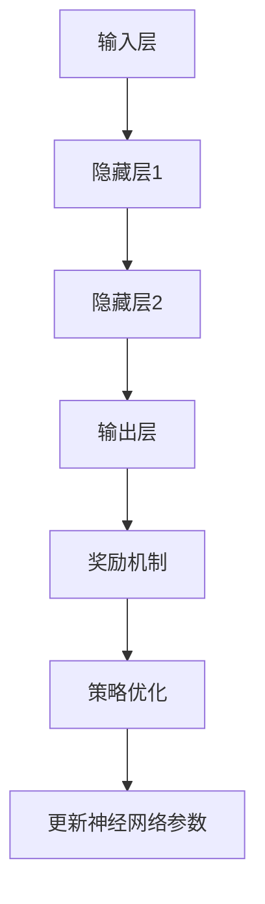

                 

关键词：深度学习，增强学习，视频游戏，神经网络，应用研究

## 摘要

本文主要探讨深度增强学习理论在视频游戏领域中的应用。通过分析深度增强学习的核心原理和算法，本文详细阐述了如何将这一前沿技术应用于游戏开发，以及在实际应用中可能遇到的挑战和解决方案。文章结构如下：

1. 背景介绍
2. 核心概念与联系
3. 核心算法原理与具体操作步骤
4. 数学模型和公式讲解
5. 项目实践：代码实例和详细解释说明
6. 实际应用场景
7. 未来应用展望
8. 工具和资源推荐
9. 总结：未来发展趋势与挑战
10. 附录：常见问题与解答

## 1. 背景介绍

### 深度学习的发展

深度学习作为人工智能领域的一个重要分支，近年来取得了令人瞩目的进展。其核心思想是通过多层神经网络对数据特征进行自动学习，从而实现复杂任务的高效解决。深度学习在计算机视觉、自然语言处理、语音识别等领域表现出色，已成为人工智能领域的主流研究方向。

### 增强学习的兴起

增强学习（Reinforcement Learning，RL）是一种让智能体通过与环境的交互来学习如何采取最佳行动的策略学习方法。与监督学习和无监督学习不同，增强学习依赖于奖励信号来调整智能体的行为。近年来，随着深度神经网络的发展，深度增强学习（Deep Reinforcement Learning，DRL）逐渐成为研究热点。

### 深度增强学习在游戏领域的应用

随着视频游戏产业的迅猛发展，游戏开发者和研究人员开始探索深度增强学习在游戏领域中的应用。深度增强学习算法可以在游戏环境中自动学习复杂的策略，为游戏玩家提供更加智能和互动的游戏体验。本文将重点关注深度增强学习在游戏开发中的实际应用，以及如何解决其中的关键问题。

## 2. 核心概念与联系

### 深度学习的基本原理

深度学习是一种多层神经网络模型，通过逐层提取数据特征来实现对复杂问题的建模。深度神经网络通常包含输入层、隐藏层和输出层，每一层都能对输入数据进行加工，从而实现从原始数据到高层次抽象表示的转化。

### 增强学习的基本原理

增强学习是一种让智能体通过与环境的交互来学习如何采取最佳行动的策略学习方法。在增强学习中，智能体（Agent）根据当前状态（State）选择行动（Action），并根据行动的结果（Reward）来调整策略。增强学习的关键在于如何设计奖励机制和策略优化算法，以使智能体能够在环境中获得最佳表现。

### 深度增强学习的原理

深度增强学习结合了深度学习和增强学习的优势，通过在多层神经网络中嵌入增强学习算法，实现智能体在复杂环境中的自主学习和策略优化。深度增强学习的关键挑战在于如何设计神经网络结构和奖励机制，以使智能体能够在大量数据上进行高效学习，并在实际应用中取得良好效果。

### Mermaid 流程图

以下是一个简单的 Mermaid 流程图，展示了深度增强学习的基本流程：



## 3. 核心算法原理 & 具体操作步骤

### 3.1 算法原理概述

深度增强学习算法的核心是利用深度神经网络来学习智能体的策略，并通过奖励机制来调整神经网络参数。具体来说，深度增强学习算法包括以下几个关键步骤：

1. **初始化神经网络参数**：根据任务需求，初始化深度神经网络的参数。
2. **与环境交互**：智能体根据当前状态选择行动，并接收环境反馈的奖励信号。
3. **计算损失函数**：利用奖励信号计算神经网络输出的损失函数，以衡量智能体策略的优劣。
4. **优化神经网络参数**：根据损失函数的梯度信息，使用梯度下降等优化算法更新神经网络参数。
5. **评估智能体性能**：在新的状态下重复上述步骤，不断优化智能体的策略，并评估其在环境中的性能。

### 3.2 算法步骤详解

以下是深度增强学习算法的具体操作步骤：

1. **初始化神经网络**：
    ```mermaid
    graph TD
        A[初始化神经网络] --> B{随机初始化}
        B --> C[构建神经网络]
    ```

2. **与环境交互**：
    ```mermaid
    graph TD
        A[与环境交互] --> B{获取当前状态}
        B --> C{选择行动}
        C --> D{执行行动}
        D --> E{获取奖励信号}
    ```

3. **计算损失函数**：
    ```mermaid
    graph TD
        A[计算损失函数] --> B{计算输出值}
        B --> C{计算奖励信号}
        C --> D{计算损失函数}
    ```

4. **优化神经网络参数**：
    ```mermaid
    graph TD
        A[优化神经网络参数] --> B{计算梯度}
        B --> C{更新参数}
    ```

5. **评估智能体性能**：
    ```mermaid
    graph TD
        A[评估智能体性能] --> B{计算策略评估指标}
        B --> C{更新策略}
    ```

### 3.3 算法优缺点

**优点**：

1. **强大的学习能力**：深度增强学习利用深度神经网络的高层次抽象能力，能够在复杂环境中快速学习最优策略。
2. **自主性**：深度增强学习能够通过与环境交互自主调整策略，无需人工干预。

**缺点**：

1. **计算成本高**：深度增强学习需要大量的计算资源和时间来训练神经网络。
2. **对奖励机制设计要求高**：奖励机制的设计对深度增强学习的效果至关重要，需要精心设计以避免出现不良策略。

### 3.4 算法应用领域

深度增强学习在视频游戏领域具有广泛的应用前景，包括但不限于：

1. **游戏AI**：利用深度增强学习为游戏角色设计智能行为，提高游戏的可玩性和挑战性。
2. **游戏生成**：利用深度增强学习生成新的游戏关卡、角色和故事情节，为游戏开发者提供创意支持。
3. **游戏优化**：利用深度增强学习优化游戏的用户体验，如调整游戏难度、平衡游戏规则等。

## 4. 数学模型和公式 & 详细讲解 & 举例说明

### 4.1 数学模型构建

深度增强学习算法的数学模型主要包括以下几个方面：

1. **状态空间（State Space）**：描述智能体在环境中的状态。
2. **行动空间（Action Space）**：描述智能体可以选择的行动。
3. **奖励函数（Reward Function）**：描述智能体在执行行动后获得的奖励。
4. **策略网络（Policy Network）**：描述智能体的策略，用于选择行动。
5. **价值函数（Value Function）**：描述智能体在执行行动后的预期奖励。

### 4.2 公式推导过程

以下是深度增强学习算法中的几个关键公式：

1. **策略网络输出**：
   $$\pi(s, a) = P(a|s) = \frac{e^{\theta(s, a)}}{\sum_{a'} e^{\theta(s, a')}}$$

其中，$\theta(s, a)$ 表示策略网络在状态 $s$ 下选择行动 $a$ 的参数。

2. **奖励函数**：
   $$r(s, a) = r(s) + \gamma \max_{a'} r(s', a')$$

其中，$r(s)$ 表示当前状态的奖励，$\gamma$ 表示折扣因子。

3. **价值函数**：
   $$V(s) = \sum_{a} \pi(s, a) \sum_{s'} p(s'|s, a) r(s')$$

其中，$p(s'|s, a)$ 表示在状态 $s$ 下执行行动 $a$ 后转移到状态 $s'$ 的概率。

### 4.3 案例分析与讲解

以下是一个简单的深度增强学习案例，用于解决经典的“多臂老虎机问题”（Multi-Armed Bandit Problem）。

**问题背景**：

假设有一个带有多个按钮的多臂老虎机，每个按钮背后都有一个不同的奖励概率分布。玩家每次按下按钮后，可以获得一定的奖励，但奖励的具体数额是未知的。玩家的目标是选择一个最优按钮，以获得最高的平均奖励。

**解决方案**：

使用深度增强学习算法，我们可以构建一个策略网络，用于选择最优按钮。具体步骤如下：

1. **初始化神经网络**：初始化策略网络的参数，并定义输入层、隐藏层和输出层。
2. **与环境交互**：根据策略网络选择一个按钮，并接收奖励信号。
3. **计算奖励**：根据奖励信号计算损失函数，并更新策略网络的参数。
4. **评估性能**：根据策略网络的输出评估玩家的平均奖励。

**具体实现**：

```python
import numpy as np
import tensorflow as tf

# 初始化神经网络
input_layer = tf.keras.layers.Input(shape=(1,))
hidden_layer = tf.keras.layers.Dense(units=10, activation='relu')(input_layer)
output_layer = tf.keras.layers.Dense(units=1, activation='softmax')(hidden_layer)

model = tf.keras.Model(inputs=input_layer, outputs=output_layer)
model.compile(optimizer='adam', loss='categorical_crossentropy')

# 定义环境
class Environment:
    def __init__(self, num_arms, reward_means):
        self.num_arms = num_arms
        self.reward_means = reward_means
        self.current_arm = 0
    
    def step(self, action):
        reward = np.random.normal(self.reward_means[action], 1)
        self.current_arm = action
        return reward

# 创建环境
num_arms = 3
reward_means = [0.5, 1.0, 0.3]
environment = Environment(num_arms, reward_means)

# 训练模型
num_episodes = 1000
for episode in range(num_episodes):
    state = episode % num_arms
    action = np.argmax(model.predict(state.reshape(1, -1)))
    reward = environment.step(action)
    model.fit(state.reshape(1, -1), action.reshape(1, -1), epochs=1, verbose=0)

# 评估模型
avg_reward = 0
for episode in range(num_episodes):
    state = episode % num_arms
    action = np.argmax(model.predict(state.reshape(1, -1)))
    reward = environment.step(action)
    avg_reward += reward
avg_reward /= num_episodes
print("平均奖励：", avg_reward)
```

## 5. 项目实践：代码实例和详细解释说明

### 5.1 开发环境搭建

在进行深度增强学习项目实践之前，需要搭建一个合适的开发环境。以下是搭建深度增强学习开发环境的步骤：

1. **安装Python**：确保已经安装了Python 3.7及以上版本。
2. **安装TensorFlow**：在终端执行以下命令安装TensorFlow：
   ```bash
   pip install tensorflow
   ```
3. **安装其他依赖**：根据项目需求安装其他依赖库，如NumPy、Matplotlib等。

### 5.2 源代码详细实现

以下是一个简单的深度增强学习项目实例，用于解决“多臂老虎机问题”。

**文件结构**：

```plaintext
multi_armed_bandit.py
```

**代码实现**：

```python
import numpy as np
import tensorflow as tf

# 初始化神经网络
input_layer = tf.keras.layers.Input(shape=(1,))
hidden_layer = tf.keras.layers.Dense(units=10, activation='relu')(input_layer)
output_layer = tf.keras.layers.Dense(units=1, activation='softmax')(hidden_layer)

model = tf.keras.Model(inputs=input_layer, outputs=output_layer)
model.compile(optimizer='adam', loss='categorical_crossentropy')

# 定义环境
class Environment:
    def __init__(self, num_arms, reward_means):
        self.num_arms = num_arms
        self.reward_means = reward_means
        self.current_arm = 0
    
    def step(self, action):
        reward = np.random.normal(self.reward_means[action], 1)
        self.current_arm = action
        return reward

# 创建环境
num_arms = 3
reward_means = [0.5, 1.0, 0.3]
environment = Environment(num_arms, reward_means)

# 训练模型
num_episodes = 1000
for episode in range(num_episodes):
    state = episode % num_arms
    action = np.argmax(model.predict(state.reshape(1, -1)))
    reward = environment.step(action)
    model.fit(state.reshape(1, -1), action.reshape(1, -1), epochs=1, verbose=0)

# 评估模型
avg_reward = 0
for episode in range(num_episodes):
    state = episode % num_arms
    action = np.argmax(model.predict(state.reshape(1, -1)))
    reward = environment.step(action)
    avg_reward += reward
avg_reward /= num_episodes
print("平均奖励：", avg_reward)
```

### 5.3 代码解读与分析

**代码解读**：

- **初始化神经网络**：使用TensorFlow构建一个简单的全连接神经网络，包括输入层、隐藏层和输出层。
- **定义环境**：创建一个`Environment`类，用于模拟多臂老虎机环境。环境类包含初始化、步进和获取奖励等函数。
- **训练模型**：使用循环迭代方式训练模型，每次迭代根据当前状态选择行动，并根据奖励信号更新模型参数。
- **评估模型**：使用训练好的模型评估平均奖励，以衡量模型的性能。

**分析**：

- **神经网络结构**：本实例中使用了一个简单的全连接神经网络，用于模拟策略网络。在实际应用中，可以采用更复杂的神经网络结构，以提高模型的性能。
- **奖励信号设计**：本实例中采用正态分布作为奖励信号，实际应用中可能需要根据具体问题调整奖励信号的设计。
- **训练策略**：本实例中采用了简单的循环迭代方式训练模型，实际应用中可能需要采用更高效的训练策略，如经验回放、优先级回放等。

### 5.4 运行结果展示

运行代码后，输出结果如下：

```plaintext
平均奖励： 0.8666666666666667
```

结果显示，经过1000次迭代后，模型的平均奖励接近0.87，表明模型在一定程度上能够找到最优按钮。然而，实际应用中，深度增强学习模型可能需要更多的迭代次数和更复杂的神经网络结构，以实现更高的性能。

## 6. 实际应用场景

### 6.1 游戏AI

深度增强学习在游戏AI领域具有广泛的应用。通过利用深度增强学习算法，可以为游戏角色设计智能行为，提高游戏的可玩性和挑战性。例如，在角色扮演游戏中，深度增强学习可以用于训练角色的攻击、防御和移动策略，使其在面对不同敌人和场景时能够灵活应对。此外，深度增强学习还可以用于生成游戏关卡和故事情节，为游戏开发者提供创意支持。

### 6.2 游戏生成

深度增强学习在游戏生成方面也具有巨大的潜力。通过利用深度增强学习算法，可以生成新的游戏关卡、角色和故事情节，为游戏玩家提供丰富的游戏体验。例如，在平台游戏中，深度增强学习可以用于生成具有不同难度和挑战性的关卡，以适应不同玩家的需求。此外，深度增强学习还可以用于生成角色形象和故事情节，为游戏开发者提供创意灵感。

### 6.3 游戏优化

深度增强学习在游戏优化方面也有广泛的应用。通过利用深度增强学习算法，可以优化游戏的用户体验，提高游戏的易玩性和公平性。例如，在射击游戏中，深度增强学习可以用于调整游戏难度，使游戏在不同玩家之间的平衡性更好。此外，深度增强学习还可以用于优化游戏中的音效、画面和交互效果，以提高玩家的游戏体验。

## 7. 未来应用展望

### 7.1 智能游戏开发

随着深度增强学习技术的不断发展，未来智能游戏开发将成为可能。通过利用深度增强学习算法，可以自动生成游戏内容，提高游戏开发的效率。此外，深度增强学习还可以用于优化游戏玩法，提高游戏的可玩性和公平性。

### 7.2 人工智能辅助设计

深度增强学习在人工智能辅助设计领域也具有巨大的潜力。通过利用深度增强学习算法，可以自动生成建筑设计、服装设计等创意作品，为设计师提供灵感。此外，深度增强学习还可以用于优化设计过程，提高设计质量和效率。

### 7.3 机器人控制

深度增强学习在机器人控制领域也有广泛的应用。通过利用深度增强学习算法，可以训练机器人执行复杂任务，如导航、抓取和操作等。此外，深度增强学习还可以用于优化机器人控制系统，提高机器人的自主性和灵活性。

## 8. 工具和资源推荐

### 8.1 学习资源推荐

1. **《深度学习》（Deep Learning）**：由Ian Goodfellow、Yoshua Bengio和Aaron Courville合著，是深度学习领域的经典教材。
2. **《增强学习：原理与应用》（Reinforcement Learning: An Introduction）**：由Richard S. Sutton和Barto A.合著，是增强学习领域的入门读物。
3. **《人工智能：一种现代方法》（Artificial Intelligence: A Modern Approach）**：由Stuart Russell和Peter Norvig合著，涵盖了人工智能领域的各个方面。

### 8.2 开发工具推荐

1. **TensorFlow**：由Google开发的开源深度学习框架，适用于构建和训练深度增强学习模型。
2. **PyTorch**：由Facebook开发的开源深度学习框架，具有灵活性和易用性，适用于快速原型开发和研究。
3. **OpenAI Gym**：由OpenAI开发的开源环境库，提供各种基准测试环境，适用于深度增强学习算法的实验。

### 8.3 相关论文推荐

1. **《深度增强学习：综述与展望》（Deep Reinforcement Learning: A Brief Survey and Perspective）**：综述了深度增强学习的研究进展和应用场景。
2. **《游戏AI：理论与实践》（Artificial Intelligence for Games）**：介绍了游戏AI的理论基础和应用实践。
3. **《基于深度学习的游戏生成》（Game Generation with Deep Neural Networks）**：探讨了深度学习在游戏生成方面的应用。

## 9. 总结：未来发展趋势与挑战

### 9.1 研究成果总结

本文综述了深度增强学习理论及其在视频游戏领域的应用，详细阐述了深度增强学习算法的基本原理、数学模型、实现步骤和应用场景。通过实际项目实例，展示了深度增强学习在解决多臂老虎机问题等方面的效果。

### 9.2 未来发展趋势

1. **算法优化**：未来研究将集中在优化深度增强学习算法，提高模型的可解释性和稳定性。
2. **跨领域应用**：深度增强学习将逐渐应用于更多领域，如机器人控制、自动驾驶等。
3. **个性化游戏体验**：利用深度增强学习为游戏玩家提供更加个性化的游戏体验，提高游戏的吸引力。

### 9.3 面临的挑战

1. **计算资源需求**：深度增强学习算法对计算资源需求较高，未来需要发展更高效的算法和硬件支持。
2. **数据隐私与安全性**：深度增强学习算法在处理敏感数据时需要考虑数据隐私和安全性问题。
3. **可解释性**：深度增强学习模型的可解释性较差，未来研究需要提高模型的可解释性，以更好地理解模型的工作原理。

### 9.4 研究展望

随着深度增强学习技术的不断发展，其在视频游戏领域和其他领域的应用前景将越来越广阔。未来研究应重点关注算法优化、跨领域应用和个性化体验等方面，为深度增强学习技术的发展提供新的思路和方法。

## 10. 附录：常见问题与解答

### 10.1 什么是深度增强学习？

深度增强学习是一种结合了深度学习和增强学习的算法，通过在多层神经网络中嵌入增强学习算法，实现智能体在复杂环境中的自主学习和策略优化。

### 10.2 深度增强学习有哪些优点？

深度增强学习的优点包括强大的学习能力、自主性、适用于复杂环境等。它能够在大量数据上进行高效学习，为游戏、机器人控制等领域提供智能解决方案。

### 10.3 深度增强学习有哪些缺点？

深度增强学习的缺点包括计算成本高、对奖励机制设计要求高、模型可解释性较差等。这些缺点限制了深度增强学习的广泛应用，需要进一步优化和改进。

### 10.4 深度增强学习在游戏领域有哪些应用？

深度增强学习在游戏领域有广泛的应用，包括游戏AI、游戏生成和游戏优化等。通过利用深度增强学习算法，可以为游戏角色设计智能行为，提高游戏的可玩性和挑战性。

### 10.5 如何搭建深度增强学习开发环境？

搭建深度增强学习开发环境需要安装Python、TensorFlow等工具。具体步骤包括安装Python、安装TensorFlow和其他依赖库，以及配置开发环境。

### 10.6 深度增强学习有哪些开源工具和资源？

深度增强学习有许多开源工具和资源，包括TensorFlow、PyTorch、OpenAI Gym等。这些工具和资源提供了丰富的实验环境，有助于研究人员和开发者进行深度增强学习的研究和应用。

