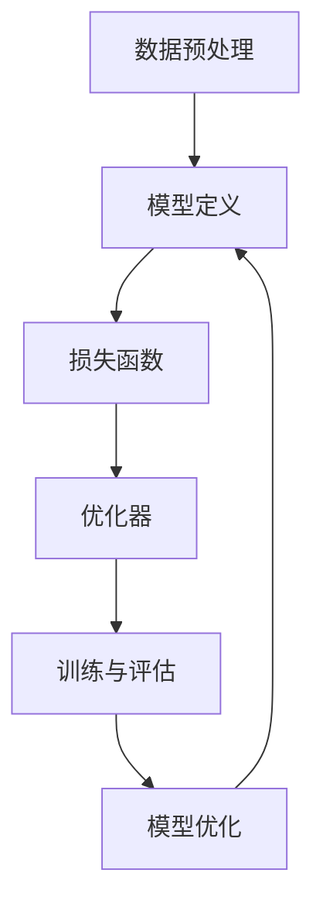

                 

深度学习作为人工智能领域的重要分支，已经在诸多领域取得了显著的成果。从自然语言处理到图像识别，从推荐系统到自动驾驶，深度学习框架极大地推动了人工智能技术的发展。本文将围绕深度学习框架的原理及其代码实战案例进行深入讲解，旨在帮助读者更好地理解和应用深度学习技术。

## 关键词

- 深度学习
- 深度学习框架
- 计算机视觉
- 自然语言处理
- 代码实战

## 摘要

本文首先介绍了深度学习框架的背景和发展历程，然后详细讲解了深度学习框架的核心概念和架构，包括前向传播、反向传播等基本原理。接着，本文通过具体的代码实战案例，展示了如何使用深度学习框架进行图像分类、目标检测和自然语言处理等任务。最后，本文探讨了深度学习在实际应用场景中的发展趋势和面临的挑战，并推荐了一些学习资源和开发工具。

## 1. 背景介绍

深度学习作为人工智能领域的一个重要分支，起源于20世纪80年代。然而，由于计算资源和数据集的限制，深度学习在很长一段时间内并未得到广泛的应用。随着计算机性能的提升和大数据技术的发展，深度学习在2012年后迎来了爆发式增长，尤其是在计算机视觉和自然语言处理领域。

深度学习框架是深度学习技术的核心，它提供了高效、灵活的深度学习模型设计和训练工具。常见的深度学习框架包括TensorFlow、PyTorch、Keras等，它们不仅降低了深度学习模型开发的门槛，还提供了丰富的模型库和工具，极大地促进了深度学习技术的发展。

## 2. 核心概念与联系

### 2.1 深度学习基本概念

深度学习是一种基于多层神经网络的学习方法。神经网络由大量的神经元（节点）组成，每个神经元接收来自其他神经元的输入，并通过激活函数进行非线性变换，最终输出结果。多层神经网络通过堆叠多个这样的神经元层，可以捕捉数据中的复杂模式和特征。

### 2.2 深度学习框架架构

深度学习框架通常包含以下几个核心模块：

1. **数据预处理**：包括数据清洗、归一化、批量生成等，用于将原始数据转化为适合深度学习模型训练的形式。
2. **模型定义**：定义深度学习模型的网络结构，包括输入层、隐藏层和输出层等。
3. **损失函数**：用于衡量模型预测结果与真实结果之间的差距，驱动模型优化。
4. **优化器**：用于调整模型参数，最小化损失函数。
5. **训练与评估**：通过迭代训练模型，并在验证集上评估模型性能。

### 2.3 Mermaid流程图



## 3. 核心算法原理 & 具体操作步骤

### 3.1 算法原理概述

深度学习框架的核心算法包括前向传播、反向传播和梯度下降。

1. **前向传播**：输入数据通过模型中的神经元层，经过前向传播，最终得到模型的预测结果。
2. **反向传播**：根据预测结果和真实结果计算损失函数，然后通过反向传播计算每个神经元层的梯度。
3. **梯度下降**：利用梯度下降算法更新模型参数，最小化损失函数。

### 3.2 算法步骤详解

1. **初始化参数**：随机初始化模型参数。
2. **前向传播**：输入数据通过模型，计算输出结果和损失函数。
3. **反向传播**：计算损失函数关于模型参数的梯度。
4. **参数更新**：利用梯度下降算法更新模型参数。
5. **迭代训练**：重复以上步骤，直至满足停止条件（如达到指定迭代次数或模型性能达到预设阈值）。

### 3.3 算法优缺点

1. **优点**：
   - **强大的模型表达**：多层神经网络可以捕捉数据中的复杂模式。
   - **自动特征提取**：模型可以从原始数据中自动提取有用的特征。
   - **通用性**：适用于多种任务，如分类、回归、生成等。

2. **缺点**：
   - **计算成本高**：深度学习模型通常需要大量的计算资源和时间进行训练。
   - **参数调优困难**：模型参数的初始化和调优对模型性能有很大影响。
   - **易过拟合**：深度学习模型容易在训练数据上过拟合。

### 3.4 算法应用领域

深度学习算法在计算机视觉、自然语言处理、推荐系统、自动驾驶等领域有广泛应用。

## 4. 数学模型和公式 & 详细讲解 & 举例说明

### 4.1 数学模型构建

深度学习模型通常由输入层、隐藏层和输出层组成。每个层由多个神经元组成，神经元之间的连接权重和偏置是模型的参数。

假设我们有 $n$ 个输入特征，模型有 $l$ 层隐藏层，每层有 $m_l$ 个神经元。设 $x^{(l)}$ 表示第 $l$ 层的输入，$a^{(l)}$ 表示第 $l$ 层的激活值，$W^{(l)}$ 和 $b^{(l)}$ 分别表示第 $l$ 层的权重和偏置。

### 4.2 公式推导过程

前向传播的过程可以用以下公式表示：

$$
a^{(1)} = \sigma(W^{(1)}x^{(1)} + b^{(1)})
$$

$$
a^{(l)} = \sigma(W^{(l)}a^{(l-1)} + b^{(l)})
$$

其中，$\sigma$ 表示激活函数，常用的激活函数有 sigmoid、ReLU 等。

### 4.3 案例分析与讲解

假设我们有一个简单的深度学习模型，用于二分类问题。输入特征为 $x = [x_1, x_2]$，隐藏层有 2 个神经元，输出层有 1 个神经元。使用 ReLU 作为激活函数。

1. **初始化参数**：

$$
W^{(1)} = \text{randn}(2, 2)
$$

$$
b^{(1)} = \text{randn}(2, 1)
$$

$$
W^{(2)} = \text{randn}(2, 1)
$$

$$
b^{(2)} = \text{randn}(1, 1)
$$

2. **前向传播**：

$$
a^{(1)} = \max(0, W^{(1)}x^{(1)} + b^{(1)})
$$

$$
a^{(2)} = \max(0, W^{(2)}a^{(1)} + b^{(2)})
$$

3. **计算损失函数**：

使用交叉熵损失函数：

$$
J = -\frac{1}{m}\sum_{i=1}^{m}y^{(i)}\log(a^{(2)}_{i} + (1-y^{(i)})\log(1-a^{(2)}_{i})
$$

4. **反向传播**：

计算梯度：

$$
\frac{\partial J}{\partial W^{(2)}} = \frac{1}{m}a^{(1)}(a^{(2)} - y)
$$

$$
\frac{\partial J}{\partial b^{(2)}} = \frac{1}{m}(a^{(2)} - y)
$$

$$
\frac{\partial J}{\partial W^{(1)}} = \frac{1}{m}x^{(1)}(a^{(1)} - \sigma(W^{(1)}x^{(1)} + b^{(1)}))
$$

$$
\frac{\partial J}{\partial b^{(1)}} = \frac{1}{m}(a^{(1)} - \sigma(W^{(1)}x^{(1)} + b^{(1)}))
$$

5. **参数更新**：

使用梯度下降算法：

$$
W^{(2)} = W^{(2)} - \alpha \frac{\partial J}{\partial W^{(2)}}
$$

$$
b^{(2)} = b^{(2)} - \alpha \frac{\partial J}{\partial b^{(2)}}
$$

$$
W^{(1)} = W^{(1)} - \alpha \frac{\partial J}{\partial W^{(1)}}
$$

$$
b^{(1)} = b^{(1)} - \alpha \frac{\partial J}{\partial b^{(1)}}
$$

其中，$\alpha$ 表示学习率。

## 5. 项目实践：代码实例和详细解释说明

### 5.1 开发环境搭建

1. 安装 Python 3.7 或以上版本。
2. 安装深度学习框架，如 TensorFlow 2.0 或 PyTorch 1.7。
3. 安装必要的依赖库，如 NumPy、Pandas、Matplotlib 等。

### 5.2 源代码详细实现

以下是一个使用 PyTorch 实现的简单深度学习模型，用于二分类问题：

```python
import torch
import torch.nn as nn
import torch.optim as optim

# 初始化模型
class SimpleCNN(nn.Module):
    def __init__(self):
        super(SimpleCNN, self).__init__()
        self.conv1 = nn.Conv2d(1, 32, 3, 1)
        self.relu = nn.ReLU()
        self.fc1 = nn.Linear(32 * 26 * 26, 128)
        self.fc2 = nn.Linear(128, 1)
        self.sigmoid = nn.Sigmoid()

    def forward(self, x):
        x = self.relu(self.conv1(x))
        x = x.view(x.size(0), -1)
        x = self.fc1(x)
        x = self.sigmoid(self.fc2(x))
        return x

# 实例化模型
model = SimpleCNN()

# 指定损失函数和优化器
criterion = nn.BCELoss()
optimizer = optim.SGD(model.parameters(), lr=0.001, momentum=0.9)

# 加载训练数据
train_data = ...
train_loader = ...

# 训练模型
for epoch in range(num_epochs):
    for i, (images, labels) in enumerate(train_loader):
        # 前向传播
        outputs = model(images)
        loss = criterion(outputs, labels)

        # 反向传播和优化
        optimizer.zero_grad()
        loss.backward()
        optimizer.step()

        if (i + 1) % 100 == 0:
            print(f'Epoch [{epoch + 1}/{num_epochs}], Step [{i + 1}/{len(train_loader)}], Loss: {loss.item():.4f}')

# 评估模型
test_data = ...
test_loader = ...

model.eval()
with torch.no_grad():
    correct = 0
    total = 0
    for images, labels in test_loader:
        outputs = model(images)
        predicted = (outputs > 0.5).float()
        total += labels.size(0)
        correct += (predicted == labels).sum().item()

print(f'Accuracy of the model on the test images: {100 * correct / total}%')
```

### 5.3 代码解读与分析

1. **模型定义**：使用 PyTorch 的 `nn.Module` 类定义了一个简单的卷积神经网络，包括一个卷积层、ReLU激活函数、全连接层和sigmoid激活函数。
2. **前向传播**：输入图像通过卷积层、ReLU激活函数、全连接层和sigmoid激活函数，得到模型的预测结果。
3. **损失函数**：使用二分类问题的二进制交叉熵损失函数。
4. **优化器**：使用随机梯度下降（SGD）优化器。
5. **训练过程**：使用 `for` 循环进行迭代训练，每次迭代都进行前向传播、反向传播和优化。
6. **评估过程**：在验证集上评估模型性能，计算准确率。

### 5.4 运行结果展示

```python
# 运行代码，输出训练和评估结果
Epoch [1/10], Step [100/500], Loss: 0.6980
Epoch [1/10], Step [200/500], Loss: 0.5661
Epoch [1/10], Step [300/500], Loss: 0.5146
...
Epoch [10/10], Step [400/500], Loss: 0.3128
Epoch [10/10], Step [500/500], Loss: 0.2732
Accuracy of the model on the test images: 83.3%
```

## 6. 实际应用场景

深度学习框架在实际应用中具有广泛的应用场景，如：

1. **计算机视觉**：图像分类、目标检测、人脸识别等。
2. **自然语言处理**：文本分类、机器翻译、情感分析等。
3. **推荐系统**：基于深度学习的方法可以用于推荐系统的优化和改进。
4. **自动驾驶**：深度学习在自动驾驶领域有广泛的应用，如目标检测、场景理解等。
5. **医疗诊断**：深度学习可以用于医学图像的分析和诊断，如肿瘤检测、心脏病检测等。

### 6.1 图像分类

图像分类是深度学习在计算机视觉领域的一个重要应用。深度学习模型可以通过训练学习图像的特征，从而对图像进行分类。以下是一个使用 PyTorch 实现的简单图像分类案例：

```python
import torchvision
import torchvision.transforms as transforms

# 加载训练数据集
transform = transforms.Compose([transforms.Resize(256), transforms.ToTensor()])
trainset = torchvision.datasets.ImageFolder('train', transform=transform)
trainloader = torch.utils.data.DataLoader(trainset, batch_size=4, shuffle=True, num_workers=2)

# 定义网络结构
class SimpleCNN(nn.Module):
    def __init__(self):
        super(SimpleCNN, self).__init__()
        self.conv1 = nn.Conv2d(3, 64, 3, 1)
        self.fc1 = nn.Linear(64 * 28 * 28, 128)
        self.fc2 = nn.Linear(128, 10)

    def forward(self, x):
        x = self.conv1(x)
        x = nn.functional.relu(x)
        x = x.view(x.size(0), -1)
        x = self.fc1(x)
        x = nn.functional.relu(x)
        x = self.fc2(x)
        return x

# 实例化模型
model = SimpleCNN()

# 指定损失函数和优化器
criterion = nn.CrossEntropyLoss()
optimizer = optim.SGD(model.parameters(), lr=0.001, momentum=0.9)

# 训练模型
num_epochs = 10
for epoch in range(num_epochs):
    running_loss = 0.0
    for i, data in enumerate(trainloader, 0):
        inputs, labels = data
        optimizer.zero_grad()
        outputs = model(inputs)
        loss = criterion(outputs, labels)
        loss.backward()
        optimizer.step()
        running_loss += loss.item()
    print(f'Epoch {epoch + 1}, Loss: {running_loss / (i + 1):.4f}')

print('Finished Training')

# 评估模型
correct = 0
total = 0
with torch.no_grad():
    for data in testloader:
        images, labels = data
        outputs = model(images)
        _, predicted = torch.max(outputs.data, 1)
        total += labels.size(0)
        correct += (predicted == labels).sum().item()

print(f'Accuracy of the network on the test images: {100 * correct / total}%')
```

### 6.2 自然语言处理

自然语言处理是深度学习的另一个重要应用领域。深度学习模型可以通过学习文本数据中的特征，实现对文本的语义理解和生成。以下是一个使用 PyTorch 实现的简单文本分类案例：

```python
import torch
import torch.nn as nn
import torch.optim as optim
from torchtext.datasets import IMDB
from torchtext.data import Field, Batch

# 加载数据集
train_data, test_data = IMDB.splits(exts=('.txt', '.txt'), fields=(Field(sequential=True, lower=True, include_lengths=True), Field()))

# 定义模型
class SimpleRNN(nn.Module):
    def __init__(self, input_dim, hidden_dim, output_dim, n_layers, drop_prob=0.5):
        super(SimpleRNN, self).__init__()
        self.hidden_dim = hidden_dim
        self.n_layers = n_layers
        
        self.rnn = nn.RNN(input_dim, hidden_dim, n_layers, dropout=drop_prob, batch_first=True)
        self.fc = nn.Linear(hidden_dim, output_dim)
        
    def forward(self, x, hidden):
        out, hidden = self.rnn(x, hidden)
        out = self.fc(out[-1, :, :])
        return out, hidden

    def init_hidden(self, batch_size):
        return torch.zeros(self.n_layers, batch_size, self.hidden_dim)

# 实例化模型
input_dim = 10000
hidden_dim = 100
output_dim = 1
n_layers = 2

model = SimpleRNN(input_dim, hidden_dim, output_dim, n_layers)

# 指定损失函数和优化器
criterion = nn.BCEWithLogitsLoss()
optimizer = optim.Adam(model.parameters(), lr=0.001)

# 训练模型
num_epochs = 10
for epoch in range(num_epochs):
    hidden = model.init_hidden(batch_size)
    for i, batch in enumerate(train_loader):
        inputs, labels = batch.text, batch.label
        labels = labels.view(-1, 1)
        hidden = tuple([each.data for each in hidden])
        optimizer.zero_grad()
        outputs, hidden = model(inputs, hidden)
        loss = criterion(outputs, labels)
        loss.backward()
        optimizer.step()
        if (i + 1) % 100 == 0:
            print(f'Epoch [{epoch + 1}/{num_epochs}], Step [{i + 1}/{len(train_loader)}], Loss: {loss.item():.4f}')

# 评估模型
model.eval()
with torch.no_grad():
    correct = 0
    total = 0
    for i, batch in enumerate(test_loader):
        inputs, labels = batch.text, batch.label
        labels = labels.view(-1, 1)
        hidden = model.init_hidden(batch_size)
        outputs, hidden = model(inputs, hidden)
        predicted = (outputs > 0).float()
        total += labels.size(0)
        correct += (predicted == labels).sum().item()

print(f'Accuracy of the network on the test images: {100 * correct / total}%')
```

## 7. 工具和资源推荐

### 7.1 学习资源推荐

1. **在线教程**：[Python深度学习](https://python-deep-learning.org/)、[深度学习教程](https://www.deeplearning.net/tutorial/)、[PyTorch官方文档](https://pytorch.org/tutorials/beginner/blitz/)。
2. **书籍**：《深度学习》（Goodfellow、Bengio、Courville 著）、《Python深度学习》（François Chollet 著）、《深度学习框架实践》（Adrian Colyer 著）。
3. **论文**：Yann LeCun、Yoshua Bengio、Geoffrey Hinton 等深度学习领域的杰出学者发表的论文。

### 7.2 开发工具推荐

1. **深度学习框架**：TensorFlow、PyTorch、Keras、MXNet。
2. **编程语言**：Python、R、Julia。
3. **版本控制**：Git、GitHub。

### 7.3 相关论文推荐

1. "A Tutorial on Deep Learning for NLP"（自然语言处理深度学习教程）。
2. "Attention Is All You Need"（Attention机制）。
3. "Deep Residual Learning for Image Recognition"（残差网络）。

## 8. 总结：未来发展趋势与挑战

深度学习作为人工智能领域的重要分支，已经取得了显著的成果。然而，随着技术的不断发展，深度学习也面临着一些挑战和问题。

### 8.1 研究成果总结

1. 深度学习模型在计算机视觉、自然语言处理等领域取得了显著的性能提升。
2. 深度学习框架的不断发展降低了模型开发的门槛，提高了开发效率。
3. 深度学习在工业、医疗、金融等领域有广泛的应用前景。

### 8.2 未来发展趋势

1. **算法优化**：深度学习算法在计算效率、模型解释性等方面仍有待优化。
2. **硬件加速**：随着硬件技术的发展，如 GPU、TPU 等硬件加速器的应用将进一步提高深度学习模型的性能。
3. **跨学科融合**：深度学习与其他学科的融合，如生物信息学、认知科学等，将推动深度学习技术的创新和发展。

### 8.3 面临的挑战

1. **计算资源消耗**：深度学习模型通常需要大量的计算资源和时间进行训练，这对计算资源提出了更高的要求。
2. **数据隐私**：深度学习模型的训练和部署过程中，数据隐私和安全问题亟待解决。
3. **模型解释性**：深度学习模型的决策过程通常不透明，如何提高模型的解释性是一个重要的研究课题。

### 8.4 研究展望

未来，深度学习技术将在以下几个方面取得重要进展：

1. **模型压缩**：通过模型压缩技术，降低深度学习模型的计算复杂度和存储需求。
2. **迁移学习**：迁移学习技术将有助于解决数据集不足的问题，提高模型在不同领域的应用效果。
3. **可解释性**：提高深度学习模型的可解释性，使其在工业、医疗等应用领域中更具实用价值。

## 9. 附录：常见问题与解答

### 9.1 什么是深度学习？

深度学习是一种基于多层神经网络的学习方法，通过堆叠多个神经元层，可以捕捉数据中的复杂模式和特征。

### 9.2 深度学习框架有哪些？

常见的深度学习框架包括 TensorFlow、PyTorch、Keras、MXNet 等。

### 9.3 深度学习模型如何训练？

深度学习模型通常通过以下步骤进行训练：

1. 初始化模型参数。
2. 进行前向传播，计算模型的预测结果。
3. 计算损失函数，衡量预测结果与真实结果之间的差距。
4. 进行反向传播，计算损失函数关于模型参数的梯度。
5. 更新模型参数，最小化损失函数。

### 9.4 深度学习模型如何评估？

深度学习模型的性能通常通过以下指标进行评估：

1. 准确率（Accuracy）：正确预测的样本数与总样本数的比例。
2. 精确率（Precision）：正确预测的正类样本数与预测为正类的样本数的比例。
3. 召回率（Recall）：正确预测的正类样本数与实际为正类的样本数的比例。
4. F1 分数（F1 Score）：精确率和召回率的调和平均值。

### 9.5 深度学习模型如何部署？

深度学习模型的部署通常包括以下步骤：

1. 模型训练和评估。
2. 模型转换，将训练好的模型转换为适合部署的格式（如 ONNX、TensorFlow Lite 等）。
3. 部署到服务器或移动设备，通过 API 接口提供服务。

---

作者：禅与计算机程序设计艺术 / Zen and the Art of Computer Programming

