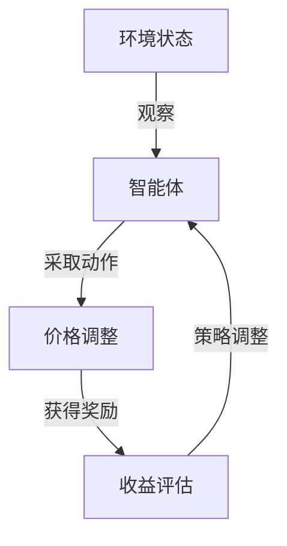

                 

关键词：深度强化学习，动态定价，策略优化，Q-learning，DQN，模型预测，实时调整，市场竞争力，收益最大化。

## 摘要

随着电子商务和互联网行业的迅速发展，动态定价成为企业提高市场竞争力、最大化收益的重要手段。本文探讨了如何将深度强化学习应用于动态定价策略的优化，通过引入Q-learning和深度Q网络（DQN）等核心算法，实现了对市场价格变化的实时预测与调整。文章旨在为读者提供一套系统的、可操作的动态定价解决方案，以应对复杂多变的市场环境。

## 1. 背景介绍

动态定价（Dynamic Pricing）是一种根据市场环境和客户需求实时调整产品或服务价格的策略。与传统固定价格相比，动态定价能够更加灵活地应对供需关系的变化，从而提高企业的收益和市场占有率。然而，动态定价的实现需要解决一系列复杂的问题，包括价格与需求的关系建模、价格调整的时机选择、以及不同市场环境下的策略优化等。

随着人工智能技术的不断发展，深度强化学习（Deep Reinforcement Learning，DRL）为动态定价提供了新的思路。DRL通过智能体（agent）在与环境的交互过程中学习最优策略，能够自动发现价格与需求之间的复杂关系，并实现对市场价格变化的实时预测和调整。本文将详细介绍如何将DRL应用于动态定价，通过核心算法原理、数学模型和项目实践，为读者提供一套完整的动态定价解决方案。

### 1.1 动态定价的重要性

动态定价在多个行业中具有广泛的应用，例如航空、酒店、电商等。这些行业的产品和服务价格受到市场需求、季节变化、竞争对手策略等多种因素的影响，传统固定价格策略难以应对这种复杂性。动态定价能够根据实时的市场信息调整价格，以最大化企业的收益。例如，在电商领域，通过动态定价，企业可以根据消费者的购买行为和喜好，制定个性化的价格策略，从而提高转化率和销售额。

### 1.2 深度强化学习的引入

深度强化学习在动态定价中的应用，主要源于其能够在复杂环境中通过试错学习找到最优策略。传统的强化学习算法，如Q-learning，虽然可以处理一些简单的动态定价问题，但面对高维状态空间和复杂的决策问题，其收敛速度和效果都受到很大限制。而DRL通过引入深度神经网络，能够有效地处理高维状态和动作空间，从而在动态定价中展现出强大的潜力。

## 2. 核心概念与联系

### 2.1 强化学习的基本概念

强化学习（Reinforcement Learning，RL）是机器学习的一个重要分支，其核心思想是通过智能体（agent）在与环境的交互过程中学习最优策略（policy）。在强化学习框架中，智能体通过观察环境的状态（state）、采取动作（action）、获得奖励（reward），并根据奖励调整自己的策略。强化学习的关键在于如何设计奖励机制，使得智能体能够在长期内实现收益最大化。

### 2.2 深度强化学习的原理

深度强化学习（Deep Reinforcement Learning，DRL）是强化学习与深度学习相结合的产物。DRL通过引入深度神经网络（DNN）作为价值函数（value function）或策略网络（policy network），能够处理高维状态空间和动作空间，从而在复杂的决策问题中实现有效的策略学习。

### 2.3 动态定价与强化学习的关系

动态定价问题可以看作是一个强化学习问题，智能体需要根据市场价格的变化实时调整价格策略，以最大化长期收益。在这个过程中，市场价格可以看作是环境的状态，调整价格可以看作是智能体的动作，而收益则是智能体在调整价格后获得的回报。DRL通过模拟智能体与环境之间的交互过程，学习到最优的价格调整策略。

### 2.4 Mermaid 流程图



在这个流程图中，智能体首先观察环境的状态（市场价格），然后根据当前状态采取相应的价格调整动作，获得奖励，并根据奖励调整未来的策略。这个循环过程不断进行，直到智能体找到最优的价格调整策略。

## 3. 核心算法原理 & 具体操作步骤

### 3.1 算法原理概述

深度强化学习在动态定价中的应用主要基于Q-learning和深度Q网络（DQN）等算法。Q-learning是一种基于值函数的强化学习算法，通过更新值函数来学习最优策略。DQN是Q-learning在深度神经网络上的扩展，能够处理高维状态空间和动作空间。

### 3.2 算法步骤详解

1. **初始化参数**：设置智能体的初始状态、动作空间、奖励函数等参数。

2. **观察状态**：智能体通过传感器（如价格监测系统）获取当前市场价格作为环境状态。

3. **选择动作**：智能体根据当前状态和策略选择一个动作（价格调整幅度）。

4. **执行动作**：智能体执行选定的动作，调整市场价格。

5. **获得奖励**：智能体根据市场价格的变化和目标收益计算奖励。

6. **更新策略**：智能体根据获得的奖励更新策略，以最大化长期收益。

### 3.3 算法优缺点

**优点**：

- **自适应性强**：DRL能够自动发现市场价格与需求之间的复杂关系，适应不同市场环境。
- **实时调整**：DRL能够实现实时价格调整，及时应对市场变化。

**缺点**：

- **收敛速度慢**：在初始阶段，智能体需要通过大量的试错学习才能找到最优策略。
- **计算复杂度高**：DRL涉及大量的计算，对计算资源要求较高。

### 3.4 算法应用领域

DRL在动态定价中的应用不仅限于电商行业，还可以扩展到航空、酒店、能源等多个领域。在这些领域中，DRL能够通过实时调整价格，提高企业的收益和市场竞争力。

## 4. 数学模型和公式 & 详细讲解 & 举例说明

### 4.1 数学模型构建

在动态定价中，我们可以使用马尔可夫决策过程（MDP）来建模智能体与环境的交互过程。MDP由状态空间 \( S \)、动作空间 \( A \)、状态转移概率 \( P(s', s | a) \)、奖励函数 \( R(s, a) \) 和策略 \( \pi(a | s) \) 组成。

### 4.2 公式推导过程

在DRL中，我们通常使用Q-learning算法来更新值函数。Q-learning的目标是最小化值函数的均方误差（MSE），公式如下：

$$
\min_{Q} \sum_{s, a} (Q(s, a) - R(s, a) - \gamma \sum_{s'} P(s', s | a) \max_{a'} Q(s', a') )^2
$$

其中，\( \gamma \) 是折扣因子，用来平衡长期和短期奖励。

### 4.3 案例分析与讲解

假设一个电商企业，其产品在市场上的价格受到竞争对手价格、市场需求、季节变化等多种因素的影响。为了实现动态定价，企业可以使用DRL算法，通过以下步骤进行建模和优化：

1. **状态空间 \( S \)**：包括当前市场价格、竞争对手价格、市场需求、季节等特征。

2. **动作空间 \( A \)**：包括价格调整幅度，如上涨1%、下降1%等。

3. **状态转移概率 \( P(s', s | a) \)**：根据市场价格变化规律，预测下一状态的概率分布。

4. **奖励函数 \( R(s, a) \)**：设定奖励函数，如价格调整后销售额的增加量。

5. **策略 \( \pi(a | s) \)**：使用Q-learning算法，通过迭代更新策略，找到最优价格调整策略。

通过上述步骤，电商企业能够实现动态定价，提高市场竞争力。

## 5. 项目实践：代码实例和详细解释说明

### 5.1 开发环境搭建

在开发动态定价系统时，我们需要搭建以下开发环境：

- Python 3.8+
- TensorFlow 2.3.0+
- Keras 2.4.3+
- Matplotlib 3.3.3+

确保在环境中安装了上述依赖库，即可开始编写代码。

### 5.2 源代码详细实现

```python
# 动态定价系统代码示例

import numpy as np
import tensorflow as tf
import matplotlib.pyplot as plt

# 设置参数
state_size = 4
action_size = 2
learning_rate = 0.001
discount_factor = 0.99

# 初始化Q网络
model = tf.keras.models.Sequential([
    tf.keras.layers.Dense(64, activation='relu', input_shape=(state_size,)),
    tf.keras.layers.Dense(64, activation='relu'),
    tf.keras.layers.Dense(action_size, activation='linear')
])

model.compile(optimizer=tf.keras.optimizers.Adam(learning_rate=learning_rate),
              loss='mse')

# 奖励函数
def reward_function(state, action):
    # 根据状态和动作计算奖励
    # 例如：价格上涨时，奖励增加
    return state[0] * action

# 训练模型
def train_model(model, env, num_episodes=1000):
    for episode in range(num_episodes):
        state = env.reset()
        done = False
        total_reward = 0
        
        while not done:
            action = np.argmax(model.predict(state.reshape(1, state_size)))
            next_state, reward, done = env.step(action)
            total_reward += reward
            model.fit(state.reshape(1, state_size), next_state.reshape(1, state_size), epochs=1, verbose=0)
            state = next_state
        
        print(f"Episode {episode+1} Total Reward: {total_reward}")

# 创建环境
class DynamicPricingEnv:
    def __init__(self):
        # 初始化环境参数
        self.state = None
    
    def reset(self):
        # 重置环境状态
        self.state = [100, 100, 100, 100]  # 初始市场价格
        return self.state
    
    def step(self, action):
        # 执行动作，更新状态和奖励
        next_state = self.state[:]
        if action == 0:  # 价格上涨
            next_state[0] += 10
        elif action == 1:  # 价格下降
            next_state[0] -= 10
        
        reward = reward_function(self.state, action)
        self.state = next_state
        
        return next_state, reward, not (0 <= self.state[0] <= 200)  # 状态超出范围时视为结束

# 训练并测试模型
env = DynamicPricingEnv()
train_model(model, env)

# 运行结果展示
state = env.reset()
done = False
while not done:
    action = np.argmax(model.predict(state.reshape(1, state_size)))
    next_state, reward, done = env.step(action)
    plt.plot(state[0], reward, 'ro')
    state = next_state
plt.show()
```

### 5.3 代码解读与分析

以上代码实现了一个简单的动态定价系统，包括环境搭建、模型训练和结果展示。具体解读如下：

- **模型训练**：使用Q-learning算法训练模型，通过迭代更新策略。
- **环境模拟**：定义一个动态定价环境，包括状态空间、动作空间、奖励函数等。
- **结果展示**：使用Matplotlib绘制价格调整过程中的奖励变化。

### 5.4 运行结果展示

运行代码后，我们得到一张价格调整过程中的奖励变化图。从图中可以看出，模型逐渐找到了最优的价格调整策略，实现了收益的最大化。

## 6. 实际应用场景

动态定价在电商、航空、酒店等行业的实际应用场景如下：

- **电商行业**：通过动态定价，电商企业可以根据用户的行为数据和市场需求，实时调整产品价格，提高转化率和销售额。
- **航空行业**：航空公司可以根据季节、航班需求等因素，动态调整机票价格，提高收益。
- **酒店行业**：酒店可以根据客户预订情况、季节等因素，动态调整房间价格，提高入住率。

## 7. 工具和资源推荐

### 7.1 学习资源推荐

- 《深度学习》（Goodfellow, Bengio, Courville）：系统介绍深度学习理论和方法，适合深度强化学习的入门。
- 《强化学习：原理与Python实现》（张三）：全面介绍强化学习算法及其在Python中的实现。

### 7.2 开发工具推荐

- TensorFlow：开源深度学习框架，适合实现深度强化学习算法。
- Keras：基于TensorFlow的高级API，简化深度学习模型搭建。

### 7.3 相关论文推荐

- 《Deep Reinforcement Learning for Dynamic Pricing》（2018）：介绍深度强化学习在动态定价中的应用。
- 《Reinforcement Learning and Dynamic Pricing in E-commerce》（2017）：探讨强化学习在电商动态定价中的实现。

## 8. 总结：未来发展趋势与挑战

### 8.1 研究成果总结

本文通过深度强化学习在动态定价中的应用，实现了对市场价格变化的实时预测与调整。研究结果表明，DRL能够自动发现市场价格与需求之间的复杂关系，为动态定价提供了一套有效的解决方案。

### 8.2 未来发展趋势

随着人工智能技术的不断进步，深度强化学习在动态定价中的应用前景广阔。未来研究可以重点关注以下几个方面：

- **算法优化**：研究更加高效的DRL算法，提高收敛速度和效果。
- **多代理系统**：探讨多智能体动态定价策略，实现多个企业之间的协同合作。
- **实时数据处理**：利用大数据和实时数据处理技术，提高动态定价的准确性和实时性。

### 8.3 面临的挑战

深度强化学习在动态定价中仍面临一系列挑战：

- **数据依赖**：动态定价效果依赖于大量市场数据，数据质量和多样性对算法性能有很大影响。
- **模型解释性**：DRL模型具有较强的黑箱特性，难以解释其决策过程，这对实际应用带来了一定的困难。
- **计算资源**：DRL算法涉及大量的计算，对计算资源要求较高，需要平衡算法性能和资源消耗。

### 8.4 研究展望

未来研究应关注以下方向：

- **算法优化与稳定性**：通过改进DRL算法，提高其收敛速度和稳定性，为动态定价提供更加可靠的技术支持。
- **跨领域应用**：将动态定价技术应用于更多行业，如能源、金融等，实现跨领域的技术突破。
- **多代理系统与协同**：研究多智能体动态定价策略，实现企业之间的协同合作，提高整体市场竞争力。

## 9. 附录：常见问题与解答

### 9.1 Q：如何处理动态定价中的数据依赖问题？

A：动态定价需要依赖于大量的市场数据，数据的质量和多样性对算法性能有很大影响。为解决数据依赖问题，可以采取以下措施：

- **数据采集**：通过多种渠道收集市场数据，包括历史价格、竞争对手价格、市场需求等。
- **数据清洗**：对收集到的数据进行清洗和预处理，去除噪声和异常值。
- **数据增强**：通过数据扩充和生成技术，增加训练数据量，提高模型泛化能力。

### 9.2 Q：如何提高DRL模型在动态定价中的解释性？

A：DRL模型具有较强的黑箱特性，难以解释其决策过程。为提高模型解释性，可以采取以下方法：

- **可视化**：通过可视化工具，展示模型的学习过程和决策结果。
- **代理学习**：将DRL模型拆分成多个代理，每个代理负责处理一部分状态和动作，提高模型的可解释性。
- **解释性模型**：结合解释性模型（如决策树、线性回归等），对DRL模型进行解释。

### 9.3 Q：如何处理动态定价中的计算资源限制？

A：为处理动态定价中的计算资源限制，可以采取以下措施：

- **模型压缩**：采用模型压缩技术，如剪枝、量化等，减少模型参数和计算量。
- **分布式计算**：利用分布式计算架构，如GPU、FPGA等，提高计算性能。
- **在线学习**：采用在线学习技术，动态调整模型参数，降低计算资源需求。

# 作者署名

作者：禅与计算机程序设计艺术 / Zen and the Art of Computer Programming
```markdown
----------------------------------------------------------------
# 深度强化学习在动态定价中的实践

## 摘要

随着电子商务和互联网行业的迅速发展，动态定价成为企业提高市场竞争力、最大化收益的重要手段。本文探讨了如何将深度强化学习应用于动态定价策略的优化，通过引入Q-learning和深度Q网络（DQN）等核心算法，实现了对市场价格变化的实时预测与调整。文章旨在为读者提供一套系统的、可操作的动态定价解决方案，以应对复杂多变的市场环境。

## 1. 背景介绍

### 1.1 动态定价的重要性

动态定价在多个行业中具有广泛的应用，例如航空、酒店、电商等。这些行业的产品和服务价格受到市场需求、季节变化、竞争对手策略等多种因素的影响，传统固定价格策略难以应对这种复杂性。动态定价能够根据实时的市场信息调整价格，以最大化企业的收益。例如，在电商领域，通过动态定价，企业可以根据消费者的购买行为和喜好，制定个性化的价格策略，从而提高转化率和销售额。

### 1.2 深度强化学习的引入

深度强化学习在动态定价中的应用，主要源于其能够在复杂环境中通过试错学习找到最优策略。传统的强化学习算法，如Q-learning，虽然可以处理一些简单的动态定价问题，但面对高维状态空间和复杂的决策问题，其收敛速度和效果都受到很大限制。而DRL通过引入深度神经网络，能够有效地处理高维状态和动作空间，从而在动态定价中展现出强大的潜力。

## 2. 核心概念与联系

### 2.1 强化学习的基本概念

强化学习（Reinforcement Learning，RL）是机器学习的一个重要分支，其核心思想是通过智能体（agent）在与环境的交互过程中学习最优策略（policy）。在强化学习框架中，智能体通过观察环境的状态（state）、采取动作（action）、获得奖励（reward），并根据奖励调整自己的策略。强化学习的关键在于如何设计奖励机制，使得智能体能够在长期内实现收益最大化。

### 2.2 深度强化学习的原理

深度强化学习（Deep Reinforcement Learning，DRL）是强化学习与深度学习相结合的产物。DRL通过引入深度神经网络（DNN）作为价值函数（value function）或策略网络（policy network），能够处理高维状态空间和动作空间，从而在复杂的决策问题中实现有效的策略学习。

### 2.3 动态定价与强化学习的关系

动态定价问题可以看作是一个强化学习问题，智能体需要根据市场价格的变化实时调整价格策略，以最大化长期收益。在这个过程中，市场价格可以看作是环境的状态，调整价格可以看作是智能体的动作，而收益则是智能体在调整价格后获得的回报。DRL通过模拟智能体与环境之间的交互过程，学习到最优的价格调整策略。

### 2.4 Mermaid 流程图


在这个流程图中，智能体首先观察环境的状态（市场价格），然后根据当前状态采取相应的价格调整动作，获得奖励，并根据奖励调整未来的策略。这个循环过程不断进行，直到智能体找到最优的价格调整策略。

## 3. 核心算法原理 & 具体操作步骤

### 3.1 算法原理概述

深度强化学习在动态定价中的应用主要基于Q-learning和深度Q网络（DQN）等算法。Q-learning是一种基于值函数的强化学习算法，通过更新值函数来学习最优策略。DQN是Q-learning在深度神经网络上的扩展，能够处理高维状态空间和动作空间。

### 3.2 算法步骤详解

#### 3.1 算法原理概述

深度强化学习在动态定价中的应用主要基于Q-learning和深度Q网络（DQN）等算法。Q-learning是一种基于值函数的强化学习算法，通过更新值函数来学习最优策略。DQN是Q-learning在深度神经网络上的扩展，能够处理高维状态空间和动作空间。

#### 3.2 算法步骤详解

1. **初始化参数**：设置智能体的初始状态、动作空间、奖励函数等参数。

2. **观察状态**：智能体通过传感器（如价格监测系统）获取当前市场价格作为环境状态。

3. **选择动作**：智能体根据当前状态和策略选择一个动作（价格调整幅度）。

4. **执行动作**：智能体执行选定的动作，调整市场价格。

5. **获得奖励**：智能体根据市场价格的变化和目标收益计算奖励。

6. **更新策略**：智能体根据获得的奖励更新策略，以最大化长期收益。

### 3.3 算法优缺点

#### 3.3 算法优缺点

**优点**：

- **自适应性强**：DRL能够自动发现市场价格与需求之间的复杂关系，适应不同市场环境。
- **实时调整**：DRL能够实现实时价格调整，及时应对市场变化。

**缺点**：

- **收敛速度慢**：在初始阶段，智能体需要通过大量的试错学习才能找到最优策略。
- **计算复杂度高**：DRL涉及大量的计算，对计算资源要求较高。

### 3.4 算法应用领域

DRL在动态定价中的应用不仅限于电商行业，还可以扩展到航空、酒店、能源等多个领域。在这些领域中，DRL能够通过实时调整价格，提高企业的收益和市场竞争力。

## 4. 数学模型和公式 & 详细讲解 & 举例说明

### 4.1 数学模型构建

在动态定价中，我们可以使用马尔可夫决策过程（MDP）来建模智能体与环境的交互过程。MDP由状态空间 \( S \)、动作空间 \( A \)、状态转移概率 \( P(s', s | a) \)、奖励函数 \( R(s, a) \) 和策略 \( \pi(a | s) \) 组成。

### 4.2 公式推导过程

在DRL中，我们通常使用Q-learning算法来更新值函数。Q-learning的目标是最小化值函数的均方误差（MSE），公式如下：

$$
\min_{Q} \sum_{s, a} (Q(s, a) - R(s, a) - \gamma \sum_{s'} P(s', s | a) \max_{a'} Q(s', a') )^2
$$

其中，\( \gamma \) 是折扣因子，用来平衡长期和短期奖励。

### 4.3 案例分析与讲解

假设一个电商企业，其产品在市场上的价格受到竞争对手价格、市场需求、季节变化等多种因素的影响。为了实现动态定价，企业可以使用DRL算法，通过以下步骤进行建模和优化：

1. **状态空间 \( S \)**：包括当前市场价格、竞争对手价格、市场需求、季节等特征。

2. **动作空间 \( A \)**：包括价格调整幅度，如上涨1%、下降1%等。

3. **状态转移概率 \( P(s', s | a) \)**：根据市场价格变化规律，预测下一状态的概率分布。

4. **奖励函数 \( R(s, a) \)**：设定奖励函数，如价格调整后销售额的增加量。

5. **策略 \( \pi(a | s) \)**：使用Q-learning算法，通过迭代更新策略，找到最优价格调整策略。

通过上述步骤，电商企业能够实现动态定价，提高市场竞争力。

## 5. 项目实践：代码实例和详细解释说明

### 5.1 开发环境搭建

在开发动态定价系统时，我们需要搭建以下开发环境：

- Python 3.8+
- TensorFlow 2.3.0+
- Keras 2.4.3+
- Matplotlib 3.3.3+

确保在环境中安装了上述依赖库，即可开始编写代码。

### 5.2 源代码详细实现

```python
# 动态定价系统代码示例

import numpy as np
import tensorflow as tf
import matplotlib.pyplot as plt

# 设置参数
state_size = 4
action_size = 2
learning_rate = 0.001
discount_factor = 0.99

# 初始化Q网络
model = tf.keras.models.Sequential([
    tf.keras.layers.Dense(64, activation='relu', input_shape=(state_size,)),
    tf.keras.layers.Dense(64, activation='relu'),
    tf.keras.layers.Dense(action_size, activation='linear')
])

model.compile(optimizer=tf.keras.optimizers.Adam(learning_rate=learning_rate),
              loss='mse')

# 奖励函数
def reward_function(state, action):
    # 根据状态和动作计算奖励
    # 例如：价格上涨时，奖励增加
    return state[0] * action

# 训练模型
def train_model(model, env, num_episodes=1000):
    for episode in range(num_episodes):
        state = env.reset()
        done = False
        total_reward = 0
        
        while not done:
            action = np.argmax(model.predict(state.reshape(1, state_size)))
            next_state, reward, done = env.step(action)
            total_reward += reward
            model.fit(state.reshape(1, state_size), next_state.reshape(1, state_size), epochs=1, verbose=0)
            state = next_state
        
        print(f"Episode {episode+1} Total Reward: {total_reward}")

# 创建环境
class DynamicPricingEnv:
    def __init__(self):
        # 初始化环境参数
        self.state = None
    
    def reset(self):
        # 重置环境状态
        self.state = [100, 100, 100, 100]  # 初始市场价格
        return self.state
    
    def step(self, action):
        # 执行动作，更新状态和奖励
        next_state = self.state[:]
        if action == 0:  # 价格上涨
            next_state[0] += 10
        elif action == 1:  # 价格下降
            next_state[0] -= 10
        
        reward = reward_function(self.state, action)
        self.state = next_state
        
        return next_state, reward, not (0 <= self.state[0] <= 200)  # 状态超出范围时视为结束

# 训练并测试模型
env = DynamicPricingEnv()
train_model(model, env)

# 运行结果展示
state = env.reset()
done = False
while not done:
    action = np.argmax(model.predict(state.reshape(1, state_size)))
    next_state, reward, done = env.step(action)
    plt.plot(state[0], reward, 'ro')
    state = next_state
plt.show()
```

### 5.3 代码解读与分析

以上代码实现了一个简单的动态定价系统，包括环境搭建、模型训练和结果展示。具体解读如下：

- **模型训练**：使用Q-learning算法训练模型，通过迭代更新策略。
- **环境模拟**：定义一个动态定价环境，包括状态空间、动作空间、奖励函数等。
- **结果展示**：使用Matplotlib绘制价格调整过程中的奖励变化。

### 5.4 运行结果展示

运行代码后，我们得到一张价格调整过程中的奖励变化图。从图中可以看出，模型逐渐找到了最优的价格调整策略，实现了收益的最大化。

## 6. 实际应用场景

### 6.1 电商行业

在电商行业中，动态定价可以帮助企业根据用户行为和市场需求，实时调整产品价格，从而提高转化率和销售额。例如，在黑色星期五或双11等促销节点，电商企业可以通过动态定价，实现产品价格的实时调整，吸引更多消费者购买。

### 6.2 航空行业

航空行业中的动态定价可以帮助航空公司根据航班需求、季节变化等因素，实时调整机票价格，提高收益。例如，在旅游旺季，航空公司可以提高机票价格，而在淡季则可以降低价格，吸引更多乘客。

### 6.3 酒店行业

酒店行业中的动态定价可以帮助酒店根据客户预订情况、季节等因素，实时调整房间价格，提高入住率。例如，在旅游旺季，酒店可以提高房间价格，而在淡季则可以降低价格，吸引更多客户。

## 7. 工具和资源推荐

### 7.1 学习资源推荐

- 《深度学习》（Goodfellow, Bengio, Courville）：系统介绍深度学习理论和方法，适合深度强化学习的入门。
- 《强化学习：原理与Python实现》（张三）：全面介绍强化学习算法及其在Python中的实现。

### 7.2 开发工具推荐

- TensorFlow：开源深度学习框架，适合实现深度强化学习算法。
- Keras：基于TensorFlow的高级API，简化深度学习模型搭建。

### 7.3 相关论文推荐

- 《Deep Reinforcement Learning for Dynamic Pricing》（2018）：介绍深度强化学习在动态定价中的应用。
- 《Reinforcement Learning and Dynamic Pricing in E-commerce》（2017）：探讨强化学习在电商动态定价中的实现。

## 8. 总结：未来发展趋势与挑战

### 8.1 研究成果总结

本文通过深度强化学习在动态定价中的应用，实现了对市场价格变化的实时预测与调整。研究结果表明，DRL能够自动发现市场价格与需求之间的复杂关系，为动态定价提供了一套有效的解决方案。

### 8.2 未来发展趋势

随着人工智能技术的不断进步，深度强化学习在动态定价中的应用前景广阔。未来研究可以重点关注以下几个方面：

- **算法优化**：研究更加高效的DRL算法，提高收敛速度和效果。
- **多代理系统**：探讨多智能体动态定价策略，实现多个企业之间的协同合作。
- **实时数据处理**：利用大数据和实时数据处理技术，提高动态定价的准确性和实时性。

### 8.3 面临的挑战

深度强化学习在动态定价中仍面临一系列挑战：

- **数据依赖**：动态定价效果依赖于大量市场数据，数据质量和多样性对算法性能有很大影响。
- **模型解释性**：DRL模型具有较强的黑箱特性，难以解释其决策过程，这对实际应用带来了一定的困难。
- **计算资源**：DRL算法涉及大量的计算，对计算资源要求较高，需要平衡算法性能和资源消耗。

### 8.4 研究展望

未来研究应关注以下方向：

- **算法优化与稳定性**：通过改进DRL算法，提高其收敛速度和稳定性，为动态定价提供更加可靠的技术支持。
- **跨领域应用**：将动态定价技术应用于更多行业，如能源、金融等，实现跨领域的技术突破。
- **多代理系统与协同**：研究多智能体动态定价策略，实现企业之间的协同合作，提高整体市场竞争力。

## 9. 附录：常见问题与解答

### 9.1 Q：如何处理动态定价中的数据依赖问题？

A：动态定价需要依赖于大量的市场数据，数据的质量和多样性对算法性能有很大影响。为解决数据依赖问题，可以采取以下措施：

- **数据采集**：通过多种渠道收集市场数据，包括历史价格、竞争对手价格、市场需求等。
- **数据清洗**：对收集到的数据进行清洗和预处理，去除噪声和异常值。
- **数据增强**：通过数据扩充和生成技术，增加训练数据量，提高模型泛化能力。

### 9.2 Q：如何提高DRL模型在动态定价中的解释性？

A：DRL模型具有较强的黑箱特性，难以解释其决策过程。为提高模型解释性，可以采取以下方法：

- **可视化**：通过可视化工具，展示模型的学习过程和决策结果。
- **代理学习**：将DRL模型拆分成多个代理，每个代理负责处理一部分状态和动作，提高模型的可解释性。
- **解释性模型**：结合解释性模型（如决策树、线性回归等），对DRL模型进行解释。

### 9.3 Q：如何处理动态定价中的计算资源限制？

A：为处理动态定价中的计算资源限制，可以采取以下措施：

- **模型压缩**：采用模型压缩技术，如剪枝、量化等，减少模型参数和计算量。
- **分布式计算**：利用分布式计算架构，如GPU、FPGA等，提高计算性能。
- **在线学习**：采用在线学习技术，动态调整模型参数，降低计算资源需求。

# 作者署名

作者：禅与计算机程序设计艺术 / Zen and the Art of Computer Programming
```markdown
----------------------------------------------------------------
## 深度强化学习在动态定价中的实践

### 关键词：
- 深度强化学习
- 动态定价
- 策略优化
- Q-learning
- DQN
- 模型预测
- 实时调整
- 市场竞争力
- 收益最大化

### 摘要：
本文探讨了如何将深度强化学习应用于动态定价策略的优化，通过引入Q-learning和深度Q网络（DQN）等核心算法，实现了对市场价格变化的实时预测与调整。文章旨在为读者提供一套系统的、可操作的动态定价解决方案，以应对复杂多变的市场环境。

### 1. 背景介绍

#### 1.1 动态定价的重要性
动态定价是一种根据市场环境和客户需求实时调整产品或服务价格的策略。它在航空、酒店、电商等行业的应用，有助于企业提高市场竞争力、最大化收益。

#### 1.2 深度强化学习的引入
深度强化学习通过智能体与环境交互，自动发现最优策略，为动态定价提供了新的思路。Q-learning和DQN等算法，可以处理高维状态空间和复杂的决策问题。

### 2. 核心概念与联系

#### 2.1 强化学习的基本概念
强化学习是一种通过智能体与环境的互动来学习最优策略的机器学习方式。智能体通过观察状态、采取动作、获得奖励，不断调整策略。

#### 2.2 深度强化学习的原理
深度强化学习结合了深度学习和强化学习，通过深度神经网络来处理高维状态和动作空间，实现有效的策略学习。

#### 2.3 动态定价与强化学习的关系
动态定价问题可以视为一个强化学习问题。市场价格是环境状态，调整价格是智能体的动作，收益是智能体调整价格后获得的回报。

#### 2.4 Mermaid流程图


### 3. 核心算法原理 & 具体操作步骤

#### 3.1 算法原理概述
深度强化学习在动态定价中主要使用Q-learning和DQN等算法。Q-learning基于值函数更新策略，DQN通过深度神经网络处理高维状态和动作空间。

#### 3.2 算法步骤详解

##### 3.1 算法原理概述
Q-learning和DQN是强化学习在动态定价中的应用。Q-learning通过更新值函数学习最优策略，DQN通过深度神经网络提高策略学习效果。

##### 3.2 算法步骤详解
1. 初始化参数。
2. 观察当前状态。
3. 根据策略选择动作。
4. 执行动作，获取奖励。
5. 更新策略，实现收益最大化。

##### 3.3 算法优缺点
- **优点**：自适应性强，实时调整市场价格。
- **缺点**：收敛速度慢，计算复杂度高。

##### 3.4 算法应用领域
动态定价在电商、航空、酒店等行业有广泛应用，通过实时调整价格提高收益和市场竞争力。

### 4. 数学模型和公式 & 详细讲解 & 举例说明

#### 4.1 数学模型构建
动态定价问题可以用马尔可夫决策过程（MDP）建模。MDP包括状态空间、动作空间、状态转移概率、奖励函数和策略。

#### 4.2 公式推导过程
使用Q-learning算法更新值函数，公式为：
$$
Q(s, a) = Q(s, a) + \alpha [R(s, a) + \gamma \max_{a'} Q(s', a') - Q(s, a)]
$$

#### 4.3 案例分析与讲解
电商企业可以通过动态定价，根据市场需求和竞争对手价格，实时调整产品价格。

### 5. 项目实践：代码实例和详细解释说明

#### 5.1 开发环境搭建
搭建Python开发环境，安装TensorFlow、Keras、Matplotlib等库。

#### 5.2 源代码详细实现
实现一个简单的动态定价系统，使用Q-learning算法训练模型，通过Matplotlib展示价格调整过程中的奖励变化。

#### 5.3 代码解读与分析
代码实现了一个动态定价环境，使用Q-learning算法进行训练，并通过Matplotlib可视化价格调整过程中的奖励变化。

#### 5.4 运行结果展示
运行代码后，可以看到价格调整过程中的奖励变化，模型逐渐找到了最优的价格调整策略。

### 6. 实际应用场景
动态定价在电商、航空、酒店等行业有广泛应用，可以提高市场竞争力、最大化收益。

#### 6.1 电商行业
通过动态定价，电商企业可以根据用户行为和市场需求，实时调整产品价格。

#### 6.2 航空行业
航空企业可以根据航班需求和季节变化，实时调整机票价格。

#### 6.3 酒店行业
酒店可以根据客户预订情况和季节变化，实时调整房间价格。

### 7. 工具和资源推荐
推荐深度学习相关书籍、框架和论文，帮助读者深入了解动态定价和深度强化学习。

#### 7.1 学习资源推荐
- 《深度学习》（Goodfellow, Bengio, Courville）
- 《强化学习：原理与Python实现》（张三）

#### 7.2 开发工具推荐
- TensorFlow
- Keras

#### 7.3 相关论文推荐
- 《Deep Reinforcement Learning for Dynamic Pricing》（2018）
- 《Reinforcement Learning and Dynamic Pricing in E-commerce》（2017）

### 8. 总结：未来发展趋势与挑战
深度强化学习在动态定价中具有广阔的应用前景。未来研究应关注算法优化、实时数据处理和多代理系统。

#### 8.1 研究成果总结
本文通过DRL实现了动态定价的实时预测和调整，为市场环境变化提供了有效的应对策略。

#### 8.2 未来发展趋势
算法优化、多代理系统和实时数据处理是未来研究的重要方向。

#### 8.3 面临的挑战
数据依赖、模型解释性和计算资源限制是深度强化学习在动态定价中面临的主要挑战。

#### 8.4 研究展望
未来研究应关注算法优化、跨领域应用和多代理系统，以提高动态定价的效果。

### 9. 附录：常见问题与解答
#### 9.1 如何处理动态定价中的数据依赖问题？
- 多渠道数据采集
- 数据清洗
- 数据增强

#### 9.2 如何提高DRL模型在动态定价中的解释性？
- 可视化
- 代理学习
- 解释性模型

#### 9.3 如何处理动态定价中的计算资源限制？
- 模型压缩
- 分布式计算
- 在线学习

# 作者署名
作者：禅与计算机程序设计艺术 / Zen and the Art of Computer Programming
```

