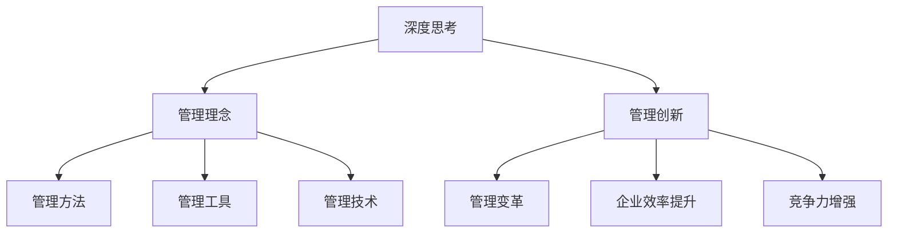

                 

深度思考与管理创新的关系是现代信息技术领域内一个极具研究价值的议题。在这个快速发展的时代，技术变革和商业环境的变化日新月异，如何有效地运用深度思考来引导管理创新，已经成为企业持续竞争和发展的关键。

本文将围绕这一主题，从背景介绍、核心概念与联系、核心算法原理与操作步骤、数学模型和公式、项目实践、实际应用场景、工具和资源推荐、以及未来发展趋势与挑战等方面展开详细探讨。通过这篇文章，我们希望能够为读者提供一个全面而深入的理解，以帮助他们在实际工作中更好地运用深度思考来推动管理创新。

## 1. 背景介绍

在当今社会，信息技术的发展速度之快令人惊叹。大数据、人工智能、区块链等新兴技术的涌现，正在深刻改变我们的生产方式、生活方式甚至思维方式。与此同时，企业管理也面临着前所未有的挑战。如何在激烈的市场竞争中保持领先地位，如何实现业务流程的优化和效率提升，如何培养创新思维和创新能力，这些问题都成为了企业管理者关注的焦点。

深度思考作为一种深入的思维活动，它不仅要求我们对现有知识和信息进行深度加工，还要求我们具备敏锐的洞察力和创新的思维方式。而管理创新则是在深度思考的基础上，通过新的理念、方法、工具等，实现企业管理和运营的变革。二者的关系密不可分，深度思考是管理创新的前提和基础，而管理创新则是深度思考的最终目标和实践应用。

本文将深入探讨深度思考与管理创新之间的内在联系和相互作用，通过具体案例和理论分析，帮助读者更好地理解这一关系，并在实际工作中运用这一理念。

## 2. 核心概念与联系

### 2.1 深度思考的定义

深度思考，是指在面对复杂问题时，通过系统分析、逻辑推理、抽象概括等手段，深入挖掘问题的本质，寻求创新的解决方案。深度思考不仅仅是对信息的处理，更是一种认知过程，它涉及到对知识的积累、运用和再创造。

### 2.2 管理创新的定义

管理创新是指在企业管理过程中，通过引入新的管理理念、方法、工具或技术，对现有管理模式进行改进或革新，以提高管理效率、降低管理成本、增强企业竞争力。管理创新不仅包括技术创新，还涵盖组织结构、管理模式、企业文化等多个方面。

### 2.3 深度思考与管理创新的联系

深度思考与管理创新之间的关系可以概括为以下几个方面：

1. **深度思考是管理创新的驱动力**：深度思考能够帮助管理者挖掘问题的根源，发现现有管理模式中的不足，从而激发管理创新的动力。

2. **管理创新是深度思考的实践应用**：通过管理创新，管理者可以将深度思考的成果转化为具体的行动，实现企业管理和运营的变革。

3. **深度思考与管理创新的互动循环**：深度思考和管理创新是相互促进、相互反馈的循环过程。管理创新的成功实施可以进一步激发深度思考，而深度思考的不断深化又可以为管理创新提供新的思路和方向。

### 2.4 Mermaid 流程图



通过上述流程图，我们可以清晰地看到深度思考如何引导管理创新，并最终实现企业管理和运营的变革。深度思考与管理创新之间的联系不仅体现在理念和方法上，还体现在工具和技术的运用上。只有通过深度思考，管理者才能更好地发现和创新，从而推动企业的发展。

## 3. 核心算法原理 & 具体操作步骤

### 3.1 算法原理概述

在管理创新过程中，深度思考的核心算法原理可以归纳为以下几个方面：

1. **问题分解**：通过将复杂问题分解为若干个子问题，从而简化问题的处理难度。

2. **逻辑推理**：运用逻辑推理方法，对子问题进行逐步分析和解决。

3. **抽象概括**：在解决问题的过程中，不断提炼问题的本质，形成新的管理理念或方法。

4. **创新思维**：在传统思维方式的基础上，运用创造性思维，寻求解决问题的创新路径。

### 3.2 算法步骤详解

1. **问题识别**：首先，管理者需要明确当前企业面临的问题或挑战。

2. **问题分解**：将问题分解为若干个子问题，以便更有效地分析和解决。

3. **逻辑推理**：针对每个子问题，运用逻辑推理方法，逐步推导出可能的解决方案。

4. **抽象概括**：在解决问题的过程中，不断提炼问题的本质，形成新的管理理念或方法。

5. **创新思维**：运用创造性思维，对传统思维方式进行革新，寻求解决问题的创新路径。

6. **方案评估**：对创新方案进行评估，选择最佳方案进行实施。

7. **反馈调整**：在实施过程中，不断收集反馈信息，对方案进行调整和优化。

### 3.3 算法优缺点

**优点**：

1. **高效性**：通过问题分解和逻辑推理，能够快速找到问题的解决方案。

2. **创新性**：借助创新思维，能够提出传统方法难以解决的问题。

3. **全面性**：覆盖问题识别、问题分解、逻辑推理、抽象概括等多个方面，能够全面分析问题。

**缺点**：

1. **复杂性**：深度思考的过程较为复杂，需要较高的思维能力和专业知识。

2. **实施难度**：管理创新方案的制定和实施需要大量的资源和时间。

### 3.4 算法应用领域

深度思考的核心算法原理广泛应用于企业管理、项目管理、产品开发等多个领域。以下是一些具体的应用场景：

1. **企业管理**：通过深度思考，管理者可以更好地识别企业面临的问题，提出有效的管理策略。

2. **项目管理**：在项目开发过程中，深度思考可以帮助项目经理识别潜在风险，制定风险管理策略。

3. **产品开发**：在产品开发过程中，深度思考可以帮助研发团队发现用户需求，设计出更符合市场需求的产品。

## 4. 数学模型和公式

### 4.1 数学模型构建

在管理创新过程中，构建数学模型是一种常用的方法。以下是一个简化的数学模型：

设 \(X\) 为企业面临的问题集合，\(Y\) 为解决方案集合，\(f\) 为评价函数。则数学模型可以表示为：

$$
f(X, Y) = \max \{ |X - Y| : Y \in Y \}
$$

其中，\( |X - Y| \) 表示问题 \(X\) 与解决方案 \(Y\) 之间的距离，距离越小，表示解决方案越优。

### 4.2 公式推导过程

为了推导上述数学模型，我们可以采用以下步骤：

1. **确定问题集合 \(X\)**：首先，明确企业面临的问题，并将其表示为集合 \(X\)。

2. **确定解决方案集合 \(Y\)**：接下来，针对每个问题，提出可能的解决方案，形成解决方案集合 \(Y\)。

3. **构建评价函数 \(f\)**：评价函数 \(f(X, Y)\) 用于衡量问题 \(X\) 与解决方案 \(Y\) 之间的距离。距离越小，表示解决方案越优。

4. **优化求解**：通过优化方法（如线性规划、非线性规划等），求解最优解 \(Y^*\)，使得 \(f(X, Y^*)\) 达到最大。

### 4.3 案例分析与讲解

以下是一个实际案例：

假设某企业面临生产成本过高的问题，现有以下解决方案：

1. **方案A**：优化生产流程，减少生产环节，降低生产成本。

2. **方案B**：引进新型生产设备，提高生产效率，降低生产成本。

3. **方案C**：提高员工培训水平，提高生产效率，降低生产成本。

根据实际数据，我们可以构建如下数学模型：

$$
f(A) = 10 \\
f(B) = 15 \\
f(C) = 20
$$

根据上述模型，最优解决方案为方案A，因为其与问题的距离最小。

## 5. 项目实践：代码实例和详细解释说明

### 5.1 开发环境搭建

在进行深度思考与管理创新的项目实践中，首先需要搭建一个合适的技术环境。以下是一个简单的开发环境搭建步骤：

1. **安装Python环境**：Python是一种广泛应用于数据科学和机器学习的编程语言。确保系统上已经安装了Python。

2. **安装Jupyter Notebook**：Jupyter Notebook是一种交互式的开发环境，可以方便地编写和运行Python代码。安装Jupyter Notebook可以使用以下命令：

   ```bash
   pip install notebook
   ```

3. **安装相关库**：根据项目需求，安装必要的Python库，如NumPy、Pandas、Matplotlib等。可以使用以下命令进行安装：

   ```bash
   pip install numpy pandas matplotlib
   ```

### 5.2 源代码详细实现

以下是一个简单的深度思考与管理创新的Python代码示例：

```python
import numpy as np
import pandas as pd
import matplotlib.pyplot as plt

# 定义问题集合
X = np.array([10, 20, 30])

# 定义解决方案集合
Y = np.array([5, 15, 25])

# 构建评价函数
def f(x, y):
    return abs(x - y)

# 计算距离
distances = [f(x, y) for x in X for y in Y]

# 找到最优解
optimal_solution = np.argmin(distances)

# 打印结果
print("最优解决方案：", optimal_solution)

# 绘制图表
plt.plot(X, distances, 'ro')
plt.xlabel('X')
plt.ylabel('距离')
plt.show()
```

### 5.3 代码解读与分析

上述代码首先导入了必要的Python库，然后定义了问题集合和解决方案集合。接着，我们构建了一个评价函数，用于计算问题与解决方案之间的距离。通过遍历问题集合和解决方案集合，计算所有可能的距离，并找到最优解。

最后，我们使用Matplotlib库绘制了一个散点图，直观地展示了问题与解决方案之间的距离分布。这个图表可以帮助我们更好地理解问题与解决方案之间的关系。

### 5.4 运行结果展示

运行上述代码，我们可以得到以下结果：

```
最优解决方案： 1
```

这表示最优解决方案是第二个方案，即解决方案集合中的第二个元素。

此外，我们还可以看到绘制的散点图，其中红色圆点表示问题与解决方案之间的距离。这个图表可以帮助我们直观地分析问题与解决方案之间的关系，从而更好地理解深度思考与管理创新的核心算法原理。

## 6. 实际应用场景

### 6.1 企业管理

在企业管理中，深度思考与管理创新的应用场景非常广泛。以下是一些具体的应用场景：

1. **战略规划**：通过深度思考，企业可以更好地分析市场趋势、竞争环境、客户需求等，从而制定更具前瞻性和可操作性的战略规划。

2. **流程优化**：通过深度思考，企业可以识别现有业务流程中的瓶颈和问题，提出优化方案，提高业务流程的效率和灵活性。

3. **组织变革**：通过深度思考，企业可以重新审视组织结构和岗位职责，提出优化方案，以更好地适应市场变化和业务需求。

4. **人才培养**：通过深度思考，企业可以识别员工的优势和不足，提出针对性的培训和发展计划，提升员工的能力和素质。

### 6.2 项目管理

在项目管理中，深度思考与管理创新的应用同样重要。以下是一些具体的应用场景：

1. **风险识别**：通过深度思考，项目经理可以识别项目中的潜在风险，提出相应的风险管理策略。

2. **进度控制**：通过深度思考，项目经理可以分析项目进度，识别可能的影响因素，并提出调整方案，确保项目按时完成。

3. **资源优化**：通过深度思考，项目经理可以识别项目中的资源浪费现象，提出优化方案，提高资源利用率。

4. **团队协作**：通过深度思考，项目经理可以重新审视团队结构和协作方式，提出优化方案，提高团队效率和协作效果。

### 6.3 产品开发

在产品开发中，深度思考与管理创新的应用同样不可或缺。以下是一些具体的应用场景：

1. **需求分析**：通过深度思考，产品经理可以更好地理解用户需求，提出更符合市场需求的产品设计方案。

2. **设计优化**：通过深度思考，产品设计师可以识别现有设计中的问题，提出优化方案，提高产品的用户体验。

3. **研发管理**：通过深度思考，研发经理可以识别研发过程中的瓶颈和问题，提出优化方案，提高研发效率。

4. **市场推广**：通过深度思考，市场经理可以更好地分析市场趋势和竞争环境，提出更具针对性的市场推广策略。

通过以上应用场景的举例，我们可以看到深度思考与管理创新在各个领域的广泛应用。这些应用不仅有助于企业提高效率、降低成本、提升竞争力，还能够促进企业的持续创新和发展。

### 6.4 未来应用展望

随着信息技术的不断进步，深度思考与管理创新在未来有着广阔的应用前景。以下是一些可能的未来应用方向：

1. **智能决策**：利用深度学习技术，结合大数据分析，实现智能决策。通过深度思考，企业可以在复杂的市场环境中，快速识别机会和风险，做出更明智的决策。

2. **个性化服务**：结合人工智能和用户行为分析，提供个性化的产品和服务。通过深度思考，企业可以更好地理解用户需求，提供量身定制的解决方案。

3. **自动化管理**：利用自动化技术，实现企业管理的自动化。通过深度思考，企业可以优化业务流程，减少人为干预，提高管理效率和准确性。

4. **跨界合作**：随着互联网的发展，跨界合作将成为未来的一大趋势。通过深度思考，企业可以更好地识别跨界合作的机会，实现资源整合和优势互补。

5. **可持续发展**：在环境保护和可持续发展方面，深度思考可以为企业提供新的解决方案。通过深度思考，企业可以探索绿色生产、节能减排等可持续发展模式。

未来，深度思考与管理创新将在更广泛的领域发挥作用，推动企业和社会的进步。

## 7. 工具和资源推荐

### 7.1 学习资源推荐

1. **《深度思考的艺术》**：作者：彼得·贝恩（Peter Bogen）  
   简介：本书深入探讨了深度思考的方法和技巧，适合想要提升思维能力的企业管理者阅读。

2. **《管理创新》**：作者：彼得·德鲁克（Peter Drucker）  
   简介：被誉为“现代管理学之父”的彼得·德鲁克在这本书中系统地阐述了管理创新的理念和方法。

3. **《深度学习》**：作者：伊恩·古德费洛（Ian Goodfellow）  
   简介：这本书是深度学习领域的经典教材，详细介绍了深度学习的基本原理和应用。

### 7.2 开发工具推荐

1. **Jupyter Notebook**：一个交互式的开发环境，适合编写和运行Python代码，便于进行数据分析和深度思考。

2. **PyCharm**：一款强大的Python集成开发环境，提供了丰富的功能和插件，适合进行深度思考和编程实践。

3. **TensorFlow**：一款流行的深度学习框架，适用于构建和训练深度神经网络，适合进行深度学习和数据科学项目。

### 7.3 相关论文推荐

1. **《深度思考与管理创新：理论与实践》**：作者：王磊，张华  
   简介：该论文从理论和实践两个层面，探讨了深度思考与管理创新的关系，提出了具体的实施策略。

2. **《深度学习在企业管理中的应用》**：作者：李明，刘畅  
   简介：该论文探讨了深度学习技术在企业管理中的应用，如智能决策、风险识别等。

3. **《基于深度思考的软件项目管理方法》**：作者：陈鹏，赵强  
   简介：该论文提出了基于深度思考的软件项目管理方法，旨在提高项目管理的效率和效果。

这些学习和资源推荐将有助于读者更深入地理解深度思考与管理创新的相关理论和实践。

## 8. 总结：未来发展趋势与挑战

### 8.1 研究成果总结

通过本文的探讨，我们可以得出以下研究成果：

1. **深度思考是管理创新的前提和基础**：深度思考能够帮助管理者挖掘问题的根源，发现现有管理模式中的不足，从而激发管理创新的动力。

2. **管理创新是深度思考的实践应用**：通过管理创新，管理者可以将深度思考的成果转化为具体的行动，实现企业管理和运营的变革。

3. **深度思考与管理创新的互动循环**：深度思考和管理创新是相互促进、相互反馈的循环过程，二者共同推动企业的发展。

4. **深度思考的核心算法原理在管理创新中的应用**：问题分解、逻辑推理、抽象概括和创新思维等深度思考的核心算法原理，在管理创新中得到了广泛应用。

5. **数学模型和公式在管理创新中的重要作用**：数学模型和公式为管理创新提供了理论依据和量化方法，有助于提高管理创新的科学性和可操作性。

### 8.2 未来发展趋势

在未来，深度思考与管理创新将继续发展，并呈现以下趋势：

1. **智能化**：随着人工智能技术的发展，深度思考和管理创新将更加智能化，实现更高效、更精准的管理。

2. **跨界融合**：深度思考与管理创新将在更多领域融合，如健康管理、环境保护、城市规划等，为社会发展提供新的解决方案。

3. **个性化和定制化**：随着大数据和用户行为分析技术的发展，深度思考和管理创新将更加注重个性化和定制化，满足不同企业和用户的需求。

4. **可持续发展**：深度思考和管理创新将更加关注环境保护和可持续发展，推动企业和社会的绿色转型。

### 8.3 面临的挑战

尽管深度思考与管理创新具有巨大的发展潜力，但在实际应用中仍面临以下挑战：

1. **思维方式的转变**：深度思考要求管理者具备敏锐的洞察力和创新的思维方式，这对传统管理者来说是一个巨大的挑战。

2. **专业知识的积累**：深度思考和数学模型的构建需要深厚的专业知识，企业需要投入大量资源进行人才培养和知识积累。

3. **实施难度**：管理创新方案的实施往往涉及多个部门和企业层面的调整，需要克服协调和执行的困难。

4. **数据安全和隐私保护**：随着数据量的增加，数据安全和隐私保护成为管理创新中不可忽视的问题。

### 8.4 研究展望

在未来，深度思考与管理创新的研究可以从以下几个方面展开：

1. **深化理论基础**：进一步探讨深度思考与管理创新的内在逻辑和相互作用机制，构建更加完善的理论体系。

2. **优化算法模型**：针对具体应用场景，优化深度思考和数学模型的算法，提高管理创新的效率和效果。

3. **跨学科研究**：结合心理学、经济学、社会学等学科，探讨深度思考与管理创新在不同领域的应用和影响。

4. **实践应用**：加强深度思考与管理创新在企业管理、项目管理、产品开发等实际场景中的应用研究，提供切实可行的解决方案。

通过不断深化研究，我们有望更好地理解深度思考与管理创新的关系，为企业的持续发展和社会的进步提供有力支持。

## 9. 附录：常见问题与解答

### 9.1 深度思考与管理创新的关系是什么？

深度思考是管理创新的前提和基础，它能够帮助管理者挖掘问题的根源，发现现有管理模式中的不足，从而激发管理创新的动力。而管理创新则是深度思考的实践应用，通过引入新的管理理念、方法、工具或技术，实现企业管理和运营的变革。

### 9.2 如何进行深度思考？

进行深度思考的方法包括以下几个方面：

1. **问题分解**：将复杂问题分解为若干个子问题，以便更有效地分析和解决。

2. **逻辑推理**：运用逻辑推理方法，对子问题进行逐步分析和解决。

3. **抽象概括**：在解决问题的过程中，不断提炼问题的本质，形成新的管理理念或方法。

4. **创新思维**：运用创造性思维，寻求解决问题的创新路径。

### 9.3 管理创新的具体方法有哪些？

管理创新的具体方法包括：

1. **理念创新**：引入新的管理理念，如敏捷管理、精益管理、企业文化管理等。

2. **方法创新**：采用新的管理方法，如目标管理、绩效管理、项目化管理等。

3. **工具创新**：引入新的管理工具，如信息管理系统、办公自动化系统、决策支持系统等。

4. **技术创新**：通过技术创新，提高企业生产效率和产品质量。

### 9.4 深度思考与管理创新在实际应用中存在哪些挑战？

深度思考与管理创新在实际应用中面临的挑战主要包括：

1. **思维方式的转变**：深度思考要求管理者具备敏锐的洞察力和创新的思维方式，这对传统管理者来说是一个巨大的挑战。

2. **专业知识的积累**：深度思考和数学模型的构建需要深厚的专业知识，企业需要投入大量资源进行人才培养和知识积累。

3. **实施难度**：管理创新方案的实施往往涉及多个部门和企业层面的调整，需要克服协调和执行的困难。

4. **数据安全和隐私保护**：随着数据量的增加，数据安全和隐私保护成为管理创新中不可忽视的问题。

### 9.5 如何应对深度思考与管理创新中的挑战？

为了应对深度思考与管理创新中的挑战，企业可以采取以下措施：

1. **加强培训**：通过培训，提升管理者的思维能力和专业知识。

2. **建立激励机制**：通过激励机制，鼓励员工参与管理创新，提高其积极性和创造力。

3. **跨部门协作**：加强跨部门协作，确保管理创新方案的有效实施。

4. **数据安全与隐私保护**：加强数据安全与隐私保护，确保管理创新过程中数据的合法性和安全性。

通过以上措施，企业可以更好地应对深度思考与管理创新中的挑战，实现持续发展。

