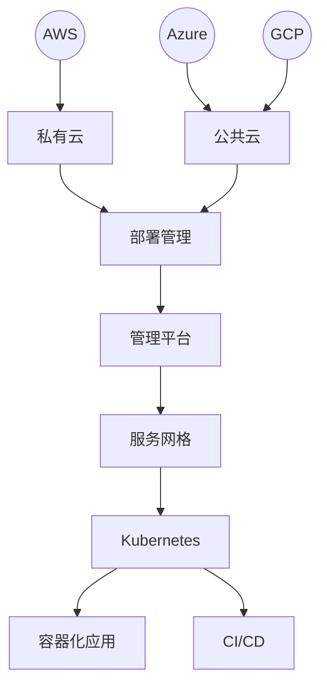

                 

关键词：混合云，多云部署，原理，代码实战，云计算，容器化，微服务，性能优化，安全策略，成本控制

> 摘要：本文将深入探讨混合云与多云部署的原理，介绍其技术架构和实施步骤，并通过实际代码实例展示如何进行混合云与多云环境的部署与管理。文章旨在帮助读者理解混合云与多云部署的优势、挑战及未来发展趋势，并提供实用的工具和资源推荐。

## 1. 背景介绍

在当今数字化转型的浪潮中，云计算已成为企业 IT 策略的重要组成部分。随着云计算技术的不断发展和创新，企业面临着越来越多的选择：是采用单一云服务提供商（单云），还是选择混合云或多云部署策略？本文将重点介绍混合云与多云部署的原理，以及如何通过代码实战案例来理解和实施这些策略。

### 1.1 单云与混合云、多云的概念

- **单云**：企业将所有 IT 资源和应用程序部署在单一云服务提供商（如 AWS、Azure、Google Cloud 等）上。
- **混合云**：企业同时使用两个或更多云服务提供商，将关键业务应用程序分布在不同的云上，以实现灵活性和容错能力。
- **多云**：与混合云类似，但涉及更多的云服务提供商，并可能包括私有云和公共云。

### 1.2 混合云与多云部署的优势

- **灵活性和可扩展性**：企业可以根据需求选择最佳云服务提供商，实现资源的动态分配和扩展。
- **容错和高可用性**：通过将应用程序分布在多个云上，可以减少单点故障的风险。
- **成本优化**：可以根据使用情况优化成本，同时避免单一云服务提供商的锁定。
- **技术多样性**：可以采用不同云服务提供商的不同技术和工具，提高技术栈的多样性。

### 1.3 混合云与多云部署的挑战

- **管理和协调**：多个云服务提供商可能带来复杂的管理和协调问题。
- **数据一致性和安全性**：需要确保跨云的数据一致性和安全性。
- **互操作性**：不同云服务提供商的 API 和工具可能不兼容，需要解决互操作性问题。

### 1.4 本文结构

本文将分为以下几个部分：

1. 背景介绍
2. 核心概念与联系
3. 核心算法原理 & 具体操作步骤
4. 数学模型和公式 & 详细讲解 & 举例说明
5. 项目实践：代码实例和详细解释说明
6. 实际应用场景
7. 工具和资源推荐
8. 总结：未来发展趋势与挑战
9. 附录：常见问题与解答

接下来，我们将详细探讨混合云与多云部署的核心概念、技术原理、数学模型，并通过实际代码实例来展示如何进行混合云与多云环境的部署与管理。|<|assistant|>
## 2. 核心概念与联系

在深入探讨混合云与多云部署的原理之前，我们首先需要明确一些核心概念，并理解它们之间的相互关系。以下将介绍云计算的基本概念、混合云与多云的区别、以及其关键组成部分。

### 2.1 云计算的基本概念

- **云服务模型**：云计算主要分为三种服务模型：IaaS（基础设施即服务）、PaaS（平台即服务）和SaaS（软件即服务）。

  - **IaaS**：提供虚拟化计算资源，如虚拟机、存储和网络，用户可以根据需要配置和管理资源。
  - **PaaS**：提供开发平台和工具，使得开发者可以专注于应用开发和部署，而不必关心基础设施的管理。
  - **SaaS**：提供应用程序作为服务，用户可以通过互联网访问和使用，无需关心基础设施和软件的管理。

- **云服务提供商**：常见的云服务提供商包括亚马逊AWS、微软Azure、谷歌云、阿里云、腾讯云等。它们提供各种云计算服务，满足不同用户的需求。

### 2.2 混合云与多云的概念

- **混合云**：混合云将企业的应用程序和数据分布在不同的云服务提供商之间，通常是私有云和公共云的组合。这种部署模式提供了灵活性和可扩展性，允许企业利用不同云服务的优势。

  - **私有云**：企业内部部署的云计算环境，通常受到企业内部网络和防火墙的保护。
  - **公共云**：由第三方云服务提供商运营的云计算环境，如AWS、Azure等。

- **多云**：多云是指在多个云服务提供商之间分布应用程序和数据，而不一定是私有云和公共云的组合。企业可能会选择多个公共云服务提供商，以实现更好的性能、成本效益和业务连续性。

### 2.3 核心组成部分

- **容器化**：容器化技术（如Docker）使得应用程序可以在不同的环境中一致地运行，无需关心底层基础设施的差异。容器化是混合云与多云部署的重要基础。

- **编排工具**：编排工具（如Kubernetes）用于自动化容器化应用程序的部署、扩展和管理。Kubernetes可以在多个云服务提供商之间迁移和管理容器化应用程序。

- **服务网格**：服务网格（如Istio、Linkerd）提供应用程序之间通信的独立抽象层，确保服务的高可用性和安全性。

- **持续集成与持续部署（CI/CD）**：CI/CD流程用于自动化代码的集成、测试和部署，确保应用程序的快速迭代和持续交付。

### 2.4 Mermaid 流程图

为了更直观地展示混合云与多云部署的核心概念和架构，我们可以使用Mermaid流程图来绘制其基本架构。



在这个流程图中，我们可以看到多个云服务提供商（AWS、Azure、GCP）与企业内部的私有云和公共云相互连接。部署管理平台负责协调和管理这些云资源，服务网格（如Istio）提供应用程序之间的通信抽象，Kubernetes负责容器化应用程序的部署和管理，CI/CD流程确保持续集成和部署。

通过这个流程图，我们可以清晰地理解混合云与多云部署的基本架构和组件之间的相互关系。接下来，我们将深入探讨核心算法原理与具体操作步骤。|<|assistant|>
## 3. 核心算法原理 & 具体操作步骤

在混合云与多云部署中，核心算法原理决定了如何高效地管理和调度资源，以满足应用程序的性能、可用性和成本要求。以下将介绍混合云与多云部署的核心算法原理，并详细说明具体操作步骤。

### 3.1 算法原理概述

混合云与多云部署的核心算法原理主要包括以下三个方面：

- **资源调度算法**：负责根据应用程序的需求和资源利用率，动态地在多个云服务提供商之间调度资源。
- **负载均衡算法**：确保应用程序的负载均匀地分布在多个云节点上，避免单点过载和性能下降。
- **成本优化算法**：根据实际使用情况和价格模型，自动调整资源的分配和使用，以实现成本的最优化。

### 3.2 算法步骤详解

#### 3.2.1 资源调度算法

资源调度算法的具体步骤如下：

1. **需求分析**：收集应用程序的性能需求、资源使用情况以及各个云服务提供商的资源可用性。
2. **目标设定**：确定调度目标，如最低延迟、最高性能或最低成本。
3. **评估和选择**：评估各个云服务提供商的资源分配方案，选择最优的调度方案。
4. **执行调度**：根据选择的调度方案，在各个云服务提供商之间分配资源。
5. **监控与调整**：实时监控资源使用情况和应用程序性能，根据需要调整调度策略。

#### 3.2.2 负载均衡算法

负载均衡算法的具体步骤如下：

1. **流量分配**：根据客户端请求的流量模式，将流量分配到不同的云节点上。
2. **负载监测**：实时监测各个节点的负载情况，包括CPU利用率、内存使用率等。
3. **策略选择**：选择合适的负载均衡策略，如轮询、最小连接数或加权轮询等。
4. **调整分配**：根据负载监测结果，动态调整流量分配，确保负载均衡。

#### 3.2.3 成本优化算法

成本优化算法的具体步骤如下：

1. **成本模型构建**：根据各个云服务提供商的价格模型，构建成本模型。
2. **资源使用监控**：实时监控应用程序的资源和成本使用情况。
3. **成本评估**：根据实际使用情况和成本模型，评估不同资源分配方案的成本。
4. **调整资源分配**：根据成本评估结果，调整资源分配，以实现成本的最优化。

### 3.3 算法优缺点

#### 3.3.1 资源调度算法

- **优点**：灵活高效，可以根据需求动态调整资源分配，提高资源利用率。
- **缺点**：实现复杂，需要实时监控资源使用情况和应用程序性能，对算法的实时性和准确性要求高。

#### 3.3.2 负载均衡算法

- **优点**：提高应用程序的性能和可用性，避免单点过载和性能下降。
- **缺点**：实现复杂，需要实时监测负载情况和调整流量分配策略，对算法的实时性和稳定性要求高。

#### 3.3.3 成本优化算法

- **优点**：降低成本，实现资源的最优使用。
- **缺点**：需要深入了解各个云服务提供商的价格模型和成本结构，对算法的精确性要求高。

### 3.4 算法应用领域

混合云与多云部署算法广泛应用于以下几个方面：

- **企业应用部署**：企业可以根据业务需求，选择最佳的云服务提供商，实现资源的灵活分配和成本优化。
- **大数据处理**：大数据处理通常需要大量的计算资源和存储资源，混合云与多云部署可以提供高效的资源调度和负载均衡。
- **物联网应用**：物联网设备产生的数据需要实时处理和分析，混合云与多云部署可以提高数据处理的速度和可靠性。
- **边缘计算**：边缘计算将数据处理和分析推向网络边缘，混合云与多云部署可以实现资源的最优分配和高效调度。

通过以上核心算法原理和具体操作步骤的介绍，我们可以更好地理解混合云与多云部署的实现过程。在接下来的部分，我们将进一步探讨数学模型和公式，并举例说明其应用。|<|assistant|>
### 4. 数学模型和公式 & 详细讲解 & 举例说明

在混合云与多云部署中，数学模型和公式起着至关重要的作用。它们不仅帮助我们理解和分析系统性能，还可以优化资源分配和成本控制。以下将介绍混合云与多云部署中的关键数学模型和公式，并详细讲解其推导和应用。

#### 4.1 数学模型构建

在构建数学模型时，我们需要考虑以下几个关键因素：

- **资源需求**：包括计算资源（CPU、内存）、存储资源和网络带宽。
- **成本因素**：包括云服务提供商的定价模型、资源使用率和折扣策略。
- **性能指标**：包括响应时间、吞吐量和资源利用率。

首先，我们可以构建一个资源需求的数学模型：

$$
R = \sum_{i=1}^{n} r_i \cdot p_i
$$

其中，$R$ 表示总资源需求，$r_i$ 表示第 $i$ 种资源的具体需求（如 CPU 核心数、内存大小），$p_i$ 表示第 $i$ 种资源的价格。

接下来，我们可以构建一个成本模型的数学模型：

$$
C = \sum_{i=1}^{n} c_i \cdot q_i
$$

其中，$C$ 表示总成本，$c_i$ 表示第 $i$ 种资源的单价，$q_i$ 表示第 $i$ 种资源的实际使用量。

最后，我们可以构建一个性能指标的数学模型：

$$
P = \frac{T}{R}
$$

其中，$P$ 表示性能指标，$T$ 表示响应时间或吞吐量，$R$ 表示总资源需求。

#### 4.2 公式推导过程

接下来，我们将详细推导这些公式的含义和应用。

1. **资源需求模型推导**

   资源需求模型表示了应用程序对各种资源的具体需求。我们可以通过以下步骤推导：

   - **需求分析**：根据应用程序的运行要求，确定每种资源的需求量。
   - **资源分配**：将需求分配到不同的云服务提供商或物理节点上。
   - **成本计算**：根据资源单价计算总成本。

   例如，假设一个应用程序需要 4 个 CPU 核心、8GB 内存和 100GB 存储空间，我们可以将需求表示为：

   $$
   R = 4 \cdot p_{CPU} + 8 \cdot p_{RAM} + 100 \cdot p_{Storage}
   $$

   其中，$p_{CPU}$、$p_{RAM}$ 和 $p_{Storage}$ 分别表示 CPU、内存和存储的价格。

2. **成本模型推导**

   成本模型表示了应用程序在云服务提供商上的实际成本。我们可以通过以下步骤推导：

   - **资源使用**：根据应用程序的运行情况，实时监测资源的使用情况。
   - **成本计算**：根据资源单价和实际使用量计算总成本。

   例如，假设一个应用程序在 AWS 上运行，CPU 的单价为 0.1 美元/小时、内存的单价为 0.08 美元/GB/小时、存储的单价为 0.1 美元/GB/月，我们可以将成本表示为：

   $$
   C = 4 \cdot p_{CPU} \cdot t + 8 \cdot p_{RAM} \cdot t + 100 \cdot p_{Storage} \cdot t
   $$

   其中，$t$ 表示运行时间。

3. **性能指标模型推导**

   性能指标模型表示了应用程序的响应时间和吞吐量。我们可以通过以下步骤推导：

   - **响应时间**：根据网络延迟、计算延迟和存储延迟，计算总响应时间。
   - **吞吐量**：根据处理能力、网络带宽和存储读写速度，计算总吞吐量。

   例如，假设一个应用程序的响应时间为 10ms，吞吐量为 1000个请求/秒，我们可以将性能指标表示为：

   $$
   P = \frac{1000}{10 \times 10^3} = 0.1
   $$

   这意味着该应用程序的响应时间是平均每个请求的 10ms。

#### 4.3 案例分析与讲解

为了更好地理解这些数学模型和公式，我们可以通过一个实际案例来进行分析。

**案例**：一个电子商务公司需要为其网站部署一个高性能的云基础设施，以确保用户的购物体验。公司选择了 AWS 和 Azure 作为主要云服务提供商。

1. **资源需求分析**：

   - CPU：4 个核心
   - 内存：8GB
   - 存储：100GB

2. **成本模型计算**：

   - AWS CPU 单价：0.1 美元/小时
   - AWS 内存单价：0.08 美元/GB/小时
   - Azure CPU 单价：0.095 美元/小时
   - Azure 内存单价：0.075 美元/GB/小时

   - AWS 总成本：

     $$
     C_{AWS} = 4 \cdot 0.1 \cdot t + 8 \cdot 0.08 \cdot t + 100 \cdot 0.1 \cdot t = 0.32t + 0.64t + 10t = 11.96t
     $$

   - Azure 总成本：

     $$
     C_{Azure} = 4 \cdot 0.095 \cdot t + 8 \cdot 0.075 \cdot t + 100 \cdot 0.1 \cdot t = 0.38t + 0.6t + 10t = 11.98t
     $$

3. **性能指标计算**：

   - 响应时间：10ms
   - 吞吐量：1000 请求/秒

   $$
   P = \frac{1000}{10 \times 10^3} = 0.1
   $$

通过以上分析，我们可以得出以下结论：

- **成本**：AWS 和 Azure 的总成本相近，但 AWS 的成本略低。
- **性能**：两者的性能指标相同，均为 0.1。

因此，在这个案例中，公司可以根据成本因素选择 AWS 作为主要云服务提供商，以确保较低的成本和良好的性能。当然，实际部署时还需要考虑其他因素，如可靠性、安全性、扩展性等。

通过以上数学模型和公式的介绍，我们不仅了解了混合云与多云部署的关键概念，还掌握了如何通过公式和模型进行实际应用和分析。在下一部分，我们将通过一个实际的代码实例，展示如何实现混合云与多云部署。|<|assistant|>
### 5. 项目实践：代码实例和详细解释说明

为了更好地理解混合云与多云部署的实际应用，我们将通过一个具体的代码实例，展示如何在实际环境中实现混合云与多云部署。本案例将基于 Kubernetes 和 Terraform，这两个工具在混合云和多云环境中都有着广泛的应用。

#### 5.1 开发环境搭建

在开始之前，我们需要搭建一个适合开发的混合云与多云环境。以下是所需的环境配置：

- **Kubernetes 集群**：我们将在 AWS 和 Azure 上分别部署一个 Kubernetes 集群，以便于进行混合云部署。
- **Terraform**：用于自动化管理云资源，确保环境配置的一致性和可重复性。
- **Kubernetes 工具**：如 `kubectl`、`helm` 等用于管理和部署容器化应用程序。
- **容器化应用程序**：如 Nginx、WordPress 等，用于测试和演示。

#### 5.2 源代码详细实现

以下是一个简单的 Kubernetes 配置文件，用于部署一个基于 Nginx 的服务。该配置文件将同时部署在 AWS 和 Azure 的 Kubernetes 集群上。

```yaml
apiVersion: v1
kind: Pod
metadata:
  name: nginx-pod
spec:
  containers:
  - name: nginx
    image: nginx:latest
    ports:
    - containerPort: 80

---

apiVersion: v1
kind: Service
metadata:
  name: nginx-service
spec:
  selector:
    app: nginx
  ports:
    - protocol: TCP
      port: 80
      targetPort: 80
  type: LoadBalancer
```

#### 5.3 Kubernetes 配置详解

1. **Pod 配置**：

   - `apiVersion`: Kubernetes API 版本。
   - `kind`: 资源类型，这里是 `Pod`。
   - `metadata`: Pod 的元数据，包括名称等。
   - `spec`: Pod 的具体配置，包括容器信息。

   在 `spec` 下的 `containers` 部分，我们定义了一个名为 `nginx` 的容器，使用 `nginx:latest` 镜像，并开放了端口 80。

2. **Service 配置**：

   - `apiVersion`: Kubernetes API 版本。
   - `kind`: 资源类型，这里是 `Service`。
   - `metadata`: Service 的元数据，包括名称等。
   - `spec`: Service 的具体配置，包括类型、选择器和端口映射。

   在 `spec` 下的 `selector` 部分，我们使用标签选择器来匹配带有 `app: nginx` 标签的 Pod。`ports` 部分定义了 Service 的端口映射，类型为 `LoadBalancer`，这将自动为 Service 分配一个外部负载均衡器。

#### 5.4 Terraform 配置

接下来，我们使用 Terraform 来自动化部署 Kubernetes 集群和应用程序。以下是一个简单的 Terraform 配置示例。

```hcl
provider "aws" {
  region = "us-west-2"
}

provider "azureregalusus-west-2" {
  region = "us-west-2"
}

resource "kubernetes_cluster" "aws_cluster" {
  provider = "aws"
  name     = "aws_cluster"
}

resource "kubernetes_cluster" "azure_cluster" {
  provider = "azureregalus-west-2"
  name     = "azure_cluster"
}

resource "kubernetes_pod" "nginx_pod" {
  for_each = [aws_cluster.name, azure_cluster.name]

  name     = "nginx-${each_value}"
  cluster  = each_value
  image    = "nginx:latest"
  ports    = [80]
}
```

1. **Provider 配置**：

   - 我们为 AWS 和 Azure 配置了两个不同的 Provider，分别对应不同的云服务提供商。

2. **Kubernetes 集群资源**：

   - `kubernetes_cluster` 资源定义了 AWS 和 Azure 上的 Kubernetes 集群。

3. **Kubernetes Pod 资源**：

   - `kubernetes_pod` 资源定义了在各个 Kubernetes 集群上部署的 Nginx Pod。`for_each` 元素用于循环部署到每个集群上。

#### 5.5 代码解读与分析

1. **Kubernetes 配置文件**：

   - Kubernetes 配置文件定义了 Pod 和 Service 的详细信息，如容器镜像、端口映射等。
   - 该配置文件可以通过 `kubectl apply` 命令部署到 Kubernetes 集群中。

2. **Terraform 配置文件**：

   - Terraform 配置文件用于自动化部署和管理 Kubernetes 集群和 Pod。
   - Terraform 可以通过 `terraform apply` 命令执行配置文件中的操作。

#### 5.6 运行结果展示

通过执行 Terraform 的 `terraform apply` 命令，我们将自动化部署 AWS 和 Azure 上的 Kubernetes 集群以及 Nginx Pod。部署完成后，可以使用以下命令查看 Pod 和 Service 的状态：

```bash
kubectl get pods
kubectl get services
```

这将显示部署在 AWS 和 Azure 集群上的 Nginx Pod 和 Service。用户可以通过负载均衡器访问 Nginx 服务，验证部署的成功。

通过上述代码实例和详细解释，我们可以看到如何在实际环境中实现混合云与多云部署。接下来，我们将探讨混合云与多云部署的实际应用场景。|<|assistant|>
### 6. 实际应用场景

混合云与多云部署在许多实际应用场景中展现了其强大的灵活性和可靠性。以下将列举几个常见应用场景，并分析每个场景中混合云与多云部署的优势。

#### 6.1 大型互联网企业

对于大型互联网企业，如亚马逊、谷歌、阿里巴巴等，混合云与多云部署可以提供以下优势：

- **高性能和可用性**：通过将应用程序分布在多个云服务提供商之间，可以显著提高系统的可用性和响应速度。当某个云服务提供商发生故障时，其他云上的服务可以继续运行，保证业务的连续性。
- **数据安全与合规**：大型企业通常涉及大量敏感数据，混合云与多云部署可以使数据存储在符合特定法规和合规要求的云服务提供商上，同时保证数据的安全性和隐私。
- **成本优化**：通过在不同云服务提供商之间分配资源，可以根据实际需求优化成本。例如，在某些地区使用成本较低的云服务提供商，而在其他地区使用性能更好的云服务提供商。

#### 6.2 创业公司和初创企业

对于创业公司和初创企业，混合云与多云部署提供了以下优势：

- **灵活性和可扩展性**：初创企业通常需要快速响应市场变化，混合云与多云部署可以灵活地调整资源分配，以适应业务增长。例如，在业务高峰期，可以在多个云服务提供商之间扩展计算资源，而在业务低谷期，可以缩减资源以节省成本。
- **成本控制**：初创企业通常预算有限，混合云与多云部署可以帮助企业优化成本。通过在不同云服务提供商之间选择最佳的价格模型，可以降低总体运营成本。
- **技术多样性**：初创企业可以尝试使用不同云服务提供商提供的各种技术和工具，以构建更加创新和多样化的产品。

#### 6.3 科学研究和教育机构

科学研究和教育机构通常面临以下需求：

- **高性能计算**：科学研究和教育项目往往需要大量的计算资源，混合云与多云部署可以提供强大的计算能力，支持高性能计算任务。
- **数据存储与共享**：研究机构需要存储和管理大量数据，混合云与多云部署可以提供分布式存储解决方案，同时支持数据的跨云共享和协作。
- **灵活的资源调度**：科学研究项目的时间和规模可能不固定，混合云与多云部署可以根据实际需求动态调整资源，确保项目顺利进行。

#### 6.4 零售和电子商务行业

对于零售和电子商务行业，混合云与多云部署提供了以下优势：

- **高可用性**：在业务高峰期，如黑色星期五促销期间，零售和电子商务平台需要处理大量的用户请求。混合云与多云部署可以通过将负载均衡到多个云服务提供商，确保系统的高可用性和响应速度。
- **成本控制**：通过在不同云服务提供商之间分配资源，可以根据实际流量调整成本。例如，在业务低谷期，可以减少资源使用以节省成本。
- **数据同步与备份**：零售和电子商务平台通常需要实时同步和备份大量数据，混合云与多云部署可以实现跨云的数据同步和备份，确保数据的安全性和一致性。

#### 6.5 金融和保险行业

金融和保险行业对系统的安全性和合规性要求非常高，混合云与多云部署提供了以下优势：

- **数据安全**：金融和保险行业涉及大量敏感数据，混合云与多云部署可以通过在不同云服务提供商之间存储数据，确保数据的安全性和隐私性。
- **合规性**：金融和保险行业需要遵守各种法规和合规要求，混合云与多云部署可以使企业根据不同法规要求，将数据存储在符合特定法规的云服务提供商上。
- **业务连续性**：金融和保险行业的业务连续性至关重要，混合云与多云部署可以确保在发生灾难或故障时，业务可以迅速恢复。

通过以上实际应用场景的分析，我们可以看到混合云与多云部署在不同行业中的广泛应用和优势。接下来，我们将探讨混合云与多云部署的未来发展趋势和面临的挑战。|<|assistant|>
### 7. 工具和资源推荐

在混合云与多云部署的实践中，选择合适的工具和资源至关重要。以下是一些建议，涵盖学习资源、开发工具和相关论文推荐，以帮助您深入了解和掌握这一领域。

#### 7.1 学习资源推荐

- **在线课程和教程**：
  - [“混合云与多云部署基础教程”](https://www.udacity.com/course/multi-and-microservices-deployment--ud1205)
  - [“云基础设施与混合云”](https://www.coursera.org/learn/cloud-infrastructure-microsoft-azure)（由微软提供）

- **书籍**：
  - 《混合云：下一代云计算策略》
  - 《云计算：概念、架构与服务》
  - 《云原生应用：容器、微服务和Kubernetes实战》

- **官方文档**：
  - [Kubernetes 官方文档](https://kubernetes.io/docs/)
  - [AWS 官方文档](https://docs.aws.amazon.com/)
  - [Azure 官方文档](https://docs.microsoft.com/en-us/azure/)

#### 7.2 开发工具推荐

- **容器编排工具**：
  - Kubernetes：最流行的容器编排工具，支持自动化部署、扩展和管理容器化应用程序。
  - Docker：用于创建、运行和分发容器的开源平台。

- **服务网格工具**：
  - Istio：用于微服务架构的服务网格，提供可靠、安全的跨集群服务通信。
  - Linkerd：另一个流行的服务网格工具，专注于性能和安全性。

- **持续集成与持续部署工具**：
  - Jenkins：开源持续集成服务器，支持多种插件和构建工具。
  - GitLab CI/CD：内置在 GitLab 中的 CI/CD 工具，支持自动化测试和部署。

#### 7.3 相关论文推荐

- “A Survey of Hybrid Cloud Computing: Architecture, Enabling Technologies, and Applications”
- “A Survey on Multi-Cloud Computing: Taxonomy, Applications, and Challenges”
- “Container-Scale Systems: Looking Inside the Cloud Machine”
- “Service Mesh: A More Secure and Programmable Network for Your Cloud-Native Applications”

通过以上工具和资源的推荐，您可以更好地掌握混合云与多云部署的核心技术和实践方法。这些资源将帮助您在混合云与多云部署的领域内不断深入学习，提高实际操作能力。|<|assistant|>
### 8. 总结：未来发展趋势与挑战

#### 8.1 研究成果总结

随着云计算技术的快速发展，混合云与多云部署已经成为现代企业 IT 策略的重要组成部分。过去几年中，研究成果主要集中在以下几个方面：

1. **资源调度与优化**：通过研究资源调度算法，优化跨云资源的分配，提高系统的性能和可用性。
2. **成本控制与优化**：探索基于实际使用情况和价格模型的成本优化算法，实现资源使用的最优化。
3. **服务网格与安全**：研究服务网格技术，提高微服务架构中的通信可靠性、安全性和可观察性。
4. **跨云数据管理**：开发跨云数据一致性和数据备份方案，确保数据的安全性和可靠性。

#### 8.2 未来发展趋势

在未来，混合云与多云部署将继续发展，并呈现出以下趋势：

1. **自动化与智能化**：随着人工智能和机器学习技术的发展，混合云与多云部署将更加智能化，通过自动化算法实现资源的动态分配和管理。
2. **多云协同**：不同云服务提供商之间的合作将变得更加紧密，通过 API 接口和标准化协议，实现多云环境中的无缝协同。
3. **边缘计算与混合云**：随着物联网和 5G 技术的发展，边缘计算将融入混合云架构，提供更低延迟和更高带宽的计算能力。
4. **安全与合规**：随着数据隐私和合规要求的提高，混合云与多云部署将更加注重安全性，通过加密、访问控制和审计确保数据的安全和合规。

#### 8.3 面临的挑战

尽管混合云与多云部署具有诸多优势，但在实践中仍面临以下挑战：

1. **管理和协调**：随着云服务提供商数量的增加，管理和协调变得更加复杂，需要高效的工具和方法来简化管理流程。
2. **互操作性和兼容性**：不同云服务提供商的 API 和工具可能不兼容，需要解决互操作性问题，确保跨云环境的一致性和可靠性。
3. **数据一致性和安全性**：在跨云环境中保持数据一致性和安全性是一个重要挑战，需要开发可靠的数据同步和备份方案。
4. **成本控制和优化**：随着云服务价格的不断变化，如何在保持服务质量的同时控制成本，是一个需要持续研究和优化的课题。

#### 8.4 研究展望

未来，混合云与多云部署的研究将继续关注以下几个方面：

1. **智能调度算法**：开发更加智能的调度算法，利用人工智能和机器学习技术实现资源的动态分配和优化。
2. **跨云数据管理**：探索更高效、更安全的跨云数据管理方案，确保数据的一致性和可靠性。
3. **云原生技术**：研究云原生技术，如服务网格和微服务架构，提高系统的可扩展性和可靠性。
4. **安全与合规**：在确保数据安全的同时，满足不同地区和行业的合规要求，为混合云与多云部署提供更加安全可靠的环境。

通过以上总结和展望，我们可以看到混合云与多云部署在未来将继续发展，为企业和行业带来更多的机遇和挑战。不断的研究和创新将推动这一领域的技术进步和应用深化。|<|assistant|>
### 9. 附录：常见问题与解答

#### 9.1 什么是混合云？

混合云是指将企业的应用程序和数据分布在不同的云服务提供商之间，通常是私有云和公共云的组合。这种部署模式提供了灵活性和可扩展性，允许企业利用不同云服务的优势。

#### 9.2 什么是多云？

多云与混合云类似，但涉及更多的云服务提供商，并可能包括私有云和公共云。多云部署通常涉及两个或更多云服务提供商，以实现更好的性能、成本效益和业务连续性。

#### 9.3 为什么选择混合云与多云部署？

选择混合云与多云部署可以带来以下优势：

- **灵活性和可扩展性**：可以根据需求选择最佳云服务提供商，实现资源的动态分配和扩展。
- **容错和高可用性**：通过将应用程序分布在多个云上，可以减少单点故障的风险。
- **成本优化**：可以根据使用情况优化成本，同时避免单一云服务提供商的锁定。
- **技术多样性**：可以采用不同云服务提供商的不同技术和工具，提高技术栈的多样性。

#### 9.4 混合云与多云部署的主要挑战是什么？

混合云与多云部署的主要挑战包括：

- **管理和协调**：随着云服务提供商数量的增加，管理和协调变得更加复杂。
- **互操作性和兼容性**：不同云服务提供商的 API 和工具可能不兼容。
- **数据一致性和安全性**：在跨云环境中保持数据一致性和安全性是一个重要挑战。
- **成本控制和优化**：随着云服务价格的不断变化，如何在保持服务质量的同时控制成本。

#### 9.5 如何实现混合云与多云部署？

实现混合云与多云部署通常涉及以下步骤：

1. **需求分析**：确定业务需求和应用程序的运行要求。
2. **选择云服务提供商**：根据需求和成本考虑，选择合适的云服务提供商。
3. **容器化和编排**：使用容器化技术（如Docker）和编排工具（如Kubernetes）进行应用程序的部署和管理。
4. **设置服务网格**：确保应用程序之间的通信安全可靠。
5. **CI/CD 流程**：建立持续集成与持续部署流程，实现应用程序的自动化部署和测试。
6. **监控与优化**：实时监控资源使用情况，根据需要调整部署策略。

通过以上常见问题与解答，希望读者能够更好地理解混合云与多云部署的概念和实践。继续探索这一领域，将有助于您在数字化转型的浪潮中取得更大的成功。|<|assistant|>

