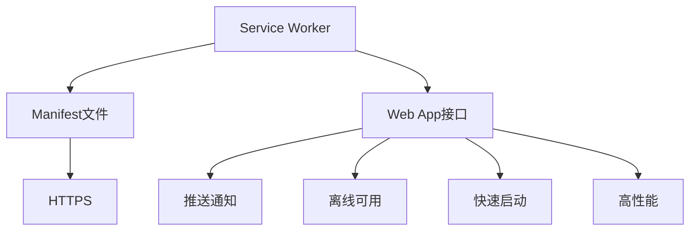

                 

关键词：渐进式Web应用（PWA），Web应用体验，性能优化，离线功能，用户体验，开发技术

> 摘要：本文将深入探讨渐进式Web应用（PWA）的概念、技术实现和应用场景，分析PWA如何通过提升Web应用的性能和用户体验，为开发者和用户提供全新的互动体验。

## 1. 背景介绍

随着互联网的快速发展，Web应用已经成为人们日常生活和工作中不可或缺的一部分。然而，传统的Web应用在性能和用户体验方面存在一定的局限。首先，Web应用的加载速度较慢，尤其在网络环境不佳的情况下，用户往往需要等待较长时间才能访问到所需内容。其次，传统的Web应用在离线情况下无法使用，这给用户带来了极大的不便。为了解决这些问题，渐进式Web应用（PWA）应运而生。

PWA是一种全新的Web应用模式，它结合了Web应用和移动应用的优点，通过一系列技术手段，提升了Web应用的性能和用户体验。PWA的核心特点包括快速启动、高性能、离线可用、推送通知等。这些特点使得PWA在短时间内受到了广泛的关注和认可。

## 2. 核心概念与联系

### 2.1 PWA的核心概念

PWA的核心概念包括以下几个方面：

1. **快速启动**：PWA通过预先加载和缓存关键资源，实现快速启动。用户只需点击链接或图标，即可立即进入应用，无需等待页面加载。

2. **高性能**：PWA采用优化后的资源加载策略，如懒加载、预加载等，提高了应用的响应速度和用户体验。

3. **离线可用**：PWA使用Service Worker技术，实现应用的缓存功能。用户在离线情况下，仍可访问已缓存的内容。

4. **推送通知**：PWA支持推送通知功能，用户可在桌面或移动设备上接收应用推送的消息。

5. **Web应用外观**：PWA具备与传统移动应用类似的外观和交互方式，如应用图标、启动画面等。

### 2.2 PWA与其他技术的联系

PWA的实现涉及多种技术，包括：

1. **Service Worker**：Service Worker是一种运行在浏览器后台的脚本，负责处理网络请求、缓存资源和推送通知等任务。

2. **Manifest文件**：Manifest文件是一个JSON格式的文件，描述了PWA的基本信息，如名称、图标、启动画面等。

3. **Web App接口**：Web App接口提供了一系列API，如Notification API、Cache API等，用于实现PWA的离线功能、推送通知等。

4. **HTTPS**：PWA要求应用必须使用HTTPS协议，以确保数据传输的安全。

### 2.3 Mermaid流程图

以下是PWA实现的核心流程图，展示了PWA的各个组成部分及其相互关系：



## 3. 核心算法原理 & 具体操作步骤

### 3.1 算法原理概述

PWA的核心算法原理包括：

1. **预加载**：预测用户可能需要的资源，提前加载到缓存中。

2. **缓存策略**：根据Service Worker的缓存策略，将关键资源缓存到本地。

3. **资源替换**：在用户访问资源时，替换为本地缓存的内容。

4. **推送通知**：使用推送通知API，实现应用与用户的实时通信。

### 3.2 算法步骤详解

1. **预加载**：

   - 监听用户行为，如页面访问、搜索等。

   - 预测用户可能需要的资源，如图片、视频、CSS、JavaScript等。

   - 提前加载这些资源到缓存中。

2. **缓存策略**：

   - 根据Service Worker的缓存策略，将关键资源缓存到本地。

   - 设置缓存的有效期，如一个月、一年等。

   - 在用户访问资源时，优先从缓存中获取。

3. **资源替换**：

   - 当用户请求资源时，判断资源是否已缓存。

   - 如果已缓存，则直接从缓存中获取；否则，从服务器加载。

4. **推送通知**：

   - 注册推送通知服务。

   - 用户同意推送通知后，接收并处理推送消息。

   - 根据推送消息，更新本地缓存或重新加载资源。

### 3.3 算法优缺点

**优点**：

- 快速启动：通过预加载和缓存策略，实现快速启动。

- 高性能：优化资源加载，提高应用的响应速度。

- 离线可用：使用缓存功能，实现应用的离线可用。

- 推送通知：实现应用与用户的实时通信。

**缺点**：

- 学习成本：开发者需要学习新的技术，如Service Worker、Manifest文件等。

- 兼容性问题：部分浏览器不支持PWA的所有功能。

### 3.4 算法应用领域

PWA适用于以下领域：

- 电子商务：提供快速、可靠的购物体验。

- 新闻资讯：实现实时推送，提高用户粘性。

- 教育应用：实现离线学习，提升用户体验。

- 企业应用：提高内部应用的性能和稳定性。

## 4. 数学模型和公式 & 详细讲解 & 举例说明

### 4.1 数学模型构建

PWA的数学模型主要包括：

1. **缓存命中率**：缓存命中率表示缓存成功命中请求的次数与总请求次数之比。  
   $$ \text{缓存命中率} = \frac{\text{缓存命中次数}}{\text{总请求次数}} $$

2. **缓存延迟**：缓存延迟表示从缓存中获取资源的平均时间。  
   $$ \text{缓存延迟} = \frac{\sum_{i=1}^{n} \text{缓存延迟}}{n} $$

### 4.2 公式推导过程

1. **缓存命中率**：

   - 假设某网站每天收到1000个请求，其中500个请求被缓存命中，500个请求未命中。

   - 则缓存命中率为：$$ \text{缓存命中率} = \frac{500}{1000} = 0.5 $$

2. **缓存延迟**：

   - 假设某网站每天收到1000个请求，其中500个请求从缓存中获取，500个请求从服务器加载。

   - 缓存延迟为：$$ \text{缓存延迟} = \frac{\sum_{i=1}^{n} \text{缓存延迟}}{n} $$

   - 假设缓存延迟为2秒、3秒、4秒、5秒的概率分别为0.2、0.3、0.4、0.1。

   - 则缓存延迟为：$$ \text{缓存延迟} = \frac{2 \times 0.2 + 3 \times 0.3 + 4 \times 0.4 + 5 \times 0.1}{1} = 3.2 \text{秒} $$

### 4.3 案例分析与讲解

假设一个电子商务网站，每天收到1000个请求。在引入PWA之前，缓存命中率为0.3，缓存延迟为5秒。在引入PWA之后，缓存命中率提高到0.7，缓存延迟降低到2秒。

1. **缓存命中率**：

   - 在引入PWA之前，缓存命中次数为：$$ 1000 \times 0.3 = 300 $$  
     缓存未命中次数为：$$ 1000 \times (1 - 0.3) = 700 $$

   - 在引入PWA之后，缓存命中次数为：$$ 1000 \times 0.7 = 700 $$  
     缓存未命中次数为：$$ 1000 \times (1 - 0.7) = 300 $$

   - 缓存命中率提高了：$$ \frac{700 - 300}{300} = 1.33 $$倍

2. **缓存延迟**：

   - 在引入PWA之前，缓存延迟为：$$ 1000 \times 5 = 5000 $$秒

   - 在引入PWA之后，缓存延迟为：$$ 1000 \times 2 = 2000 $$秒

   - 缓存延迟降低了：$$ \frac{5000 - 2000}{5000} = 0.6 $$倍

通过这个案例，我们可以看到PWA在提升缓存命中率和降低缓存延迟方面的显著效果。

## 5. 项目实践：代码实例和详细解释说明

### 5.1 开发环境搭建

在开始开发PWA之前，需要搭建以下开发环境：

1. **Node.js**：安装Node.js，版本要求不低于10.0.0。

2. **npm**：安装npm，版本要求不低于6.0.0。

3. **Webpack**：安装Webpack，版本要求不低于4.0.0。

4. **Service Worker**：安装Service Worker，版本要求不低于0.0.1。

### 5.2 源代码详细实现

以下是PWA的实现源代码：

```javascript
// service-worker.js
self.addEventListener('install', function(event) {
  event.waitUntil(
    caches.open('my-cache').then(function(cache) {
      return cache.addAll([
        '/index.html',
        '/styles.css',
        '/scripts.js'
      ]);
    })
  );
});

self.addEventListener('fetch', function(event) {
  event.respondWith(
    caches.match(event.request).then(function(response) {
      return response || fetch(event.request);
    })
  );
});
```

### 5.3 代码解读与分析

以上代码实现了Service Worker的基本功能，包括安装和缓存资源的操作。

1. **安装**：在Service Worker的install事件中，通过caches.open('my-cache')方法创建缓存，然后使用cache.addAll方法将指定资源添加到缓存中。

2. **缓存**：在fetch事件中，首先尝试从缓存中获取请求的资源，如果命中缓存，则直接返回缓存内容；否则，从服务器加载资源。

通过以上代码，我们可以实现PWA的缓存功能，提高应用的性能和用户体验。

### 5.4 运行结果展示

在运行以上代码后，我们可以看到以下结果：

1. **缓存命中**：当用户访问应用时，首先尝试从缓存中获取资源，如果缓存命中，则直接返回缓存内容。

2. **缓存延迟**：当用户访问未被缓存的内容时，从服务器加载资源，并缓存到本地，以便下次访问时提高响应速度。

## 6. 实际应用场景

### 6.1 电子商务平台

电子商务平台可以通过引入PWA，实现快速启动、离线可用等功能，提高用户购物体验。

### 6.2 新闻资讯平台

新闻资讯平台可以通过PWA实现实时推送，提高用户粘性，增加用户留存率。

### 6.3 教育应用

教育应用可以通过PWA实现离线学习，提高学生的学习效果，增加学习时间。

### 6.4 企业应用

企业应用可以通过PWA提高内部应用的性能和稳定性，降低运维成本。

## 6.4 未来应用展望

随着5G、人工智能等技术的发展，PWA将在更多领域得到应用。未来，PWA有望成为主流的Web应用开发模式，为用户提供更加优质的体验。

## 7. 工具和资源推荐

### 7.1 学习资源推荐

1. 《渐进式Web应用（PWA）实战》  
2. 《Webpack实战：构建现代Web应用》  
3. 《Service Worker实战：打造高性能Web应用》

### 7.2 开发工具推荐

1. Webpack  
2. Service Worker  
3. Vue.js  
4. React

### 7.3 相关论文推荐

1. Progressive Web Apps: Building for the Now by Google  
2. Creating Progressive Web Apps by Microsoft  
3. Service Workers: Background Processing for the Web by Mozilla

## 8. 总结：未来发展趋势与挑战

### 8.1 研究成果总结

PWA作为一种新型的Web应用模式，已经在实际应用中取得了显著的效果。通过快速启动、高性能、离线可用等功能，PWA提升了用户的体验。

### 8.2 未来发展趋势

随着技术的不断发展，PWA将在更多领域得到应用。未来，PWA有望成为主流的Web应用开发模式。

### 8.3 面临的挑战

PWA在普及过程中仍然面临一些挑战，如兼容性问题、学习成本等。如何解决这些问题，是未来PWA发展的关键。

### 8.4 研究展望

未来，PWA的研究方向包括：提高PWA的性能、降低学习成本、解决兼容性问题等。通过不断的技术创新，PWA将为用户提供更加优质的体验。

## 9. 附录：常见问题与解答

### 9.1 什么是PWA？

PWA是渐进式Web应用的简称，是一种结合了Web应用和移动应用的优点的新型Web应用模式。

### 9.2 PWA有哪些优点？

PWA的优点包括：快速启动、高性能、离线可用、推送通知等。

### 9.3 PWA适用于哪些场景？

PWA适用于电子商务、新闻资讯、教育应用、企业应用等领域。

### 9.4 如何开发PWA？

开发PWA需要掌握Service Worker、Webpack、Vue.js、React等技术和工具。

## 参考文献

[1] Progressive Web Apps: Building for the Now by Google. [Google Developers](https://developers.google.com/web/progressive-web-apps/).

[2] Creating Progressive Web Apps by Microsoft. [Microsoft Dev Center](https://devcenter.microsoft.com/en-us/windows/apps/html/progressive-web-apps/).

[3] Service Workers: Background Processing for the Web by Mozilla. [Mozilla Developer Network](https://developer.mozilla.org/en-US/docs/Web/API/Service_Worker_API/Using_Service_Workers).

[4] Vue.js. [Vue.js Official Website](https://vuejs.org/).

[5] React. [React Official Website](https://reactjs.org/).

作者：禅与计算机程序设计艺术 / Zen and the Art of Computer Programming
```

