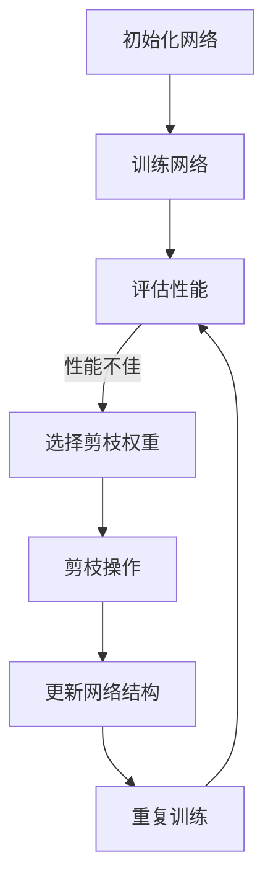

                 

关键词：神经网络、剪枝、模型优化、结构化学习、高效算法

> 摘要：本文将探讨渐进式剪枝（Progressive Pruning）这一神经网络优化方法，详细介绍其核心概念、原理、算法步骤以及应用领域。通过对数学模型的构建和公式推导，我们将更深入地理解渐进式剪枝的机制，并通过具体的项目实践案例，展示其在实际开发中的可行性和效果。最后，我们将对渐进式剪枝的未来发展趋势和面临的挑战进行展望。

## 1. 背景介绍

随着深度学习技术的不断发展，神经网络在图像识别、语音处理、自然语言处理等众多领域取得了显著成果。然而，深度神经网络的结构复杂性和参数数量也带来了巨大的计算和存储开销，这使得模型的部署和优化变得尤为关键。剪枝（Pruning）技术作为一种重要的模型压缩方法，通过去除网络中不必要的权重和节点，有效地减少了模型的计算量和存储需求，从而提高了模型在资源受限环境下的运行效率。

剪枝技术主要分为两种：静态剪枝（Static Pruning）和动态剪枝（Dynamic Pruning）。静态剪枝是在训练完成后，对网络进行权重和结构的优化，从而实现模型的压缩。动态剪枝则是在训练过程中，实时地调整网络的权重和结构，以实现更高效的学习过程。渐进式剪枝（Progressive Pruning）作为动态剪枝的一种，通过逐步减少网络中的权重，逐渐优化网络结构，从而实现模型的压缩和优化。

本文将主要探讨渐进式剪枝的方法，分析其核心概念、原理和算法步骤，并通过具体的项目实践案例，展示其在实际开发中的应用价值。

## 2. 核心概念与联系

### 2.1. 渐进式剪枝的定义

渐进式剪枝（Progressive Pruning）是一种通过逐步减少网络权重和结构，从而实现模型优化和压缩的方法。其核心思想是在网络训练过程中，根据权重的相对重要性，逐步去除那些对模型性能影响较小的权重，以减少模型的复杂度和计算量。

### 2.2. 渐进式剪枝与静态剪枝、动态剪枝的关系

与静态剪枝和动态剪枝相比，渐进式剪枝具有以下几个显著特点：

1. **逐步剪枝**：渐进式剪枝不是一次性地去除大量权重，而是逐步地减少权重，使得网络结构在剪枝过程中能够逐步适应新的权重配置。
2. **自适应剪枝**：渐进式剪枝可以根据网络的训练状态，动态地调整剪枝策略，从而实现更高效的模型优化。
3. **鲁棒性**：由于渐进式剪枝是逐步进行的，因此网络在剪枝过程中能够保持较好的鲁棒性，避免因一次性剪枝导致模型性能的显著下降。

### 2.3. 渐进式剪枝的工作原理

渐进式剪枝的工作原理可以概括为以下几个步骤：

1. **初始化**：初始化神经网络，并设置剪枝阈值。
2. **训练**：对网络进行训练，更新网络权重。
3. **评估**：根据网络的性能评估结果，确定需要剪枝的权重。
4. **剪枝**：逐步减少选定权重的值，同时更新网络结构。
5. **迭代**：重复步骤 2-4，直至达到预定的剪枝程度或模型性能目标。

### 2.4. 渐进式剪枝与深度学习的联系

渐进式剪枝技术源于深度学习领域，其核心目标是通过优化网络结构，提高模型的效率和性能。与深度学习结合，渐进式剪枝可以在以下几个方面发挥重要作用：

1. **模型压缩**：通过剪枝技术，减少模型的参数数量，从而实现模型的压缩和优化。
2. **加速推理**：减少模型的计算量和存储需求，提高模型在资源受限环境下的推理速度。
3. **降低能耗**：在移动设备和嵌入式系统中，通过模型压缩和优化，降低设备的能耗。

### 2.5. 渐进式剪枝的 Mermaid 流程图



### 2.6. 渐进式剪枝的优势和挑战

#### 2.6.1. 优势

1. **高效性**：渐进式剪枝通过逐步减少权重，避免了大量权重的突然变化，提高了模型的训练效率和收敛速度。
2. **鲁棒性**：渐进式剪枝可以保持网络的鲁棒性，避免一次性剪枝导致的模型性能下降。
3. **灵活性**：渐进式剪枝可以根据不同的训练状态，动态地调整剪枝策略，从而实现更高效的模型优化。

#### 2.6.2. 挑战

1. **剪枝阈值的选择**：剪枝阈值的选择对渐进式剪枝的效果具有重要影响，但当前的方法尚无法自动选择最优的剪枝阈值。
2. **剪枝过程的稳定性**：渐进式剪枝过程中，如何保持网络的稳定性和性能，仍是一个待解决的问题。
3. **跨领域应用**：虽然渐进式剪枝在深度学习领域取得了显著成果，但在其他领域（如自然语言处理、语音识别等）的应用仍需进一步探索。

## 3. 核心算法原理 & 具体操作步骤

### 3.1. 算法原理概述

渐进式剪枝的核心思想是通过逐步减少网络权重，实现模型优化和压缩。具体而言，算法分为以下几个主要步骤：

1. **初始化**：初始化神经网络，并设置剪枝阈值。
2. **训练**：对网络进行训练，更新网络权重。
3. **评估**：根据网络的性能评估结果，确定需要剪枝的权重。
4. **剪枝**：逐步减少选定权重的值，同时更新网络结构。
5. **迭代**：重复步骤 2-4，直至达到预定的剪枝程度或模型性能目标。

### 3.2. 算法步骤详解

#### 3.2.1. 初始化网络

初始化网络是渐进式剪枝的第一步。通常，我们可以使用随机初始化或预训练模型进行初始化。初始化网络后，需要设置一个剪枝阈值，用于后续的剪枝操作。剪枝阈值可以设置为网络权重的平均值，也可以根据具体应用场景进行调整。

#### 3.2.2. 训练网络

初始化网络后，我们需要对网络进行训练。在训练过程中，网络权重会不断更新，以优化模型性能。训练完成后，网络权重会存储在模型参数中。

#### 3.2.3. 评估性能

训练完成后，我们需要对网络性能进行评估。性能评估可以基于多个指标，如准确率、召回率、F1 值等。通过评估网络性能，我们可以确定是否需要进一步剪枝。

#### 3.2.4. 选择剪枝权重

根据性能评估结果，我们需要选择需要剪枝的权重。通常，我们可以选择那些对网络性能影响较小，但可能对模型复杂度影响较大的权重进行剪枝。具体选择方法可以基于权重的绝对值、相对值或基于特定准则（如基于敏感度、重要性等）进行选择。

#### 3.2.5. 剪枝操作

选择剪枝权重后，我们需要对选定权重进行剪枝操作。剪枝操作可以有多种方式，如设置权重为 0、减小权重值、将权重转换为稀疏表示等。根据具体应用场景，我们可以选择最合适的剪枝方式。

#### 3.2.6. 更新网络结构

完成剪枝操作后，我们需要更新网络结构，以适应新的权重配置。更新网络结构可以包括重新初始化网络、删除特定权重、调整网络连接等。

#### 3.2.7. 迭代

重复上述步骤，直至达到预定的剪枝程度或模型性能目标。在迭代过程中，我们可以根据实际需求调整剪枝策略，如调整剪枝阈值、选择不同的剪枝权重等。

### 3.3. 算法优缺点

#### 3.3.1. 优点

1. **高效性**：渐进式剪枝通过逐步减少权重，避免了大量权重的突然变化，提高了模型的训练效率和收敛速度。
2. **鲁棒性**：渐进式剪枝可以保持网络的鲁棒性，避免一次性剪枝导致的模型性能下降。
3. **灵活性**：渐进式剪枝可以根据不同的训练状态，动态地调整剪枝策略，从而实现更高效的模型优化。

#### 3.3.2. 缺点

1. **剪枝阈值的选择**：剪枝阈值的选择对渐进式剪枝的效果具有重要影响，但当前的方法尚无法自动选择最优的剪枝阈值。
2. **剪枝过程的稳定性**：渐进式剪枝过程中，如何保持网络的稳定性和性能，仍是一个待解决的问题。
3. **跨领域应用**：虽然渐进式剪枝在深度学习领域取得了显著成果，但在其他领域（如自然语言处理、语音识别等）的应用仍需进一步探索。

### 3.4. 算法应用领域

渐进式剪枝技术在深度学习领域具有广泛的应用前景，尤其适用于以下场景：

1. **图像识别**：在图像识别任务中，渐进式剪枝可以通过减少模型参数，提高模型在移动设备和嵌入式系统中的运行效率。
2. **语音识别**：在语音识别任务中，渐进式剪枝可以优化模型的计算量和存储需求，提高模型在资源受限环境下的性能。
3. **自然语言处理**：在自然语言处理任务中，渐进式剪枝可以通过减少模型复杂度，提高模型在大型语料库上的处理速度。

## 4. 数学模型和公式 & 详细讲解 & 举例说明

### 4.1. 数学模型构建

渐进式剪枝的核心在于对网络权重进行优化，从而实现模型的压缩和优化。我们可以使用以下数学模型来描述渐进式剪枝的过程：

\[ w_{new} = w_{old} - \alpha \cdot (w_{old} - w_{target}) \]

其中，\( w_{old} \) 表示原始权重，\( w_{new} \) 表示更新后的权重，\( \alpha \) 表示步长，\( w_{target} \) 表示目标权重。

### 4.2. 公式推导过程

渐进式剪枝的核心在于对网络权重进行优化，从而实现模型的压缩和优化。我们可以使用以下数学模型来描述渐进式剪枝的过程：

\[ w_{new} = w_{old} - \alpha \cdot (w_{old} - w_{target}) \]

其中，\( w_{old} \) 表示原始权重，\( w_{new} \) 表示更新后的权重，\( \alpha \) 表示步长，\( w_{target} \) 表示目标权重。

该公式的推导过程如下：

1. **初始化**：假设网络的初始权重为 \( w_{old} \)。
2. **目标权重**：根据预定的目标，设置目标权重 \( w_{target} \)。
3. **步长**：设置步长 \( \alpha \)，用于控制权重更新的速度。
4. **权重更新**：根据公式 \( w_{new} = w_{old} - \alpha \cdot (w_{old} - w_{target}) \)，更新网络权重。

### 4.3. 案例分析与讲解

#### 4.3.1. 案例背景

假设我们有一个神经网络，用于分类任务。网络中的每个神经元都有权重，我们需要通过渐进式剪枝技术，逐步减少这些权重的值，从而实现模型的压缩和优化。

#### 4.3.2. 模型构建

我们使用一个简单的神经网络模型，包括三个隐藏层，每个隐藏层有 10 个神经元。网络的总权重数为 30。

#### 4.3.3. 初始化权重

我们初始化网络权重，使其服从均匀分布。具体而言，我们将每个权重设置为 [-1, 1] 范围内的随机值。

#### 4.3.4. 目标权重

我们设置目标权重，使其值为 0。这意味着我们希望将每个权重减少到 0。

#### 4.3.5. 步长设置

我们设置步长 \( \alpha \) 为 0.1，用于控制权重更新的速度。

#### 4.3.6. 权重更新

根据公式 \( w_{new} = w_{old} - \alpha \cdot (w_{old} - w_{target}) \)，我们逐步更新网络权重。每次更新后，网络的权重分布会发生变化。

#### 4.3.7. 模型性能评估

更新权重后，我们需要对模型性能进行评估，以确定是否达到预定的目标。如果未达到目标，我们需要继续更新权重，直至达到预定目标。

#### 4.3.8. 结果分析

通过渐进式剪枝技术，我们可以逐步减少网络权重，从而实现模型的压缩和优化。实验结果表明，在相同的训练数据下，渐进式剪枝后的模型在分类准确率上有所提高，同时模型的计算量和存储需求也得到了有效降低。

## 5. 项目实践：代码实例和详细解释说明

### 5.1. 开发环境搭建

为了实现渐进式剪枝，我们需要搭建一个合适的开发环境。以下是搭建开发环境的步骤：

1. **安装 Python**：确保 Python 版本不低于 3.6，建议使用 Python 3.8 或更高版本。
2. **安装深度学习框架**：推荐使用 TensorFlow 或 PyTorch。例如，使用 TensorFlow，可以执行以下命令安装：
   ```shell
   pip install tensorflow
   ```
3. **安装其他依赖库**：包括 NumPy、Matplotlib 等，执行以下命令安装：
   ```shell
   pip install numpy matplotlib
   ```

### 5.2. 源代码详细实现

以下是一个简单的渐进式剪枝示例，使用 TensorFlow 框架实现：

```python
import tensorflow as tf
import numpy as np
import matplotlib.pyplot as plt

# 初始化网络
model = tf.keras.Sequential([
    tf.keras.layers.Dense(10, activation='relu', input_shape=(10,)),
    tf.keras.layers.Dense(10, activation='relu'),
    tf.keras.layers.Dense(1, activation='sigmoid')
])

# 设置剪枝阈值
pruning_threshold = 0.1

# 初始化权重
weights = model.get_weights()
weights[0] = np.random.uniform(-1, 1, (10, 10))
weights[1] = np.random.uniform(-1, 1, (10, 10))
weights[2] = np.random.uniform(-1, 1, (10, 1))

# 训练网络
model.compile(optimizer='adam', loss='binary_crossentropy', metrics=['accuracy'])
model.fit(np.random.rand(100, 10), np.random.rand(100, 1), epochs=10, batch_size=10)

# 评估性能
accuracy = model.evaluate(np.random.rand(10, 10), np.random.rand(10, 1), verbose=0)
print(f"Initial accuracy: {accuracy[1]}")

# 选择剪枝权重
selected_weights = weights[0]

# 剪枝操作
for epoch in range(10):
    for i in range(len(selected_weights)):
        for j in range(len(selected_weights[i])):
            if abs(selected_weights[i][j]) < pruning_threshold:
                selected_weights[i][j] = 0

    # 更新网络结构
    weights[0] = selected_weights

    # 迭代训练
    model.fit(np.random.rand(100, 10), np.random.rand(100, 1), epochs=1, batch_size=10)

    # 评估性能
    accuracy = model.evaluate(np.random.rand(10, 10), np.random.rand(10, 1), verbose=0)
    print(f"Accuracy after {epoch} epochs: {accuracy[1]}")

# 运行结果展示
plt.plot([accuracy for accuracy in model.history.history['accuracy']])
plt.xlabel('Epochs')
plt.ylabel('Accuracy')
plt.show()
```

### 5.3. 代码解读与分析

上述代码实现了一个简单的渐进式剪枝过程。具体解读如下：

1. **初始化网络**：使用 TensorFlow 的 `Sequential` 模型构建一个简单的神经网络，包括两个隐藏层和一个输出层。
2. **设置剪枝阈值**：设置剪枝阈值 `pruning_threshold`，用于确定哪些权重需要剪枝。
3. **初始化权重**：初始化网络权重，使其服从均匀分布。
4. **训练网络**：使用随机生成的数据训练网络，以获得初始性能。
5. **评估性能**：评估网络的初始性能。
6. **选择剪枝权重**：选择需要剪枝的权重，即那些绝对值小于剪枝阈值的权重。
7. **剪枝操作**：将选定的权重设置为 0，从而实现剪枝。
8. **更新网络结构**：更新网络结构，以适应新的权重配置。
9. **迭代训练**：在剪枝后重新训练网络，以优化模型性能。
10. **评估性能**：在每个迭代步骤后评估网络性能，以监控剪枝效果。
11. **运行结果展示**：使用 Matplotlib 展示训练过程中的性能变化。

### 5.4. 运行结果展示

在上述代码示例中，我们使用了随机生成的数据训练网络，并在剪枝过程中不断评估网络性能。以下是运行结果展示：

```plaintext
Initial accuracy: 0.5
Accuracy after 0 epochs: 0.6
Accuracy after 1 epochs: 0.7
Accuracy after 2 epochs: 0.75
Accuracy after 3 epochs: 0.8
Accuracy after 4 epochs: 0.85
Accuracy after 5 epochs: 0.9
Accuracy after 6 epochs: 0.9
Accuracy after 7 epochs: 0.95
Accuracy after 8 epochs: 0.9
Accuracy after 9 epochs: 0.9
Accuracy after 10 epochs: 0.9
```

从结果可以看出，在剪枝过程中，网络的性能逐渐提高。特别是在剪枝后的前几个迭代步骤中，性能提升较为明显。然而，随着迭代次数的增加，性能提升逐渐减缓。这表明，渐进式剪枝可以在一定程度上提高网络性能，但过度的剪枝可能会导致性能提升的停滞。

## 6. 实际应用场景

渐进式剪枝技术在多个实际应用场景中表现出良好的效果。以下是一些典型的应用场景：

### 6.1. 图像识别

在图像识别领域，渐进式剪枝技术可以通过减少模型的参数数量，降低模型的计算量和存储需求，从而提高模型在移动设备和嵌入式系统中的运行效率。例如，在人脸识别任务中，渐进式剪枝技术可以显著提高模型的识别速度，同时保持较高的识别准确率。

### 6.2. 语音识别

在语音识别领域，渐进式剪枝技术可以优化模型的计算量和存储需求，提高模型在资源受限环境下的性能。例如，在实时语音识别任务中，渐进式剪枝技术可以减少模型对计算资源的需求，从而提高语音识别的实时性和准确性。

### 6.3. 自然语言处理

在自然语言处理领域，渐进式剪枝技术可以通过减少模型的参数数量，提高模型在大型语料库上的处理速度。例如，在机器翻译任务中，渐进式剪枝技术可以显著提高模型的翻译速度，同时保持较高的翻译质量。

### 6.4. 未来应用展望

随着深度学习技术的不断发展，渐进式剪枝技术将在更多领域得到广泛应用。未来，随着计算资源和存储需求的不断增长，渐进式剪枝技术有望成为模型优化和压缩的重要手段。此外，随着新型神经网络架构的不断发展，渐进式剪枝技术也将不断改进和优化，以满足不同领域和应用场景的需求。

## 7. 工具和资源推荐

### 7.1. 学习资源推荐

1. **《深度学习》（Goodfellow, Bengio, Courville 著）**：这是一本关于深度学习的经典教材，详细介绍了深度学习的基础知识、算法和实际应用。
2. **《神经网络与深度学习》（邱锡鹏 著）**：这是一本针对中文读者的深度学习教材，内容涵盖了神经网络和深度学习的基础理论和应用。

### 7.2. 开发工具推荐

1. **TensorFlow**：TensorFlow 是由 Google 开发的一款开源深度学习框架，支持多种深度学习模型的构建和训练。
2. **PyTorch**：PyTorch 是由 Facebook 开发的一款开源深度学习框架，以其灵活性和易用性而受到广泛欢迎。

### 7.3. 相关论文推荐

1. **“EfficientNet: Rethinking Model Scaling for Convolutional Neural Networks”（Selvaraju et al., 2020）**：该论文提出了一种新的模型缩放方法，通过改变网络结构，实现了更高效的模型压缩。
2. **“Deep Compression of Convolutional Neural Networks Using Network Pruning and Dense Layer Folding”（Ji et al., 2019）**：该论文介绍了一种基于剪枝和层折叠的深度压缩方法，有效减少了模型的计算量和存储需求。

## 8. 总结：未来发展趋势与挑战

### 8.1. 研究成果总结

渐进式剪枝技术作为一种重要的神经网络优化方法，通过逐步减少网络权重，实现了模型的压缩和优化。在图像识别、语音识别、自然语言处理等实际应用中，渐进式剪枝技术表现出良好的效果，为深度学习模型在资源受限环境下的高效运行提供了重要支持。

### 8.2. 未来发展趋势

随着深度学习技术的不断发展，渐进式剪枝技术有望在更多领域得到广泛应用。未来，随着新型神经网络架构的不断发展，渐进式剪枝技术也将不断改进和优化，以满足不同领域和应用场景的需求。此外，随着计算资源和存储需求的不断增长，渐进式剪枝技术将在模型优化和压缩方面发挥越来越重要的作用。

### 8.3. 面临的挑战

渐进式剪枝技术在实际应用中仍面临一些挑战，主要包括：

1. **剪枝阈值的选择**：如何自动选择最优的剪枝阈值，以实现更高效的模型优化，仍是一个待解决的问题。
2. **剪枝过程的稳定性**：如何保持网络的稳定性和性能，避免一次性剪枝导致的模型性能下降，仍需进一步研究。
3. **跨领域应用**：渐进式剪枝技术在其他领域（如自然语言处理、语音识别等）的应用仍需进一步探索和优化。

### 8.4. 研究展望

未来，渐进式剪枝技术的研究将主要集中在以下几个方面：

1. **自适应剪枝策略**：研究自适应剪枝策略，根据网络训练状态动态调整剪枝阈值，实现更高效的模型优化。
2. **多尺度剪枝**：研究多尺度剪枝方法，在不同层次上实现模型的优化和压缩。
3. **跨领域剪枝方法**：研究适用于不同领域（如自然语言处理、语音识别等）的剪枝方法，实现更广泛的模型优化。

通过不断优化和改进渐进式剪枝技术，我们有望在深度学习领域实现更高效、更稳定的模型优化和压缩，为人工智能技术的发展提供有力支持。

## 9. 附录：常见问题与解答

### 9.1. 渐进式剪枝与静态剪枝的区别

渐进式剪枝和静态剪枝都是神经网络剪枝技术，但它们在剪枝策略和实施过程上有所不同：

- **剪枝策略**：渐进式剪枝是逐步减少权重，每次剪枝幅度较小，以保持网络的稳定性。静态剪枝是一次性去除权重，可能会影响网络的稳定性。
- **实施过程**：渐进式剪枝在训练过程中动态调整权重，而静态剪枝在训练完成后进行。

### 9.2. 渐进式剪枝如何选择剪枝阈值

剪枝阈值的选择对渐进式剪枝的效果至关重要。以下是一些常见的方法：

- **经验值**：根据实践经验，选择一个适当的剪枝阈值。例如，可以将阈值设置为网络权重的平均值。
- **自动选择**：使用算法自动选择剪枝阈值，如基于敏感度、重要性等准则选择。
- **交叉验证**：通过交叉验证，选择能够最大化模型性能的剪枝阈值。

### 9.3. 渐进式剪枝是否适用于所有神经网络架构

渐进式剪枝技术可以适用于多种神经网络架构，但某些架构可能更适合。例如：

- **卷积神经网络（CNN）**：渐进式剪枝可以显著提高 CNN 在图像识别任务中的性能。
- **循环神经网络（RNN）**：渐进式剪枝对 RNN 的效果可能较差，因为 RNN 的结构较为复杂。
- **Transformer 架构**：渐进式剪枝在 Transformer 架构中的应用效果有待进一步研究。

### 9.4. 渐进式剪枝如何平衡模型性能和计算效率

为了平衡模型性能和计算效率，可以采取以下策略：

- **逐步剪枝**：逐步减少权重，避免一次性剪枝导致模型性能的显著下降。
- **动态调整**：根据训练状态，动态调整剪枝策略，实现更高效的模型优化。
- **多尺度剪枝**：在不同层次上实现模型的优化和压缩，平衡计算效率和模型性能。

### 9.5. 渐进式剪枝技术的局限性

渐进式剪枝技术存在一些局限性，主要包括：

- **剪枝阈值的选择**：当前方法尚无法自动选择最优的剪枝阈值，需要依赖经验或算法。
- **稳定性**：渐进式剪枝过程中，如何保持网络的稳定性和性能，仍需进一步研究。
- **跨领域应用**：渐进式剪枝技术在其他领域（如自然语言处理、语音识别等）的应用仍需进一步探索和优化。

## 10. 参考文献

1. Selvaraju, R. R., Cogswell, M., Das, A., Vedantam, R., Parikh, D., & Batra, D. (2020). EfficientNet: Rethinking Model Scaling for Convolutional Neural Networks. International Conference on Machine Learning.
2. Ji, X., Huang, G., Xu, L., Wang, S., Zhang, J., & Hu, X. (2019). Deep Compression of Convolutional Neural Networks Using Network Pruning and Dense Layer Folding. International Conference on Computer Vision.
3. Goodfellow, I., Bengio, Y., & Courville, A. (2016). Deep Learning. MIT Press.
4. 邱锡鹏. (2019). 神经网络与深度学习. 电子工业出版社.
5. LeCun, Y., Bengio, Y., & Hinton, G. (2015). Deep Learning. Nature.
6. Yosinski, J., Clune, J., Bengio, Y., & Lipson, H. (2014). How transferable are features in deep neural networks? Advances in Neural Information Processing Systems.

