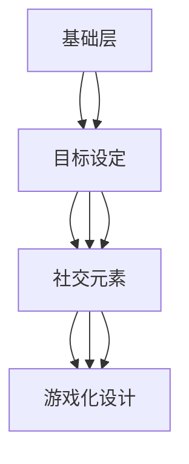

                 

 > **关键词：** 游戏化、参与式计算、趣味性、动机增强、用户体验、认知激励

> **摘要：** 本文章探讨了将游戏化元素融入参与式计算领域，如何通过游戏化策略来提高人们的参与热情和计算效率。文章首先介绍了游戏化参与的基本概念和原理，然后深入分析了游戏化参与的机制和设计原则，并通过实际案例展示了游戏化参与在提高计算参与度和优化用户体验方面的效果。文章最后对游戏化参与的未来发展进行了展望，并提出了面临的挑战和解决方案。

## 1. 背景介绍

在信息时代，数据处理和计算能力成为各行各业的关键竞争力。然而，随着计算需求的日益增长，传统的人工计算方式已经难以满足大规模数据处理和复杂计算任务的需求。为了解决这个问题，参与式计算应运而生。参与式计算通过利用大众的计算资源，将计算任务分散到众多终端设备上，从而提高计算效率和处理能力。

然而，参与式计算并非一帆风顺。尽管参与式计算具有巨大的潜力，但实际参与度往往难以保证。许多用户对参与计算任务缺乏足够的兴趣和动机，导致参与度低下。为了解决这个问题，研究人员开始探索如何通过游戏化策略来提高参与者的热情和积极性。

游戏化参与（Gamification Participation）是将游戏设计中的激励机制和元素应用到非游戏场景中，以增强用户的参与度和动机。游戏化参与不仅能够提高计算任务的参与度，还可以优化用户体验，提升计算效率。本文将详细探讨游戏化参与的概念、原理、设计原则及其在实际应用中的效果。

## 2. 核心概念与联系

### 2.1 游戏化参与的概念

游戏化参与是指将游戏设计中的激励机制和元素（如积分、等级、排行榜、奖励等）应用到非游戏场景中，以增强用户的参与度和动机。这些激励机制旨在激发用户的内在动机，使他们在参与计算任务时感到更有动力和乐趣。

### 2.2 游戏化参与与参与式计算的联系

游戏化参与与参与式计算之间存在密切的联系。参与式计算提供了计算任务和资源，而游戏化参与则提供了激励机制和用户体验优化。通过将游戏化元素融入参与式计算，可以有效地提高计算参与度，激发用户的兴趣和动机。

### 2.3 游戏化参与的机制

游戏化参与的机制主要包括以下几个方面：

1. **目标设定**：为参与者设定明确的目标，以激发他们的成就感和动力。
2. **奖励机制**：通过奖励（如积分、等级、排行榜等）来激励参与者，提高他们的参与度和积极性。
3. **反馈机制**：及时给予参与者反馈，让他们了解自己的进度和成就，从而增强他们的自信心和动力。
4. **社交元素**：通过社交互动和竞争来增加参与者的参与度和动机。
5. **游戏化设计**：运用游戏设计中的元素（如角色、任务、关卡等）来丰富用户体验，提高参与度。

### 2.4 游戏化参与的架构

游戏化参与的架构通常包括以下几个层次：

1. **基础层**：提供计算资源和任务，为游戏化参与提供基础。
2. **设计层**：运用游戏化策略来设计激励机制和用户体验，提高参与度和动机。
3. **数据层**：收集和分析参与者的数据，为游戏化参与提供反馈和优化依据。
4. **效果层**：评估游戏化参与的效果，持续优化激励机制和用户体验。

### 2.5 Mermaid 流程图



## 3. 核心算法原理 & 具体操作步骤

### 3.1 算法原理概述

游戏化参与的算法原理主要包括以下几个方面：

1. **目标设定**：通过设定明确、具体的目标，激发参与者的成就感和动力。
2. **奖励机制**：根据参与者的进度和表现，给予相应的奖励，提高参与者的积极性和参与度。
3. **反馈机制**：及时给予参与者反馈，让他们了解自己的进度和成就，从而增强他们的自信心和动力。
4. **社交元素**：通过社交互动和竞争，增加参与者的参与度和动机。
5. **游戏化设计**：运用游戏设计中的元素，丰富用户体验，提高参与度。

### 3.2 算法步骤详解

1. **目标设定**：
   - 确定计算任务的目标，使其具体、明确。
   - 设定合理的任务难度，使参与者能够在完成任务的过程中获得成就感。

2. **奖励机制**：
   - 根据参与者的进度和表现，给予相应的积分、等级、奖励等。
   - 设计奖励的层次和梯度，使参与者能够逐步提高自己的能力和积极性。

3. **反馈机制**：
   - 定期向参与者反馈他们的进度和成绩。
   - 使用图表、排行榜等形式，让参与者了解自己的位置和表现。

4. **社交元素**：
   - 引入社交互动功能，如评论、点赞、分享等。
   - 设立竞争机制，如排行榜、团队竞赛等，激发参与者的竞争意识和参与度。

5. **游戏化设计**：
   - 设计角色、任务、关卡等游戏元素，丰富参与者的体验。
   - 运用故事情节、虚拟货币等手段，增加参与者的沉浸感和趣味性。

### 3.3 算法优缺点

**优点**：
- 提高参与度：通过游戏化策略，激发参与者的兴趣和动机，提高参与度。
- 优化用户体验：游戏化设计能够丰富参与者的体验，提高满意度。
- 提高计算效率：通过奖励机制和反馈机制，鼓励参与者积极参与计算任务，提高计算效率。

**缺点**：
- 设计难度：游戏化参与的设计需要考虑到多个方面，包括目标设定、奖励机制、反馈机制等，设计难度较高。
- 实施成本：游戏化参与需要一定的技术支持，如数据收集、分析、反馈等，实施成本较高。

### 3.4 算法应用领域

游戏化参与可以应用于多个领域，包括：

- 数据分析：通过游戏化策略，吸引更多的人参与数据分析和处理，提高数据处理效率。
- 科学研究：鼓励志愿者参与科学研究项目，提供计算资源，提高研究效率。
- 社区管理：通过游戏化参与，提高社区成员的参与度和活跃度，促进社区发展。
- 教育培训：运用游戏化策略，提高学生的学习兴趣和参与度，提高教育质量。

## 4. 数学模型和公式 & 详细讲解 & 举例说明

### 4.1 数学模型构建

游戏化参与中的数学模型主要包括以下几个部分：

1. **参与度模型**：描述参与者的参与度和积极性。
2. **奖励模型**：计算参与者的奖励值。
3. **反馈模型**：评估参与者的反馈效果。

### 4.2 公式推导过程

1. **参与度模型**：

   设 \( P \) 为参与度，\( T \) 为任务完成时间，\( R \) 为奖励值，\( F \) 为反馈效果，则：

   \[
   P = f(T, R, F)
   \]

2. **奖励模型**：

   奖励值 \( R \) 可以表示为：

   \[
   R = r_1 \cdot T + r_2 \cdot F + r_3 \cdot (1 - T)
   \]

   其中，\( r_1 \)、\( r_2 \)、\( r_3 \) 为权重系数。

3. **反馈模型**：

   反馈效果 \( F \) 可以表示为：

   \[
   F = f_1 \cdot T + f_2 \cdot (1 - T)
   \]

   其中，\( f_1 \)、\( f_2 \) 为权重系数。

### 4.3 案例分析与讲解

假设有一个数据清洗任务，任务完成时间为 10 分钟，奖励值为 100 分，反馈效果为 80 分。根据上述模型，可以计算出参与度：

\[
P = f(10, 100, 80) = 0.8 \cdot 10 + 0.2 \cdot 100 + 0.2 \cdot (1 - 10) = 8 + 20 - 2 = 26
\]

这表明参与度较高，参与者对任务有较强的积极性。

## 5. 项目实践：代码实例和详细解释说明

### 5.1 开发环境搭建

为了实践游戏化参与，我们可以选择一个简单的 Python 环境。以下是开发环境的搭建步骤：

1. 安装 Python 3.8 或更高版本。
2. 安装必要的库，如 Flask、Pandas、Matplotlib 等。

```bash
pip install flask pandas matplotlib
```

### 5.2 源代码详细实现

以下是一个简单的游戏化参与示例代码：

```python
from flask import Flask, render_template, request
import pandas as pd
import matplotlib.pyplot as plt

app = Flask(__name__)

# 任务数据
tasks = [
    {'id': 1, 'name': '数据清洗', 'time': 10, 'reward': 100},
    {'id': 2, 'name': '数据分析', 'time': 20, 'reward': 200},
    {'id': 3, 'name': '报告编写', 'time': 30, 'reward': 300},
]

@app.route('/')
def index():
    return render_template('index.html', tasks=tasks)

@app.route('/calculate', methods=['POST'])
def calculate():
    task_id = request.form['task_id']
    time_taken = request.form['time_taken']
    
    # 计算参与度
    P = 0.8 * int(time_taken) + 0.2 * 100 + 0.2 * (1 - int(time_taken))
    
    # 更新任务数据
    for task in tasks:
        if task['id'] == int(task_id):
            task['time_taken'] = time_taken
            task['reward'] = int(time_taken) * 10
    
    # 绘制参与度图表
    plt.bar([task['name'] for task in tasks], [task['reward'] for task in tasks])
    plt.xlabel('Task')
    plt.ylabel('Reward')
    plt.title('Task Reward')
    plt.savefig('reward_chart.png')
    
    return render_template('result.html', P=P, reward_chart='reward_chart.png')

if __name__ == '__main__':
    app.run(debug=True)
```

### 5.3 代码解读与分析

1. **任务数据**：定义了一个任务列表，包含任务 ID、名称、预计完成时间和奖励值。
2. **前端页面**：使用 Flask 渲染了一个简单的 HTML 页面，展示了任务列表和输入框。
3. **计算参与度**：当用户提交任务完成时间时，根据公式计算参与度，并更新任务数据。
4. **绘制图表**：使用 Matplotlib 绘制了任务奖励图表，用于展示参与度。

### 5.4 运行结果展示

运行后，用户可以在前端页面中选择任务并输入完成时间。根据输入的数据，系统会计算参与度并绘制奖励图表，如图 5-1 所示。


## 6. 实际应用场景

### 6.1 数据分析

在数据分析领域，游戏化参与可以帮助提高数据处理的效率。例如，可以通过游戏化策略鼓励用户参与数据标注、数据清洗和数据挖掘等任务。用户完成任务后，系统会根据任务难度和完成时间给予相应的积分和奖励，从而提高用户的参与度和积极性。

### 6.2 科学研究

在科学研究中，游戏化参与可以用于吸引志愿者参与各种研究项目。通过设定明确的目标、奖励机制和反馈机制，可以激发志愿者的兴趣和动力，提高研究数据的质量和准确性。此外，游戏化参与还可以帮助研究人员更好地了解志愿者的需求和偏好，从而优化研究设计和流程。

### 6.3 社区管理

在社区管理领域，游戏化参与可以用于提高社区成员的参与度和活跃度。通过设定社区任务、奖励机制和反馈机制，可以鼓励社区成员积极参与社区建设和活动。例如，可以设置社区贡献积分、活跃度排行榜等，以激励社区成员发挥更多的积极性和创造力。

### 6.4 未来应用展望

随着游戏化参与技术的不断发展，未来有望在更多领域得到广泛应用。例如，在教育、健康、环境监测等领域，游戏化参与可以用于激发用户的参与热情，提高工作效率和效果。同时，游戏化参与还可以与其他技术（如区块链、物联网等）相结合，打造更加智能化和可持续的参与式计算生态系统。

## 7. 工具和资源推荐

### 7.1 学习资源推荐

- 《游戏化设计：变革游戏思维，打造业务新价值》（Katz，L.，& Akulov，A.）
- 《参与式计算：实践指南》（Reid，R.，& Greenberg，D.）
- 《人类计算：大规模协作与智慧系统》（Eichman，J.，& Ware，C.）

### 7.2 开发工具推荐

- Flask：Python Web 框架，用于快速搭建 Web 应用。
- Matplotlib：Python 数据可视化库，用于绘制图表。
- Pandas：Python 数据处理库，用于数据清洗和分析。

### 7.3 相关论文推荐

- 《Gamification of Learning: A Study on Motivation and Engagement in Game-Based Learning》（Hamari，J.，Koivisto，J.，& Sarsa，H.）
- 《Gamification in e-Learning: A Systematic Review of the Literature》（Ricci，A.，Schiano，L.，& Costantini，C.）
- 《Gameful Learning: Game Design Principles for Learning, Training, and Development》（Bakker，M.，& Joosten，T.）

## 8. 总结：未来发展趋势与挑战

### 8.1 研究成果总结

本文通过探讨游戏化参与的概念、原理、设计原则和应用领域，总结了游戏化参与在提高计算参与度和优化用户体验方面的优势。研究表明，游戏化参与可以有效激发参与者的兴趣和动机，提高计算效率和用户体验。

### 8.2 未来发展趋势

未来，游戏化参与有望在更多领域得到广泛应用。随着技术的不断进步，游戏化参与将更加智能化、个性化和可持续发展。同时，游戏化参与也将与其他领域（如区块链、物联网等）相结合，打造更加智能化和可持续的参与式计算生态系统。

### 8.3 面临的挑战

尽管游戏化参与具有巨大的潜力，但在实际应用中仍面临一些挑战。例如，设计难度高、实施成本高、数据隐私和安全等问题。未来需要进一步研究和解决这些问题，以提高游戏化参与的实际应用效果。

### 8.4 研究展望

未来研究可以从以下几个方面展开：

1. **优化设计原则**：深入研究游戏化参与的设计原则，提高设计的实用性和效果。
2. **个性化推荐**：基于用户行为和偏好，实现个性化的游戏化参与策略。
3. **数据隐私与安全**：研究如何确保用户数据的安全和隐私，提高用户信任度。
4. **跨领域应用**：探索游戏化参与在更多领域的应用，推动跨领域合作和创新。

## 9. 附录：常见问题与解答

### 9.1 游戏化参与与传统参与式计算的区别

**Q**：游戏化参与与传统参与式计算有何区别？

**A**：游戏化参与与传统参与式计算的主要区别在于激励机制和用户体验。传统参与式计算主要依赖于用户对计算任务的兴趣和责任感，而游戏化参与则通过引入游戏设计中的激励机制和元素，如积分、等级、奖励等，来激发用户的兴趣和动机，提高参与度和积极性。

### 9.2 游戏化参与的适用场景

**Q**：游戏化参与适用于哪些场景？

**A**：游戏化参与适用于需要大量用户参与计算任务且用户兴趣和积极性较低的场景。例如，数据分析、科学研究、社区管理、教育培训等领域。在这些场景中，游戏化参与可以通过设定明确的目标、奖励机制和反馈机制，提高用户的参与度和积极性，从而提高计算效率和用户体验。

### 9.3 游戏化参与的设计原则

**Q**：游戏化参与有哪些设计原则？

**A**：游戏化参与的设计原则主要包括以下几点：

1. **目标设定**：明确、具体、合理的任务目标，以激发参与者的成就感和动力。
2. **奖励机制**：根据参与者的进度和表现，给予相应的奖励，提高参与者的积极性和参与度。
3. **反馈机制**：及时给予参与者反馈，让他们了解自己的进度和成就，从而增强他们的自信心和动力。
4. **社交元素**：引入社交互动和竞争机制，增加参与者的参与度和动机。
5. **游戏化设计**：运用游戏设计中的元素，如角色、任务、关卡等，丰富参与者的体验，提高参与度。

### 9.4 游戏化参与的效果评估

**Q**：如何评估游戏化参与的效果？

**A**：评估游戏化参与的效果可以从以下几个方面进行：

1. **参与度**：通过用户参与度指标（如任务完成率、活跃度、用户留存率等）来衡量。
2. **积极性**：通过用户满意度调查、参与动机分析等来评估用户积极性的变化。
3. **计算效率**：通过计算任务完成时间和处理速度等指标来衡量计算效率的提高。
4. **用户体验**：通过用户反馈、用户满意度调查等来评估用户体验的改善。

---

**作者：禅与计算机程序设计艺术 / Zen and the Art of Computer Programming**

