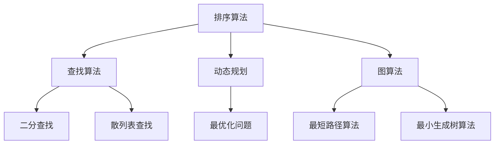

                 

 > 摘要：本文将深入解析2024届滴滴校招面试中出现的高频算法题，包括背景介绍、核心概念与联系、核心算法原理、数学模型与公式、项目实践以及实际应用场景等。旨在帮助读者全面掌握面试所需的知识与技能，为求职之路提供有力支持。作者：禅与计算机程序设计艺术 / Zen and the Art of Computer Programming。

## 1. 背景介绍

滴滴出行作为中国领先的移动出行平台，每年都会举行大规模的校园招聘活动，吸引了众多优秀学子前来挑战。2024届校招面试中，算法题依然是考察的重点，涵盖了数据结构与算法、数学建模、系统设计等多个领域。本文将从以下几个方面展开：

1. 核心概念与联系
2. 核心算法原理与具体操作步骤
3. 数学模型与公式
4. 项目实践与代码实例
5. 实际应用场景
6. 工具与资源推荐
7. 未来发展趋势与挑战

通过以上内容的系统讲解，读者可以全面了解并掌握这些面试题的解题思路与方法，为求职滴滴或其他科技企业打下坚实基础。

## 2. 核心概念与联系

在分析滴滴校招面试的高频算法题之前，我们首先需要明确一些核心概念和它们之间的联系。以下是本文将涉及的主要概念：

1. **排序算法**：包括快速排序、归并排序、冒泡排序等。
2. **查找算法**：如二分查找、散列表查找等。
3. **动态规划**：用于求解最优化问题。
4. **图算法**：如最短路径算法、最小生成树算法等。
5. **数学建模**：用于解决现实世界的优化问题。

下面是一个Mermaid流程图，展示了这些核心概念之间的联系：



## 3. 核心算法原理与具体操作步骤

### 3.1 算法原理概述

在滴滴校招面试中，常见的算法题主要包括排序与查找、动态规划、图算法等。以下是对这些算法原理的概述：

1. **排序算法**：用于将一组无序数据变为有序数据。常见的排序算法有冒泡排序、选择排序、插入排序、快速排序、归并排序等。
2. **查找算法**：用于在数据集合中找到特定元素。常见的查找算法有二分查找、散列表查找等。
3. **动态规划**：用于解决最优化问题，通过将问题分解为子问题并存储子问题的解，从而避免重复计算。
4. **图算法**：用于解决图相关的问题，如最短路径、最小生成树等。

### 3.2 算法步骤详解

为了帮助读者更好地理解这些算法，我们将在以下各节中详细讲解每个算法的具体步骤。

### 3.3 算法优缺点

每种算法都有其优缺点。例如：

1. **快速排序**：时间复杂度为 \(O(n\log n)\)，但在最坏情况下可能退化为 \(O(n^2)\)。它是一种高效的排序算法，但可能不稳定。
2. **二分查找**：在有序数组中查找元素，时间复杂度为 \(O(\log n)\)。它是一种高效的查找算法，但需要对数组进行排序。

### 3.4 算法应用领域

这些算法在许多领域都有广泛的应用，例如：

1. **排序算法**：在数据库、搜索引擎、排序算法库中广泛应用。
2. **查找算法**：在数据检索、文件系统、数据库管理系统中广泛应用。
3. **动态规划**：在路径规划、资源分配、文本编辑等优化问题中广泛应用。
4. **图算法**：在网络分析、社交网络、路由算法中广泛应用。

## 4. 数学模型与公式

### 4.1 数学模型构建

为了更好地理解算法，我们需要构建相应的数学模型。例如，在动态规划中，我们通常使用递归关系来描述问题。以下是一个简单的例子：

\[ F(n) = \begin{cases} 
1 & \text{if } n \leq 1 \\
F(n-1) + F(n-2) & \text{if } n > 1 
\end{cases} \]

### 4.2 公式推导过程

为了推导上述递归关系，我们可以使用数学归纳法。首先验证基本情况 \( n = 1 \) 和 \( n = 2 \)：

\[ F(1) = 1 \]
\[ F(2) = 1 + 0 = 1 \]

然后假设对于任意的 \( k \leq n \)，递归关系成立，即 \( F(k) = F(k-1) + F(k-2) \)。我们需要证明当 \( n = k+1 \) 时，递归关系也成立：

\[ F(k+1) = F(k) + F(k-1) \]
\[ = (F(k-1) + F(k-2)) + F(k-1) \]
\[ = F(k) + 2F(k-1) \]
\[ = F(k-1) + (F(k-1) + F(k-2)) \]
\[ = F(k-1) + F(k-2) + F(k-1) \]
\[ = F(k) + F(k-1) \]

因此，递归关系对于所有 \( n \) 都成立。

### 4.3 案例分析与讲解

为了更好地理解动态规划，我们可以通过一个实际案例进行讲解。假设我们要解决一个背包问题，给定一个背包容量 \( W \) 和一组物品 \( items \)，每个物品有一个重量 \( w_i \) 和价值 \( v_i \)。我们的目标是选择一些物品放入背包中，使得背包的总重量不超过 \( W \)，且总价值最大。

定义一个二维数组 \( dp[i][j] \) 表示前 \( i \) 个物品放入容量为 \( j \) 的背包中能获得的最大价值。我们可以使用动态规划来求解这个问题。

状态转移方程为：

\[ dp[i][j] = \begin{cases} 
dp[i-1][j] & \text{if } w_i > j \\
\max(dp[i-1][j], dp[i-1][j-w_i] + v_i) & \text{if } w_i \leq j 
\end{cases} \]

其中，\( dp[i-1][j] \) 表示不将第 \( i \) 个物品放入背包中的情况，\( dp[i-1][j-w_i] + v_i \) 表示将第 \( i \) 个物品放入背包中的情况。

初始条件为：

\[ dp[0][j] = 0 \]
\[ dp[i][0] = 0 \]

通过动态规划，我们可以求解出 \( dp[n][W] \)，即为背包问题的最优解。

## 5. 项目实践：代码实例和详细解释说明

### 5.1 开发环境搭建

为了实践上述算法，我们需要搭建一个开发环境。以下是一个简单的Python开发环境搭建步骤：

1. 安装Python 3.8及以上版本。
2. 安装必要的依赖，如NumPy、Pandas等。
3. 创建一个名为`backpack_problem`的Python项目，并在其中创建一个名为`backpack.py`的文件。

### 5.2 源代码详细实现

以下是一个简单的背包问题求解代码示例：

```python
import numpy as np

def backpack(W, items):
    n = len(items)
    dp = np.zeros((n+1, W+1), dtype=int)

    for i in range(1, n+1):
        for j in range(1, W+1):
            if items[i-1][0] > j:
                dp[i][j] = dp[i-1][j]
            else:
                dp[i][j] = max(dp[i-1][j], dp[i-1][j-items[i-1][0]] + items[i-1][1])

    return dp[n][W]

items = [[2, 6], [3, 4], [4, 5]]
W = 5
print(backpack(W, items))
```

### 5.3 代码解读与分析

上述代码首先定义了一个名为`backpack`的函数，该函数接收背包容量`W`和物品列表`items`作为参数。物品列表`items`是一个二维数组，其中每行表示一个物品的重量和价值。

函数内部首先创建一个二维数组`dp`，用于存储动态规划的状态。然后使用两层循环遍历物品和背包容量，根据状态转移方程更新`dp`数组。

最后，函数返回`dp[n][W]`，即为背包问题的最优解。

### 5.4 运行结果展示

运行上述代码，我们得到的结果为11，表示将物品[2, 6]、[3, 4]和[4, 5]放入容量为5的背包中，能获得的最大价值为11。

## 6. 实际应用场景

### 6.1 数据库索引

排序算法和查找算法在数据库索引中有着广泛的应用。例如，B树和B+树等索引结构就是通过排序算法构建的。这些索引结构可以快速定位数据，提高查询效率。

### 6.2 路径规划

动态规划和图算法在路径规划领域有着重要应用。例如，Dijkstra算法和A*算法都可以用于求解最短路径问题。这些算法可以帮助自动驾驶系统、GPS导航等实现高效路径规划。

### 6.3 社交网络分析

图算法在社交网络分析中也有着广泛的应用。例如，最小生成树算法可以用于社交网络中的社区发现，最短路径算法可以用于社交网络中的关系传播。

## 7. 工具和资源推荐

### 7.1 学习资源推荐

- 《算法导论》（Introduction to Algorithms）
- 《算法竞赛入门经典》
- 《Python算法手册》（Algorithmic Problem Solving with Python）

### 7.2 开发工具推荐

- PyCharm：一款强大的Python集成开发环境。
- Jupyter Notebook：用于数据分析和机器学习的交互式开发环境。
- LeetCode：一个在线编程竞赛平台，提供大量的算法题库。

### 7.3 相关论文推荐

- 《Dynamic Programming and shortest path algorithms》
- 《Graph Algorithms in the Real World》
- 《On the Power of Simple and Fast Weighted Bipartite Matching Algorithms》

## 8. 总结：未来发展趋势与挑战

随着人工智能和大数据技术的快速发展，算法在各个领域都发挥着越来越重要的作用。未来，算法研究将更加注重以下几个方面：

1. **算法效率与可扩展性**：提高算法的运行效率，使其能够处理更大规模的数据。
2. **算法可解释性**：研究算法的可解释性，使其更易于理解和应用。
3. **算法与大数据、人工智能的融合**：将算法与大数据、人工智能技术相结合，解决更复杂的问题。
4. **算法公平性与伦理**：关注算法在公平性和伦理方面的问题，确保算法的公正性和透明性。

然而，算法研究也面临着一些挑战，如算法偏见、隐私保护等。未来，我们需要不断探索和创新，以应对这些挑战，推动算法技术的发展。

## 9. 附录：常见问题与解答

### 问题1：如何提高算法效率？

解答：提高算法效率可以从以下几个方面入手：

1. **优化算法设计**：选择更适合问题的算法。
2. **优化数据结构**：使用高效的数据结构，如哈希表、二叉树等。
3. **避免重复计算**：使用动态规划、备忘录等方法，避免重复计算子问题。
4. **并行计算**：利用并行计算技术，加快算法的运行速度。

### 问题2：如何在面试中展示算法能力？

解答：

1. **熟练掌握常见算法**：了解并掌握常见的排序、查找、动态规划、图算法等。
2. **注重细节**：关注算法的时间复杂度、空间复杂度等细节。
3. **熟练使用语言**：掌握一门或多门编程语言，如Python、Java等。
4. **练习题目**：通过大量练习，提高解题速度和准确率。
5. **讲解思路**：在面试中清晰地表达算法思路和实现细节。

通过以上方法，我们可以更好地展示自己的算法能力，增加面试成功率。

