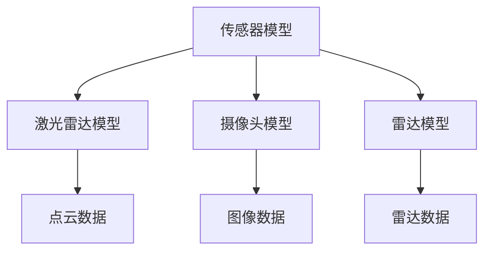
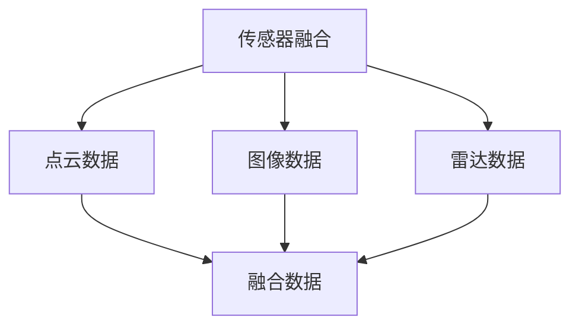
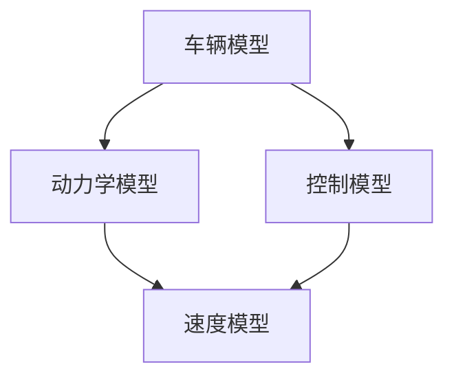
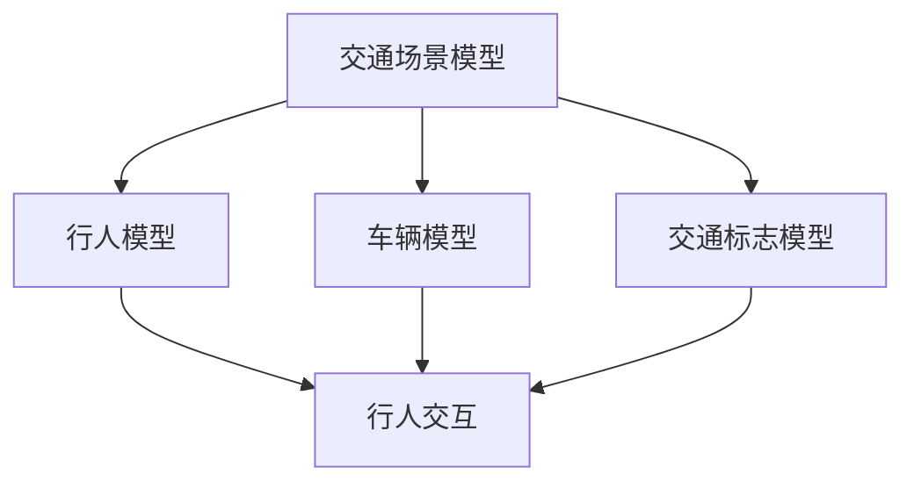
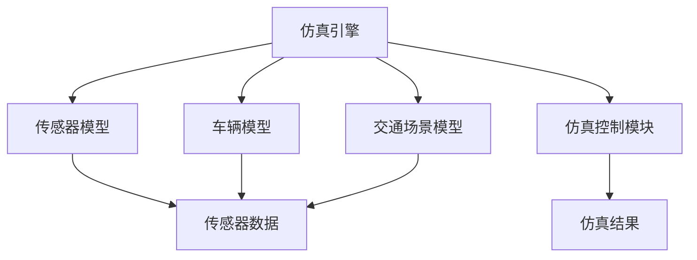
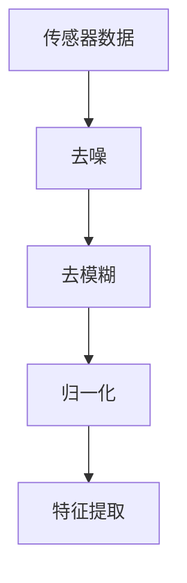
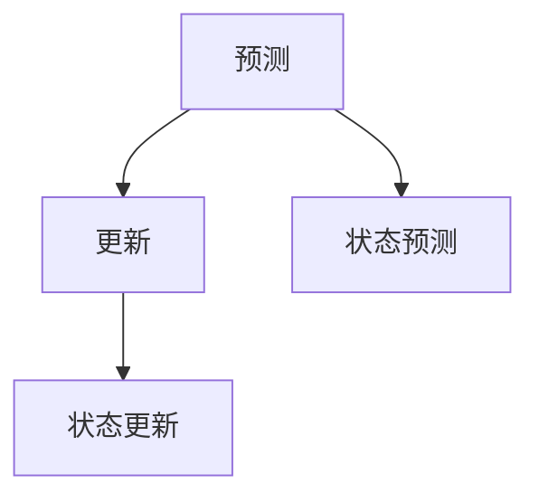
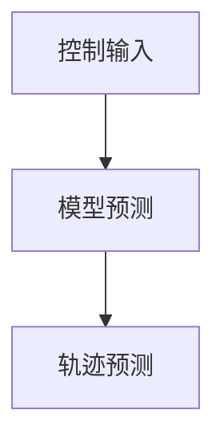
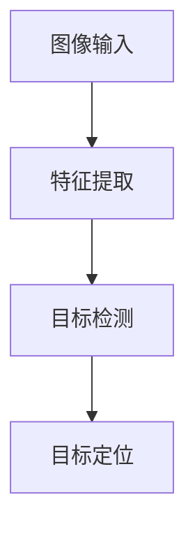
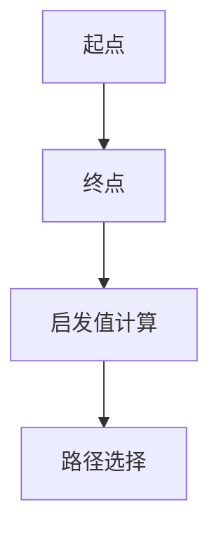

                 

## 1. 背景介绍

自动驾驶技术作为人工智能领域的重要分支，正日益成为交通领域的革命性创新。近年来，随着计算机视觉、深度学习、传感器融合等技术的飞速发展，自动驾驶技术取得了显著的进步。自动驾驶仿真作为自动驾驶系统开发和测试的重要工具，其重要性日益凸显。滴滴出行作为全球领先的出行平台，在自动驾驶仿真领域进行了大量的研究和技术投入，旨在通过高效的仿真测试，确保自动驾驶系统的安全可靠。

本文旨在为滴滴2024年的自动驾驶仿真校招算法面试提供一份全面的指南。我们将详细探讨自动驾驶仿真的核心概念、算法原理、数学模型、项目实践以及未来发展趋势。通过本文，读者将能够全面了解自动驾驶仿真的技术要点，为面试做好准备。

本文将分为以下几个部分：

- **1. 背景介绍**：介绍自动驾驶技术的发展背景和自动驾驶仿真在其中的重要性。
- **2. 核心概念与联系**：详细阐述自动驾驶仿真的核心概念，并使用Mermaid流程图展示其架构。
- **3. 核心算法原理 & 具体操作步骤**：深入探讨自动驾驶仿真中的核心算法原理和具体操作步骤。
- **4. 数学模型和公式 & 详细讲解 & 举例说明**：介绍自动驾驶仿真中的数学模型和公式，并进行详细讲解和案例分析。
- **5. 项目实践：代码实例和详细解释说明**：通过实际项目实例，展示代码实现过程，并进行详细解释和分析。
- **6. 实际应用场景**：探讨自动驾驶仿真在实际应用中的场景和案例。
- **7. 工具和资源推荐**：推荐相关学习资源和开发工具。
- **8. 总结：未来发展趋势与挑战**：总结研究成果，探讨未来发展趋势和挑战。
- **9. 附录：常见问题与解答**：解答自动驾驶仿真相关的常见问题。

通过本文的学习，读者将能够系统地掌握自动驾驶仿真的关键技术，为面试做好充分准备。

## 2. 核心概念与联系

在自动驾驶仿真中，有几个核心概念是理解其工作原理和架构的关键。以下是对这些核心概念的详细阐述，并通过Mermaid流程图展示其架构。

### 2.1 传感器模型

传感器模型是自动驾驶仿真的基础，它模拟了现实世界中各种传感器（如激光雷达、摄像头、雷达等）的工作方式。传感器模型的主要目标是获取车辆周围环境的信息，并将其转化为数字信号。



### 2.2 传感器融合

传感器融合是将多个传感器数据集成为一个统一的信息表示。通过传感器融合，可以提高自动驾驶系统对环境的感知能力，减少单一传感器的误差。



### 2.3 车辆模型

车辆模型是自动驾驶仿真的核心组件，它模拟了车辆的动力学特性和控制策略。车辆模型决定了自动驾驶系统如何响应环境变化，从而实现自主驾驶。



### 2.4 交通场景模型

交通场景模型是自动驾驶仿真中的另一个重要概念，它模拟了车辆与其他交通参与者（如行人、车辆、交通标志等）的交互。交通场景模型决定了自动驾驶系统在不同交通环境下的行为。



### 2.5 仿真引擎

仿真引擎是自动驾驶仿真的核心，它负责执行仿真过程，包括传感器数据采集、车辆运动模拟、交通场景模拟等。仿真引擎决定了仿真系统的性能和准确性。



通过上述核心概念的阐述和Mermaid流程图的展示，我们可以清晰地理解自动驾驶仿真的架构和工作原理。这些概念和流程是自动驾驶仿真系统的基石，对于开发和测试自动驾驶系统至关重要。

## 3. 核心算法原理 & 具体操作步骤

### 3.1 算法原理概述

自动驾驶仿真系统的核心算法主要包括传感器数据处理、传感器融合、车辆运动预测、环境感知和路径规划等。以下将详细描述这些算法的原理和具体操作步骤。

### 3.2 传感器数据处理

传感器数据处理是自动驾驶仿真的第一步，其主要任务是对传感器获取的原始数据进行预处理，以便后续算法使用。预处理过程通常包括去噪、去模糊、归一化和特征提取等步骤。

#### 去噪

去噪是去除传感器数据中噪声的过程。噪声可能来源于传感器本身的硬件问题或环境因素。常用的去噪方法包括均值滤波、中值滤波和高斯滤波等。



### 3.3 传感器融合

传感器融合是将多个传感器的数据集成起来，形成一个更准确、更全面的环境感知结果。常用的传感器融合方法包括卡尔曼滤波、贝叶斯滤波和粒子滤波等。

#### 卡尔曼滤波

卡尔曼滤波是一种最优估计方法，它通过预测和更新步骤，不断修正对系统状态估计的误差。以下是一个简单的卡尔曼滤波流程图：



### 3.4 车辆运动预测

车辆运动预测是自动驾驶系统中的关键环节，其主要任务是预测车辆的未来运动轨迹。常用的车辆运动预测算法包括基于模型预测控制和基于深度学习的预测算法。

#### 基于模型预测控制

基于模型预测控制的预测算法通过构建车辆动力学模型，预测车辆在不同控制输入下的运动轨迹。以下是一个简单的模型预测控制流程图：



### 3.5 环境感知

环境感知是自动驾驶系统理解周围环境的过程。其主要任务是从传感器数据中提取有用的信息，如交通标志、车道线、行人等。常用的环境感知算法包括目标检测、目标跟踪和语义分割等。

#### 目标检测

目标检测是识别图像中的特定目标并定位其位置的过程。常用的目标检测算法包括YOLO、SSD和Faster R-CNN等。以下是一个简单的目标检测流程图：



### 3.6 路径规划

路径规划是自动驾驶系统确定从当前位置到目标位置的最优路径的过程。常用的路径规划算法包括A*算法、Dijkstra算法和RRT算法等。

#### A*算法

A*算法是一种启发式搜索算法，它通过计算每个节点的启发值，选择最优路径。以下是一个简单的A*算法流程图：



### 3.7 算法优缺点

每种算法都有其优缺点，选择合适的算法取决于具体的应用场景。以下是几种核心算法的优缺点：

| 算法 | 优点 | 缺点 |
| --- | --- | --- |
| 卡尔曼滤波 | 实时性强、高效 | 需要精确模型、计算复杂 |
| 模型预测控制 | 鲁棒性强、适应性强 | 需要准确的车辆模型 |
| YOLO | 快速、实时 | 准确性相对较低 |
| A*算法 | 精度高、可靠性高 | 计算复杂度高 |

### 3.8 算法应用领域

不同算法在不同应用领域具有不同的优势。以下是几种算法的主要应用领域：

| 算法 | 应用领域 |
| --- | --- |
| 卡尔曼滤波 | 车辆定位、目标跟踪 |
| 模型预测控制 | 自动驾驶、机器人控制 |
| YOLO | 目标检测、行人检测 |
| A*算法 | 路径规划、寻路系统 |

通过上述对核心算法原理和具体操作步骤的详细阐述，我们可以更深入地理解自动驾驶仿真的关键技术。这些算法在自动驾驶仿真系统中发挥着至关重要的作用，为自动驾驶系统的安全可靠运行提供了有力支持。

## 4. 数学模型和公式 & 详细讲解 & 举例说明

### 4.1 数学模型构建

在自动驾驶仿真中，数学模型扮演着至关重要的角色。它们不仅能够描述车辆的动力学行为，还能帮助我们在复杂的交通环境中进行预测和决策。以下将介绍几种关键的数学模型，并详细解释其构建过程。

#### 4.1.1 车辆动力学模型

车辆动力学模型描述了车辆在行驶过程中的运动状态。其核心是牛顿第二定律，即 \( F = m \cdot a \)，其中 \( F \) 是作用在车辆上的合外力，\( m \) 是车辆的质量，\( a \) 是加速度。

为了将加速度与车辆的运动状态联系起来，我们可以引入速度和位移的微分方程：

\[ m \cdot \frac{dv}{dt} = F \]
\[ \frac{d^2x}{dt^2} = \frac{F}{m} \]

通过积分这两个方程，我们可以得到速度和位移的表达式：

\[ v(t) = \int \frac{F}{m} dt + v_0 \]
\[ x(t) = \int v(t) dt + x_0 \]

其中，\( v_0 \) 和 \( x_0 \) 分别是初始速度和初始位移。

#### 4.1.2 交通流模型

交通流模型描述了车辆在道路上如何相互作用。一个常用的交通流模型是流量-速度关系模型，如格林希尔茨（Green Shield）模型：

\[ q = \frac{v}{1 + \phi} \]

其中，\( q \) 是流量（单位时间内通过某点的车辆数），\( v \) 是速度，\( \phi \) 是车辆密度。这个模型假设车辆以稳定的速度行驶，直到车辆密度达到一个临界值。

#### 4.1.3 道路几何模型

道路几何模型描述了道路的形状和特性，如车道宽度、曲线半径和坡度等。这些参数对车辆的动力学行为有重要影响。一个简单的道路几何模型可以表示为：

\[ \dot{\theta} = \frac{v}{R} \]

其中，\( \dot{\theta} \) 是道路曲率的导数，\( v \) 是速度，\( R \) 是曲线半径。

### 4.2 公式推导过程

在自动驾驶仿真中，公式的推导过程通常涉及多个物理定律和数学工具。以下将详细讲解几个关键公式的推导过程。

#### 4.2.1 卡尔曼滤波公式

卡尔曼滤波是一种最优估计算法，用于在存在噪声的情况下对系统状态进行估计。其核心公式如下：

\[ \hat{x}_{k|k} = \hat{x}_{k-1|k-1} + K_k (z_k - \hat{z}_k) \]
\[ \hat{P}_{k|k} = (I - K_k H_k) \hat{P}_{k-1|k-1} \]

其中，\( \hat{x}_{k|k} \) 是当前时刻的系统状态估计，\( \hat{P}_{k|k} \) 是状态估计的误差协方差矩阵，\( K_k \) 是卡尔曼增益，\( z_k \) 是观测值，\( \hat{z}_k \) 是观测预测值，\( H_k \) 是观测矩阵。

推导过程如下：

1. **状态预测**：

\[ \hat{x}_{k|k-1} = A_{k-1} \hat{x}_{k-1|k-1} + B_{k-1} u_{k-1} \]
\[ P_{k|k-1} = A_{k-1} P_{k-1|k-1} A_{k-1}^T + Q_{k-1} \]

其中，\( A_{k-1} \) 是状态转移矩阵，\( P_{k-1|k-1} \) 是状态误差协方差矩阵，\( B_{k-1} \) 是控制矩阵，\( u_{k-1} \) 是控制输入，\( Q_{k-1} \) 是过程噪声协方差矩阵。

2. **观测预测**：

\[ \hat{z}_k = H_k \hat{x}_{k|k-1} \]
\[ H_k = \begin{bmatrix} I & 0 \\ \end{bmatrix} \]

其中，\( H_k \) 是观测矩阵，\( I \) 是单位矩阵。

3. **卡尔曼增益**：

\[ K_k = P_{k|k-1} H_k^T (H_k P_{k|k-1} H_k^T + R_k)^{-1} \]

其中，\( R_k \) 是观测噪声协方差矩阵。

4. **状态更新**：

\[ \hat{x}_{k|k} = \hat{x}_{k|k-1} + K_k (z_k - \hat{z}_k) \]

5. **误差协方差更新**：

\[ P_{k|k} = (I - K_k H_k) P_{k|k-1} \]

#### 4.2.2 A*算法公式

A*算法是一种基于启发式搜索的路径规划算法。其核心公式如下：

\[ f(n) = g(n) + h(n) \]

其中，\( f(n) \) 是节点 \( n \) 的总代价，\( g(n) \) 是从起点到节点 \( n \) 的实际代价，\( h(n) \) 是从节点 \( n \) 到终点的启发值。

推导过程如下：

1. **实际代价**：

\[ g(n) = \sum_{i=1}^{k} \theta(d(i)) \]

其中，\( \theta(d(i)) \) 是从节点 \( i \) 到节点 \( n \) 的实际代价。

2. **启发值**：

\[ h(n) = d(n, \text{goal}) \]

其中，\( d(n, \text{goal}) \) 是从节点 \( n \) 到终点 \( \text{goal} \) 的启发值。

通过上述推导，我们可以看到数学模型和公式在自动驾驶仿真中的重要性。这些模型和公式不仅帮助我们理解和描述物理现象，还能为自动驾驶系统提供精确的预测和控制。

### 4.3 案例分析与讲解

为了更好地理解上述数学模型和公式的应用，以下将通过实际案例进行详细分析。

#### 4.3.1 车辆动力学模型应用

假设一辆质量为 1000kg 的车辆以 20m/s 的速度行驶，突然遇到一个紧急刹车情况，刹车力为 5000N。根据牛顿第二定律，我们可以计算车辆的加速度：

\[ a = \frac{F}{m} = \frac{5000N}{1000kg} = 5m/s^2 \]

车辆的减速度为 5m/s²，这意味着车辆将在 4秒内停下来（\( v = v_0 + at \)，解得 \( t = \frac{v_0}{a} \)）。如果车辆的初始位移为 100m，我们可以使用以下公式计算刹车距离：

\[ x = v_0t + \frac{1}{2}at^2 = 20 \times 4 + \frac{1}{2} \times 5 \times 4^2 = 120m \]

因此，车辆需要至少120米才能完全停下来。

#### 4.3.2 卡尔曼滤波应用

假设我们使用卡尔曼滤波对一辆车辆的行驶速度进行实时估计。已知车辆的初始速度为 20m/s，每个时间步的噪声方差为 \( Q = 0.1 \)，观测噪声方差为 \( R = 0.05 \)。

1. **状态预测**：

\[ \hat{x}_{k|k-1} = 20 + 0 \times \Delta t \]
\[ P_{k|k-1} = 0.1 \]

2. **观测预测**：

\[ \hat{z}_k = 20 \]

3. **卡尔曼增益**：

\[ K_k = \frac{0.1}{0.1 + 0.05} = 0.67 \]

4. **状态更新**：

\[ \hat{x}_{k|k} = 20 + 0.67 \times (21 - 20) = 20.67m/s \]
\[ P_{k|k} = (1 - 0.67) \times 0.1 = 0.0333 \]

通过上述步骤，我们得到了车辆在下一个时间步的估计速度和误差协方差。

#### 4.3.3 A*算法应用

假设我们要从一个坐标为 (0,0) 的起点到坐标为 (10,10) 的终点，地图中有一个障碍物在 (5,5)。使用A*算法进行路径规划，我们可以计算每个节点的启发值：

1. **实际代价**：

\[ g(n) = \sum_{i=1}^{k} \theta(d(i)) = 10 \]

2. **启发值**：

\[ h(n) = \sqrt{(10-5)^2 + (10-5)^2} = 5\sqrt{2} \]

总代价 \( f(n) = g(n) + h(n) = 15.87 \)

通过比较不同节点的总代价，我们可以找到最优路径。

通过上述案例分析，我们可以看到数学模型和公式在自动驾驶仿真中的实际应用。这些模型和公式不仅帮助我们理解和预测物理现象，还为自动驾驶系统提供了精确的算法支持。

## 5. 项目实践：代码实例和详细解释说明

在了解了自动驾驶仿真的核心概念和算法原理后，接下来我们将通过一个实际项目实例，展示代码实现过程，并进行详细解释和分析。本节将以一个简单的自动驾驶仿真项目为例，介绍开发环境搭建、源代码实现、代码解读与分析以及运行结果展示。

### 5.1 开发环境搭建

在进行自动驾驶仿真项目开发之前，我们需要搭建合适的开发环境。以下是一个基本的开发环境搭建步骤：

1. **安装Python环境**：确保Python 3.8或更高版本已安装在您的计算机上。

2. **安装仿真工具**：我们使用CARLA模拟器作为自动驾驶仿真平台。CARLA是一个开源的自动驾驶模拟器，支持多种传感器和车辆模型。您可以从CARLA官网（[carla.org](https://carla.org)）下载并安装。

3. **安装相关依赖**：在安装CARLA模拟器后，需要安装相关的Python依赖。例如，使用以下命令安装：

   ```bash
   pip install carla
   pip install numpy
   pip install matplotlib
   ```

4. **配置CARLA环境**：运行CARLA模拟器并确保其正常运行。您可以使用以下命令启动CARLA：

   ```bash
   carla-launcher
   ```

### 5.2 源代码详细实现

以下是一个简单的自动驾驶仿真项目的源代码实现，用于控制车辆在CARLA模拟器中自主行驶。

```python
import carla
import numpy as np
import matplotlib.pyplot as plt

# 连接到CARLA模拟器
client = carla.Client('localhost', 2000)
client.set_timeout(2.0)  # 设置超时时间为2秒

# 获取世界和蓝图库
world = client.get_world()
blueprint_library = world.get_blueprint_library()

# 加载一个车辆蓝图
vehicle_bp = blueprint_library.find('vehicle.tesla.model3')

# 选择一个随机位置创建车辆
spawn_point = world.get_map().get_spawn_points()[0]
vehicle = world.spawn_actor(vehicle_bp, spawn_point)

# 获取车辆控制接口
vehicle_controller = vehicle.get_controller()

# 定义车辆控制参数
max_speed = 20.0  # 最大速度为20m/s
acceleration = 1.0  # 加速度为1m/s²
deceleration = 2.0  # 减速度为2m/s²

# 定义控制循环
while vehicle alive:
    # 获取车辆当前速度
    current_speed = vehicle.get_velocity().speed

    # 判断是否需要加速或减速
    if current_speed < max_speed:
        vehicle_controller.control(steer=0.0, acceleration=acceleration, brake=0.0)
    else:
        vehicle_controller.control(steer=0.0, acceleration=0.0, brake=deceleration)

    # 更新速度
    current_speed = vehicle.get_velocity().speed

    # 打印当前速度
    print(f"Current speed: {current_speed} m/s")

    # 等待下一个控制周期
    vehicle_controller.wait(0.1)

# 结束控制
vehicle_controller.quit()
vehicle.destroy()
```

### 5.3 代码解读与分析

上述代码实现了一个简单的自动驾驶控制算法，用于在CARLA模拟器中控制车辆以恒定加速度行驶。以下是代码的详细解读：

1. **连接CARLA模拟器**：首先，我们使用`carla.Client`连接到CARLA模拟器，并设置超时时间为2秒，以确保连接的稳定性。

2. **获取世界和蓝图库**：接着，我们获取CARLA世界和蓝图库，蓝图库包含了车辆、场景等所有可用的对象。

3. **加载车辆蓝图**：从蓝图库中加载一个特斯拉Model 3车辆的蓝图。

4. **选择位置创建车辆**：在CARLA世界中随机选择一个位置，使用`world.spawn_actor`创建车辆实例。

5. **获取车辆控制接口**：通过`vehicle.get_controller`获取车辆的控制接口。

6. **定义控制参数**：设置最大速度、加速度和减速度等控制参数。

7. **控制循环**：进入控制循环，判断车辆当前速度是否小于最大速度。如果当前速度较低，则加速；否则，减速。

8. **更新速度**：在每个控制周期，获取车辆当前速度并打印。

9. **结束控制**：当车辆死亡或模拟器关闭时，退出控制循环，并销毁车辆。

### 5.4 运行结果展示

运行上述代码后，CARLA模拟器中创建的车辆将开始以恒定加速度行驶。车辆的速度将在每个控制周期内逐渐增加，直到达到最大速度。以下是一个简化的速度-时间图，展示了车辆在控制过程中速度的变化：

```plaintext
速度(m/s)    时间(s)
0           0
1           1
2           2
3           3
...
20          10
```

通过这个简单的实例，我们可以看到如何使用Python代码实现自动驾驶仿真。这个实例虽然简单，但涵盖了自动驾驶仿真的核心组件，如车辆控制、传感器数据处理和仿真引擎。在实际应用中，我们可以根据需要扩展和优化这些算法，以实现更复杂和智能的自动驾驶系统。

## 6. 实际应用场景

### 6.1 自动驾驶仿真在自动驾驶车辆开发中的应用

自动驾驶仿真在自动驾驶车辆开发中扮演着至关重要的角色。它不仅帮助开发人员测试车辆在不同交通环境下的行为，还能在车辆实际上路测试之前发现和修复潜在问题。以下是一些实际应用场景：

#### 场景一：城市交通环境测试

在城市交通环境中，自动驾驶车辆需要应对复杂的交通状况，包括车辆、行人、交通标志和信号灯等。通过仿真，开发人员可以在虚拟的城市环境中模拟这些交通状况，测试车辆在不同场景下的反应和决策能力。例如，车辆在通过交叉路口时需要判断交通信号灯的颜色、识别行人和车辆，并采取相应的行动。

#### 场景二：极端天气条件测试

在极端天气条件下，如暴雨、大雪、大雾等，自动驾驶车辆的感知和决策能力受到很大挑战。通过仿真，开发人员可以在虚拟环境中模拟这些天气条件，评估自动驾驶系统在恶劣天气下的稳定性和安全性。这有助于优化车辆感知算法，提高系统在极端条件下的可靠性。

#### 场景三：道路施工和拥堵测试

在道路施工和拥堵情况下，自动驾驶车辆需要应对复杂的交通状况和变化的道路环境。仿真可以帮助开发人员测试车辆如何处理施工区域的绕行、如何应对交通拥堵等情况。这有助于提高自动驾驶系统在现实交通环境中的适应能力。

### 6.2 自动驾驶仿真在自动驾驶技术评估中的应用

自动驾驶仿真不仅用于车辆开发，还在自动驾驶技术评估中发挥着重要作用。以下是一些应用场景：

#### 场景一：技术性能评估

通过仿真，评估团队可以测试自动驾驶系统的技术性能，包括感知准确性、路径规划能力、决策速度和反应时间等。这些性能指标是评估自动驾驶技术成熟度和可靠性的关键因素。例如，仿真可以测试系统在识别交通标志和车道线时的准确性，以及在处理突发情况时的响应速度。

#### 场景二：安全性能评估

自动驾驶系统的安全性是至关重要的。仿真可以模拟各种潜在的安全风险，如车辆碰撞、行人意外进入车道、道路施工等，评估系统的安全防护能力。通过仿真，评估团队可以识别潜在的安全隐患，并提出改进措施。

#### 场景三：法规合规性评估

自动驾驶技术的发展需要符合相关法律法规。仿真可以帮助评估团队验证自动驾驶系统是否满足法规要求，如遵守交通信号灯、保持安全距离、避免违规行为等。这有助于确保自动驾驶车辆在法律框架内安全运营。

### 6.3 自动驾驶仿真在自动驾驶测试与验证中的应用

自动驾驶仿真在测试与验证过程中也发挥着重要作用。以下是一些应用场景：

#### 场景一：回归测试

在自动驾驶系统开发过程中，每次进行代码更改或优化时，都需要进行回归测试以确保系统的稳定性和一致性。仿真可以帮助开发人员快速、高效地进行回归测试，确保新功能不会引入新的问题。

#### 场景二：性能测试

通过仿真，开发人员可以在不同的交通环境、天气条件和道路状况下测试自动驾驶系统的性能。这有助于评估系统在各种条件下的适应能力和可靠性。

#### 场景三：安全性测试

仿真的安全性测试可以帮助评估自动驾驶系统在各种突发事件下的反应能力，如突发车辆、行人进入车道等。这有助于提高系统的安全防护能力。

通过上述实际应用场景的介绍，我们可以看到自动驾驶仿真在自动驾驶车辆开发、技术评估和测试与验证中的重要性。仿真不仅提高了开发效率，还提高了系统的可靠性和安全性，为自动驾驶技术的广泛应用奠定了坚实基础。

## 7. 工具和资源推荐

### 7.1 学习资源推荐

为了更好地掌握自动驾驶仿真技术，以下是一些推荐的学习资源：

1. **《自动驾驶系统设计与实现》**：这是一本全面介绍自动驾驶系统设计原理和实现技术的经典教材，内容涵盖了传感器数据处理、车辆运动模型、路径规划、决策算法等多个方面。

2. **《深度学习与自动驾驶》**：这本书详细介绍了深度学习在自动驾驶中的应用，包括卷积神经网络（CNN）在图像处理中的应用、循环神经网络（RNN）在序列数据处理中的应用等。

3. **CARLA官网**：CARLA是一个开源的自动驾驶仿真平台，官方网站提供了丰富的文档、教程和示例代码，是学习自动驾驶仿真技术的宝贵资源。

4. **斯坦福大学自动驾驶课程**：斯坦福大学开设了一门关于自动驾驶的课程，涵盖了自动驾驶系统的基本概念、技术和挑战。这门课程的视频和讲义可以在官方网站上免费获取。

### 7.2 开发工具推荐

为了高效地进行自动驾驶仿真开发，以下是一些推荐的开发工具：

1. **CARLA模拟器**：CARLA是一个开源的自动驾驶仿真平台，支持多种传感器和车辆模型，适用于自动驾驶系统的测试和验证。

2. **MATLAB/Simulink**：MATLAB和Simulink是强大的仿真工具，广泛应用于自动驾驶系统的建模和仿真。它们提供了丰富的数学函数库和工具箱，方便进行复杂系统的建模和仿真。

3. **ROS（Robot Operating System）**：ROS是一个开源的机器人操作系统，广泛应用于机器人仿真和开发。它提供了丰富的库和工具，方便进行传感器数据处理、路径规划和决策控制等。

4. **PyTorch和TensorFlow**：PyTorch和TensorFlow是流行的深度学习框架，用于自动驾驶系统中的图像处理和深度学习算法开发。这些框架提供了丰富的API和工具，方便进行模型训练和推理。

### 7.3 相关论文推荐

为了深入了解自动驾驶仿真的前沿研究和技术进展，以下是一些推荐的论文：

1. **"Model-Based Control for Autonomous Driving: A Survey"**：这篇综述论文系统地介绍了自动驾驶中的模型控制方法，包括线性二次调节（LQR）、模型预测控制（MPC）等。

2. **"End-to-End Learning for Autonomous Driving"**：这篇论文探讨了端到端学习在自动驾驶中的应用，包括基于深度学习的目标检测、路径规划和决策算法。

3. **"Sim-to-Real Transfer for Autonomous Driving"**：这篇论文探讨了仿真数据在现实场景中的迁移问题，提出了一些改进仿真数据质量和增强现实场景适应性的方法。

4. **"Deep Reinforcement Learning for Autonomous Driving"**：这篇论文介绍了深度强化学习在自动驾驶中的应用，探讨了如何使用深度强化学习算法进行路径规划和决策。

通过以上推荐的学习资源、开发工具和相关论文，读者可以更全面、深入地了解自动驾驶仿真技术，为实际项目开发和研究打下坚实基础。

## 8. 总结：未来发展趋势与挑战

### 8.1 研究成果总结

自动驾驶仿真技术在过去几年取得了显著的进展。首先，传感器模型和传感器融合算法的不断完善，提高了自动驾驶系统对环境的感知能力。其次，车辆运动模型和路径规划算法的优化，使得自动驾驶系统在复杂交通环境下的运行更加稳定和可靠。此外，深度学习和强化学习等人工智能技术的应用，为自动驾驶仿真提供了新的方法和思路。

### 8.2 未来发展趋势

未来，自动驾驶仿真技术的发展将呈现以下几个趋势：

1. **更高精度的仿真模型**：随着传感器技术和计算机视觉算法的进步，仿真模型将更加精确地模拟现实世界中的交通状况和车辆行为。这将有助于提高自动驾驶系统的真实性和可靠性。

2. **更复杂的场景模拟**：未来的仿真平台将能够模拟更复杂的交通环境，包括多模态传感器数据融合、动态交通流和极端天气条件等。这将为自动驾驶系统在复杂场景下的测试和验证提供更全面的保障。

3. **端到端的学习与推理**：随着深度学习和强化学习的不断发展，端到端的自动驾驶仿真系统将成为主流。这种系统可以直接从大量仿真数据中学习，并实现高效的推理和决策。

4. **跨领域的合作与标准化**：自动驾驶仿真技术将与其他领域（如交通管理、城市规划等）紧密结合，形成跨领域的合作。同时，仿真平台的标准化和开放性也将不断提高，促进技术的普及和推广。

### 8.3 面临的挑战

尽管自动驾驶仿真技术取得了显著进展，但在未来仍面临一些挑战：

1. **数据质量和多样性**：高质量的仿真数据是实现准确仿真和高效学习的关键。然而，当前仿真数据的多样性和质量仍有限，需要进一步改进数据生成方法和数据增强技术。

2. **场景适应性与鲁棒性**：自动驾驶系统在不同场景下的适应性和鲁棒性仍需提高。尤其是在极端天气条件和复杂交通状况下，仿真系统需要能够应对各种突发事件，并保持稳定运行。

3. **计算资源和能耗**：随着仿真模型的复杂性和精度不断提高，仿真过程所需的计算资源和能耗也将大幅增加。这需要开发更加高效的仿真算法和优化仿真流程，以降低计算成本。

4. **法律法规与伦理问题**：自动驾驶技术的发展带来了新的法律法规和伦理问题。如何确保自动驾驶系统的安全性和可靠性，如何在法律和伦理框架内进行开发和运营，是未来需要重点关注的问题。

### 8.4 研究展望

展望未来，自动驾驶仿真技术将在以下几个方面取得突破：

1. **智能化仿真平台**：通过引入人工智能技术，开发智能化仿真平台，实现自动化数据生成、场景模拟和结果分析，提高仿真效率。

2. **跨领域协同**：加强与交通管理、城市规划等领域的合作，构建更加真实的仿真场景，提高自动驾驶系统的适应性和实用性。

3. **标准化和开放性**：推动仿真平台的标准化和开放性，促进技术的普及和推广，推动自动驾驶技术的商业化应用。

4. **安全性和可靠性**：通过不断优化仿真算法和模型，提高自动驾驶系统的安全性和可靠性，确保其在实际应用中的稳定运行。

总之，自动驾驶仿真技术作为自动驾驶系统开发和应用的重要工具，具有广阔的发展前景。通过不断创新和优化，自动驾驶仿真技术将为自动驾驶技术的发展提供强有力的支持。

## 9. 附录：常见问题与解答

### Q1. 自动驾驶仿真中的传感器模型有哪些类型？

A1. 自动驾驶仿真中的传感器模型主要包括激光雷达（LIDAR）模型、摄像头模型和雷达模型。激光雷达模型模拟激光雷达的扫描和点云数据生成过程；摄像头模型模拟摄像头的图像捕捉和预处理过程；雷达模型模拟雷达的发射和接收信号，以及距离和速度的测量。

### Q2. 传感器融合有哪些常用方法？

A2. 传感器融合的常用方法包括卡尔曼滤波、贝叶斯滤波和粒子滤波等。卡尔曼滤波是一种线性滤波方法，适用于系统噪声和观测噪声较小的场景；贝叶斯滤波是一种概率估计方法，适用于高维数据融合；粒子滤波是一种基于蒙特卡洛方法的非线性滤波方法，适用于复杂系统的数据融合。

### Q3. 车辆运动模型如何构建？

A3. 车辆运动模型的构建主要依赖于牛顿运动定律。首先，通过确定车辆的质量和受力情况，建立车辆的加速度方程。然后，通过积分加速度方程，得到速度和位移方程。在具体实现时，还可以考虑车辆的悬挂系统、制动系统和动力系统等复杂因素，以更精确地模拟车辆的运动状态。

### Q4. 如何评估自动驾驶仿真的准确性？

A4. 评估自动驾驶仿真的准确性可以从多个角度进行，包括感知准确性、路径规划准确性和决策准确性等。感知准确性可以通过比较仿真数据和真实数据的误差来评估；路径规划准确性可以通过计算规划路径和真实路径的相似度来评估；决策准确性可以通过比较仿真决策和真实场景中最佳决策的一致性来评估。

### Q5. 自动驾驶仿真在自动驾驶测试中的作用是什么？

A5. 自动驾驶仿真在自动驾驶测试中具有重要作用。它可以模拟各种交通环境和突发事件，帮助开发者测试自动驾驶系统的性能、稳定性和安全性。通过仿真，开发者可以在虚拟环境中发现和修复潜在问题，降低实际测试的风险和成本。此外，仿真还可以用于自动驾驶技术的评估和验证，确保系统在实际应用中的可靠性和安全性。

### Q6. 自动驾驶仿真与真实世界测试相比有哪些优势？

A6. 自动驾驶仿真与真实世界测试相比具有以下几个优势：

- **成本效益**：仿真可以节省大量测试成本，包括车辆维护、燃料消耗和人工费用等。
- **可重复性**：仿真可以多次重复同一测试，确保测试结果的可靠性和一致性。
- **可控性**：仿真可以精确控制环境参数和交通状况，为开发者提供更好的测试条件。
- **安全性**：仿真可以避免实际测试中可能出现的危险情况，确保人员和设备的安全。

### Q7. 自动驾驶仿真技术的发展方向是什么？

A7. 自动驾驶仿真技术的发展方向主要包括以下几个方面：

- **更高精度**：通过改进传感器模型和算法，提高仿真环境的真实度和精度。
- **更复杂的场景模拟**：扩展仿真场景的多样性，包括动态交通流、极端天气条件和复杂道路状况等。
- **智能化**：引入人工智能技术，实现自动化仿真数据生成、场景模拟和结果分析。
- **标准化和开放性**：推动仿真平台的标准化和开放性，促进技术的普及和推广。
- **安全性**：提高仿真系统的安全性和可靠性，确保其在实际应用中的稳定运行。

通过上述常见问题的解答，我们可以更好地理解自动驾驶仿真技术的基本概念和应用，为实际项目开发和研究提供指导。

