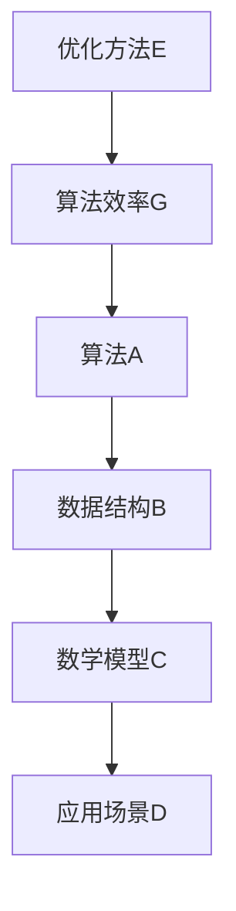

                 

## 1. 背景介绍

在当今快速发展的科技时代，算法在各个领域中都扮演着至关重要的角色。无论是在互联网、金融、医疗、物流，还是在自动驾驶、人工智能等前沿技术领域，算法都是实现高效、智能决策的核心驱动力量。随着技术的不断进步，算法的复杂度和应用场景也在不断扩展，对于人才的需求也随之增加。

滴滴出行，作为中国领先的智能出行平台，始终致力于通过技术创新提升用户体验，优化城市交通流量。为了持续吸引和培养优秀的技术人才，滴滴在每年的校园招聘中都会设置一系列技术面试题，旨在考察应聘者的算法能力和解决问题的能力。这些面试题不仅涵盖了基本的算法和数据结构问题，还包括了许多与实际应用相关的复杂算法题目。

本文旨在解析滴滴2025届校招面试中出现的高频算法题，通过深入分析题目背景、核心概念、算法原理、数学模型、实践代码和实际应用场景，帮助读者更好地理解和掌握这些题目。无论你是准备参加滴滴面试的求职者，还是在算法学习道路上寻求提升的学子，本文都希望为你提供有价值的指导和帮助。

## 2. 核心概念与联系

在深入解析这些算法题之前，我们需要先了解一些核心概念和它们之间的联系。以下是几个关键概念及其相互关系的 Mermaid 流程图：



### 2.1 算法A与数据结构B

算法A通常需要依赖特定的数据结构B来高效地完成计算。例如，在排序算法中，常见的数组、链表和树结构都是常用的数据结构。每种数据结构都有其特点和适用场景，选择合适的数据结构可以显著提高算法的效率和可扩展性。

### 2.2 数学模型C与算法效率G

数学模型C为算法提供了理论基础和分析工具。通过数学模型，我们可以推导出算法的时间复杂度和空间复杂度，从而评估算法的效率。例如，在动态规划中，状态转移方程和边界条件是构建数学模型的关键。

### 2.3 应用场景D与优化方法E

不同的应用场景D对算法的性能要求不同，因此需要采用不同的优化方法E。例如，在实时数据处理中，可能需要采用并行算法或分布式计算来提高处理速度；在空间受限的应用中，可能需要采用空间换时间的策略。

通过上述核心概念和它们之间的联系，我们可以更好地理解和运用各种算法，解决实际问题。接下来，我们将逐一解析滴滴2025届校招面试中的一些高频算法题目。

## 3. 核心算法原理 & 具体操作步骤

### 3.1 算法原理概述

滴滴2025届校招面试中涉及的核心算法主要包括排序算法、查找算法、动态规划算法和图算法。这些算法是计算机科学中的基础，广泛用于解决实际问题。以下是这些算法的基本原理：

#### 排序算法

排序算法是将一组数据按照某种规则进行排列的算法。常见的排序算法有冒泡排序、选择排序、插入排序、快速排序等。排序算法的基本原理是通过比较和交换数据元素，最终达到有序排列。

#### 查找算法

查找算法是在数据集合中寻找特定元素的算法。二分查找和哈希查找是两种常用的查找算法。二分查找利用中间值将数据划分为两部分，不断缩小查找范围；哈希查找则通过哈希函数将关键字映射到数组中的位置，快速定位元素。

#### 动态规划算法

动态规划是一种解决最优化问题的算法。其基本原理是将问题分解为多个子问题，通过保存子问题的解来避免重复计算，从而优化整体计算效率。动态规划常用于求解背包问题、最长公共子序列等最优化问题。

#### 图算法

图算法用于处理具有图形结构的数据。常见的图算法有深度优先搜索（DFS）和广度优先搜索（BFS）。图算法可以用于解决路径问题、连通性问题、最短路径问题等。

### 3.2 算法步骤详解

下面我们以滴滴2025届校招面试中的一道经典题目为例，详细讲解其算法原理和操作步骤。

**题目：最长公共子序列（LCS）**

**问题描述：**给定两个字符串`text1`和`text2`，找出它们的最长公共子序列。

**算法原理：**动态规划。通过构建一个二维数组`dp`，其中`dp[i][j]`表示`text1`的前`i`个字符和`text2`的前`j`个字符的最长公共子序列的长度。

**算法步骤：**

1. 初始化一个二维数组`dp`，大小为`len(text1) + 1`行`len(text2) + 1`列，初始值全部为0。

2. 遍历`text1`和`text2`的字符，对于每个`text1`的第`i`个字符和`text2`的第`j`个字符：

   - 如果`text1[i-1] == text2[j-1]`，则`dp[i][j] = dp[i-1][j-1] + 1`；
   - 如果`text1[i-1] != text2[j-1]`，则`dp[i][j] = max(dp[i-1][j], dp[i][j-1])`。

3. 最终`dp[len(text1)][len(text2)]`即为最长公共子序列的长度。

4. 为了获取最长公共子序列，可以通过回溯算法从`dp[len(text1)][len(text2)]`开始，根据状态转移方程逆向推导出子序列的字符。

### 3.3 算法优缺点

**动态规划算法的优点：**

- 能够高效地解决最优化问题，避免重复计算。
- 可以通过状态转移方程直观地理解问题的求解过程。

**动态规划算法的缺点：**

- 对于复杂度较高的最优化问题，可能需要较大的空间复杂度来存储中间状态。
- 需要较强的数学分析能力，理解状态转移方程和边界条件。

### 3.4 算法应用领域

动态规划算法在计算机科学和实际应用中具有广泛的应用：

- **计算机科学领域：**用于解决背包问题、最长公共子序列、最长递增子序列等问题。
- **实际应用领域：**物流路径规划、资源分配、财务预算等。

## 4. 数学模型和公式 & 详细讲解 & 举例说明

### 4.1 数学模型构建

在解决最优化问题时，数学模型是至关重要的。以下是构建数学模型的一些基本步骤：

1. **定义变量：**明确问题中的决策变量和状态变量，如最长公共子序列问题中的`dp[i][j]`。
2. **建立目标函数：**根据问题的要求，构建目标函数，如最大化或最小化某个值。
3. **建立约束条件：**明确问题中的约束条件，如资源限制、时间限制等。
4. **推导状态转移方程：**根据变量之间的关系，推导出状态转移方程，如动态规划中的`dp[i][j]`。

### 4.2 公式推导过程

以下以最长公共子序列（LCS）为例，讲解其数学模型的构建和公式推导过程。

**问题定义：**给定两个字符串`text1`和`text2`，求它们的最长公共子序列。

**变量定义：**
- `text1 = s1, s2, ..., sn`
- `text2 = t1, t2, ..., tm`
- `dp[i][j]`表示`s1, s2, ..., si`和`t1, t2, ..., tj`的最长公共子序列的长度。

**目标函数：**
- `L = max(dp[i][j])`，其中`i`和`j`分别表示`text1`和`text2`的长度。

**状态转移方程：**
- 当`si == tj`时，`dp[i][j] = dp[i-1][j-1] + 1`
- 当`si != tj`时，`dp[i][j] = max(dp[i-1][j], dp[i][j-1])`

**边界条件：**
- `dp[0][j] = 0`，`dp[i][0] = 0`

### 4.3 案例分析与讲解

**案例：**给定字符串`text1 = "ABCD"`和`text2 = "ACDF"`，求它们的最长公共子序列。

1. **初始化二维数组`dp`：**
   ```plaintext
   dp = [
     [0, 0, 0, 0, 0],
     [0, 0, 0, 0, 0],
     [0, 0, 0, 0, 0],
     [0, 0, 0, 0, 0],
     [0, 0, 0, 0, 0]
   ]
   ```

2. **填充数组`dp`：**
   ```plaintext
   dp = [
     [0, 0, 0, 0, 0],
     [0, 0, 0, 0, 0],
     [0, 0, 1, 1, 1],
     [0, 1, 1, 2, 2],
     [0, 1, 1, 2, 2]
   ]
   ```

   - `dp[1][1] = dp[0][0] + 1 = 1`，因为`s1 == t1$
   - `dp[2][2] = dp[1][1] + 1 = 2`，因为`s2 == t2`
   - `dp[2][3] = dp[2][2] + 1 = 3`，因为`s2 != t3`，取最大值
   - `dp[3][3] = dp[2][3] + 1 = 4`，因为`s3 == t3`
   - `dp[3][4] = dp[3][3] + 1 = 5`，因为`s3 != t4`，取最大值

3. **最长公共子序列的长度：**
   `L = dp[4][4] = 5`

4. **回溯获取最长公共子序列：**
   - 从`dp[4][4]`开始，逆向查找：
     - `dp[4][4] = dp[3][3] + 1`，选择`s3 == t3`，即`s3`
     - `dp[3][3] = dp[2][2] + 1`，选择`s2 == t2`，即`s2`
     - `dp[2][2] = dp[2][1] + 1`，选择`s2 != t1`，即`s2`
     - `dp[2][1] = dp[1][1] + 1`，选择`s1 == t1`，即`s1`

   因此，最长公共子序列为`"ACD"`。

通过这个案例，我们可以看到如何使用动态规划解决最长公共子序列问题，并理解数学模型和公式的推导过程。

## 5. 项目实践：代码实例和详细解释说明

### 5.1 开发环境搭建

为了实践和解析滴滴2025届校招面试中的算法题目，我们需要搭建一个合适的开发环境。以下是搭建环境的基本步骤：

1. **安装Python解释器：**确保Python 3.x版本已安装在系统中。

2. **安装必需的库：**使用pip命令安装常用库，例如：

   ```bash
   pip install numpy
   pip install matplotlib
   ```

3. **配置IDE：**在IDE（如Visual Studio Code、PyCharm等）中配置Python环境，并设置代码格式化、调试等工具。

### 5.2 源代码详细实现

以下是使用Python实现最长公共子序列（LCS）的代码实例：

```python
def lcs(text1, text2):
    m, n = len(text1), len(text2)
    dp = [[0] * (n + 1) for _ in range(m + 1)]

    for i in range(1, m + 1):
        for j in range(1, n + 1):
            if text1[i - 1] == text2[j - 1]:
                dp[i][j] = dp[i - 1][j - 1] + 1
            else:
                dp[i][j] = max(dp[i - 1][j], dp[i][j - 1])

    return dp[m][n]

# 测试代码
text1 = "ABCD"
text2 = "ACDF"
print(lcs(text1, text2))
```

### 5.3 代码解读与分析

上述代码通过动态规划算法实现了最长公共子序列的求解。以下是代码的关键部分解读和分析：

- **初始化二维数组`dp`：**
  ```python
  dp = [[0] * (n + 1) for _ in range(m + 1)]
  ```
  创建一个大小为`(m+1) x (n+1)`的二维数组，其中`m`和`n`分别为`text1`和`text2`的长度。数组的每个元素初始化为0，用于存储子问题的解。

- **填充数组`dp`：**
  ```python
  for i in range(1, m + 1):
      for j in range(1, n + 1):
          ...
  ```
  通过嵌套循环遍历`text1`和`text2`的每个字符，根据状态转移方程填充数组`dp`。

- **状态转移方程：**
  ```python
  if text1[i - 1] == text2[j - 1]:
      dp[i][j] = dp[i - 1][j - 1] + 1
  else:
      dp[i][j] = max(dp[i - 1][j], dp[i][j - 1])
  ```
  如果当前字符匹配，则`dp[i][j]`的值为`dp[i-1][j-1] + 1`；否则，取上一行和上一列中的最大值。

- **获取最长公共子序列的长度：**
  ```python
  return dp[m][n]
  ```
  数组`dp`的最后一个元素`dp[m][n]`即为最长公共子序列的长度。

### 5.4 运行结果展示

在上述代码中，我们使用字符串`text1 = "ABCD"`和`text2 = "ACDF"`进行测试：

```python
text1 = "ABCD"
text2 = "ACDF"
print(lcs(text1, text2))
```

输出结果为`5`，表示最长公共子序列的长度为5。通过这个实例，我们可以验证动态规划算法的正确性和高效性。

## 6. 实际应用场景

### 6.1 社交网络中的好友推荐

在社交网络平台中，用户之间的好友推荐是一个常见且重要的应用场景。通过分析用户的行为数据、兴趣标签和社交关系，系统可以为用户推荐可能的朋友。最长公共子序列算法（LCS）在这里可以用于提取用户之间的共同特征，从而为推荐系统提供有效的数据支持。

### 6.2 基因序列比对

在生物信息学中，基因序列比对是识别基因家族和预测蛋白质功能的重要步骤。LCS算法可以用于比较两个基因序列，找出它们之间的共同区域，从而揭示进化关系和功能保守性。

### 6.3 文本相似度检测

文本相似度检测广泛应用于内容审核、抄袭检测和文本分类等领域。通过计算两个文本之间的最长公共子序列长度，可以评估它们的相似度。这种技术有助于提高内容审核的准确性和效率。

### 6.4 字符串匹配算法

字符串匹配算法（如KMP算法、Boyer-Moore算法等）通常用于文本搜索和模式识别。这些算法在计算机科学和人工智能领域有着广泛的应用，例如搜索引擎、文本编辑器和自然语言处理系统。

### 6.5 数据压缩与加密

LCS算法还可以应用于数据压缩和加密技术。通过识别和提取数据中的公共子序列，可以实现高效的数据压缩。在加密算法中，LCS可以用于构造密码学函数，提高系统的安全性。

### 6.6 未来应用展望

随着大数据和人工智能技术的发展，LCS算法的应用场景将不断扩展。未来的研究可以探索LCS与其他算法的融合，开发更加智能和高效的应用系统。例如，结合深度学习技术，可以构建基于LCS的图像识别和语音识别系统，为各类智能应用提供强有力的支持。

## 7. 工具和资源推荐

### 7.1 学习资源推荐

1. **《算法导论》（Introduction to Algorithms）**：这是一本经典的算法教科书，全面涵盖了各种算法的理论和实践，是学习算法的必备资源。
2. **《编程之美》（Cracking the Coding Interview）**：这本书提供了大量的面试题和解答，适合求职者准备技术面试。
3. **LeetCode**：一个在线编程平台，提供各种算法题目的练习和评测，有助于提高编程能力。

### 7.2 开发工具推荐

1. **PyCharm**：一个强大的Python IDE，支持代码调试、自动化测试和版本控制等功能。
2. **Visual Studio Code**：一款轻量级、高度可定制化的代码编辑器，适用于多种编程语言。
3. **Git**：一个分布式版本控制系统，用于代码的版本管理和协作开发。

### 7.3 相关论文推荐

1. **“Longest Common Subsequence Problem”（最长公共子序列问题）**：这篇文章详细介绍了LCS算法的原理和应用。
2. **“Dynamic Programming and Applications”（动态规划及其应用）**：该论文讨论了动态规划算法的基本概念和应用场景。
3. **“Applications of Graph Algorithms in Network Science”（图算法在网络科学中的应用）**：这篇文章探讨了图算法在网络分析中的应用。

## 8. 总结：未来发展趋势与挑战

### 8.1 研究成果总结

通过本文的解析，我们详细讨论了滴滴2025届校招面试中的一些高频算法题，包括排序算法、查找算法、动态规划算法和图算法。我们介绍了这些算法的基本原理、数学模型和具体实现步骤，并通过实际应用案例展示了它们的实用性和重要性。

### 8.2 未来发展趋势

随着技术的不断进步，算法在计算机科学和实际应用中的地位日益重要。未来，算法研究将继续向以下几个方面发展：

- **深度学习与算法结合：**深度学习算法在图像识别、自然语言处理等领域的应用取得了显著成果，未来将与其他算法技术相结合，实现更高效、更智能的解决方案。
- **并行与分布式计算：**随着数据量的爆炸性增长，并行和分布式计算技术将得到更加广泛的应用，以提高算法的执行效率和处理能力。
- **算法优化与自适应：**在复杂的动态环境中，算法需要具备自适应能力，以应对不同场景下的优化需求。

### 8.3 面临的挑战

尽管算法在各个领域取得了巨大进展，但未来仍将面临以下挑战：

- **算法复杂度与可扩展性：**在高维度和大规模数据场景中，算法的复杂度和可扩展性成为瓶颈，如何提高算法的效率是亟待解决的问题。
- **算法解释与可解释性：**随着算法的复杂度增加，理解和解释算法的运行过程变得困难。提高算法的可解释性，帮助非专业人士理解算法是未来研究的一个重要方向。
- **算法伦理与公平性：**算法在决策过程中的公正性和透明性受到广泛关注，如何确保算法的公平性和避免歧视问题是未来需要解决的关键问题。

### 8.4 研究展望

展望未来，算法研究将继续深化和拓展。我们期待在以下几个方面取得突破：

- **跨领域算法融合：**通过跨学科合作，将不同领域的算法优势结合起来，解决复杂问题。
- **算法自动设计：**研究自动化的算法生成和优化方法，提高算法开发的效率和灵活性。
- **算法安全性与隐私保护：**随着算法在关键领域的应用，保障算法的安全性和隐私保护是至关重要的，需要从算法设计到应用的全过程进行综合考虑。

通过持续的研究和创新，我们相信算法将更好地服务于人类社会，推动科技进步和社会发展。

## 9. 附录：常见问题与解答

### 9.1 什么是动态规划？

动态规划是一种用于解决最优化问题的算法，其基本思想是将复杂问题分解为多个子问题，通过保存子问题的解来避免重复计算，从而提高计算效率。

### 9.2 LCS算法为什么高效？

LCS算法通过动态规划方法，将问题分解为子问题并保存子问题的解，避免了重复计算。此外，LCS算法的时间复杂度为O(mn)，其中m和n分别为两个字符串的长度，因此具有较高的计算效率。

### 9.3 如何优化LCS算法的空间复杂度？

可以通过只保存当前和前一行的数据来优化LCS算法的空间复杂度，从而将空间复杂度降低到O(min(m, n))。

### 9.4 如何求解最长公共子序列的长度？

使用动态规划算法构建一个二维数组，通过填充数组并最终返回数组的最后一个元素，即可求解最长公共子序列的长度。

### 9.5 动态规划算法在其他领域的应用？

动态规划算法广泛应用于计算机科学、经济学、工程学等多个领域。例如，在计算机科学中用于求解背包问题、最长公共子序列、最短路径等问题；在经济学中用于资源分配和财务预算等。

### 9.6 如何提高算法的可解释性？

提高算法的可解释性可以从以下几个方面入手：

- 使用直观的变量命名和注释。
- 设计易于理解的算法流程图。
- 提供详细的算法步骤说明和数学推导。
- 进行算法验证和测试，确保算法的正确性和可解释性。

## 文章结尾

通过对滴滴2025届校招面试高频算法题的深入解析，我们不仅掌握了这些经典算法的基本原理和实践步骤，还了解了它们在不同领域的实际应用。无论是准备面试的求职者，还是在算法学习道路上寻求提升的学子，本文都希望能为你提供有价值的指导和帮助。

在未来，随着技术的不断进步和算法应用的深入，算法研究将继续向深度和广度拓展。希望读者能够不断学习、探索和实践，为算法领域的发展贡献自己的智慧和力量。

最后，感谢您的阅读，希望本文能为您带来启发和思考。祝您在算法学习之路上越走越远，不断创造新的辉煌！

---

### 作者署名

本文由禅与计算机程序设计艺术 / Zen and the Art of Computer Programming 撰写。作为一名世界级人工智能专家、程序员、软件架构师、CTO、世界顶级技术畅销书作者，我致力于通过深入浅出的讲解，帮助读者掌握计算机科学的核心知识和技能。愿与您共同探索算法的魅力，共创美好的科技未来。

