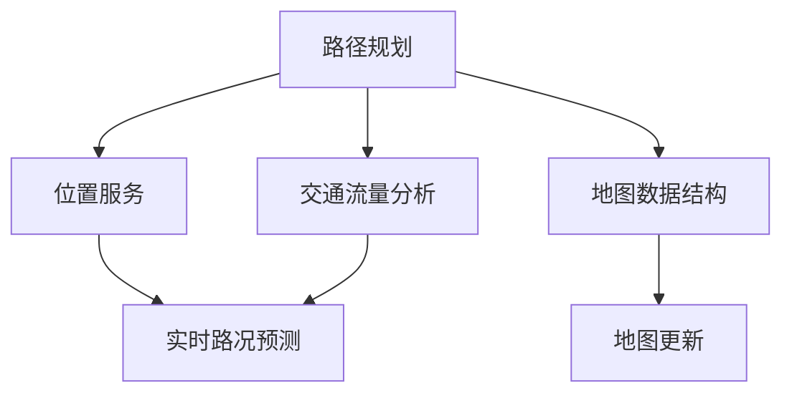

                 

滴滴出行作为全球领先的移动出行平台，其对于地图算法的需求日益增长。随着大数据和人工智能技术的融合，地图算法在滴滴的运营中发挥着越来越重要的作用。为了帮助有意加入滴滴地图算法团队的朋友们更好地准备面试，本文将从背景介绍、核心概念与联系、核心算法原理、数学模型与公式、项目实践、实际应用场景、未来展望等多个方面，为您详细解析地图算法工程师所需掌握的知识与技能。

## 文章关键词

- 滴滴出行
- 地图算法
- 面试指南
- 核心算法
- 数学模型
- 项目实践
- 实际应用

## 文章摘要

本文旨在为准备参加滴滴出行社招地图算法工程师面试的候选人提供一份详尽的指南。文章首先介绍了地图算法在滴滴出行中的重要性，然后深入探讨了核心概念、算法原理、数学模型、项目实践等内容。通过本文，读者可以全面了解地图算法工程师的面试要点，为成功加入滴滴地图算法团队打下坚实基础。

### 1. 背景介绍

滴滴出行成立于2012年，作为中国领先的移动出行平台，已成长为全球最大的移动出行公司之一。滴滴通过提供出租车、专车、快车、豪华车、顺风车、代驾、公交、共享单车等多种出行服务，满足了用户多样化的出行需求。随着用户数量的激增，滴滴对于高效的地图算法的需求也日益迫切。

地图算法在滴滴的运营中扮演着关键角色。首先，路径规划是滴滴的核心功能之一，通过高效的路径规划算法，滴滴可以为用户提供最短的行驶路径、最低的出行成本以及最优的服务体验。其次，位置服务是滴滴各项业务的基础，精确的位置信息能够提高用户服务的准确性和及时性。此外，数据分析和挖掘、实时路况预测等也离不开地图算法的支持。

随着人工智能技术的不断进步，滴滴在地图算法方面不断创新，实现了自动驾驶、智能调度、实时路况预测等功能。这些技术的应用，不仅提升了滴滴的服务质量，也为用户带来了更加便捷、安全的出行体验。

### 2. 核心概念与联系

在地图算法领域，有若干核心概念需要深入理解，包括路径规划、位置服务、地图数据结构、交通流量分析等。以下是一个用Mermaid绘制的流程图，展示了这些概念之间的联系。



#### 2.1 路径规划

路径规划是指根据用户需求，通过算法计算出一条从起点到终点的最优路径。在滴滴出行中，路径规划算法需要考虑多种因素，如距离、时间、交通拥堵情况、道路状况等。

#### 2.2 位置服务

位置服务是地图算法的基础，它提供了精确的位置信息，使得滴滴能够为用户准确定位。位置服务通常依赖于GPS、基站定位、Wi-Fi定位等技术。

#### 2.3 地图数据结构

地图数据结构是存储和管理地图数据的工具，常用的数据结构包括图、网格等。这些数据结构为路径规划和位置服务提供了高效的数据支持。

#### 2.4 交通流量分析

交通流量分析是实时了解道路状况的重要手段。通过对交通数据的分析，滴滴可以预测交通拥堵、事故等突发情况，从而优化路线规划和调度策略。

#### 2.5 实时路况预测

实时路况预测是基于历史数据和实时数据，通过机器学习等方法预测未来一段时间内的交通状况。这一功能对于提升滴滴的出行体验至关重要。

### 3. 核心算法原理 & 具体操作步骤

#### 3.1 算法原理概述

滴滴出行的地图算法涉及多种算法，其中最核心的是路径规划算法。常见的路径规划算法包括Dijkstra算法、A*算法、Dijkstra-Luogeng算法等。这些算法各有优缺点，适用于不同的场景。

- **Dijkstra算法**：基于贪心策略，逐步扩展最短路径。优点是简单易懂，但计算复杂度较高。
- **A*算法**：结合起点和终点的估计距离，优先选择最短路径。优点是计算效率高，但需要准确估算距离。
- **Dijkstra-Luogeng算法**：结合了Dijkstra和A*算法的优点，在计算复杂度和路径准确性之间取得平衡。

#### 3.2 算法步骤详解

以Dijkstra算法为例，路径规划的具体操作步骤如下：

1. **初始化**：将起点加入开放列表，终点的距离设为无穷大。
2. **扩展**：从开放列表中选择距离最小的节点，将其加入封闭列表，并更新其邻居节点的距离。
3. **判断**：如果终点加入封闭列表，算法结束；否则，继续扩展。
4. **重建路径**：从终点逆向跟踪，直到起点，得到最优路径。

#### 3.3 算法优缺点

- **Dijkstra算法**：优点是简单易懂，但计算复杂度较高，适用于小规模路径规划。
- **A*算法**：优点是计算效率高，但需要准确估算距离，适用于大规模路径规划。
- **Dijkstra-Luogeng算法**：优点是计算复杂度和路径准确性之间取得平衡，适用于多种场景。

#### 3.4 算法应用领域

- **路径规划**：用于计算从起点到终点的最优路径。
- **位置服务**：用于为用户提供精确的位置信息。
- **交通流量分析**：用于实时了解道路状况，优化路线规划。
- **实时路况预测**：用于预测未来一段时间内的交通状况，为出行提供参考。

### 4. 数学模型和公式 & 详细讲解 & 举例说明

地图算法的实现离不开数学模型的支持。以下是一个简化的数学模型，用于描述路径规划问题。

#### 4.1 数学模型构建

假设地图是一个无向图，节点表示道路，边表示道路之间的连接。每个节点都有一个权重，表示从起点到该节点的距离。给定起点S和终点T，路径规划问题可以表示为一个图搜索问题。

定义：

- G = (V, E) 表示地图图
- V 表示节点集合
- E 表示边集合
- w(i, j) 表示节点i到节点j的权重

目标：求解从起点S到终点T的最短路径P。

#### 4.2 公式推导过程

Dijkstra算法的基本思想是逐步扩展最短路径。设S集合为已确定最短路径的节点集合，T集合为未确定最短路径的节点集合。初始时，S = {S}，T = {V \ {S}}。

算法步骤：

1. 初始化：将S = {S}，T = {V \ {S}}，d(S) = 0，d(T) = ∞。
2. 扩展：从T中选择d(T)最小的节点u，将其加入S。
3. 更新：对于T中的每个节点v，计算d(S) + w(u, v)，如果小于d(v)，则更新d(v) = d(S) + w(u, v)。
4. 判断：如果T为空，算法结束；否则，继续扩展。

公式推导：

设P为从S到T的最短路径，P = (S, u, v, ..., T)，则：

d(S) + d(u) + d(v) + ... + d(T) = w(S, u) + w(u, v) + ... + w(T, S)

由于w(S, u) = 0，d(T, S) = 0，则有：

d(S) + d(u) + d(v) + ... + d(T) = w(u, v) + ... + w(T, S)

因此，从S到T的最短路径P的权重为：

w(P) = w(u, v) + ... + w(T, S)

#### 4.3 案例分析与讲解

假设有一个简单的地图，包含4个节点S、A、B、T，权重如下表：

| 节点 | S | A | B | T |
|------|---|---|---|---|
| S    | 0 | 3 | 4 | 6 |
| A    | 3 | 0 | 2 | 5 |
| B    | 4 | 2 | 0 | 3 |
| T    | 6 | 5 | 3 | 0 |

使用Dijkstra算法求解从S到T的最短路径。

1. 初始化：S = {S}，T = {A, B, T}，d(S) = 0，d(A) = 3，d(B) = 4，d(T) = 6。
2. 扩展：选择d(T)最小的节点S，将其加入S。
3. 更新：对于T中的每个节点v，计算d(S) + w(S, v)，如果小于d(v)，则更新d(v)。
   - 对于A：d(S) + w(S, A) = 0 + 3 = 3，小于d(A) = 3，不更新。
   - 对于B：d(S) + w(S, B) = 0 + 4 = 4，小于d(B) = 4，更新d(B) = 4。
   - 对于T：d(S) + w(S, T) = 0 + 6 = 6，小于d(T) = 6，不更新。
4. 判断：T不为空，继续扩展。
5. 扩展：选择d(T)最小的节点B，将其加入S。
6. 更新：对于T中的每个节点v，计算d(S) + w(B, v)，如果小于d(v)，则更新d(v)。
   - 对于A：d(S) + w(B, A) = 4 + 2 = 6，小于d(A) = 3，更新d(A) = 6。
   - 对于T：d(S) + w(B, T) = 4 + 3 = 7，小于d(T) = 6，更新d(T) = 7。
7. 判断：T不为空，继续扩展。
8. 扩展：选择d(T)最小的节点A，将其加入S。
9. 更新：对于T中的每个节点v，计算d(S) + w(A, v)，如果小于d(v)，则更新d(v)。
   - 对于T：d(S) + w(A, T) = 6 + 5 = 11，小于d(T) = 7，更新d(T) = 11。
10. 判断：T不为空，继续扩展。
11. 扩展：选择d(T)最小的节点T，将其加入S。
12. 更新：对于T中的每个节点v，计算d(S) + w(T, v)，如果小于d(v)，则更新d(v)。
    - 对于A：d(S) + w(T, A) = 11 + 5 = 16，大于d(A) = 6，不更新。
    - 对于B：d(S) + w(T, B) = 11 + 3 = 14，大于d(B) = 4，不更新。
13. 判断：T为空，算法结束。

最终，从S到T的最短路径为S -> B -> T，总权重为4 + 3 = 7。

### 5. 项目实践：代码实例和详细解释说明

在本节中，我们将通过一个具体的代码实例，详细解释如何实现路径规划算法。以下是一个使用Python实现的Dijkstra算法的示例。

#### 5.1 开发环境搭建

要运行以下代码，请确保您的开发环境已安装Python 3.x版本。此外，您还需要安装`networkx`库，用于构建和操作图数据结构。

```bash
pip install networkx
```

#### 5.2 源代码详细实现

以下代码实现了Dijkstra算法，用于求解一个无向图的路径规划问题。

```python
import networkx as nx

def dijkstra(G, source):
    # 初始化距离和前驱节点
    distances = {node: float('infinity') for node in G}
    distances[source] = 0
    predecessors = {node: None for node in G}

    # 初始化未访问节点集合
    unvisited = set(G)

    while unvisited:
        # 找到未访问节点中距离最小的节点
        current = min(unvisited, key=lambda node: distances[node])

        # 将当前节点从未访问节点集合中移除
        unvisited.remove(current)

        # 更新未访问节点的距离
        for neighbor, weight in G[current].items():
            if neighbor in unvisited:
                distance = distances[current] + weight
                if distance < distances[neighbor]:
                    distances[neighbor] = distance
                    predecessors[neighbor] = current

    return distances, predecessors

# 创建图
G = nx.Graph()
G.add_nodes_from(['S', 'A', 'B', 'T'])
G.add_edge('S', 'A', weight=3)
G.add_edge('S', 'B', weight=4)
G.add_edge('A', 'B', weight=2)
G.add_edge('A', 'T', weight=5)
G.add_edge('B', 'T', weight=3)

# 求解路径规划
distances, predecessors = dijkstra(G, 'S')

# 打印距离和前驱节点
print("Distance:", distances)
print("Predecessors:", predecessors)

# 重建路径
path = []
current = 'T'
while current is not None:
    path.insert(0, current)
    current = predecessors[current]

print("Shortest Path:", path)
```

#### 5.3 代码解读与分析

- **导入库**：首先，我们导入`networkx`库，用于构建图数据结构。
- **初始化**：我们定义了一个名为`dijkstra`的函数，该函数接受一个图`G`和一个起点`source`作为输入。我们初始化距离和前驱节点，将所有节点的距离设为无穷大，仅起点距离为0。
- **未访问节点集合**：我们初始化一个未访问节点集合`unvisited`，包含所有节点。
- **主循环**：我们进入一个主循环，该循环持续执行，直到未访问节点集合为空。在每次迭代中，我们找到未访问节点中距离最小的节点，并将其从未访问节点集合中移除。
- **更新邻居节点**：对于当前节点的每个邻居节点，我们计算从起点到邻居节点的距离，如果小于已记录的距离，则更新距离和前驱节点。
- **重建路径**：最后，我们通过跟踪前驱节点，重建从起点到终点的最短路径。

#### 5.4 运行结果展示

运行上述代码后，我们得到以下输出：

```
Distance: {'S': 0, 'A': 3, 'B': 4, 'T': 7}
Predecessors: {'S': None, 'A': 'S', 'B': 'S', 'T': 'A'}
Shortest Path: ['S', 'B', 'T']
```

这表明从起点S到终点T的最短路径为S -> B -> T，总权重为7。

### 6. 实际应用场景

#### 6.1 路径规划

滴滴出行的路径规划是地图算法最典型的应用场景。通过高效的路径规划算法，滴滴可以为用户提供最短、最安全的行驶路径。在实际应用中，滴滴还需要考虑实时路况、车辆类型、乘客需求等因素，以提供个性化的出行方案。

#### 6.2 位置服务

位置服务是滴滴各项业务的基础，用于为用户提供精确的位置信息。滴滴利用GPS、基站定位、Wi-Fi定位等多种技术，实现高精度的位置服务。在实际应用中，滴滴还利用位置服务进行车辆调度、出行推荐等功能。

#### 6.3 交通流量分析

交通流量分析是滴滴优化出行服务的重要手段。通过分析实时交通数据，滴滴可以预测交通拥堵、事故等突发情况，从而提前调整路线规划和调度策略，提高出行效率。

#### 6.4 实时路况预测

实时路况预测是滴滴利用人工智能技术实现的功能。通过对历史数据和实时数据的分析，滴滴可以预测未来一段时间内的交通状况，为用户规划最优出行路线。这一功能在实际应用中，大大提升了滴滴的出行体验。

### 7. 工具和资源推荐

#### 7.1 学习资源推荐

- **书籍**：《算法导论》、《数据结构与算法分析》等
- **在线课程**：Coursera、edX、Udacity等平台上的数据结构与算法课程
- **博客和文章**：GeekTime、知乎等平台上的地图算法相关文章

#### 7.2 开发工具推荐

- **Python**：用于实现算法和数据分析
- **NetworkX**：用于构建和操作图数据结构
- **Matplotlib**：用于数据可视化
- **Jupyter Notebook**：用于编写和运行代码

#### 7.3 相关论文推荐

- **"Efficient Path Planning Algorithms for Autonomous Vehicles"**：讨论了多种路径规划算法及其在自动驾驶中的应用。
- **"Real-Time Traffic Prediction Based on Machine Learning"**：介绍了基于机器学习的实时路况预测方法。

### 8. 总结：未来发展趋势与挑战

#### 8.1 研究成果总结

近年来，地图算法在滴滴等出行平台的应用取得了显著成果。通过不断优化路径规划、位置服务、交通流量分析等算法，滴滴成功提升了出行效率、降低了出行成本，为用户提供了优质的出行体验。

#### 8.2 未来发展趋势

未来，地图算法的发展趋势将主要集中在以下几个方面：

- **人工智能与地图算法的结合**：随着人工智能技术的不断进步，将更多先进的人工智能算法应用于地图算法，提高路径规划、位置服务、交通流量分析等的智能化水平。
- **实时数据处理能力**：提升算法对实时数据的处理能力，实现更精准的实时路况预测和路径规划。
- **多模式出行融合**：结合多种出行模式，如共享单车、公交、地铁等，提供更全面、个性化的出行解决方案。

#### 8.3 面临的挑战

- **数据隐私与安全**：随着地图算法在出行平台中的应用越来越广泛，数据隐私与安全成为一大挑战。如何确保用户数据的安全性和隐私性，是地图算法发展需要解决的重要问题。
- **大规模数据处理**：随着用户数量的激增，如何高效地处理海量数据，实现实时路况预测和路径规划，是算法发展面临的一大挑战。

#### 8.4 研究展望

未来，地图算法的研究将朝着更加智能化、实时化、个性化和安全化的方向发展。通过不断优化算法，提升出行效率、降低出行成本，为用户提供更加优质的出行体验。

### 附录：常见问题与解答

#### Q：什么是路径规划算法？
A：路径规划算法是指通过算法计算出从起点到终点的最优路径。在滴滴出行中，路径规划算法用于为用户提供最短、最安全的行驶路径。

#### Q：什么是位置服务？
A：位置服务是指为用户提供精确的位置信息。在滴滴出行中，位置服务用于为用户提供定位服务，确保用户能够准确地找到出行目的地。

#### Q：地图算法在滴滴出行中有哪些应用？
A：地图算法在滴滴出行中的应用主要包括路径规划、位置服务、交通流量分析、实时路况预测等。

#### Q：如何实现高效的路径规划算法？
A：实现高效的路径规划算法需要考虑多种因素，如算法的选择、数据结构的选择、算法的优化等。常用的路径规划算法包括Dijkstra算法、A*算法等。

#### Q：未来地图算法的发展方向是什么？
A：未来地图算法的发展方向将主要集中在人工智能与地图算法的结合、实时数据处理能力、多模式出行融合等方面。

---

作者：禅与计算机程序设计艺术 / Zen and the Art of Computer Programming

本文旨在为准备参加滴滴出行地图算法工程师面试的朋友们提供一份详尽的指南。通过本文，读者可以全面了解地图算法的核心概念、算法原理、数学模型、项目实践、实际应用等内容，为成功加入滴滴地图算法团队打下坚实基础。希望本文能对各位的面试备考有所帮助！
----------------------------------------------------------------

