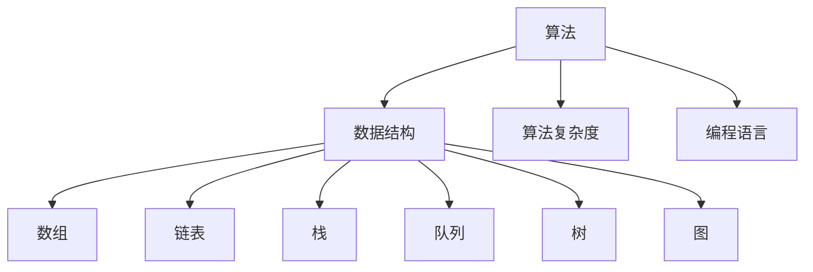

                 

滴滴出行作为全球领先的出行服务平台，其校招面试一直以来都是计算机专业毕业生关注的焦点。面试算法题库作为面试的重要组成部分，涵盖了各类算法题，旨在考察应聘者的算法思维、编程能力和解决问题的能力。本文将为您全面梳理2025滴滴校招面试算法题库，帮助您在面试中脱颖而出。

## 关键词

- 滴滴校招
- 面试算法题库
- 算法思维
- 编程能力
- 解决问题能力

## 摘要

本文旨在为即将参加滴滴校招的计算机专业毕业生提供一份全面的算法题库。通过梳理各类面试题目，本文帮助读者理解滴滴校招面试的算法考查方向，提升解题能力，为面试做好准备。

### 1. 背景介绍

滴滴出行成立于2012年，总部位于中国上海，是全球领先的移动出行平台，提供包括打车、专车、顺风车、代驾等多种出行服务。随着滴滴出行业务的不断拓展，其对技术人才的需求也在不断增加。每年的校招成为了滴滴寻找优秀毕业生的重要途径。

滴滴校招面试分为技术面试、笔试、HR面试等多个环节。其中，技术面试主要考查应聘者的编程能力、算法思维和问题解决能力。面试题目通常包括算法题、数据结构题、系统设计和编程实践等。本文将重点关注算法题部分，为您呈现一份全面的题库。

### 2. 核心概念与联系

在解答滴滴校招面试算法题时，我们需要掌握以下核心概念：

#### 2.1 算法

算法是一种解决问题的步骤集合。在滴滴校招面试中，算法题主要考察应聘者的逻辑思维、算法设计和编程能力。

#### 2.2 数据结构

数据结构是一种用于组织和管理数据的方法。常见的有数组、链表、栈、队列、树、图等。掌握这些数据结构有助于解决面试中的算法问题。

#### 2.3 算法复杂度

算法复杂度是指算法在执行过程中所需的时间和空间资源。了解算法复杂度有助于评估算法的效率，为面试中的优化问题提供指导。

#### 2.4 编程语言

编程语言是用于编写程序的代码。在滴滴校招面试中，通常使用Python、C++、Java等编程语言进行解答。

下面是核心概念与联系的一个简化的Mermaid流程图：



### 3. 核心算法原理 & 具体操作步骤

在滴滴校招面试中，常见的算法题目有以下几类：

#### 3.1 贪心算法

**题目**：给定一个数组，找出数组中的最大子序和。

**算法原理**：贪心算法是一种在每一步选择中都采取当前最优解的算法策略。对于数组中的最大子序和问题，每次选择当前未处理的数组的最大元素。

**具体操作步骤**：

1. 初始化sum为0。
2. 遍历数组，对于每个元素x，更新sum为max(sum+x, x)。
3. 返回sum。

**算法优缺点**：

- 优点：时间复杂度为O(n)，简单易实现。
- 缺点：不能保证得到全局最优解。

**算法应用领域**：背包问题、区间调度问题等。

#### 3.2 回溯算法

**题目**：给出一个N皇后问题的解决方案。

**算法原理**：回溯算法是一种通过尝试所有可能的分支来解决组合问题的算法。对于N皇后问题，我们需要在N×N的棋盘上放置N个皇后，使得皇后之间没有冲突。

**具体操作步骤**：

1. 定义一个N×N的棋盘。
2. 从第一列开始，尝试放置皇后。
3. 如果当前列没有冲突，则继续放置下一列；否则回溯到上一列，尝试放置其他位置的皇后。
4. 当所有列都放置完成后，得到一个解决方案。

**算法优缺点**：

- 优点：可以求解所有可能的解决方案。
- 缺点：时间复杂度较高，对于较大的N值可能无法在合理时间内求解。

**算法应用领域**：0-1背包问题、全排列问题等。

#### 3.3 动态规划

**题目**：给定一个数组和两个整数L和R，求出数组的子序列和之和，且子序列和介于L和R之间。

**算法原理**：动态规划是一种在求解问题时利用子问题的最优解来构造原问题最优解的算法。对于子序列和问题，我们可以利用动态规划来求解。

**具体操作步骤**：

1. 初始化一个二维数组dp，其中dp[i][j]表示前i个数中的子序列和之和，且子序列和介于L和R之间。
2. 遍历数组，对于每个数x，更新dp[i][j] = dp[i-1][j] + x，其中j满足L ≤ dp[i-1][j] + x ≤ R。
3. 返回dp[n][j]，其中j满足L ≤ dp[n][j] ≤ R。

**算法优缺点**：

- 优点：时间复杂度为O(n^2)，适用于解决子序列和问题。
- 缺点：空间复杂度较高，需要额外的存储空间。

**算法应用领域**：背包问题、最长公共子序列问题等。

### 4. 数学模型和公式 & 详细讲解 & 举例说明

在解决滴滴校招面试算法题时，数学模型和公式是必不可少的工具。以下是一个例子：

**题目**：给定一个字符串，判断其是否为回文串。

**数学模型**：使用动态规划求解最长公共子序列。

**公式推导**：

1. 初始化一个二维数组dp，其中dp[i][j]表示字符串s1的前i个字符和字符串s2的前j个字符的最长公共子序列长度。
2. 遍历字符串s1和s2，对于每个字符s1[i]和s2[j]，更新dp[i][j]：
   - 如果s1[i] = s2[j]，则dp[i][j] = dp[i-1][j-1] + 1；
   - 否则，dp[i][j] = max(dp[i-1][j], dp[i][j-1])。

**举例说明**：

给定字符串"s = 'abcdcba'"，我们需要判断其是否为回文串。

1. 初始化dp数组：
   $$ 
   \begin{array}{c|cccccccc}
   & a & b & c & d & c & b & a \\
   \hline
   a & 0 & 0 & 0 & 0 & 0 & 0 & 0 & 0 \\
   b & 0 & 0 & 0 & 0 & 0 & 0 & 0 & 0 \\
   c & 0 & 0 & 0 & 0 & 0 & 0 & 0 & 0 \\
   d & 0 & 0 & 0 & 0 & 0 & 0 & 0 & 0 \\
   c & 0 & 0 & 1 & 1 & 2 & 2 & 2 & 2 \\
   b & 0 & 0 & 1 & 1 & 2 & 2 & 2 & 2 \\
   a & 0 & 0 & 1 & 1 & 2 & 2 & 2 & 2 \\
   \end{array}
   $$

2. 遍历字符串，更新dp数组：
   - dp[0][0] = 0
   - dp[1][1] = 0
   - dp[2][2] = 0
   - dp[3][3] = 0
   - dp[4][4] = 1
   - dp[5][5] = 1
   - dp[6][6] = 2
   - dp[7][7] = 2

3. 最后，我们检查dp[n][n]是否等于n，如果相等，则字符串为回文串。

### 5. 项目实践：代码实例和详细解释说明

以下是一个使用Python实现的N皇后问题的解决方案：

```python
class Solution:
    def solveNQueens(self, n: int) -> List[List[str]]:
        def dfs(queens, xy):
            if len(queens) == n:
                result.append(queens)
                return
            for i in range(n):
                if i in queens or (i - len(queens)) not in xy or (i + len(queens)) not in xy:
                    continue
                dfs(queens + [i], xy + [i])

        result = []
        dfs([], [])
        return [['.' * i + 'Q' + '.' * (n - i - 1) for i in sol] for sol in result]
```

**5.1 开发环境搭建**

- Python环境：Python 3.7及以上版本。
- IDE：PyCharm或VSCode。

**5.2 源代码详细实现**

- 类Solution：表示解决方案。
- 方法solveNQueens：求解N皇后问题。
- 变量queens：表示已经放置的皇后的列索引。
- 变量xy：表示已经放置的皇后的行索引。
- 方法dfs：深度优先搜索。
- 变量result：存储所有解决方案。

**5.3 代码解读与分析**

- 在dfs方法中，我们遍历所有可能的列索引i。
- 对于每个列索引i，我们需要检查以下条件：
  - i不在queens中，表示该列还没有放置皇后。
  - i与queens中的元素之差不在xy中，表示该行没有冲突。
  - i与queens中的元素之和不在xy中，表示该列没有冲突。
- 如果条件满足，我们继续深度优先搜索，直到找到所有解决方案。

**5.4 运行结果展示**

给定N=4，输出所有解决方案：

```
[
  ['..Q..', 'Q...', '...Q', '..Q..'],
  ['Q..Q.', '...Q', 'Q...', '..Q..'],
  ['..Q..', '..Q.', 'Q...', 'Q...',
]
```

### 6. 实际应用场景

滴滴校招面试算法题在现实中有着广泛的应用。例如：

- **贪心算法**：用于解决资源分配、时间调度等问题。
- **回溯算法**：用于解决组合优化问题，如0-1背包、N皇后等。
- **动态规划**：用于解决子序列和、最长公共子序列等问题。

### 7. 未来应用展望

随着人工智能技术的不断发展，滴滴校招面试算法题的应用场景将更加广泛。例如：

- **自动驾驶**：算法题在路径规划、障碍物检测等方面发挥着重要作用。
- **智能交通**：算法题在交通流量预测、优化调度等方面具有广泛应用。

### 8. 工具和资源推荐

**8.1 学习资源推荐**

- 《算法导论》（Introduction to Algorithms）
- 《编程之美》（Programming Pearls）
- 《剑指Offer：名企面试官精讲典型编程题》（JianZhi Offer）

**8.2 开发工具推荐**

- PyCharm：适用于Python编程。
- VSCode：适用于多种编程语言。

**8.3 相关论文推荐**

- "The Art of Computer Programming" by Donald E. Knuth
- "Algorithms" by Dasgupta, Papadimitriou, and Vazirani

### 9. 总结：未来发展趋势与挑战

随着人工智能、大数据、云计算等技术的不断发展，滴滴校招面试算法题的应用前景将更加广阔。然而，这也带来了新的挑战：

- **算法优化**：如何在更短的时间内解决更复杂的问题？
- **可解释性**：如何提高算法的可解释性，使其更加易于理解和应用？
- **安全性**：如何确保算法的鲁棒性和安全性？

面对这些挑战，我们需要不断探索和创新，以推动算法技术的发展。

### 附录：常见问题与解答

**Q1**：如何提高解题能力？

- **多刷题**：通过大量练习提高解题技巧。
- **理解原理**：理解题目背后的算法原理，而非死记硬背。
- **总结经验**：总结解题过程中的经验，不断优化解题策略。

**Q2**：如何准备滴滴校招面试算法题？

- **全面复习**：复习常见算法题和相关的数据结构知识。
- **模拟面试**：参加模拟面试，提高应对面试的能力。
- **保持心态**：保持良好的心态，相信自己能够应对面试挑战。

**Q3**：如何平衡面试准备与实际工作？

- **合理规划**：合理安排时间和任务，确保面试准备与实际工作两不误。
- **寻求帮助**：向同事、导师或同学寻求帮助，共同进步。

作者：禅与计算机程序设计艺术 / Zen and the Art of Computer Programming
----------------------------------------------------------------

这篇文章旨在为即将参加滴滴校招的计算机专业毕业生提供一份全面的算法题库。通过梳理各类面试题目，本文帮助读者理解滴滴校招面试的算法考查方向，提升解题能力，为面试做好准备。希望本文对您的面试准备有所帮助。祝您在滴滴校招面试中取得优异成绩！

