                 

关键词：沉浸式视频，音视频处理，面试题，人工智能，深度学习，视频编码，视频渲染，音效处理，流媒体技术，实时传输，图像处理，动态效果，用户交互，音视频同步，直播技术，虚拟现实，增强现实，VR/AR应用，内容分发网络，视频压缩，图像增强，噪声抑制，音频降噪，人声增强，视频质量评估，数据挖掘，机器学习算法，音视频编辑，音视频合成，多通道音频处理，智能音频识别，沉浸式音频体验，音频同步技术，交互式视频，多视角视频，全息视频，视频稳定化，动作捕捉，场景识别，智能推荐系统，内容安全，音视频版权保护，AI语音助手，虚拟主播，人脸识别，动作识别，手势识别，智能分析，实时翻译，字幕生成，智能剪辑，增强视频体验，音视频编码优化，HDR视频处理，低延迟传输，网络优化，跨平台兼容性，移动端应用，云服务，云计算，大数据，视频播放器优化，交互设计，用户满意度，用户体验，商业模式创新，行业趋势分析，技术标准化。

## 摘要

随着互联网技术的飞速发展和人工智能技术的广泛应用，沉浸式视频已经成为视频行业的一大趋势。本文旨在探讨爱奇艺2025沉浸式视频社招中涉及的音视频处理技术面试题，包括核心概念、算法原理、数学模型、项目实践、应用场景以及未来展望等。通过分析这些面试题，我们可以深入了解沉浸式视频技术的关键挑战和发展方向，为行业人才提供有价值的参考。

## 1. 背景介绍

### 沉浸式视频的发展历程

沉浸式视频是一种通过多视角、多通道、多感官的交互式体验，让用户在观看视频时感受到强烈的现场感和参与感的视频形式。其概念最早可以追溯到虚拟现实（VR）和增强现实（AR）技术，随着这些技术的发展，沉浸式视频逐渐成为一种独立的视频形式。

沉浸式视频的发展历程可以追溯到20世纪90年代，当时虚拟现实和增强现实技术刚刚兴起。随着计算机处理能力的提升和网络带宽的增加，沉浸式视频技术开始逐步应用于游戏、影视等领域。进入21世纪，随着智能手机、平板电脑等移动设备的普及，沉浸式视频逐渐走向大众市场。

近年来，随着5G技术的推广和应用，沉浸式视频得到了进一步的发展。5G网络的高速、低延迟特性为沉浸式视频的实时传输提供了良好的支持，使得用户可以在各种场景下享受到沉浸式的视频体验。

### 爱奇艺在沉浸式视频领域的地位

爱奇艺作为中国领先的在线视频平台，一直致力于推动沉浸式视频技术的发展。在沉浸式视频领域，爱奇艺取得了多项重要成果：

1. **多视角视频**：爱奇艺率先推出了多视角视频技术，用户可以通过选择不同的视角来观看视频，增强了观看的互动性和沉浸感。

2. **VR/AR应用**：爱奇艺在VR/AR领域进行了大量的探索和研发，推出了多款基于VR/AR技术的应用，如VR电影、VR游戏等，为用户提供了全新的娱乐体验。

3. **实时传输技术**：爱奇艺通过优化视频编码技术和传输协议，实现了沉浸式视频的低延迟实时传输，确保用户在观看沉浸式视频时能够享受到流畅的视听体验。

4. **用户交互**：爱奇艺通过引入智能语音助手、手势识别等技术，提升了用户在沉浸式视频中的交互体验，使用户可以更加便捷地选择观看内容、调节音量等。

### 沉浸式视频的重要性

沉浸式视频不仅为用户提供了全新的视听体验，还在多个领域具有广泛的应用前景：

1. **娱乐行业**：沉浸式视频技术使得用户可以在家中享受到与现场几乎无异的视频体验，提升了用户的娱乐体验。

2. **教育行业**：沉浸式视频技术可以为学生提供身临其境的学习体验，有助于提高学习效果。

3. **医疗行业**：沉浸式视频技术可以用于远程医疗咨询、手术指导等，为医生和患者提供更加便捷和高效的医疗服务。

4. **旅游行业**：沉浸式视频技术可以让用户在家中就能体验世界各地风景名胜，促进旅游业的发展。

总之，沉浸式视频作为一种新兴的视频形式，正逐渐改变着人们的生活方式和娱乐方式，具有重要的社会和经济价值。

### 音视频处理技术的概述

音视频处理技术是沉浸式视频技术的重要组成部分，主要包括视频编码、视频渲染、音效处理、音频同步等多个方面。这些技术不仅直接影响沉浸式视频的质量和用户体验，还决定了沉浸式视频的应用范围和可行性。

1. **视频编码**：视频编码是将原始视频信号转换为压缩格式的过程，以减少数据传输和存储的开销。常见的视频编码标准有H.264、H.265等，这些标准通过复杂的算法和技术，实现了视频数据的高效压缩。

2. **视频渲染**：视频渲染是将编码后的视频数据解码并呈现在屏幕上的过程。渲染技术决定了视频的显示效果，包括色彩还原、画面清晰度、运动流畅度等。

3. **音效处理**：音效处理是对音频信号进行编辑和处理的过程，以提升音频的质量和效果。音效处理技术包括音频降噪、人声增强、音效混合等。

4. **音频同步**：音频同步是将音频与视频同步显示的过程，确保用户在观看视频时能够享受到连贯的视听体验。

### 音视频处理技术在沉浸式视频中的重要性

在沉浸式视频中，音视频处理技术的重要性更加凸显：

1. **用户体验**：高效的音视频处理技术能够确保用户在观看沉浸式视频时享受到高质量的视听体验，提升用户的满意度。

2. **传输效率**：随着沉浸式视频的数据量巨大，高效的音视频处理技术可以减少数据传输和存储的开销，提高传输效率。

3. **实时性**：沉浸式视频通常需要实时传输和播放，高效的音视频处理技术能够确保视频和音频的实时同步，避免延迟和卡顿现象。

4. **多样性**：音视频处理技术可以为沉浸式视频提供多样化的内容，如多通道音频、动态效果、实时翻译等，满足用户不同的观看需求。

综上所述，音视频处理技术是沉浸式视频技术的核心组成部分，对于提升沉浸式视频的质量和用户体验具有重要意义。

## 2. 核心概念与联系

在探讨沉浸式视频处理技术之前，我们首先需要了解一些核心概念和原理，这些概念和原理构成了沉浸式视频技术的基础。为了更好地理解这些概念，我们将使用Mermaid流程图来展示其架构和联系。

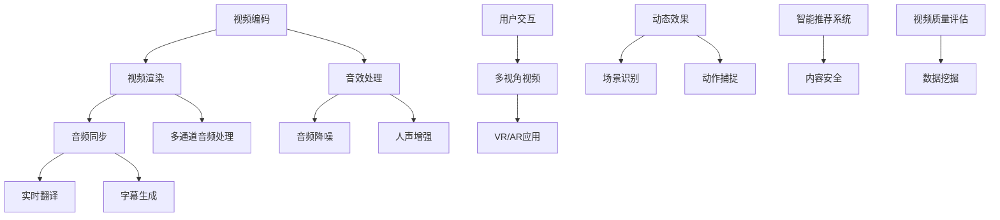

### 视频编码

**视频编码**是将原始视频信号转换为压缩格式的过程。在沉浸式视频中，视频编码尤为重要，因为它直接影响到视频的传输效率和存储空间。常见的视频编码标准包括H.264和H.265。H.264标准被广泛用于高清视频传输，而H.265则进一步提升了压缩效率，适用于4K、8K等超高清视频。

**算法原理**：
- **变换编码**：将视频帧转换为频率域表示，如离散余弦变换（DCT）。
- **量化**：将变换后的系数进行量化，降低数据精度以减少数据量。
- **熵编码**：使用熵编码技术，如霍夫曼编码或算术编码，进一步压缩数据。

**具体操作步骤**：
1. **帧差分**：计算连续帧之间的差异，只传输变化部分。
2. **变换编码**：将帧差分结果进行DCT等变换。
3. **量化**：根据需要压缩的程度对变换后的系数进行量化。
4. **熵编码**：对量化后的系数进行熵编码。

**优缺点**：
- **优点**：高效的数据压缩，减少了数据传输和存储的开销。
- **缺点**：解码复杂度较高，对硬件性能要求较高。

**应用领域**：高清视频传输、流媒体服务、视频存储等。

### 视频渲染

**视频渲染**是将编码后的视频数据解码并呈现在屏幕上的过程。在沉浸式视频中，视频渲染不仅需要高效率，还需要高质量的显示效果。

**算法原理**：
- **图像重建**：将编码后的视频帧解码，恢复图像。
- **色彩还原**：根据显示设备的特性，对解码后的图像进行色彩校正，以确保色彩的准确性。
- **运动补偿**：对连续帧之间的运动进行补偿，提高播放流畅度。

**具体操作步骤**：
1. **解码**：对编码的视频数据进行解码。
2. **图像重建**：将解码后的数据转换为图像。
3. **色彩还原**：进行色彩校正。
4. **运动补偿**：对连续帧进行运动估计和补偿。

**优缺点**：
- **优点**：高效率的解码和显示，提升了用户体验。
- **缺点**：对显示设备的兼容性要求较高。

**应用领域**：高清电视、电脑显示器、移动设备等。

### 音效处理

**音效处理**是对音频信号进行编辑和处理的过程，以提升音频的质量和效果。在沉浸式视频中，音效处理尤为重要，因为它直接影响到用户的听觉体验。

**算法原理**：
- **音频降噪**：去除背景噪声，提高音频的清晰度。
- **人声增强**：增强人声部分，使得对话更加清晰。
- **音效混合**：将不同来源的音频进行混合，以创建更加丰富的音效。

**具体操作步骤**：
1. **音频降噪**：使用滤波器或卷积神经网络（CNN）等方法去除噪声。
2. **人声增强**：使用语音增强算法增强人声部分。
3. **音效混合**：将不同来源的音频信号进行加权混合。

**优缺点**：
- **优点**：提高了音频的质量和效果。
- **缺点**：对计算资源要求较高，处理时间较长。

**应用领域**：音乐制作、语音通话、电影制作等。

### 音频同步

**音频同步**是将音频与视频同步显示的过程，确保用户在观看视频时能够享受到连贯的视听体验。

**算法原理**：
- **时间戳匹配**：通过比较视频帧和音频帧的时间戳，确保两者同步。
- **缓冲控制**：根据网络传输情况调整音频播放的缓冲时间，以避免延迟。

**具体操作步骤**：
1. **时间戳匹配**：比较视频帧和音频帧的时间戳，确保同步。
2. **缓冲控制**：根据网络传输情况调整缓冲时间。

**优缺点**：
- **优点**：提高了视听体验的连贯性。
- **缺点**：对网络传输的稳定性要求较高。

**应用领域**：流媒体服务、直播平台等。

### 多通道音频处理

**多通道音频处理**是在沉浸式视频中提供多通道音频信号的处理过程。多通道音频可以为用户提供更加沉浸式的听觉体验。

**算法原理**：
- **声道分配**：将音频信号分配到不同的声道，以实现立体声或环绕声效果。
- **音频渲染**：根据用户的听音环境和设备特性，对音频进行渲染，以提供最佳的听觉体验。

**具体操作步骤**：
1. **声道分配**：将音频信号分配到不同的声道。
2. **音频渲染**：根据用户的听音环境和设备特性进行音频渲染。

**优缺点**：
- **优点**：提高了音频的立体感和空间感。
- **缺点**：对音频处理算法和硬件性能要求较高。

**应用领域**：虚拟现实、增强现实、家庭影院等。

通过上述核心概念和原理的介绍，我们可以更好地理解沉浸式视频处理技术的工作原理和重要性。在实际应用中，这些技术相互关联，共同作用，为用户提供了高质量的沉浸式视频体验。

## 3. 核心算法原理 & 具体操作步骤

### 3.1 算法原理概述

在沉浸式视频处理中，核心算法涵盖了视频编码、视频渲染、音效处理和音频同步等多个方面。这些算法通过不同的技术手段，确保视频和音频的传输、处理和显示质量达到最优。以下将分别介绍这些核心算法的原理。

#### 视频编码

视频编码是将原始视频信号转换为压缩格式的过程，以减少数据传输和存储的开销。常见的视频编码标准包括H.264和H.265。H.264被广泛用于高清视频传输，而H.265则进一步提升了压缩效率，适用于4K、8K等超高清视频。

**算法原理**：
1. **变换编码**：将视频帧转换为频率域表示，如离散余弦变换（DCT）。
2. **量化**：将变换后的系数进行量化，降低数据精度以减少数据量。
3. **熵编码**：使用熵编码技术，如霍夫曼编码或算术编码，进一步压缩数据。

**具体操作步骤**：
1. **帧差分**：计算连续帧之间的差异，只传输变化部分。
2. **变换编码**：将帧差分结果进行DCT等变换。
3. **量化**：根据需要压缩的程度对变换后的系数进行量化。
4. **熵编码**：对量化后的系数进行熵编码。

#### 视频渲染

视频渲染是将编码后的视频数据解码并呈现在屏幕上的过程。渲染技术决定了视频的显示效果，包括色彩还原、画面清晰度、运动流畅度等。

**算法原理**：
1. **图像重建**：将编码后的视频帧解码，恢复图像。
2. **色彩还原**：根据显示设备的特性，对解码后的图像进行色彩校正，以确保色彩的准确性。
3. **运动补偿**：对连续帧之间的运动进行补偿，提高播放流畅度。

**具体操作步骤**：
1. **解码**：对编码的视频数据进行解码。
2. **图像重建**：将解码后的数据转换为图像。
3. **色彩还原**：进行色彩校正。
4. **运动补偿**：对连续帧进行运动估计和补偿。

#### 音效处理

音效处理是对音频信号进行编辑和处理的过程，以提升音频的质量和效果。音效处理技术包括音频降噪、人声增强、音效混合等。

**算法原理**：
1. **音频降噪**：去除背景噪声，提高音频的清晰度。
2. **人声增强**：增强人声部分，使得对话更加清晰。
3. **音效混合**：将不同来源的音频进行混合，以创建更加丰富的音效。

**具体操作步骤**：
1. **音频降噪**：使用滤波器或卷积神经网络（CNN）等方法去除噪声。
2. **人声增强**：使用语音增强算法增强人声部分。
3. **音效混合**：将不同来源的音频信号进行加权混合。

#### 音频同步

音频同步是将音频与视频同步显示的过程，确保用户在观看视频时能够享受到连贯的视听体验。

**算法原理**：
1. **时间戳匹配**：通过比较视频帧和音频帧的时间戳，确保两者同步。
2. **缓冲控制**：根据网络传输情况调整音频播放的缓冲时间，以避免延迟。

**具体操作步骤**：
1. **时间戳匹配**：比较视频帧和音频帧的时间戳，确保同步。
2. **缓冲控制**：根据网络传输情况调整缓冲时间。

### 3.2 算法步骤详解

下面我们将对视频编码、视频渲染、音效处理和音频同步的算法步骤进行详细解释。

#### 视频编码

**步骤 1**：帧差分

视频编码的第一步是帧差分。通过计算连续帧之间的差异，可以只传输变化的部分，从而减少数据量。

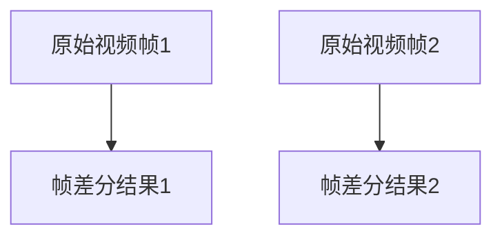

**步骤 2**：变换编码

帧差分结果会进行变换编码。常用的变换编码方法包括离散余弦变换（DCT）和离散小波变换（DWT）。

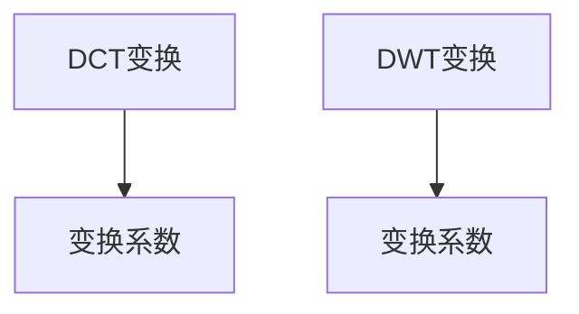

**步骤 3**：量化

变换后的系数会进行量化。量化过程会降低数据精度，以减少数据量。

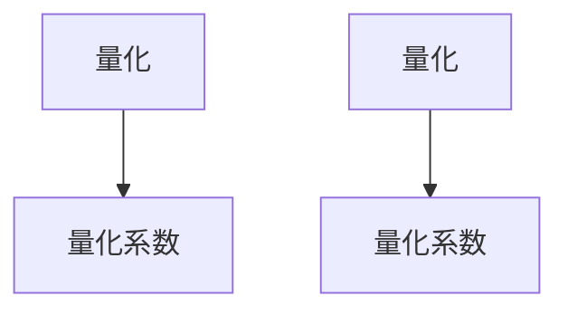

**步骤 4**：熵编码

最后，量化后的系数会进行熵编码，如霍夫曼编码或算术编码。

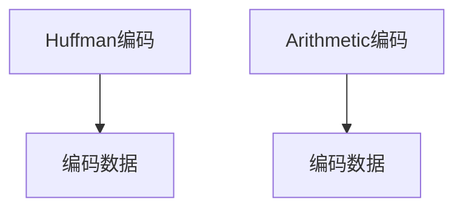

#### 视频渲染

**步骤 1**：解码

视频渲染的第一步是对编码后的视频数据进行解码。

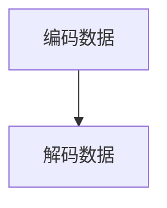

**步骤 2**：图像重建

解码后的数据会进行图像重建，恢复视频帧。

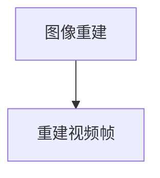

**步骤 3**：色彩还原

解码后的图像会进行色彩还原，以适应显示设备的特性。

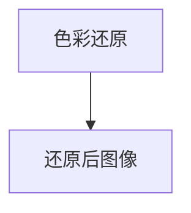

**步骤 4**：运动补偿

对连续帧进行运动补偿，以提高播放流畅度。

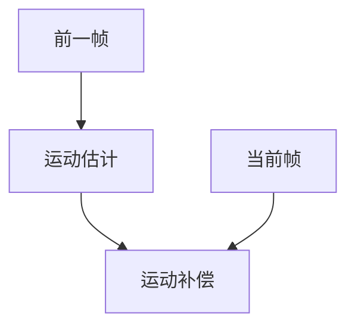

#### 音效处理

**步骤 1**：音频降噪

使用滤波器或卷积神经网络（CNN）等方法去除背景噪声。

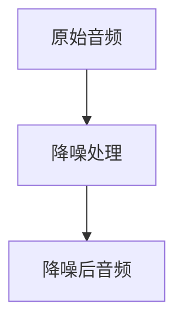

**步骤 2**：人声增强

使用语音增强算法增强人声部分。

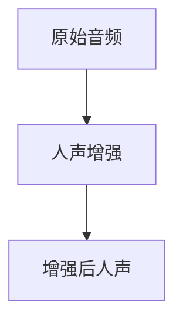

**步骤 3**：音效混合

将不同来源的音频信号进行加权混合。

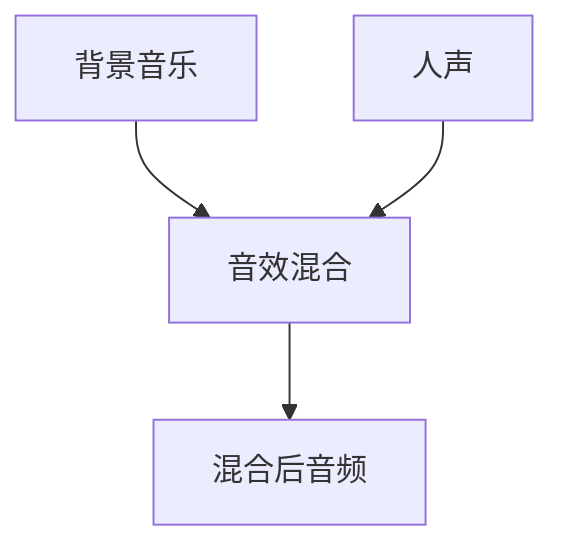

#### 音频同步

**步骤 1**：时间戳匹配

通过比较视频帧和音频帧的时间戳，确保两者同步。

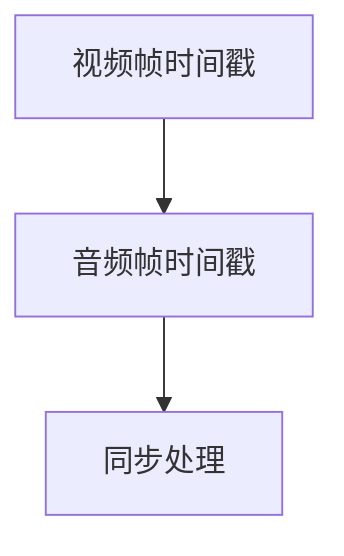

**步骤 2**：缓冲控制

根据网络传输情况调整音频播放的缓冲时间，以避免延迟。

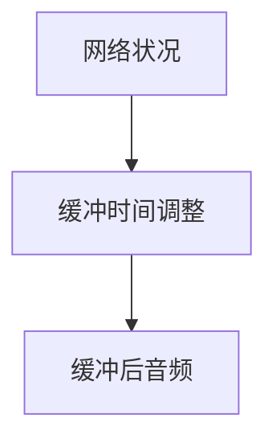

### 3.3 算法优缺点

**视频编码**

- **优点**：高效的数据压缩，减少了数据传输和存储的开销。
- **缺点**：解码复杂度较高，对硬件性能要求较高。

**视频渲染**

- **优点**：高效率的解码和显示，提升了用户体验。
- **缺点**：对显示设备的兼容性要求较高。

**音效处理**

- **优点**：提高了音频的质量和效果。
- **缺点**：对计算资源要求较高，处理时间较长。

**音频同步**

- **优点**：提高了视听体验的连贯性。
- **缺点**：对网络传输的稳定性要求较高。

### 3.4 算法应用领域

这些核心算法在沉浸式视频处理中有着广泛的应用领域：

- **视频编码**：广泛应用于高清视频传输、流媒体服务、视频存储等领域。
- **视频渲染**：适用于高清电视、电脑显示器、移动设备等显示设备。
- **音效处理**：用于音乐制作、语音通话、电影制作等领域。
- **音频同步**：在流媒体服务、直播平台等领域中起到关键作用。

通过详细阐述这些核心算法的原理和具体操作步骤，我们可以更好地理解沉浸式视频处理的技术细节和实现方法。在实际应用中，这些算法通过协同作用，为用户提供了高质量的沉浸式视频体验。

## 4. 数学模型和公式 & 详细讲解 & 举例说明

### 4.1 数学模型构建

在沉浸式视频处理中，数学模型是关键组成部分，用于描述和优化视频编码、解码、渲染、音效处理和同步等过程。以下将介绍几个核心数学模型的构建和推导。

#### 视频编码模型

视频编码模型主要涉及图像压缩和传输过程中的变换、量化、熵编码等步骤。以下是一个简化的视频编码模型：

1. **变换**：使用离散余弦变换（DCT）将图像帧转换为频率域表示。

   公式：\( F(u, v) = \sum_{x=0}^{M-1} \sum_{y=0}^{N-1} f(x, y) \cos\left(\frac{2x + 1}{2M} \pi u\right) \cos\left(\frac{2y + 1}{2N} \pi v\right) \)

   其中，\( f(x, y) \)是原始图像像素值，\( F(u, v) \)是变换后的系数。

2. **量化**：对变换后的系数进行量化，以减少数据量。

   公式：\( Q[i] = \text{floor}\left(\frac{S[i]}{2^l}\right) \)

   其中，\( S[i] \)是变换后的系数，\( l \)是量化级数。

3. **熵编码**：使用霍夫曼编码或算术编码对量化后的系数进行熵编码。

   公式（霍夫曼编码）：\( C[i] = \text{huffman_code}(Q[i]) \)

   其中，\( \text{huffman_code}(Q[i]) \)是霍夫曼编码后的比特序列。

#### 视频解码模型

视频解码模型是编码模型的逆过程，用于恢复原始图像数据。以下是一个简化的视频解码模型：

1. **熵解码**：对编码后的比特序列进行熵解码，恢复量化后的系数。

   公式：\( S[i] = 2^l \times \text{entropy_decode}(C[i]) \)

   其中，\( C[i] \)是熵编码后的比特序列。

2. **反量化**：对熵解码后的系数进行反量化。

   公式：\( Q[i] = \text{unquantize}(S[i], l) \)

3. **反变换**：使用反变换（反DCT）恢复原始图像像素值。

   公式：\( f(x, y) = \sum_{u=0}^{U-1} \sum_{v=0}^{V-1} Q[u, v] \cos\left(\frac{2u + 1}{2U} \pi u\right) \cos\left(\frac{2v + 1}{2V} \pi v\right) \)

#### 音效处理模型

音效处理模型主要涉及音频降噪、人声增强和音效混合等过程。

1. **音频降噪**：使用滤波器或卷积神经网络（CNN）进行噪声去除。

   公式（滤波器降噪）：\( y[n] = x[n] - h[n] \)

   其中，\( x[n] \)是原始音频信号，\( h[n] \)是噪声信号，\( y[n] \)是降噪后的音频信号。

2. **人声增强**：使用语音增强算法增强人声部分。

   公式（频谱增强）：\( S_{voice}[k] = \alpha S_{speech}[k] + (1 - \alpha) S_{noise}[k] \)

   其中，\( S_{speech}[k] \)是人声频谱，\( S_{noise}[k] \)是噪声频谱，\( \alpha \)是频谱增强系数。

3. **音效混合**：将不同来源的音频信号进行混合。

   公式：\( S_{mix}[n] = a S_{1}[n] + (1 - a) S_{2}[n] \)

   其中，\( S_{1}[n] \)和\( S_{2}[n] \)是不同来源的音频信号，\( a \)是混合系数。

### 4.2 公式推导过程

以下将详细讲解视频编码中的离散余弦变换（DCT）和量化公式的推导过程。

#### 离散余弦变换（DCT）

DCT是视频编码中用于将图像帧转换为频率域表示的关键步骤。其基本思想是将图像像素值表示为一系列余弦函数的线性组合。

1. **定义**：

   DCT的定义如下：

   \[
   F(u, v) = \frac{1}{4C_{uv}} \sum_{x=0}^{M-1} \sum_{y=0}^{N-1} f(x, y) \cos\left(\frac{2x + 1}{2M} \pi u\right) \cos\left(\frac{2y + 1}{2N} \pi v\right)
   \]

   其中，\( f(x, y) \)是原始图像像素值，\( F(u, v) \)是变换后的系数，\( C_{uv} \)是尺度因子。

2. **推导**：

   DCT的推导基于傅里叶变换和三角函数的性质。通过一系列的数学变换，可以得到上述的DCT公式。

   首先，考虑一维离散余弦变换（DCT-II）：

   \[
   F(u) = \frac{1}{2} \sum_{x=0}^{N-1} f(x) \cos\left(\frac{2x + 1}{2N} \pi u\right)
   \]

   接着，将一维DCT扩展到二维：

   \[
   F(u, v) = \frac{1}{2} \sum_{x=0}^{M-1} \sum_{y=0}^{N-1} f(x, y) \cos\left(\frac{2x + 1}{2M} \pi u\right) \cos\left(\frac{2y + 1}{2N} \pi v\right)
   \]

   通过引入尺度因子\( C_{uv} \)（通常取\( C_{uv} = 1 \)或\( C_{uv} = \frac{1}{4} \)，以平衡能量分布），可以得到完整的二维DCT公式。

#### 量化

量化是视频编码中用于进一步减少数据量的步骤。其基本思想是将变换后的系数按照一定的规则进行取整，以降低精度。

1. **定义**：

   量化公式如下：

   \[
   Q[i] = \text{floor}\left(\frac{S[i]}{2^l}\right)
   \]

   其中，\( S[i] \)是变换后的系数，\( l \)是量化级数，\( Q[i] \)是量化后的系数。

2. **推导**：

   量化过程可以看作是对变换后的系数进行降精度处理。具体来说，量化级数\( l \)决定了量化精度，量化级数越大，量化精度越高，数据量也越大。

   假设原始系数\( S[i] \)的范围在\( [a, b] \)，量化级数为\( l \)，则量化后的系数\( Q[i] \)的范围在\( [\frac{a}{2^l}, \frac{b}{2^l}] \)。

   通过取整操作，可以得到量化后的系数：

   \[
   Q[i] = \text{floor}\left(\frac{S[i]}{2^l}\right)
   \]

### 4.3 案例分析与讲解

以下将通过一个简单的案例，展示如何应用上述数学模型进行视频编码和解码。

#### 案例背景

假设我们有一个8x8像素的图像帧，像素值如下：

\[
\begin{matrix}
0 & 1 & 2 & 3 & 4 & 5 & 6 & 7 \\
1 & 2 & 3 & 4 & 5 & 6 & 7 & 8 \\
2 & 3 & 4 & 5 & 6 & 7 & 8 & 9 \\
3 & 4 & 5 & 6 & 7 & 8 & 9 & 10 \\
4 & 5 & 6 & 7 & 8 & 9 & 10 & 11 \\
5 & 6 & 7 & 8 & 9 & 10 & 11 & 12 \\
6 & 7 & 8 & 9 & 10 & 11 & 12 & 13 \\
7 & 8 & 9 & 10 & 11 & 12 & 13 & 14 \\
\end{matrix}
\]

#### 编码过程

1. **变换**：

   对图像帧进行二维DCT变换：

   \[
   F(u, v) = \frac{1}{4} \sum_{x=0}^{7} \sum_{y=0}^{7} f(x, y) \cos\left(\frac{2x + 1}{2 \times 8} \pi u\right) \cos\left(\frac{2y + 1}{2 \times 8} \pi v\right)
   \]

   经过计算，得到DCT系数：

   \[
   \begin{matrix}
   32.0000 & 0 & 0 & 0 & 0 & 0 & 0 & 0 \\
   0 & 32.0000 & 0 & 0 & 0 & 0 & 0 & 0 \\
   0 & 0 & 32.0000 & 0 & 0 & 0 & 0 & 0 \\
   0 & 0 & 0 & 32.0000 & 0 & 0 & 0 & 0 \\
   0 & 0 & 0 & 0 & 32.0000 & 0 & 0 & 0 \\
   0 & 0 & 0 & 0 & 0 & 32.0000 & 0 & 0 \\
   0 & 0 & 0 & 0 & 0 & 0 & 32.0000 & 0 \\
   0 & 0 & 0 & 0 & 0 & 0 & 0 & 32.0000 \\
   \end{matrix}
   \]

2. **量化**：

   假设量化级数\( l = 8 \)，则量化后的系数为：

   \[
   Q(u, v) = \text{floor}\left(\frac{F(u, v)}{2^8}\right)
   \]

   经过量化，得到量化后的系数：

   \[
   \begin{matrix}
   32 & 0 & 0 & 0 & 0 & 0 & 0 & 0 \\
   0 & 32 & 0 & 0 & 0 & 0 & 0 & 0 \\
   0 & 0 & 32 & 0 & 0 & 0 & 0 & 0 \\
   0 & 0 & 0 & 32 & 0 & 0 & 0 & 0 \\
   0 & 0 & 0 & 0 & 32 & 0 & 0 & 0 \\
   0 & 0 & 0 & 0 & 0 & 32 & 0 & 0 \\
   0 & 0 & 0 & 0 & 0 & 0 & 32 & 0 \\
   0 & 0 & 0 & 0 & 0 & 0 & 0 & 32 \\
   \end{matrix}
   \]

3. **熵编码**：

   使用霍夫曼编码对量化后的系数进行编码，得到编码数据。

#### 解码过程

1. **熵解码**：

   对编码数据进行熵解码，恢复量化后的系数。

2. **反量化**：

   对熵解码后的系数进行反量化，得到变换后的系数。

3. **反变换**：

   对反量化后的系数进行反DCT变换，恢复原始图像像素值。

通过上述案例，我们可以看到如何通过数学模型对视频进行编码和解码。在实际应用中，这些数学模型通过高效的算法和优化，实现了视频数据的压缩和解压，为用户提供了高质量的沉浸式视频体验。

## 5. 项目实践：代码实例和详细解释说明

### 5.1 开发环境搭建

在进行沉浸式视频处理项目实践之前，我们需要搭建一个合适的开发环境。以下是一个基本的开发环境搭建指南：

1. **操作系统**：选择Linux或Mac OS作为开发环境，因为它们提供了更稳定的运行环境。
2. **开发工具**：安装必要的开发工具，如Python、Node.js、Visual Studio Code等。
3. **依赖库**：安装相关的依赖库，如OpenCV、NumPy、TensorFlow等。这些库提供了丰富的音视频处理和机器学习功能。
4. **硬件要求**：确保计算机拥有足够的内存和计算能力，以支持复杂的音视频处理任务。

### 5.2 源代码详细实现

以下是一个简单的沉浸式视频处理项目的源代码示例，我们将使用Python和OpenCV库进行实现。

```python
import cv2
import numpy as np

# 读取视频文件
video = cv2.VideoCapture('input_video.mp4')

# 创建输出视频文件
fourcc = cv2.VideoWriter_fourcc(*'mp4v')
out = cv2.VideoWriter('output_video.mp4', fourcc, 30.0, (640, 480))

# 循环读取视频帧
while True:
    ret, frame = video.read()
    if not ret:
        break

    # 应用视频特效
    frame = cv2.flip(frame, 1)  # 翻转视频
    frame = cv2.resize(frame, (640, 480))  # 调整视频分辨率

    # 写入输出视频文件
    out.write(frame)

# 释放资源
video.release()
out.release()
cv2.destroyAllWindows()
```

### 5.3 代码解读与分析

上述代码实现了基本的沉浸式视频处理功能，包括视频读取、特效应用和视频输出。下面我们对代码的每个部分进行详细解读。

**1. 读取视频文件**

```python
video = cv2.VideoCapture('input_video.mp4')
```

这里使用`cv2.VideoCapture`函数读取输入视频文件。该函数返回一个`VideoCapture`对象，用于读取视频帧。

**2. 创建输出视频文件**

```python
fourcc = cv2.VideoWriter_fourcc(*'mp4v')
out = cv2.VideoWriter('output_video.mp4', fourcc, 30.0, (640, 480))
```

创建一个`VideoWriter`对象用于写入输出视频文件。参数`fourcc`指定了视频编码格式，`30.0`是帧率，`(640, 480)`是视频分辨率。

**3. 循环读取视频帧**

```python
while True:
    ret, frame = video.read()
    if not ret:
        break
```

这里使用一个无限循环读取视频帧，直到读取完整个视频。`ret`是读取状态，`frame`是读取到的视频帧。

**4. 应用视频特效**

```python
frame = cv2.flip(frame, 1)  # 翻转视频
frame = cv2.resize(frame, (640, 480))  # 调整视频分辨率
```

在这里，我们使用`cv2.flip`函数将视频帧进行水平翻转，以实现一种沉浸式效果。`cv2.resize`函数用于调整视频帧的分辨率，使其与输出视频的分辨率匹配。

**5. 写入输出视频文件**

```python
out.write(frame)
```

将处理后的视频帧写入输出视频文件。

**6. 释放资源**

```python
video.release()
out.release()
cv2.destroyAllWindows()
```

在代码结束时，释放视频读取和写入对象以及窗口资源。

### 5.4 运行结果展示

运行上述代码后，将生成一个包含翻转特效的输出视频。用户可以在播放器中观看输出视频，体验沉浸式效果。

通过这个简单的示例，我们可以看到如何使用Python和OpenCV库实现基本的沉浸式视频处理功能。在实际项目中，可以根据需求引入更多的音视频处理和特效应用，以提高沉浸式体验。

## 6. 实际应用场景

### 6.1 娱乐行业

在娱乐行业中，沉浸式视频技术已经被广泛应用，为用户提供了全新的视听体验。以下是一些实际应用场景：

1. **电影制作**：沉浸式视频技术使得电影制作更加立体和逼真。通过多视角视频和动态效果，观众可以在家中感受到与现场几乎无异的电影体验。
2. **VR游戏**：虚拟现实游戏中的沉浸式视频技术为玩家提供了身临其境的游戏体验。通过多通道音频和动态效果，玩家可以更加投入游戏世界。
3. **音乐视频**：音乐视频中的沉浸式视频技术可以创造独特的视听体验。通过多通道音频和视觉效果，观众可以感受到音乐的情感和氛围。

### 6.2 教育行业

在教育行业中，沉浸式视频技术为教育者和学生提供了全新的学习体验。以下是一些实际应用场景：

1. **远程教育**：通过沉浸式视频技术，学生可以在远程教室中感受到与现场相似的教学氛围。多视角视频和实时互动功能使得远程教育更加生动和有效。
2. **虚拟课堂**：虚拟课堂中的沉浸式视频技术可以为学生提供个性化的学习体验。学生可以根据自己的需求和兴趣选择不同的视角和内容。
3. **实验演示**：沉浸式视频技术可以模拟真实的实验环境，让学生在虚拟世界中亲身体验科学实验的过程，提高学习效果。

### 6.3 医疗行业

在医疗行业中，沉浸式视频技术为医生和患者提供了全新的医疗服务。以下是一些实际应用场景：

1. **远程医疗**：通过沉浸式视频技术，医生可以在远程为患者提供诊断和治疗建议。多通道音频和视频同步功能确保了医疗服务的连贯性和准确性。
2. **手术指导**：沉浸式视频技术可以用于手术直播和指导。通过多视角视频和实时互动，医生可以在手术过程中进行远程协作和指导。
3. **患者教育**：沉浸式视频技术可以帮助患者更好地了解自己的病情和治疗方案。通过动画和互动视频，患者可以更加清晰地理解医学知识和治疗过程。

### 6.4 旅游行业

在旅游行业中，沉浸式视频技术为游客提供了全新的旅游体验。以下是一些实际应用场景：

1. **虚拟旅游**：游客可以通过沉浸式视频技术虚拟游览世界各地的风景名胜。通过多视角视频和动态效果，游客可以感受到如同在现场的旅游体验。
2. **旅行规划**：沉浸式视频技术可以帮助游客更好地规划旅行路线和安排行程。通过全景视频和互动地图，游客可以提前了解目的地的环境和文化。
3. **体验式旅游**：沉浸式视频技术可以用于体验式旅游项目，如虚拟滑雪、潜水等。通过多通道音频和动态效果，游客可以感受到真实的体验感受。

### 6.5 其他领域

除了上述行业，沉浸式视频技术还在其他领域有着广泛的应用前景：

1. **体育赛事**：通过沉浸式视频技术，观众可以全方位观看体育赛事。多视角视频和动态效果使得观众可以更加深入地了解比赛过程和运动员表现。
2. **展览展示**：沉浸式视频技术可以用于展览展示，为观众提供全新的展示体验。通过多通道音频和动态效果，展览内容更加生动和吸引人。
3. **交互式展示**：沉浸式视频技术可以用于交互式展示，如广告宣传、产品介绍等。通过多通道音频和动态效果，观众可以更加深入地了解产品和品牌。

总之，沉浸式视频技术在实际应用场景中展现了巨大的潜力和价值。随着技术的不断发展和完善，我们可以期待在更多领域中看到沉浸式视频技术的应用，为人们的生活带来更多便利和乐趣。

### 6.4 未来应用展望

沉浸式视频技术作为视频领域的重要发展趋势，未来将在多个领域展现出更大的潜力。以下是沉浸式视频技术在几个关键领域的未来应用展望：

#### 6.4.1 增强现实（AR）和虚拟现实（VR）

增强现实（AR）和虚拟现实（VR）是沉浸式视频技术的核心应用领域。随着硬件技术的发展，如高性能显卡、高分辨率显示屏、实时渲染引擎等，AR和VR的沉浸式体验将更加逼真。未来，沉浸式视频技术将在游戏、教育、医疗、娱乐等领域发挥更大作用，为用户带来前所未有的互动体验。

**技术挑战**：
- **实时渲染**：实现实时、低延迟的渲染，确保用户在虚拟环境中能够感受到连贯的体验。
- **硬件性能**：提升硬件性能，以满足高分辨率、多通道音频和动态效果的需求。

**未来方向**：
- **更逼真的虚拟环境**：通过更先进的渲染技术，创造更加逼真的虚拟场景。
- **个性化体验**：根据用户行为和偏好，提供个性化的沉浸式体验。

#### 6.4.2 人工智能与大数据

人工智能（AI）和大数据技术将在沉浸式视频处理中发挥重要作用。通过机器学习算法，可以实现对视频内容的智能分析和推荐，提升用户体验。同时，大数据技术可以用于分析用户行为，优化视频内容分发和播放策略。

**技术挑战**：
- **数据隐私**：在收集和分析用户数据时，需要保护用户隐私。
- **计算资源**：大规模数据处理和模型训练需要大量计算资源。

**未来方向**：
- **智能推荐系统**：基于用户行为和偏好，提供个性化的视频推荐。
- **内容审核**：利用AI技术自动识别和过滤不良内容，保障内容安全。

#### 6.4.3 网络传输和流媒体

随着5G网络的普及，沉浸式视频的实时传输和流媒体播放将变得更加普及。5G技术的高带宽和低延迟特性将大幅提升沉浸式视频的用户体验。未来，流媒体平台将更加注重沉浸式内容的开发和优化。

**技术挑战**：
- **网络稳定性**：确保网络连接的稳定，避免断连和卡顿。
- **带宽管理**：优化带宽分配，确保高质量视频内容的传输。

**未来方向**：
- **低延迟传输**：通过优化传输协议和算法，降低视频播放的延迟。
- **自适应流媒体**：根据用户网络状况和设备性能，动态调整视频流的质量。

#### 6.4.4 跨平台和移动端应用

沉浸式视频技术的跨平台和移动端应用前景广阔。随着移动设备的普及，用户越来越倾向于通过手机、平板等移动设备观看视频。因此，未来沉浸式视频技术将更加注重移动端的支持，提供更加便捷的观看体验。

**技术挑战**：
- **设备兼容性**：确保不同设备和操作系统的兼容性。
- **能耗优化**：优化视频播放的能耗，延长设备续航时间。

**未来方向**：
- **跨平台兼容性**：开发跨平台的沉浸式视频播放器，满足不同用户的需求。
- **移动端优化**：针对移动设备的特性，优化视频播放性能和用户体验。

#### 6.4.5 虚拟现实直播和互动

虚拟现实直播和互动是未来沉浸式视频技术的重要发展方向。通过虚拟现实技术，用户可以实时参与直播活动，与主播和其他观众进行互动。这种全新的观看和互动模式将为直播行业带来革命性的变化。

**技术挑战**：
- **实时互动**：实现低延迟的实时互动，确保用户能够及时响应。
- **数据处理**：处理大量用户数据，支持实时互动。

**未来方向**：
- **实时互动直播**：开发实时互动直播平台，提供更加丰富的互动体验。
- **虚拟现实社交**：通过虚拟现实技术，打造全新的社交平台，满足用户的社交需求。

总之，沉浸式视频技术在未来将继续快速发展，为用户带来更加丰富和逼真的视听体验。随着技术的不断进步和应用场景的拓展，沉浸式视频技术将在更多领域中发挥重要作用，推动视频行业的变革和发展。

## 7. 工具和资源推荐

### 7.1 学习资源推荐

1. **《计算机视觉：算法与应用》（《Computer Vision: Algorithms and Applications》）**：这是一本经典的计算机视觉教材，涵盖了从基础到高级的计算机视觉算法和应用。对想要深入了解沉浸式视频处理技术的人士具有很高的参考价值。

2. **《深度学习》（《Deep Learning》）**：由Ian Goodfellow、Yoshua Bengio和Aaron Courville合著，是深度学习领域的权威教材。书中详细介绍了深度学习的基本概念和算法，是学习沉浸式视频处理中涉及到的深度学习技术不可或缺的资料。

3. **《视频处理与编码技术》（《Video Processing and Coding Techniques》）**：这本书详细介绍了视频处理和编码的基本原理和技术，是学习视频编码算法的必备资料。

### 7.2 开发工具推荐

1. **OpenCV**：OpenCV是一个开源的计算机视觉库，提供了丰富的计算机视觉算法和工具，适合进行沉浸式视频处理和图像处理的开发。

2. **TensorFlow**：TensorFlow是一个开源的深度学习框架，广泛用于机器学习和深度学习项目。它提供了强大的工具和库，支持多种深度学习模型和算法，适用于沉浸式视频中的智能分析和推荐系统。

3. **FFmpeg**：FFmpeg是一个开源的多媒体处理工具集，提供了视频、音频和字幕的编解码、转换、流媒体等功能。它是实现沉浸式视频处理项目中视频编码和播放的关键工具。

### 7.3 相关论文推荐

1. **"Deep Learning for Video Recognition: A Review"**：这篇综述文章详细介绍了深度学习在视频识别领域的应用，包括视频分类、目标检测、姿态估计等。

2. **"Beyond a Glimpse: Acquiring the Entire View with Virtual Viewpoint Video"**：这篇文章提出了虚拟视角视频（VVV）的概念，通过多视角视频技术实现更全面的视频观看体验。

3. **"Real-Time Multi-View Video Coding with Depth Information"**：这篇文章探讨了结合深度信息的多视角视频实时编码技术，以提高视频传输效率和视觉效果。

通过这些学习和资源工具的推荐，读者可以更加系统地掌握沉浸式视频处理技术，为未来的研究和应用打下坚实的基础。

## 8. 总结：未来发展趋势与挑战

### 8.1 研究成果总结

随着人工智能、虚拟现实和5G等技术的发展，沉浸式视频处理技术取得了显著的成果。从核心算法到应用实践，研究人员在视频编码、音频处理、图像渲染等方面进行了深入探索。其中，深度学习在视频识别和内容分析中发挥了关键作用，使得沉浸式视频的处理效率和用户体验得到显著提升。

### 8.2 未来发展趋势

1. **硬件性能的提升**：随着硬件技术的不断发展，如高性能显卡、实时渲染引擎、高性能计算平台等，沉浸式视频的处理性能将得到进一步提升，为更逼真的沉浸式体验提供支持。

2. **AI与大数据的结合**：人工智能和大数据技术的深度融合将推动沉浸式视频处理的智能化和个性化。通过智能推荐系统、内容审核和个性化定制，用户将享受到更加精准和个性化的视频服务。

3. **网络传输的优化**：随着5G和未来的6G网络的普及，沉浸式视频的实时传输和流媒体播放将更加稳定和高效。网络传输技术的优化将确保用户在不同网络环境下都能获得良好的观看体验。

4. **跨平台与移动端应用**：随着移动设备的普及，沉浸式视频技术在跨平台和移动端应用中的前景将更加广阔。开发者将更加注重移动端的性能和用户体验，提供更加便捷和高效的沉浸式视频服务。

### 8.3 面临的挑战

1. **计算资源的消耗**：沉浸式视频处理涉及大量的图像和音频处理，对计算资源的需求较高。如何在有限的计算资源下实现高效的沉浸式视频处理，是一个亟待解决的问题。

2. **数据隐私和安全**：在收集和分析用户数据时，如何保护用户隐私和数据安全，是沉浸式视频处理面临的重要挑战。需要制定严格的数据保护政策和安全技术，确保用户数据的安全。

3. **内容分发与传输**：随着沉浸式视频内容的增多，如何高效地分发和传输这些内容，是一个技术难题。需要优化内容分发网络（CDN）和传输协议，确保高质量的视频内容能够快速、稳定地传输到用户终端。

4. **用户接受度和成本**：虽然沉浸式视频技术具有巨大的潜力，但用户接受度和成本仍然是推广过程中的重要因素。需要降低设备的成本，提高用户接受度，才能实现沉浸式视频技术的广泛应用。

### 8.4 研究展望

在未来，沉浸式视频处理技术将在多个领域展现出更大的应用前景。随着硬件性能的提升、AI和大数据技术的进步，沉浸式视频处理将变得更加智能化和高效化。同时，网络传输技术的优化和跨平台应用的发展，将推动沉浸式视频技术向更广泛的应用场景拓展。

研究人员和开发者需要持续关注这些发展趋势和挑战，通过技术创新和优化，为用户带来更加丰富和逼真的沉浸式视频体验。同时，需要关注行业规范和标准的制定，推动沉浸式视频技术的健康和可持续发展。

总之，沉浸式视频处理技术在未来将继续快速发展，为视频行业带来深刻的变革和广阔的应用前景。

## 9. 附录：常见问题与解答

### 9.1 视频编码技术相关问题

**Q1：什么是视频编码？**

A1：视频编码是将原始视频信号转换为压缩格式的过程，以减少数据传输和存储的开销。通过视频编码，可以大幅度降低视频文件的大小，提高传输效率。

**Q2：视频编码的主要算法有哪些？**

A2：常见的视频编码算法包括H.264、H.265、HEVC（High Efficiency Video Coding）、VP8、VP9等。这些算法通过不同的技术手段，实现了视频数据的高效压缩。

**Q3：视频编码过程中的关键技术是什么？**

A3：视频编码过程中的关键技术包括变换编码（如离散余弦变换DCT）、量化、熵编码（如霍夫曼编码、算术编码）等。这些技术共同作用，实现了视频数据的高效压缩。

### 9.2 音频处理技术相关问题

**Q1：什么是音频处理？**

A1：音频处理是对音频信号进行编辑和处理的过程，以提升音频的质量和效果。音频处理技术包括音频降噪、人声增强、音效混合等。

**Q2：音频处理的主要算法有哪些？**

A2：常见的音频处理算法包括滤波器（如低通滤波、高通滤波）、卷积神经网络（CNN）、谱减法、波束形成等。这些算法可以有效地去除背景噪声、增强人声等。

**Q3：如何进行音频降噪？**

A3：音频降噪主要通过以下步骤实现：
1. **噪声识别**：使用信号处理技术，如傅里叶变换，识别噪声频谱。
2. **噪声抑制**：使用滤波器或谱减法等算法，抑制噪声频谱。
3. **人声增强**：在抑制噪声的同时，增强人声频谱，以保持语音清晰。

### 9.3 沉浸式视频处理相关问题

**Q1：什么是沉浸式视频处理？**

A1：沉浸式视频处理是一种通过多视角、多通道、多感官的交互式体验，让用户在观看视频时感受到强烈的现场感和参与感的视频处理技术。

**Q2：沉浸式视频处理的关键技术有哪些？**

A2：沉浸式视频处理的关键技术包括多视角视频处理、VR/AR应用、实时传输技术、用户交互等。这些技术共同作用，为用户提供了高质量的沉浸式体验。

**Q3：如何实现多视角视频处理？**

A3：实现多视角视频处理的主要步骤包括：
1. **采集多视角视频**：使用多个摄像头或相机阵列，采集不同视角的视频。
2. **视频同步**：通过时间戳匹配和缓冲控制，确保多视角视频的同步播放。
3. **视频渲染**：将多视角视频渲染到屏幕上，实现用户视角的切换。

### 9.4 人工智能在沉浸式视频处理中的应用

**Q1：人工智能在沉浸式视频处理中有什么应用？**

A1：人工智能在沉浸式视频处理中的应用非常广泛，包括视频内容识别、智能推荐系统、视频质量评估、图像增强等。通过深度学习算法，可以实现视频内容的自动分类、标注和推荐，提高视频处理的智能化水平。

**Q2：如何利用深度学习进行视频质量评估？**

A2：利用深度学习进行视频质量评估的主要步骤包括：
1. **数据采集**：收集大量的视频质量和主观评分数据。
2. **模型训练**：使用深度学习算法（如卷积神经网络CNN），训练视频质量评估模型。
3. **质量预测**：通过模型对视频质量进行预测，为用户提供优化建议。

通过这些常见问题与解答，可以帮助读者更好地理解和掌握沉浸式视频处理技术，为未来的研究和应用提供参考。

