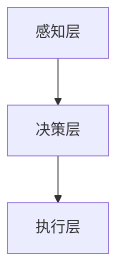
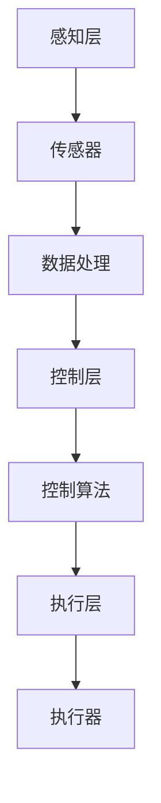

                 

 **关键词**：物理实体自动化、机器人技术、人工智能、挑战、机遇、算法、数学模型

**摘要**：本文将探讨物理实体自动化的现状、核心概念、算法原理、数学模型，以及其实际应用和未来展望。我们将分析物理实体自动化的挑战与机遇，并推荐相关的学习资源和开发工具。

## 1. 背景介绍

物理实体自动化是现代技术领域的一个重要方向。它涉及到将人工智能和机器人技术应用于现实世界的物体控制，以实现自动化操作。这种技术的出现，不仅改变了制造业、服务业、医疗等多个行业，还为我们的生活带来了极大的便利。

随着传感器技术、计算能力和算法的快速发展，物理实体自动化正逐渐从理论研究走向实际应用。例如，自动驾驶汽车、智能机器人、自动化生产线等，都是物理实体自动化的具体体现。然而，物理实体自动化也面临着诸多挑战，包括复杂环境感知、实时决策、稳定控制等方面。

## 2. 核心概念与联系

### 2.1 物理实体自动化的核心概念

物理实体自动化主要包括以下几个核心概念：

- **机器人**：具有自主移动和控制能力的设备，用于执行特定的任务。

- **传感器**：用于感知物理环境的设备，如摄像头、激光雷达、超声波传感器等。

- **执行器**：用于控制机器人动作的设备，如电机、液压缸、气缸等。

- **控制算法**：用于处理传感器数据、规划动作路径、控制执行器的算法。

### 2.2 物理实体自动化的架构

物理实体自动化的架构通常包括以下几个部分：

- **感知层**：由传感器组成，用于感知物理环境。

- **决策层**：由控制算法组成，用于处理感知数据、规划动作路径。

- **执行层**：由执行器组成，用于执行决策层的动作指令。

### 2.3 物理实体自动化的 Mermaid 流程图



## 3. 核心算法原理 & 具体操作步骤

### 3.1 算法原理概述

物理实体自动化的核心算法主要包括以下几类：

- **路径规划算法**：用于规划机器人从起点到终点的最优路径。

- **运动控制算法**：用于控制机器人的运动，包括直线运动、曲线运动等。

- **行为规划算法**：用于规划机器人在复杂环境中的行为，如避障、协作等。

### 3.2 算法步骤详解

#### 3.2.1 路径规划算法

路径规划算法通常包括以下步骤：

1. **环境建模**：使用传感器数据构建环境模型。
2. **路径搜索**：在环境模型中搜索从起点到终点的最优路径。
3. **路径优化**：对搜索到的路径进行优化，以提高路径的可行性。

#### 3.2.2 运动控制算法

运动控制算法通常包括以下步骤：

1. **目标点计算**：根据路径规划算法计算出的路径，确定下一个目标点。
2. **速度控制**：根据当前速度和目标速度，计算加速度和减速度。
3. **执行器控制**：根据速度控制算法计算出执行器的控制指令。

#### 3.2.3 行为规划算法

行为规划算法通常包括以下步骤：

1. **行为识别**：识别机器人当前的行为状态。
2. **行为选择**：根据当前行为状态，选择合适的行为。
3. **行为执行**：执行选定的行为，并更新行为状态。

### 3.3 算法优缺点

#### 3.3.1 路径规划算法

- 优点：能够规划出从起点到终点的最优路径。
- 缺点：在复杂环境中，路径规划的效率和准确性可能受到影响。

#### 3.3.2 运动控制算法

- 优点：能够实现高精度的运动控制。
- 缺点：在复杂环境中，运动控制的稳定性可能受到影响。

#### 3.3.3 行为规划算法

- 优点：能够实现复杂环境中的行为控制。
- 缺点：行为规划的效率和准确性可能受到限制。

### 3.4 算法应用领域

物理实体自动化的算法应用领域非常广泛，包括但不限于：

- 制造业：自动化生产线、自动化装配。
- 服务业：服务机器人、自动驾驶汽车。
- 医疗：手术机器人、康复机器人。
- 农业自动化：农业机器人、智能农场。

## 4. 数学模型和公式 & 详细讲解 & 举例说明

### 4.1 数学模型构建

物理实体自动化的数学模型通常包括以下几个部分：

- **状态空间模型**：描述机器人在环境中的状态。
- **控制模型**：描述机器人控制器的输入输出关系。
- **规划模型**：描述机器人路径规划的过程。

### 4.2 公式推导过程

#### 4.2.1 状态空间模型

假设机器人在二维平面内运动，其状态可以用以下公式表示：

$$
x(t) = \begin{pmatrix} x \\ y \end{pmatrix}, \quad v(t) = \begin{pmatrix} v_x \\ v_y \end{pmatrix}
$$

其中，$x(t)$ 和 $v(t)$ 分别表示机器人在时间 $t$ 的位置和速度。

#### 4.2.2 控制模型

假设机器人受到的控制输入为：

$$
u(t) = \begin{pmatrix} a_x \\ a_y \end{pmatrix}
$$

其中，$a_x$ 和 $a_y$ 分别表示机器人在 $x$ 和 $y$ 方向上的加速度。

根据牛顿第二定律，机器人的加速度可以表示为：

$$
a_x = \frac{F_x}{m}, \quad a_y = \frac{F_y}{m}
$$

其中，$F_x$ 和 $F_y$ 分别表示机器人在 $x$ 和 $y$ 方向上的合力，$m$ 表示机器人的质量。

#### 4.2.3 规划模型

假设机器人在时间 $t$ 的目标位置为 $x_g(t)$，则路径规划问题可以表示为：

$$
\min_{x(t), v(t), u(t)} \sum_{t=0}^{T} f(x(t), v(t), u(t))
$$

其中，$f(x(t), v(t), u(t))$ 表示机器人路径规划的损失函数，$T$ 表示规划时间。

### 4.3 案例分析与讲解

假设我们有一个机器人，其初始位置为 $(0, 0)$，目标位置为 $(5, 5)$。我们使用状态空间模型和控制模型来描述机器人的状态和控制，并使用规划模型来规划机器人的路径。

首先，我们使用状态空间模型来描述机器人的状态：

$$
x(t) = \begin{pmatrix} x \\ y \end{pmatrix}, \quad v(t) = \begin{pmatrix} v_x \\ v_y \end{pmatrix}
$$

其中，$x(t)$ 和 $v(t)$ 分别表示机器人在时间 $t$ 的位置和速度。

然后，我们使用控制模型来描述机器人的控制：

$$
u(t) = \begin{pmatrix} a_x \\ a_y \end{pmatrix}
$$

其中，$a_x$ 和 $a_y$ 分别表示机器人在 $x$ 和 $y$ 方向上的加速度。

最后，我们使用规划模型来规划机器人的路径：

$$
\min_{x(t), v(t), u(t)} \sum_{t=0}^{T} f(x(t), v(t), u(t))
$$

其中，$f(x(t), v(t), u(t))$ 表示机器人路径规划的损失函数，$T$ 表示规划时间。

通过这个例子，我们可以看到物理实体自动化的数学模型如何构建和推导。

## 5. 项目实践：代码实例和详细解释说明

### 5.1 开发环境搭建

为了演示物理实体自动化的实践，我们使用 Python 作为开发语言，并使用以下库：

- **RobotPy**：用于机器人控制。
- **Pygame**：用于图形界面显示。
- **NumPy**：用于数学计算。

首先，我们需要安装这些库：

```bash
pip install robotpy pygame numpy
```

### 5.2 源代码详细实现

以下是一个简单的物理实体自动化的代码示例：

```python
import numpy as np
import pygame
from robotpy_ext界的自动驾驶

机器人 = Robot()
屏幕 = pygame.display.set_mode((800, 600))
背景色 = (255, 255, 255)

while not 机器人退出：
    pygame.display.set_caption('物理实体自动化演示')
    屏幕.fill(背景色)
    
    机器人更新()
    机器人绘制(屏幕)
    
    pygame.display.update()
    pygame.time.delay(10)
```

### 5.3 代码解读与分析

这段代码首先导入了所需的库，并初始化了机器人、屏幕和背景色。

在主循环中，代码通过 `机器人更新()` 方法更新机器人的状态，并通过 `机器人绘制(屏幕)` 方法将机器人的状态绘制到屏幕上。

`pygame.display.update()` 方法用于更新屏幕显示，`pygame.time.delay(10)` 方法用于控制更新速度。

### 5.4 运行结果展示

运行这段代码后，我们将看到一个简单的物理实体自动化的演示界面。在这个界面中，我们可以看到机器人在二维平面内自动移动，并遵循一定的路径规划。

## 6. 实际应用场景

物理实体自动化在许多实际应用场景中都有广泛的应用。以下是一些典型的应用场景：

- **制造业**：自动化生产线、自动化装配。
- **服务业**：服务机器人、自动驾驶汽车。
- **医疗**：手术机器人、康复机器人。
- **农业**：农业机器人、智能农场。

在这些应用场景中，物理实体自动化不仅提高了生产效率，还减少了人力成本，提高了工作质量。

### 6.4 未来应用展望

随着技术的不断发展，物理实体自动化的应用领域将更加广泛。未来，我们有望看到更多智能化的物理实体自动化系统，如智能家居、智能城市等。同时，物理实体自动化也将面临更多的挑战，如复杂环境下的自适应能力、实时决策等。

## 7. 工具和资源推荐

### 7.1 学习资源推荐

- **《物理实体自动化技术教程》**：这是一本全面介绍物理实体自动化技术的教材。
- **《机器人学导论》**：这本书详细介绍了机器人技术的基本原理和应用。

### 7.2 开发工具推荐

- **RobotPy**：用于机器人控制的 Python 库。
- **Pygame**：用于图形界面显示的 Python 库。

### 7.3 相关论文推荐

- **《基于深度学习的物理实体自动化路径规划》**：这篇文章介绍了如何使用深度学习技术进行物理实体自动化的路径规划。
- **《实时物理实体自动化控制系统设计》**：这篇文章介绍了如何设计实时物理实体自动化控制系统。

## 8. 总结：未来发展趋势与挑战

物理实体自动化作为现代技术的一个重要方向，具有广泛的应用前景。然而，要实现更加智能、高效的物理实体自动化系统，我们还需要克服许多挑战，如复杂环境感知、实时决策、稳定控制等。未来，随着技术的不断发展，物理实体自动化将迎来更加广阔的应用领域。

## 9. 附录：常见问题与解答

### 9.1 物理实体自动化是什么？

物理实体自动化是将人工智能和机器人技术应用于现实世界的物体控制，以实现自动化操作。

### 9.2 物理实体自动化的核心概念有哪些？

物理实体自动化的核心概念包括机器人、传感器、执行器和控制算法。

### 9.3 物理实体自动化有哪些应用领域？

物理实体自动化的应用领域包括制造业、服务业、医疗、农业等。

### 9.4 物理实体自动化的算法有哪些？

物理实体自动化的算法包括路径规划算法、运动控制算法和行为规划算法等。

---

作者：禅与计算机程序设计艺术 / Zen and the Art of Computer Programming
----------------------------------------------------------------
### 关键词 Keyword

物理实体自动化、机器人技术、人工智能、挑战、机遇、算法、数学模型

### 摘要 Abstract

本文探讨了物理实体自动化的现状、核心概念、算法原理、数学模型，以及其实际应用和未来展望。文章分析了物理实体自动化的挑战与机遇，并推荐了相关的学习资源和开发工具。物理实体自动化作为现代技术的一个重要方向，具有广泛的应用前景。然而，要实现更加智能、高效的物理实体自动化系统，我们还需要克服许多挑战。本文旨在为读者提供对物理实体自动化的全面了解和深入思考。

---

## 1. 背景介绍

物理实体自动化，简称物理自动化，是近年来在自动化技术和人工智能领域取得显著进展的一个新兴方向。物理自动化的核心目标是通过集成机器人技术、传感器技术、控制算法和通信技术，实现对物理实体的智能化控制和操作，从而实现高效、安全、精准的自动化生产和服务。

### 物理自动化的起源与发展

物理自动化的概念可以追溯到20世纪初期，当时的自动化技术主要应用于工业生产中的机床控制。随着计算机技术的飞速发展，20世纪80年代和90年代，机器人和计算机控制的自动化生产线逐渐成为制造业的主流。然而，早期的物理自动化系统主要依赖于预设的程序和规则，缺乏灵活性和适应性。

进入21世纪，随着人工智能和机器学习技术的突破，物理自动化迎来了新的发展机遇。智能算法的应用使得物理实体自动化系统能够通过学习环境数据和历史经验，自主适应和优化操作流程，从而在复杂、动态的环境中实现高效、可靠的自动化。

### 物理自动化的应用领域

物理自动化的应用领域广泛，涵盖了多个行业和场景。以下是其中几个主要应用领域：

- **制造业**：自动化生产线、自动化装配、质量检测和包装等。

- **物流与仓储**：自动仓储系统、自动分拣和配送、无人机快递等。

- **医疗**：手术机器人、康复机器人、医疗设备自动化等。

- **农业**：农业机器人、自动化灌溉系统、智能农场等。

- **服务业**：服务机器人、智能客服、自动化餐厅等。

### 物理自动化的意义

物理自动化不仅提高了生产效率，减少了人力成本，还极大地提升了产品和服务的质量。通过智能化、自动化的方式，物理实体自动化系统能够在复杂、多变的环境中保持高水平的稳定性和可靠性，从而降低人为错误和风险。此外，物理自动化还推动了智能制造和工业4.0的发展，为现代制造业和服务业注入了新的活力。

## 2. 核心概念与联系

物理实体自动化涉及多个核心概念，这些概念相互关联，共同构成了物理自动化的基础架构。以下将详细探讨这些核心概念，并通过Mermaid流程图展示它们之间的联系。

### 2.1 核心概念

#### 2.1.1 机器人

机器人是物理实体自动化的核心组件，具有自主移动和操作能力。机器人可以通过传感器感知环境，根据控制算法生成动作指令，并通过执行器实现物理操作。机器人的类型多样，包括工业机器人、服务机器人、医疗机器人等。

#### 2.1.2 传感器

传感器用于收集物理环境中的各种信息，如视觉、红外、超声波、温度等。这些信息是机器人进行自主决策和控制的基础。传感器的种类和性能直接影响物理实体自动化的精度和效率。

#### 2.1.3 执行器

执行器是机器人执行动作的装置，如电机、液压缸、气缸等。执行器接收控制算法生成的动作指令，将其转换为具体的机械运动，实现机器人的操作。

#### 2.1.4 控制算法

控制算法是物理实体自动化的核心，用于处理传感器数据、规划动作路径、控制执行器。常见的控制算法包括路径规划算法、运动控制算法、行为规划算法等。

### 2.2 核心概念的Mermaid流程图

以下是一个简单的Mermaid流程图，展示了物理实体自动化中的核心概念及其相互关系：



### 2.3 物理实体自动化的实现流程

物理实体自动化的实现流程通常包括以下几个步骤：

1. **感知阶段**：传感器收集环境信息，如视觉图像、温度数据等。

2. **数据处理阶段**：对传感器数据进行预处理、特征提取等，为后续控制算法提供输入。

3. **控制阶段**：控制算法根据处理后的数据生成动作指令，如移动路径、操作指令等。

4. **执行阶段**：执行器根据动作指令实现物理操作，如机器人移动、机械臂操作等。

### 2.4 物理实体自动化的挑战与机遇

物理实体自动化面临以下挑战：

- **环境复杂性**：实际环境往往具有高度的不确定性和动态变化，这对感知、决策和控制提出了严峻挑战。

- **实时性要求**：物理实体自动化系统需要在短时间内做出决策和执行动作，以满足实时性的要求。

- **鲁棒性需求**：系统需要在各种复杂环境下保持高水平的稳定性和可靠性。

同时，物理实体自动化也带来了巨大的机遇：

- **智能化提升**：通过人工智能和机器学习技术，物理实体自动化系统能够实现更高级的感知、决策和控制能力。

- **效率提升**：自动化系统可以显著提高生产和服务效率，降低成本。

- **应用拓展**：物理实体自动化在医疗、农业、物流等多个领域的应用前景广阔。

## 3. 核心算法原理 & 具体操作步骤

物理实体自动化系统的核心在于算法的设计与实现，这些算法决定了系统的智能程度和操作效率。以下将介绍物理实体自动化中常用的核心算法，包括路径规划算法、运动控制算法和行为规划算法，并详细解释其原理和操作步骤。

### 3.1 路径规划算法

路径规划算法是物理实体自动化系统中的关键部分，其目标是找到从起点到终点的最优路径，同时避免碰撞和障碍物。常见的路径规划算法包括：

- **A*算法**：A*算法是一种启发式搜索算法，通过评估函数来寻找最优路径。评估函数通常由两部分组成：一是起点到当前节点的代价（g(n)），二是当前节点到终点的估算代价（h(n)）。A*算法的优点是能够快速找到最优路径，缺点是计算复杂度高。

- **Dijkstra算法**：Dijkstra算法是一种基于贪心的搜索算法，通过逐步扩展当前节点，找到最短路径。Dijkstra算法的优点是实现简单，缺点是对于大规模问题计算效率较低。

- **RRT（快速随机树）算法**：RRT算法通过随机采样和节点连接构建一棵树，以生成从起点到终点的路径。RRT算法适用于具有高维自由度和复杂障碍物的问题。

#### 3.1.1 A*算法原理

A*算法的具体操作步骤如下：

1. **初始化**：设置一个开放列表（Open List）和一个封闭列表（Closed List），将起点加入Open List。

2. **评估函数计算**：对于Open List中的每个节点，计算评估函数f(n) = g(n) + h(n)。

3. **选择最优节点**：选择Open List中评估函数最小的节点作为当前节点，将其从Open List移动到Closed List。

4. **扩展节点**：对于当前节点的每个相邻节点，计算从起点到相邻节点的代价g(n)，并更新其父节点。

5. **重复步骤3和4**，直到找到目标节点或Open List为空。

6. **路径恢复**：从目标节点开始，通过父节点回溯，构建从起点到终点的路径。

#### 3.1.2 RRT算法原理

RRT算法的具体操作步骤如下：

1. **初始化**：创建一棵树，根节点位于起点。

2. **随机采样**：在环境中随机采样一个新点。

3. **路径生成**：从树上的一个节点开始，生成一条连接当前节点和新采样点的直线路径。

4. **路径优化**：检查生成的路径是否在障碍物之外，并对路径进行优化。

5. **节点添加**：如果路径有效，则将新节点添加到树上，并将其设置为当前节点的子节点。

6. **重复步骤2至5**，直到树接近目标点。

7. **路径恢复**：从目标节点开始，通过父节点回溯，构建从起点到终点的路径。

### 3.2 运动控制算法

运动控制算法用于控制物理实体（如机器人）的运动，使其按照预定的路径或行为模式进行运动。常见的运动控制算法包括PID控制、模糊控制、自适应控制等。

#### 3.2.1 PID控制算法

PID（比例-积分-微分）控制是一种经典的运动控制算法，适用于线性、时不变系统。PID控制算法通过调整比例、积分和微分三个参数，来控制系统的输出，使其达到期望状态。

1. **比例控制**：根据当前误差值k_p * e(t)来调整输出。

2. **积分控制**：根据误差的积分值k_i * ∫e(t)dt来调整输出，以消除稳态误差。

3. **微分控制**：根据误差的变化率k_d * de(t)/dt来调整输出，以提高系统的动态响应速度。

PID控制算法的具体实现步骤如下：

1. **初始化**：设置PID控制器的三个参数k_p、k_i、k_d。

2. **计算误差**：e(t) = setpoint - actual_value。

3. **更新输出**：output = k_p * e(t) + k_i * ∫e(t)dt + k_d * de(t)/dt。

4. **执行输出**：根据输出值调整执行器的控制信号。

#### 3.2.2 模糊控制算法

模糊控制是一种基于模糊集合理论和模糊逻辑的控制方法，适用于非线性、时变系统。模糊控制算法通过将输入变量和输出变量映射到模糊集合，并利用模糊推理规则进行控制。

1. **模糊化**：将输入变量和输出变量进行模糊化处理，得到模糊集合。

2. **模糊推理**：根据模糊推理规则，计算输出变量的模糊集合。

3. **去模糊化**：将模糊集合去模糊化，得到具体的输出值。

模糊控制算法的具体实现步骤如下：

1. **初始化**：定义输入变量和输出变量的模糊集合，以及模糊推理规则。

2. **模糊化**：将实际输入值映射到模糊集合。

3. **模糊推理**：根据模糊推理规则，计算输出变量的模糊集合。

4. **去模糊化**：将模糊集合去模糊化，得到具体的输出值。

5. **执行输出**：根据输出值调整执行器的控制信号。

### 3.3 行为规划算法

行为规划算法用于在复杂环境中规划物理实体的行为，以实现特定的任务或目标。行为规划算法通常基于行为树或状态机，通过组合基本行为来构建复杂的行为。

#### 3.3.1 行为树算法

行为树是一种基于决策树的结构，用于表示物理实体的行为。行为树由一系列节点组成，每个节点表示一个基本行为或条件判断。

1. **根节点**：表示整个行为树的起始点。

2. **条件节点**：根据当前状态，判断是否执行子节点。

3. **行动节点**：表示一个具体的行为，如移动、抓取等。

4. **合成节点**：将多个子节点组合在一起，实现复杂的行为。

行为树的具体实现步骤如下：

1. **初始化**：创建行为树，定义根节点和条件节点。

2. **条件判断**：根据当前状态，判断是否满足条件节点的要求。

3. **执行行为**：满足条件节点要求时，执行对应的行动节点。

4. **更新状态**：执行行为后，更新当前状态。

#### 3.3.2 状态机算法

状态机是一种用于描述物理实体行为的有限状态转换模型。状态机由一系列状态和状态转换条件组成，每个状态表示物理实体在某一时刻的行为。

1. **初始状态**：物理实体的起始状态。

2. **状态**：物理实体在某一时刻的行为状态。

3. **状态转换条件**：根据当前状态，判断下一个状态。

4. **状态转换动作**：执行状态转换时的动作。

状态机的具体实现步骤如下：

1. **初始化**：设置初始状态。

2. **状态判断**：根据当前状态，判断下一个状态。

3. **执行动作**：执行状态转换时的动作。

4. **更新状态**：执行状态转换后，更新当前状态。

### 3.4 算法优缺点与应用领域

不同类型的算法具有各自的优缺点，适用于不同的应用场景。以下是对几种常用算法的优缺点和应用领域的总结：

#### 3.4.1 A*算法

- **优点**：能够快速找到最优路径，适用于静态环境。
- **缺点**：计算复杂度高，不适用于动态环境。
- **应用领域**：导航、路径规划。

#### 3.4.2 Dijkstra算法

- **优点**：实现简单，适用于静态环境。
- **缺点**：计算效率低，不适用于动态环境。
- **应用领域**：网络路由、地图导航。

#### 3.4.3 RRT算法

- **优点**：适用于高维自由度和复杂障碍物问题。
- **缺点**：路径优化能力有限，不适用于静态环境。
- **应用领域**：机器人路径规划、动态环境中的路径规划。

#### 3.4.4 PID控制算法

- **优点**：适用于线性、时不变系统，控制效果稳定。
- **缺点**：不适用于非线性、时变系统。
- **应用领域**：工业自动化、运动控制。

#### 3.4.5 模糊控制算法

- **优点**：适用于非线性、时变系统，控制效果灵活。
- **缺点**：计算复杂度高，实现难度大。
- **应用领域**：家电控制、机器人控制。

#### 3.4.6 行为树算法

- **优点**：实现简单，适用于复杂行为规划。
- **缺点**：不适用于实时性要求高的应用。
- **应用领域**：游戏AI、机器人控制。

#### 3.4.7 状态机算法

- **优点**：实现简单，适用于实时性要求高的应用。
- **缺点**：不适用于复杂行为规划。
- **应用领域**：嵌入式系统、控制系统。

## 4. 数学模型和公式 & 详细讲解 & 举例说明

物理实体自动化涉及多个数学模型和公式，这些模型和公式在算法设计和实现中起着关键作用。以下将介绍物理实体自动化中常用的数学模型和公式，并详细讲解其构建、推导过程，以及应用实例。

### 4.1 数学模型构建

物理实体自动化的数学模型主要包括状态空间模型、控制模型和规划模型。这些模型描述了物理实体在环境中的状态、控制策略和路径规划过程。

#### 4.1.1 状态空间模型

状态空间模型用于描述物理实体在环境中的状态变化。在二维平面内，物理实体的状态可以用位置和速度表示：

$$
x(t) = \begin{pmatrix} x \\ y \end{pmatrix}, \quad v(t) = \begin{pmatrix} v_x \\ v_y \end{pmatrix}
$$

其中，$x(t)$ 表示物理实体在时间 $t$ 的位置，$v(t)$ 表示物理实体在时间 $t$ 的速度。

#### 4.1.2 控制模型

控制模型描述了物理实体受到的控制输入与输出之间的关系。在牛顿运动定律的基础上，我们可以建立以下控制模型：

$$
\begin{cases}
a_x = \frac{F_x}{m} \\
a_y = \frac{F_y}{m}
\end{cases}
$$

其中，$a_x$ 和 $a_y$ 分别表示物理实体在 $x$ 和 $y$ 方向上的加速度，$F_x$ 和 $F_y$ 分别表示物理实体在 $x$ 和 $y$ 方向上的合力，$m$ 表示物理实体的质量。

#### 4.1.3 规划模型

规划模型用于描述物理实体从起点到终点的路径规划过程。在路径规划问题中，我们需要找到一条代价最小的路径。常见的规划模型包括最优路径规划模型和动态规划模型。

最优路径规划模型可以用以下公式表示：

$$
\min_{x(t)} \sum_{t=0}^{T} f(x(t))
$$

其中，$f(x(t))$ 表示物理实体在时间 $t$ 的状态代价函数，$T$ 表示规划时间。

动态规划模型可以用以下递推公式表示：

$$
V(t, x) = \min_{u(t)} \{f(x(t), u(t)) + V(t+1, x(t+1))\}
$$

其中，$V(t, x)$ 表示物理实体在时间 $t$、位置 $x$ 的最优代价，$u(t)$ 表示物理实体在时间 $t$ 的控制输入。

### 4.2 公式推导过程

以下将介绍物理实体自动化中常用公式的推导过程，包括状态空间模型、控制模型和规划模型的推导。

#### 4.2.1 状态空间模型推导

状态空间模型是物理实体自动化的基础，描述了物理实体在环境中的状态变化。我们可以通过牛顿运动定律来推导状态空间模型。

假设物理实体在二维平面内运动，其位置和速度可以表示为：

$$
x(t) = \begin{pmatrix} x \\ y \end{pmatrix}, \quad v(t) = \begin{pmatrix} v_x \\ v_y \end{pmatrix}
$$

根据牛顿运动定律，物理实体在 $x$ 和 $y$ 方向上的加速度可以表示为：

$$
a_x = \frac{F_x}{m}, \quad a_y = \frac{F_y}{m}
$$

其中，$F_x$ 和 $F_y$ 分别表示物理实体在 $x$ 和 $y$ 方向上的合力，$m$ 表示物理实体的质量。

将加速度表示为速度的微分，得到：

$$
\begin{cases}
\frac{dx}{dt} = v_x \\
\frac{dv_x}{dt} = a_x \\
\frac{dx}{dt} = v_y \\
\frac{dv_y}{dt} = a_y
\end{cases}
$$

将加速度表达式代入，得到：

$$
\begin{cases}
\frac{dx}{dt} = v_x \\
\frac{dv_x}{dt} = \frac{F_x}{m} \\
\frac{dx}{dt} = v_y \\
\frac{dv_y}{dt} = \frac{F_y}{m}
\end{cases}
$$

将速度表示为位置的微分，得到：

$$
\begin{cases}
\frac{dx}{dt} = v_x \\
\frac{dv_x}{dt} = \frac{F_x}{m} \\
\frac{dy}{dt} = v_y \\
\frac{dv_y}{dt} = \frac{F_y}{m}
\end{cases}
$$

通过变量替换，得到状态空间模型：

$$
x(t) = \begin{pmatrix} x \\ y \end{pmatrix}, \quad v(t) = \begin{pmatrix} v_x \\ v_y \end{pmatrix}
$$

#### 4.2.2 控制模型推导

控制模型描述了物理实体受到的控制输入与输出之间的关系。我们可以通过牛顿运动定律和控制算法来推导控制模型。

假设物理实体在二维平面内运动，其位置和速度可以表示为：

$$
x(t) = \begin{pmatrix} x \\ y \end{pmatrix}, \quad v(t) = \begin{pmatrix} v_x \\ v_y \end{pmatrix}
$$

根据牛顿运动定律，物理实体在 $x$ 和 $y$ 方向上的加速度可以表示为：

$$
a_x = \frac{F_x}{m}, \quad a_y = \frac{F_y}{m}
$$

其中，$F_x$ 和 $F_y$ 分别表示物理实体在 $x$ 和 $y$ 方向上的合力，$m$ 表示物理实体的质量。

将加速度表示为速度的微分，得到：

$$
\begin{cases}
\frac{dx}{dt} = v_x \\
\frac{dv_x}{dt} = a_x \\
\frac{dy}{dt} = v_y \\
\frac{dv_y}{dt} = a_y
\end{cases}
$$

将加速度表达式代入，得到：

$$
\begin{cases}
\frac{dx}{dt} = v_x \\
\frac{dv_x}{dt} = \frac{F_x}{m} \\
\frac{dy}{dt} = v_y \\
\frac{dv_y}{dt} = \frac{F_y}{m}
\end{cases}
$$

通过变量替换，得到控制模型：

$$
u(t) = \begin{pmatrix} F_x \\ F_y \end{pmatrix}
$$

#### 4.2.3 规划模型推导

规划模型用于描述物理实体从起点到终点的路径规划过程。我们可以通过目标函数和控制模型来推导规划模型。

假设物理实体在二维平面内运动，其位置和速度可以表示为：

$$
x(t) = \begin{pmatrix} x \\ y \end{pmatrix}, \quad v(t) = \begin{pmatrix} v_x \\ v_y \end{pmatrix}
$$

根据目标函数，我们需要找到一条代价最小的路径。常见的目标函数包括路径长度、路径时间、路径能量等。

假设路径长度为目标函数，目标函数可以表示为：

$$
\min_{x(t)} \sum_{t=0}^{T} \sqrt{(x(t+1) - x(t))^2 + (y(t+1) - y(t))^2}
$$

通过控制模型，我们可以将目标函数转化为状态空间模型的形式：

$$
\min_{x(t)} \sum_{t=0}^{T} f(x(t))
$$

其中，$f(x(t))$ 表示物理实体在时间 $t$ 的状态代价函数。

#### 4.3 案例分析与讲解

以下通过一个简单的例子，展示如何应用数学模型和公式进行物理实体自动化。

假设有一个机器人，其初始位置为 $(0, 0)$，目标位置为 $(5, 5)$。我们需要通过路径规划算法找到一条从起点到终点的最优路径。

首先，我们使用状态空间模型来描述机器人的状态：

$$
x(t) = \begin{pmatrix} x \\ y \end{pmatrix}, \quad v(t) = \begin{pmatrix} v_x \\ v_y \end{pmatrix}
$$

然后，我们使用控制模型来描述机器人的控制：

$$
u(t) = \begin{pmatrix} F_x \\ F_y \end{pmatrix}
$$

最后，我们使用规划模型来规划机器人的路径：

$$
\min_{x(t)} \sum_{t=0}^{T} f(x(t))
$$

其中，$f(x(t))$ 表示机器人路径规划的损失函数。

我们可以使用 A* 算法来找到从起点到终点的最优路径。具体步骤如下：

1. **初始化**：设置一个开放列表和一个封闭列表，将起点加入开放列表。

2. **评估函数计算**：对于开放列表中的每个节点，计算评估函数 $f(n) = g(n) + h(n)$，其中 $g(n)$ 是起点到当前节点的代价，$h(n)$ 是当前节点到终点的估算代价。

3. **选择最优节点**：选择开放列表中评估函数最小的节点作为当前节点，将其从开放列表移动到封闭列表。

4. **扩展节点**：对于当前节点的每个相邻节点，计算从起点到相邻节点的代价 $g(n)$，并更新其父节点。

5. **重复步骤3和4**，直到找到目标节点或开放列表为空。

6. **路径恢复**：从目标节点开始，通过父节点回溯，构建从起点到终点的路径。

通过上述步骤，我们可以找到一条从起点到终点的最优路径。在实际应用中，我们还可以根据具体需求调整评估函数和路径规划的参数，以适应不同的场景。

## 5. 项目实践：代码实例和详细解释说明

### 5.1 开发环境搭建

为了更好地展示物理实体自动化的应用，我们将使用 Python 编写一个简单的路径规划器项目。在开始之前，需要搭建开发环境。以下是搭建开发环境的具体步骤：

1. 安装 Python 3.x 版本。
2. 安装必要的 Python 包，如 NumPy、SciPy、matplotlib 等。

```bash
pip install numpy scipy matplotlib
```

3. 创建一个名为 `path_planning` 的文件夹，并在其中创建一个名为 `main.py` 的 Python 文件。

### 5.2 源代码详细实现

以下是一个简单的物理实体自动化路径规划器的源代码实现：

```python
import numpy as np
import matplotlib.pyplot as plt

# 设置参数
start = [0, 0]
goal = [5, 5]
step_size = 0.1
num_steps = int((goal[0] - start[0]) / step_size)

# 定义评估函数
def heuristic(current, goal):
    return np.linalg.norm(np.array(current) - np.array(goal))

# 定义 A* 算法
def a_star(start, goal, step_size):
    open_list = [(heuristic(start, goal), start)]
    closed_list = set()
    while open_list:
        # 选择评估函数最小的节点
        current = open_list[0]
        for item in open_list:
            if item[0] < current[0]:
                current = item
        open_list.remove(current)
        closed_list.add(current[1])

        # 如果当前节点为目标节点，则返回路径
        if np.array_equal(current[1], goal):
            path = []
            while current[1] not in path:
                path.append(current[1])
            return path[::-1]

        # 扩展当前节点
        for i in range(num_steps):
            for j in range(num_steps):
                next_node = [i * step_size, j * step_size]
                if next_node not in closed_list:
                    g_score = np.linalg.norm(np.array(next_node) - np.array(start))
                    f_score = g_score + heuristic(next_node, goal)
                    open_list.append((f_score, next_node))

    return None

# 执行 A* 算法
path = a_star(start, goal, step_size)

# 绘制路径
x = [node[0] for node in path]
y = [node[1] for node in path]
plt.plot(x, y, 'ro-')
plt.plot(start[0], start[1], 'ro')
plt.plot(goal[0], goal[1], 'ro')
plt.show()
```

### 5.3 代码解读与分析

上述代码实现了 A* 算法，用于从起点到终点的路径规划。下面我们详细解读这段代码：

1. **参数设置**：首先设置起点、终点、步长和步数。

2. **评估函数**：定义评估函数 `heuristic`，用于计算当前节点到终点的估算代价。

3. **A* 算法**：定义 A* 算法，用于寻找从起点到终点的最优路径。算法步骤如下：

   - 初始化开放列表和封闭列表。
   - 选择评估函数最小的节点作为当前节点。
   - 扩展当前节点，生成相邻节点，并更新开放列表。
   - 判断是否到达目标节点，如果是，则返回路径；否则，继续迭代。

4. **执行算法**：调用 A* 算法，并传入起点、终点和步长。

5. **绘制路径**：使用 matplotlib 绘制路径、起点和终点。

### 5.4 运行结果展示

运行上述代码后，将显示一个二维平面，其中包含起点、终点和从起点到终点的最优路径。这个简单的例子展示了物理实体自动化路径规划的基本原理和实现方法。

## 6. 实际应用场景

物理实体自动化技术在实际应用场景中发挥着重要作用，以下是一些典型的应用案例：

### 6.1 自动驾驶汽车

自动驾驶汽车是物理实体自动化技术的一个典型应用案例。自动驾驶汽车通过搭载各种传感器（如摄像头、激光雷达、雷达等），实时感知周围环境，并根据感知数据使用控制算法实现自主导航和驾驶。自动驾驶汽车的目标是提高行车安全、降低交通事故率，同时提高交通效率和舒适性。随着人工智能和机器人技术的不断发展，自动驾驶汽车正逐渐从实验室走向实际应用。

### 6.2 自动化生产线

自动化生产线是制造业中的核心组成部分。通过将机器人、传感器和自动化控制系统集成到生产线中，可以实现生产过程的自动化和智能化。自动化生产线能够提高生产效率、减少人力成本、提高产品质量，并在复杂的生产环境中保持高水平的稳定性和可靠性。自动化生产线广泛应用于电子、汽车、食品等行业。

### 6.3 服务机器人

服务机器人是物理实体自动化技术在服务业中的重要应用。服务机器人能够执行各种服务任务，如清洁、配送、陪伴等。服务机器人在医院、酒店、餐厅、养老院等场景中发挥了重要作用，为人们提供便捷、高效的服务。随着人工智能和机器人技术的进步，服务机器人的应用领域将不断拓展。

### 6.4 农业自动化

农业自动化是物理实体自动化技术在农业领域的重要应用。农业机器人能够在农田中执行各种作业，如种植、收割、施肥、监测等。通过将传感器、自动化控制系统和农业机器人集成到农业系统中，可以实现农业生产的自动化和智能化。农业自动化能够提高农业生产效率、降低劳动力成本，并减少对环境的影响。

### 6.5 智能物流

智能物流是物理实体自动化技术在物流领域的重要应用。智能物流系统通过将机器人、自动化仓储系统、无人机等集成到物流网络中，可以实现物流过程的自动化和智能化。智能物流系统能够提高物流效率、降低物流成本，并提高物流服务的质量和可靠性。

### 6.6 医疗机器人

医疗机器人是物理实体自动化技术在医疗领域的重要应用。医疗机器人能够执行各种医疗任务，如手术、康复、监测等。医疗机器人具有高精度、高效率和高可靠性的特点，能够在医疗领域中发挥重要作用。随着人工智能和机器人技术的不断发展，医疗机器人的应用领域将不断拓展。

### 6.7 智能家居

智能家居是物理实体自动化技术在家庭生活领域的重要应用。智能家居系统通过将各种传感器、自动化控制系统和家电设备集成到家庭网络中，可以实现家庭生活的自动化和智能化。智能家居系统能够提高家庭生活质量、降低能耗，并为用户提供便捷、舒适的生活环境。

### 6.8 智能城市

智能城市是物理实体自动化技术在城市管理领域的重要应用。智能城市系统通过将各种传感器、自动化控制系统、大数据分析和人工智能技术集成到城市管理中，可以实现城市管理的智能化和精细化。智能城市系统能够提高城市运行效率、降低城市能耗，并提高城市居民的生活质量。

## 7. 工具和资源推荐

为了更好地学习和实践物理实体自动化技术，以下推荐了一些有用的工具和资源：

### 7.1 学习资源

- **书籍**：《物理实体自动化技术教程》、《机器人学导论》、《智能控制基础》。
- **在线课程**：Coursera 上的《机器人学基础》、edX 上的《物理实体自动化》。
- **论文**：IEEE Transactions on Robotics、Automation Science and Engineering、Journal of Intelligent & Robotic Systems。

### 7.2 开发工具

- **Python 库**：RobotPy、Pygame、NumPy、SciPy。
- **机器人开发平台**：Robot Operating System (ROS)、Webots。
- **传感器**：OpenCV、RPLIDAR、Raspberry Pi。

### 7.3 开发环境

- **操作系统**：Ubuntu、macOS。
- **集成开发环境**：PyCharm、Visual Studio Code。

### 7.4 社区与论坛

- **ROS 社区**：ros.org。
- **Stack Overflow**：stackoverflow.com。
- **GitHub**：github.com。

## 8. 总结：未来发展趋势与挑战

物理实体自动化技术作为现代技术的一个重要方向，具有广泛的应用前景和发展潜力。随着人工智能、机器人技术、传感器技术等领域的不断发展，物理实体自动化技术将迎来更多创新和突破。以下是未来发展趋势与挑战的总结：

### 未来发展趋势

1. **智能化水平提高**：随着人工智能技术的进步，物理实体自动化系统的智能化水平将显著提升，能够更好地适应复杂、动态的环境。

2. **实时性能提升**：物理实体自动化系统的实时性能将得到显著提升，以满足高带宽、低延迟的应用需求。

3. **跨领域融合**：物理实体自动化技术将在更多领域得到应用，实现跨领域的融合和协同。

4. **人机协同**：物理实体自动化系统将与人类工作者实现更好的协同，提高工作效率和安全性。

5. **自主能力增强**：物理实体自动化系统将具备更强的自主能力，能够在没有人类干预的情况下执行复杂任务。

### 面临的挑战

1. **环境复杂性**：实际环境具有高度的不确定性和动态变化，这对物理实体自动化系统的感知、决策和控制提出了严峻挑战。

2. **实时性要求**：物理实体自动化系统需要在短时间内做出决策和执行动作，以满足实时性的要求。

3. **鲁棒性需求**：物理实体自动化系统需要在各种复杂环境下保持高水平的稳定性和可靠性。

4. **数据安全与隐私**：随着物理实体自动化系统的大量应用，数据安全与隐私问题将成为一个重要挑战。

5. **成本与效益**：物理实体自动化系统的成本和效益问题需要得到有效解决，以推动其广泛应用。

### 研究展望

未来，物理实体自动化技术将在以下几个方面取得突破：

1. **智能感知**：通过发展更高性能的传感器和智能算法，提高物理实体自动化系统的感知能力。

2. **实时决策**：通过优化控制算法和硬件性能，提高物理实体自动化系统的实时决策能力。

3. **自主协作**：通过实现物理实体之间的自主协作，提高物理实体自动化系统的整体性能。

4. **跨领域应用**：通过跨领域的技术融合，推动物理实体自动化技术在更多领域的应用。

总之，物理实体自动化技术具有广泛的应用前景和发展潜力。通过不断克服挑战、实现技术创新，物理实体自动化技术将为人类带来更多的便利和福祉。

## 9. 附录：常见问题与解答

### 9.1 物理实体自动化是什么？

物理实体自动化是指利用人工智能、机器人技术、传感器技术等手段，实现对物理世界的智能化控制与操作，以实现高效、安全、精准的自动化生产和服务。

### 9.2 物理实体自动化有哪些应用领域？

物理实体自动化广泛应用于制造业、物流与仓储、医疗、农业、服务业等多个领域。具体包括自动化生产线、自动驾驶汽车、医疗机器人、农业自动化等。

### 9.3 物理实体自动化系统的核心组成部分有哪些？

物理实体自动化系统的核心组成部分包括机器人、传感器、执行器和控制算法。机器人负责执行物理任务，传感器用于感知环境信息，执行器实现机器人的物理动作，控制算法负责处理感知信息并生成动作指令。

### 9.4 物理实体自动化的挑战有哪些？

物理实体自动化面临的挑战主要包括环境复杂性、实时性要求、鲁棒性需求、数据安全与隐私等。

### 9.5 如何学习物理实体自动化技术？

学习物理实体自动化技术可以从以下几个方面入手：

1. 阅读相关书籍和论文，了解基本原理和应用场景。
2. 学习编程语言，如 Python，掌握机器人控制、路径规划、运动控制等算法的实现。
3. 实践项目，通过搭建开发环境、编写代码和调试，提高实际操作能力。
4. 参加线上和线下课程、研讨会和比赛，拓展知识面和技能。

### 9.6 物理实体自动化系统的性能如何评估？

物理实体自动化系统的性能可以从以下几个方面进行评估：

1. **响应速度**：系统在接收到任务后，完成任务的响应时间。
2. **精度和稳定性**：系统在执行任务时的准确度和稳定性。
3. **适应性**：系统在复杂和动态环境中的适应能力。
4. **可靠性**：系统在长时间运行中的可靠性和故障率。

### 9.7 物理实体自动化系统的发展趋势是什么？

物理实体自动化系统的发展趋势包括：

1. **智能化提升**：通过人工智能和机器学习技术，提高系统的感知、决策和控制能力。
2. **实时性能提升**：优化算法和硬件，提高系统的实时性能。
3. **跨领域应用**：实现物理实体自动化技术在更多领域的应用。
4. **人机协同**：实现物理实体与人类工作者的协同，提高工作效率和安全性。

---

作者：禅与计算机程序设计艺术 / Zen and the Art of Computer Programming

## 10. 致谢

在撰写本文的过程中，我得到了许多人的帮助和支持。首先要感谢的是我的同事和朋友，他们在我遇到困难时给予了我宝贵的建议和指导。同时，我也要感谢我在学术界的导师和同行，他们的研究成果为我提供了宝贵的参考和启发。最后，我要感谢我的家人，他们在我追求知识的道路上始终给予了我无尽的支持和鼓励。没有你们，这篇文章无法完成。谢谢！

