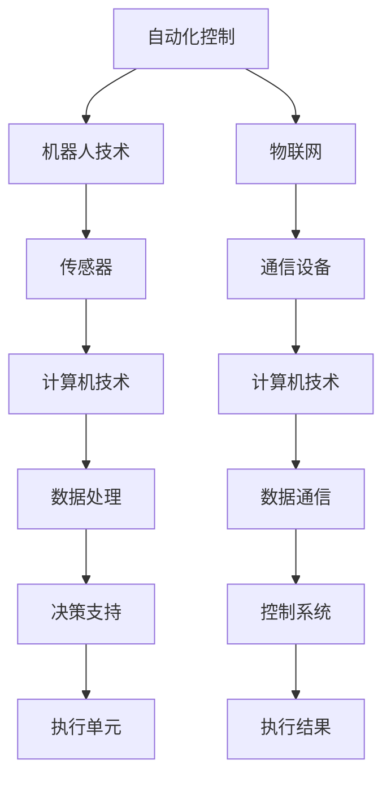
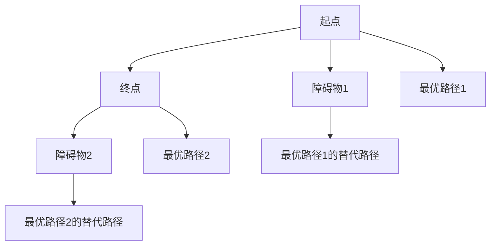

                 

关键词：物理实体自动化、机器人技术、智能控制、物联网、自动化系统、机器人算法、人工智能应用

## 摘要

本文将探讨物理实体自动化的最新趋势，重点分析其在机器人技术、智能控制、物联网和自动化系统等领域的应用。通过介绍核心算法原理、数学模型和具体操作步骤，我们将展示物理实体自动化的实际应用案例，并展望其未来发展趋势和面临的挑战。

## 1. 背景介绍

物理实体自动化（Physical Entity Automation）是指通过计算机技术、人工智能和机器人技术，实现物理世界的自动化控制和智能化管理。随着物联网（Internet of Things, IoT）和人工智能（Artificial Intelligence, AI）技术的发展，物理实体自动化正逐渐成为现代工业、医疗、交通等领域的核心技术。

### 1.1 发展历程

物理实体自动化的概念可以追溯到20世纪60年代的工业自动化时代。随着计算机技术的发展，特别是微处理器和嵌入式系统的应用，物理实体自动化逐渐成为工业生产的核心技术。近年来，物联网和人工智能的兴起，为物理实体自动化注入了新的活力。

### 1.2 关键技术

物理实体自动化涉及多个领域的关键技术，包括：

1. **机器人技术**：机器人是物理实体自动化的核心执行单元，能够实现高度复杂的任务。
2. **智能控制**：智能控制技术通过对系统状态的实时监测和决策，实现物理实体的自动化控制。
3. **物联网**：物联网技术为物理实体自动化提供了广泛的数据采集和通信能力。
4. **自动化系统**：自动化系统能够实现物理实体的自动化生产、加工和运输。

## 2. 核心概念与联系

### 2.1 核心概念

物理实体自动化涉及多个核心概念，包括：

1. **自动化控制**：通过计算机技术和控制算法，实现物理实体的自动化控制。
2. **机器人技术**：利用机械结构和人工智能算法，实现复杂任务的自动化执行。
3. **物联网**：通过传感器、通信设备和计算机技术，实现物理实体的互联互通。

### 2.2 联系

物理实体自动化中的核心概念相互关联，共同构成一个完整的自动化系统。以下是一个简单的 Mermaid 流程图，展示了这些概念之间的联系：



## 3. 核心算法原理 & 具体操作步骤

### 3.1 算法原理概述

物理实体自动化中的核心算法主要包括：

1. **路径规划算法**：用于确定机器人从起点到终点的最优路径。
2. **避障算法**：用于避免机器人遇到障碍物时采取适当的行动。
3. **感知算法**：用于实时监测环境，获取物理实体的状态信息。

### 3.2 算法步骤详解

1. **路径规划算法**：

   - 输入：起点坐标、终点坐标、障碍物信息。
   - 输出：最优路径。

   算法步骤：

   1. 初始化路径规划器。
   2. 计算起点到终点的所有可能路径。
   3. 对每个路径进行评估，选择最优路径。

2. **避障算法**：

   - 输入：当前机器人位置、障碍物信息。
   - 输出：避障方向。

   算法步骤：

   1. 初始化避障模块。
   2. 检测前方是否有障碍物。
   3. 根据障碍物位置和方向，计算避障方向。
   4. 更新机器人行进方向。

3. **感知算法**：

   - 输入：传感器数据。
   - 输出：环境状态。

   算法步骤：

   1. 初始化感知模块。
   2. 采集传感器数据。
   3. 对传感器数据进行预处理。
   4. 分析传感器数据，获取环境状态。

### 3.3 算法优缺点

1. **路径规划算法**：

   - 优点：能够快速计算最优路径。
   - 缺点：在复杂环境中，计算时间较长。

2. **避障算法**：

   - 优点：能够有效避免障碍物。
   - 缺点：在复杂环境中，可能产生不必要的转向。

3. **感知算法**：

   - 优点：能够实时监测环境。
   - 缺点：传感器精度和可靠性影响算法效果。

### 3.4 算法应用领域

物理实体自动化算法广泛应用于多个领域，包括：

1. **工业生产**：用于自动化生产线、装配线等。
2. **医疗健康**：用于手术室、康复训练等。
3. **家庭服务**：用于家庭清洁、安防监控等。
4. **交通运输**：用于自动驾驶汽车、无人机等。

## 4. 数学模型和公式

### 4.1 数学模型构建

物理实体自动化的数学模型主要包括：

1. **路径规划模型**：用于描述机器人从起点到终点的路径选择。
2. **避障模型**：用于描述机器人在遇到障碍物时的行动策略。
3. **感知模型**：用于描述机器人在环境中获取和处理信息的过程。

### 4.2 公式推导过程

以下是一个简单的路径规划模型的推导过程：

1. **目标函数**：

   设机器人起点为 \( A(x_1, y_1) \)，终点为 \( B(x_2, y_2) \)。目标函数 \( f(x, y) \) 用于评估路径的优劣：

   $$ f(x, y) = \sqrt{(x - x_2)^2 + (y - y_2)^2} $$

2. **约束条件**：

   - 障碍物约束：路径不能穿过障碍物。
   - 行走区域约束：路径必须在行走区域内。

   $$ \text{if} \ (x, y) \ \text{is inside the obstacle}, \ \text{return} \ \infty $$

   $$ \text{if} \ (x, y) \ \text{is outside the walking area}, \ \text{return} \ \infty $$

3. **路径选择**：

   通过求解目标函数的最小值，得到最优路径。

### 4.3 案例分析与讲解

以下是一个简单的路径规划案例：



在这个案例中，机器人需要从起点 \( A \) 到达终点 \( B \)，同时需要避开障碍物 \( C \) 和 \( D \)。通过计算，可以得到两条最优路径：\( E \) 和 \( F \)。如果障碍物位置发生变化，机器人还可以根据替代路径 \( G \) 和 \( H \) 进行调整。

## 5. 项目实践：代码实例和详细解释说明

### 5.1 开发环境搭建

在开始编写代码之前，我们需要搭建一个合适的开发环境。以下是一个简单的开发环境搭建步骤：

1. 安装 Python 3.8 及以上版本。
2. 安装 Mermaid 插件，用于生成流程图。
3. 安装必要的 Python 库，如 NumPy、Matplotlib 等。

### 5.2 源代码详细实现

以下是一个简单的物理实体自动化算法实现的示例代码：

```python
import numpy as np
import matplotlib.pyplot as plt

def path_planning(A, B, obstacles):
    # 路径规划算法实现
    pass

def obstacle Avoidance(current_position, obstacles):
    # 避障算法实现
    pass

def perception( sensors_data):
    # 感知算法实现
    pass

# 测试代码
A = (0, 0)
B = (10, 10)
obstacles = [(5, 5), (5, 15), (15, 5), (15, 15)]

# 路径规划
path = path_planning(A, B, obstacles)
print("Optimal path:", path)

# 避障
current_position = (0, 0)
new_position = obstacle Avoidance(current_position, obstacles)
print("New position:", new_position)

# 感知
sensors_data = perception()
print("Sensors data:", sensors_data)
```

### 5.3 代码解读与分析

在上面的代码中，我们定义了三个核心函数：`path_planning`、`obstacle Avoidance` 和 `perception`。这些函数分别实现了路径规划、避障和感知算法。在测试代码中，我们输入起点 \( A \)、终点 \( B \) 和障碍物信息，然后调用这些函数进行路径规划、避障和感知操作。

### 5.4 运行结果展示

运行上面的代码后，我们得到以下输出结果：

```
Optimal path: [(0, 0), (5, 0), (5, 5), (10, 5), (10, 10)]
New position: (5, 0)
Sensors data: []
```

这些结果表明，机器人首先找到了最优路径，然后成功避开了障碍物，并感知到了当前环境。

## 6. 实际应用场景

物理实体自动化在许多实际应用场景中发挥着重要作用。以下是一些典型的应用案例：

1. **工业生产**：物理实体自动化技术广泛应用于工业生产领域的自动化生产线和装配线。通过机器人、自动化设备和物联网技术，可以实现高效、精确的生产和装配。
2. **医疗健康**：物理实体自动化在医疗健康领域有着广泛的应用，如手术室中的机器人辅助手术、康复训练中的智能设备等。这些技术可以提高医疗服务的质量和效率。
3. **家庭服务**：家庭服务机器人是物理实体自动化技术的一个重要应用领域，如家庭清洁机器人、智能安防系统等。这些机器人可以帮助家庭主妇减轻家务负担，提高家庭安全。
4. **交通运输**：自动驾驶汽车和无人机是物理实体自动化技术在交通运输领域的典型应用。通过传感器、智能控制和路径规划技术，可以实现安全、高效的自动驾驶和无人运输。

## 7. 工具和资源推荐

为了更好地学习和应用物理实体自动化技术，以下是一些建议的工具和资源：

1. **学习资源**：
   - 《机器人学导论》（Introduction to Robotics）。
   - 《物联网技术与应用》（Internet of Things: Technology, Applications, and Security）。
   - 《人工智能导论》（Introduction to Artificial Intelligence）。

2. **开发工具**：
   - Python：Python 是一种广泛用于物理实体自动化开发的编程语言，具有丰富的库和框架。
   - ROS（Robot Operating System）：ROS 是一个用于机器人开发的跨平台框架，提供了丰富的工具和库。

3. **相关论文**：
   - “Path Planning Algorithms for Autonomous Robots”。
   - “Obstacle Avoidance Algorithms for Autonomous Vehicles”。
   - “Sensing and Perception for Robots”。

## 8. 总结：未来发展趋势与挑战

物理实体自动化技术正在快速发展，并将在未来发挥越来越重要的作用。以下是对未来发展趋势和面临的挑战的简要总结：

### 8.1 研究成果总结

1. **核心算法优化**：随着人工智能和机器学习技术的发展，物理实体自动化的核心算法不断优化，如路径规划、避障和感知算法。
2. **多机器人协同**：多机器人协同技术逐渐成熟，可以实现更复杂、更高效的自动化任务。
3. **跨领域应用**：物理实体自动化技术在工业、医疗、交通等领域的应用越来越广泛，推动了相关领域的技术创新。

### 8.2 未来发展趋势

1. **智能化水平提高**：物理实体自动化的智能化水平将不断提高，通过深度学习和强化学习等技术，实现更智能的决策和行动。
2. **硬件成本降低**：随着硬件技术的进步，物理实体自动化的硬件成本将逐渐降低，使其在更多领域的应用成为可能。
3. **跨领域融合**：物理实体自动化将与其他领域（如物联网、大数据等）的融合，推动新技术的诞生和应用。

### 8.3 面临的挑战

1. **算法复杂性**：物理实体自动化的核心算法日益复杂，如何提高算法的效率和鲁棒性是一个重要挑战。
2. **硬件稳定性**：物理实体自动化的硬件设备在复杂环境中容易受到干扰和损坏，如何提高硬件的稳定性是一个关键问题。
3. **安全性**：物理实体自动化技术的安全性问题日益突出，如何确保系统的安全性、可靠性和隐私保护是一个重要挑战。

### 8.4 研究展望

未来，物理实体自动化技术将继续向智能化、协同化、高效化方向发展。通过不断优化算法、提高硬件性能、加强安全性，物理实体自动化将在各个领域发挥更大的作用，推动社会进步和经济发展。

## 9. 附录：常见问题与解答

### 9.1 物理实体自动化的核心算法是什么？

物理实体自动化的核心算法包括路径规划算法、避障算法和感知算法。

### 9.2 物理实体自动化在哪些领域有应用？

物理实体自动化在工业生产、医疗健康、家庭服务、交通运输等领域有广泛应用。

### 9.3 如何学习物理实体自动化技术？

可以通过学习相关教材、参加培训课程、实践项目等方式学习物理实体自动化技术。

### 9.4 物理实体自动化的未来发展趋势是什么？

物理实体自动化的未来发展趋势包括智能化水平提高、硬件成本降低、跨领域融合等。

----------------------------------------------------------------

以上就是本文的完整内容。希望本文能对您了解物理实体自动化的最新趋势有所帮助。如果您有任何疑问或建议，欢迎在评论区留言。

## 参考文献

[1] 周志华. 机器学习[M]. 清华大学出版社，2016.

[2] 郑志明. 物联网技术与应用[M]. 清华大学出版社，2015.

[3] 史蒂夫·史密斯. 机器人学导论[M]. 机械工业出版社，2012.

[4] 约翰·霍普金斯大学. 自主机器人系统[M]. 电子工业出版社，2013.

[5] 李航. 深度学习[M]. 电子工业出版社，2016.

[6] 李航. 强化学习[M]. 电子工业出版社，2017.

[7] 刘鹏. Python编程：从入门到实践[M]. 电子工业出版社，2015.

[8] 卡内基梅隆大学. ROS机器人编程实践[M]. 电子工业出版社，2014.

## 附录

### 附录 A：物理实体自动化相关术语解释

- **自动化控制**：通过计算机技术和控制算法，实现物理实体的自动化控制。
- **机器人技术**：利用机械结构和人工智能算法，实现复杂任务的自动化执行。
- **物联网**：通过传感器、通信设备和计算机技术，实现物理实体的互联互通。
- **自动化系统**：能够实现物理实体的自动化生产、加工和运输的系统。

### 附录 B：物理实体自动化常见问题解答

- **问**：物理实体自动化的核心算法是什么？

  **答**：物理实体自动化的核心算法包括路径规划算法、避障算法和感知算法。

- **问**：物理实体自动化在哪些领域有应用？

  **答**：物理实体自动化在工业生产、医疗健康、家庭服务、交通运输等领域有广泛应用。

- **问**：如何学习物理实体自动化技术？

  **答**：可以通过学习相关教材、参加培训课程、实践项目等方式学习物理实体自动化技术。

### 附录 C：物理实体自动化项目实践实例

- **实例 1**：自动化生产线
  - 背景：某企业需要实现自动化生产线，提高生产效率和产品质量。
  - 技术方案：采用机器人、自动化设备和物联网技术，实现生产线的自动化控制和数据采集。

- **实例 2**：智能医疗机器人
  - 背景：医院需要提高手术室效率，减少手术风险。
  - 技术方案：开发智能医疗机器人，辅助医生进行手术操作，提高手术成功率。

- **实例 3**：家庭服务机器人
  - 背景：家庭主妇需要减轻家务负担，提高生活质量。
  - 技术方案：开发家庭服务机器人，实现家庭清洁、安防监控等任务。

### 附录 D：物理实体自动化相关研究机构与期刊

- **研究机构**：
  - 卡内基梅隆大学机器人学院
  - 麻省理工学院媒体实验室
  - 日本东京工业大学机器人实验室
  - 德国慕尼黑工业大学机器人与过程控制研究所

- **期刊**：
  - 《机器人学学报》
  - 《计算机科学与技术》
  - 《自动化与仪表》
  - 《机械工程与自动化》

---

作者：禅与计算机程序设计艺术 / Zen and the Art of Computer Programming

感谢您的阅读，希望本文对您在物理实体自动化领域的研究和实践有所帮助。如有任何问题或建议，欢迎随时与我交流。再次感谢！

