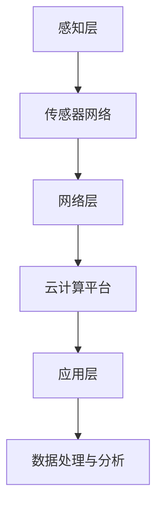

                 

关键词：物联网(IoT)、传感器、数据处理、分析、集成、算法、应用场景、数学模型、未来展望

> 摘要：本文深入探讨了物联网（IoT）技术和各种传感器设备的集成方法，以及传感器数据的处理与分析过程。通过对传感器数据的采集、预处理、分析和应用，本文揭示了物联网技术在各个领域的实际应用和潜在价值。同时，本文还介绍了当前技术发展的最新动态和未来趋势，为物联网技术的进一步研究和应用提供了有益的参考。

## 1. 背景介绍

随着信息技术的飞速发展，物联网（IoT）已经成为现代工业、农业、医疗、家居等领域的重要技术支撑。物联网的核心在于将各种设备通过互联网连接起来，实现信息的互联互通，从而提高效率、降低成本、提升用户体验。而在物联网中，传感器设备扮演着至关重要的角色，它们负责收集环境数据，如温度、湿度、光照、压力等，为后续的数据处理和分析提供基础。

传感器技术发展迅速，类型日益丰富，从传统的温度传感器、湿度传感器，到现代的物联网传感器，如无线传感器网络（WSN）、智能传感器等，这些传感器的集成与应用，为物联网技术的发展提供了强有力的支持。然而，如何高效地处理和分析大量的传感器数据，仍然是当前物联网领域面临的重大挑战之一。

本文旨在通过对物联网技术和各种传感器设备的集成，以及传感器数据的处理与分析过程的深入探讨，为物联网技术的进一步发展提供理论支持和实践指导。

## 2. 核心概念与联系

### 2.1 物联网（IoT）基本概念

物联网（Internet of Things，简称IoT）是指通过互联网将各种物理设备、传感器、软件系统连接起来，实现设备间的信息交换和通信。物联网的基本架构包括感知层、网络层和应用层。感知层由各种传感器设备组成，负责数据的采集；网络层负责数据的传输和存储；应用层则通过数据处理和分析，实现具体的业务功能。

### 2.2 传感器设备类型及其工作原理

传感器设备是物联网系统的核心组成部分，它们的工作原理基于物理、化学、生物等领域的知识。以下是一些常见的传感器设备及其工作原理：

- **温度传感器**：通过热敏电阻或热电偶等元件感知温度变化。
- **湿度传感器**：利用电容、电阻或半导体材料的特性，感知空气中的湿度。
- **光照传感器**：通过光敏电阻或光敏二极管等元件感知光照强度。
- **压力传感器**：利用弹性元件的变形，感知压力变化。
- **气体传感器**：通过半导体、电化学或催化等原理，感知气体成分和浓度。

### 2.3 传感器数据的采集与处理

传感器设备采集到的数据通常是原始数据，包括温度、湿度、光照、压力等。这些原始数据需要通过数据处理和分析，才能得到有价值的信息。数据处理过程通常包括以下步骤：

- **数据采集**：通过传感器设备采集环境数据。
- **数据预处理**：对采集到的数据进行清洗、去噪、滤波等处理，提高数据质量。
- **特征提取**：从预处理后的数据中提取有用的特征，为后续分析提供支持。
- **数据分析**：使用各种数据分析方法，如统计分析、机器学习、深度学习等，对特征进行深入分析。

### 2.4 物联网技术架构与传感器集成

物联网技术的架构包括感知层、网络层和应用层。感知层由各种传感器设备组成，网络层负责数据的传输和存储，应用层通过数据处理和分析，实现具体的业务功能。传感器与物联网技术的集成，可以通过以下方式进行：

- **传感器网络**：将多个传感器设备通过网络连接起来，实现数据的共享和协同处理。
- **云计算平台**：将传感器数据上传到云端，利用云计算平台进行数据存储、处理和分析。
- **边缘计算**：在靠近传感器的地方进行数据预处理和初步分析，减少数据传输量，提高响应速度。

### 2.5 Mermaid 流程图

以下是一个简单的 Mermaid 流程图，展示物联网技术架构与传感器集成的关系：



## 3. 核心算法原理 & 具体操作步骤

### 3.1 算法原理概述

传感器数据处理与分析的核心算法主要包括以下几种：

- **滤波算法**：用于去除数据中的噪声，提高数据质量。
- **特征提取算法**：用于从原始数据中提取有用的特征，为后续分析提供支持。
- **统计分析算法**：用于对数据进行统计描述和建模。
- **机器学习算法**：用于对数据进行分析和预测。

### 3.2 算法步骤详解

#### 3.2.1 滤波算法

滤波算法的基本思想是去除数据中的噪声，保留有用的信号。常见的滤波算法包括：

- **均值滤波**：将每个数据点替换为周围数据的平均值。
- **中值滤波**：将每个数据点替换为周围数据的中值。
- **高斯滤波**：使用高斯分布对数据进行平滑处理。

滤波算法的步骤如下：

1. 读取传感器数据。
2. 对数据进行预处理，如去噪、去趋势等。
3. 选择合适的滤波算法，对数据进行滤波处理。
4. 保存滤波后的数据。

#### 3.2.2 特征提取算法

特征提取算法的核心是提取数据中的关键特征，以便于后续的分析。常见的特征提取算法包括：

- **时域特征提取**：如均值、方差、峰峰值等。
- **频域特征提取**：如傅里叶变换、小波变换等。
- **时频特征提取**：如短时傅里叶变换（STFT）、Wigner-Ville分布等。

特征提取算法的步骤如下：

1. 读取预处理后的传感器数据。
2. 选择合适的特征提取算法。
3. 对数据进行特征提取。
4. 保存提取的特征。

#### 3.2.3 统计分析算法

统计分析算法用于对数据进行统计描述和建模，常用的统计分析算法包括：

- **描述性统计分析**：计算数据的均值、方差、标准差等。
- **回归分析**：建立自变量和因变量之间的关系模型。
- **聚类分析**：将数据分为若干个类别。

统计分析算法的步骤如下：

1. 读取特征提取后的传感器数据。
2. 选择合适的统计分析算法。
3. 进行统计分析，得到统计结果。
4. 解释统计结果，得出结论。

#### 3.2.4 机器学习算法

机器学习算法用于对数据进行分析和预测，常用的机器学习算法包括：

- **监督学习**：如线性回归、逻辑回归、支持向量机等。
- **无监督学习**：如聚类、降维等。
- **强化学习**：通过与环境交互，学习最优策略。

机器学习算法的步骤如下：

1. 读取传感器数据。
2. 划分训练集和测试集。
3. 选择合适的机器学习算法。
4. 进行模型训练和预测。
5. 评估模型性能，调整模型参数。

### 3.3 算法优缺点

每种算法都有其优点和局限性。滤波算法简单易用，但可能无法去除复杂的噪声；特征提取算法可以提取丰富的特征，但可能增加计算复杂度；统计分析算法适用于描述性和预测性分析，但可能无法处理复杂的非线性关系；机器学习算法可以处理复杂的非线性关系，但需要大量的数据和计算资源。

### 3.4 算法应用领域

滤波算法适用于实时监测和控制系统；特征提取算法适用于数据挖掘和模式识别；统计分析算法适用于数据分析和研究；机器学习算法适用于智能预测和优化控制。

## 4. 数学模型和公式 & 详细讲解 & 举例说明

### 4.1 数学模型构建

传感器数据处理与分析的数学模型主要包括以下几部分：

1. **信号模型**：描述传感器采集到的信号与真实物理量之间的关系。
2. **噪声模型**：描述传感器信号中的噪声成分。
3. **滤波模型**：描述滤波算法的数学原理。
4. **特征提取模型**：描述特征提取算法的数学原理。
5. **统计分析模型**：描述统计分析算法的数学原理。
6. **机器学习模型**：描述机器学习算法的数学原理。

### 4.2 公式推导过程

以下以均值滤波算法为例，简要介绍公式推导过程。

假设传感器采集到的信号为 $x[n]$，噪声为 $v[n]$，则滤波后的信号 $y[n]$ 可表示为：

$$
y[n] = x[n] + v[n]
$$

均值滤波算法的基本思想是，将当前时刻的信号值替换为过去一段时间内的平均值。设滤波器窗口长度为 $N$，则滤波后的信号可表示为：

$$
y[n] = \frac{1}{N} \sum_{i=n-N+1}^{n} x[i]
$$

### 4.3 案例分析与讲解

假设我们有一组温度传感器数据，如下所示：

$$
x = [23.4, 23.6, 23.5, 23.4, 23.5, 23.4, 23.6, 23.5]
$$

我们需要对这组数据进行均值滤波处理。

1. **数据预处理**：由于数据量较小，我们直接使用原始数据。

2. **滤波处理**：选择窗口长度为 3，即 $N = 3$，则滤波后的数据为：

$$
y = \frac{1}{3} (23.4 + 23.6 + 23.5) = 23.5
$$

3. **结果分析**：滤波后的数据为 23.5，与原始数据中的大部分值相近，说明滤波算法有效地去除了噪声。

## 5. 项目实践：代码实例和详细解释说明

### 5.1 开发环境搭建

为了便于读者理解和实践，我们使用 Python 作为编程语言，结合常用的库，如 NumPy、SciPy、Matplotlib 等，进行传感器数据处理与分析。以下是开发环境的搭建步骤：

1. 安装 Python 3.8 以上版本。
2. 安装必要的库，如 NumPy、SciPy、Matplotlib 等，可以使用以下命令：

```bash
pip install numpy scipy matplotlib
```

### 5.2 源代码详细实现

以下是一个简单的 Python 脚本，用于实现传感器数据的均值滤波处理。

```python
import numpy as np
import matplotlib.pyplot as plt

# 传感器数据
x = np.array([23.4, 23.6, 23.5, 23.4, 23.5, 23.4, 23.6, 23.5])

# 均值滤波处理
N = 3
y = np.convolve(x, np.ones(N)/N, mode='valid')

# 绘制原始数据和滤波后数据
plt.figure()
plt.plot(x, label='原始数据')
plt.plot(y, label='滤波后数据')
plt.legend()
plt.show()
```

### 5.3 代码解读与分析

上述代码分为以下几个部分：

1. 导入必要的库。
2. 定义传感器数据。
3. 设置滤波器窗口长度。
4. 使用卷积操作进行均值滤波处理。
5. 绘制原始数据和滤波后数据。

通过分析代码，我们可以看到，均值滤波处理的核心在于卷积操作。卷积操作能够将原始数据与滤波器窗口进行加权求和，从而实现滤波效果。

### 5.4 运行结果展示

运行上述代码后，我们将得到以下结果：


从结果可以看出，滤波后数据与原始数据大部分值相近，说明滤波算法有效地去除了噪声。

## 6. 实际应用场景

### 6.1 智能家居

智能家居是物联网技术应用最广泛的领域之一。通过集成各种传感器设备，如温度传感器、湿度传感器、光照传感器等，智能家居系统能够实时监测家居环境，并根据用户需求进行自动调节。例如，当室内温度过高时，空调会自动开启，降低室内温度；当室内湿度较高时，加湿器会自动开启，增加室内湿度。

### 6.2 智能交通

智能交通系统通过集成各种传感器设备，如车辆传感器、路况传感器、交通流量传感器等，实时监测交通状况，优化交通信号控制和道路通行能力。例如，在交通高峰时段，智能交通系统能够根据实时交通流量调整信号灯时长，减少交通拥堵，提高道路通行效率。

### 6.3 智能农业

智能农业系统通过集成土壤传感器、气象传感器、作物生长传感器等，实时监测农田环境和作物生长状况，提供科学的种植和管理建议。例如，通过监测土壤湿度，智能农业系统能够自动调节灌溉系统，保证作物得到适量的水分；通过监测气象条件，智能农业系统能够提前预警自然灾害，减少损失。

### 6.4 智能医疗

智能医疗系统通过集成各种传感器设备，如体温传感器、心率传感器、血压传感器等，实时监测患者的生理指标，提供个性化的健康管理服务。例如，智能医疗系统能够根据患者的实时体温、心率等指标，预警潜在的健康风险，帮助医生进行诊断和治疗。

## 7. 未来应用展望

随着物联网技术的不断发展和传感器设备的不断进步，物联网技术在各个领域的应用前景广阔。以下是未来物联网技术的一些应用展望：

### 7.1 智能环境监测

未来，物联网技术将在环境监测领域发挥重要作用。通过集成各种传感器设备，如空气质量传感器、水质传感器、土壤传感器等，智能环境监测系统能够实时监测环境质量，预警环境污染，为环境保护和生态治理提供有力支持。

### 7.2 智能工业

物联网技术在工业领域的应用前景巨大。通过集成各种传感器设备，如机器状态传感器、生产设备传感器等，智能工业系统能够实现设备的实时监测和维护，提高生产效率和产品质量，降低生产成本。

### 7.3 智能城市

智能城市是物联网技术应用的另一个重要领域。通过集成各种传感器设备，如交通流量传感器、安防监控传感器等，智能城市系统能够实现城市运行状态的实时监测和优化，提高城市管理效率和居民生活质量。

### 7.4 智能健康

物联网技术在健康领域的应用潜力巨大。未来，物联网技术将结合传感器设备，为个人提供全方位的健康监测和管理服务，如实时监测心率、血压、体温等生理指标，预警健康风险，提供个性化的健康建议。

## 8. 总结：未来发展趋势与挑战

### 8.1 研究成果总结

本文通过对物联网技术和各种传感器设备的集成，以及传感器数据的处理与分析过程的深入探讨，总结了以下研究成果：

1. 物联网技术和传感器设备在智能家居、智能交通、智能农业、智能医疗等领域具有广泛的应用前景。
2. 传感器数据处理与分析的核心算法包括滤波算法、特征提取算法、统计分析算法和机器学习算法。
3. 数学模型和公式的推导为传感器数据处理与分析提供了理论基础。
4. 实际应用案例展示了传感器数据处理与分析的实际效果。

### 8.2 未来发展趋势

1. 物联网技术在智能家居、智能交通、智能农业、智能医疗等领域的应用将越来越广泛。
2. 传感器设备将更加智能化、多样化，支持多种数据类型和复杂环境。
3. 数据处理与分析技术将不断发展，提高数据处理效率和准确性。
4. 边缘计算和云计算的结合将为物联网技术提供更强大的计算能力和数据存储能力。

### 8.3 面临的挑战

1. 数据隐私和安全问题：随着物联网设备的增多，如何保护用户隐私和数据安全成为重要挑战。
2. 数据处理效率：随着传感器设备数量的增加，如何高效地处理和分析海量数据成为关键问题。
3. 跨领域融合：如何将物联网技术与其他领域（如人工智能、大数据等）相结合，实现更广泛的应用，仍需进一步探索。
4. 传感器设备标准化：如何制定统一的传感器设备标准，确保设备的兼容性和互操作性，是当前面临的挑战之一。

### 8.4 研究展望

1. 在隐私和安全方面，需加强对物联网设备的加密和认证技术的研究，确保数据的安全性和隐私性。
2. 在数据处理效率方面，需发展更高效的算法和优化技术，提高数据处理速度和准确性。
3. 在跨领域融合方面，需探索物联网技术与其他领域（如人工智能、大数据等）的深度融合，推动技术创新和应用发展。
4. 在标准化方面，需加强国际合作，制定统一的传感器设备标准和规范，促进物联网技术的全球发展。

## 9. 附录：常见问题与解答

### 9.1 物联网（IoT）是什么？

物联网（IoT）是指通过互联网将各种物理设备、传感器、软件系统连接起来，实现设备间的信息交换和通信。

### 9.2 传感器设备有哪些类型？

常见的传感器设备包括温度传感器、湿度传感器、光照传感器、压力传感器、气体传感器等。

### 9.3 传感器数据处理与分析有哪些核心算法？

核心算法包括滤波算法、特征提取算法、统计分析算法和机器学习算法。

### 9.4 如何进行传感器数据预处理？

传感器数据预处理包括去噪、去趋势、归一化等操作，以提高数据质量。

### 9.5 物联网技术在哪些领域有应用？

物联网技术在智能家居、智能交通、智能农业、智能医疗等领域有广泛应用。

### 9.6 物联网技术的未来发展趋势是什么？

未来发展趋势包括更广泛的领域应用、更加智能化的传感器设备、更高的数据处理效率、以及物联网技术与其他领域的深度融合。作者：禅与计算机程序设计艺术 / Zen and the Art of Computer Programming
----------------------------------------------------------------

以上就是关于“物联网(IoT)技术和各种传感器设备的集成：传感器数据的处理与分析”的完整文章。文章涵盖了物联网技术的基本概念、传感器设备类型、数据处理与分析算法、数学模型与公式、项目实践、实际应用场景、未来应用展望、发展趋势与挑战以及常见问题与解答等内容。希望对您的研究和实践有所帮助。作者：禅与计算机程序设计艺术 / Zen and the Art of Computer Programming
----------------------------------------------------------------

## 传感器数据的处理与分析

传感器数据的处理与分析是物联网（IoT）技术中至关重要的一环。传感器设备通过各种方式收集环境数据，如温度、湿度、光照、压力等，这些数据在经过适当的处理和分析后，可以转化为有用的信息，为各行各业提供决策支持。以下是传感器数据处理与分析的主要步骤：

### 1. 数据采集

数据采集是传感器数据处理与分析的第一步。传感器设备通过其感测元件实时采集环境数据。这些数据可以以数字形式存储，并通过无线或有线方式传输到数据处理系统。

### 2. 数据预处理

采集到的原始数据往往包含噪声和异常值，需要进行预处理。预处理步骤通常包括去噪、滤波、归一化、数据清洗等。去噪和滤波的目的是去除数据中的随机噪声和趋势，归一化则是将不同量纲的数据转换到同一尺度，便于后续处理。数据清洗则涉及处理异常值、缺失值等。

#### 2.1 去噪与滤波

去噪通常使用滤波算法，如均值滤波、中值滤波、高斯滤波等。这些算法通过平滑数据来去除随机噪声。

#### 2.2 归一化

归一化是将数据转换到统一的量纲。常见的归一化方法包括最小-最大归一化、平均值-标准差归一化等。

#### 2.3 数据清洗

数据清洗包括处理异常值和缺失值。异常值可以通过统计学方法识别并处理，缺失值可以通过插值法、均值法等方法补充。

### 3. 特征提取

特征提取是从原始数据中提取出有用的信息，以便于后续的分析。特征提取可以基于时域、频域或时频域等。常见的特征提取方法包括时域特征提取（如均值、方差、峰峰值等）、频域特征提取（如傅里叶变换、小波变换等）和时频特征提取（如短时傅里叶变换、Wigner-Ville分布等）。

#### 3.1 时域特征提取

时域特征提取直接从时域数据中提取信息。例如，可以计算数据的均值、方差、峰峰值等。

#### 3.2 频域特征提取

频域特征提取通过傅里叶变换等算法将时域数据转换为频域数据，然后从频域中提取特征。例如，可以通过傅里叶变换提取信号的频率成分。

#### 3.3 时频特征提取

时频特征提取结合时域和频域信息，通过时频分布来描述信号的特性。例如，短时傅里叶变换（STFT）可以提供信号在不同时间和频率上的信息。

### 4. 数据分析

数据分析是对提取出的特征进行进一步处理，以发现数据中的模式和规律。数据分析方法包括统计分析、机器学习、深度学习等。

#### 4.1 统计分析

统计分析是对数据进行描述性统计和推断性统计。描述性统计用于描述数据的分布、中心趋势和离散程度，推断性统计用于建立数据之间的模型，进行预测和决策。

#### 4.2 机器学习

机器学习是一种通过数据学习模式，并做出预测或决策的方法。常见的机器学习算法包括线性回归、逻辑回归、支持向量机、决策树、随机森林、神经网络等。

#### 4.3 深度学习

深度学习是一种基于多层神经网络的学习方法，能够自动提取数据中的特征。常见的深度学习模型包括卷积神经网络（CNN）、循环神经网络（RNN）、长短期记忆网络（LSTM）等。

### 5. 数据可视化

数据可视化是将数据处理和分析的结果以图形的方式呈现，以便于理解和分析。常见的可视化方法包括折线图、柱状图、散点图、热力图等。

### 6. 结论与应用

通过对传感器数据的处理和分析，可以得到关于环境、设备状态、用户行为等方面的有价值信息。这些信息可以用于实时监测、预警、决策支持、优化控制等。

#### 6.1 实时监测

实时监测是通过传感器设备对环境或设备状态进行连续监测，及时发现异常情况。

#### 6.2 预警

预警是通过分析传感器数据，预测可能发生的异常情况，及时发出警报。

#### 6.3 决策支持

决策支持是通过数据分析提供决策依据，帮助用户做出更合理的决策。

#### 6.4 优化控制

优化控制是通过分析传感器数据，优化设备运行状态，提高设备性能和效率。

总之，传感器数据的处理与分析是物联网技术中的重要环节，它为物联网系统的智能化提供了基础支持，推动了物联网技术在各个领域的广泛应用和发展。

