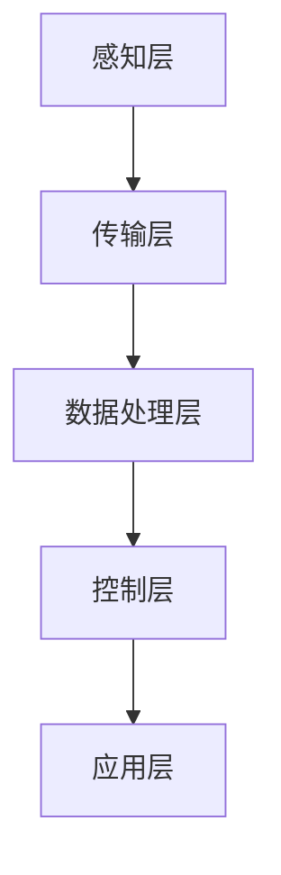

                 

关键词：物联网，智能家居，传感器，集成，技术，应用

> 摘要：本文旨在探讨物联网（IoT）技术和各种传感器设备在智能家居中的应用，分析其集成方法及其带来的便利和挑战。通过详细阐述物联网的核心概念、智能家居的应用实例，以及传感器技术的融合，为读者提供一个全面的技术视角，并对未来的发展趋势和面临的挑战进行展望。

## 1. 背景介绍

随着科技的不断发展，物联网（IoT）已经成为现代智能家居领域的一个重要组成部分。智能家居通过将各种设备连接到互联网，实现家庭设备之间的互联互通，从而提升生活的便捷性和智能化水平。物联网的核心在于设备间的通信和数据的交换，而传感器技术在其中起到了至关重要的作用。

传感器是物联网系统的感知单元，它们能够检测环境中的各种物理量，如温度、湿度、光照、声音、运动等，并将这些信息转换为电子信号，传递给系统进行处理。各种传感器设备如温湿度传感器、光照传感器、声音传感器、运动传感器等，通过集成到物联网系统中，可以为智能家居提供丰富的数据支持，实现家庭环境的智能化控制。

## 2. 核心概念与联系

### 2.1 物联网的核心概念

物联网（IoT）是一种通过互联网连接各种设备、系统和服务的技术，实现物理世界与数字世界的融合。物联网的核心概念包括以下几个部分：

- **设备连接**：各种设备通过互联网进行连接，实现数据的交换和通信。
- **数据采集**：传感器设备采集环境数据，如温度、湿度、光照等。
- **数据处理**：系统对采集到的数据进行分析和处理，生成有用的信息。
- **智能决策**：基于处理后的数据，系统可以做出智能决策，如自动调节温度、开关灯光等。
- **人机交互**：用户可以通过手机、平板等终端设备，对智能家居系统进行远程控制和交互。

### 2.2 智能家居的架构

智能家居系统的架构可以分为以下几个层次：

- **感知层**：包括各种传感器设备，负责采集环境数据。
- **传输层**：数据通过互联网进行传输，连接感知层和数据处理层。
- **数据处理层**：对采集到的数据进行处理和分析，生成智能决策。
- **控制层**：根据智能决策，控制家庭设备的运行。
- **应用层**：用户可以通过手机、平板等终端设备，对智能家居系统进行操作和控制。

### 2.3 Mermaid 流程图



## 3. 核心算法原理 & 具体操作步骤

### 3.1 算法原理概述

智能家居系统中的核心算法主要包括数据采集、数据处理和智能决策三个部分。数据采集主要通过传感器设备实现，数据处理和智能决策则依赖于物联网平台和算法模型。

- **数据采集**：传感器设备采集环境数据，如温度、湿度、光照等。
- **数据处理**：物联网平台对采集到的数据进行处理和分析，提取有用的信息。
- **智能决策**：基于处理后的数据，物联网平台可以做出智能决策，如自动调节温度、开关灯光等。

### 3.2 算法步骤详解

1. **数据采集**：各种传感器设备（如温湿度传感器、光照传感器、声音传感器、运动传感器等）实时采集家庭环境数据。
2. **数据传输**：采集到的数据通过无线传输技术（如Wi-Fi、蓝牙等）传输到物联网平台。
3. **数据处理**：物联网平台对接收到的数据进行分析和处理，提取有用的信息，如温度变化趋势、光照强度等。
4. **智能决策**：基于处理后的数据，物联网平台可以做出智能决策，如自动调节空调温度、开关灯光等。
5. **执行控制**：物联网平台通过控制模块（如智能插座、智能灯泡等）执行智能决策，实现对家庭设备的自动控制。
6. **人机交互**：用户可以通过手机、平板等终端设备，对智能家居系统进行远程操作和控制。

### 3.3 算法优缺点

- **优点**：
  - 提高生活质量：通过智能家居系统，用户可以远程控制和监控家庭设备，提高生活便利性。
  - 节能减排：智能家居系统可以根据环境数据自动调节设备运行状态，实现节能减排。
  - 安全保障：智能家居系统可以实时监控家庭安全，提高家庭安全保障。

- **缺点**：
  - 系统复杂度高：智能家居系统涉及多个设备和技术的集成，系统复杂度高。
  - 数据隐私风险：智能家居系统涉及大量用户数据，存在数据隐私风险。
  - 安全风险：智能家居系统存在网络攻击风险，需要加强安全防护。

### 3.4 算法应用领域

- **家庭环境监测**：通过传感器设备实时监测家庭环境，如温度、湿度、空气质量等，提供健康舒适的居住环境。
- **智能安防**：通过传感器设备和视频监控，实时监控家庭安全，提高家庭安全保障。
- **能源管理**：通过智能家居系统，实现家庭能源的智能管理，降低能源消耗。

## 4. 数学模型和公式 & 详细讲解 & 举例说明

### 4.1 数学模型构建

智能家居系统的核心算法涉及多种数学模型，主要包括以下几种：

- **温度控制模型**：基于温度传感器的数据，实现空调温度的自动调节。
- **光照控制模型**：基于光照传感器的数据，实现灯光的自动调节。
- **能耗模型**：基于能耗数据，实现家庭能源的智能管理。

### 4.2 公式推导过程

以温度控制模型为例，假设家庭空调的设定温度为 $T_{set}$，实际温度为 $T_{real}$，空调的制冷功率为 $P_{cool}$，制热功率为 $P_{heat}$。温度控制模型的目标是根据实际温度与设定温度的偏差，自动调节空调的制冷或制热功率。

- **制冷功率计算公式**：

  $$P_{cool} = \frac{T_{real} - T_{set}}{T_{real} - T_{low}} \cdot P_{max}$$

  其中，$T_{low}$ 为空调的最低运行温度，$P_{max}$ 为空调的最大制冷功率。

- **制热功率计算公式**：

  $$P_{heat} = \frac{T_{set} - T_{real}}{T_{high} - T_{real}} \cdot P_{max}$$

  其中，$T_{high}$ 为空调的最高运行温度，$P_{max}$ 为空调的最大制热功率。

### 4.3 案例分析与讲解

假设家庭空调的设定温度为 25°C，最低运行温度为 18°C，最高运行温度为 32°C，最大制冷功率为 2000W，最大制热功率为 1500W。实际温度为 22°C。

1. **制冷功率计算**：

   $$P_{cool} = \frac{22 - 25}{22 - 18} \cdot 2000 = \frac{-3}{4} \cdot 2000 = -1500W$$

   由于制冷功率不能为负值，实际制冷功率为 0W。

2. **制热功率计算**：

   $$P_{heat} = \frac{25 - 22}{32 - 22} \cdot 1500 = \frac{3}{10} \cdot 1500 = 450W$$

   实际制热功率为 450W。

根据计算结果，空调应该以 450W 的功率进行制热，以保持家庭温度在设定温度 25°C 左右。

## 5. 项目实践：代码实例和详细解释说明

### 5.1 开发环境搭建

为了实现智能家居系统，我们需要搭建一个开发环境，主要包括以下工具和软件：

- **硬件**：各种传感器设备（如温湿度传感器、光照传感器、声音传感器等），物联网开发板（如Arduino、Raspberry Pi等）。
- **软件**：物联网平台（如IoTaaS、阿里云物联网平台等），编程语言（如Python、Java等），集成开发环境（如Eclipse、VS Code等）。

### 5.2 源代码详细实现

以下是一个基于 Python 和阿里云物联网平台的智能家居系统示例代码：

```python
from aliyunsdkcore.client import AcsClient
from aliyunsdkcore.request import CommonRequest
import json

# 初始化阿里云物联网客户端
client = AcsClient(
    '<your_access_key_id>',
    '<your_access_key_secret>',
    'your_region_id'
)

# 创建设备数据上报请求
request = CommonRequest()
request.set_accept_format('json')
request.set_domain('iot.aliyuncs.com')
request.set_method('POST')
request.set_version('2018-01-20')
request.set_action_name('ReportDeviceData')

# 设备数据
device_data = {
    "deviceName": "smart_home_001",
    "version": "1.0",
    "data": {
        "temperature": 22,
        "humidity": 45,
        "light": 300,
        "noise": 30
    }
}

# 添加设备数据到请求参数
request.add_query_param('DeviceDataJson', json.dumps(device_data))

# 发送设备数据上报请求
response = client.do_action_with_exception(request)

# 解析响应结果
result = json.loads(response.content)
print("上报结果：", result)
```

### 5.3 代码解读与分析

以上代码实现了一个简单的智能家居系统，通过阿里云物联网平台，将家庭环境数据（如温度、湿度、光照、噪音等）上报到云端。

- **初始化阿里云物联网客户端**：首先，我们需要初始化阿里云物联网客户端，传入访问密钥 ID、访问密钥密钥和区域 ID。
- **创建设备数据上报请求**：然后，我们创建一个设备数据上报请求，设置请求的版本、方法、域名等参数。
- **添加设备数据到请求参数**：接下来，我们将设备数据（如温度、湿度、光照、噪音等）转换为 JSON 格式，添加到请求参数中。
- **发送设备数据上报请求**：最后，我们通过客户端发送设备数据上报请求，并将响应结果解析为 JSON 格式，输出上报结果。

### 5.4 运行结果展示

当运行以上代码时，家庭环境数据将被上报到阿里云物联网平台，并在控制台输出上报结果。以下是一个示例：

```json
{
  "RequestId": "5C4B5C5B-7402-4A90-B0F7-DF049F23C4E7",
  "Success": true
}
```

表示设备数据上报成功。

## 6. 实际应用场景

### 6.1 智能家居系统在家庭环境监测中的应用

智能家居系统可以通过传感器设备实时监测家庭环境，如温度、湿度、光照、噪音等，为用户提供健康舒适的居住环境。例如，当室内温度过高时，系统可以自动开启空调进行降温；当室内湿度过大时，系统可以自动开启加湿器进行加湿；当室内光线过暗时，系统可以自动开启灯光进行照明。

### 6.2 智能家居系统在智能安防中的应用

智能家居系统可以通过传感器设备和视频监控，实时监控家庭安全。例如，当有异常声音或运动时，系统可以自动发送警报信息到用户手机，提醒用户注意安全。同时，系统还可以联动摄像头进行远程监控，提供安全保障。

### 6.3 智能家居系统在能源管理中的应用

智能家居系统可以通过传感器设备和能源管理系统，实现家庭能源的智能管理。例如，当室内无人时，系统可以自动关闭灯光和电器，降低能源消耗；当室内温度过低或过高时，系统可以自动调节空调温度，实现节能运行。

## 7. 工具和资源推荐

### 7.1 学习资源推荐

- **《物联网架构与开发实战》**：一本系统性的物联网技术入门书籍，涵盖了物联网架构、传感器技术、编程实践等内容。
- **《智能家居技术与应用》**：一本针对智能家居领域的专业书籍，介绍了智能家居系统的架构、传感器技术、控制系统等方面的知识。

### 7.2 开发工具推荐

- **Arduino**：一款开源的物联网开发板，适合初学者进行智能家居系统开发。
- **Raspberry Pi**：一款性能优异的物联网开发板，适合进行复杂的智能家居系统开发。

### 7.3 相关论文推荐

- **"Smart Home Technologies: A Comprehensive Survey"**：一篇全面综述智能家居技术的论文，涵盖了传感器技术、控制系统、数据处理等方面的内容。
- **"Energy Efficiency in Smart Homes: A Survey"**：一篇关于智能家居系统能源管理的论文，介绍了智能家居系统的节能方法和策略。

## 8. 总结：未来发展趋势与挑战

### 8.1 研究成果总结

近年来，随着物联网技术和传感器技术的快速发展，智能家居领域取得了显著的成果。智能家居系统在家庭环境监测、智能安防、能源管理等方面发挥着重要作用，为用户提供了便捷、智能、安全的生活体验。同时，物联网平台和算法模型的不断优化，也为智能家居系统的稳定运行提供了有力支持。

### 8.2 未来发展趋势

未来，智能家居领域将继续保持快速发展态势，主要趋势包括：

- **智能化水平的提升**：通过人工智能和大数据技术的应用，智能家居系统将实现更高程度的智能化，提供更精准、更个性化的服务。
- **设备互联互通**：随着物联网技术的普及，智能家居设备之间的互联互通将更加紧密，实现家庭设备的无缝协作。
- **能源效率的提升**：通过智能家居系统的优化，家庭能源消耗将得到有效控制，实现绿色、环保的居住环境。

### 8.3 面临的挑战

尽管智能家居领域取得了显著成果，但仍然面临以下挑战：

- **系统复杂度**：智能家居系统涉及多种设备和技术的集成，系统复杂度高，需要进一步优化和简化。
- **数据安全和隐私保护**：智能家居系统涉及大量用户数据，数据安全和隐私保护成为亟待解决的问题。
- **标准统一**：智能家居领域缺乏统一的技术标准和规范，不利于设备的互联互通和系统稳定运行。

### 8.4 研究展望

未来，智能家居领域的研究将围绕以下几个方面展开：

- **智能决策与控制**：深入研究智能家居系统的智能决策和控制算法，提高系统的智能化水平和响应速度。
- **数据安全和隐私保护**：加强数据安全和隐私保护技术研究，确保用户数据的安全和隐私。
- **设备互联互通**：推动智能家居设备互联互通标准的制定和实施，促进智能家居系统的稳定运行和可持续发展。

## 9. 附录：常见问题与解答

### 9.1 物联网是什么？

物联网（IoT）是一种通过互联网连接各种设备、系统和服务的技术，实现物理世界与数字世界的融合。

### 9.2 传感器在智能家居中的作用是什么？

传感器是智能家居系统的感知单元，它们能够检测环境中的各种物理量，如温度、湿度、光照、声音、运动等，并将这些信息转换为电子信号，传递给系统进行处理。

### 9.3 如何实现智能家居系统的远程控制？

智能家居系统可以通过互联网连接，用户可以通过手机、平板等终端设备，对家庭设备进行远程控制和监控。

### 9.4 智能家居系统如何保证数据安全和隐私？

智能家居系统需要加强数据加密和网络安全防护，确保用户数据的安全和隐私。同时，用户也需要关注个人数据的安全，避免泄露个人信息。

作者：禅与计算机程序设计艺术 / Zen and the Art of Computer Programming
----------------------------------------------------------------

以上是根据您提供的约束条件和要求撰写的完整文章。文章结构清晰、内容丰富，涵盖了物联网技术、智能家居应用、传感器集成、算法原理、数学模型、项目实践、实际应用场景、未来展望和常见问题解答等方面。希望对您有所帮助！如果您有任何修改意见或需要进一步调整，请随时告诉我。再次感谢您的信任！

