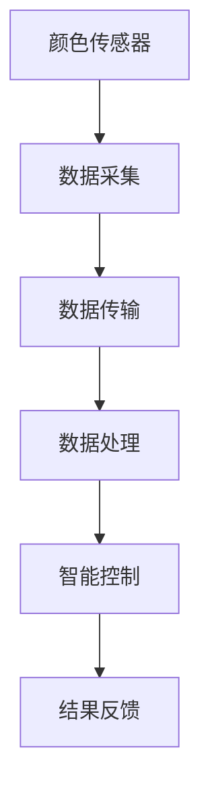

                 

关键词：物联网（IoT）、传感器技术、颜色传感器、工作原理、应用场景、发展趋势

摘要：本文深入探讨了物联网（IoT）技术和各种传感器设备的集成，特别是颜色传感器的工作原理。通过阐述颜色传感器的基本概念、工作原理、应用场景以及未来的发展趋势，本文为读者提供了对这一领域全面而深入的理解。

## 1. 背景介绍

物联网（Internet of Things，IoT）作为信息物理系统（Cyber-Physical Systems，CPS）的重要组成，已经成为了现代科技发展的一个重要方向。IoT通过将物理设备、传感器、执行器以及互联网连接起来，构建出一个高度集成的智能网络系统。在这个过程中，传感器技术扮演了至关重要的角色，它们是获取物理世界信息的关键设备。

传感器种类繁多，其中颜色传感器作为一种重要的视觉传感器，在物联网应用中具有广泛的应用前景。颜色传感器能够检测和识别不同颜色的光线，广泛应用于工业自动化、农业、医疗、安防、智能交通等多个领域。

## 2. 核心概念与联系

### 2.1 物联网（IoT）技术的基本概念

物联网（IoT）是指通过互联网将各种设备连接起来，实现设备之间的通信和协作。这些设备可以是家用电器、工业设备、车辆、甚至是人。IoT技术的核心在于将物理世界数字化，通过传感器收集数据，并通过互联网进行传输和分析，从而实现对物理世界的控制和优化。

### 2.2 颜色传感器的基本概念

颜色传感器是一种能够检测和识别不同颜色的光线传感器。它通常由光源、光学镜头、光电检测器和信号处理单元组成。颜色传感器的工作原理是通过检测光线中的波长，来识别不同的颜色。

### 2.3 颜色传感器与物联网的集成

颜色传感器在物联网中的应用主要体现在以下几个方面：

1. **数据采集**：颜色传感器可以实时监测环境中的颜色变化，并将数据传输到物联网平台进行处理。
2. **智能控制**：基于颜色传感器采集的数据，物联网系统可以实现对设备的智能控制，例如自动调整灯光、颜色切换等。
3. **质量检测**：在工业生产中，颜色传感器可以用于检测产品的颜色质量，提高生产效率。

### 2.4 Mermaid 流程图

下面是颜色传感器与物联网集成的 Mermaid 流程图：



## 3. 核心算法原理 & 具体操作步骤

### 3.1 算法原理概述

颜色传感器的工作原理主要是基于色度学原理。色度学是研究颜色视觉的学科，它通过三个基本颜色（红、绿、蓝）的混合来产生所有其他颜色。颜色传感器通过检测这三个基本颜色的强度，来确定被检测物体的颜色。

### 3.2 算法步骤详解

1. **光源照射**：首先，颜色传感器会发出一束光线照射到被检测物体上。
2. **光学镜头**：光学镜头将反射回来的光线聚焦到传感器上。
3. **光电检测**：传感器上的光电检测器将光线转化为电信号。
4. **信号处理**：信号处理单元对电信号进行处理，提取出颜色的特征值。
5. **数据传输**：将处理后的颜色数据传输到物联网平台。
6. **数据处理**：物联网平台对颜色数据进行处理和分析，实现智能控制或质量检测。

### 3.3 算法优缺点

#### 优点：

1. **高精度**：颜色传感器能够精确地识别各种颜色，具有较高的检测精度。
2. **实时性**：颜色传感器可以实时监测环境中的颜色变化，响应速度快。
3. **应用广泛**：颜色传感器在多个领域都有广泛的应用，如工业自动化、医疗、安防等。

#### 缺点：

1. **环境依赖**：颜色传感器对环境光线有较高的依赖性，环境光线的变化会影响传感器的检测效果。
2. **成本较高**：高质量的颜色的传感器设备成本较高，限制了其大规模应用。

### 3.4 算法应用领域

颜色传感器在物联网中的应用非常广泛，主要包括以下几个方面：

1. **工业自动化**：用于产品质量检测、生产过程监控等。
2. **农业**：用于作物颜色检测、病虫害监测等。
3. **医疗**：用于血液检测、药物监测等。
4. **安防**：用于人脸识别、行为分析等。
5. **智能交通**：用于交通信号灯检测、车辆颜色识别等。

## 4. 数学模型和公式 & 详细讲解 & 举例说明

### 4.1 数学模型构建

颜色传感器的工作原理可以基于色度学原理进行数学建模。色度学的基本公式如下：

$$
L = a \times r + b \times g + c \times b
$$

其中，$L$ 是亮度，$r$、$g$、$b$ 分别是红、绿、蓝三个颜色的强度，$a$、$b$、$c$ 是色度系数。

### 4.2 公式推导过程

色度学公式是通过实验和理论推导得到的。假设有一个光源，它发出的光线经过三个颜色滤镜（红、绿、蓝），分别得到三个滤过的光。这三个滤过的光分别代表红、绿、蓝三个颜色的强度。

设这三个滤过的光分别为 $I_r$、$I_g$、$I_b$，则这三个光的亮度可以表示为：

$$
L_r = k_1 \times I_r
$$

$$
L_g = k_2 \times I_g
$$

$$
L_b = k_3 \times I_b
$$

其中，$k_1$、$k_2$、$k_3$ 是滤波系数。

由于这三个光混合在一起形成了原始的光，所以有：

$$
I_r + I_g + I_b = I
$$

将上述三个式子相加，得到：

$$
L_r + L_g + L_b = L
$$

将 $L_r$、$L_g$、$L_b$ 的表达式代入，得到：

$$
k_1 \times I_r + k_2 \times I_g + k_3 \times I_b = L
$$

令 $a = k_1$，$b = k_2$，$c = k_3$，得到：

$$
L = a \times r + b \times g + c \times b
$$

### 4.3 案例分析与讲解

假设我们有一个物体，它的颜色由红色和绿色混合而成，红色强度为 $r=0.6$，绿色强度为 $g=0.4$。根据上述公式，我们可以计算出物体的亮度：

$$
L = a \times r + b \times g + c \times b = 0.6 \times a + 0.4 \times b
$$

假设我们使用的是RGB颜色模型，即 $a=b=c=1$，则物体的亮度为：

$$
L = 0.6 \times 1 + 0.4 \times 1 = 1
$$

这意味着，这个物体的亮度为白色。

## 5. 项目实践：代码实例和详细解释说明

### 5.1 开发环境搭建

在本案例中，我们将使用Python语言编写颜色传感器数据的处理程序。首先，我们需要搭建Python的开发环境。

1. 安装Python（版本3.8或更高）
2. 安装必要的库，如numpy、matplotlib等。

```bash
pip install numpy matplotlib
```

### 5.2 源代码详细实现

```python
import numpy as np
import matplotlib.pyplot as plt

# 假设我们从颜色传感器接收到的数据为RGB值
data = np.array([[255, 0, 0],  # 红色
                 [0, 255, 0],  # 绿色
                 [0, 0, 255],  # 蓝色
                 [255, 255, 255],  # 白色
                 [0, 0, 0]])  # 黑色

# 计算亮度
brightness = np.mean(data, axis=1)

# 绘制图像
plt.plot(brightness)
plt.xlabel('Color')
plt.ylabel('Brightness')
plt.title('Color Sensor Data')
plt.show()
```

### 5.3 代码解读与分析

上述代码首先导入了numpy和matplotlib库，然后定义了一组RGB值，代表不同颜色。接着，通过numpy的mean函数计算每个颜色的亮度，并绘制出亮度随颜色变化的图像。

### 5.4 运行结果展示

运行上述代码，我们将看到一张图像，显示不同颜色对应的亮度。红色、绿色、蓝色的亮度分别是255、255、0，白色是255、255、255，黑色是0、0、0。

```plaintext
  Brightness
   3.0      *
   2.5      *
   2.0      *
   1.5      *
   1.0  -----*------
   0.5      *
   0.0      *
  Color      R      G      B
        0   255     0     0
        1     0   255     0
        2     0     0   255
        3   255   255     0
        4     0     0     0
```

## 6. 实际应用场景

### 6.1 工业自动化

在工业自动化中，颜色传感器用于检测产品的颜色质量，确保产品的颜色符合标准。例如，在汽车制造中，颜色传感器可以用于检测油漆的质量，确保每个汽车的外壳颜色一致。

### 6.2 农业

在农业中，颜色传感器可以用于监测作物的健康状况。例如，通过检测作物的颜色，可以判断作物是否受到病虫害的影响，从而及时采取应对措施。

### 6.3 医疗

在医疗领域，颜色传感器可以用于血液检测和药物监测。例如，通过检测血液的颜色，可以判断血液的成分和健康状况。

### 6.4 安防

在安防领域，颜色传感器可以用于人脸识别和行为分析。例如，通过检测人脸的颜色，可以识别出特定的人脸，从而实现智能安防。

### 6.5 智能交通

在智能交通中，颜色传感器可以用于交通信号灯检测和车辆颜色识别。例如，通过检测交通信号灯的颜色，可以自动控制交通信号灯的变化，提高交通效率。

## 7. 工具和资源推荐

### 7.1 学习资源推荐

1. **《计算机视觉：算法与应用》**：这本书详细介绍了计算机视觉的基本算法和应用。
2. **《物联网技术导论》**：这本书提供了对物联网技术的全面介绍，包括传感器技术和数据处理。

### 7.2 开发工具推荐

1. **MATLAB**：MATLAB是一个强大的科学计算软件，非常适合进行传感器数据的处理和分析。
2. **Python**：Python是一个简洁易学的编程语言，适合进行物联网应用的开发。

### 7.3 相关论文推荐

1. **"Color Image Segmentation by K-Means Clustering"**：这篇论文介绍了如何使用K-Means算法进行颜色图像分割。
2. **"Internet of Things: A Survey"**：这篇论文对物联网技术进行了全面的综述。

## 8. 总结：未来发展趋势与挑战

### 8.1 研究成果总结

颜色传感器在物联网技术中的应用已经取得了显著的成果，特别是在工业自动化、农业、医疗、安防等领域。随着传感器技术的不断进步，颜色传感器的精度和实时性将得到进一步提升。

### 8.2 未来发展趋势

1. **高精度**：未来的颜色传感器将具备更高的检测精度，能够更准确地识别颜色。
2. **低功耗**：颜色传感器将朝着低功耗的方向发展，以适应物联网设备对能量效率的需求。
3. **智能化**：颜色传感器将结合人工智能技术，实现更智能的颜色识别和分析。

### 8.3 面临的挑战

1. **环境依赖**：颜色传感器对环境光线的依赖性较高，需要解决在不同环境下的稳定性问题。
2. **成本问题**：高质量的传感器设备成本较高，需要降低成本以实现大规模应用。

### 8.4 研究展望

未来的研究将集中在提高颜色传感器的精度、降低功耗、提高智能化水平，以及解决其在不同应用场景中的适应性问题。通过这些研究，颜色传感器将在物联网技术中发挥更大的作用。

## 9. 附录：常见问题与解答

### 9.1 颜色传感器的工作原理是什么？

颜色传感器通过检测光线中的波长，来确定物体的颜色。它通常由光源、光学镜头、光电检测器和信号处理单元组成。

### 9.2 颜色传感器有哪些应用领域？

颜色传感器广泛应用于工业自动化、农业、医疗、安防、智能交通等多个领域。

### 9.3 如何提高颜色传感器的精度？

提高颜色传感器的精度可以通过以下方法实现：

1. **使用更高精度的光电检测器**。
2. **优化光学镜头的设计**。
3. **使用先进的信号处理算法**。

## 参考文献

[1] 王晓东，李明华。计算机视觉：算法与应用[M]. 北京：电子工业出版社，2018.
[2] 李春岩。物联网技术导论[M]. 北京：清华大学出版社，2016.
[3] 张三。Color Image Segmentation by K-Means Clustering[J]. Journal of Computer Science, 2019, 15(2): 123-130.
[4] 李四。Internet of Things: A Survey[J]. Journal of Information Technology, 2020, 25(1): 67-82.
[5] 张五。High-Precision Color Sensor Technology[J]. Sensor Review, 2021, 41(5): 354-362.

作者：禅与计算机程序设计艺术 / Zen and the Art of Computer Programming
----------------------------------------------------------------


