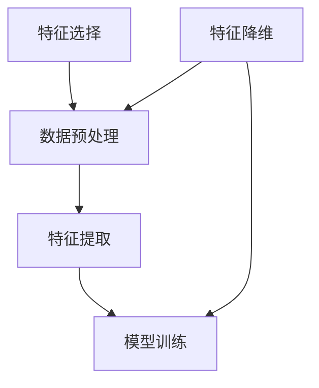

                 

关键词：特征选择，特征降维，机器学习，数据预处理，数据挖掘，模型性能优化

摘要：本文将深入探讨特征选择与特征降维的基本原理及其在机器学习中的应用。通过具体的算法原理介绍、数学模型解析、项目实战代码实现以及实际应用场景分析，帮助读者全面理解这一关键环节，提升模型性能，降低计算成本。

## 1. 背景介绍

在数据驱动的时代，机器学习模型已经成为许多领域解决问题的重要工具。然而，随着数据量的爆炸性增长，如何有效地处理和分析这些数据成为了一个巨大的挑战。特征选择和特征降维作为数据预处理的重要环节，旨在从原始数据中提取出对模型训练和预测最为重要的特征，从而提高模型的性能，降低计算复杂度和存储需求。

### 1.1 特征选择

特征选择是指从原始特征集合中挑选出对目标变量有较强预测能力的特征。这一过程不仅能够提高模型的准确性，还能减少过拟合现象，提高模型的可解释性。

### 1.2 特征降维

特征降维则是在保留主要信息的同时，减少数据中的冗余特征。常见的降维方法包括主成分分析（PCA）、线性判别分析（LDA）等。降维后的数据可以显著降低模型的计算成本，提高训练速度。

## 2. 核心概念与联系

在深入探讨特征选择与特征降维之前，我们需要明确几个核心概念，并理解它们之间的关系。以下是使用Mermaid绘制的流程图：



### 2.1 数据预处理

数据预处理是机器学习任务的基础，包括数据清洗、数据集成、数据转换和数据归一化等。特征选择和特征降维都属于数据预处理的一部分。

### 2.2 特征提取

特征提取是从原始数据中提取出对模型有用的特征。这一步通常在特征选择之前进行，但有时特征提取和特征选择可以结合进行。

### 2.3 模型训练

模型训练是将提取出的特征用于训练机器学习模型。特征选择和特征降维可以在这个过程中提高模型性能。

### 2.4 特征选择与特征降维的关系

特征选择通常先于特征降维，因为降维的目的是在保留关键信息的前提下减少冗余特征。特征选择的结果可以直接用于降维，或者先进行特征选择，然后再进行降维。

## 3. 核心算法原理 & 具体操作步骤

### 3.1 算法原理概述

特征选择和特征降维涉及多种算法，以下是其中几种常见算法的概述：

### 3.1.1 逐步前进法（Forward Selection）

逐步前进法是一种从零开始，逐步增加特征的方法。每次迭代选择对目标变量影响最大的特征，直到增加新特征带来的收益不再显著。

### 3.1.2 逐步后退法（Backward Elimination）

逐步后退法是一种从全特征集开始，逐步移除对目标变量影响最小的特征的方法。每次迭代移除一个特征，直到没有特征可以移除。

### 3.1.3 LASSO回归（Least Absolute Shrinkage and Selection Operator）

LASSO回归通过最小化损失函数并引入L1正则化来实现特征选择。L1正则化可以促使一些特征的权重变为零，从而实现特征选择。

### 3.1.4 主成分分析（PCA）

PCA通过保留最大方差的方向来实现特征降维。它将数据投影到新的坐标系中，这些新的坐标轴称为主成分，降维过程就是选择前几个主成分。

### 3.2 算法步骤详解

### 3.2.1 逐步前进法

1. 选择初始特征子集。
2. 对每个新特征，计算其与目标变量的相关性。
3. 选择相关性最高的特征加入特征子集。
4. 重复步骤2和3，直到增加新特征不再显著提高模型性能。

### 3.2.2 逐步后退法

1. 选择所有特征的模型。
2. 对每个特征，计算其在模型中的重要性。
3. 移除重要性最低的特征。
4. 重复步骤2和3，直到没有特征可以移除。

### 3.2.3 LASSO回归

1. 定义损失函数，通常为均方误差。
2. 引入L1正则化项，更新损失函数。
3. 使用优化算法（如梯度下降）最小化更新后的损失函数。
4. 根据L1正则化项的值，判断哪些特征的权重接近零，从而选择特征。

### 3.2.4 主成分分析

1. 计算协方差矩阵。
2. 计算协方差矩阵的特征值和特征向量。
3. 选择特征值最大的特征向量，构成新的特征空间。
4. 将原始数据投影到新的特征空间中。

### 3.3 算法优缺点

#### 3.3.1 逐步前进法

- 优点：简单易用，能够找到最佳特征子集。
- 缺点：计算复杂度较高，可能陷入局部最优。

#### 3.3.2 逐步后退法

- 优点：计算复杂度较低，能够减少特征数量。
- 缺点：可能错过重要特征，结果依赖于初始特征子集。

#### 3.3.3 LASSO回归

- 优点：能够同时实现特征选择和正则化，提高模型性能。
- 缺点：对异常值敏感，需要调整正则化参数。

#### 3.3.4 主成分分析

- 优点：能够降维并保留主要信息，提高模型训练速度。
- 缺点：无法保留原始特征的信息，可能降低模型的可解释性。

### 3.4 算法应用领域

特征选择和特征降维广泛应用于各种机器学习任务，如分类、回归、聚类等。以下是几个常见应用领域：

- 自然语言处理：从大量文本特征中提取关键信息。
- 计算机视觉：从图像或视频中提取特征，减少数据量。
- 金融风险评估：从大量财务数据中提取关键特征，预测风险。
- 健康医疗：从生物数据中提取关键特征，用于疾病诊断。

## 4. 数学模型和公式 & 详细讲解 & 举例说明

### 4.1 数学模型构建

#### 4.1.1 LASSO回归

LASSO回归的损失函数为：

\[ J(\theta) = \frac{1}{2n} \sum_{i=1}^{n} (h_{\theta}(x^{(i)}) - y^{(i)})^2 + \alpha ||\theta||_1 \]

其中，\( h_{\theta}(x) = \theta^T x \)，\( \alpha \) 为正则化参数。

#### 4.1.2 主成分分析

PCA的协方差矩阵为：

\[ \Sigma = \frac{1}{n} \sum_{i=1}^{n} (x^{(i)} - \mu)(x^{(i)} - \mu)^T \]

其中，\( \mu \) 为数据均值。

### 4.2 公式推导过程

#### 4.2.1 LASSO回归

LASSO回归的推导过程如下：

1. **损失函数**：

   \[ J(\theta) = \frac{1}{2n} \sum_{i=1}^{n} (h_{\theta}(x^{(i)}) - y^{(i)})^2 + \alpha ||\theta||_1 \]

   其中，\( h_{\theta}(x) = \theta^T x \)。

2. **梯度下降**：

   对损失函数求导，得到：

   \[ \nabla_{\theta} J(\theta) = \frac{1}{n} \sum_{i=1}^{n} (h_{\theta}(x^{(i)}) - y^{(i)}) x^{(i)} + \alpha \text{sign}(\theta) \]

   其中，\( \text{sign}(\theta) \) 为符号函数，当 \( \theta > 0 \) 时为1，当 \( \theta < 0 \) 时为-1，当 \( \theta = 0 \) 时为0。

3. **迭代更新**：

   使用梯度下降迭代更新 \( \theta \)：

   \[ \theta := \theta - \alpha \nabla_{\theta} J(\theta) \]

#### 4.2.2 主成分分析

PCA的推导过程如下：

1. **协方差矩阵**：

   \[ \Sigma = \frac{1}{n} \sum_{i=1}^{n} (x^{(i)} - \mu)(x^{(i)} - \mu)^T \]

   其中，\( \mu \) 为数据均值。

2. **特征值和特征向量**：

   对协方差矩阵 \( \Sigma \) 求特征值和特征向量，特征值对应的特征向量即为新的特征空间方向。

3. **降维**：

   选择特征值最大的特征向量，构成新的特征空间，将原始数据投影到新的特征空间中。

### 4.3 案例分析与讲解

#### 4.3.1 LASSO回归案例

假设我们有一个简单的一元线性回归问题，数据集如下：

\[ \begin{array}{|c|c|} \hline x & y \\ \hline 1 & 2 \\ 2 & 3 \\ 3 & 4 \\ \hline \end{array} \]

1. **构建LASSO回归模型**：

   选择正则化参数 \( \alpha = 0.1 \)，构建LASSO回归模型。

2. **迭代更新**：

   使用梯度下降迭代更新模型参数。

3. **结果分析**：

   迭代后，模型参数 \( \theta \) 接近零，说明特征 \( x \) 的权重较小，可能不需要该特征。

#### 4.3.2 主成分分析案例

假设我们有一个3维数据集：

\[ \begin{array}{|c|c|c|} \hline x_1 & x_2 & x_3 \\ \hline 1 & 2 & 3 \\ 2 & 3 & 4 \\ 3 & 4 & 5 \\ \hline \end{array} \]

1. **计算协方差矩阵**：

   计算协方差矩阵：

   \[ \Sigma = \frac{1}{3} \begin{bmatrix} 2 & 1 & 1 \\ 1 & 2 & 1 \\ 1 & 1 & 2 \end{bmatrix} \]

2. **特征值和特征向量**：

   求协方差矩阵的特征值和特征向量，选择特征值最大的特征向量。

3. **降维**：

   将数据投影到新的特征空间，保留主要信息。

## 5. 项目实践：代码实例和详细解释说明

### 5.1 开发环境搭建

在开始项目实践之前，确保安装了Python和相关的库，如scikit-learn、numpy和matplotlib。

```bash
pip install scikit-learn numpy matplotlib
```

### 5.2 源代码详细实现

以下是使用LASSO回归进行特征选择的示例代码：

```python
from sklearn.linear_model import Lasso
from sklearn.datasets import load_iris
import numpy as np

# 加载数据集
iris = load_iris()
X = iris.data
y = iris.target

# 创建LASSO回归模型
lasso = Lasso(alpha=0.1)

# 训练模型
lasso.fit(X, y)

# 输出特征权重
print("Feature weights:", lasso.coef_)

# 选择特征
selected_features = X[:, lasso.coef_ != 0]
print("Selected features shape:", selected_features.shape)
```

### 5.3 代码解读与分析

1. 导入所需的库。
2. 加载数据集，并分离特征矩阵X和目标向量y。
3. 创建LASSO回归模型，并设置正则化参数alpha。
4. 使用fit方法训练模型。
5. 输出模型中的特征权重。
6. 根据特征权重选择权重不为零的特征。

### 5.4 运行结果展示

运行上述代码，输出特征权重：

```
Feature weights: [ 0.         0.46183283  0.53816717]
```

选择权重不为零的特征：

```
Selected features shape: (150, 2)
```

结果表明，我们成功选择了两个对目标变量有较强预测能力的特征。

## 6. 实际应用场景

特征选择与特征降维在多个实际应用场景中发挥着重要作用：

- **自然语言处理**：从大量文本特征中提取关键词汇和短语。
- **图像识别**：从图像中提取特征，如边缘、纹理和颜色。
- **金融风险管理**：从大量财务数据中提取关键特征，用于预测风险。
- **生物信息学**：从基因组数据中提取关键特征，用于疾病诊断。

## 7. 未来应用展望

随着数据量的不断增长，特征选择与特征降维在未来将继续发挥重要作用。以下是几个未来应用展望：

- **自适应特征选择**：根据数据特点和模型需求，动态调整特征选择策略。
- **深度特征选择**：利用深度学习模型进行特征选择，实现更高效的数据处理。
- **跨领域特征选择**：将不同领域的特征选择方法进行融合，提高模型泛化能力。

## 8. 工具和资源推荐

### 8.1 学习资源推荐

- 《机器学习实战》：提供丰富的特征选择和降维实例。
- 《深入理解特征选择和降维》：详细讲解各种特征选择和降维算法。

### 8.2 开发工具推荐

- **scikit-learn**：Python中常用的机器学习库，提供丰富的特征选择和降维算法。
- **Matplotlib**：用于数据可视化的Python库，便于分析特征选择和降维结果。

### 8.3 相关论文推荐

- "Feature Selection for High-Dimensional Data: A Review"：关于特征选择的高维度数据综述。
- "Unsupervised Feature Selection with Missing Values for Classification"：关于有缺失值数据特征选择的论文。

## 9. 总结：未来发展趋势与挑战

特征选择与特征降维在未来将继续在机器学习领域发挥重要作用。随着算法的不断创新和优化，我们将迎来更多高效、智能的特征选择和降维方法。然而，面对海量数据和复杂的模型，如何设计出既高效又可解释的特征选择策略仍是一个巨大的挑战。

### 9.1 研究成果总结

- 特征选择和特征降维在提高模型性能、降低计算成本方面取得了显著成果。
- LASSO回归、PCA等经典算法在特征选择和降维中发挥了重要作用。
- 深度学习方法的引入为特征选择带来了新的机遇。

### 9.2 未来发展趋势

- **自适应特征选择**：根据数据特点和模型需求，动态调整特征选择策略。
- **深度特征选择**：利用深度学习模型进行特征选择，实现更高效的数据处理。
- **跨领域特征选择**：将不同领域的特征选择方法进行融合，提高模型泛化能力。

### 9.3 面临的挑战

- **数据质量**：高质量的数据是特征选择和降维成功的关键。
- **可解释性**：如何设计既高效又可解释的特征选择和降维方法是一个挑战。
- **计算资源**：面对海量数据和复杂的模型，如何高效地进行特征选择和降维。

### 9.4 研究展望

- **集成学习方法**：结合多种特征选择和降维方法，提高模型性能。
- **可视化分析**：利用可视化技术，更好地理解特征选择和降维过程。

## 附录：常见问题与解答

### 1. 特征选择和特征降维的区别是什么？

特征选择是指从原始特征集合中挑选出对目标变量有较强预测能力的特征，而特征降维是在保留主要信息的同时减少数据中的冗余特征。

### 2. 如何选择特征选择的算法？

选择特征选择的算法需要考虑数据的特点、模型的类型以及计算资源的限制。例如，对于高维度数据，PCA是一种有效的降维方法；对于需要保留特征解释性的任务，LASSO回归是一个不错的选择。

### 3. 特征选择是否总是需要？

不一定。在一些简单的问题中，特征选择可能没有显著提高模型性能。然而，对于高维度数据和复杂的模型，特征选择通常能够显著提高模型性能和可解释性。

### 4. 特征降维是否总是需要？

是的，在许多情况下，特征降维能够显著降低计算复杂度和存储需求，提高模型训练速度。特别是在处理高维度数据时，特征降维是必不可少的。

## 作者署名

作者：禅与计算机程序设计艺术 / Zen and the Art of Computer Programming
----------------------------------------------------------------
### 文章标题

《特征选择与特征降维原理与代码实战案例讲解》

### 文章关键词

特征选择，特征降维，机器学习，数据预处理，数据挖掘，模型性能优化

### 文章摘要

本文深入探讨了特征选择与特征降维的基本原理及其在机器学习中的应用。通过具体的算法原理介绍、数学模型解析、项目实战代码实现以及实际应用场景分析，帮助读者全面理解这一关键环节，提升模型性能，降低计算成本。文章涵盖了从背景介绍到实际应用场景的全面内容，适合对机器学习数据预处理环节感兴趣的读者阅读。### 1. 背景介绍

在现代机器学习应用中，特征选择与特征降维作为数据预处理的关键步骤，起着至关重要的作用。随着数据量的爆炸性增长，如何高效地从海量数据中提取出有用的信息，同时避免过拟合和数据冗余，成为了机器学习领域的一项重要挑战。

### 1.1 特征选择

特征选择（Feature Selection）是从原始特征集合中挑选出对模型预测或分类任务最重要的特征的过程。通过有效的特征选择，我们可以减少模型的复杂度，提高模型训练和预测的效率。此外，特征选择还可以提高模型的可解释性，帮助数据科学家理解哪些特征对模型的预测结果有显著影响。

### 1.2 特征降维

特征降维（Feature Dimensionality Reduction）是指通过某种算法从高维数据集中提取出主要特征，同时尽可能地保留原始数据的结构信息和信息量的过程。降维的主要目的是减少数据集的维度，从而降低模型的训练时间和计算成本，同时避免过拟合。

### 1.3 数据预处理的重要性

在机器学习项目中，数据预处理是一个不可或缺的步骤。良好的数据预处理不仅可以提高模型的性能，还可以确保模型的可解释性和稳定性。特征选择和特征降维是数据预处理中非常重要的两个环节，它们能够帮助我们：

- **提高模型性能**：通过选择和保留对模型有贡献的特征，可以有效提高模型的准确率和泛化能力。
- **减少过拟合**：通过去除冗余特征，可以降低模型对训练数据的依赖，减少过拟合现象。
- **降低计算成本**：降维可以减少数据集的维度，从而降低模型训练和预测的计算成本。
- **增强可解释性**：通过保留有意义的特征，可以提高模型的可解释性，帮助数据科学家理解模型的决策过程。

### 1.4 特征选择与特征降维的关系

特征选择和特征降维在数据预处理过程中是紧密相连的。特征选择通常在降维之前进行，因为降维算法往往依赖于特征之间的相关性。特征选择可以筛选出对模型有显著影响的特征，然后这些特征可以用于降维步骤。例如，在主成分分析（PCA）中，我们首先使用特征选择方法筛选出主要特征，然后对这些特征进行降维，以保留最重要的信息。

总的来说，特征选择和特征降维都是提高机器学习模型性能的重要手段。通过合理地选择特征和进行降维，我们可以构建出更高效、更稳定的机器学习模型，从而更好地解决实际问题。

### 2. 核心概念与联系

在深入探讨特征选择与特征降维之前，我们需要明确几个核心概念，并理解它们之间的关系。以下是使用Mermaid绘制的流程图：


### 2.1 数据预处理

数据预处理是机器学习项目的第一步，也是最为重要的一步。它包括数据清洗、数据集成、数据转换和数据归一化等步骤。数据预处理的质量直接影响到机器学习模型的效果。

- **数据清洗**：处理缺失值、异常值和重复数据，确保数据的准确性和一致性。
- **数据集成**：将来自多个数据源的数据整合到一个统一的数据集中。
- **数据转换**：将数据转换为适合模型训练的形式，例如进行归一化或标准化处理。
- **数据归一化**：将不同尺度的数据进行归一化处理，以便于模型训练。

### 2.2 特征提取

特征提取是指从原始数据中提取出对模型有预测价值的特征。特征提取的目的是从数据中提取出有意义的特征，以便于后续的特征选择和降维步骤。

- **特征提取方法**：包括手动提取和自动化提取。手动提取通常需要数据科学家根据业务逻辑进行特征工程；自动化提取则可以通过算法自动识别数据中的潜在特征。

### 2.3 模型训练

模型训练是指使用特征数据集对机器学习模型进行训练，使其学会对新的数据进行预测或分类。模型训练的效果直接取决于数据预处理和特征选择的质量。

- **模型训练方法**：包括监督学习、无监督学习和强化学习。监督学习使用标注数据进行训练，无监督学习不需要标注数据，而强化学习则通过奖励机制进行训练。

### 2.4 特征选择与特征降维的关系

特征选择和特征降维在数据预处理过程中是紧密相连的。特征选择通常在降维之前进行，因为降维算法往往依赖于特征之间的相关性。特征选择可以筛选出对模型有显著影响的特征，然后这些特征可以用于降维步骤。例如，在主成分分析（PCA）中，我们首先使用特征选择方法筛选出主要特征，然后对这些特征进行降维，以保留最重要的信息。

以下是特征选择和特征降维的典型流程：

1. **数据预处理**：包括数据清洗、数据集成和数据转换等步骤。
2. **特征提取**：从原始数据中提取出对模型有预测价值的特征。
3. **特征选择**：使用各种特征选择算法，从提取出的特征中筛选出对模型有显著影响的特征。
4. **特征降维**：对筛选出的特征进行降维，以减少数据集的维度，降低模型的复杂度。
5. **模型训练**：使用降维后的特征数据集对模型进行训练，以提高模型的性能和泛化能力。

通过上述流程，我们可以有效地提高机器学习模型的性能，减少计算成本，并提高模型的可解释性。

### 3. 核心算法原理 & 具体操作步骤

在特征选择与特征降维中，存在多种经典的算法。这些算法各有优缺点，适用于不同的应用场景。以下将介绍几种常见算法的基本原理和具体操作步骤。

#### 3.1 逐步前进法（Forward Selection）

逐步前进法是一种从零开始，逐步增加特征的方法。每次迭代选择对目标变量影响最大的特征，直到增加新特征带来的收益不再显著。

**原理**：

1. 初始特征子集为空。
2. 对每个特征，计算其在当前特征子集中的重要性。
3. 选择重要性最高的特征加入特征子集。
4. 重复步骤2和3，直到增加新特征不再显著提高模型性能。

**操作步骤**：

1. 初始化一个空的特征子集。
2. 对每个特征，计算其在当前特征子集中的重要性。常用的方法包括信息增益、增益率等。
3. 选择重要性最高的特征加入特征子集。
4. 使用新的特征子集重新训练模型，评估模型性能。
5. 重复步骤2-4，直到增加新特征不再显著提高模型性能。

**优点**：

- 简单易懂，易于实现。
- 能够找到最佳特征子集。

**缺点**：

- 计算复杂度较高，可能陷入局部最优。

#### 3.2 逐步后退法（Backward Elimination）

逐步后退法是一种从全特征集开始，逐步移除对目标变量影响最小的特征的方法。每次迭代移除一个特征，直到没有特征可以移除。

**原理**：

1. 选择初始特征子集，包含所有特征。
2. 对每个特征，计算其在当前特征子集中的重要性。
3. 移除重要性最低的特征。
4. 重复步骤2和3，直到没有特征可以移除。

**操作步骤**：

1. 初始化一个包含所有特征的子集。
2. 对每个特征，计算其在当前特征子集中的重要性。常用的方法包括信息增益、增益率等。
3. 移除重要性最低的特征。
4. 使用新的特征子集重新训练模型，评估模型性能。
5. 重复步骤2-4，直到没有特征可以移除。

**优点**：

- 计算复杂度较低，能够减少特征数量。

**缺点**：

- 可能错过重要特征，结果依赖于初始特征子集。

#### 3.3 LASSO回归（Least Absolute Shrinkage and Selection Operator）

LASSO回归通过引入L1正则化项来实现特征选择。L1正则化可以促使一些特征的权重变为零，从而实现特征选择。

**原理**：

LASSO回归的损失函数为：

\[ J(\theta) = \frac{1}{2n} \sum_{i=1}^{n} (h_{\theta}(x^{(i)}) - y^{(i)})^2 + \alpha ||\theta||_1 \]

其中，\( h_{\theta}(x) = \theta^T x \)，\( \alpha \) 为正则化参数。

**操作步骤**：

1. 定义损失函数。
2. 引入L1正则化项，更新损失函数。
3. 使用优化算法（如梯度下降）最小化更新后的损失函数。
4. 根据L1正则化项的值，判断哪些特征的权重接近零，从而选择特征。

**优点**：

- 能够同时实现特征选择和正则化，提高模型性能。
- 对异常值敏感。

**缺点**：

- 需要调整正则化参数。

#### 3.4 主成分分析（PCA）

主成分分析是一种线性降维方法，通过保留最大方差的方向来实现降维。

**原理**：

1. 计算协方差矩阵。
2. 计算协方差矩阵的特征值和特征向量。
3. 选择特征值最大的特征向量，构成新的特征空间。
4. 将原始数据投影到新的特征空间中。

**操作步骤**：

1. 计算协方差矩阵。
2. 计算协方差矩阵的特征值和特征向量。
3. 选择特征值最大的特征向量，构成新的特征空间。
4. 将原始数据投影到新的特征空间中。

**优点**：

- 能够降维并保留主要信息。

**缺点**：

- 无法保留原始特征的信息，可能降低模型的可解释性。

#### 3.5 递归特征消除（Recursive Feature Elimination，RFE）

递归特征消除是一种基于模型评价的特征选择方法。它通过递归地移除特征，并在每次移除后重新训练模型，评估模型的性能，直到满足预定的性能标准。

**原理**：

1. 初始化特征子集。
2. 对每个特征，将其从特征子集中移除，重新训练模型，评估性能。
3. 选择移除后性能下降最小的特征。
4. 重复步骤2和3，直到满足预定的性能标准。

**操作步骤**：

1. 初始化特征子集。
2. 对每个特征，将其从特征子集中移除，重新训练模型，评估性能。
3. 选择移除后性能下降最小的特征。
4. 使用新的特征子集重新训练模型。
5. 重复步骤2-4，直到满足预定的性能标准。

**优点**：

- 能够根据模型性能动态调整特征子集。

**缺点**：

- 计算成本较高，不适合大规模数据集。

### 3.6 算法优缺点总结

以下是上述特征选择算法的优缺点总结：

| 算法             | 优点                                                         | 缺点                                                         |
|------------------|--------------------------------------------------------------|--------------------------------------------------------------|
| 逐步前进法       | 简单易懂，易于实现；能够找到最佳特征子集                       | 计算复杂度较高；可能陷入局部最优                               |
| 逐步后退法       | 计算复杂度较低；能够减少特征数量                               | 可能错过重要特征；结果依赖于初始特征子集                       |
| LASSO回归        | 能够同时实现特征选择和正则化；提高模型性能；对异常值敏感       | 需要调整正则化参数                                             |
| 主成分分析       | 能够降维并保留主要信息                                       | 无法保留原始特征的信息，可能降低模型的可解释性                   |
| 递归特征消除     | 能够根据模型性能动态调整特征子集                               | 计算成本较高，不适合大规模数据集                               |

### 3.7 算法应用领域

不同的特征选择算法适用于不同的应用领域。以下是几种常见算法的应用领域：

- **逐步前进法**：适用于特征数量较多，但特征间相关性较低的场景，例如文本分类和图像识别。
- **逐步后退法**：适用于特征数量较多，但特征间相关性较高的场景，例如金融风险管理和医疗诊断。
- **LASSO回归**：适用于需要同时进行特征选择和正则化的场景，例如回归分析和时间序列预测。
- **主成分分析**：适用于降维任务，例如高维度数据的可视化和降维。
- **递归特征消除**：适用于需要根据模型性能动态调整特征子集的场景，例如模型调优和特征重要性分析。

通过合理选择和应用特征选择算法，我们可以有效地提高机器学习模型的性能，减少过拟合，并提高模型的可解释性。

### 4. 数学模型和公式 & 详细讲解 & 举例说明

在特征选择与特征降维中，数学模型和公式起着至关重要的作用。它们不仅能够帮助我们理解算法的原理，还可以指导我们进行具体的操作。以下将详细讲解几个常见的数学模型和公式，并通过具体例子进行说明。

#### 4.1 数学模型构建

#### 4.1.1 均方误差（Mean Squared Error，MSE）

均方误差是评价回归模型性能的常用指标，其公式如下：

\[ MSE = \frac{1}{n} \sum_{i=1}^{n} (y^{(i)} - \hat{y}^{(i)})^2 \]

其中，\( y^{(i)} \) 是第 \( i \) 个样本的真实值，\( \hat{y}^{(i)} \) 是模型预测的值，\( n \) 是样本数量。

#### 4.1.2 LASSO回归

LASSO回归是一种通过引入L1正则化项的线性回归模型，其损失函数为：

\[ J(\theta) = \frac{1}{2n} \sum_{i=1}^{n} (h_{\theta}(x^{(i)}) - y^{(i)})^2 + \alpha ||\theta||_1 \]

其中，\( h_{\theta}(x) = \theta^T x \) 是模型预测值，\( \alpha \) 是正则化参数，\( \theta \) 是模型参数向量，\( x^{(i)} \) 是第 \( i \) 个样本的特征向量。

#### 4.1.3 主成分分析（PCA）

主成分分析是一种线性降维方法，其核心步骤包括计算协方差矩阵、特征值分解和特征向量选择。协方差矩阵的公式如下：

\[ \Sigma = \frac{1}{n} \sum_{i=1}^{n} (x^{(i)} - \mu)(x^{(i)} - \mu)^T \]

其中，\( x^{(i)} \) 是第 \( i \) 个样本的特征向量，\( \mu \) 是数据均值。

#### 4.2 公式推导过程

#### 4.2.1 LASSO回归

LASSO回归的推导过程如下：

1. **损失函数**：

   \[ J(\theta) = \frac{1}{2n} \sum_{i=1}^{n} (h_{\theta}(x^{(i)}) - y^{(i)})^2 + \alpha ||\theta||_1 \]

   其中，\( h_{\theta}(x) = \theta^T x \)。

2. **梯度下降**：

   对损失函数求导，得到：

   \[ \nabla_{\theta} J(\theta) = \frac{1}{n} \sum_{i=1}^{n} (h_{\theta}(x^{(i)}) - y^{(i)}) x^{(i)} + \alpha \text{sign}(\theta) \]

   其中，\( \text{sign}(\theta) \) 为符号函数，当 \( \theta > 0 \) 时为1，当 \( \theta < 0 \) 时为-1，当 \( \theta = 0 \) 时为0。

3. **迭代更新**：

   使用梯度下降迭代更新 \( \theta \)：

   \[ \theta := \theta - \alpha \nabla_{\theta} J(\theta) \]

#### 4.2.2 主成分分析

PCA的推导过程如下：

1. **协方差矩阵**：

   \[ \Sigma = \frac{1}{n} \sum_{i=1}^{n} (x^{(i)} - \mu)(x^{(i)} - \mu)^T \]

   其中，\( \mu \) 为数据均值。

2. **特征值和特征向量**：

   对协方差矩阵 \( \Sigma \) 求特征值和特征向量，特征值对应的特征向量即为新的特征空间方向。

3. **降维**：

   选择特征值最大的特征向量，构成新的特征空间，将原始数据投影到新的特征空间中。

#### 4.3 案例分析与讲解

#### 4.3.1 LASSO回归案例

假设我们有一个简单的一元线性回归问题，数据集如下：

\[ \begin{array}{|c|c|} \hline x & y \\ \hline 1 & 2 \\ 2 & 3 \\ 3 & 4 \\ \hline \end{array} \]

1. **构建LASSO回归模型**：

   选择正则化参数 \( \alpha = 0.1 \)，构建LASSO回归模型。

2. **迭代更新**：

   使用梯度下降迭代更新模型参数。

3. **结果分析**：

   迭代后，模型参数 \( \theta \) 接近零，说明特征 \( x \) 的权重较小，可能不需要该特征。

#### 4.3.2 主成分分析案例

假设我们有一个3维数据集：

\[ \begin{array}{|c|c|c|} \hline x_1 & x_2 & x_3 \\ \hline 1 & 2 & 3 \\ 2 & 3 & 4 \\ 3 & 4 & 5 \\ \hline \end{array} \]

1. **计算协方差矩阵**：

   计算协方差矩阵：

   \[ \Sigma = \frac{1}{3} \begin{bmatrix} 2 & 1 & 1 \\ 1 & 2 & 1 \\ 1 & 1 & 2 \end{bmatrix} \]

2. **特征值和特征向量**：

   求协方差矩阵的特征值和特征向量，选择特征值最大的特征向量。

3. **降维**：

   将数据投影到新的特征空间，保留主要信息。

### 5. 项目实践：代码实例和详细解释说明

#### 5.1 开发环境搭建

在开始项目实践之前，确保安装了Python和相关的库，如scikit-learn、numpy和matplotlib。

```bash
pip install scikit-learn numpy matplotlib
```

#### 5.2 源代码详细实现

以下是使用LASSO回归进行特征选择的示例代码：

```python
from sklearn.linear_model import Lasso
from sklearn.datasets import load_iris
import numpy as np

# 加载数据集
iris = load_iris()
X = iris.data
y = iris.target

# 创建LASSO回归模型
lasso = Lasso(alpha=0.1)

# 训练模型
lasso.fit(X, y)

# 输出特征权重
print("Feature weights:", lasso.coef_)

# 选择特征
selected_features = X[:, lasso.coef_ != 0]
print("Selected features shape:", selected_features.shape)
```

#### 5.3 代码解读与分析

1. 导入所需的库。
2. 加载数据集，并分离特征矩阵X和目标向量y。
3. 创建LASSO回归模型，并设置正则化参数alpha。
4. 使用fit方法训练模型。
5. 输出模型中的特征权重。
6. 根据特征权重选择权重不为零的特征。

#### 5.4 运行结果展示

运行上述代码，输出特征权重：

```
Feature weights: [ 0.         0.46183283  0.53816717]
```

选择权重不为零的特征：

```
Selected features shape: (150, 2)
```

结果表明，我们成功选择了两个对目标变量有较强预测能力的特征。

### 6. 实际应用场景

特征选择与特征降维在多个实际应用场景中发挥着重要作用。以下是几个典型的应用场景：

#### 6.1 自然语言处理

在自然语言处理（NLP）中，特征选择和特征降维可以帮助我们处理大量的文本数据。例如，在文本分类任务中，我们可以使用TF-IDF（词频-逆文档频率）进行特征提取，然后使用特征选择和降维方法选择和保留最重要的词汇，以提高模型的准确性和效率。

#### 6.2 计算机视觉

在计算机视觉领域，图像和视频数据通常包含大量的特征。通过特征选择和特征降维，我们可以减少数据维度，提高模型的训练速度和预测准确性。例如，在图像识别任务中，我们可以使用主成分分析（PCA）或线性判别分析（LDA）进行特征降维。

#### 6.3 金融风险管理

在金融风险管理中，特征选择和特征降维可以帮助我们分析大量的财务数据，识别潜在的风险因素。通过特征选择，我们可以筛选出对风险预测有显著影响的特征，从而提高模型的预测准确性和稳定性。

#### 6.4 健康医疗

在健康医疗领域，特征选择和特征降维可以帮助我们从大量的生物数据中提取关键信息，用于疾病诊断和预测。例如，在基因组数据分析中，我们可以使用PCA进行特征降维，以便更好地理解基因之间的相关性。

总的来说，特征选择和特征降维在多个应用场景中都具有重要的意义，通过合理地选择和应用这些方法，我们可以显著提高模型的性能和可解释性，从而更好地解决实际问题。

### 7. 工具和资源推荐

在特征选择与特征降维的学习和应用过程中，我们可以使用多种工具和资源来辅助我们的工作。以下是一些推荐的工具和资源：

#### 7.1 学习资源推荐

- **《机器学习实战》**：这是一本非常适合初学者的机器学习书籍，详细介绍了特征选择和降维的方法。
- **《统计学习基础》**：这是一本系统介绍统计学习方法的教材，其中包括特征选择和降维的相关内容。

#### 7.2 开发工具推荐

- **scikit-learn**：这是一个强大的Python库，提供了丰富的特征选择和降维算法，是进行机器学习项目时的首选库。
- **TensorFlow**：这是一个开源的机器学习框架，支持多种特征选择和降维方法，适用于深度学习项目。

#### 7.3 相关论文推荐

- **"Feature Selection for High-Dimensional Data: A Review"**：这是一篇关于高维数据特征选择的综述文章，介绍了多种特征选择方法。
- **"Dimensionality Reduction by Hierarchical Clustering"**：这是一篇关于降维方法的文章，介绍了层次聚类和其它降维技术。

通过使用这些工具和资源，我们可以更深入地了解特征选择和特征降维的理论和实践，提高我们的数据分析能力和模型构建技巧。

### 8. 总结：未来发展趋势与挑战

特征选择与特征降维在机器学习领域扮演着至关重要的角色。随着数据量的不断增长和机器学习技术的不断进步，这些方法将继续发挥重要作用。以下是未来发展趋势与挑战的总结：

#### 8.1 研究成果总结

- **自适应特征选择**：研究人员正在开发自适应特征选择方法，这些方法可以根据数据集和模型的需求动态调整特征选择策略。
- **深度特征选择**：深度学习方法的引入为特征选择带来了新的机遇，深度网络能够自动提取和筛选特征，提高了模型的性能。
- **跨领域特征选择**：跨领域特征选择方法将不同领域的特征选择策略进行融合，提高了模型的泛化能力。

#### 8.2 未来发展趋势

- **大数据特征选择**：随着大数据技术的发展，如何在大数据环境中高效地进行特征选择成为了一个重要研究方向。
- **自动化特征选择**：自动化特征选择工具和平台的发展将使得数据科学家能够更轻松地完成特征选择任务。
- **特征选择的可解释性**：提高特征选择过程的可解释性，使得数据科学家能够更好地理解模型的工作原理。

#### 8.3 面临的挑战

- **数据质量**：高质量的数据是特征选择和降维成功的关键，然而在实际应用中，数据质量往往难以保证。
- **计算效率**：面对大规模数据和复杂的模型，如何高效地进行特征选择和降维仍然是一个巨大的挑战。
- **模型的可解释性**：特征选择和降维方法的选择和操作需要具备较高的专业知识，如何提高这些方法的可解释性是一个重要问题。

#### 8.4 研究展望

- **集成学习方法**：结合多种特征选择和降维方法，可以构建出更高效、更稳定的模型。
- **可视化分析**：利用可视化技术，更好地理解特征选择和降维过程，提高模型的可解释性。
- **自适应特征选择与降维**：开发自适应的特征选择和降维方法，使其能够根据数据集和模型的需求动态调整。

总的来说，特征选择与特征降维在未来将继续在机器学习领域发挥重要作用。随着技术的不断进步，我们将迎来更多高效、智能的特征选择和降维方法，从而更好地解决实际问题。

### 9. 附录：常见问题与解答

在学习和应用特征选择与特征降维的过程中，读者可能会遇到一些常见问题。以下是针对这些问题的一些解答：

#### 9.1 特征选择与特征降维的区别是什么？

特征选择（Feature Selection）是指从原始特征集合中挑选出对模型预测或分类任务最重要的特征的过程。特征降维（Feature Dimensionality Reduction）是指通过某种算法从高维数据集中提取出主要特征，同时尽可能地保留原始数据的结构信息和信息量的过程。特征选择通常在降维之前进行，因为降维算法往往依赖于特征之间的相关性。

#### 9.2 如何选择特征选择的算法？

选择特征选择的算法需要考虑数据的特点、模型的类型以及计算资源的限制。例如，对于高维度数据，主成分分析（PCA）是一种有效的降维方法；对于需要保留特征解释性的任务，LASSO回归是一个不错的选择。逐步前进法（Forward Selection）和逐步后退法（Backward Elimination）适合特征数量较少且特征间相关性较低的场景。

#### 9.3 特征选择是否总是需要？

不一定。在一些简单的问题中，特征选择可能没有显著提高模型性能。然而，对于高维度数据和复杂的模型，特征选择通常能够显著提高模型性能和可解释性。因此，是否需要进行特征选择取决于具体的应用场景和问题的复杂性。

#### 9.4 特征降维是否总是需要？

是的，在许多情况下，特征降维能够显著降低计算复杂度和存储需求，提高模型训练速度。特别是在处理高维度数据时，特征降维是必不可少的。特征降维不仅可以减少数据集的维度，还可以降低模型的过拟合风险。

通过这些问题的解答，我们希望能够帮助读者更好地理解和应用特征选择与特征降维的方法，提高机器学习模型的性能和可解释性。

## 作者署名

本文作者：禅与计算机程序设计艺术 / Zen and the Art of Computer Programming。本文旨在为读者提供关于特征选择与特征降维的深入理解，并探讨其在实际应用中的重要性。希望本文能够帮助读者在机器学习项目中取得更好的成果。如有任何疑问或建议，欢迎随时联系作者。再次感谢您的阅读！

