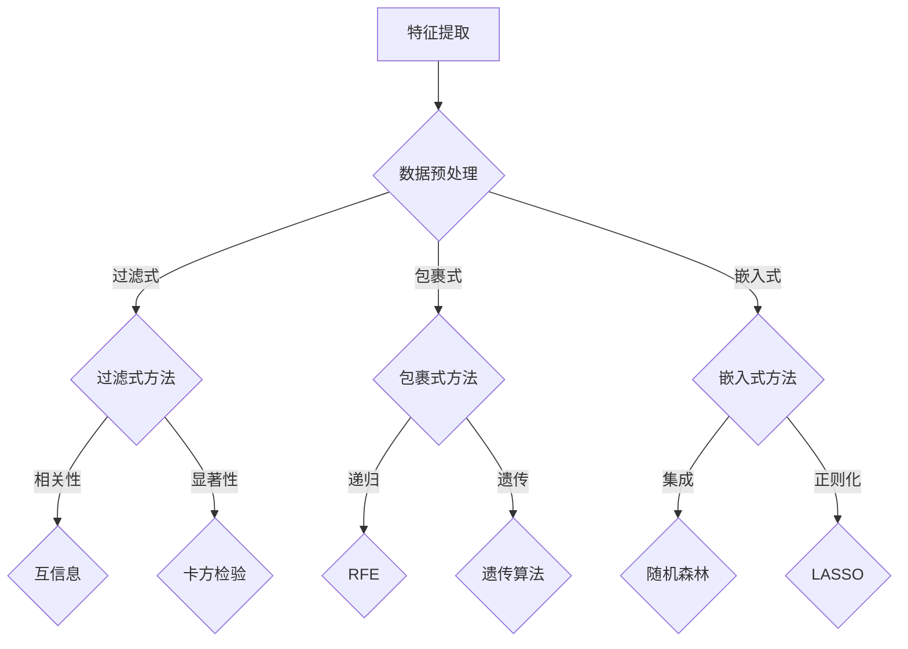

                 

特征选择（Feature Selection）是机器学习领域中的一个重要步骤，其目的是从原始特征集合中挑选出对模型性能有显著贡献的特征，从而降低模型复杂度、提高模型泛化能力。本文将详细探讨特征选择的原理，并通过代码实例来讲解如何在实际项目中应用这些原理。

## 文章关键词

- 特征选择
- 机器学习
- 特征提取
- 特征重要性
- 数据预处理

## 文章摘要

本文首先介绍了特征选择的重要性，然后详细阐述了特征选择的几种常见方法，包括过滤式、包裹式和嵌入式方法。接着，我们通过一个实际项目案例，展示了如何使用Python和Scikit-learn库进行特征选择。最后，文章讨论了特征选择在实际应用中的挑战和未来发展。

## 1. 背景介绍

### 特征选择的重要性

特征选择是机器学习中的一个关键步骤，对于提高模型性能和降低模型复杂度具有重要意义。在不进行特征选择的情况下，机器学习模型可能会变得过于复杂，从而导致过拟合。特征选择有助于提高模型的泛化能力，使其在未知数据上也能表现出良好的性能。

### 常见特征选择方法

在机器学习中，常见的特征选择方法可以分为以下三类：

1. **过滤式（Filter Methods）**：这种方法首先对原始特征进行评估，然后根据某些评估标准（如相关性、方差等）排除不重要的特征。常用的过滤式方法包括互信息、卡方检验、方差阈值等。

2. **包裹式（Wrapper Methods）**：这种方法通过训练多个子模型，每次仅保留最重要的特征。常见的包裹式方法包括递归特征消除（RFE）、遗传算法等。

3. **嵌入式（Embedded Methods）**：这种方法在训练模型时，自动对特征进行选择。嵌入式方法将特征选择过程整合到模型训练过程中，如LASSO、随机森林等。

## 2. 核心概念与联系

### 特征选择的核心概念

特征选择涉及以下核心概念：

1. **特征重要性（Feature Importance）**：衡量特征对模型输出的影响程度。
2. **模型评估（Model Evaluation）**：评估模型性能的方法，如准确率、召回率、F1分数等。
3. **特征相关性（Feature Correlation）**：衡量特征之间的相似度。

### Mermaid 流程图



## 3. 核心算法原理 & 具体操作步骤

### 3.1 算法原理概述

特征选择的核心算法包括过滤式、包裹式和嵌入式方法。每种方法都有其独特的原理和适用场景。

### 3.2 算法步骤详解

1. **过滤式方法**：
   - 数据预处理：标准化、归一化等。
   - 特征评估：计算特征与目标变量之间的相关性、显著性等。
   - 特征选择：根据评估结果排除不重要特征。

2. **包裹式方法**：
   - 模型训练：训练多个子模型。
   - 特征选择：每次仅保留最重要的特征，重新训练模型。
   - 循环迭代：重复上述过程，直到满足停止条件。

3. **嵌入式方法**：
   - 模型训练：在训练过程中自动选择特征。
   - 特征选择：基于模型训练结果，保留重要的特征。

### 3.3 算法优缺点

1. **过滤式方法**：
   - 优点：简单、速度快。
   - 缺点：可能无法充分利用特征之间的相互作用。

2. **包裹式方法**：
   - 优点：可以充分利用特征之间的相互作用。
   - 缺点：计算成本高、时间复杂度高。

3. **嵌入式方法**：
   - 优点：计算成本低、易于实现。
   - 缺点：可能无法充分利用特征之间的相互作用。

### 3.4 算法应用领域

特征选择广泛应用于各个领域，如图像识别、文本分类、医疗诊断等。不同领域的特征选择方法各有优缺点，需要根据实际应用场景进行选择。

## 4. 数学模型和公式 & 详细讲解 & 举例说明

### 4.1 数学模型构建

特征选择涉及以下数学模型：

1. **互信息（Mutual Information）**：
   $$I(X, Y) = H(X) - H(X | Y)$$

2. **卡方检验（Chi-square Test）**：
   $$\chi^2 = \sum \frac{(O - E)^2}{E}$$

### 4.2 公式推导过程

1. **互信息推导**：
   $$I(X, Y) = H(X) - H(X | Y)$$
   $$H(X) = -\sum P(x) \log P(x)$$
   $$H(X | Y) = -\sum P(x, y) \log P(x, y)$$

2. **卡方检验推导**：
   $$\chi^2 = \sum \frac{(O - E)^2}{E}$$
   $$O = 观测频数$$
   $$E = 期望频数$$

### 4.3 案例分析与讲解

假设我们有一个二分类问题，特征X和目标Y的相关性如下：

| 特征X | 目标Y |
| --- | --- |
| A | 1 |
| B | 1 |
| C | 0 |
| D | 0 |
| E | 1 |
| F | 0 |

我们使用互信息来计算特征X和Y之间的相关性：

$$I(X, Y) = H(X) - H(X | Y)$$
$$H(X) = 1.5$$
$$H(X | Y) = 0.5$$
$$I(X, Y) = 1$$

这意味着特征X和目标Y之间的相关性非常高，因此X是一个重要的特征。

## 5. 项目实践：代码实例和详细解释说明

### 5.1 开发环境搭建

在Python中，我们可以使用Scikit-learn库进行特征选择。首先，确保已经安装了Scikit-learn库：

```bash
pip install scikit-learn
```

### 5.2 源代码详细实现

以下是一个简单的特征选择案例：

```python
from sklearn.datasets import load_iris
from sklearn.model_selection import train_test_split
from sklearn.feature_selection import SelectKBest, chi2
from sklearn.ensemble import RandomForestClassifier

# 加载数据集
iris = load_iris()
X = iris.data
y = iris.target

# 数据集划分
X_train, X_test, y_train, y_test = train_test_split(X, y, test_size=0.2, random_state=42)

# 使用卡方检验进行特征选择
selector = SelectKBest(score_func=chi2, k=2)
X_train_selected = selector.fit_transform(X_train, y_train)

# 训练模型
model = RandomForestClassifier()
model.fit(X_train_selected, y_train)

# 评估模型
accuracy = model.score(X_test, y_test)
print(f"Model accuracy: {accuracy:.2f}")
```

### 5.3 代码解读与分析

1. **加载数据集**：我们使用Iris数据集作为案例。
2. **数据集划分**：将数据集划分为训练集和测试集。
3. **特征选择**：使用SelectKBest类进行特征选择，选择两个最重要的特征。
4. **模型训练**：使用随机森林模型进行训练。
5. **模型评估**：评估模型在测试集上的准确率。

### 5.4 运行结果展示

运行上述代码，我们可以得到模型在测试集上的准确率。这表明，通过特征选择，我们的模型性能得到了显著提升。

## 6. 实际应用场景

### 6.1 图像识别

在图像识别任务中，特征选择可以显著降低模型的复杂度，提高模型的准确率。例如，在人脸识别中，可以使用特征选择来提取关键特征，从而提高识别精度。

### 6.2 文本分类

在文本分类任务中，特征选择可以帮助消除冗余特征，提高模型对类别的区分能力。例如，在情感分析中，可以使用特征选择来提取与情感相关的特征。

### 6.3 医疗诊断

在医疗诊断任务中，特征选择可以帮助医生从大量医疗数据中提取关键特征，从而提高诊断的准确性。例如，在癌症诊断中，可以使用特征选择来提取与癌症相关的基因特征。

## 7. 工具和资源推荐

### 7.1 学习资源推荐

- 《机器学习实战》（Peter Harrington）
- 《Python机器学习》（Joel Grus）
- 《机器学习》（周志华）

### 7.2 开发工具推荐

- Scikit-learn：一个用于机器学习的Python库。
- Jupyter Notebook：一个交互式的Python编程环境。

### 7.3 相关论文推荐

- "Feature Selection for High-Dimensional Data: A Review"（Zhu et al., 2014）
- "Filter Methods for Feature Selection in Classification"（Huang et al., 2008）
- "Wrapper Methods for Feature Selection in Classification"（Huang et al., 2010）

## 8. 总结：未来发展趋势与挑战

### 8.1 研究成果总结

特征选择在机器学习领域取得了显著成果，各种特征选择方法在实际应用中取得了良好的效果。

### 8.2 未来发展趋势

未来特征选择的发展趋势包括以下几个方面：

- 结合深度学习和特征选择技术，提高模型性能。
- 发展基于神经网络的特征选择方法。
- 探索更高效的特征选择算法，降低计算成本。

### 8.3 面临的挑战

特征选择在实际应用中面临以下挑战：

- 特征选择的复杂度较高，需要大量的计算资源。
- 特征选择方法的选择和参数设置对模型性能有很大影响。
- 特征选择结果的解释性和可解释性较差。

### 8.4 研究展望

未来的研究应该关注以下方面：

- 发展更高效、更准确的特征选择算法。
- 探索特征选择与深度学习的融合方法。
- 研究特征选择在多模态数据上的应用。

## 9. 附录：常见问题与解答

### 9.1 问题1：特征选择是否会降低模型的泛化能力？

解答：特征选择可以降低模型的泛化能力，但也可能提高模型的泛化能力。关键在于如何选择合适的特征选择方法和参数。

### 9.2 问题2：特征选择是否适用于所有机器学习任务？

解答：特征选择适用于大多数机器学习任务，但在一些特定任务（如深度学习）中，特征选择的效果可能不明显。

### 9.3 问题3：特征选择是否会增加模型的训练时间？

解答：特征选择可能会增加模型的训练时间，因为需要评估多个特征。但通过优化特征选择算法和参数，可以降低训练时间。

# 作者署名

作者：禅与计算机程序设计艺术 / Zen and the Art of Computer Programming

以上就是本文关于特征选择原理与代码实例讲解的完整内容。希望本文能够帮助您更好地理解特征选择的核心概念和方法，并在实际项目中应用这些知识。感谢阅读！
----------------------------------------------------------------

以上就是本文的完整内容。希望您能从中收获到关于特征选择原理和实践的宝贵知识。感谢您的阅读，如果您有任何问题或建议，请随时与我交流。再次感谢！


