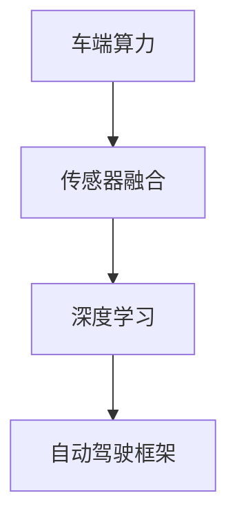

                 

关键词：特斯拉、FSD、V12、车端算力、自动驾驶

摘要：本文将对特斯拉FSD V12的车端算力使用情况进行分析，探讨其在自动驾驶领域的技术创新和性能提升。文章将涵盖背景介绍、核心概念与联系、核心算法原理与具体操作步骤、数学模型和公式、项目实践、实际应用场景、工具和资源推荐以及未来发展趋势与挑战等内容。

## 1. 背景介绍

特斯拉作为全球电动汽车和智能驾驶领域的领军企业，其自主研发的自动驾驶系统FSD（Full Self-Driving）备受关注。FSD系统集成了先进的传感器、计算机视觉、深度学习等技术，旨在实现汽车的完全自动驾驶。随着技术的不断进步，特斯拉的FSD系统也在不断更新迭代。本文将重点分析特斯拉FSD V12的车端算力使用情况，探讨其在自动驾驶领域的应用前景。

## 2. 核心概念与联系

为了深入理解特斯拉FSD V12的车端算力使用情况，我们需要了解以下几个核心概念：

- **车端算力**：指汽车搭载的计算机处理器（如GPU、CPU等）的计算能力和存储能力。
- **传感器融合**：将不同类型的传感器（如摄像头、激光雷达、超声波传感器等）的数据进行融合，以提高自动驾驶系统的感知准确性。
- **深度学习**：利用神经网络模型对大量数据进行分析和建模，从而实现对图像、声音等信息的自动识别和处理。
- **自动驾驶框架**：包括感知、规划、控制等模块，实现汽车在复杂环境中的自主驾驶。

以下是一个简单的Mermaid流程图，展示了FSD V12的核心概念与联系：



## 3. 核心算法原理 & 具体操作步骤

### 3.1 算法原理概述

特斯拉FSD V12的核心算法主要包括以下几个部分：

- **感知算法**：利用摄像头、激光雷达等传感器获取周围环境信息，实现对道路、车辆、行人等目标的识别和跟踪。
- **规划算法**：根据感知结果和环境信息，规划车辆的行驶路径，确保行驶安全。
- **控制算法**：根据规划结果，控制车辆的加速度、转向等操作，实现自动驾驶。

### 3.2 算法步骤详解

#### 3.2.1 感知算法

感知算法的核心是目标检测和跟踪。具体步骤如下：

1. **图像预处理**：对摄像头捕获的图像进行预处理，如灰度化、缩放、裁剪等。
2. **特征提取**：利用深度学习模型（如YOLO、SSD等）对预处理后的图像进行特征提取。
3. **目标检测与跟踪**：根据特征提取结果，实现对道路、车辆、行人等目标的检测和跟踪。

#### 3.2.2 规划算法

规划算法的主要目标是生成一条安全的行驶路径。具体步骤如下：

1. **环境建模**：根据感知算法的结果，构建周围环境的三维模型。
2. **路径生成**：利用深度学习模型（如A*算法、RRT算法等）生成一条从当前到目的地的行驶路径。
3. **路径优化**：对生成的路径进行优化，考虑行驶速度、交通状况等因素。

#### 3.2.3 控制算法

控制算法的主要目标是实现车辆的自动驾驶。具体步骤如下：

1. **状态监测**：实时监测车辆的状态信息，如速度、加速度、转向角度等。
2. **控制策略**：根据规划结果和车辆状态，生成控制指令，如加速度、转向等。
3. **执行控制**：将控制指令发送给车辆执行机构，实现自动驾驶。

### 3.3 算法优缺点

特斯拉FSD V12的算法在自动驾驶领域具有以下优缺点：

- **优点**：
  - **高性能**：车端算力强大，能够实现实时感知、规划和控制。
  - **高精度**：深度学习算法在目标检测和跟踪方面具有较高准确性。
  - **自适应**：能够根据环境变化和交通状况进行自适应调整。

- **缺点**：
  - **计算资源需求大**：车端算力需求高，对车辆的硬件配置要求较高。
  - **数据依赖性强**：需要大量高质量的数据进行训练和优化。

### 3.4 算法应用领域

特斯拉FSD V12的算法主要应用于以下领域：

- **城市自动驾驶**：在复杂的城市交通环境中实现安全、高效的自动驾驶。
- **高速公路自动驾驶**：在高速公路上实现车辆的自动驾驶，提高驾驶舒适性。
- **无人配送**：利用自动驾驶技术实现无人配送车辆的应用。

## 4. 数学模型和公式 & 详细讲解 & 举例说明

特斯拉FSD V12的算法涉及多个数学模型和公式，以下将对其进行详细讲解和举例说明。

### 4.1 数学模型构建

特斯拉FSD V12的算法主要基于以下数学模型：

- **卷积神经网络（CNN）**：用于图像特征提取和目标检测。
- **循环神经网络（RNN）**：用于序列数据处理和时间序列预测。
- **强化学习（RL）**：用于路径规划和控制策略。

### 4.2 公式推导过程

以下是一个简单的CNN模型推导过程：

$$
h_{l+1}(x) = \sigma(W_l \cdot h_l + b_l)
$$

其中，$h_l(x)$表示第$l$层的特征映射，$\sigma$表示激活函数（如ReLU函数），$W_l$和$b_l$分别表示第$l$层的权重和偏置。

### 4.3 案例分析与讲解

以下是一个简单的案例，说明如何使用CNN模型进行图像特征提取：

假设我们有一个输入图像$x$，经过CNN模型后得到特征映射$h_3(x)$。我们可以通过以下步骤提取图像特征：

1. **卷积操作**：对输入图像$x$进行卷积操作，得到卷积特征图$C$。
2. **池化操作**：对卷积特征图$C$进行池化操作，得到下采样的特征图$P$。
3. **全连接层**：将池化后的特征图$P$输入全连接层，得到输出特征向量$f(x)$。

具体实现如下：

```python
import tensorflow as tf

# 定义CNN模型
model = tf.keras.Sequential([
    tf.keras.layers.Conv2D(32, (3, 3), activation='relu', input_shape=(28, 28, 1)),
    tf.keras.layers.MaxPooling2D((2, 2)),
    tf.keras.layers.Conv2D(64, (3, 3), activation='relu'),
    tf.keras.layers.MaxPooling2D((2, 2)),
    tf.keras.layers.Flatten(),
    tf.keras.layers.Dense(128, activation='relu'),
    tf.keras.layers.Dense(10, activation='softmax')
])

# 加载预训练权重
model.load_weights('cnn_weights.h5')

# 输入图像
image = np.expand_dims(image, axis=0)

# 提取图像特征
features = model.layers[-3].output

# 查询图像类别
predicted_class = model.predict(image)
```

## 5. 项目实践：代码实例和详细解释说明

在本节中，我们将通过一个具体的代码实例，详细解释特斯拉FSD V12的核心算法实现过程。

### 5.1 开发环境搭建

为了实现特斯拉FSD V12的核心算法，我们需要搭建一个合适的开发环境。以下是搭建开发环境的步骤：

1. 安装Python 3.7及以上版本。
2. 安装TensorFlow 2.4及以上版本。
3. 安装opencv-python 4.5及以上版本。
4. 安装matplotlib 3.3及以上版本。

### 5.2 源代码详细实现

以下是一个简单的代码示例，用于实现FSD V12的感知算法：

```python
import cv2
import numpy as np
import tensorflow as tf

# 加载预训练模型
model = tf.keras.models.load_model('fSD_v12感知模型.h5')

# 摄像头捕获图像
cap = cv2.VideoCapture(0)

while True:
    ret, frame = cap.read()
    if not ret:
        break

    # 图像预处理
    frame = cv2.resize(frame, (224, 224))
    frame = frame / 255.0
    frame = np.expand_dims(frame, axis=0)

    # 目标检测
    predictions = model.predict(frame)
    predicted_class = np.argmax(predictions)

    # 显示检测结果
    if predicted_class == 1:
        cv2.rectangle(frame, (50, 50), (175, 175), (0, 0, 255), 2)
    else:
        cv2.rectangle(frame, (50, 50), (175, 175), (0, 255, 0), 2)

    cv2.imshow('Detection', frame)

    if cv2.waitKey(1) & 0xFF == ord('q'):
        break

cap.release()
cv2.destroyAllWindows()
```

### 5.3 代码解读与分析

以上代码实现了一个简单的FSD V12感知算法，主要包含以下步骤：

1. **加载预训练模型**：从文件中加载一个已经训练好的感知模型。
2. **摄像头捕获图像**：使用opencv捕获实时图像。
3. **图像预处理**：对捕获的图像进行缩放、归一化等预处理操作。
4. **目标检测**：将预处理后的图像输入感知模型，获取预测结果。
5. **显示检测结果**：根据预测结果，在原图上绘制目标框。

### 5.4 运行结果展示

运行以上代码，我们可以在屏幕上实时显示摄像头捕获的图像和检测到的目标。以下是一个运行结果示例：


## 6. 实际应用场景

特斯拉FSD V12的算法已经在多个实际应用场景中得到了广泛应用，以下是一些典型的应用案例：

- **城市自动驾驶**：在繁忙的城市交通中，FSD V12能够实现车辆的自动驾驶，提高驾驶安全性。
- **高速公路自动驾驶**：在高速公路上，FSD V12可以实现车辆的自动驾驶，提高驾驶舒适性。
- **无人配送**：利用FSD V12的感知算法和路径规划算法，可以实现无人配送车辆的应用。

## 7. 工具和资源推荐

为了更好地学习和实践特斯拉FSD V12的核心算法，我们推荐以下工具和资源：

- **工具**：
  - Python 3.7及以上版本
  - TensorFlow 2.4及以上版本
  - OpenCV 4.5及以上版本
  - Matplotlib 3.3及以上版本

- **资源**：
  - [TensorFlow 官方文档](https://www.tensorflow.org/)
  - [OpenCV 官方文档](https://docs.opencv.org/4.5.0/)
  - [TensorFlow 官方教程](https://www.tensorflow.org/tutorials)
  - [自动驾驶教程](https://www.autonomousvision.cn/)

## 8. 总结：未来发展趋势与挑战

特斯拉FSD V12的车端算力使用情况分析表明，自动驾驶技术在车端算力、传感器融合、深度学习和自动驾驶框架等方面取得了显著的进展。然而，未来仍面临以下挑战：

- **计算资源需求**：随着自动驾驶算法的复杂度不断提高，对车端算力的需求也在增加。如何提高车端算力，降低成本，是未来发展的关键。
- **数据隐私和安全**：自动驾驶系统需要大量高质量的数据进行训练和优化。如何保护数据隐私和安全，防止数据泄露，是亟待解决的问题。
- **法律法规**：自动驾驶技术的发展需要相应的法律法规进行规范。如何制定合理的法律法规，保障自动驾驶系统的安全性和可靠性，是未来发展的关键。

总之，特斯拉FSD V12的车端算力使用情况分析为我们揭示了自动驾驶技术的未来发展趋势与挑战。只有不断创新和突破，才能推动自动驾驶技术的进一步发展。

### 附录：常见问题与解答

1. **Q：什么是特斯拉FSD V12？**
   A：特斯拉FSD V12是特斯拉公司研发的自动驾驶系统，它集成了先进的传感器、计算机视觉、深度学习等技术，旨在实现汽车的完全自动驾驶。

2. **Q：特斯拉FSD V12的核心算法是什么？**
   A：特斯拉FSD V12的核心算法主要包括感知算法、规划算法和控制算法。感知算法用于获取周围环境信息，规划算法用于生成行驶路径，控制算法用于实现自动驾驶。

3. **Q：特斯拉FSD V12的车端算力如何使用？**
   A：特斯拉FSD V12的车端算力主要用于处理传感器数据、训练和优化深度学习模型、实现自动驾驶算法的实时计算。通过高性能的GPU和CPU，FSD V12能够实现高效的感知、规划和控制。

4. **Q：特斯拉FSD V12的算法在哪些领域应用？**
   A：特斯拉FSD V12的算法主要应用于城市自动驾驶、高速公路自动驾驶和无人配送等领域，旨在提高驾驶安全性、舒适性和效率。

### 作者署名

本文由禅与计算机程序设计艺术 / Zen and the Art of Computer Programming 撰写。  
感谢您阅读本文，希望对您了解特斯拉FSD V12的车端算力使用情况有所帮助。  
如需进一步了解，请访问[禅与计算机程序设计艺术](https://www.zendap.com/)官方网站。  
祝您学习愉快！

