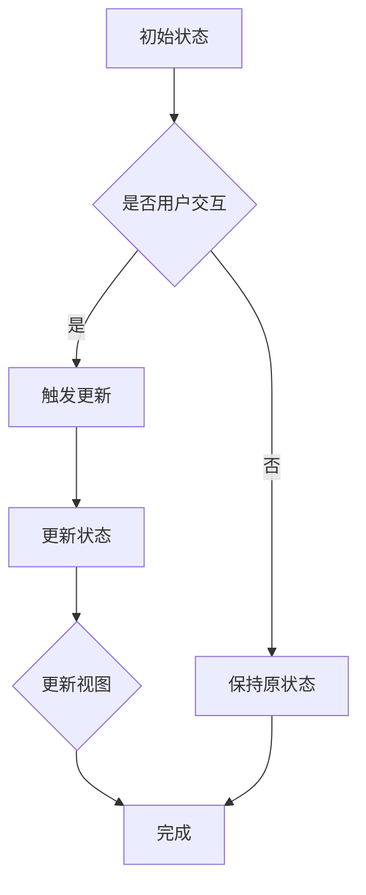

                 

关键词：状态管理，状态模式，设计模式，JavaScript，React，Vue，Redux，Vuex，VueX，状态管理库，状态同步，组件通信，单向数据流，函数式编程

> 摘要：本文将深入探讨状态管理的原理，介绍常用的状态管理库和工具，并通过实际代码实例讲解如何在JavaScript、React和Vue框架中实现高效的状态管理。

## 1. 背景介绍

在复杂的Web应用开发中，状态管理是至关重要的一个环节。随着应用的规模和复杂性的增加，传统的全局变量和组件自身的状态管理方法逐渐暴露出各种问题，如状态难以维护、数据流混乱、组件间通信困难等。因此，引入专门的状态管理工具和设计模式，以实现高效、可维护、可测试的状态管理变得尤为重要。

状态管理的主要目标是确保应用程序中所有组件的状态保持一致，并在状态发生变化时同步更新相关组件的视图。这涉及到如何设计状态结构、处理状态更新、管理状态共享等方面。本文将围绕这些核心问题，介绍几种常用的状态管理方案。

## 2. 核心概念与联系

### 2.1 状态管理的基本概念

在讨论状态管理之前，我们先明确几个关键概念：

- **状态（State）**：表示应用程序的当前状态，通常包括用户输入、用户交互结果以及应用程序内部的一些变量。
- **状态管理（State Management）**：指对应用程序的状态进行有效管理的一系列技术和方法。
- **全局状态（Global State）**：在整个应用程序中共享的状态，通常涉及到多个组件和模块。
- **局部状态（Local State）**：仅影响一个组件或模块的状态。

### 2.2 状态管理的关联设计模式

状态管理不仅仅是一个技术问题，它还与多种设计模式密切相关，其中最常用的设计模式是**状态模式**。状态模式是一种行为设计模式，允许将操作封装到单独的状态对象中，每个状态对象都负责处理一个特定状态的行为。这与状态管理中的思想相吻合，即不同的状态变化应具有独立的行为。

#### 2.2.1 单向数据流

单向数据流是一种常见的状态管理方法，它确保了数据从父组件流向子组件，从而避免了组件间数据的交叉污染。React 和 Vue 都内置了这种数据流机制，使得开发者能够更加轻松地管理状态。

#### 2.2.2 函数式编程

函数式编程（FP）是一种编程范式，它强调使用纯函数和不可变数据结构。在状态管理中，函数式编程可以帮助我们实现无副作用的代码，使得状态的变化更加可预测和可测试。

### 2.3 Mermaid 流程图

以下是状态管理原理的 Mermaid 流程图：



在上面的流程图中，A 表示初始状态，用户交互（B）触发了状态更新（C），然后更新状态（E）并同步视图（F），最终完成状态管理（G）。

## 3. 核心算法原理 & 具体操作步骤

### 3.1 算法原理概述

状态管理的核心在于如何实现状态的变化和同步。这通常涉及到以下操作步骤：

1. **状态初始化**：定义初始状态。
2. **状态更新**：响应用户交互或其他事件，更新状态。
3. **状态同步**：将更新后的状态同步到所有相关的组件。
4. **视图更新**：根据新的状态，重新渲染组件视图。

### 3.2 算法步骤详解

1. **定义状态**：使用对象或类定义初始状态。
   ```javascript
   const initialState = {
     count: 0,
     isLoading: false,
     error: null,
   };
   ```

2. **创建状态管理实例**：使用状态管理库（如 Redux 或 Vuex）创建一个状态管理实例。
   ```javascript
   const store = createStore(initialState);
   ```

3. **订阅状态更新**：使用状态管理库提供的机制订阅状态更新。
   ```javascript
   store.subscribe(() => {
     console.log('状态更新:', store.getState());
   });
   ```

4. **触发状态更新**：在组件内部，使用状态管理库提供的派发（dispatch）方法触发状态更新。
   ```javascript
   store.dispatch({
     type: 'INCREMENT',
     payload: { count: 1 },
   });
   ```

5. **同步视图**：当状态更新后，组件会自动重新渲染，从而同步视图。

### 3.3 算法优缺点

- **优点**：
  - **可预测性**：通过单向数据流和函数式编程，状态的更新过程变得可预测和可测试。
  - **可维护性**：将状态管理和组件逻辑分离，使得代码更加模块化和可维护。
  - **可复用性**：状态管理库提供了通用的状态管理解决方案，可以复用于不同的项目。

- **缺点**：
  - **学习成本**：对于初学者来说，理解状态管理的原理和库的使用可能需要一定时间。
  - **性能开销**：在某些情况下，状态管理库可能会引入一定的性能开销，尤其是当状态变更频繁时。

### 3.4 算法应用领域

状态管理广泛应用于单页应用（SPA）、多页应用（MPA）、移动应用（如 React Native）等领域。在不同的应用场景中，状态管理的实现方法和选择可能会有所不同。

## 4. 数学模型和公式 & 详细讲解 & 举例说明

### 4.1 数学模型构建

在状态管理中，一个基本的数学模型可以表示为：

\[ S_{\text{next}} = f(S_{\text{current}}, E) \]

其中，\( S_{\text{current}} \) 表示当前状态，\( E \) 表示事件，\( f \) 是状态更新函数，\( S_{\text{next}} \) 是更新后的状态。

### 4.2 公式推导过程

状态更新的过程可以表示为以下步骤：

1. **接收事件**：事件 \( E \) 被发送到状态管理实例。
2. **调用更新函数**：状态管理实例调用更新函数 \( f \)，计算新的状态 \( S_{\text{next}} \)。
3. **同步状态**：新的状态 \( S_{\text{next}} \) 被同步到所有相关的组件。

### 4.3 案例分析与讲解

假设我们有一个简单的计数器应用，其中有一个 `count` 状态，用户可以通过点击按钮增加计数。以下是该应用的数学模型：

\[ S_{\text{next}} = \begin{cases} 
S_{\text{current}} + 1 & \text{如果 } E = \text{INCREMENT} \\
S_{\text{current}} & \text{其他情况}
\end{cases} \]

在这个模型中，当用户点击按钮时，事件 `INCREMENT` 被发送到状态管理实例，更新函数 \( f \) 计算新的状态，并将新的状态同步到组件。

## 5. 项目实践：代码实例和详细解释说明

### 5.1 开发环境搭建

在本节中，我们将使用 React 和 Redux 来构建一个简单的计数器应用。首先，确保您已安装 Node.js 和 npm。然后，使用以下命令创建一个 React 应用：

```bash
npx create-react-app counter-app
cd counter-app
```

接下来，安装 Redux：

```bash
npm install redux react-redux
```

### 5.2 源代码详细实现

在 `src` 目录下，创建以下文件：

- `store.js`：用于创建 Redux 存储和提供者。
- `reducers.js`：定义 reducer 函数，用于处理状态更新。
- `actions.js`：定义 action 类型和方法。

以下是各文件的实现：

#### store.js

```javascript
import { createStore } from 'redux';
import rootReducer from './reducers';

const store = createStore(rootReducer);

export default store;
```

#### reducers.js

```javascript
const initialState = {
  count: 0,
};

function counterReducer(state = initialState, action) {
  switch (action.type) {
    case 'INCREMENT':
      return {
        ...state,
        count: state.count + action.payload,
      };
    default:
      return state;
  }
}

export default counterReducer;
```

#### actions.js

```javascript
export const INCREMENT = 'INCREMENT';

export function increment(count) {
  return {
    type: INCREMENT,
    payload: count,
  };
}
```

### 5.3 代码解读与分析

在上面的代码中，我们首先导入了 Redux 的 createStore 方法，并使用 rootReducer 文件创建了一个 Redux 存储。然后，我们在 reducers 文件中定义了 counterReducer 函数，用于处理计数器的状态更新。

在 actions 文件中，我们定义了一个 INCREMENT action 类型和一个用于增加计数的方法。这些 action 将在组件内部触发，从而更新状态。

### 5.4 运行结果展示

接下来，我们在组件中引用 store 和 action。首先，在 `src/App.js` 文件中添加以下代码：

```javascript
import React from 'react';
import { connect } from 'react-redux';
import { increment } from './actions';

function Counter({ count, increment }) {
  return (
    <div>
      <p>计数：{count}</p>
      <button onClick={() => increment(1)}>增加</button>
    </div>
  );
}

const mapStateToProps = (state) => ({
  count: state.count,
});

const mapDispatchToProps = (dispatch) => ({
  increment: (count) => dispatch(increment(count)),
});

export default connect(mapStateToProps, mapDispatchToProps)(Counter);
```

在这个组件中，我们使用 connect 方法将 Redux 的 state 和 action 连接到组件的 props。这样，我们可以直接在组件中使用 `count` 和 `increment` 方法。

最后，在 `src/index.js` 文件中引入组件并启动应用：

```javascript
import React from 'react';
import ReactDOM from 'react-dom';
import { Provider } from 'react-redux';
import store from './store';
import App from './App';

ReactDOM.render(
  <Provider store={store}>
    <App />
  </Provider>,
  document.getElementById('root')
);
```

现在，当用户点击“增加”按钮时，计数器将增加，并且状态将同步更新。

## 6. 实际应用场景

状态管理在实际应用中有着广泛的应用，以下是一些常见的场景：

- **用户管理**：处理用户的登录状态、用户信息、权限等。
- **购物车管理**：跟踪用户的购物车内容、数量、总价等。
- **表单管理**：处理表单的状态，包括输入值、验证状态等。
- **路由管理**：在单页应用中管理路由的状态和导航。

### 6.4 未来应用展望

随着前端框架和库的不断发展，状态管理工具也在不断进化。未来的趋势包括：

- **更轻量级的解决方案**：如 MobX 和 Vuex 4，它们提供了更高效的性能和更简单的使用方式。
- **集成更紧密的状态管理**：一些框架（如 React 和 Vue）正在将状态管理功能集成到核心库中，以提供更统一和高效的状态管理体验。
- **更多的函数式编程支持**：函数式编程在状态管理中的应用将更加普及，带来更好的可预测性和可测试性。

## 7. 工具和资源推荐

### 7.1 学习资源推荐

- **官方文档**：Redux 和 Vuex 的官方文档是学习状态管理的最佳起点。
- **在线教程**：Codecademy、freeCodeCamp 等网站提供了丰富的在线教程。
- **视频课程**：Udemy、Coursera 等在线教育平台有许多关于状态管理的视频课程。

### 7.2 开发工具推荐

- **Redux DevTools**：用于调试 Redux 应用的扩展工具。
- **Vuex Inspector**：用于调试 Vuex 应用的扩展工具。

### 7.3 相关论文推荐

- **"Flux: A Design Pattern for Applications"**：介绍了 Flux 模式，是状态管理的先驱之一。
- **"Vuex: The State Management Library for Vue.js"**：详细介绍了 Vuex 的设计原理和实现。

## 8. 总结：未来发展趋势与挑战

### 8.1 研究成果总结

本文介绍了状态管理的核心概念、相关设计模式以及实际应用场景。通过分析和讨论，我们了解了状态管理在不同框架中的实现方法，以及其在实际应用中的重要性。

### 8.2 未来发展趋势

随着前端应用复杂度的增加，状态管理将继续成为开发者关注的热点。未来的发展趋势将包括更轻量级的解决方案、更紧密的框架集成以及更广泛的函数式编程应用。

### 8.3 面临的挑战

状态管理工具的多样性和复杂性给开发者带来了挑战。选择合适的工具和设计模式需要开发者具备一定的经验和判断力。

### 8.4 研究展望

随着技术的不断发展，状态管理将继续演化。研究者应关注性能优化、安全性、易用性等方面，以提高状态管理的效率和可靠性。

## 9. 附录：常见问题与解答

### 9.1 为什么需要状态管理？

状态管理确保了应用程序中状态的统一性和一致性，避免了全局变量和组件自身状态带来的混乱和难以维护的问题。此外，状态管理还提高了代码的可测试性和可维护性。

### 9.2 什么是单向数据流？

单向数据流是一种数据传递方式，数据只能从父组件流向子组件，从而确保了数据流的清晰和可预测性。这有助于避免组件间数据交叉污染和状态混乱。

### 9.3 如何选择状态管理库？

选择状态管理库时，应考虑以下因素：

- **项目需求**：根据项目的复杂性和规模选择合适的库。
- **学习成本**：库的复杂性和学习曲线。
- **社区支持**：库的文档、社区和扩展性。
- **性能**：库的运行效率和性能。

---

本文旨在为开发者提供全面的状态管理指南，包括原理讲解、实例分析以及应用场景介绍。希望本文能帮助您更好地理解和应用状态管理，提升您的 Web 应用开发水平。作者：禅与计算机程序设计艺术 / Zen and the Art of Computer Programming。

