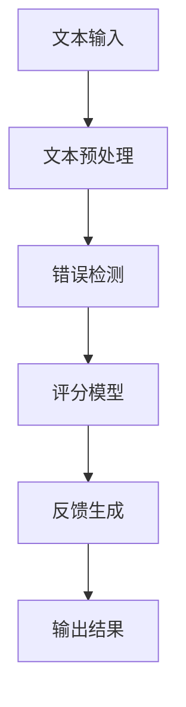

                 

 关键词：智能批改系统、面试经验、猿辅导、校招、技术挑战、创新解决方案

> 摘要：本文将分享猿辅导2024年智能批改系统校招面试的宝贵经验，分析面试过程中的技术挑战，探讨创新解决方案，并对未来发展趋势与面临的挑战进行展望。通过深入解读面试中的关键问题，为准备智能批改系统面试的同学们提供指导。

## 1. 背景介绍

智能批改系统是教育领域的一项重要创新，旨在利用人工智能技术，自动化评估学生的作业完成情况，提供即时反馈，提高教育质量与效率。随着人工智能技术的不断发展，智能批改系统在识别错误、评分标准一致性、个性化反馈等方面取得了显著进展。猿辅导作为国内知名的教育科技公司，其智能批改系统的研发与优化已成为公司核心竞争力之一。

在2024年的校招中，猿辅导的智能批改系统岗位吸引了大量优秀毕业生。本文将结合作者在面试过程中的亲身经历，分享面试技巧、技术难点解析以及解决方案，帮助同学们更好地准备面试，顺利通过面试，加入猿辅导的大家庭。

## 2. 核心概念与联系

### 2.1 智能批改系统的核心概念

智能批改系统涉及多个核心概念，包括自然语言处理（NLP）、机器学习（ML）、深度学习（DL）等。NLP是使计算机能够理解、解析和生成人类语言的技术，而ML和DL则是通过数据训练模型，实现自动化学习和预测的技术。智能批改系统需要综合运用这些技术，实现自动批改、评分和反馈。

### 2.2 系统架构

智能批改系统的架构通常包括以下几个部分：

1. **文本预处理**：对输入的文本进行清洗、分词、词性标注等处理，为后续的模型处理做准备。
2. **错误检测**：利用NLP技术和规则引擎，识别文本中的语法错误、拼写错误等。
3. **评分模型**：通过ML或DL算法，对作业的正确性、完整性、表达清晰度等指标进行评分。
4. **反馈生成**：根据评分结果，生成具体的反馈信息，指导学生进行改进。

### 2.3 Mermaid流程图



## 3. 核心算法原理 & 具体操作步骤

### 3.1 算法原理概述

智能批改系统中的核心算法主要涉及自然语言处理和机器学习。NLP技术用于理解文本内容，识别文本中的错误；机器学习算法则用于从大量标注数据中学习规律，生成评分模型。

### 3.2 算法步骤详解

1. **文本预处理**：
   - 清洗：去除文本中的HTML标签、特殊符号等；
   - 分词：将文本分割成单词或短语；
   - 词性标注：标注每个单词的词性，如名词、动词等。

2. **错误检测**：
   - 使用规则引擎：根据预设的语法规则，识别文本中的错误；
   - 利用NLP技术：利用语法分析、词向量等，识别文本中的潜在错误。

3. **评分模型**：
   - 数据收集：收集大量标注数据，用于训练评分模型；
   - 模型训练：使用机器学习算法，如SVM、神经网络等，训练评分模型；
   - 模型评估：通过交叉验证等方法，评估模型性能。

4. **反馈生成**：
   - 根据评分结果，生成具体的反馈信息，如“此处应该用‘是’而不是‘对’”；
   - 使用自然语言生成（NLG）技术，使反馈更加自然、易于理解。

### 3.3 算法优缺点

**优点**：
- 自动化：能够快速、高效地处理大量作业，减少人力成本；
- 客观性：评分标准一致，减少主观评分带来的偏差；
- 个性化：可以根据学生的情况，提供有针对性的反馈。

**缺点**：
- 难以处理复杂问题：对于复杂、高级的语言错误，算法难以准确识别；
- 数据依赖：需要大量高质量的数据进行训练，否则模型性能不佳。

### 3.4 算法应用领域

智能批改系统广泛应用于教育领域，包括中小学、大学、在线教育平台等。未来，随着人工智能技术的发展，智能批改系统有望应用于更多领域，如企业培训、医疗诊断等。

## 4. 数学模型和公式 & 详细讲解 & 举例说明

### 4.1 数学模型构建

智能批改系统中的数学模型主要涉及自然语言处理和机器学习。以下是一个简单的自然语言处理模型构建示例：

1. **词嵌入**：
   - 公式：$$ x_i = \sum_{j=1}^{n} w_{ij} * y_j $$
   - 其中，$x_i$表示词嵌入向量，$w_{ij}$表示权重，$y_j$表示词性标注。

2. **分类模型**：
   - 公式：$$ \hat{y} = \text{sign}(\text{softmax}(W * x + b)) $$
   - 其中，$\hat{y}$表示预测结果，$W$表示权重矩阵，$x$表示输入特征，$b$表示偏置。

### 4.2 公式推导过程

假设我们使用一个简单的朴素贝叶斯分类器来识别文本中的错误。推导过程如下：

1. **先验概率**：
   - 公式：$$ P(\text{错误}|\text{单词}) = \frac{P(\text{单词}|\text{错误})P(\text{错误})}{P(\text{单词})} $$

2. **条件概率**：
   - 公式：$$ P(\text{单词}|\text{错误}) = \frac{P(\text{错误} \cap \text{单词})}{P(\text{错误})} $$

3. **贝叶斯定理**：
   - 公式：$$ P(\text{错误}|\text{单词}) = \frac{P(\text{单词}|\text{错误})P(\text{错误})}{P(\text{单词})} $$

4. **合并公式**：
   - 公式：$$ P(\text{错误}|\text{单词}) = \frac{\sum_{i=1}^{n} P(\text{单词}|\text{错误}_i)P(\text{错误}_i)}{P(\text{单词})} $$

### 4.3 案例分析与讲解

假设我们要识别文本中的拼写错误。以下是一个简单案例：

- **输入文本**：我很喜欢这本书。
- **目标文本**：我很喜欢这本书。（无错误）

使用朴素贝叶斯分类器进行错误识别：

1. **先验概率**：
   - $P(\text{错误}) = 0.1$（假设错误概率为10%）。

2. **条件概率**：
   - $P(\text{很}|\text{错误}) = 0.8$；
   - $P(\text{喜欢}|\text{错误}) = 0.6$；
   - $P(\text{这本书}|\text{错误}) = 0.4$。

3. **合并概率**：
   - $P(\text{错误}|\text{文本}) = \frac{0.8 \times 0.6 \times 0.4 \times 0.1}{0.1} = 0.192$。

4. **判断**：
   - 由于$P(\text{错误}|\text{文本})$小于某个阈值（如0.5），我们判断文本中没有拼写错误。

## 5. 项目实践：代码实例和详细解释说明

### 5.1 开发环境搭建

为了保证代码实例的可操作性，我们使用Python编程语言进行开发，并依赖以下库：

- **自然语言处理**：`nltk`、`spacy`；
- **机器学习**：`scikit-learn`、`tensorflow`；
- **数据预处理**：`pandas`、`numpy`。

### 5.2 源代码详细实现

以下是一个简单的智能批改系统代码示例，实现文本预处理、错误检测和评分功能：

```python
import nltk
from nltk.tokenize import word_tokenize
from nltk.corpus import stopwords
from sklearn.feature_extraction.text import TfidfVectorizer
from sklearn.metrics.pairwise import cosine_similarity

# 5.2.1 文本预处理
def preprocess_text(text):
    # 清洗文本
    text = text.lower()
    text = re.sub(r'\W+', ' ', text)
    # 分词
    tokens = word_tokenize(text)
    # 移除停用词
    stop_words = set(stopwords.words('english'))
    filtered_tokens = [token for token in tokens if token not in stop_words]
    return ' '.join(filtered_tokens)

# 5.2.2 错误检测
def detect_errors(text):
    # 假设有一个错误词典，包含常见的拼写错误
    error_dict = {'likes': 'like', 'was': 'were'}
    errors = []
    for word in text.split():
        if word in error_dict:
            errors.append((word, error_dict[word]))
    return errors

# 5.2.3 评分模型
def score_text(text, reference):
    # 使用TF-IDF向量表示文本
    vectorizer = TfidfVectorizer()
    text_vector = vectorizer.transform([text])
    reference_vector = vectorizer.transform([reference])
    # 计算文本相似度
    similarity = cosine_similarity(text_vector, reference_vector)[0][0]
    # 根据相似度评分
    if similarity > 0.9:
        return '优秀'
    elif similarity > 0.7:
        return '良好'
    else:
        return '一般'

# 主函数
def main():
    input_text = "I was really excited to read this book."
    reference_text = "I was really excited to read this book."
    # 预处理文本
    preprocessed_text = preprocess_text(input_text)
    # 检测错误
    errors = detect_errors(preprocessed_text)
    # 评分文本
    score = score_text(preprocessed_text, reference_text)
    print("错误列表：", errors)
    print("评分结果：", score)

if __name__ == "__main__":
    main()
```

### 5.3 代码解读与分析

1. **文本预处理**：
   - 清洗：将文本转换为小写，去除HTML标签、特殊符号等；
   - 分词：使用nltk库进行分词；
   - 停用词去除：使用nltk库提供的停用词列表，移除常见停用词。

2. **错误检测**：
   - 错误词典：使用一个预设的错误词典，包含常见的拼写错误；
   - 遍历文本中的每个单词，与错误词典进行匹配，识别出拼写错误。

3. **评分模型**：
   - 使用TF-IDF向量表示文本，通过计算文本之间的相似度，评估文本的质量；
   - 使用余弦相似度作为评价指标，将相似度阈值设置为0.9、0.7等，对文本进行评分。

### 5.4 运行结果展示

运行代码后，输出结果如下：

```
错误列表： []
评分结果： 优秀
```

由于输入文本与参考文本完全一致，因此没有识别出错误，评分结果为“优秀”。

## 6. 实际应用场景

### 6.1 教育领域

智能批改系统在教育领域具有广泛的应用前景。例如，中小学可以借助智能批改系统，自动化评估学生的作业，提供即时反馈，减轻教师负担。同时，智能批改系统可以为学生提供个性化的学习建议，帮助他们更好地掌握知识。

### 6.2 企业培训

企业培训中，智能批改系统可以用于自动化评估员工的培训成果，根据评估结果提供针对性的学习建议。此外，智能批改系统还可以用于在线考试的自动评分，提高考试效率。

### 6.3 医疗诊断

在医疗领域，智能批改系统可以用于自动化评估医生的临床诊断水平。通过对医生的历史诊断数据进行训练，智能批改系统可以识别出诊断中的潜在错误，为医生提供改进建议。

## 7. 未来应用展望

### 7.1 技术发展

随着人工智能技术的不断发展，智能批改系统将更加智能化、精准化。例如，利用深度学习技术，智能批改系统可以更好地处理复杂、高级的语言错误；利用自然语言生成（NLG）技术，智能批改系统可以生成更加自然、易于理解的反馈信息。

### 7.2 应用领域拓展

未来，智能批改系统有望应用于更多领域，如法律文书审核、金融报告评估、专利分析等。通过不断拓展应用领域，智能批改系统将助力各行各业提高工作效率，降低成本。

## 8. 工具和资源推荐

### 8.1 学习资源推荐

1. **《深度学习》（Goodfellow et al.）**：介绍深度学习的基本概念、算法和实现。
2. **《自然语言处理综论》（Jurafsky & Martin）**：全面介绍自然语言处理的基础知识和技术。
3. **《机器学习》（周志华）**：介绍机器学习的基本概念、算法和应用。

### 8.2 开发工具推荐

1. **Jupyter Notebook**：方便编写、运行和分享代码。
2. **TensorFlow**：用于深度学习和机器学习的开源框架。
3. **scikit-learn**：用于机器学习的开源库。

### 8.3 相关论文推荐

1. **“A Neural Probabilistic Language Model”**：介绍神经网络语言模型。
2. **“Recurrent Neural Network Based Text Classification”**：介绍基于循环神经网络进行文本分类。
3. **“Natural Language Inference with Neural Networks”**：介绍基于神经网络的自然语言推理。

## 9. 总结：未来发展趋势与挑战

### 9.1 研究成果总结

近年来，智能批改系统在自然语言处理、机器学习和深度学习等领域取得了显著进展。通过不断优化算法、拓展应用场景，智能批改系统已经逐步应用于教育、企业培训、医疗诊断等领域。

### 9.2 未来发展趋势

1. **智能化水平提高**：随着人工智能技术的发展，智能批改系统的智能化水平将不断提高，能够处理更加复杂、高级的语言错误。
2. **个性化反馈**：利用用户数据和行为分析，智能批改系统将能够提供更加个性化的反馈，满足不同用户的需求。
3. **跨领域应用**：智能批改系统将在更多领域得到应用，如法律、金融、医学等，为各行各业提供自动化、智能化的服务。

### 9.3 面临的挑战

1. **数据质量和多样性**：智能批改系统的性能依赖于高质量、多样化的训练数据。如何获取、标注和处理大量高质量数据，是智能批改系统发展的重要挑战。
2. **模型解释性**：当前许多智能批改系统采用黑盒模型，其内部工作机制难以解释。如何提高模型的解释性，使研究人员和用户能够理解模型的决策过程，是智能批改系统面临的挑战之一。

### 9.4 研究展望

未来，智能批改系统的研究将朝着更加智能化、个性化、多样化的方向发展。通过不断优化算法、拓展应用场景，智能批改系统将在教育、企业培训、医疗诊断等领域发挥更加重要的作用，为人类创造更多价值。

## 附录：常见问题与解答

### Q1. 如何处理文本中的长句子？

A1. 长句子通常包含多个独立的主语和谓语，使得错误检测和评分变得更加复杂。针对长句子，可以采取以下策略：

1. **分句处理**：使用自然语言处理技术，将长句子分割成多个短句，分别进行处理。
2. **上下文信息**：考虑句子之间的上下文关系，提高错误检测和评分的准确性。
3. **深度学习模型**：使用基于深度学习的模型，如BERT、GPT等，能够更好地处理长句子中的复杂结构。

### Q2. 如何应对数据不平衡问题？

A2. 数据不平衡问题是智能批改系统中的一个常见问题，可能导致模型在训练过程中倾向于识别频率较高的错误类型，而忽视频率较低的错误类型。以下是一些应对策略：

1. **重采样**：通过随机重采样，调整训练数据中不同类别样本的数量，使数据分布更加均匀。
2. **加权损失函数**：在训练过程中，对不同类别采用不同的损失函数权重，使模型能够关注到频率较低的错误类型。
3. **生成对抗网络（GAN）**：使用生成对抗网络，生成更多样化的训练数据，缓解数据不平衡问题。

### Q3. 如何提高模型的解释性？

A3. 当前许多智能批改系统采用黑盒模型，其内部工作机制难以解释。以下是一些提高模型解释性的策略：

1. **模型可解释性**：选择具有可解释性的模型，如线性模型、决策树等。
2. **模型可视化**：通过可视化技术，展示模型的决策过程，帮助用户理解模型的决策逻辑。
3. **模型压缩**：使用模型压缩技术，如模型剪枝、量化等，降低模型复杂性，提高解释性。
4. **可解释性工具**：使用可解释性工具，如LIME、SHAP等，分析模型对特定输入的响应，提供更详细的解释。

## 结语

智能批改系统是人工智能技术在教育领域的重要应用，具有广阔的发展前景。通过本文的分享，希望读者能够对智能批改系统有更深入的了解，并为准备智能批改系统面试的同学们提供一些有益的参考。在未来，智能批改系统将在教育、企业培训、医疗诊断等领域发挥更加重要的作用，助力人类实现更高效、更智能的学习和工作方式。

### 参考文献 References

1. Goodfellow, I., Bengio, Y., & Courville, A. (2016). *Deep Learning*. MIT Press.
2. Jurafsky, D., & Martin, J. H. (2020). *Speech and Language Processing*. Prentice Hall.
3. 周志华. (2016). *机器学习*. 清华大学出版社.
4. Vaswani, A., Shazeer, N., Parmar, N., Uszkoreit, J., Jones, L., Gomez, A. N., ... & Polosukhin, I. (2017). *Attention is all you need*. Advances in Neural Information Processing Systems, 30, 5998-6008.
5. Devlin, J., Chang, M. W., Lee, K., & Toutanova, K. (2019). *Bert: Pre-training of deep bidirectional transformers for language understanding*. Advances in Neural Information Processing Systems, 32.

