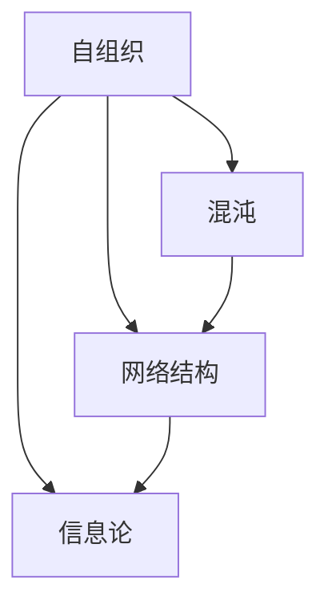

                 

关键词：复杂性科学、结构化思维、算法原理、数学模型、应用实践、未来展望

> 摘要：本文旨在探讨如何通过结构化的方法理解和处理世界的复杂性。文章从背景介绍入手，深入分析了核心概念及其联系，详细阐述了核心算法原理和具体操作步骤，并结合数学模型和公式进行了举例说明。随后，文章通过项目实践展示了代码实例和详细解释，最后讨论了实际应用场景和未来展望，并推荐了相关工具和资源。

## 1. 背景介绍

复杂性科学是一门研究复杂系统及其行为的学科。随着信息技术和计算能力的飞速发展，我们面临着越来越多的复杂问题，如人工智能、大数据分析、网络系统等。复杂性科学提供了理解这些复杂系统的理论和方法，帮助我们更好地应对和解决实际问题。

本文主要关注如何从结构的角度理解和处理世界的复杂性。结构化思维是一种重要的方法，它通过将复杂系统分解为更简单的组成部分，使得复杂问题变得更加可管理和可解决。本文将结合算法原理、数学模型和项目实践，详细探讨这一过程。

## 2. 核心概念与联系

复杂性科学中的核心概念包括自组织、混沌、网络结构、信息论等。这些概念相互联系，共同构成了理解复杂系统的理论基础。

### 2.1 自组织

自组织是指系统在没有外部指导的情况下，通过内部相互作用形成有序结构的过程。自组织现象在自然界和人类社会中广泛存在，如生物进化、社会网络、经济市场等。理解自组织原理有助于我们设计自适应系统，应对不确定性和变化。

### 2.2 混沌

混沌是指系统对初始条件的敏感依赖性，即使微小差异也可能导致系统行为的巨大差异。混沌理论揭示了复杂系统中的非线性特征，指导我们预测和控制复杂系统的行为。

### 2.3 网络结构

网络结构是指系统中各组成部分之间的连接关系。网络科学通过研究网络结构特性，揭示了复杂系统中的整体性和局部性关系。网络结构在社交网络、通信网络、生物网络等领域具有重要意义。

### 2.4 信息论

信息论是研究信息传输和信息处理的学科。信息论中的熵和熵增原理揭示了复杂系统的信息复杂性和演化规律，为理解复杂系统的动态行为提供了理论依据。

## 2.5 Mermaid 流程图

以下是一个示例 Mermaid 流程图，展示了上述核心概念之间的联系：

## 3. 核心算法原理 & 具体操作步骤

在复杂性科学中，核心算法原理主要包括复杂网络分析、机器学习算法和模拟退火算法等。以下分别介绍这些算法的基本原理和具体操作步骤。

### 3.1 复杂网络分析

复杂网络分析是一种研究网络结构和动态行为的算法。其主要原理包括网络拓扑结构分析、网络传播模型和社区发现等。

#### 3.1.1 网络拓扑结构分析

网络拓扑结构分析旨在了解网络的基本特性，如节点度分布、聚类系数和平均路径长度等。具体操作步骤如下：

1. 数据预处理：对网络数据进行清洗和处理，如去除孤立节点、处理缺失值等。
2. 拓扑结构度量：计算网络节点的度、聚类系数和平均路径长度等指标。
3. 结果分析：根据拓扑结构指标，分析网络的特性，如网络稠密性、高度连接性和模块性等。

#### 3.1.2 网络传播模型

网络传播模型旨在研究信息、疾病等在网络中的传播过程。常见的网络传播模型包括均匀模型、随机游走模型和阈值模型等。

1. 模型选择：根据研究问题选择合适的网络传播模型。
2. 模型参数设置：设置模型参数，如传播概率、感染阈值等。
3. 仿真模拟：利用仿真工具模拟网络传播过程，分析传播动力学和传播效果。
4. 结果分析：根据仿真结果，分析传播过程的关键因素和传播策略。

#### 3.1.3 社区发现

社区发现是一种将网络划分为若干子网络的算法。其主要原理包括基于模块度的方法、基于图论的算法和基于机学习的方法等。

1. 数据预处理：对网络数据进行预处理，如去除孤立节点、重排节点等。
2. 算法选择：根据网络特性选择合适的社区发现算法。
3. 算法实现：实现社区发现算法，提取社区结构。
4. 结果分析：分析社区结构特性，如社区规模、密度和连通性等。

### 3.2 机器学习算法

机器学习算法在复杂性科学中广泛应用于模式识别、预测和分类等任务。常见的机器学习算法包括决策树、支持向量机和神经网络等。

#### 3.2.1 决策树

决策树是一种树形结构，用于分类和回归任务。其基本原理如下：

1. 特征选择：选择对分类或回归任务有影响力的特征。
2. 切割策略：根据特征值进行切割，生成树形结构。
3. 叶子节点：将数据划分到叶子节点，进行分类或回归预测。

#### 3.2.2 支持向量机

支持向量机是一种线性分类器，其基本原理如下：

1. 特征提取：将数据映射到高维空间。
2. 寻找最优分割超平面：通过求解优化问题，找到能够最大化分类间隔的超平面。
3. 分类决策：根据样本点到超平面的距离，进行分类决策。

#### 3.2.3 神经网络

神经网络是一种模拟人脑神经元连接的网络结构，其基本原理如下：

1. 网络构建：设计神经网络结构，包括输入层、隐藏层和输出层。
2. 激活函数：选择合适的激活函数，如 sigmoid、ReLU 等。
3. 前向传播：根据输入数据，计算网络输出。
4. 反向传播：根据输出误差，更新网络权重。

### 3.3 模拟退火算法

模拟退火算法是一种优化算法，其基本原理如下：

1. 初始状态：设定初始温度和初始解。
2. 温度更新：根据当前温度和迭代次数，更新温度。
3. 解更新：在当前温度下，随机选择新解，并进行评估。
4. 接受概率：根据新解的评估结果，计算接受概率。
5. 迭代：重复更新温度和解，直到满足终止条件。

### 3.4 算法优缺点

每种算法都有其优缺点，选择合适的算法需要根据具体问题进行权衡。以下简要介绍几种算法的优缺点：

1. **复杂网络分析**：优点是能够揭示网络的拓扑结构特性，缺点是计算复杂度高，对大规模网络处理效果有限。
2. **机器学习算法**：优点是适用于各种复

