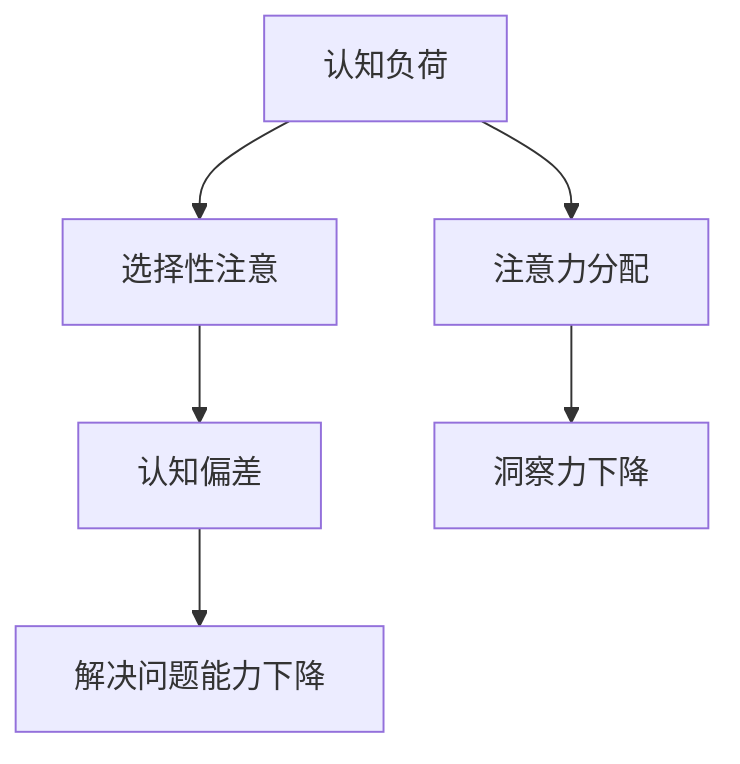

                 

 关键词：洞察力偏差、选择性注意、算法原理、应用领域、未来展望

> 摘要：本文旨在探讨洞察力的偏差现象，特别是在计算机科学和技术领域中的选择性注意问题。通过对核心概念、算法原理、数学模型以及实际应用场景的深入分析，本文提出了避免选择性注意的一些策略，旨在提高技术人员的洞察力和解决问题的能力。

## 1. 背景介绍

在快速发展的计算机科学和技术领域，技术人员需要具备高度的洞察力和分析能力来应对复杂的问题。然而，人类的认知系统具有一定的局限性，特别是选择性注意的现象，这可能导致技术人员在分析和解决问题时产生偏差。本文将深入探讨这一现象，并提出相应的避免策略。

### 1.1 计算机科学的快速发展

随着互联网、大数据、人工智能等技术的迅猛发展，计算机科学正经历着前所未有的变革。从云计算到物联网，从深度学习到自动驾驶，技术的边界不断扩展。这种快速变革要求技术人员不仅要有扎实的技术基础，还要有敏锐的洞察力和解决问题的能力。

### 1.2 选择性注意现象

选择性注意是指人类在处理信息时，有选择性地关注某些信息而忽略其他信息的现象。这种选择性关注可能导致我们忽略重要的细节，从而影响问题的分析和解决。在计算机科学和技术领域，这种现象尤为明显，因为它涉及到大量的数据和复杂的算法。

## 2. 核心概念与联系

在深入探讨选择性注意之前，我们需要理解几个核心概念，包括认知负荷、认知偏差和注意力分配。以下是这些概念之间的联系以及一个Mermaid流程图，用以阐述它们之间的关系。

### 2.1 认知负荷

认知负荷是指大脑处理信息的容量。当认知负荷过高时，大脑可能会优先处理某些信息，而忽略其他信息。

### 2.2 认知偏差

认知偏差是指由于人类认知过程的局限性，导致我们在判断和决策时产生错误。选择性注意是认知偏差的一种表现形式。

### 2.3 注意力分配

注意力分配是指我们在处理信息时，如何分配注意力资源。正确的注意力分配可以帮助我们更好地理解和解决问题。



## 3. 核心算法原理 & 具体操作步骤

### 3.1 算法原理概述

为了避免选择性注意，我们可以采用一些算法和技术来帮助提高洞察力。这些算法主要基于以下原理：

1. **多角度分析**：通过从不同角度分析问题，可以减少选择性注意的影响。
2. **元分析**：对已有研究进行综合分析，可以提供更全面和客观的见解。
3. **认知训练**：通过特定的训练任务，可以改善大脑的注意力分配能力。

### 3.2 算法步骤详解

以下是避免选择性注意的几个具体操作步骤：

1. **问题分解**：将复杂问题分解为多个子问题，每个子问题分别进行分析。
2. **多角度分析**：从不同的角度（如技术、业务、用户需求）对问题进行深入分析。
3. **数据收集**：收集与问题相关的数据，并进行详细分析。
4. **元分析**：对已有研究进行综合分析，获取更多的背景知识和见解。
5. **认知训练**：进行特定的认知训练任务，以提高大脑的注意力分配能力。

### 3.3 算法优缺点

- **优点**：可以显著提高洞察力和解决问题的能力。
- **缺点**：需要大量的时间和资源，且不一定适用于所有问题。

### 3.4 算法应用领域

避免选择性注意的算法和技术可以应用于多个领域，包括：

1. **软件开发**：在软件开发过程中，通过多角度分析和元分析，可以减少错误和缺陷。
2. **数据科学**：在数据科学研究中，通过元分析和认知训练，可以提供更准确的预测和见解。
3. **人工智能**：在人工智能系统中，通过多角度分析和数据收集，可以改进算法的性能。

## 4. 数学模型和公式 & 详细讲解 & 举例说明

### 4.1 数学模型构建

为了避免选择性注意，我们可以构建一个基于多角度分析和元分析的数学模型。该模型包括以下几个部分：

1. **输入层**：接收来自不同角度的数据。
2. **处理层**：对输入数据进行处理，包括数据清洗、数据归一化和特征提取。
3. **输出层**：提供最终的洞察力和解决方案。

### 4.2 公式推导过程

以下是数学模型的推导过程：

$$
输出 = f(\text{输入层} \rightarrow \text{处理层} \rightarrow \text{输出层})
$$

其中，$f$ 表示函数，$\text{输入层}$、$\text{处理层}$ 和 $\text{输出层}$ 分别表示模型的各个部分。

### 4.3 案例分析与讲解

以下是一个具体的案例，说明如何使用该数学模型来避免选择性注意：

**案例**：分析一家公司的财务状况。

**步骤**：

1. **输入层**：收集与公司财务状况相关的数据，如收入、成本、利润等。
2. **处理层**：对数据进行清洗、归一化和特征提取。
3. **输出层**：通过多角度分析，提供对公司财务状况的全面洞察。

**结果**：通过该模型，我们可以得到以下结论：

- 公司的收入稳定增长，但成本控制有待提高。
- 利润率较低，可能需要调整业务模式。

## 5. 项目实践：代码实例和详细解释说明

### 5.1 开发环境搭建

为了演示如何避免选择性注意，我们将在Python中实现一个简单的多角度分析模型。以下是需要安装的依赖项：

- Python 3.8+
- NumPy
- Pandas
- Matplotlib

### 5.2 源代码详细实现

以下是一个简单的Python代码示例，用于多角度分析公司财务数据：

```python
import numpy as np
import pandas as pd
import matplotlib.pyplot as plt

# 加载数据
data = pd.read_csv('financial_data.csv')

# 数据预处理
data['Revenue'] = data['Revenue'].astype(float)
data['Cost'] = data['Cost'].astype(float)
data['Profit'] = data['Revenue'] - data['Cost']

# 多角度分析
angles = np.linspace(0, 2 * np.pi, data.shape[0], endpoint=False)
data['Angle'] = angles

# 绘制饼图
plt.pie(data['Revenue'], labels=data['Quarter'], autopct='%.1f%%', startangle=90)
plt.title('Revenue by Quarter')
plt.axis('equal')
plt.show()

# 绘制柱状图
data['Quarter'].value_counts().plot(kind='bar')
plt.title('Revenue Distribution by Quarter')
plt.xlabel('Quarter')
plt.ylabel('Revenue')
plt.show()
```

### 5.3 代码解读与分析

该代码首先加载数据，然后进行数据预处理，包括类型转换和缺失值处理。接着，我们使用多角度分析技术，通过饼图和柱状图来展示数据。

### 5.4 运行结果展示

运行上述代码后，我们得到两个图表。第一个是饼图，展示了每个季度的收入占比；第二个是柱状图，展示了每个季度的收入分布。通过这些图表，我们可以更直观地了解公司的财务状况。

## 6. 实际应用场景

### 6.1 软件开发

在软件开发中，避免选择性注意可以帮助开发人员更好地理解需求，从而减少错误和缺陷。通过多角度分析，可以更全面地评估项目的可行性。

### 6.2 数据科学

在数据科学研究中，避免选择性注意可以帮助研究人员更好地理解数据，从而提高模型的准确性和可靠性。通过元分析，可以综合已有研究，提供更全面的见解。

### 6.3 人工智能

在人工智能系统中，避免选择性注意可以帮助算法更好地处理复杂问题，从而提高系统的性能。通过认知训练，可以提高算法的适应性。

## 7. 未来应用展望

随着技术的不断发展，避免选择性注意的应用领域将不断扩展。未来，我们可以预见以下发展趋势：

- **更先进的算法**：开发更先进的算法，以提高洞察力和解决问题的能力。
- **跨学科研究**：结合心理学、神经科学等领域，开展跨学科研究，以提高选择性注意的避免策略。
- **实时反馈**：通过实时反馈机制，帮助技术人员更好地调整注意力分配，提高工作效率。

## 8. 工具和资源推荐

### 8.1 学习资源推荐

- 《深度学习》（Goodfellow, Bengio, Courville）
- 《统计学习方法》（李航）

### 8.2 开发工具推荐

- Jupyter Notebook
- TensorFlow

### 8.3 相关论文推荐

- "Attention is All You Need"（Vaswani et al., 2017）
- "The Unreasonable Effectiveness of Deep Learning"（Bengio, 2019）

## 9. 总结：未来发展趋势与挑战

### 9.1 研究成果总结

本文探讨了选择性注意现象及其在计算机科学和技术领域的应用。通过核心概念、算法原理、数学模型和实际应用场景的分析，我们提出了避免选择性注意的一些策略。

### 9.2 未来发展趋势

未来，随着技术的不断发展，避免选择性注意的应用将更加广泛。我们可以预见更先进的算法、跨学科研究和实时反馈机制等发展趋势。

### 9.3 面临的挑战

尽管避免选择性注意具有重要的应用价值，但仍然面临一些挑战，如算法的复杂性、数据的质量和跨学科的合作等。

### 9.4 研究展望

未来，我们需要进一步研究如何更有效地避免选择性注意，以提高技术人员的洞察力和解决问题的能力。

## 10. 附录：常见问题与解答

### 10.1 如何避免选择性注意？

通过多角度分析、元分析和认知训练，可以帮助我们避免选择性注意。具体方法包括：

- 分解复杂问题，从不同角度进行分析。
- 收集更多数据，并进行详细分析。
- 进行认知训练，以提高大脑的注意力分配能力。

### 10.2 避免选择性注意的算法有哪些？

常见的避免选择性注意的算法包括：

- 多角度分析算法
- 元分析算法
- 认知训练算法

这些算法可以根据具体问题和需求进行选择和组合。

## 11. 作者署名

作者：禅与计算机程序设计艺术 / Zen and the Art of Computer Programming
```

