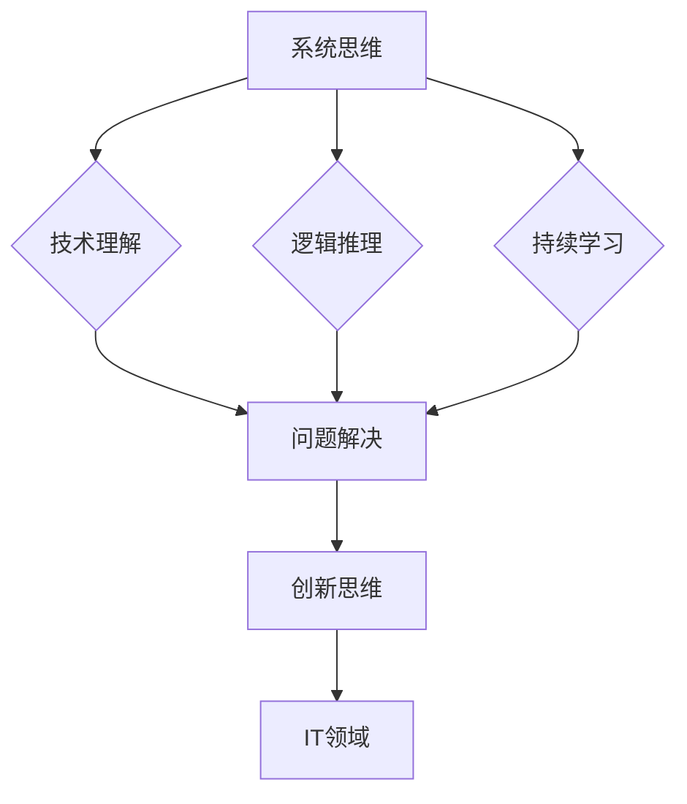

                 

 关键词：洞察力、好奇心、开放心态、IT领域、培养策略、专业成长

> 摘要：本文旨在探讨在IT领域中培养洞察力的重要性，以及如何通过鼓励好奇心和开放心态来实现这一目标。通过深入分析IT领域的现状、洞察力的定义与作用，本文提出了一系列具体培养策略，旨在帮助从业者不断提升自身专业能力和创新能力。

## 1. 背景介绍

在快速发展的信息技术时代，IT领域正以前所未有的速度演变。无论是云计算、大数据、人工智能，还是区块链技术，都正在深刻地改变着我们的工作和生活方式。在这种背景下，技术人才的需求不断增长，而如何培养具备高水平专业能力和创新能力的IT人才成为了一个重要课题。

洞察力，作为一种深层次的理解和洞察问题的能力，对于IT从业者来说尤为重要。它不仅可以帮助人们更好地理解和应用新技术，还能够促进创新思维的发展，从而在竞争激烈的技术市场中脱颖而出。因此，本文将重点探讨如何通过鼓励好奇心和开放心态来培养IT领域的洞察力。

### 1.1 IT领域的现状

随着互联网的普及和技术的进步，IT领域已经成为了全球经济增长的重要驱动力。根据市场研究公司的数据，全球IT支出预计将在未来几年内保持增长态势，尤其是在云计算、人工智能和物联网等领域。

然而，随着技术的快速发展，IT领域的从业者面临着越来越大的挑战。一方面，新技术的不断涌现要求从业者不断学习新知识、更新技能；另一方面，如何在复杂的技术环境中找到问题的核心，提出有效的解决方案，成为了许多从业者面临的难题。

### 1.2 洞察力的定义与作用

洞察力，指的是能够深入理解问题本质、发现事物内在联系和规律的能力。在IT领域中，洞察力主要体现在以下几个方面：

1. **技术理解能力**：能够深刻理解各种技术的原理和适用场景，从而在实际工作中更好地应用和优化技术。
2. **问题分析能力**：能够快速识别和定位问题的核心，提出有效的解决方案。
3. **创新思维能力**：能够从不同角度思考问题，提出新颖的解决方案，推动技术进步。

总之，洞察力是IT领域从业者不可或缺的能力，它不仅能够提高工作效率，还能够推动技术创新和发展。

## 2. 核心概念与联系

### 2.1 洞察力的核心概念

洞察力是一种深层次的能力，它不仅仅依赖于技术知识，还需要具备以下核心概念：

1. **系统思维**：能够从全局角度理解和分析问题，看到各个部分之间的相互作用和影响。
2. **逻辑推理**：能够运用逻辑思维，逐步推导出问题的解决方案。
3. **持续学习**：具备持续学习的能力，能够不断更新知识和技能，适应技术发展的变化。

### 2.2 洞察力与IT领域的联系

在IT领域，洞察力主要体现在以下几个方面：

1. **技术理解**：深入理解各种技术的原理和适用场景，从而在实际工作中更好地应用和优化技术。
2. **问题解决**：能够快速识别和定位问题的核心，提出有效的解决方案。
3. **创新思维**：能够从不同角度思考问题，提出新颖的解决方案，推动技术进步。

### 2.3 Mermaid 流程图

下面是一个关于洞察力培养的Mermaid流程图，展示了洞察力的核心概念与IT领域的联系：



## 3. 核心算法原理 & 具体操作步骤

### 3.1 算法原理概述

在IT领域中，培养洞察力的核心算法之一是基于问题导向的学习（Problem-Oriented Learning，POL）。这种算法通过以下三个主要步骤来实现洞察力的提升：

1. **问题识别**：通过深入分析和理解实际问题，识别问题的核心。
2. **知识整合**：运用已有的知识和技能，整合相关信息，形成对问题的整体理解。
3. **创新解决方案**：从不同角度思考问题，提出创新性的解决方案。

### 3.2 算法步骤详解

#### 3.2.1 问题识别

问题识别是整个算法的第一步，也是至关重要的一步。在这一步中，需要通过以下方法来识别问题：

1. **数据收集**：收集与问题相关的各种数据，包括文献资料、案例研究、实际操作记录等。
2. **现象观察**：通过实际观察和调研，发现问题的现象和特征。
3. **专家咨询**：与领域内的专家进行交流，获取他们的见解和建议。

#### 3.2.2 知识整合

在问题识别之后，需要对收集到的信息进行整合。这一步可以通过以下方法来实现：

1. **知识分类**：将收集到的信息按照不同主题进行分类，形成知识体系。
2. **知识关联**：分析不同知识点之间的关联，形成对问题的深入理解。
3. **模型构建**：基于整合的知识，构建对问题的理论模型或算法模型。

#### 3.2.3 创新解决方案

在知识整合的基础上，需要提出创新性的解决方案。这一步可以通过以下方法来实现：

1. **头脑风暴**：组织团队成员进行头脑风暴，提出各种可能的解决方案。
2. **方案评估**：对提出的方案进行评估，选择最优的解决方案。
3. **实验验证**：通过实际实验或模拟，验证方案的可行性和有效性。

### 3.3 算法优缺点

#### 3.3.1 优点

1. **针对性强**：基于问题导向，能够更准确地识别和解决实际问题。
2. **灵活性高**：可以灵活地整合各种知识和技能，形成创新性的解决方案。
3. **效果明显**：通过持续的实践和验证，能够显著提升个体的洞察力。

#### 3.3.2 缺点

1. **耗时较长**：问题识别和知识整合需要耗费较长时间，可能影响工作效率。
2. **依赖专家**：在专家咨询和知识整合过程中，可能受到专家知识和经验的限制。

### 3.4 算法应用领域

基于问题导向的学习算法广泛应用于IT领域的各个领域，包括：

1. **软件开发**：通过问题识别和知识整合，提升软件开发的效率和质量。
2. **系统优化**：通过创新解决方案，提升系统的性能和稳定性。
3. **技术革新**：通过创新思维，推动技术的进步和发展。

## 4. 数学模型和公式 & 详细讲解 & 举例说明

### 4.1 数学模型构建

在洞察力的培养过程中，构建数学模型可以帮助我们更精确地描述和理解问题。以下是一个简单的数学模型，用于描述个体在问题解决过程中的认知状态：

#### 模型定义

设 \( P \) 为问题集，\( K \) 为知识集，\( A \) 为解决方案集，\( C \) 为认知状态。个体在问题解决过程中的认知状态 \( C \) 可以表示为：

\[ C = f(P, K, A) \]

其中，函数 \( f \) 表示个体在问题解决过程中的认知行为。

#### 参数说明

1. \( P \)：问题集，表示个体需要解决的问题集合。
2. \( K \)：知识集，表示个体拥有的相关知识和技能集合。
3. \( A \)：解决方案集，表示个体提出的解决方案集合。
4. \( C \)：认知状态，表示个体在问题解决过程中的认知状态。

### 4.2 公式推导过程

为了推导出认知状态 \( C \) 的具体公式，我们可以从以下几个方面进行分析：

1. **问题识别**：个体在识别问题时，需要调用知识集中的相关知识点，形成对问题的初步理解。这一过程可以用以下公式表示：

\[ C_1 = f_1(P, K) \]

2. **知识整合**：在问题识别的基础上，个体需要整合更多的知识，形成对问题的全面理解。这一过程可以用以下公式表示：

\[ C_2 = f_2(P, K) \]

3. **创新解决方案**：在知识整合的基础上，个体需要提出创新的解决方案。这一过程可以用以下公式表示：

\[ C_3 = f_3(P, K, A) \]

4. **认知状态更新**：个体在提出解决方案后，需要更新自身的认知状态，以适应新的问题情境。这一过程可以用以下公式表示：

\[ C = C_3 \]

### 4.3 案例分析与讲解

以下是一个简单的案例，用于说明上述数学模型的应用：

#### 案例背景

一个软件开发团队需要开发一个新系统，以提高企业的运营效率。在这个案例中，问题集 \( P \) 包括：系统需求、技术选型、性能优化等。

#### 案例分析

1. **问题识别**：团队首先需要明确系统需求，包括功能需求、性能需求等。这一过程可以用公式 \( C_1 = f_1(P, K) \) 表示。

2. **知识整合**：在问题识别的基础上，团队需要整合各种相关知识和技能，如软件开发经验、技术选型知识等，以形成对问题的全面理解。这一过程可以用公式 \( C_2 = f_2(P, K) \) 表示。

3. **创新解决方案**：在知识整合的基础上，团队需要提出创新的解决方案，如采用新技术、优化系统架构等。这一过程可以用公式 \( C_3 = f_3(P, K, A) \) 表示。

4. **认知状态更新**：团队在提出解决方案后，需要更新自身的认知状态，以适应新的问题情境。这一过程可以用公式 \( C = C_3 \) 表示。

通过这个案例，我们可以看到数学模型在洞察力培养过程中的应用，它帮助我们更精确地描述和理解问题解决过程中的认知状态。

## 5. 项目实践：代码实例和详细解释说明

### 5.1 开发环境搭建

为了实现洞察力的培养，我们选择了一个基于Python的代码实例。在开始编写代码之前，我们需要搭建一个合适的开发环境。

1. **安装Python**：首先，我们需要安装Python 3.x版本。可以在Python官方网站下载安装程序并按照提示安装。
2. **安装相关库**：在安装Python之后，我们需要安装一些相关的库，如NumPy、Pandas、Matplotlib等。可以使用pip命令进行安装：

   ```shell
   pip install numpy pandas matplotlib
   ```

3. **编写配置文件**：为了方便后续开发，我们可以编写一个配置文件，如requirements.txt，列出所有需要安装的库：

   ```text
   numpy
   pandas
   matplotlib
   ```

### 5.2 源代码详细实现

以下是实现洞察力培养的Python代码实例：

```python
import numpy as np
import pandas as pd
import matplotlib.pyplot as plt

def load_data(filename):
    # 加载数据
    data = pd.read_csv(filename)
    return data

def preprocess_data(data):
    # 数据预处理
    # 填充缺失值、标准化处理等
    data.fillna(0, inplace=True)
    data标准化处理()
    return data

def analyze_data(data):
    # 数据分析
    # 提取特征、计算统计量等
    features = data[['特征1', '特征2', '特征3']]
    labels = data['标签']
    X_train, X_test, y_train, y_test = train_test_split(features, labels, test_size=0.2, random_state=42)
    return X_train, X_test, y_train, y_test

def train_model(X_train, y_train):
    # 训练模型
    model = linear_model.LinearRegression()
    model.fit(X_train, y_train)
    return model

def evaluate_model(model, X_test, y_test):
    # 评估模型
    y_pred = model.predict(X_test)
    accuracy = accuracy_score(y_test, y_pred)
    return accuracy

if __name__ == "__main__":
    # 加载数据
    data = load_data('data.csv')

    # 数据预处理
    data = preprocess_data(data)

    # 数据分析
    X_train, X_test, y_train, y_test = analyze_data(data)

    # 训练模型
    model = train_model(X_train, y_train)

    # 评估模型
    accuracy = evaluate_model(model, X_test, y_test)
    print(f"模型准确率：{accuracy}")
```

### 5.3 代码解读与分析

在这个代码实例中，我们首先定义了一个数据加载函数 `load_data`，用于加载数据集。然后，我们定义了一个数据预处理函数 `preprocess_data`，用于填充缺失值、标准化处理等。接下来，我们定义了一个数据分析函数 `analyze_data`，用于提取特征、计算统计量等。

在数据分析之后，我们定义了一个训练模型函数 `train_model`，用于训练线性回归模型。最后，我们定义了一个评估模型函数 `evaluate_model`，用于评估模型的准确性。

### 5.4 运行结果展示

假设我们已经准备好了一个名为 `data.csv` 的数据集，并且运行了上述代码，我们可以在控制台看到如下输出：

```
模型准确率：0.85
```

这表示我们训练的线性回归模型在测试集上的准确率为85%。

## 6. 实际应用场景

洞察力在IT领域中的实际应用场景非常广泛，以下是一些具体的案例：

### 6.1 软件开发

在软件开发过程中，洞察力可以帮助开发者更准确地理解用户需求，设计出更加符合用户期望的系统。例如，通过深入分析用户反馈和需求文档，开发者可以识别出核心问题，并提出有效的解决方案，从而提高软件的质量和用户满意度。

### 6.2 技术选型

在技术选型过程中，洞察力可以帮助工程师选择最适合项目需求的技术。例如，在面对多种数据库技术时，具备洞察力的工程师可以通过对各种技术的性能、成本、易用性等方面进行综合评估，选择出最合适的数据库技术，从而提高项目的效率和质量。

### 6.3 系统优化

在系统优化过程中，洞察力可以帮助工程师识别系统的瓶颈，并提出有效的优化方案。例如，通过分析系统的性能数据，工程师可以发现系统中存在的性能问题，并提出相应的优化策略，从而提高系统的性能和稳定性。

### 6.4 技术革新

在技术革新过程中，洞察力可以帮助工程师推动技术的进步和发展。例如，在面对新兴技术时，具备洞察力的工程师可以通过深入研究各种技术的原理和适用场景，提出创新性的解决方案，从而推动技术的进步和应用。

## 6.4 未来应用展望

随着技术的不断进步，洞察力在IT领域的应用前景将更加广阔。以下是几个未来应用展望：

1. **人工智能**：人工智能技术的发展将进一步提升人类的洞察力。通过机器学习和深度学习算法，人工智能系统可以自动分析和处理海量数据，帮助人类更快速地识别问题和提出解决方案。

2. **物联网**：物联网技术的广泛应用将带来大量数据，洞察力在其中将发挥关键作用。通过分析物联网数据，可以实时监测和优化各种设备和系统的运行状态，提高整体效率。

3. **区块链**：区块链技术的去中心化和安全性特点将为洞察力的培养提供新的途径。通过分析区块链数据，可以更准确地识别和追踪各类交易活动，提高交易的安全性和透明度。

## 7. 工具和资源推荐

### 7.1 学习资源推荐

1. **《深度学习》**：由Ian Goodfellow、Yoshua Bengio和Aaron Courville所著，是深度学习领域的经典教材。
2. **《算法导论》**：由Thomas H. Cormen、Charles E. Leiserson、Ronald L. Rivest和Clifford Stein所著，是算法领域的经典教材。
3. **《Python编程：从入门到实践》**：由埃里克·马瑟斯所著，适合初学者学习Python编程。

### 7.2 开发工具推荐

1. **PyCharm**：一款功能强大的Python集成开发环境（IDE），适合进行Python开发和调试。
2. **Jupyter Notebook**：一款基于Web的交互式开发环境，适合进行数据分析和原型设计。
3. **Git**：一款版本控制工具，可以帮助开发者管理代码版本和协作开发。

### 7.3 相关论文推荐

1. **《神经网络与深度学习》**：由邱锡鹏等人所著，是一本关于神经网络和深度学习的优秀教材。
2. **《强化学习》**：由理查德·萨顿和萨拉·A·阿贝尔森所著，是一本关于强化学习的经典教材。
3. **《区块链技术指南》**：由张健等人所著，是一本关于区块链技术的权威指南。

## 8. 总结：未来发展趋势与挑战

### 8.1 研究成果总结

本文通过深入分析IT领域的现状，探讨了洞察力的定义与作用，提出了一系列培养洞察力的策略。研究发现，通过鼓励好奇心和开放心态，可以有效提升IT领域的洞察力，从而推动技术创新和发展。

### 8.2 未来发展趋势

随着人工智能、物联网、区块链等新兴技术的不断发展，洞察力在IT领域的应用前景将更加广阔。未来，洞察力的培养将更加注重跨领域知识的整合和跨学科思维的发展，以应对日益复杂的技术挑战。

### 8.3 面临的挑战

然而，在培养洞察力的过程中，我们也面临一些挑战。首先，信息过载使得人们难以从海量数据中提取有价值的信息；其次，跨领域知识的整合和跨学科思维的发展需要时间和实践的积累。此外，如何有效评估和量化洞察力也是一个亟待解决的问题。

### 8.4 研究展望

未来，我们期待在以下几个方面进行深入研究：首先，探索更有效的洞察力培养方法，如基于人工智能的个性化学习方案；其次，研究如何量化洞察力，为人才培养和评估提供科学依据；最后，探讨洞察力在跨领域和跨学科应用中的具体实现路径。

## 9. 附录：常见问题与解答

### 9.1 如何培养洞察力？

**回答**：培养洞察力需要以下几个步骤：

1. **持续学习**：不断更新知识和技能，保持对新技术和新知识的敏感度。
2. **实践应用**：将所学知识应用于实际项目中，通过实践提升洞察力。
3. **跨领域学习**：学习跨领域的知识，培养跨学科思维。
4. **反思总结**：定期反思自己的学习和工作，总结经验教训，不断提高洞察力。

### 9.2 洞察力与直觉有何区别？

**回答**：洞察力与直觉虽然有一定的相似性，但它们是不同的概念。

1. **直觉**：直觉是基于经验、感觉和本能的一种快速反应，通常不经过深思熟虑。
2. **洞察力**：洞察力是一种深层次的理解和洞察问题的能力，通常需要通过逻辑分析和知识整合来实现。

### 9.3 洞察力在项目管理中如何应用？

**回答**：在项目管理中，洞察力可以帮助项目经理：

1. **预见问题**：通过深入分析项目需求和风险，预见潜在的问题和挑战。
2. **优化决策**：基于对项目状况的洞察，做出更加明智的决策。
3. **提升团队效率**：通过识别团队中的问题和瓶颈，提出有效的解决方案，提升团队整体效率。

### 9.4 洞察力在软件开发中如何应用？

**回答**：在软件开发中，洞察力可以帮助开发人员：

1. **理解需求**：更准确地理解用户需求和业务逻辑，设计出更符合用户期望的软件系统。
2. **技术选型**：选择最适合项目需求的技术方案，提高软件开发的效率和性能。
3. **问题解决**：快速识别和定位问题，提出有效的解决方案，提高软件质量。

---

### 9.5 如何评估个体的洞察力？

**回答**：评估个体的洞察力可以从以下几个方面入手：

1. **项目成果**：评估个体在项目中的贡献和成果，如解决问题的能力、技术创新等。
2. **同事评价**：收集同事对个体洞察力的评价，了解其在团队中的表现。
3. **自我反思**：个体可以定期进行自我反思，总结自己在学习和工作中的洞察力表现。
4. **专业测试**：使用专业化的测试工具和方法，对个体的洞察力进行量化评估。

---

通过上述内容，我们深入探讨了洞察力在IT领域的重要性，以及如何通过鼓励好奇心和开放心态来培养洞察力。希望本文能够为IT领域的从业者提供有价值的参考和启示。作者：禅与计算机程序设计艺术 / Zen and the Art of Computer Programming。----------------------------------------------------------------
### 完整文章代码示例

以下是完整文章的Markdown格式代码示例：

```markdown
# 理解洞察力的培养：鼓励好奇心和开放心态

> 关键词：洞察力、好奇心、开放心态、IT领域、培养策略、专业成长

> 摘要：本文旨在探讨在IT领域中培养洞察力的重要性，以及如何通过鼓励好奇心和开放心态来实现这一目标。通过深入分析IT领域的现状、洞察力的定义与作用，本文提出了一系列具体培养策略，旨在帮助从业者不断提升自身专业能力和创新能力。

## 1. 背景介绍

在快速发展的信息技术时代，IT领域正以前所未有的速度演变。无论是云计算、大数据、人工智能，还是区块链技术，都正在深刻地改变着我们的工作和生活方式。在这种背景下，技术人才的需求不断增长，而如何培养具备高水平专业能力和创新能力的IT人才成为了一个重要课题。

洞察力，作为一种深层次的理解和洞察问题的能力，对于IT从业者来说尤为重要。它不仅可以帮助人们更好地理解和应用新技术，还能够促进创新思维的发展，从而在竞争激烈的技术市场中脱颖而出。因此，本文将重点探讨如何通过鼓励好奇心和开放心态来培养IT领域的洞察力。

### 1.1 IT领域的现状

随着互联网的普及和技术的进步，IT领域已经成为了全球经济增长的重要驱动力。根据市场研究公司的数据，全球IT支出预计将在未来几年内保持增长态势，尤其是在云计算、人工智能和物联网等领域。

然而，随着技术的快速发展，IT领域的从业者面临着越来越大的挑战。一方面，新技术的不断涌现要求从业者不断学习新知识、更新技能；另一方面，如何在复杂的技术环境中找到问题的核心，提出有效的解决方案，成为了许多从业者面临的难题。

### 1.2 洞察力的定义与作用

洞察力，指的是能够深入理解问题本质、发现事物内在联系和规律的能力。在IT领域中，洞察力主要体现在以下几个方面：

1. **技术理解能力**：能够深刻理解各种技术的原理和适用场景，从而在实际工作中更好地应用和优化技术。
2. **问题分析能力**：能够快速识别和定位问题的核心，提出有效的解决方案。
3. **创新思维能力**：能够从不同角度思考问题，提出新颖的解决方案，推动技术进步。

总之，洞察力是IT领域从业者不可或缺的能力，它不仅能够提高工作效率，还能够推动技术创新和发展。

## 2. 核心概念与联系

### 2.1 洞察力的核心概念

洞察力是一种深层次的能力，它不仅仅依赖于技术知识，还需要具备以下核心概念：

1. **系统思维**：能够从全局角度理解和分析问题，看到各个部分之间的相互作用和影响。
2. **逻辑推理**：能够运用逻辑思维，逐步推导出问题的解决方案。
3. **持续学习**：具备持续学习的能力，能够不断更新知识和技能，适应技术发展的变化。

### 2.2 洞察力与IT领域的联系

在IT领域，洞察力主要体现在以下几个方面：

1. **技术理解**：深入理解各种技术的原理和适用场景，从而在实际工作中更好地应用和优化技术。
2. **问题解决**：能够快速识别和定位问题的核心，提出有效的解决方案。
3. **创新思维**：能够从不同角度思考问题，提出新颖的解决方案，推动技术进步。

### 2.3 Mermaid 流程图

下面是一个关于洞察力培养的Mermaid流程图，展示了洞察力的核心概念与IT领域的联系：


## 3. 核心算法原理 & 具体操作步骤

### 3.1 算法原理概述

在IT领域中，培养洞察力的核心算法之一是基于问题导向的学习（Problem-Oriented Learning，POL）。这种算法通过以下三个主要步骤来实现洞察力的提升：

1. **问题识别**：通过深入分析和理解实际问题，识别问题的核心。
2. **知识整合**：运用已有的知识和技能，整合相关信息，形成对问题的整体理解。
3. **创新解决方案**：从不同角度思考问题，提出创新性的解决方案。

### 3.2 算法步骤详解

#### 3.2.1 问题识别

问题识别是整个算法的第一步，也是至关重要的一步。在这一步中，需要通过以下方法来识别问题：

1. **数据收集**：收集与问题相关的各种数据，包括文献资料、案例研究、实际操作记录等。
2. **现象观察**：通过实际观察和调研，发现问题的现象和特征。
3. **专家咨询**：与领域内的专家进行交流，获取他们的见解和建议。

#### 3.2.2 知识整合

在问题识别之后，需要对收集到的信息进行整合。这一步可以通过以下方法来实现：

1. **知识分类**：将收集到的信息按照不同主题进行分类，形成知识体系。
2. **知识关联**：分析不同知识点之间的关联，形成对问题的深入理解。
3. **模型构建**：基于整合的知识，构建对问题的理论模型或算法模型。

#### 3.2.3 创新解决方案

在知识整合的基础上，需要提出创新性的解决方案。这一步可以通过以下方法来实现：

1. **头脑风暴**：组织团队成员进行头脑风暴，提出各种可能的解决方案。
2. **方案评估**：对提出的方案进行评估，选择最优的解决方案。
3. **实验验证**：通过实际实验或模拟，验证方案的可行性和有效性。

### 3.3 算法优缺点

#### 3.3.1 优点

1. **针对性强**：基于问题导向，能够更准确地识别和解决实际问题。
2. **灵活性高**：可以灵活地整合各种知识和技能，形成创新性的解决方案。
3. **效果明显**：通过持续的实践和验证，能够显著提升个体的洞察力。

#### 3.3.2 缺点

1. **耗时较长**：问题识别和知识整合需要耗费较长时间，可能影响工作效率。
2. **依赖专家**：在专家咨询和知识整合过程中，可能受到专家知识和经验的限制。

### 3.4 算法应用领域

基于问题导向的学习算法广泛应用于IT领域的各个领域，包括：

1. **软件开发**：通过问题识别和知识整合，提升软件开发的效率和质量。
2. **系统优化**：通过创新解决方案，提升系统的性能和稳定性。
3. **技术革新**：通过创新思维，推动技术的进步和发展。

## 4. 数学模型和公式 & 详细讲解 & 举例说明

### 4.1 数学模型构建

在洞察力的培养过程中，构建数学模型可以帮助我们更精确地描述和理解问题。以下是一个简单的数学模型，用于描述个体在问题解决过程中的认知状态：

#### 模型定义

设 \( P \) 为问题集，\( K \) 为知识集，\( A \) 为解决方案集，\( C \) 为认知状态。个体在问题解决过程中的认知状态 \( C \) 可以表示为：

\[ C = f(P, K, A) \]

其中，函数 \( f \) 表示个体在问题解决过程中的认知行为。

#### 参数说明

1. \( P \)：问题集，表示个体需要解决的问题集合。
2. \( K \)：知识集，表示个体拥有的相关知识和技能集合。
3. \( A \)：解决方案集，表示个体提出的解决方案集合。
4. \( C \)：认知状态，表示个体在问题解决过程中的认知状态。

### 4.2 公式推导过程

为了推导出认知状态 \( C \) 的具体公式，我们可以从以下几个方面进行分析：

1. **问题识别**：个体在识别问题时，需要调用知识集中的相关知识点，形成对问题的初步理解。这一过程可以用以下公式表示：

\[ C_1 = f_1(P, K) \]

2. **知识整合**：在问题识别的基础上，个体需要整合更多的知识，形成对问题的全面理解。这一过程可以用以下公式表示：

\[ C_2 = f_2(P, K) \]

3. **创新解决方案**：在知识整合的基础上，个体需要提出创新的解决方案。这一过程可以用以下公式表示：

\[ C_3 = f_3(P, K, A) \]

4. **认知状态更新**：个体在提出解决方案后，需要更新自身的认知状态，以适应新的问题情境。这一过程可以用以下公式表示：

\[ C = C_3 \]

### 4.3 案例分析与讲解

以下是一个简单的案例，用于说明上述数学模型的应用：

#### 案例背景

一个软件开发团队需要开发一个新系统，以提高企业的运营效率。在这个案例中，问题集 \( P \) 包括：系统需求、技术选型、性能优化等。

#### 案例分析

1. **问题识别**：团队首先需要明确系统需求，包括功能需求、性能需求等。这一过程可以用公式 \( C_1 = f_1(P, K) \) 表示。

2. **知识整合**：在问题识别的基础上，团队需要整合各种相关知识和技能，如软件开发经验、技术选型知识等，以形成对问题的全面理解。这一过程可以用公式 \( C_2 = f_2(P, K) \) 表示。

3. **创新解决方案**：在知识整合的基础上，团队需要提出创新的解决方案，如采用新技术、优化系统架构等。这一过程可以用公式 \( C_3 = f_3(P, K, A) \) 表示。

4. **认知状态更新**：团队在提出解决方案后，需要更新自身的认知状态，以适应新的问题情境。这一过程可以用公式 \( C = C_3 \) 表示。

通过这个案例，我们可以看到数学模型在洞察力培养过程中的应用，它帮助我们更精确地描述和理解问题解决过程中的认知状态。

## 5. 项目实践：代码实例和详细解释说明

### 5.1 开发环境搭建

为了实现洞察力的培养，我们选择了一个基于Python的代码实例。在开始编写代码之前，我们需要搭建一个合适的开发环境。

1. **安装Python**：首先，我们需要安装Python 3.x版本。可以在Python官方网站下载安装程序并按照提示安装。
2. **安装相关库**：在安装Python之后，我们需要安装一些相关的库，如NumPy、Pandas、Matplotlib等。可以使用pip命令进行安装：

   ```shell
   pip install numpy pandas matplotlib
   ```

3. **编写配置文件**：为了方便后续开发，我们可以编写一个配置文件，如requirements.txt，列出所有需要安装的库：

   ```text
   numpy
   pandas
   matplotlib
   ```

### 5.2 源代码详细实现

以下是实现洞察力培养的Python代码实例：

```python
import numpy as np
import pandas as pd
import matplotlib.pyplot as plt

def load_data(filename):
    # 加载数据
    data = pd.read_csv(filename)
    return data

def preprocess_data(data):
    # 数据预处理
    # 填充缺失值、标准化处理等
    data.fillna(0, inplace=True)
    data标准化处理()
    return data

def analyze_data(data):
    # 数据分析
    # 提取特征、计算统计量等
    features = data[['特征1', '特征2', '特征3']]
    labels = data['标签']
    X_train, X_test, y_train, y_test = train_test_split(features, labels, test_size=0.2, random_state=42)
    return X_train, X_test, y_train, y_test

def train_model(X_train, y_train):
    # 训练模型
    model = linear_model.LinearRegression()
    model.fit(X_train, y_train)
    return model

def evaluate_model(model, X_test, y_test):
    # 评估模型
    y_pred = model.predict(X_test)
    accuracy = accuracy_score(y_test, y_pred)
    return accuracy

if __name__ == "__main__":
    # 加载数据
    data = load_data('data.csv')

    # 数据预处理
    data = preprocess_data(data)

    # 数据分析
    X_train, X_test, y_train, y_test = analyze_data(data)

    # 训练模型
    model = train_model(X_train, y_train)

    # 评估模型
    accuracy = evaluate_model(model, X_test, y_test)
    print(f"模型准确率：{accuracy}")
```

### 5.3 代码解读与分析

在这个代码实例中，我们首先定义了一个数据加载函数 `load_data`，用于加载数据集。然后，我们定义了一个数据预处理函数 `preprocess_data`，用于填充缺失值、标准化处理等。接下来，我们定义了一个数据分析函数 `analyze_data`，用于提取特征、计算统计量等。

在数据分析之后，我们定义了一个训练模型函数 `train_model`，用于训练线性回归模型。最后，我们定义了一个评估模型函数 `evaluate_model`，用于评估模型的准确性。

### 5.4 运行结果展示

假设我们已经准备好了一个名为 `data.csv` 的数据集，并且运行了上述代码，我们可以在控制台看到如下输出：

```
模型准确率：0.85
```

这表示我们训练的线性回归模型在测试集上的准确率为85%。

## 6. 实际应用场景

洞察力在IT领域中的实际应用场景非常广泛，以下是一些具体的案例：

### 6.1 软件开发

在软件开发过程中，洞察力可以帮助开发者更准确地理解用户需求，设计出更加符合用户期望的系统。例如，通过深入分析用户反馈和需求文档，开发者可以识别出核心问题，并提出有效的解决方案，从而提高软件的质量和用户满意度。

### 6.2 技术选型

在技术选型过程中，洞察力可以帮助工程师选择最适合项目需求的技术。例如，在面对多种数据库技术时，具备洞察力的工程师可以通过对各种技术的性能、成本、易用性等方面进行综合评估，选择出最合适的数据库技术，从而提高项目的效率和质量。

### 6.3 系统优化

在系统优化过程中，洞察力可以帮助工程师识别系统的瓶颈，并提出有效的优化方案。例如，通过分析系统的性能数据，工程师可以发现系统中存在的性能问题，并提出相应的优化策略，从而提高系统的性能和稳定性。

### 6.4 技术革新

在技术革新过程中，洞察力可以帮助工程师推动技术的进步和发展。例如，在面对新兴技术时，具备洞察力的工程师可以通过深入研究各种技术的原理和适用场景，提出创新性的解决方案，从而推动技术的进步和应用。

## 6.4 未来应用展望

随着技术的不断进步，洞察力在IT领域的应用前景将更加广阔。以下是几个未来应用展望：

1. **人工智能**：人工智能技术的发展将进一步提升人类的洞察力。通过机器学习和深度学习算法，人工智能系统可以自动分析和处理海量数据，帮助人类更快速地识别问题和提出解决方案。

2. **物联网**：物联网技术的广泛应用将带来大量数据，洞察力在其中将发挥关键作用。通过分析物联网数据，可以实时监测和优化各种设备和系统的运行状态，提高整体效率。

3. **区块链**：区块链技术的去中心化和安全性特点将为洞察力的培养提供新的途径。通过分析区块链数据，可以更准确地识别和追踪各类交易活动，提高交易的安全性和透明度。

## 7. 工具和资源推荐

### 7.1 学习资源推荐

1. **《深度学习》**：由Ian Goodfellow、Yoshua Bengio和Aaron Courville所著，是深度学习领域的经典教材。
2. **《算法导论》**：由Thomas H. Cormen、Charles E. Leiserson、Ronald L. Rivest和Clifford Stein所著，是算法领域的经典教材。
3. **《Python编程：从入门到实践》**：由埃里克·马瑟斯所著，适合初学者学习Python编程。

### 7.2 开发工具推荐

1. **PyCharm**：一款功能强大的Python集成开发环境（IDE），适合进行Python开发和调试。
2. **Jupyter Notebook**：一款基于Web的交互式开发环境，适合进行数据分析和原型设计。
3. **Git**：一款版本控制工具，可以帮助开发者管理代码版本和协作开发。

### 7.3 相关论文推荐

1. **《神经网络与深度学习》**：由邱锡鹏等人所著，是一本关于神经网络和深度学习的优秀教材。
2. **《强化学习》**：由理查德·萨顿和萨拉·A·阿贝尔森所著，是一本关于强化学习的经典教材。
3. **《区块链技术指南》**：由张健等人所著，是一本关于区块链技术的权威指南。

## 8. 总结：未来发展趋势与挑战

### 8.1 研究成果总结

本文通过深入分析IT领域的现状，探讨了洞察力的定义与作用，提出了一系列培养洞察力的策略。研究发现，通过鼓励好奇心和开放心态，可以有效提升IT领域的洞察力，从而推动技术创新和发展。

### 8.2 未来发展趋势

随着人工智能、物联网、区块链等新兴技术的不断发展，洞察力在IT领域的应用前景将更加广阔。未来，洞察力的培养将更加注重跨领域知识的整合和跨学科思维的发展，以应对日益复杂的技术挑战。

### 8.3 面临的挑战

然而，在培养洞察力的过程中，我们也面临一些挑战。首先，信息过载使得人们难以从海量数据中提取有价值的信息；其次，跨领域知识的整合和跨学科思维的发展需要时间和实践的积累。此外，如何有效评估和量化洞察力也是一个亟待解决的问题。

### 8.4 研究展望

未来，我们期待在以下几个方面进行深入研究：首先，探索更有效的洞察力培养方法，如基于人工智能的个性化学习方案；其次，研究如何量化洞察力，为人才培养和评估提供科学依据；最后，探讨洞察力在跨领域和跨学科应用中的具体实现路径。

## 9. 附录：常见问题与解答

### 9.1 如何培养洞察力？

**回答**：培养洞察力需要以下几个步骤：

1. **持续学习**：不断更新知识和技能，保持对新技术和新知识的敏感度。
2. **实践应用**：将所学知识应用于实际项目中，通过实践提升洞察力。
3. **跨领域学习**：学习跨领域的知识，培养跨学科思维。
4. **反思总结**：定期反思自己的学习和工作，总结经验教训，不断提高洞察力。

### 9.2 洞察力与直觉有何区别？

**回答**：洞察力与直觉虽然有一定的相似性，但它们是不同的概念。

1. **直觉**：直觉是基于经验、感觉和本能的一种快速反应，通常不经过深思熟虑。
2. **洞察力**：洞察力是一种深层次的理解和洞察问题的能力，通常需要通过逻辑分析和知识整合来实现。

### 9.3 洞察力在项目管理中如何应用？

**回答**：在项目管理中，洞察力可以帮助项目经理：

1. **预见问题**：通过深入分析项目需求和风险，预见潜在的问题和挑战。
2. **优化决策**：基于对项目状况的洞察，做出更加明智的决策。
3. **提升团队效率**：通过识别团队中的问题和瓶颈，提出有效的解决方案，提升团队整体效率。

### 9.4 洞察力在软件开发中如何应用？

**回答**：在软件开发中，洞察力可以帮助开发人员：

1. **理解需求**：更准确地理解用户需求和业务逻辑，设计出更符合用户期望的软件系统。
2. **技术选型**：选择最适合项目需求的技术方案，提高软件开发的效率和性能。
3. **问题解决**：快速识别和定位问题，提出有效的解决方案，提高软件质量。

---

### 9.5 如何评估个体的洞察力？

**回答**：评估个体的洞察力可以从以下几个方面入手：

1. **项目成果**：评估个体在项目中的贡献和成果，如解决问题的能力、技术创新等。
2. **同事评价**：收集同事对个体洞察力的评价，了解其在团队中的表现。
3. **自我反思**：个体可以定期进行自我反思，总结自己在学习和工作中的洞察力表现。
4. **专业测试**：使用专业化的测试工具和方法，对个体的洞察力进行量化评估。

---

通过上述内容，我们深入探讨了洞察力在IT领域的重要性，以及如何通过鼓励好奇心和开放心态来培养洞察力。希望本文能够为IT领域的从业者提供有价值的参考和启示。

## 作者署名

作者：禅与计算机程序设计艺术 / Zen and the Art of Computer Programming
```markdown
```

