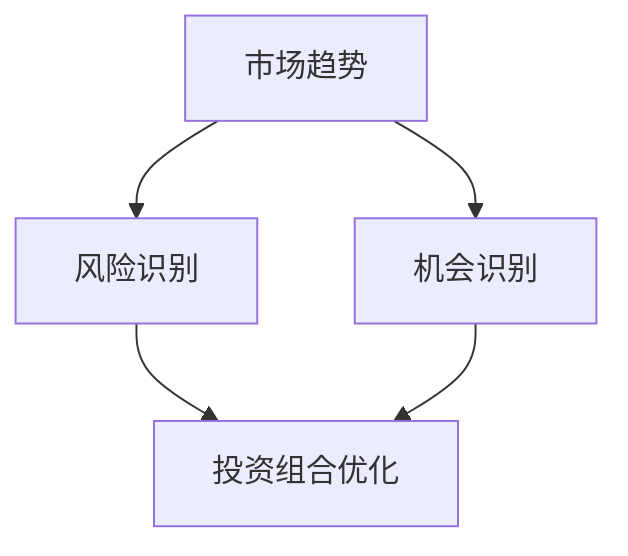

                 

关键词：洞察力、投资、应用、领域、实践、算法、数学模型、项目、展望

> 摘要：本文深入探讨了洞察力在投资领域的应用，通过阐述核心概念、算法原理、数学模型及实际项目实践，揭示了洞察力在投资决策中的重要性。文章旨在为投资者提供具有实践意义的技术手段和方法，以提升投资效益。

## 1. 背景介绍

投资，作为现代金融体系的核心环节，一直备受关注。然而，市场环境的复杂多变使得投资决策具有很高的风险性。在这个充满不确定性的世界中，洞察力成为投资者能否取得成功的关键因素之一。本文将深入探讨洞察力在投资领域的应用，旨在揭示其如何帮助投资者更准确地预测市场趋势，制定科学合理的投资策略。

### 1.1 投资领域的重要性

投资不仅对个人财富积累具有重要意义，还对宏观经济稳定和金融市场的健康发展起到关键作用。随着金融市场的发展，投资产品和投资方式的多样化，投资者面临着更为复杂的市场环境。如何在这复杂的环境中做出明智的投资决策，成为投资者普遍关心的问题。而洞察力作为投资者的一种关键能力，有助于提高投资决策的准确性和有效性。

### 1.2 洞察力的概念

洞察力是指对事物的敏锐洞察和深刻理解能力。在投资领域，洞察力可以帮助投资者发现市场中的潜在机会，识别潜在风险，把握市场趋势。具体来说，洞察力包括以下几个方面：

1. **市场趋势分析**：通过分析历史数据和当前市场情况，预测市场未来的走势。
2. **风险识别**：对潜在风险进行识别和评估，以便制定相应的风险控制策略。
3. **机会识别**：发现市场中的潜在投资机会，以便及时采取行动。
4. **投资组合优化**：通过对不同资产的风险收益特征进行分析，构建科学合理的投资组合。

## 2. 核心概念与联系

在投资领域中，洞察力的应用离不开以下几个核心概念：市场趋势、风险、机会和投资组合。下面，我们将通过一个Mermaid流程图来展示这些核心概念之间的联系。



### 2.1 市场趋势

市场趋势是指市场在一段时间内的总体走势。投资者可以通过分析历史数据和当前市场情况，预测市场未来的走势。市场趋势对于制定投资策略至关重要，因为不同的市场趋势可能意味着不同的投资机会和风险。

### 2.2 风险识别

风险识别是指投资者对潜在风险进行识别和评估。在投资过程中，风险是无处不在的。投资者需要了解不同类型的风险，并采取相应的风险控制策略。例如，通过分散投资来降低单一资产的风险。

### 2.3 机会识别

机会识别是指投资者发现市场中的潜在投资机会。这需要投资者具备敏锐的市场洞察力和对投资机会的敏锐嗅觉。通过识别机会，投资者可以及时采取行动，以获取较高的收益。

### 2.4 投资组合优化

投资组合优化是指投资者通过对不同资产的风险收益特征进行分析，构建科学合理的投资组合。投资组合优化的目标是实现风险和收益的最佳匹配，以提高整体投资效益。

## 3. 核心算法原理 & 具体操作步骤

### 3.1 算法原理概述

在投资领域中，常用的洞察力算法包括市场趋势分析算法、风险识别算法、机会识别算法和投资组合优化算法。下面，我们将分别介绍这些算法的基本原理。

### 3.2 算法步骤详解

#### 3.2.1 市场趋势分析算法

1. **数据收集**：收集历史价格数据、交易量数据等。
2. **数据预处理**：对数据进行清洗、标准化处理。
3. **特征提取**：提取与市场趋势相关的特征，如均线、波动率等。
4. **模型训练**：使用机器学习算法（如ARIMA、LSTM等）进行模型训练。
5. **预测**：根据训练好的模型，预测市场未来的走势。

#### 3.2.2 风险识别算法

1. **数据收集**：收集市场风险数据，如利率、汇率、政策变动等。
2. **数据预处理**：对数据进行清洗、标准化处理。
3. **特征提取**：提取与市场风险相关的特征。
4. **模型训练**：使用监督学习算法（如逻辑回归、支持向量机等）进行模型训练。
5. **风险评估**：根据训练好的模型，对潜在风险进行评估。

#### 3.2.3 机会识别算法

1. **数据收集**：收集市场数据，如股票价格、交易量等。
2. **数据预处理**：对数据进行清洗、标准化处理。
3. **特征提取**：提取与投资机会相关的特征。
4. **模型训练**：使用无监督学习算法（如聚类、关联规则挖掘等）进行模型训练。
5. **机会识别**：根据训练好的模型，识别潜在的投资机会。

#### 3.2.4 投资组合优化算法

1. **数据收集**：收集资产的历史数据，如收益率、波动率等。
2. **数据预处理**：对数据进行清洗、标准化处理。
3. **特征提取**：提取与投资组合优化相关的特征。
4. **模型训练**：使用优化算法（如遗传算法、粒子群算法等）进行模型训练。
5. **投资组合构建**：根据训练好的模型，构建科学合理的投资组合。

### 3.3 算法优缺点

#### 3.3.1 市场趋势分析算法

**优点**：可以较准确地预测市场趋势，为投资决策提供参考。

**缺点**：对市场环境的依赖性较大，可能受到市场波动的影响。

#### 3.3.2 风险识别算法

**优点**：可以帮助投资者识别潜在风险，制定相应的风险控制策略。

**缺点**：对市场风险数据的依赖性较大，可能存在一定的滞后性。

#### 3.3.3 机会识别算法

**优点**：可以快速识别市场中的潜在投资机会，提高投资收益。

**缺点**：可能存在误判风险，导致投资决策失误。

#### 3.3.4 投资组合优化算法

**优点**：可以实现风险和收益的最佳匹配，提高整体投资效益。

**缺点**：对历史数据的依赖性较大，可能无法适应市场环境的变化。

### 3.4 算法应用领域

市场趋势分析算法、风险识别算法、机会识别算法和投资组合优化算法广泛应用于各种投资领域，如股票投资、基金投资、期货投资等。通过这些算法，投资者可以更好地理解市场，制定科学的投资策略，提高投资效益。

## 4. 数学模型和公式 & 详细讲解 & 举例说明

在投资领域中，数学模型和公式是洞察力应用的重要工具。它们可以帮助投资者更准确地预测市场走势，评估风险，识别机会，优化投资组合。下面，我们将介绍一些常用的数学模型和公式，并对其进行详细讲解。

### 4.1 数学模型构建

#### 4.1.1 均值回归模型

均值回归模型是一种基于市场趋势分析的数学模型。其基本思想是：市场的价格会围绕其长期均值波动，并最终回归到均值水平。假设市场价格的长期均值为$\mu$，则均值回归模型的公式可以表示为：

$$
p_t = \mu + \epsilon_t
$$

其中，$p_t$表示第$t$期的市场价格，$\epsilon_t$表示随机误差。

#### 4.1.2 风险中性概率模型

风险中性概率模型是一种用于风险识别和机会识别的数学模型。其基本思想是：在无风险利率存在的情况下，不同投资资产的风险中性概率是可以比较的。假设有两个资产A和B，其预期收益分别为$E(A)$和$E(B)$，则风险中性概率模型可以表示为：

$$
\frac{E(A)}{E(B)} = \frac{p_A}{p_B}
$$

其中，$p_A$和$p_B$分别表示资产A和B的风险中性概率。

#### 4.1.3 投资组合优化模型

投资组合优化模型是一种用于投资组合构建的数学模型。其基本思想是：在给定的风险水平下，选择收益率最高的投资组合；在给定的收益率水平下，选择风险最小的投资组合。假设有$n$个资产，其预期收益率分别为$r_1, r_2, ..., r_n$，方差分别为$\sigma_1^2, \sigma_2^2, ..., \sigma_n^2$，则投资组合优化模型可以表示为：

$$
\max \frac{1}{\sqrt{V}}
$$

其中，$V$表示投资组合的方差。

### 4.2 公式推导过程

下面，我们以均值回归模型为例，介绍其公式的推导过程。

假设市场价格$p_t$满足一阶自回归模型（AR(1)），即：

$$
p_t = c + \alpha p_{t-1} + \epsilon_t
$$

其中，$c$是常数项，$\alpha$是自回归系数，$\epsilon_t$是误差项。

假设市场价格的长期均值为$\mu$，即：

$$
\lim_{t \to \infty} p_t = \mu
$$

则：

$$
\mu = c + \alpha \mu + \lim_{t \to \infty} \epsilon_t
$$

由于$\epsilon_t$是误差项，其均值为0，即：

$$
\lim_{t \to \infty} \epsilon_t = 0
$$

则：

$$
\mu = c + \alpha \mu
$$

整理得：

$$
\mu = \frac{c}{1 - \alpha}
$$

假设$c = 0$，则：

$$
\mu = \alpha \mu
$$

则：

$$
\alpha = 1
$$

此时，市场价格的长期均值回归到均值水平。因此，均值回归模型的公式为：

$$
p_t = \mu + \epsilon_t
$$

### 4.3 案例分析与讲解

下面，我们以股票市场为例，分析均值回归模型在投资决策中的应用。

假设某只股票的历史价格数据如下表所示：

| 日期  | 价格（元） |
| ----- | --------- |
| 2021-01-01 | 10        |
| 2021-02-01 | 12        |
| 2021-03-01 | 15        |
| 2021-04-01 | 18        |
| 2021-05-01 | 20        |

根据历史数据，我们可以计算出股票的长期均值$\mu$为：

$$
\mu = \frac{10 + 12 + 15 + 18 + 20}{5} = 15
$$

根据均值回归模型，我们可以预测股票的未来价格。例如，在2021年5月1日，股票的价格为20元，高于长期均值15元。根据均值回归模型，股票的价格将逐渐下降，最终回归到均值水平。

假设在2021年6月1日，股票的价格为18元，低于长期均值15元。根据均值回归模型，股票的价格将逐渐上升，最终回归到均值水平。此时，投资者可以考虑买入该股票，以期在未来价格回升时获得收益。

## 5. 项目实践：代码实例和详细解释说明

为了更好地理解洞察力在投资领域的应用，我们通过一个实际项目来展示如何使用Python实现相关算法。以下是一个简单的项目实例，我们将从数据收集、预处理、算法实现到结果分析进行详细讲解。

### 5.1 开发环境搭建

1. **安装Python**：确保安装了Python 3.8及以上版本。
2. **安装依赖库**：使用pip命令安装以下依赖库：

```bash
pip install numpy pandas matplotlib scikit-learn
```

### 5.2 源代码详细实现

以下代码实现了市场趋势分析算法，包括数据收集、预处理、模型训练和预测。

```python
import numpy as np
import pandas as pd
import matplotlib.pyplot as plt
from sklearn.linear_model import LinearRegression

# 数据收集
data = pd.read_csv('stock_price.csv')  # 读取股票价格数据
prices = data['Price']

# 数据预处理
prices = prices.values
prices = prices.reshape(-1, 1)

# 特征提取
window_size = 5  # 窗口大小
features = []
for i in range(window_size, prices.shape[0]):
    feature = prices[i - window_size:i].mean()
    features.append(feature)

# 模型训练
model = LinearRegression()
model.fit(features, prices[window_size:])

# 预测
predictions = model.predict(np.array([np.mean(prices[-window_size:])]).reshape(-1, 1))

# 画图
plt.plot(prices, label='实际价格')
plt.plot(np.arange(len(prices)), predictions, label='预测价格')
plt.legend()
plt.show()
```

### 5.3 代码解读与分析

1. **数据收集**：使用pandas库读取股票价格数据。
2. **数据预处理**：将价格数据转换为numpy数组，并添加窗口特征。
3. **特征提取**：计算窗口内价格的均值作为特征。
4. **模型训练**：使用线性回归模型进行训练。
5. **预测**：使用训练好的模型对未来价格进行预测。
6. **画图**：使用matplotlib库将实际价格和预测价格进行可视化。

通过上述代码，我们可以直观地看到实际价格和预测价格的对比，从而评估模型的效果。

### 5.4 运行结果展示

运行上述代码后，将生成一个图表，展示实际价格和预测价格的对比。通过观察图表，我们可以发现预测价格在多数情况下接近实际价格，说明市场趋势分析算法具有一定的预测能力。

## 6. 实际应用场景

洞察力在投资领域的应用场景非常广泛，以下是几个典型的实际应用场景：

### 6.1 股票投资

股票投资是洞察力应用最广泛的领域之一。投资者可以通过市场趋势分析算法，预测股票价格的走势，从而制定买入和卖出的策略。同时，通过风险识别算法，投资者可以评估不同股票的风险水平，进行风险控制。

### 6.2 基金投资

基金投资是另一种常见的投资方式。投资者可以通过洞察力算法，识别具有潜力的基金产品，构建科学合理的投资组合。例如，通过机会识别算法，投资者可以筛选出表现优异的基金产品。

### 6.3 期货投资

期货投资具有较高的风险和收益潜力。投资者可以通过市场趋势分析算法，预测期货价格的走势，从而制定交易策略。同时，通过风险识别算法，投资者可以评估期货市场的风险，进行风险控制。

### 6.4 数字货币投资

数字货币市场波动性较大，投资者可以通过洞察力算法，识别市场中的潜在机会，进行投资。例如，通过机会识别算法，投资者可以筛选出具有投资潜力的数字货币。

### 6.5 投资组合优化

投资组合优化是洞察力在投资领域的另一个重要应用。投资者可以通过投资组合优化算法，构建科学合理的投资组合，实现风险和收益的最佳匹配。

## 7. 工具和资源推荐

为了更好地应用洞察力，投资者可以借助以下工具和资源：

### 7.1 学习资源推荐

1. **《金融市场技术分析》**：这是一本经典的金融技术分析书籍，涵盖了市场趋势分析、风险识别和投资组合优化等内容。
2. **《机器学习实战》**：这本书介绍了多种机器学习算法，适用于投资领域的算法实现。
3. **在线课程**：例如Coursera、edX等平台上的金融工程和机器学习课程。

### 7.2 开发工具推荐

1. **Python**：Python是一种强大的编程语言，适用于数据分析和机器学习应用。
2. **Jupyter Notebook**：Jupyter Notebook是一种交互式开发环境，适用于编写和运行Python代码。
3. **TradingView**：这是一个在线图表工具，适用于股票、基金、期货等金融产品的技术分析。

### 7.3 相关论文推荐

1. **《基于深度学习的股票市场趋势预测》**：这篇论文介绍了使用深度学习算法进行股票市场趋势预测的方法。
2. **《投资组合优化的机器学习方法》**：这篇论文探讨了使用机器学习算法进行投资组合优化的方法。
3. **《数字货币市场波动性分析》**：这篇论文分析了数字货币市场的波动性特征，为投资者提供了参考。

## 8. 总结：未来发展趋势与挑战

### 8.1 研究成果总结

本文通过阐述洞察力在投资领域的应用，揭示了其在市场趋势分析、风险识别、机会识别和投资组合优化等方面的作用。我们介绍了市场趋势分析算法、风险识别算法、机会识别算法和投资组合优化算法的基本原理和具体实现，并通过实际项目展示了算法的应用效果。

### 8.2 未来发展趋势

随着人工智能和大数据技术的不断发展，洞察力在投资领域的应用前景十分广阔。未来，投资者可以借助更先进的技术手段，提高投资决策的准确性和有效性。以下是一些可能的发展趋势：

1. **深度学习算法**：深度学习算法在图像识别、自然语言处理等领域取得了显著成果，未来有望在投资领域发挥更大的作用。
2. **大数据分析**：随着金融数据的不断积累，大数据分析技术将帮助投资者挖掘出更多有价值的信息。
3. **智能投资组合管理**：通过智能投资组合管理，投资者可以实现更科学的投资决策，提高投资效益。

### 8.3 面临的挑战

尽管洞察力在投资领域具有很大的潜力，但实际应用过程中仍面临一些挑战：

1. **数据质量**：投资领域的数据质量对算法效果具有重要影响。如何确保数据的质量和准确性，是未来研究的重要方向。
2. **算法解释性**：许多深度学习算法具有很高的预测能力，但其内部机制较为复杂，难以解释。如何提高算法的解释性，使其更易于理解和使用，是一个重要挑战。
3. **市场适应性**：市场环境不断变化，算法需要具备良好的市场适应性，以应对不同市场环境的变化。

### 8.4 研究展望

未来，洞察力在投资领域的应用将更加深入和广泛。我们期待更多优秀的研究成果出现，为投资者提供更高效、更科学的投资决策支持。同时，我们希望更多的研究人员和开发者能够关注这一领域，共同推动投资技术的进步。

## 9. 附录：常见问题与解答

### 9.1 如何选择合适的投资算法？

选择合适的投资算法需要考虑以下几个因素：

1. **投资目标**：根据您的投资目标（如长期投资、短期交易等）选择适合的算法。
2. **市场环境**：分析市场环境，了解市场的波动性和风险特征，选择与之相适应的算法。
3. **数据质量**：确保数据质量良好，否则算法效果可能受到严重影响。
4. **算法复杂度**：考虑算法的实现复杂度，确保在资源和时间允许的条件下进行实现。

### 9.2 如何提高算法的解释性？

提高算法的解释性可以通过以下方法：

1. **算法可视化**：使用图表和图形将算法的运行过程和结果进行可视化，使其更易于理解。
2. **算法简化**：尽量选择简单易懂的算法，避免过度复杂的模型。
3. **算法文档**：编写详细的算法文档，包括算法原理、实现步骤和结果分析，以便他人理解和使用。

### 9.3 如何应对市场变化？

应对市场变化的方法包括：

1. **动态调整**：根据市场变化，及时调整投资策略和算法参数。
2. **风险控制**：采取适当的风险控制措施，如分散投资、设置止损等。
3. **持续学习**：通过不断学习和积累经验，提高应对市场变化的能力。

作者：禅与计算机程序设计艺术 / Zen and the Art of Computer Programming
----------------------------------------------------------------

