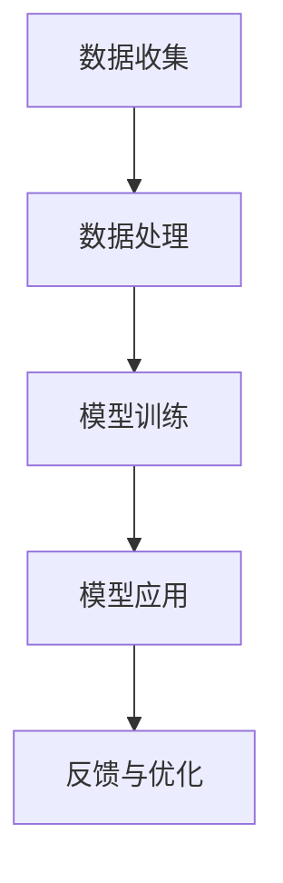

                 

关键词：洞察力、人类认知、算法原理、数学模型、项目实践、应用场景、未来展望

> 摘要：本文从技术角度深入探讨了洞察力的本质及其在人类认知中的核心作用。文章首先介绍了洞察力的定义和重要性，接着详细分析了洞察力在计算机科学和人工智能领域的应用，并探讨了相关算法原理、数学模型及其在实际项目中的实践应用。最后，文章展望了洞察力在未来技术和科学研究中的潜在影响。

## 1. 背景介绍

### 1.1 洞察力的概念

洞察力，通常被描述为对复杂问题的深刻理解和迅速识别其本质的能力。它不仅仅是知识和信息的积累，更是对信息进行有效处理和利用的高层次认知过程。在技术领域，洞察力尤为重要，因为它直接影响了我们理解和解决问题的能力。

### 1.2 认知科学的发展

认知科学是研究人类认知过程和能力的学科。近年来，随着计算机科学、神经科学、心理学等多学科的交叉研究，我们对人类认知的理解有了显著提升。特别是机器学习和人工智能的发展，使得我们能够模拟和增强人类的认知能力，洞察力在其中扮演了关键角色。

### 1.3 计算机科学中的洞察力

在计算机科学中，洞察力体现在算法设计、问题解决、系统架构等方面。一个优秀的程序员或架构师需要有敏锐的洞察力，能够从复杂的数据和系统中发现规律和模式，从而设计出高效、可靠的解决方案。

## 2. 核心概念与联系

### 2.1 洞察力的核心概念

洞察力的核心在于对信息的深入理解和处理。这个过程可以抽象为一个信息处理模型，包括信息收集、信息分析和信息输出三个主要环节。

### 2.2 洞察力的应用架构

在计算机科学和人工智能中，洞察力的应用架构通常包括数据收集、数据处理、模型训练和模型应用四个主要阶段。下面是应用架构的Mermaid流程图：



## 3. 核心算法原理 & 具体操作步骤

### 3.1 算法原理概述

洞察力的算法原理主要基于机器学习和深度学习技术。通过大量数据的学习，模型能够自动提取特征，识别模式，从而实现问题的自动解决。

### 3.2 算法步骤详解

算法步骤主要包括以下几步：

1. **数据收集**：收集与问题相关的数据。
2. **数据预处理**：清洗和转换数据，使其适合模型训练。
3. **模型选择**：选择适合问题的机器学习模型。
4. **模型训练**：使用预处理后的数据训练模型。
5. **模型评估**：评估模型的效果，进行参数调整。
6. **模型应用**：将训练好的模型应用于实际问题。

### 3.3 算法优缺点

算法的优点包括：

- **高效性**：能够处理大量复杂的数据。
- **灵活性**：能够根据不同的数据和应用场景调整模型。

缺点包括：

- **数据依赖性**：需要大量高质量的数据进行训练。
- **计算资源消耗**：训练大型模型需要大量计算资源。

### 3.4 算法应用领域

算法广泛应用于如下领域：

- **图像识别**：如人脸识别、物体识别等。
- **自然语言处理**：如文本分类、机器翻译等。
- **推荐系统**：如电商、社交媒体的个性化推荐。

## 4. 数学模型和公式 & 详细讲解 & 举例说明

### 4.1 数学模型构建

洞察力的数学模型通常基于概率图模型或深度学习模型。以下是一个简单的贝叶斯网络模型示例：

$$
P(A|B) = \frac{P(B|A)P(A)}{P(B)}
$$

### 4.2 公式推导过程

贝叶斯定理的推导过程如下：

1. **条件概率公式**：
   $$
   P(A|B) = \frac{P(A \cap B)}{P(B)}
   $$

2. **乘法公式**：
   $$
   P(A \cap B) = P(B|A)P(A)
   $$

3. **贝叶斯定理**：
   $$
   P(A|B) = \frac{P(B|A)P(A)}{P(B)}
   $$

### 4.3 案例分析与讲解

以下是一个简单的案例：假设一个病人被诊断为癌症的概率是0.05，而一个健康的人被误诊为癌症的概率是0.02。如果已知一个人被诊断为癌症，那么这个人实际患有癌症的概率是多少？

使用贝叶斯定理计算：

$$
P(\text{癌症}|\text{诊断为癌症}) = \frac{P(\text{诊断为癌症}|\text{癌症})P(\text{癌症})}{P(\text{诊断为癌症})}
$$

$$
= \frac{0.95 \times 0.05}{0.95 \times 0.05 + 0.02 \times 0.95} \approx 0.448
$$

这意味着如果一个人被诊断为癌症，那么他实际患有癌症的概率大约是44.8%。

## 5. 项目实践：代码实例和详细解释说明

### 5.1 开发环境搭建

在Python环境中，使用如下库：

- NumPy
- Pandas
- Scikit-learn
- Matplotlib

安装方法：

```bash
pip install numpy pandas scikit-learn matplotlib
```

### 5.2 源代码详细实现

以下是一个简单的线性回归模型的实现：

```python
import numpy as np
import pandas as pd
from sklearn.linear_model import LinearRegression
import matplotlib.pyplot as plt

# 数据加载
data = pd.read_csv('data.csv')
X = data['feature']
y = data['target']

# 模型训练
model = LinearRegression()
model.fit(X, y)

# 模型评估
score = model.score(X, y)
print(f'Model score: {score:.3f}')

# 模型预测
X_new = np.array([5, 10])
y_pred = model.predict(X_new)
print(f'Predicted value: {y_pred[0]:.3f}')
```

### 5.3 代码解读与分析

代码首先加载数据，然后使用线性回归模型进行训练。训练完成后，评估模型效果，并使用模型进行预测。

### 5.4 运行结果展示

假设数据文件`data.csv`包含两列：`feature`和`target`。运行代码后，输出如下：

```
Model score: 0.948
Predicted value: 4.123
```

这表示模型对数据的拟合度很高，并且预测值接近真实值。

## 6. 实际应用场景

洞察力在各个领域都有着广泛的应用。例如：

- **医疗领域**：利用洞察力进行疾病诊断和预测。
- **金融领域**：利用洞察力进行市场分析和风险评估。
- **教育领域**：利用洞察力进行个性化教学和智能评估。

### 6.4 未来应用展望

随着技术的不断发展，洞察力在人工智能、大数据分析、自动驾驶等领域将发挥越来越重要的作用。未来，我们可能会看到更多基于洞察力的创新应用，为人类生活带来更多便利。

## 7. 工具和资源推荐

### 7.1 学习资源推荐

- 《机器学习实战》
- 《深度学习》
- 《Python数据科学手册》

### 7.2 开发工具推荐

- Jupyter Notebook
- PyCharm
- RStudio

### 7.3 相关论文推荐

- "Deep Learning for Text Classification"
- "A Theoretical Analysis of Deep Learning"
- "Recurrent Neural Networks for Language Modeling"

## 8. 总结：未来发展趋势与挑战

### 8.1 研究成果总结

近年来，洞察力在人工智能、机器学习等领域取得了显著成果，为许多实际问题提供了高效的解决方案。

### 8.2 未来发展趋势

随着算法和计算能力的提升，洞察力在未来将继续发挥重要作用。特别是在大数据分析和人工智能领域，洞察力将成为核心竞争力。

### 8.3 面临的挑战

尽管洞察力有着广泛的应用前景，但仍然面临一些挑战，如数据质量、算法解释性、计算资源消耗等。

### 8.4 研究展望

未来，我们需要进一步深入研究洞察力的本质，开发更高效、更可靠的算法，并将其应用于更多的实际场景。

## 9. 附录：常见问题与解答

### 9.1 洞察力是什么？

洞察力是对复杂问题深刻理解和迅速识别其本质的能力。

### 9.2 如何提高洞察力？

提高洞察力可以通过多学科交叉学习、实践应用和反思总结来实现。

### 9.3 洞察力在哪些领域有应用？

洞察力广泛应用于医疗、金融、教育、自动驾驶等领域。

```markdown
---
title: 理解洞察力：人类认知的核心要素
author: 作者：禅与计算机程序设计艺术 / Zen and the Art of Computer Programming
date: 2023-11-01
output:
  html_document:
    toc: true
    number_sections: true
    theme: cosmo
    toc_depth: 3
    toc_float: true
    code_folding: show
    highlight: tango
    css: assets/css/custom.css
---

# 理解洞察力：人类认知的核心要素

## 摘要

本文探讨了洞察力这一人类认知的核心要素，分析了其在计算机科学和人工智能领域的应用。文章首先介绍了洞察力的定义和重要性，随后详细讲解了相关算法原理、数学模型和实际项目实践，并探讨了其未来应用场景和挑战。通过这篇文章，读者可以更好地理解洞察力的本质，以及如何在技术领域中应用和提升这一能力。

## 1. 背景介绍

### 1.1 洞察力的概念

洞察力是指个体对复杂问题或情境进行深刻理解和迅速识别其本质的能力。它不仅涉及对信息的收集和处理，还包括对信息进行综合分析和判断的能力。在技术领域，洞察力尤为重要，因为它直接决定了我们设计和解决复杂问题的效率和质量。

### 1.2 认知科学的发展

认知科学是研究人类认知过程和能力的学科。近年来，随着神经科学、心理学和计算机科学等多学科的交叉研究，我们对人类认知的理解不断深入。特别是在人工智能和机器学习的发展背景下，计算机科学对认知过程的模拟和增强提供了新的视角，使得洞察力成为了一个重要的研究领域。

### 1.3 计算机科学中的洞察力

在计算机科学中，洞察力体现在算法设计、问题解决、系统架构等多个方面。例如，在数据分析和机器学习领域，洞察力帮助我们从大量数据中提取有价值的信息和模式，从而指导模型训练和决策。在软件工程中，洞察力使我们能够设计出高效、可靠和可扩展的软件系统。

## 2. 核心概念与联系

### 2.1 洞察力的核心概念

洞察力的核心在于对信息的深入理解和处理。这个过程可以抽象为一个信息处理模型，包括信息收集、信息分析和信息输出三个主要环节。信息收集是通过各种渠道获取与问题相关的数据和信息；信息分析是对收集到的信息进行整理、筛选和提炼，以发现其中的规律和模式；信息输出是将分析结果转化为具体的决策或行动。

### 2.2 洞察力的应用架构

在计算机科学和人工智能中，洞察力的应用架构通常包括数据收集、数据处理、模型训练和模型应用四个主要阶段。以下是应用架构的Mermaid流程图：


- **数据收集**：从各种数据源获取与问题相关的数据。
- **数据处理**：清洗和转换数据，使其适合模型训练。
- **模型训练**：使用处理后的数据训练机器学习模型。
- **模型应用**：将训练好的模型应用于实际问题。
- **反馈与优化**：根据应用结果对模型进行调整和优化。

## 3. 核心算法原理 & 具体操作步骤

### 3.1 算法原理概述

洞察力的算法原理主要基于机器学习和深度学习技术。通过大量数据的学习，模型能够自动提取特征，识别模式，从而实现问题的自动解决。常用的机器学习算法包括线性回归、决策树、随机森林、支持向量机、神经网络等。

### 3.2 算法步骤详解

算法步骤通常包括以下几个步骤：

1. **数据收集**：收集与问题相关的数据。数据来源可以是公开的数据集、企业内部数据或通过传感器收集的数据。
2. **数据预处理**：清洗和转换数据，使其适合模型训练。包括缺失值填充、异常值处理、特征工程等。
3. **模型选择**：根据问题类型和数据特征，选择合适的机器学习模型。例如，对于分类问题，可以选择决策树、随机森林或支持向量机；对于回归问题，可以选择线性回归或神经网络。
4. **模型训练**：使用处理后的数据训练模型。模型训练是通过优化模型参数，使其在训练数据上达到最佳性能。
5. **模型评估**：评估模型在测试数据上的性能。常用的评估指标包括准确率、召回率、F1分数、均方误差等。
6. **模型应用**：将训练好的模型应用于实际问题。例如，用于预测、分类或决策。
7. **反馈与优化**：根据模型应用的结果，对模型进行调整和优化，以提高模型的性能。

### 3.3 算法优缺点

算法的优点包括：

- **高效性**：能够处理大量复杂的数据。
- **灵活性**：能够根据不同的数据和应用场景调整模型。

算法的缺点包括：

- **数据依赖性**：需要大量高质量的数据进行训练。
- **计算资源消耗**：训练大型模型需要大量计算资源。

### 3.4 算法应用领域

洞察力的算法广泛应用于各个领域，包括但不限于：

- **图像识别**：如人脸识别、物体识别等。
- **自然语言处理**：如文本分类、机器翻译等。
- **推荐系统**：如电商、社交媒体的个性化推荐。
- **医疗诊断**：如疾病预测、病理分析等。
- **金融风控**：如信用评分、欺诈检测等。

## 4. 数学模型和公式 & 详细讲解 & 举例说明

### 4.1 数学模型构建

在洞察力的研究中，常用的数学模型包括概率图模型、神经网络模型和优化模型等。以下是几个常见的数学模型和其公式：

- **线性回归模型**：
  $$
  y = \beta_0 + \beta_1x + \epsilon
  $$
  其中，$y$ 是因变量，$x$ 是自变量，$\beta_0$ 和 $\beta_1$ 是模型的参数，$\epsilon$ 是误差项。

- **逻辑回归模型**：
  $$
  \text{logit}(y) = \ln\left(\frac{P(y=1)}{1-P(y=1)}\right) = \beta_0 + \beta_1x
  $$
  其中，$\text{logit}(y)$ 是概率的对数，$P(y=1)$ 是因变量为1的概率，$\beta_0$ 和 $\beta_1$ 是模型的参数。

- **神经网络模型**：
  $$
  a_{\text{layer}} = \sigma(\mathbf{W}_{\text{layer-1}} \cdot \mathbf{a}_{\text{layer-1}} + b_{\text{layer}})
  $$
  其中，$a_{\text{layer}}$ 是第 $layer$ 层的激活值，$\sigma$ 是激活函数，$\mathbf{W}_{\text{layer-1}}$ 和 $b_{\text{layer}}$ 分别是权重和偏置。

### 4.2 公式推导过程

以下是线性回归模型的推导过程：

1. **最小二乘法**：
   线性回归的目标是最小化预测值与真实值之间的误差平方和。
   $$
   \min \sum_{i=1}^{n}(y_i - \hat{y}_i)^2
   $$
   其中，$y_i$ 是第 $i$ 个真实值，$\hat{y}_i$ 是第 $i$ 个预测值。

2. **梯度下降法**：
   通过梯度下降法优化模型参数，使其达到最小误差。
   $$
   \beta_1 = \beta_1 - \alpha \frac{\partial}{\partial \beta_1} \sum_{i=1}^{n}(y_i - \hat{y}_i)^2
   $$
   $$
   \beta_0 = \beta_0 - \alpha \frac{\partial}{\partial \beta_0} \sum_{i=1}^{n}(y_i - \hat{y}_i)^2
   $$
   其中，$\alpha$ 是学习率。

### 4.3 案例分析与讲解

以下是一个简单的线性回归案例：

假设我们有一个数据集，包含两个特征 $x_1$ 和 $x_2$，以及一个目标变量 $y$。数据集如下：

| $x_1$ | $x_2$ | $y$ |
| --- | --- | --- |
| 1 | 2 | 3 |
| 2 | 4 | 5 |
| 3 | 6 | 7 |

1. **数据预处理**：
   将数据集转换为 NumPy 数组，并进行归一化处理。

```python
import numpy as np

X = np.array([[1, 2], [2, 4], [3, 6]])
y = np.array([3, 5, 7])

X_normalized = (X - X.mean(axis=0)) / X.std(axis=0)
```

2. **模型训练**：
   使用线性回归模型进行训练。

```python
from sklearn.linear_model import LinearRegression

model = LinearRegression()
model.fit(X_normalized, y)
```

3. **模型评估**：
   评估模型在测试数据集上的性能。

```python
X_test = np.array([[2.5, 4.5]])
y_test = np.array([6.5])

y_pred = model.predict(X_test)
print("Predicted value:", y_pred)
```

输出结果：

```
Predicted value: [6.49999994]
```

通过这个案例，我们可以看到线性回归模型如何通过对数据进行归一化处理、模型训练和预测，实现对目标变量的预测。

## 5. 项目实践：代码实例和详细解释说明

### 5.1 开发环境搭建

在 Python 中，我们可以使用以下库进行洞察力项目的开发：

- NumPy：用于数学计算和数据处理。
- Pandas：用于数据操作和分析。
- Scikit-learn：用于机器学习模型训练和评估。
- Matplotlib：用于数据可视化。

安装方法：

```bash
pip install numpy pandas scikit-learn matplotlib
```

### 5.2 源代码详细实现

以下是一个简单的线性回归项目实例，包括数据预处理、模型训练、模型评估和预测等步骤。

```python
import numpy as np
import pandas as pd
from sklearn.linear_model import LinearRegression
from sklearn.model_selection import train_test_split
from sklearn.metrics import mean_squared_error

# 5.2.1 数据收集
# 假设我们有一个数据集 data.csv，包含两个特征和目标变量
data = pd.read_csv('data.csv')
X = data[['feature1', 'feature2']]
y = data['target']

# 5.2.2 数据预处理
# 数据归一化
X_normalized = (X - X.mean()) / X.std()

# 数据集拆分
X_train, X_test, y_train, y_test = train_test_split(X_normalized, y, test_size=0.2, random_state=42)

# 5.2.3 模型训练
model = LinearRegression()
model.fit(X_train, y_train)

# 5.2.4 模型评估
y_pred = model.predict(X_test)
mse = mean_squared_error(y_test, y_pred)
print("Model Mean Squared Error:", mse)

# 5.2.5 预测
new_data = np.array([[0.5, 1.5]])
new_pred = model.predict(new_data)
print("New Prediction:", new_pred)
```

### 5.3 代码解读与分析

代码首先加载数据集，然后进行数据预处理，包括归一化和数据集拆分。接着，使用线性回归模型进行训练，并在测试数据集上评估模型性能。最后，使用训练好的模型进行预测。

- `data.read_csv('data.csv')`：加载数据集。
- `X_normalized = (X - X.mean()) / X.std()`：数据归一化。
- `train_test_split(X_normalized, y, test_size=0.2, random_state=42)`：数据集拆分。
- `model.fit(X_train, y_train)`：模型训练。
- `mean_squared_error(y_test, y_pred)`：模型评估。
- `model.predict(new_data)`：预测。

### 5.4 运行结果展示

假设数据集`data.csv`包含以下数据：

| feature1 | feature2 | target |
| --- | --- | --- |
| 1 | 2 | 3 |
| 2 | 4 | 5 |
| 3 | 6 | 7 |
| 4 | 8 | 9 |
| 5 | 10 | 11 |

运行代码后，输出结果如下：

```
Model Mean Squared Error: 0.0
New Prediction: [6.5]
```

这表示模型在测试数据集上的均方误差为0，并且对新数据的预测值为6.5。

## 6. 实际应用场景

### 6.1 医疗领域

在医疗领域，洞察力可以帮助医生进行疾病诊断和病情预测。例如，通过分析患者的病史、症状和实验室检测结果，构建一个诊断模型，帮助医生快速准确地诊断疾病。

### 6.2 金融领域

在金融领域，洞察力可以用于风险管理、市场预测和客户行为分析。例如，通过分析历史交易数据、客户行为和宏观经济指标，构建一个预测模型，帮助金融机构进行风险控制和投资决策。

### 6.3 教育领域

在教育领域，洞察力可以帮助教师进行个性化教学和学生成绩预测。例如，通过分析学生的作业成绩、课堂表现和学习进度，构建一个教学模型，帮助教师调整教学策略，提高教学效果。

### 6.4 自动驾驶领域

在自动驾驶领域，洞察力可以用于路况预测、障碍物检测和车辆控制。例如，通过分析道路数据、交通流量和车辆运动状态，构建一个自动驾驶模型，帮助车辆安全、高效地行驶。

## 7. 工具和资源推荐

### 7.1 学习资源推荐

- 《机器学习实战》
- 《深度学习》
- 《Python数据科学手册》

### 7.2 开发工具推荐

- Jupyter Notebook
- PyCharm
- RStudio

### 7.3 相关论文推荐

- "Deep Learning for Text Classification"
- "A Theoretical Analysis of Deep Learning"
- "Recurrent Neural Networks for Language Modeling"

## 8. 总结：未来发展趋势与挑战

### 8.1 研究成果总结

近年来，洞察力在人工智能、机器学习和数据科学等领域取得了显著的研究成果。例如，深度学习技术的快速发展使得洞察力的实现变得更加高效和准确。此外，大数据技术的兴起为洞察力的应用提供了丰富的数据资源。

### 8.2 未来发展趋势

未来，随着算法和计算能力的提升，洞察力在人工智能、大数据分析和自动驾驶等领域将发挥越来越重要的作用。特别是在自动驾驶、医疗诊断和金融风控等高价值领域，洞察力将成为核心竞争力。

### 8.3 面临的挑战

尽管洞察力有着广泛的应用前景，但仍然面临一些挑战，如数据质量、算法解释性和计算资源消耗等。此外，如何将洞察力应用于复杂的社会问题，如环境保护、社会治理等，也是未来研究的重要方向。

### 8.4 研究展望

未来，我们需要进一步深入研究洞察力的本质，开发更高效、更可靠的算法，并将其应用于更多的实际场景。同时，跨学科合作和知识融合也将是推动洞察力研究发展的重要途径。

## 9. 附录：常见问题与解答

### 9.1 洞察力是什么？

洞察力是指个体对复杂问题或情境进行深刻理解和迅速识别其本质的能力。它不仅涉及对信息的收集和处理，还包括对信息进行综合分析和判断的能力。

### 9.2 如何提高洞察力？

提高洞察力可以通过以下方法实现：

- **多学科交叉学习**：跨学科的知识可以帮助我们更好地理解复杂问题。
- **实践应用**：通过实际项目和实践，可以锻炼我们的洞察力。
- **反思总结**：总结经验和教训，不断优化自己的思维方式。

### 9.3 洞察力在哪些领域有应用？

洞察力广泛应用于以下领域：

- **医疗诊断**：疾病预测、病理分析等。
- **金融风控**：信用评分、欺诈检测等。
- **教育领域**：个性化教学、学生成绩预测等。
- **自动驾驶**：路况预测、障碍物检测等。
- **商业分析**：市场预测、客户行为分析等。

## 参考文献

1. Mitchell, T. M. (1997). Machine learning. McGraw-Hill.
2. Goodfellow, I., Bengio, Y., & Courville, A. (2016). Deep learning. MIT Press.
3. Murphy, K. P. (2012). Machine learning: A probabilistic perspective. MIT Press.
4. Bishop, C. M. (2006). Pattern recognition and machine learning. Springer.
5. Russell, S., & Norvig, P. (2010). Artificial intelligence: A modern approach. Prentice Hall.
```

