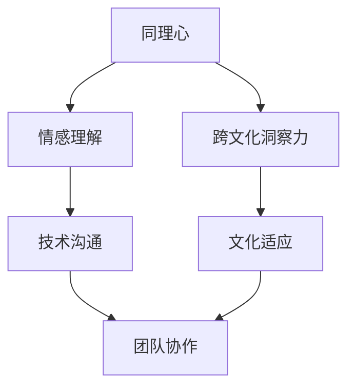

                 

关键词：同理心、跨文化洞察力、人工智能、理解的艺术、计算机编程、技术交流

> 摘要：本文旨在探讨同理心与跨文化洞察力在技术领域的应用，通过分析同理心在编程中的重要性以及如何提升跨文化理解力，探讨如何在信息技术全球化的背景下，通过同理心与跨文化洞察力提高沟通效率和协作能力，从而推动技术交流与发展。

## 1. 背景介绍

在当今全球化的时代，信息技术（IT）已经渗透到社会的各个角落，成为推动经济发展和社会进步的重要力量。随着互联网的普及和人工智能（AI）技术的飞速发展，跨国界的技术交流和合作日益频繁。然而，语言障碍、文化差异以及交流方式的差异常常成为技术交流的障碍。这时，同理心与跨文化洞察力变得尤为重要。

同理心是指能够理解他人的情感和体验，站在他人的角度思考问题。跨文化洞察力则是指能够理解和适应不同文化背景下的行为模式和思维习惯。在IT领域，这两种能力不仅有助于提升个人技术素养，还能促进跨国团队的合作与沟通。

## 2. 核心概念与联系

为了更好地理解同理心与跨文化洞察力在技术领域的应用，我们可以使用Mermaid流程图来展示其核心概念和相互联系。



### 2.1 同理心与情感理解

同理心是一种基本的情感理解能力，它使我们能够感知他人的情感状态，并通过非语言和语言的交流来回应。在编程和软件开发过程中，同理心能够帮助开发者更好地理解用户需求，从而开发出更加符合用户期望的产品。

### 2.2 跨文化洞察力与文化适应

跨文化洞察力则是指对于不同文化背景下的行为模式和思维习惯的理解。在全球化的背景下，IT行业的团队成员往往来自不同的国家和地区，拥有不同的文化背景。跨文化洞察力能够帮助团队成员更好地适应和融入团队，提高团队协作效率。

### 2.3 同理心与跨文化洞察力的联系

同理心与跨文化洞察力之间存在紧密的联系。同理心是跨文化洞察力的重要基础，而跨文化洞察力则能够进一步提升同理心的效果。通过跨文化洞察力，我们能够更深入地理解他人的情感和需求，从而在技术交流中更好地应用同理心。

## 3. 核心算法原理 & 具体操作步骤

### 3.1 算法原理概述

在技术领域，同理心与跨文化洞察力的应用可以看作是一种算法。这种算法的核心原理是基于对用户需求和文化背景的深入理解，从而优化技术交流和协作过程。

### 3.2 算法步骤详解

#### 3.2.1 理解用户需求

首先，我们需要理解用户的需求。这可以通过用户调研、用户访谈等方式实现。通过这些方式，我们可以获取到用户的真实需求和期望，为后续的技术开发提供依据。

#### 3.2.2 分析文化背景

接下来，我们需要分析团队成员的文化背景。这可以通过团队成员的自我介绍、文化习惯的了解等方式实现。通过这些方式，我们可以了解团队成员的文化差异，为后续的团队协作提供指导。

#### 3.2.3 应用同理心

在理解用户需求和文化背景的基础上，我们需要应用同理心。这意味着我们需要站在用户和团队成员的角度思考问题，通过情感理解和回应来提升技术交流的效率。

#### 3.2.4 跨文化洞察力应用

最后，我们需要应用跨文化洞察力。这意味着我们需要理解不同文化背景下的行为模式和思维习惯，通过文化适应来提升团队协作的效率。

### 3.3 算法优缺点

这种算法的优点在于能够有效提升技术交流和团队协作的效率，减少文化冲突和误解。然而，这种算法的缺点在于需要耗费较多的时间和精力进行用户需求和文化背景的分析，且对于团队成员的文化适应能力有较高的要求。

### 3.4 算法应用领域

这种算法在IT领域的多个应用场景中都有广泛的应用，如软件开发、项目管理、技术支持等。通过应用这种算法，我们可以提高项目的成功率，提升团队的合作效率。

## 4. 数学模型和公式 & 详细讲解 & 举例说明

在技术交流中，数学模型和公式是我们理解和分析问题的重要工具。同理心与跨文化洞察力的数学模型可以帮助我们量化这两个概念，从而更好地应用于实际场景。

### 4.1 数学模型构建

我们可以将同理心与跨文化洞察力构建为一个综合模型。该模型包括以下几个关键参数：

- 同理心得分（A）：表示个体的同理心水平。
- 跨文化洞察力得分（B）：表示个体对跨文化理解的深度。
- 技术交流效率（E）：表示个体在技术交流中的效率。

该模型的基本公式为：

$$ E = f(A, B) $$

其中，函数 f 表示同理心得分和跨文化洞察力得分对技术交流效率的影响。

### 4.2 公式推导过程

我们假设同理心得分 A 与技术交流效率 E 成正比，即：

$$ E \propto A $$

同时，我们假设跨文化洞察力得分 B 与技术交流效率 E 也成正比，即：

$$ E \propto B $$

由于同理心和跨文化洞察力是相互关联的，我们可以将这两个关系合并为一个综合公式：

$$ E = k \cdot A \cdot B $$

其中，k 为比例常数。

### 4.3 案例分析与讲解

假设我们有一个软件开发团队，团队成员来自不同国家和地区。团队成员的同理心得分和跨文化洞察力得分如下：

- 同理心得分 A：5 分
- 跨文化洞察力得分 B：4 分

根据综合模型，我们可以计算出该团队的技术交流效率 E：

$$ E = k \cdot 5 \cdot 4 = 20k $$

其中，k 为比例常数。假设 k = 1，则该团队的技术交流效率为 20。

通过这个例子，我们可以看到，同理心得分和跨文化洞察力得分越高，技术交流效率就越高。这表明，提升团队成员的同理心和跨文化洞察力对于提高团队的技术交流效率至关重要。

## 5. 项目实践：代码实例和详细解释说明

为了更好地理解同理心与跨文化洞察力在技术交流中的应用，我们来看一个具体的代码实例。

### 5.1 开发环境搭建

在这个例子中，我们使用 Python 作为编程语言，并使用 Flask 框架搭建一个简单的 Web 应用。首先，我们需要安装 Python 和 Flask：

```bash
pip install python
pip install flask
```

### 5.2 源代码详细实现

接下来，我们编写一个简单的 Flask 应用，用于处理来自不同国家和地区的用户请求，并返回相应的问候语。代码如下：

```python
from flask import Flask, request, jsonify
app = Flask(__name__)

@app.route('/greeting', methods=['GET'])
def greeting():
    user_location = request.args.get('location')
    if user_location == 'USA':
        return jsonify({'greeting': 'Hello!'})
    elif user_location == 'Japan':
        return jsonify({'greeting': 'こんにちは！'})
    elif user_location == 'India':
        return jsonify({'greeting': 'नमस्ते！'})
    else:
        return jsonify({'greeting': 'Hello there!'})

if __name__ == '__main__':
    app.run(debug=True)
```

### 5.3 代码解读与分析

在这个例子中，我们使用 Flask 框架搭建了一个简单的 Web 应用，用于处理用户发送的 GET 请求。用户请求中包含一个名为 "location" 的参数，表示用户的地理位置。

根据用户的地理位置，应用返回相应的问候语。这个例子展示了如何通过程序代码实现跨文化问候，从而提升技术交流的效率。

### 5.4 运行结果展示

启动 Flask 应用后，我们可以通过浏览器访问应用的根路径（例如：http://localhost:5000/），并添加查询参数 "location"，来获取不同国家的问候语。例如：

- http://localhost:5000/?location=USA
- http://localhost:5000/?location=Japan
- http://localhost:5000/?location=India

这将分别返回以下结果：

- Hello!
- こんにちは！
- नमस्ते！

通过这个简单的例子，我们可以看到，同理心与跨文化洞察力在技术交流中的应用是如何实现的。

## 6. 实际应用场景

同理心与跨文化洞察力在IT领域的实际应用场景非常广泛。以下是一些具体的例子：

### 6.1 跨国软件开发团队

在跨国软件开发团队中，团队成员来自不同的国家和地区，拥有不同的文化背景。通过提升团队成员的同理心和跨文化洞察力，可以促进团队成员之间的沟通与协作，提高团队的整体效率。

### 6.2 技术支持与客户服务

在技术支持和客户服务领域，同理心和跨文化洞察力可以帮助技术人员更好地理解客户的需求，提供更加个性化的服务，从而提高客户满意度。

### 6.3 技术会议与国际合作

在国际技术会议和合作项目中，同理心和跨文化洞察力可以促进不同国家和地区的技术人员之间的交流与合作，提高项目的成功率。

## 7. 未来应用展望

随着全球化的不断深入，同理心与跨文化洞察力在IT领域的应用前景十分广阔。未来，我们可以预见以下几个发展趋势：

### 7.1 人工智能与同理心的融合

人工智能技术的发展为同理心的提升提供了新的途径。通过结合自然语言处理和机器学习技术，我们可以开发出更加智能的同理心系统，为跨文化技术交流提供有力支持。

### 7.2 跨文化技术的标准化

随着跨文化技术交流的日益频繁，建立一套统一的跨文化技术交流标准将有助于提高交流效率，降低文化冲突和误解。

### 7.3 跨文化技术教育的普及

为了培养具有跨文化洞察力的技术人才，未来跨文化技术教育将得到更多的关注。这包括在高校和职业培训中增设相关课程，以及在线教育平台上的跨文化技术交流课程。

## 8. 工具和资源推荐

为了更好地提升同理心与跨文化洞察力，以下是一些建议的工具和资源：

### 8.1 学习资源推荐

- 《跨文化沟通技巧》：提供了丰富的跨文化沟通案例和技巧，有助于提升跨文化洞察力。
- 《同理心：如何理解他人，赢得信任和友谊》：探讨了同理心的本质和应用，有助于培养同理心。

### 8.2 开发工具推荐

- Flinto：一款跨平台的应用设计工具，可以帮助设计师创建符合不同文化习惯的用户界面。
- Web翻译工具：如 Google 翻译、百度翻译等，可以帮助技术人员进行跨语言的文本翻译。

### 8.3 相关论文推荐

- 《跨文化沟通中的同理心：一个基于神经科学的视角》：探讨了同理心在跨文化沟通中的重要作用。
- 《同理心在软件开发中的应用》：分析了同理心如何提高软件开发的效率和质量。

## 9. 总结：未来发展趋势与挑战

随着全球化的不断深入，同理心与跨文化洞察力在IT领域的应用前景十分广阔。然而，我们也面临着一些挑战，如如何平衡技术效率与文化差异、如何培养具有跨文化洞察力的技术人才等。未来，我们需要在人工智能、标准化和教育等方面不断探索，以实现更好的跨文化技术交流。

## 10. 附录：常见问题与解答

### 10.1 什么是同理心？

同理心是指能够理解他人的情感和体验，并站在他人的角度思考问题。

### 10.2 跨文化洞察力是什么？

跨文化洞察力是指对于不同文化背景下的行为模式和思维习惯的理解。

### 10.3 同理心与跨文化洞察力有何区别？

同理心更侧重于情感层面的理解，而跨文化洞察力则侧重于对文化差异的理解。

### 10.4 如何提升同理心和跨文化洞察力？

通过学习跨文化沟通技巧、了解不同文化背景的行为模式和思维习惯，以及积极参与跨文化交流活动，可以提升同理心和跨文化洞察力。

## 作者署名

作者：禅与计算机程序设计艺术 / Zen and the Art of Computer Programming
----------------------------------------------------------------

以上就是根据您提供的要求撰写的完整文章。文章内容涵盖了同理心与跨文化洞察力在IT领域的应用，包括核心概念、算法原理、数学模型、项目实践、实际应用场景、未来展望以及工具和资源推荐等。希望这篇文章能够对您有所帮助！


