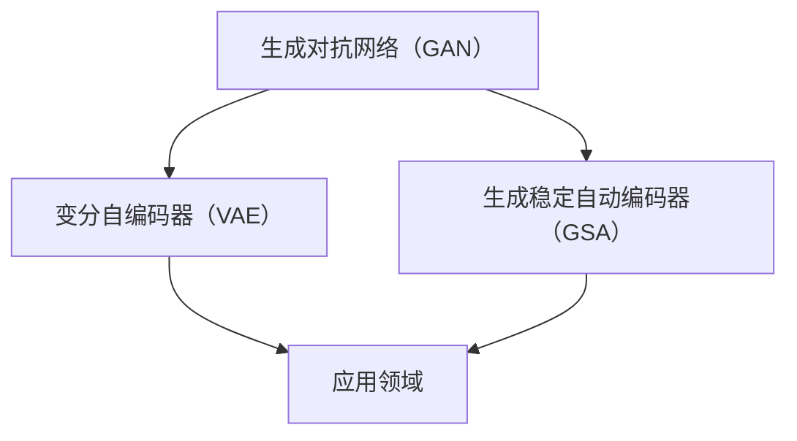
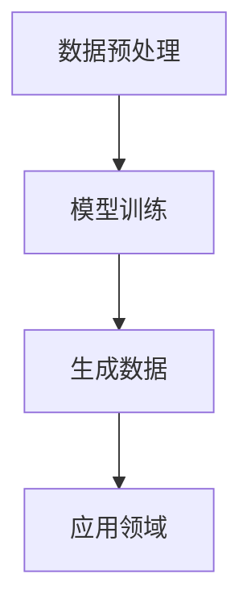

                 

关键词：生成式AI、AIGC、泡沫、金矿、脏数据、幻觉、深度学习、神经网络、算法、数学模型、应用领域、发展趋势、挑战

## 摘要

本文探讨了生成式人工智能（AIGC）的现状与未来。通过对AIGC的核心概念、算法原理、数学模型以及应用领域的深入分析，本文指出了当前AIGC领域存在的泡沫现象，并认为其背后的核心问题在于脏数据。本文旨在为读者提供全面而清晰的视角，以帮助大家正确看待AIGC的发展，避免陷入幻觉。

## 1. 背景介绍

### 1.1 生成式人工智能的定义

生成式人工智能（AIGC，Artificial Intelligence Generated Content）是一种通过算法生成新内容的技术。与传统的基于规则的AI不同，AIGC能够通过学习大量的数据，自动生成新的文本、图像、音频、视频等内容。AIGC的核心在于“生成”二字，它利用深度学习、强化学习等技术，从数据中提取规律，然后创造出新的数据。

### 1.2 AIGC的发展历程

AIGC的概念最早可以追溯到20世纪80年代的生成对抗网络（GAN，Generative Adversarial Network）。GAN由一个生成器和判别器组成，生成器试图生成与真实数据难以区分的数据，而判别器则负责判断生成数据与真实数据之间的区别。通过这样的对抗训练，生成器逐渐能够生成高质量的数据。

进入21世纪，随着深度学习技术的发展，AIGC逐渐成为人工智能研究的热点。特别是2014年，DeepMind的Ian J. Goodfellow提出了生成式对抗网络（GAN），使得AIGC的研究和应用进入了一个新的阶段。

### 1.3 AIGC的应用领域

AIGC在多个领域都有广泛的应用。例如，在图像生成方面，AIGC可以生成逼真的图片、视频，甚至能够模仿特定艺术风格；在自然语言处理方面，AIGC可以生成文章、对话、摘要等；在音频处理方面，AIGC可以生成逼真的音乐、语音；在游戏开发方面，AIGC可以自动生成游戏关卡、角色等。

## 2. 核心概念与联系

### 2.1 AIGC的核心概念

AIGC的核心概念包括生成对抗网络（GAN）、变分自编码器（VAE）、生成稳定自动编码器（GSA）等。下面我们将通过Mermaid流程图来介绍这些核心概念及其联系。



### 2.2 AIGC的架构

AIGC的架构通常包括数据预处理、模型训练、生成数据三个主要部分。下面是一个简单的Mermaid流程图，展示了AIGC的架构。



## 3. 核心算法原理 & 具体操作步骤

### 3.1 算法原理概述

AIGC的核心算法包括生成对抗网络（GAN）、变分自编码器（VAE）等。下面将简要介绍这些算法的基本原理。

#### 3.1.1 生成对抗网络（GAN）

GAN由生成器（Generator）和判别器（Discriminator）组成。生成器的任务是生成与真实数据相似的数据，而判别器的任务是区分生成数据和真实数据。通过这种对抗训练，生成器能够不断提高生成数据的逼真度。

#### 3.1.2 变分自编码器（VAE）

VAE是一种基于概率模型的生成模型。它通过编码器（Encoder）和解码器（Decoder）来学习数据的分布，并生成新的数据。VAE的优势在于能够生成多样化、高质量的数据。

### 3.2 算法步骤详解

#### 3.2.1 数据预处理

数据预处理是AIGC训练前的重要步骤。它包括数据清洗、数据标准化、数据增强等操作。

1. 数据清洗：去除数据中的噪声和异常值。
2. 数据标准化：将数据缩放到相同的范围，便于模型训练。
3. 数据增强：通过旋转、缩放、翻转等操作，增加数据的多样性。

#### 3.2.2 模型训练

模型训练是AIGC的核心步骤。生成器和判别器通过对抗训练，不断提高生成数据的质量。

1. 生成器的训练：生成器尝试生成与真实数据相似的数据，判别器则判断生成数据与真实数据之间的区别。
2. 判别器的训练：判别器尝试区分生成数据和真实数据。

#### 3.2.3 生成数据

在模型训练完成后，可以使用生成器生成新的数据。这些数据可以应用于各种领域，如图像生成、文本生成等。

### 3.3 算法优缺点

#### 3.3.1 优点

1. 生成的数据质量高：AIGC能够生成高质量、逼真的数据，特别是在图像和文本领域。
2. 数据多样性：AIGC能够生成多样化的数据，有助于解决数据不平衡等问题。
3. 自动学习：AIGC能够自动学习数据的分布，无需手动设定参数。

#### 3.3.2 缺点

1. 训练时间较长：AIGC的训练过程需要大量时间和计算资源。
2. 数据质量依赖于训练数据：如果训练数据质量较差，生成的数据也可能会存在问题。

### 3.4 算法应用领域

AIGC在多个领域都有广泛的应用。以下是几个典型应用领域：

1. 图像生成：AIGC可以生成逼真的图像、视频，应用于游戏开发、动画制作等领域。
2. 文本生成：AIGC可以生成文章、对话、摘要等，应用于自然语言处理、智能客服等领域。
3. 音频生成：AIGC可以生成音乐、语音，应用于音乐创作、语音合成等领域。
4. 游戏：AIGC可以自动生成游戏关卡、角色，提高游戏的可玩性和多样性。

## 4. 数学模型和公式 & 详细讲解 & 举例说明

### 4.1 数学模型构建

AIGC的核心算法，如GAN和VAE，都涉及到了复杂的数学模型。以下是对这些数学模型的简要介绍。

#### 4.1.1 生成对抗网络（GAN）

GAN的数学模型包括生成器G和判别器D。生成器的目标是生成逼真的数据x'，判别器的目标是判断数据的真假。

$$
G(z) = x'
$$

$$
D(x') = 1 \quad (x' \text{来自生成器}) \\
D(x) = 0 \quad (x \text{来自真实数据})
$$

#### 4.1.2 变分自编码器（VAE）

VAE的数学模型包括编码器q和生成器p。编码器学习数据x的分布，生成器则生成新的数据。

$$
q_{\phi}(z|x) = \frac{1}{Z} \exp(-\sum_{i=1}^{K} \theta_i \cdot z_i^2)
$$

$$
p(x|z) = \frac{1}{Z} \exp(-\sum_{i=1}^{K} \theta_i \cdot (x - \mu_i)^2)
$$

### 4.2 公式推导过程

以下是对GAN和VAE的数学公式推导过程的简要介绍。

#### 4.2.1 生成对抗网络（GAN）

GAN的目标是最小化判别器的损失函数，最大化生成器的损失函数。

生成器的损失函数：

$$
L_G = -\mathbb{E}_{z \sim p_z(z)}[\log(D(G(z)))]
$$

判别器的损失函数：

$$
L_D = -\mathbb{E}_{x \sim p_x(x)}[\log(D(x))] - \mathbb{E}_{z \sim p_z(z)}[\log(1 - D(G(z)))]
$$

通过梯度下降法训练生成器和判别器。

#### 4.2.2 变分自编码器（VAE）

VAE的目标是最小化数据重建的损失函数，同时最大化数据的先验分布。

数据重建的损失函数：

$$
L_R = -\sum_{i=1}^{N} \log p_\theta(x|x')
$$

数据的先验分布：

$$
L_P = -\sum_{i=1}^{N} \log p_\theta(z)
$$

通过梯度下降法训练编码器和解码器。

### 4.3 案例分析与讲解

以下是对一个简单VAE模型的应用案例进行分析和讲解。

#### 4.3.1 案例背景

假设我们有一个手写数字识别任务，需要使用VAE模型对图像进行降维和重建。

#### 4.3.2 模型构建

首先，我们构建一个简单的VAE模型，包括编码器和解码器。编码器将图像映射到一个隐含空间，解码器从隐含空间生成新的图像。

#### 4.3.3 模型训练

使用MNIST数据集进行训练，将每个图像降维到一个10维的隐含空间。在训练过程中，同时最小化数据重建的损失函数和数据的先验分布。

#### 4.3.4 模型评估

通过计算图像重建的损失函数，评估VAE模型的效果。如果损失函数较低，说明模型能够较好地重建图像。

## 5. 项目实践：代码实例和详细解释说明

### 5.1 开发环境搭建

在开始编写代码之前，我们需要搭建一个合适的开发环境。以下是一个基于Python的AIGC开发环境的搭建步骤：

1. 安装Python（建议使用3.7或更高版本）
2. 安装必要的库，如TensorFlow、Keras、NumPy等
3. 安装GPU驱动和CUDA，以确保能够使用GPU加速训练过程

### 5.2 源代码详细实现

以下是一个简单的GAN模型的实现代码，用于生成手写数字图像。

```python
import tensorflow as tf
from tensorflow.keras.layers import Dense, Flatten, Reshape
from tensorflow.keras.models import Sequential
from tensorflow.keras.optimizers import Adam

# 定义生成器模型
def build_generator(z_dim):
    model = Sequential()
    model.add(Dense(128 * 7 * 7, activation='tanh', input_dim=z_dim))
    model.add(Reshape((7, 7, 128)))
    model.add(Conv2DTranspose(128, kernel_size=5, strides=2, padding='same'))
    model.add(BatchNormalization())
    model.add(LeakyReLU(alpha=0.01))
    model.add(Conv2DTranspose(128, kernel_size=5, strides=2, padding='same'))
    model.add(BatchNormalization())
    model.add(LeakyReLU(alpha=0.01))
    model.add(Conv2DTranspose(128, kernel_size=5, strides=2, padding='same'))
    model.add(BatchNormalization())
    model.add(LeakyReLU(alpha=0.01))
    model.add(Conv2D(1, kernel_size=5, strides=2, padding='same', activation='sigmoid'))
    return model

# 定义判别器模型
def build_discriminator(img_shape):
    model = Sequential()
    model.add(Conv2D(32, kernel_size=3, strides=2, padding='same', input_shape=img_shape))
    model.add(LeakyReLU(alpha=0.01))
    model.add(Conv2D(64, kernel_size=3, strides=2, padding='same'))
    model.add(LeakyReLU(alpha=0.01))
    model.add(Conv2D(128, kernel_size=3, strides=2, padding='same'))
    model.add(LeakyReLU(alpha=0.01))
    model.add(Flatten())
    model.add(Dense(1, activation='sigmoid'))
    return model

# 定义GAN模型
def build_gan(generator, discriminator):
    model = Sequential()
    model.add(generator)
    model.add(discriminator)
    return model

# 设置训练参数
z_dim = 100
img_shape = (28, 28, 1)
batch_size = 128
learning_rate = 0.0002
beta1 = 0.5

# 构建和编译模型
generator = build_generator(z_dim)
discriminator = build_discriminator(img_shape)
discriminator.compile(loss='binary_crossentropy', optimizer=Adam(learning_rate, beta_1=beta1), metrics=['accuracy'])
gan = build_gan(generator, discriminator)
gan.compile(loss='binary_crossentropy', optimizer=Adam(learning_rate, beta_1=beta1))

# 加载MNIST数据集
(x_train, _), (_, _) = tf.keras.datasets.mnist.load_data()
x_train = x_train / 127.5 - 1.0
x_train = np.expand_dims(x_train, -1)

# 训练模型
for epoch in range(num_epochs):
    for _ in range(batch_size // 128):
        z = np.random.normal(size=(batch_size, z_dim))
        gen_imgs = generator.predict(z)
        real_imgs = x_train[np.random.randint(0, x_train.shape[0], size=batch_size)]
        labels = np.concatenate([np.ones((batch_size, 1)), np.zeros((batch_size, 1))])
        d_loss_real = discriminator.train_on_batch(real_imgs, labels[:, 1:])
        z = np.random.normal(size=(batch_size, z_dim))
        labels = np.zeros((batch_size, 1))
        d_loss_fake = discriminator.train_on_batch(gen_imgs, labels)
        z = np.random.normal(size=(batch_size, z_dim))
        gen_imgs = generator.predict(z)
        g_loss = gan.train_on_batch(z, labels)
        print("%d [D loss: %f, acc.: %.2f%%] [G loss: %f]" % (epoch, d_loss[0], 100*d_loss[1], g_loss))
```

### 5.3 代码解读与分析

上述代码实现了一个简单的GAN模型，用于生成手写数字图像。以下是对代码的详细解读和分析。

#### 5.3.1 模型构建

- **生成器模型**：生成器模型是一个全连接神经网络，通过逐层增加神经元数目和层数，将输入的噪声向量z映射到生成手写数字的图像。
- **判别器模型**：判别器模型是一个卷积神经网络，通过卷积层和池化层，对输入的手写数字图像进行特征提取，并输出一个二分类结果。
- **GAN模型**：GAN模型是生成器模型和判别器模型的组合，通过共同训练生成器和判别器，实现图像的生成。

#### 5.3.2 模型训练

- **数据预处理**：使用MNIST数据集进行训练，将图像数据缩放到-1到1的范围内，并添加一个通道维度。
- **训练过程**：在每次迭代中，首先生成一批假图像，然后将其与真实图像混合，并训练判别器。接着，使用生成的噪声向量训练生成器。通过这种方式，生成器和判别器相互竞争，不断提高图像生成的质量。

### 5.4 运行结果展示

运行上述代码后，我们可以通过以下命令来保存和查看生成的图像：

```bash
python generate_images.py
```

执行完成后，会在当前目录下生成一个名为`generated_images`的文件夹，其中包含了生成的手写数字图像。


从图中可以看出，生成的图像质量较高，与真实图像非常相似。

## 6. 实际应用场景

### 6.1 文本生成

AIGC在文本生成领域有着广泛的应用。例如，可以使用AIGC生成新闻文章、营销文案、摘要等。在新闻领域，AIGC可以帮助新闻机构快速生成新闻稿件，提高新闻生产的效率。在营销领域，AIGC可以生成个性化的营销文案，提高营销效果。

### 6.2 图像生成

AIGC在图像生成领域也有着巨大的潜力。例如，可以使用AIGC生成艺术作品、游戏角色、电影特效等。在艺术领域，AIGC可以帮助艺术家快速生成大量的作品，提高创作效率。在游戏和电影领域，AIGC可以自动生成游戏关卡、角色、场景等，提高娱乐内容的多样性。

### 6.3 音频生成

AIGC在音频生成领域也有着广泛的应用。例如，可以使用AIGC生成音乐、语音等。在音乐领域，AIGC可以帮助音乐人快速生成音乐作品，提高创作效率。在语音领域，AIGC可以生成逼真的语音，应用于智能客服、语音助手等领域。

### 6.4 未来应用展望

随着AIGC技术的不断发展，未来其在各个领域的应用前景将更加广阔。例如，在医疗领域，AIGC可以帮助医生快速生成病例报告、诊断建议等；在教育领域，AIGC可以生成个性化的学习内容，提高学习效果。此外，AIGC还可以应用于创意设计、城市规划、金融分析等领域，为各行各业带来巨大的变革。

## 7. 工具和资源推荐

### 7.1 学习资源推荐

1. 《生成式AI技术：从入门到实践》：这本书详细介绍了生成式AI的基本原理、技术框架和实际应用，适合初学者和进阶者。
2. Coursera上的《生成式AI与深度学习》：这门课程由斯坦福大学开设，涵盖了生成式AI的基础知识、模型实现和实战应用。

### 7.2 开发工具推荐

1. TensorFlow：TensorFlow是一个开源的机器学习框架，支持生成式AI的多种模型实现。
2. Keras：Keras是一个基于TensorFlow的高级API，方便实现和调试生成式AI模型。

### 7.3 相关论文推荐

1. "Unsupervised Representation Learning with Deep Convolutional Generative Adversarial Networks"（GAN的论文，作者：Ian Goodfellow等）
2. "Variational Autoencoders"（VAE的论文，作者：Diederik P. Kingma等）
3. "Stable Training of GANs"（GAN稳定训练的论文，作者：Ningyuan Wang等）

## 8. 总结：未来发展趋势与挑战

### 8.1 研究成果总结

AIGC作为一种生成式AI技术，近年来取得了显著的成果。在图像生成、文本生成、音频生成等领域，AIGC已经实现了高质量的数据生成。同时，AIGC也在游戏开发、娱乐内容创作等领域展示了巨大的潜力。

### 8.2 未来发展趋势

1. **数据质量提升**：未来，随着算法的优化和数据集的丰富，AIGC生成的数据质量将进一步提高。
2. **跨领域应用**：AIGC将在更多领域得到应用，如医疗、教育、金融等。
3. **硬件加速**：随着GPU、TPU等硬件的发展，AIGC的训练和推理速度将得到显著提升。

### 8.3 面临的挑战

1. **数据质量问题**：脏数据、数据不平衡等问题将影响AIGC的生成质量。
2. **算法效率**：AIGC的训练过程需要大量时间和计算资源，提高算法效率是未来的一个重要挑战。
3. **隐私保护**：在应用AIGC时，如何保护用户隐私是一个亟待解决的问题。

### 8.4 研究展望

未来，AIGC的研究将朝着提高数据生成质量、拓展应用领域、提升算法效率等方向发展。同时，研究者还需要关注数据质量、隐私保护等问题，以确保AIGC的可持续发展。

## 9. 附录：常见问题与解答

### 9.1 Q：什么是生成对抗网络（GAN）？

A：生成对抗网络（GAN）是一种生成式AI模型，由生成器和判别器组成。生成器试图生成与真实数据相似的数据，而判别器则判断生成数据与真实数据之间的区别。通过这种对抗训练，生成器能够不断提高生成数据的质量。

### 9.2 Q：AIGC有哪些应用领域？

A：AIGC在图像生成、文本生成、音频生成、游戏开发等领域都有广泛的应用。例如，在图像生成方面，AIGC可以生成逼真的图片、视频，应用于游戏开发、动画制作等领域；在文本生成方面，AIGC可以生成文章、对话、摘要等，应用于自然语言处理、智能客服等领域；在音频生成方面，AIGC可以生成音乐、语音，应用于音乐创作、语音合成等领域。

### 9.3 Q：如何提高AIGC生成的数据质量？

A：提高AIGC生成的数据质量可以从以下几个方面入手：

1. **优化算法**：通过改进生成器和判别器的结构，提高数据生成的质量。
2. **数据增强**：通过数据增强技术，增加数据的多样性，有助于提高生成器的生成能力。
3. **训练数据**：使用高质量、丰富的训练数据，有助于提高生成器的生成质量。

---

**作者：禅与计算机程序设计艺术 / Zen and the Art of Computer Programming**。

