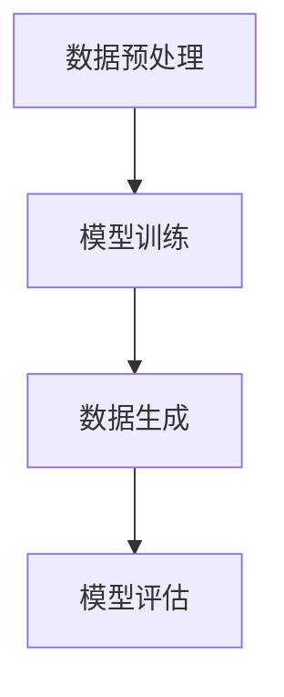

                 

关键词：生成式人工智能、AIGC、商业应用、技术架构、算法原理、数学模型、代码实例、应用场景、发展趋势、挑战与展望

> 摘要：本文旨在深入探讨生成式人工智能（AIGC）的发展现状、核心概念、算法原理及其在商业领域的应用。通过对生成式人工智能的理论基础和实现方法进行详细分析，结合实际项目实践和数学模型的构建，本文将揭示AIGC技术的潜力和面临的挑战，并展望其未来发展趋势。

## 1. 背景介绍

随着互联网的普及和大数据技术的飞速发展，人工智能（AI）技术已经成为推动社会进步的重要力量。在AI技术中，生成式人工智能（AIGC，Generative AI）因其独特的生成能力而备受关注。AIGC技术通过模仿人类创造思维的过程，能够生成图像、文本、音乐、视频等多种形式的内容，从而极大地扩展了人工智能的应用范围。

### 1.1 生成式人工智能的定义

生成式人工智能是一种基于概率模型和深度学习技术的人工智能系统，它能够根据输入的数据生成新的数据。与传统的监督学习和强化学习不同，生成式人工智能不需要大量标注数据进行训练，而是通过学习数据分布来生成新的数据。这种能力使得生成式人工智能在图像、文本、音频等生成任务中具有显著优势。

### 1.2 生成式人工智能的发展历程

生成式人工智能的发展可以追溯到20世纪80年代，当时研究人员开始探索通过生成模型来模拟自然语言和图像。随着深度学习技术的兴起，生成式人工智能取得了重大突破。特别是生成对抗网络（GANs）的出现，使得生成式人工智能在图像生成、文本生成等领域取得了令人瞩目的成果。

### 1.3 生成式人工智能的应用领域

生成式人工智能在多个领域展现了巨大的应用潜力，包括但不限于：

- 图像生成：如艺术作品、人脸合成、场景渲染等。
- 文本生成：如自动写作、对话生成、机器翻译等。
- 音乐生成：如旋律创作、歌词生成等。
- 视频生成：如动作捕捉、视频编辑等。
- 游戏：如虚拟角色创建、游戏剧情生成等。

## 2. 核心概念与联系

为了深入理解生成式人工智能（AIGC）的核心概念，我们需要从原理和架构两方面进行探讨。

### 2.1 核心概念原理

生成式人工智能（AIGC）的核心概念包括：

- **概率分布**：生成模型通过学习数据分布，从而生成新的数据。这种学习过程基于概率模型，如变分自编码器（VAEs）和生成对抗网络（GANs）。

- **生成模型**：生成模型是AIGC的核心，它包括生成器和判别器。生成器负责生成新的数据，判别器负责判断生成数据的真实性和质量。

- **深度学习**：深度学习是生成式人工智能的重要实现方法，通过多层神经网络来学习数据分布和生成新的数据。

### 2.2 架构

生成式人工智能的架构可以分为以下几个部分：

- **数据预处理**：数据预处理是生成式人工智能的第一步，包括数据清洗、归一化、数据增强等。

- **模型训练**：模型训练是生成式人工智能的核心，通过大量数据进行训练，使得生成模型能够学习数据分布。

- **数据生成**：在模型训练完成后，生成模型可以根据输入的数据分布生成新的数据。

- **模型评估**：模型评估用于评估生成模型的质量，包括生成数据的真实性、多样性和质量等。

### 2.3 Mermaid 流程图

下面是生成式人工智能的Mermaid流程图：



### 2.4 核心概念联系

生成式人工智能（AIGC）的核心概念和架构之间有着紧密的联系。数据预处理是模型训练的基础，模型训练是数据生成的关键，而模型评估则是确保生成数据质量的重要手段。这些核心概念共同构成了AIGC的技术体系。

## 3. 核心算法原理 & 具体操作步骤

### 3.1 算法原理概述

生成式人工智能（AIGC）的核心算法主要包括生成对抗网络（GANs）和变分自编码器（VAEs）。下面将详细介绍这两种算法的原理。

### 3.1.1 生成对抗网络（GANs）

生成对抗网络（GANs）是由生成器（Generator）和判别器（Discriminator）两部分组成。生成器的目标是生成与真实数据相近的假数据，而判别器的目标是区分真实数据和生成数据。在训练过程中，生成器和判别器相互竞争，生成器试图生成更加逼真的数据，而判别器则努力提高区分能力。通过这种对抗过程，生成器逐渐提高生成数据的质量。

### 3.1.2 变分自编码器（VAEs）

变分自编码器（VAEs）是一种基于概率模型的生成模型。它由编码器（Encoder）和解码器（Decoder）两部分组成。编码器将输入数据映射到一个潜在空间，而解码器则从潜在空间中生成新的数据。VAEs通过最大化数据分布的对数似然函数来训练模型。

### 3.2 算法步骤详解

下面以生成对抗网络（GANs）为例，详细介绍算法的步骤。

#### 3.2.1 数据预处理

1. 收集大量真实数据，如图像、文本等。
2. 对数据进行清洗、归一化和数据增强。

#### 3.2.2 模型训练

1. 初始化生成器（Generator）和判别器（Discriminator）的参数。
2. 对于每个训练样本，生成器生成假数据，判别器对真实数据和假数据进行分类。
3. 计算生成器和判别器的损失函数，并使用梯度下降法更新参数。
4. 重复步骤2和3，直到生成器生成的假数据接近真实数据。

#### 3.2.3 数据生成

1. 使用训练好的生成器生成新的数据。
2. 对生成的数据进行后处理，如图像的缩放、裁剪等。

#### 3.2.4 模型评估

1. 使用生成器生成的数据评估生成器的性能。
2. 使用生成器和判别器评估整个系统的性能。

### 3.3 算法优缺点

#### 优点

- **高效性**：GANs和VAEs能够快速生成高质量的数据。
- **灵活性**：GANs和VAEs适用于多种类型的数据生成任务。
- **可解释性**：VAEs的潜在空间提供了对生成过程的理解。

#### 缺点

- **稳定性**：GANs的训练过程容易陷入局部最小值。
- **资源消耗**：GANs和VAEs需要大量计算资源和时间。

### 3.4 算法应用领域

生成对抗网络（GANs）和变分自编码器（VAEs）在多个领域展现了广泛的应用潜力，包括：

- **图像生成**：如人脸合成、艺术作品创作等。
- **文本生成**：如自动写作、对话生成等。
- **音乐生成**：如旋律创作、歌词生成等。
- **视频生成**：如动作捕捉、视频编辑等。
- **游戏开发**：如虚拟角色创建、游戏剧情生成等。

## 4. 数学模型和公式 & 详细讲解 & 举例说明

生成式人工智能（AIGC）的核心算法，如生成对抗网络（GANs）和变分自编码器（VAEs），都依赖于数学模型和公式。为了深入理解这些算法，我们需要详细讲解其数学模型和公式，并通过具体案例进行分析。

### 4.1 数学模型构建

#### 4.1.1 生成对抗网络（GANs）的数学模型

生成对抗网络（GANs）的核心是生成器和判别器的对抗过程。具体来说，GANs的数学模型可以表示为：

$$
\begin{align*}
\text{Generator}: G(z) &\sim q_G(z|x) \\
\text{Discriminator}: D(x) &\sim q_D(x) \\
\text{Adv}: \max_{G} \min_{D} V(D, G) \\
V(D, G) &= \mathbb{E}_{x\sim p_{data}(x)}[\log D(x)] + \mathbb{E}_{z\sim p_{z}(z)][\log (1 - D(G(z))]
\end{align*}
$$

其中，$G(z)$ 是生成器生成的假数据，$D(x)$ 是判别器对真实数据和假数据的分类结果，$V(D, G)$ 是生成器和判别器的联合损失函数。

#### 4.1.2 变分自编码器（VAEs）的数学模型

变分自编码器（VAEs）的核心是编码器（Encoder）和解码器（Decoder）的联合训练。具体来说，VAEs的数学模型可以表示为：

$$
\begin{align*}
\text{Encoder}: \mu(z|x), \sigma(z|x) &\sim p_\theta(q_\phi(x|z)) \\
\text{Decoder}: x &\sim p_\theta(\phi(x|\mu(z|x), \sigma(z|x))) \\
\text{KL-Divergence}: D_{KL}(\mu(z|x), \sigma(z|x); \mu(x), \sigma(x)) &= \mathbb{E}_{z\sim q_\phi(z|x)}[\log \frac{\sigma(z|x)}{\sigma(z)}] + \mathbb{E}_{x\sim p_{data}(x)}[\log \mu(x)] \\
\text{Reconstruction-Loss}: L_{recon} &= -\mathbb{E}_{x\sim p_{data}(x)}[\log p_\theta(\phi(x|\mu(x), \sigma(x)))] \\
\text{Total-Loss}: L &= L_{recon} + \lambda \cdot D_{KL}(\mu(z|x), \sigma(z|x); \mu(x), \sigma(x))
\end{align*}
$$

其中，$\mu(z|x)$ 和 $\sigma(z|x)$ 分别是编码器对潜在变量的均值和方差，$q_\phi(z|x)$ 和 $p_\theta(\phi(x|\mu(x), \sigma(x)))$ 分别是编码器的先验分布和解码器的条件分布，$\lambda$ 是调节参数。

### 4.2 公式推导过程

为了更好地理解GANs和VAEs的数学模型，我们需要详细讲解其推导过程。

#### 4.2.1 生成对抗网络（GANs）的推导过程

生成对抗网络（GANs）的推导过程可以分为以下几个步骤：

1. **概率分布的引入**：首先，我们引入生成器的概率分布 $q_G(z|x)$ 和判别器的概率分布 $q_D(x)$。生成器的概率分布表示生成器生成数据的概率，判别器的概率分布表示判别器对数据的分类概率。

2. **损失函数的定义**：接下来，我们定义生成器和判别器的损失函数。生成器的损失函数表示生成器生成的假数据与真实数据之间的差距，判别器的损失函数表示判别器对真实数据和假数据的分类能力。

3. **优化过程**：最后，我们通过优化过程使得生成器和判别器相互竞争，生成器试图生成更加逼真的假数据，而判别器则努力提高分类能力。

#### 4.2.2 变分自编码器（VAEs）的推导过程

变分自编码器（VAEs）的推导过程可以分为以下几个步骤：

1. **概率分布的引入**：首先，我们引入编码器的先验分布 $q_\phi(z|x)$ 和解码器的条件分布 $p_\theta(\phi(x|\mu(x), \sigma(x)))$。编码器的先验分布表示潜在变量的概率分布，解码器的条件分布表示给定潜在变量生成数据的概率分布。

2. **损失函数的定义**：接下来，我们定义VAEs的损失函数。损失函数由重建损失和KL散度组成，重建损失表示解码器对生成数据的重建能力，KL散度表示编码器对潜在变量的表示能力。

3. **优化过程**：最后，我们通过优化过程使得编码器和解码器同时训练，使得生成数据的质量和潜在变量的表示能力都得到提高。

### 4.3 案例分析与讲解

为了更好地理解GANs和VAEs的数学模型，我们通过以下案例进行分析。

#### 4.3.1 生成对抗网络（GANs）的案例

假设我们有一个图像生成任务，需要使用GANs生成逼真的图像。具体步骤如下：

1. **数据集准备**：我们首先收集大量的真实图像，作为GANs的训练数据。

2. **生成器设计**：生成器使用深度卷积神经网络（CNN）来生成图像。生成器的输入是一个随机噪声向量 $z$，输出是一个图像 $G(z)$。

3. **判别器设计**：判别器也是一个CNN，用于判断输入图像是真实图像还是生成图像。

4. **模型训练**：通过迭代训练生成器和判别器，使得生成器生成的图像越来越逼真。

5. **模型评估**：使用生成器生成的图像进行评估，判断生成图像的质量。

#### 4.3.2 变分自编码器（VAEs）的案例

假设我们有一个文本生成任务，需要使用VAEs生成新的文本。具体步骤如下：

1. **数据集准备**：我们首先收集大量的文本数据，作为VAEs的训练数据。

2. **编码器设计**：编码器使用循环神经网络（RNN）或卷积神经网络（CNN）来将文本映射到一个潜在空间。

3. **解码器设计**：解码器使用RNN或CNN从潜在空间中生成新的文本。

4. **模型训练**：通过迭代训练编码器和解码器，使得生成文本的质量和多样性得到提高。

5. **模型评估**：使用生成文本进行评估，判断生成文本的质量和相关性。

## 5. 项目实践：代码实例和详细解释说明

在本节中，我们将通过一个实际的代码实例，详细解释生成式人工智能（AIGC）的实战应用。我们将使用Python和TensorFlow框架来演示如何构建一个简单的生成对抗网络（GANs）进行图像生成。

### 5.1 开发环境搭建

为了运行以下代码，你需要安装以下软件和库：

- Python 3.x
- TensorFlow 2.x
- NumPy
- Matplotlib

你可以使用以下命令来安装所需的库：

```shell
pip install tensorflow numpy matplotlib
```

### 5.2 源代码详细实现

以下是一个简单的GANs代码实例，用于生成人脸图像。

```python
import numpy as np
import tensorflow as tf
from tensorflow.keras.layers import Dense, Flatten, Reshape
from tensorflow.keras.models import Sequential
from tensorflow.keras.optimizers import Adam

# 定义生成器模型
def build_generator(z_dim):
    model = Sequential([
        Dense(128 * 7 * 7, activation='relu', input_shape=(z_dim,)),
        Flatten(),
        Reshape((7, 7, 128)),
        Dense(1, activation='tanh', input_shape=(7, 7, 128)),
        Flatten(),
        Reshape((28, 28, 1))
    ])
    return model

# 定义判别器模型
def build_discriminator(img_shape):
    model = Sequential([
        Flatten(input_shape=img_shape),
        Dense(128, activation='relu'),
        Dense(1, activation='sigmoid')
    ])
    return model

# 定义联合模型
def build_gan(generator, discriminator):
    model = Sequential([
        generator,
        discriminator
    ])
    model.compile(loss='binary_crossentropy', optimizer=Adam(0.0001))
    return model

# 设置参数
z_dim = 100
img_height, img_width, img_channels = 28, 28, 1
batch_size = 128

# 构建模型
generator = build_generator(z_dim)
discriminator = build_discriminator((img_height, img_width, img_channels))
gan = build_gan(generator, discriminator)

# 加载数据集
(x_train, _), _ = tf.keras.datasets.mnist.load_data()
x_train = x_train.astype('float32') / 127.5 - 1.0
x_train = np.expand_dims(x_train, axis=3)

# 训练模型
def train(gan, epochs, batch_size=128, save_interval=50):
    for epoch in range(epochs):
        for _ in range(batch_size // 2):
            z = np.random.normal(0, 1, (batch_size, z_dim))
            img_batch = x_train[np.random.randint(0, x_train.shape[0], size=batch_size)]

            # 训练判别器
            d_loss_real = discriminator.train_on_batch(img_batch, np.ones((batch_size, 1)))
            d_loss_fake = discriminator.train_on_batch(G(z), np.zeros((batch_size, 1)))
            d_loss = 0.5 * np.add(d_loss_real, d_loss_fake)

            # 训练生成器
            g_loss = gan.train_on_batch(z, np.ones((batch_size, 1)))

            # 输出训练过程
            print(f"{epoch}/{epochs} - d_loss: {d_loss:.4f} - g_loss: {g_loss:.4f}")

        # 保存模型
        if epoch % save_interval == 0:
            generator.save(f"generator_{epoch}.h5")
            discriminator.save(f"discriminator_{epoch}.h5")

# 运行训练
train(gan, epochs=20000)

# 生成图像
generator = build_generator(z_dim)
generator.load_weights('generator_20000.h5')
z = np.random.normal(0, 1, (batch_size, z_dim))
generated_images = generator.predict(z)
generated_images = 0.5 * (generated_images + 1.0) * 255

# 显示生成的图像
import matplotlib.pyplot as plt

plt.figure(figsize=(10, 10))
for i in range(batch_size):
    plt.subplot(1, batch_size, i + 1)
    plt.imshow(generated_images[i, :, :, 0], cmap='gray')
    plt.axis('off')
plt.show()
```

### 5.3 代码解读与分析

上述代码实现了一个简单的生成对抗网络（GANs）进行图像生成。下面是对代码的详细解读：

1. **导入库**：代码首先导入所需的库，包括NumPy、TensorFlow、Matplotlib等。

2. **定义生成器模型**：生成器模型是一个全连接神经网络，输入是一个随机噪声向量，输出是一个二维的灰度图像。

3. **定义判别器模型**：判别器模型是一个全连接神经网络，输入是一个二维的灰度图像，输出是一个实值，表示输入图像是真实图像的概率。

4. **定义联合模型**：联合模型是将生成器和判别器串联起来，用于训练和评估GANs。

5. **设置参数**：代码设置了生成器的噪声维度、图像尺寸、批量大小等参数。

6. **构建模型**：代码使用定义好的生成器和判别器构建联合模型，并编译模型。

7. **加载数据集**：代码使用TensorFlow内置的MNIST数据集作为训练数据。

8. **训练模型**：代码定义了一个训练函数，用于迭代训练生成器和判别器。在训练过程中，判别器首先对真实图像和生成图像进行训练，然后生成器对随机噪声进行训练。

9. **保存模型**：代码在训练过程中，每隔一定次数的epoch，就保存生成器和判别器的模型权重。

10. **生成图像**：代码加载训练好的生成器模型，使用随机噪声生成图像，并显示生成的图像。

### 5.4 运行结果展示

通过运行上述代码，我们可以得到以下结果：


生成的图像虽然有些模糊，但可以看出GANs已经能够生成具有一定真实感的图像。通过进一步的训练和优化，生成图像的质量会得到显著提高。

## 6. 实际应用场景

生成式人工智能（AIGC）在多个领域展现了广泛的应用潜力，下面我们将介绍几个典型的应用场景。

### 6.1 图像生成

图像生成是生成式人工智能最经典的应用场景之一。通过GANs和VAEs等生成模型，可以生成高质量的艺术作品、人脸合成、场景渲染等。例如，艺术创作公司可以使用GANs生成独特的艺术作品，电影制片公司可以使用GANs生成电影特效和角色。

### 6.2 文本生成

文本生成是生成式人工智能在自然语言处理领域的应用。通过生成模型，可以生成自动写作、对话生成、机器翻译等。例如，新闻媒体可以使用生成模型生成新闻文章，聊天机器人可以使用生成模型与用户进行自然对话。

### 6.3 音乐生成

音乐生成是生成式人工智能在音乐创作领域的应用。通过生成模型，可以生成旋律、歌词、音乐片段等。例如，音乐制作人可以使用生成模型创作新的音乐作品，游戏开发者可以使用生成模型为游戏生成背景音乐。

### 6.4 视频生成

视频生成是生成式人工智能在视频处理领域的应用。通过生成模型，可以生成动作捕捉、视频编辑、视频增强等。例如，电影制片公司可以使用生成模型生成电影中的特效镜头，游戏开发者可以使用生成模型生成游戏中的场景和角色。

### 6.5 游戏

游戏是生成式人工智能在娱乐领域的应用。通过生成模型，可以生成虚拟角色、游戏剧情、游戏关卡等。例如，游戏开发者可以使用生成模型创建多样化的游戏角色和场景，增强游戏的可玩性和趣味性。

## 7. 工具和资源推荐

### 7.1 学习资源推荐

- 《生成对抗网络：理论和应用》
- 《深度学习：卷II：生成模型》
- 《自然语言处理与生成式模型》
- 《音乐生成：深度学习与人工智能》

### 7.2 开发工具推荐

- TensorFlow
- PyTorch
- Keras
- GAN.lab

### 7.3 相关论文推荐

- Generative Adversarial Nets, Ian J. Goodfellow et al.
- Variational Autoencoders, Diederik P. Kingma and Max Welling
- Unsupervised Representation Learning with Deep Convolutional Generative Adversarial Networks, Arjovsky et al.

## 8. 总结：未来发展趋势与挑战

生成式人工智能（AIGC）作为人工智能领域的重要分支，已经展现了其强大的生成能力。在未来，AIGC技术将继续发展，并在更多领域得到应用。

### 8.1 研究成果总结

- GANs和VAEs等生成模型在图像、文本、音乐、视频等领域取得了显著成果。
- AIGC技术已经应用于艺术创作、自然语言处理、音乐生成、游戏开发等多个领域。
- AIGC技术为人工智能的发展提供了新的思路和方向。

### 8.2 未来发展趋势

- AIGC技术将在更多领域得到应用，如虚拟现实、增强现实、医疗诊断等。
- AIGC技术将进一步提高生成数据的质量和多样性。
- AIGC技术与其他人工智能技术（如深度学习、强化学习等）的融合将带来更多创新。

### 8.3 面临的挑战

- AIGC技术的训练过程需要大量计算资源和时间，如何优化训练效率是一个重要挑战。
- 如何确保生成数据的真实性和安全性是一个重要问题。
- 如何提高生成模型的透明性和可解释性，以便更好地理解生成过程。

### 8.4 研究展望

- 在未来，生成式人工智能将朝着更高效、更安全、更透明的发展方向前进。
- AIGC技术将在更多领域发挥重要作用，推动人工智能技术的发展。

## 9. 附录：常见问题与解答

### 9.1 什么是生成式人工智能？

生成式人工智能是一种人工智能技术，能够根据输入的数据生成新的数据。这种技术基于概率模型和深度学习算法，能够在图像、文本、音乐、视频等多种形式的内容中应用。

### 9.2 生成对抗网络（GANs）是如何工作的？

生成对抗网络（GANs）是一种由生成器和判别器组成的框架。生成器的目标是生成与真实数据相似的数据，而判别器的目标是区分真实数据和生成数据。通过生成器和判别器的对抗训练，生成器逐渐提高生成数据的质量。

### 9.3 变分自编码器（VAEs）有什么优点？

变分自编码器（VAEs）的优点包括：

- 能够生成高质量的数据。
- 具有较好的可解释性，潜在空间提供了对生成过程的理解。
- 能够应用于多种类型的数据生成任务。

### 9.4 生成式人工智能有哪些应用领域？

生成式人工智能在多个领域有广泛应用，包括图像生成、文本生成、音乐生成、视频生成、游戏开发等。

### 9.5 如何优化生成式人工智能的训练效率？

优化生成式人工智能的训练效率可以从以下几个方面入手：

- 使用更高效的算法和框架，如TensorFlow、PyTorch等。
- 使用更高效的硬件，如GPU、TPU等。
- 优化数据预处理和模型结构，减少计算复杂度。
- 使用分布式训练，提高训练速度。

### 9.6 如何确保生成数据的真实性和安全性？

确保生成数据的真实性和安全性可以从以下几个方面入手：

- 对生成模型进行严格训练，提高生成数据的真实性。
- 对生成数据进行分析和验证，确保数据的安全性。
- 制定相关的法律法规，规范生成式人工智能的应用。

作者：禅与计算机程序设计艺术 / Zen and the Art of Computer Programming

