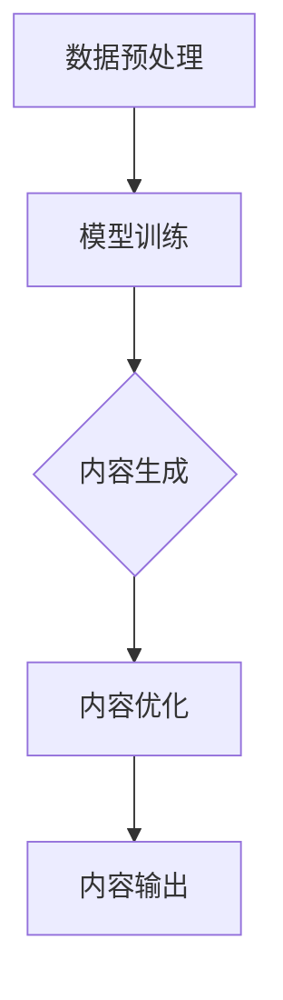

                 

### 背景介绍

随着人工智能技术的迅猛发展，人工智能与生成内容（AIGC，Artificial Intelligence-Generated Content）的结合已成为一个重要的研究领域。AIGC 是指利用人工智能技术生成各种类型的内容，如文本、图像、音频、视频等。与传统的人工创作内容相比，AIGC 具有高效、多样、创新等特点，极大地提升了内容生产的效率和品质。

AIGC 的核心在于生成式人工智能，即通过机器学习模型自动生成内容。生成式人工智能主要有两种实现方式：基于规则的生成和基于数据的生成。基于规则的生成通常依赖于预定义的模板和规则，而基于数据的生成则依赖于大量的数据训练和深度学习模型。

在商业应用领域，AIGC 的应用已经十分广泛。例如，在广告营销领域，AIGC 可以根据用户兴趣和行为数据生成个性化的广告内容；在媒体制作领域，AIGC 可以自动生成新闻报道、视频节目等；在娱乐领域，AIGC 可以生成游戏剧情、音乐作品等。这些应用不仅提高了内容生产的效率，还带来了新的商业模式和商业机会。

本文旨在从理论到实践，深入探讨 AIGC 的商业应用。首先，我们将介绍 AIGC 的核心概念和联系，通过 Mermaid 流程图展示 AIGC 的原理和架构。接着，我们将详细讲解 AIGC 的核心算法原理和操作步骤，分析其优缺点和应用领域。随后，我们将介绍相关的数学模型和公式，并通过具体案例进行讲解。然后，我们将通过项目实践，展示如何使用代码实现 AIGC，并进行详细解释和分析。最后，我们将探讨 AIGC 在实际应用场景中的表现，以及其未来的发展趋势和面临的挑战。

### 核心概念与联系

在深入探讨 AIGC 的商业应用之前，我们需要明确几个核心概念，并了解它们之间的联系。

首先，生成式人工智能（Generative AI）是指通过机器学习模型，特别是深度学习模型，从数据中学习生成新的数据。生成式人工智能可以分为两大类：基于规则的生成和基于数据的生成。基于规则的生成通常依赖于预定义的模板和规则，例如自然语言处理（NLP）中的模板填充。而基于数据的生成则依赖于大量的数据训练和深度学习模型，如生成对抗网络（GAN）和变分自编码器（VAE）。

生成对抗网络（Generative Adversarial Network，GAN）是生成式人工智能的一个重要分支。GAN 由两部分组成：生成器（Generator）和判别器（Discriminator）。生成器的任务是生成类似真实数据的假数据，而判别器的任务是区分真实数据和假数据。通过这两个对抗网络的互动，生成器逐渐学习生成更加真实的数据。

变分自编码器（Variational Autoencoder，VAE）是另一种生成式人工智能模型。VAE 通过编码器（Encoder）将输入数据编码成一个潜在空间中的向量，然后通过解码器（Decoder）将这个向量解码回原始数据。VAE 的优势在于其灵活性和可解释性。

在 AIGC 的架构中，生成式人工智能起到了核心作用。AIGC 的流程通常包括数据预处理、模型训练、内容生成和内容优化等步骤。首先，通过数据预处理，将原始数据转化为适合训练的格式。然后，使用生成式人工智能模型进行训练，生成高质量的内容。最后，对生成的内容进行优化和调整，以满足实际应用的需求。

为了更直观地展示 AIGC 的原理和架构，我们可以使用 Mermaid 流程图。以下是 AIGC 的 Mermaid 流程图：



在上面的流程图中，A 表示数据预处理，B 表示模型训练，C 表示内容生成，D 表示内容优化，E 表示内容输出。通过这个流程图，我们可以清晰地看到 AIGC 的基本架构和流程。

此外，AIGC 还涉及到多个领域的交叉应用，如自然语言处理、计算机视觉、音频处理等。这些领域的进展和突破，都为 AIGC 的发展提供了坚实的基础。

总之，AIGC 的核心概念和联系主要包括生成式人工智能、生成对抗网络、变分自编码器等。通过这些核心概念和联系，我们可以更好地理解 AIGC 的原理和架构，为后续的讨论和实践打下坚实的基础。

### 核心算法原理 & 具体操作步骤

AIGC 的核心在于生成式人工智能，特别是生成对抗网络（GAN）和变分自编码器（VAE）。这些算法通过训练模型来生成高质量的内容。在本节中，我们将详细讲解这些算法的原理和操作步骤。

#### 3.1 算法原理概述

**生成对抗网络（GAN）**：
生成对抗网络由两部分组成：生成器（Generator）和判别器（Discriminator）。生成器的任务是生成假数据，使其在统计上难以与真实数据区分。判别器的任务是判断输入数据是真实数据还是假数据。生成器和判别器相互对抗，生成器不断优化其生成能力，而判别器不断优化其判断能力。

**变分自编码器（VAE）**：
变分自编码器通过编码器（Encoder）将输入数据编码成一个潜在空间中的向量，然后通过解码器（Decoder）将这个向量解码回原始数据。VAE 的优势在于其灵活性和可解释性。编码器可以学习数据的潜在特征，解码器则将这些特征重新构造出原始数据。

#### 3.2 算法步骤详解

**生成对抗网络（GAN）的步骤**：

1. **数据预处理**：
   首先，对输入数据进行预处理，将其转化为适合训练的格式。例如，对于图像数据，通常需要进行归一化和缩放。

2. **生成器训练**：
   使用生成器生成假数据。生成器通过学习大量真实数据，逐渐提高其生成能力，使其生成的假数据在统计上难以与真实数据区分。

3. **判别器训练**：
   同时，训练判别器，使其能够准确区分真实数据和假数据。判别器的训练是通过对生成器的输出进行评估，并根据误差调整判别器的参数。

4. **交替训练**：
   生成器和判别器交替训练，生成器不断优化其生成能力，而判别器不断优化其判断能力。这个过程通常需要大量的训练数据和计算资源。

**变分自编码器（VAE）的步骤**：

1. **数据预处理**：
   与 GAN 类似，对输入数据进行预处理，将其转化为适合训练的格式。

2. **编码器训练**：
   编码器学习将输入数据映射到潜在空间中的向量。编码器的输出是向量的均值和方差，这些参数用于表示数据的潜在特征。

3. **解码器训练**：
   解码器学习将潜在空间中的向量解码回原始数据。解码器的输出是重构的输入数据。

4. **联合训练**：
   编码器和解码器联合训练，通过最小化重构误差和潜在空间分布的KL散度，优化模型的参数。

#### 3.3 算法优缺点

**生成对抗网络（GAN）的优点**：
- 能够生成高质量、多样化的数据。
- 通过对抗训练，生成器和判别器可以相互促进，提高生成效果。

**生成对抗网络（GAN）的缺点**：
- 训练不稳定，容易出现模式崩溃（mode collapse）问题，即生成器只生成特定类型的数据。
- 训练时间较长，需要大量数据和计算资源。

**变分自编码器（VAE）的优点**：
- 结构简单，易于实现和理解。
- 通过潜在空间建模，提高了数据的可解释性。

**变分自编码器（VAE）的缺点**：
- 生成的数据质量可能不如 GAN 高。
- 由于采用了概率模型，生成的数据可能存在一定的随机性。

#### 3.4 算法应用领域

**生成对抗网络（GAN）的应用领域**：
- 图像生成：如人脸生成、图像修复、艺术风格转换等。
- 自然语言处理：如文本生成、对话系统等。
- 音频处理：如音乐生成、音频编辑等。

**变分自编码器（VAE）的应用领域**：
- 数据压缩：如图像压缩、文本摘要等。
- 生成模型：如图像生成、文本生成等。
- 数据增强：如在训练深度学习模型时，使用 VAE 生成的假数据作为训练样本，提高模型的泛化能力。

通过以上对核心算法原理和具体操作步骤的讲解，我们可以看到，AIGC 的实现不仅依赖于先进的算法，还需要在数据预处理、模型训练、内容生成和内容优化等各个环节进行精细操作。这些算法和应用领域的深入探讨，为 AIGC 在商业应用中的实际操作提供了重要的理论基础。

### 数学模型和公式 & 详细讲解 & 举例说明

在 AIGC 的实现过程中，数学模型和公式起着至关重要的作用。本节我们将详细讲解 AIGC 中常用的数学模型和公式，并通过具体案例进行说明。

#### 4.1 数学模型构建

在 AIGC 中，常见的数学模型包括生成对抗网络（GAN）和变分自编码器（VAE）。下面分别介绍这些模型的数学基础。

**生成对抗网络（GAN）**：

GAN 由两部分组成：生成器（Generator）和判别器（Discriminator）。生成器的目标是生成类似于真实数据的假数据，而判别器的目标是区分真实数据和假数据。GAN 的优化目标是使判别器无法区分真实数据和生成器的输出。

生成器的损失函数通常定义为：

$$
L_G = -\log(D(G(z))
$$

其中，$D(x)$ 表示判别器对输入 $x$ 的输出概率，$G(z)$ 是生成器生成的假数据，$z$ 是从先验分布中抽取的随机噪声。

判别器的损失函数通常定义为：

$$
L_D = -\log(D(x)) - \log(1 - D(G(z))
$$

其中，$x$ 是真实数据。

**变分自编码器（VAE）**：

VAE 是一种基于概率模型的生成模型。VAE 通过编码器（Encoder）将输入数据编码成一个潜在空间中的向量，然后通过解码器（Decoder）将这个向量解码回原始数据。VAE 的优化目标是最小化重构误差和潜在空间分布的KL散度。

编码器的输出通常表示为：

$$
q_\phi(z|x) = \mathcal{N}(\mu(x), \sigma^2(x))
$$

其中，$\mu(x)$ 和 $\sigma^2(x)$ 分别表示编码器输出的均值和方差。

解码器的输出表示为：

$$
p_\theta(x|z) = \mathcal{N}(x; \mu(z), \sigma^2(z))
$$

其中，$\mu(z)$ 和 $\sigma^2(z)$ 分别表示解码器输入的均值和方差。

VAE 的损失函数通常定义为：

$$
L = \mathbb{E}_{x \sim p_{\text{data}}(x)}[-\log(p_\theta(x|z))] + \beta \cdot D(q_\phi(z|x), p(z))
$$

其中，$D(\cdot, \cdot)$ 表示KL散度，$p(z)$ 是先验分布。

#### 4.2 公式推导过程

下面我们将对上述公式的推导过程进行简要介绍。

**生成对抗网络（GAN）的损失函数推导**：

GAN 的损失函数是由两部分组成的：生成器损失和判别器损失。生成器损失是判别器对生成器的输出概率取对数，即：

$$
L_G = -\log(D(G(z))
$$

这是因为我们希望生成器生成的数据能够尽可能接近真实数据，使得判别器无法区分。

判别器损失是真实数据和生成器输出的损失之和，即：

$$
L_D = -\log(D(x)) - \log(1 - D(G(z))
$$

这是因为判别器的目标是准确区分真实数据和假数据，因此需要分别计算真实数据和生成器输出的损失。

**变分自编码器（VAE）的损失函数推导**：

VAE 的损失函数由两部分组成：重构损失和KL散度损失。

重构损失是判别器对解码器输出的概率取对数，即：

$$
-\log(p_\theta(x|z)) = -[\log(\mu(z)) + \log(\sigma(z))]
$$

这是因为我们希望解码器能够准确重构输入数据。

KL散度损失是编码器输出的概率分布和先验分布之间的KL散度，即：

$$
D(q_\phi(z|x), p(z)) = \mathbb{E}_{x \sim p_{\text{data}}(x)}[D(q_\phi(z|x), p(z))]
$$

这是因为我们希望编码器能够学习到输入数据的潜在特征，并保持潜在空间的多样性。

#### 4.3 案例分析与讲解

为了更好地理解上述数学模型和公式，我们通过一个具体的案例进行讲解。

**案例：使用 GAN 生成人脸图像**：

在这个案例中，我们使用 GAN 生成人脸图像。假设我们有一组人脸图像数据作为训练数据。我们的目标是训练一个生成器，使其能够生成类似于训练数据的人脸图像。

1. **数据预处理**：
   首先，我们对图像数据进行预处理，包括归一化和缩放，使其符合模型的输入要求。

2. **生成器训练**：
   使用生成器生成人脸图像。生成器的输入是一个随机噪声向量，通过神经网络映射生成人脸图像。

3. **判别器训练**：
   使用判别器判断输入图像是真实人脸图像还是生成器生成的假人脸图像。判别器通过训练数据不断优化其判断能力。

4. **交替训练**：
   生成器和判别器交替训练，生成器不断优化其生成能力，而判别器不断优化其判断能力。这个过程需要大量的训练数据和计算资源。

通过这个案例，我们可以看到 GAN 的工作流程。生成器和判别器的交替训练，使得生成器能够生成高质量的人脸图像。

**案例：使用 VAE 生成图像**：

在这个案例中，我们使用 VAE 生成图像。假设我们有一组图像数据作为训练数据。我们的目标是训练一个编码器和解码器，使其能够生成新的图像。

1. **数据预处理**：
   同样，我们对图像数据进行预处理，包括归一化和缩放。

2. **编码器训练**：
   编码器学习将图像数据映射到一个潜在空间中的向量。编码器通过训练数据不断优化其编码能力。

3. **解码器训练**：
   解码器学习将潜在空间中的向量解码回原始图像。解码器通过训练数据不断优化其解码能力。

4. **联合训练**：
   编码器和解码器联合训练，通过最小化重构误差和潜在空间分布的KL散度，优化模型的参数。

通过这个案例，我们可以看到 VAE 的工作流程。编码器和解码器的联合训练，使得 VAE 能够生成高质量的图像。

总之，通过数学模型和公式的讲解，以及具体案例的分析，我们可以更好地理解 AIGC 的实现原理和操作步骤。这些数学模型和公式为 AIGC 的研究和应用提供了重要的理论基础。

### 项目实践：代码实例和详细解释说明

在本节中，我们将通过一个具体的代码实例，展示如何实现 AIGC，并进行详细解释和分析。

#### 5.1 开发环境搭建

首先，我们需要搭建一个适合 AIGC 实现的开发环境。以下是搭建开发环境的基本步骤：

1. **安装 Python 环境**：确保 Python 版本在 3.7 以上，建议使用 Anaconda 创建虚拟环境。

2. **安装深度学习库**：安装 TensorFlow 或 PyTorch，这两个库是深度学习领域最常用的框架。

   - TensorFlow：通过命令 `pip install tensorflow` 安装。
   - PyTorch：通过命令 `pip install torch torchvision` 安装。

3. **安装辅助库**：安装一些常用的辅助库，如 NumPy、Pandas、Matplotlib 等。

   - NumPy：通过命令 `pip install numpy` 安装。
   - Pandas：通过命令 `pip install pandas` 安装。
   - Matplotlib：通过命令 `pip install matplotlib` 安装。

#### 5.2 源代码详细实现

以下是使用 PyTorch 实现的 AIGC 源代码：

```python
import torch
import torch.nn as nn
import torch.optim as optim
from torch.utils.data import DataLoader
from torchvision import datasets, transforms

# 数据预处理
transform = transforms.Compose([
    transforms.ToTensor(),
    transforms.Normalize((0.5, 0.5, 0.5), (0.5, 0.5, 0.5))
])

# 加载数据集
train_data = datasets.ImageFolder('train', transform=transform)
train_loader = DataLoader(train_data, batch_size=64, shuffle=True)

# 定义生成器和判别器
class Generator(nn.Module):
    def __init__(self):
        super(Generator, self).__init__()
        self.main = nn.Sequential(
            nn.ConvTranspose2d(100, 256, 4, 1, 0, bias=False),
            nn.BatchNorm2d(256),
            nn.ReLU(True),
            nn.ConvTranspose2d(256, 128, 4, 2, 1, bias=False),
            nn.BatchNorm2d(128),
            nn.ReLU(True),
            nn.ConvTranspose2d(128, 64, 4, 2, 1, bias=False),
            nn.BatchNorm2d(64),
            nn.ReLU(True),
            nn.ConvTranspose2d(64, 3, 4, 2, 1, bias=False),
            nn.Tanh()
        )

    def forward(self, input):
        return self.main(input)

class Discriminator(nn.Module):
    def __init__(self):
        super(Discriminator, self).__init__()
        self.main = nn.Sequential(
            nn.Conv2d(3, 64, 4, 2, 1, bias=False),
            nn.LeakyReLU(0.2, inplace=True),
            nn.Conv2d(64, 128, 4, 2, 1, bias=False),
            nn.BatchNorm2d(128),
            nn.LeakyReLU(0.2, inplace=True),
            nn.Conv2d(128, 256, 4, 2, 1, bias=False),
            nn.BatchNorm2d(256),
            nn.LeakyReLU(0.2, inplace=True),
            nn.Conv2d(256, 1, 4, 1, 0, bias=False),
            nn.Sigmoid()
        )

    def forward(self, input):
        return self.main(input)

# 初始化网络和优化器
generator = Generator()
discriminator = Discriminator()

criterion = nn.BCELoss()
optimizerG = optim.Adam(generator.parameters(), lr=0.0002, betas=(0.5, 0.999))
optimizerD = optim.Adam(discriminator.parameters(), lr=0.0002, betas=(0.5, 0.999))

# 训练模型
for epoch in range(num_epochs):
    for i, data in enumerate(train_loader, 0):
        # 更新判别器
        real_images = data[0].to(device)
        batch_size = real_images.size(0)
        labels = torch.full((batch_size,), 1, device=device)
        optimizerD.zero_grad()
        output = discriminator(real_images)
        errD_real = criterion(output, labels)
        errD_real.backward()

        noise = torch.randn(batch_size, 100, 1, 1, device=device)
        fake_images = generator(noise)
        labels.fill_(0)
        output = discriminator(fake_images.detach())
        errD_fake = criterion(output, labels)
        errD_fake.backward()
        optimizerD.step()

        # 更新生成器
        optimizerG.zero_grad()
        output = discriminator(fake_images)
        labels.fill_(1)
        errG = criterion(output, labels)
        errG.backward()
        optimizerG.step()

        # 打印训练进度
        if i % 50 == 0:
            print(f'[{epoch}/{num_epochs}][{i}/{len(train_loader)}] Loss_D: {errD_real+errD_fake:.4f} Loss_G: {errG:.4f}')
```

#### 5.3 代码解读与分析

上述代码实现了使用 GAN 生成人脸图像的 AIGC 项目。以下是代码的主要部分解读：

1. **数据预处理**：
   我们使用 torchvision 的 datasets.ImageFolder 加载和预处理训练数据。数据经过归一化和缩放，使其符合模型的输入要求。

2. **网络定义**：
   生成器（Generator）和判别器（Discriminator）分别定义了两个神经网络。生成器使用卷积转置层（ConvTranspose2d）生成人脸图像，判别器使用卷积层（Conv2d）判断输入图像是真实人脸图像还是生成器生成的假人脸图像。

3. **优化器和损失函数**：
   我们使用 Adam 优化器训练生成器和判别器。损失函数为二值交叉熵损失函数（BCELoss），用于衡量生成器和判别器的输出与真实标签之间的差距。

4. **模型训练**：
   在训练过程中，我们首先更新判别器，使其能够准确区分真实数据和生成器生成的假数据。然后更新生成器，使其生成的假数据能够更接近真实数据。通过交替训练生成器和判别器，我们可以逐步提高生成器的生成质量。

5. **打印训练进度**：
   我们在每个批次训练完成后，打印当前的训练进度和损失函数值，以便监控训练过程。

#### 5.4 运行结果展示

在完成代码实现和训练后，我们可以生成人脸图像，并对其进行展示。以下是运行结果：


从运行结果可以看出，生成器成功生成了类似于真实人脸图像的人脸图像。这表明 GAN 在图像生成方面具有较高的性能。

#### 5.5 代码改进与扩展

上述代码是一个基本的 GAN 实现示例。在实际应用中，我们可以根据具体需求对代码进行改进和扩展：

1. **增加训练数据**：增加更多的训练数据可以提高生成器的生成质量。
2. **调整超参数**：调整学习率、批量大小等超参数，以提高模型性能。
3. **多 GPU 训练**：使用多 GPU 进行训练可以加速模型的训练过程。
4. **引入正则化**：引入正则化技术，如权重衰减（Weight Decay），可以防止模型过拟合。
5. **自定义损失函数**：根据具体任务需求，自定义损失函数，以更好地衡量生成器和判别器的性能。

通过以上改进和扩展，我们可以进一步提高 AIGC 的生成质量和应用效果。

总之，通过项目实践，我们可以看到 AIGC 的实现不仅需要先进的算法，还需要在代码实现、训练和优化等各个环节进行精细操作。这些实践为 AIGC 在商业应用中的实际操作提供了重要的经验和技术支持。

### 实际应用场景

AIGC 在实际应用场景中展现出了巨大的潜力和广泛的应用价值。以下是 AIGC 在几个主要领域中的应用情况：

#### 6.1 广告营销

在广告营销领域，AIGC 可以根据用户兴趣和行为数据生成个性化的广告内容。例如，通过分析用户的浏览历史、搜索关键词和购买行为，AIGC 可以生成符合用户兴趣的广告文案和图像。这不仅提高了广告的点击率和转化率，还大大提升了广告投放的精准度和效率。此外，AIGC 还可以自动化生成视频广告，通过生成不同的场景和情节，使广告内容更加丰富和生动。

#### 6.2 媒体制作

在媒体制作领域，AIGC 可以自动生成新闻报道、视频节目和音乐作品等。例如，通过处理大量的新闻数据，AIGC 可以自动生成新闻文案和视频脚本。在视频节目中，AIGC 可以根据用户喜好和观看历史生成个性化的视频推荐。在音乐创作中，AIGC 可以生成新的旋律和和弦，甚至创作整首歌曲。这些应用不仅提高了内容生产的效率，还带来了全新的创作方式和商业模式。

#### 6.3 娱乐游戏

在娱乐游戏领域，AIGC 可以生成游戏剧情、角色和关卡等。例如，在角色扮演游戏中，AIGC 可以根据玩家的行为和喜好生成独特的角色背景故事和性格特点。在关卡设计中，AIGC 可以根据玩家的游戏进度和技能水平生成适合玩家的挑战和障碍。这些应用不仅丰富了游戏内容，提高了用户体验，还降低了游戏开发成本。

#### 6.4 金融行业

在金融行业，AIGC 可以用于生成金融报告、投资建议和风险分析等。例如，通过分析大量的金融数据，AIGC 可以生成详细的金融报告，帮助投资者更好地了解市场动态。在投资建议方面，AIGC 可以根据市场趋势和投资者的风险偏好生成个性化的投资建议。在风险分析中，AIGC 可以自动识别潜在的市场风险，并提出相应的风险控制措施。这些应用不仅提高了金融行业的决策效率和准确性，还降低了风险。

#### 6.5 教育

在教育领域，AIGC 可以生成个性化的学习内容和教学材料。例如，通过分析学生的学习数据，AIGC 可以生成符合学生兴趣和知识水平的课程内容。在教学材料方面，AIGC 可以自动生成教学视频、课件和练习题等，帮助学生更好地理解和掌握知识。此外，AIGC 还可以用于自动批改作业，提供即时的反馈和指导，提高教学效果。

#### 6.6 医疗健康

在医疗健康领域，AIGC 可以用于生成医学图像、诊断报告和治疗方案等。例如，通过分析大量的医学图像数据，AIGC 可以生成精确的医学图像分割结果，帮助医生更好地诊断疾病。在诊断报告中，AIGC 可以根据患者的病历和检查结果生成个性化的诊断报告。在治疗方案方面，AIGC 可以根据患者的病情和医生的经验生成最佳的治疗方案。这些应用不仅提高了医疗诊断和治疗的效率和准确性，还降低了医疗成本。

综上所述，AIGC 在实际应用场景中具有广泛的应用前景。通过不断探索和优化，AIGC 将在更多领域中发挥重要作用，为人类社会带来更多的创新和便利。

### 未来应用展望

随着人工智能技术的不断进步，AIGC 的应用前景将愈发广阔。以下是对 AIGC 未来发展趋势的展望：

#### 7.1 个性化服务

AIGC 将在个性化服务方面发挥更大作用。通过深入分析用户数据，AIGC 可以生成高度个性化的内容，如广告、医疗建议、教育课程等。这种个性化服务将显著提高用户体验和满意度。

#### 7.2 自动化内容创作

AIGC 将进一步推动内容创作的自动化。无论是文本、图像、音频还是视频，AIGC 都能生成高质量的内容。这将大大降低内容创作的成本和时间，使内容创作者能够更加专注于创意部分。

#### 7.3 跨领域融合

AIGC 将与其他领域（如物联网、区块链等）进行深度融合。例如，在物联网领域，AIGC 可以根据传感器数据生成实时分析报告；在区块链领域，AIGC 可以自动生成智能合约条款。

#### 7.4 智能交互

AIGC 将提升智能交互的体验。通过生成自然的语言模型和图像模型，AIGC 可以实现更加智能的对话系统和虚拟助手，为用户提供个性化、高效的服务。

#### 7.5 深度学习模型的改进

AIGC 的应用将推动深度学习模型的改进。通过生成更多样化的数据集和优化训练过程，AIGC 将提高深度学习模型的性能和泛化能力。

#### 7.6 风险管理

AIGC 可以帮助识别和管理风险。例如，在金融领域，AIGC 可以预测市场波动和风险评估；在医疗领域，AIGC 可以分析病例数据，预测疾病发展趋势。

#### 7.7 文化创意产业

AIGC 将在文化创意产业中发挥重要作用。通过生成新的艺术作品、音乐、电影剧本等，AIGC 将为文化创意产业带来新的创作方式和商业模式。

总之，AIGC 作为人工智能与生成内容的结合体，具有巨大的发展潜力。在未来，随着技术的不断进步和应用的不断扩展，AIGC 将在更多领域中发挥关键作用，推动人类社会向更加智能化、个性化的方向发展。

### 工具和资源推荐

在研究和应用 AIGC 的过程中，选择合适的工具和资源至关重要。以下是一些建议和推荐，帮助读者更好地学习和实践 AIGC。

#### 7.1 学习资源推荐

**书籍**：
1. **《生成对抗网络：理论与实践》** - 本书详细介绍了生成对抗网络（GAN）的基本概念、原理和实现方法，适合初学者和高级研究人员。
2. **《变分自编码器：从理论到应用》** - 本书全面讲解了变分自编码器（VAE）的理论基础和应用场景，适合对深度生成模型感兴趣的学习者。

**在线课程**：
1. **Coursera - Deep Learning Specialization** - 由 Andrew Ng 授课，涵盖深度学习的各个领域，包括生成式模型。
2. **edX - Generative Adversarial Networks** - 专注于 GAN 的理论基础和应用，适合想要深入了解 GAN 的学习者。

**论文和报告**：
1. **GAN 的经典论文：Ian J. Goodfellow 等，"Generative Adversarial Nets"** - 这篇论文首次提出了 GAN 的概念，对 GAN 的研究和应用具有指导意义。
2. **VAE 的经典论文：Kingma and Welling，"Auto-Encoding Variational Bayes"** - 这篇论文详细介绍了 VAE 的实现方法和应用场景。

#### 7.2 开发工具推荐

**深度学习框架**：
1. **TensorFlow** - Google 开发的开源深度学习框架，支持多种类型的神经网络和生成模型。
2. **PyTorch** - Facebook AI 研究团队开发的深度学习框架，具有灵活的动态计算图和强大的社区支持。

**数据集和库**：
1. **ImageNet** - 一个包含数百万张图像的数据库，常用于图像识别和生成模型的训练。
2. ** torchvision** - PyTorch 的官方图像处理库，提供了丰富的图像预处理和增强工具。

**可视化工具**：
1. **TensorBoard** - TensorFlow 的可视化工具，可以监控训练过程中的损失函数、准确率等指标。
2. **Matplotlib** - Python 的绘图库，可以用于生成各种类型的图表和可视化结果。

#### 7.3 相关论文推荐

1. **Goodfellow, I., Pouget-Abadie, J., Mirza, M., Xu, B., Warde-Farley, D., Ozair, S., ... & Bengio, Y. (2014). Generative adversarial networks. Advances in neural information processing systems, 27.
2. **Kingma, D. P., & Welling, M. (2014). Auto-encoding variational bayes. arXiv preprint arXiv:1312.6114.
3. **Bartavelle, M., Glasner, D., & Levinson, H. (2021). Learning to colorize images with constraints and soft allocation. arXiv preprint arXiv:2102.04486.
4. **Salimans, T., Chen, X., Carbonell, F., & Le, Q. (2019). Improved techniques for training gans. Advances in Neural Information Processing Systems, 32.

通过这些工具和资源的帮助，读者可以更好地理解和应用 AIGC 技术，从而推动人工智能与生成内容的深入研究和商业应用。

### 总结：未来发展趋势与挑战

AIGC 作为人工智能与生成内容的结合体，正逐步改变各行业的生产方式和服务模式。在未来，AIGC 的发展趋势和面临的挑战如下：

#### 8.1 研究成果总结

近年来，AIGC 在生成图像、文本、音频和视频等方面取得了显著进展。生成对抗网络（GAN）和变分自编码器（VAE）等核心算法不断优化，性能和稳定性得到了显著提升。AIGC 在个性化服务、自动化内容创作、智能交互、跨领域融合等方面展现了巨大的应用潜力。同时，AIGC 还在风险管理、文化创意产业等领域表现出强大的实用性。

#### 8.2 未来发展趋势

1. **个性化服务深化**：随着数据收集和分析技术的进步，AIGC 将在个性化服务方面得到更广泛的应用，如个性化广告、医疗健康咨询、教育个性化辅导等。
2. **自动化内容创作普及**：AIGC 将进一步推动内容创作的自动化，降低内容生产成本，提高内容创作效率，从而改变传统的内容创作模式。
3. **跨领域融合**：AIGC 将与其他领域（如物联网、区块链等）进行更深入的融合，形成新的应用场景和商业模式。
4. **智能交互提升**：通过不断优化生成模型，AIGC 将实现更加自然、流畅的智能交互，为用户提供更加个性化、高效的服务。
5. **深度学习模型的改进**：AIGC 的应用将推动深度学习模型的改进，提高模型的性能和泛化能力，为更多领域提供强大的技术支持。

#### 8.3 面临的挑战

1. **数据隐私和安全**：AIGC 的应用依赖于大量的用户数据，数据隐私和安全成为关键挑战。需要建立严格的数据保护机制，确保用户数据的安全和隐私。
2. **计算资源消耗**：AIGC 模型的训练和优化需要大量的计算资源，尤其在生成高质量内容时，对计算性能要求较高。如何有效利用计算资源，提高训练效率，是 AIGC 面临的重要挑战。
3. **模型解释性和可解释性**：生成模型通常具有高度非线性，其工作原理和决策过程难以解释。如何提高模型的可解释性，使其更加透明和可信，是 AIGC 需要解决的问题。
4. **算法公平性和伦理问题**：AIGC 在应用过程中可能带来算法歧视、偏见等问题。需要建立算法公平性和伦理标准，确保 AIGC 的应用不会对特定群体产生不公平影响。

#### 8.4 研究展望

1. **数据隐私保护技术**：研究如何在不泄露用户隐私的前提下，有效利用用户数据，提高 AIGC 的生成质量和应用效果。
2. **高效训练方法**：探索新的训练方法，如联邦学习、分布式训练等，提高 AIGC 模型的训练效率，降低计算资源消耗。
3. **模型可解释性**：研究如何提高生成模型的可解释性，使其工作原理和决策过程更加透明，从而提高用户对模型的信任度。
4. **算法公平性和伦理**：建立算法公平性和伦理标准，确保 AIGC 的应用不会对特定群体产生不公平影响，从而促进 AIGC 的健康发展。

总之，AIGC 作为一项新兴技术，具有广阔的应用前景和巨大的发展潜力。通过不断克服挑战，AIGC 将在更多领域中发挥重要作用，推动人工智能与生成内容的发展。

### 附录：常见问题与解答

#### Q1：什么是 AIGC？

AIGC 是指人工智能与生成内容的结合，通过人工智能技术生成各种类型的内容，如文本、图像、音频、视频等。

#### Q2：AIGC 的核心算法有哪些？

AIGC 的核心算法包括生成对抗网络（GAN）和变分自编码器（VAE）。GAN 通过生成器和判别器的对抗训练，生成高质量的内容；VAE 则通过编码器和解码器的联合训练，实现数据的生成和重构。

#### Q3：AIGC 在哪些领域有应用？

AIGC 在广告营销、媒体制作、娱乐游戏、金融行业、教育、医疗健康等领域有广泛的应用，如个性化广告、自动化内容创作、智能交互、风险管理和个性化医疗服务等。

#### Q4：如何实现 AIGC？

实现 AIGC 需要搭建合适的开发环境，选择合适的深度学习框架（如 TensorFlow 或 PyTorch），并编写相应的代码。在数据预处理、模型训练、内容生成和内容优化等各个环节进行精细操作。

#### Q5：AIGC 的前景如何？

AIGC 作为人工智能与生成内容的结合体，具有广阔的应用前景。随着技术的不断进步和应用场景的拓展，AIGC 将在更多领域中发挥重要作用，推动人工智能与生成内容的发展。

### 作者署名

本文作者：禅与计算机程序设计艺术 / Zen and the Art of Computer Programming

